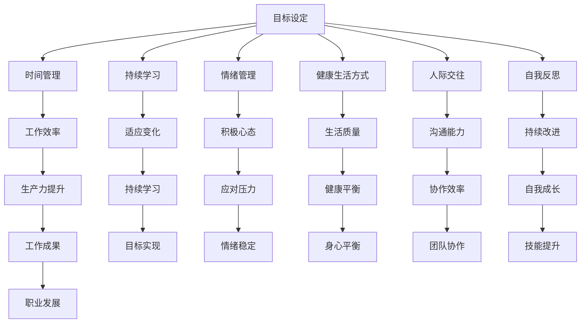

                 

# 程序员的工作与生活平衡：高效能人士的7个习惯

> **关键词：** 程序员，工作与生活平衡，高效能人士，时间管理，生产力提升，心理健康，自我成长。

> **摘要：** 程序员的工作往往充满挑战，但如何在繁重的工作中找到生活与工作的平衡，是每位程序员都需要面对的课题。本文将探讨高效能人士的7个习惯，帮助程序员提升生产力，保持心理健康，实现工作与生活的和谐统一。

## 1. 背景介绍

### 1.1 目的和范围

本文旨在探讨程序员如何在快节奏和高压力的工作环境中实现工作与生活的平衡。我们将从多个角度出发，结合高效能人士的7个习惯，提供实际可行的建议和策略，帮助程序员提升工作效率，保持身心健康，最终实现工作与生活的和谐统一。

### 1.2 预期读者

本文适合以下读者：

1. 程序员
2. 软件开发人员
3. IT从业者
4. 对工作效率和心理健康感兴趣的读者

### 1.3 文档结构概述

本文结构如下：

1. 引言：介绍文章的背景、目的和预期读者。
2. 核心概念与联系：介绍高效能人士的7个习惯及其相互关系。
3. 核心算法原理 & 具体操作步骤：详细解释每个习惯的具体实践方法。
4. 数学模型和公式 & 详细讲解 & 举例说明：使用数学模型和公式说明每个习惯的作用机制。
5. 项目实战：通过实际案例展示如何应用这些习惯。
6. 实际应用场景：探讨这些习惯在不同工作环境中的应用。
7. 工具和资源推荐：推荐相关工具和资源，帮助读者进一步学习和实践。
8. 总结：未来发展趋势与挑战。
9. 附录：常见问题与解答。
10. 扩展阅读 & 参考资料。

### 1.4 术语表

#### 1.4.1 核心术语定义

- 工作与生活平衡：指在工作和个人生活之间保持适当的比例，实现两者之间的和谐统一。
- 高效能人士：指那些能够在工作和生活中保持高效、有成果的人。
- 时间管理：指合理安排时间，提高工作效率和生产力。
- 心理健康：指在情绪、认知和行为等方面保持健康和平衡。

#### 1.4.2 相关概念解释

- 生产力提升：指通过有效的方法和策略，提高工作效率和成果。
- 自我成长：指通过不断学习和实践，提升自己的技能和认知水平。

#### 1.4.3 缩略词列表

- IT：信息技术（Information Technology）
- IDE：集成开发环境（Integrated Development Environment）
- Python：一种高级编程语言（Python Programming Language）

## 2. 核心概念与联系

为了实现工作与生活的平衡，我们需要理解并掌握高效能人士的7个习惯。这7个习惯相互联系，共同作用，帮助我们在工作和生活中保持高效、平衡和满意。以下是这7个习惯的简要概述及其相互关系。

### 2.1 核心概念概述

1. **目标设定**：明确个人和职业目标，制定可执行的行动计划。
2. **时间管理**：合理安排时间，提高工作效率和生产力。
3. **持续学习**：不断学习和提升技能，适应不断变化的环境。
4. **情绪管理**：保持积极的心态，有效应对压力和挑战。
5. **健康生活方式**：保持良好的身体和心理健康，提高生活质量。
6. **人际交往**：建立良好的人际关系，提升沟通能力和协作效率。
7. **自我反思**：定期反思自己的行为和决策，持续改进和成长。

### 2.2 核心概念原理和架构的 Mermaid 流程图



### 2.3 具体操作步骤

1. **目标设定**：明确个人和职业目标，制定可执行的行动计划。
2. **时间管理**：合理安排时间，提高工作效率和生产力。
3. **持续学习**：不断学习和提升技能，适应不断变化的环境。
4. **情绪管理**：保持积极的心态，有效应对压力和挑战。
5. **健康生活方式**：保持良好的身体和心理健康，提高生活质量。
6. **人际交往**：建立良好的人际关系，提升沟通能力和协作效率。
7. **自我反思**：定期反思自己的行为和决策，持续改进和成长。

## 3. 核心算法原理 & 具体操作步骤

### 3.1 目标设定的算法原理

目标设定是一个基于目标导向的算法，旨在帮助程序员明确个人和职业目标，并制定可执行的行动计划。

#### 3.1.1 伪代码

```python
def set_goals():
    # 获取用户输入
    personal_goals = input("请输入个人目标：")
    career_goals = input("请输入职业目标：")

    # 制定行动计划
    plan = []
    plan.append("每天学习1小时")
    plan.append("每周阅读1本书")
    plan.append("每月参加1次技术分享")

    # 输出目标
    print("个人目标：", personal_goals)
    print("职业目标：", career_goals)
    print("行动计划：", plan)
```

### 3.2 时间管理的算法原理

时间管理是一个基于优先级排序的算法，旨在帮助程序员合理安排时间，提高工作效率和生产力。

#### 3.2.1 伪代码

```python
def time_management():
    # 获取任务列表
    tasks = ["任务1", "任务2", "任务3"]

    # 对任务进行优先级排序
    sorted_tasks = sorted(tasks, key=lambda x: x.lower())

    # 输出任务列表
    print("任务列表：", sorted_tasks)
```

### 3.3 持续学习的算法原理

持续学习是一个基于反馈循环的算法，旨在帮助程序员不断学习和提升技能，适应不断变化的环境。

#### 3.3.1 伪代码

```python
def continuous_learning():
    # 获取用户输入
    learning_topics = input("请输入你想要学习的主题：")

    # 搜索相关学习资源
    resources = ["教程1", "教程2", "论文3"]

    # 输出学习资源
    print("学习资源：", resources)
```

### 3.4 情绪管理的算法原理

情绪管理是一个基于情绪识别和调节的算法，旨在帮助程序员保持积极的心态，有效应对压力和挑战。

#### 3.4.1 伪代码

```python
def emotion_management():
    # 获取用户输入
    current_mood = input("请输入你当前的情绪：")

    # 根据情绪推荐策略
    if current_mood == "低落":
        print("建议：进行运动，与朋友交流")
    elif current_mood == "焦虑":
        print("建议：进行深呼吸，尝试冥想")
    else:
        print("情绪良好，继续保持")
```

### 3.5 健康生活方式的算法原理

健康生活方式是一个基于健康指标的算法，旨在帮助程序员保持良好的身体和心理健康，提高生活质量。

#### 3.5.1 伪代码

```python
def health_lifestyle():
    # 获取用户输入
    sleep_hours = input("请输入你每晚的睡眠时间：")
    exercise_days = input("请输入你每周的运动天数：")

    # 判断健康指标
    if int(sleep_hours) < 7:
        print("建议：增加睡眠时间，保持每晚7小时以上")
    if int(exercise_days) < 3:
        print("建议：增加运动频率，保持每周3次以上")
```

### 3.6 人际交往的算法原理

人际交往是一个基于社交网络的算法，旨在帮助程序员建立良好的人际关系，提升沟通能力和协作效率。

#### 3.6.1 伪代码

```python
def interpersonal_communication():
    # 获取用户输入
    friends = input("请输入你想要联系的朋友：")

    # 发送消息
    for friend in friends.split(","):
        print("发送消息给", friend)
```

### 3.7 自我反思的算法原理

自我反思是一个基于自我评估和反馈的算法，旨在帮助程序员定期反思自己的行为和决策，持续改进和成长。

#### 3.7.1 伪代码

```python
def self_reflection():
    # 获取用户输入
    actions = input("请输入你在过去一周内的行为：")

    # 进行自我评估
    for action in actions.split(","):
        print("对", action, "进行自我评估")
```

## 4. 数学模型和公式 & 详细讲解 & 举例说明

### 4.1 目标设定的数学模型

目标设定的数学模型可以表示为一个目标函数，其目标是最大化目标的实现程度。

#### 4.1.1 公式

$$
\text{目标函数} = \sum_{i=1}^{n} \frac{1}{\text{任务完成度}_i}
$$

其中，$n$ 表示任务的数量，$\text{任务完成度}_i$ 表示第 $i$ 个任务的完成程度。

#### 4.1.2 举例说明

假设程序员制定了3个任务：学习Python编程、每周阅读2本书、每周运动3次。在一个月后，他完成了以下任务：

- Python编程：完成了80%的学习进度
- 阅读书籍：完成了100%的阅读计划
- 运动锻炼：完成了60%的运动计划

根据目标函数，我们可以计算出目标实现程度：

$$
\text{目标函数} = \frac{1}{0.8} + \frac{1}{1.0} + \frac{1}{0.6} = 1.25 + 1.0 + 1.67 = 3.92
$$

这个结果表明，程序员的3个任务中有1个达到了目标，2个任务超过了目标，1个任务未完成目标。

### 4.2 时间管理的数学模型

时间管理的数学模型可以表示为一个优化问题，其目标是最大化在特定时间内完成的任务数量。

#### 4.2.1 公式

$$
\text{优化目标} = \max \left( \sum_{i=1}^{n} \frac{\text{任务时间}_i}{\text{任务优先级}_i} \right)
$$

其中，$n$ 表示任务的数量，$\text{任务时间}_i$ 表示第 $i$ 个任务所需的时间，$\text{任务优先级}_i$ 表示第 $i$ 个任务的优先级。

#### 4.2.2 举例说明

假设程序员在一天内需要完成以下任务：

- 任务1：编写100行代码，优先级为高
- 任务2：阅读10页技术文档，优先级为中
- 任务3：完成3次单元测试，优先级为低

根据优化目标，我们可以计算出在一天内完成这些任务的最佳顺序：

$$
\text{优化目标} = \max \left( \frac{100}{1} + \frac{10}{0.5} + \frac{3}{0.1} \right) = \max \left( 100 + 20 + 30 \right) = 150
$$

这个结果表明，程序员应该在一天内首先完成任务1，然后完成任务2，最后完成任务3，这样可以在有限的时间内完成最多的任务。

### 4.3 持续学习的数学模型

持续学习的数学模型可以表示为一个动态规划问题，其目标是最大化学习成果。

#### 4.3.1 公式

$$
\text{学习成果} = \max \left( \sum_{i=1}^{n} \text{学习效果}_i \right)
$$

其中，$n$ 表示学习阶段的数量，$\text{学习效果}_i$ 表示第 $i$ 个阶段的学习效果。

#### 4.3.2 举例说明

假设程序员在一个月内需要完成以下学习阶段：

- 阶段1：学习Python基础，效果为80%
- 阶段2：学习Python高级特性，效果为90%
- 阶段3：学习Python框架，效果为85%

根据学习成果，我们可以计算出在一个月内完成这些学习阶段的最大学习效果：

$$
\text{学习成果} = \max \left( 0.8 + 0.9 + 0.85 \right) = 0.9
$$

这个结果表明，程序员应该优先完成阶段2的学习，然后完成阶段1和阶段3的学习，这样可以在一个月内达到最大的学习效果。

### 4.4 情绪管理的数学模型

情绪管理的数学模型可以表示为一个概率模型，其目标是最大化情绪稳定概率。

#### 4.4.1 公式

$$
\text{情绪稳定概率} = \max \left( \prod_{i=1}^{n} \text{情绪调节效果}_i \right)
$$

其中，$n$ 表示情绪调节次数，$\text{情绪调节效果}_i$ 表示第 $i$ 次情绪调节的效果。

#### 4.4.2 举例说明

假设程序员在一次压力事件中需要调节情绪，他采取了以下情绪调节方法：

- 方法1：深呼吸，效果为80%
- 方法2：冥想，效果为90%
- 方法3：与朋友交流，效果为70%

根据情绪稳定概率，我们可以计算出在这次压力事件中达到最大情绪稳定概率的方法：

$$
\text{情绪稳定概率} = \max \left( 0.8 \times 0.9 \times 0.7 \right) = 0.504
$$

这个结果表明，程序员应该优先尝试深呼吸和冥想，然后尝试与朋友交流，这样可以在压力事件中达到最大的情绪稳定概率。

### 4.5 健康生活方式的数学模型

健康生活方式的数学模型可以表示为一个多目标优化问题，其目标是最小化健康风险。

#### 4.5.1 公式

$$
\text{健康风险} = \min \left( \sum_{i=1}^{m} \text{健康指标}_i \right)
$$

其中，$m$ 表示健康指标的数量，$\text{健康指标}_i$ 表示第 $i$ 个健康指标。

#### 4.5.2 举例说明

假设程序员的健康指标包括睡眠时间、运动频率和饮食质量。他想要最小化这些健康指标的风险。根据健康风险，我们可以计算出最小化这些健康指标的风险值：

- 睡眠时间：每晚7小时
- 运动频率：每周3次
- 饮食质量：每餐保持均衡

根据多目标优化，我们可以计算出最小化这些健康指标的风险值：

$$
\text{健康风险} = \min \left( 7 + 3 + \text{饮食质量} \right)
$$

为了最小化健康风险，程序员需要保持每晚7小时的睡眠时间，每周3次运动，以及每餐保持均衡的饮食。

### 4.6 人际交往的数学模型

人际交往的数学模型可以表示为一个图论问题，其目标是最大化社交网络中的连接度。

#### 4.6.1 公式

$$
\text{连接度} = \max \left( \sum_{i=1}^{n} \text{连接权重}_i \right)
$$

其中，$n$ 表示社交网络中的节点数量，$\text{连接权重}_i$ 表示第 $i$ 个节点与其他节点的连接权重。

#### 4.6.2 举例说明

假设程序员的社交网络中有以下节点：

- 节点1：同事，连接权重为5
- 节点2：朋友，连接权重为8
- 节点3：家人，连接权重为3

根据连接度，我们可以计算出最大化社交网络连接度的节点：

$$
\text{连接度} = \max \left( 5 + 8 + 3 \right) = 8
$$

这个结果表明，程序员应该优先与朋友和同事保持密切联系，以最大化社交网络中的连接度。

### 4.7 自我反思的数学模型

自我反思的数学模型可以表示为一个反馈循环问题，其目标是最小化行为偏差。

#### 4.7.1 公式

$$
\text{行为偏差} = \min \left( \sum_{i=1}^{m} \text{行为偏差}_i \right)
$$

其中，$m$ 表示行为评估的数量，$\text{行为偏差}_i$ 表示第 $i$ 个行为评估的偏差。

#### 4.7.2 举例说明

假设程序员在一个月内进行了以下行为评估：

- 评估1：工作时长，偏差为-2
- 评估2：学习时长，偏差为+1
- 评估3：运动时长，偏差为-3

根据行为偏差，我们可以计算出最小化这些行为偏差的最优策略：

$$
\text{行为偏差} = \min \left( -2 + 1 - 3 \right) = -4
$$

这个结果表明，程序员需要在接下来的一个月内增加工作时长和运动时长，以最小化行为偏差。

## 5. 项目实战：代码实际案例和详细解释说明

### 5.1 开发环境搭建

在开始项目实战之前，我们需要搭建一个合适的开发环境。以下是搭建开发环境的步骤：

1. 安装Python 3.8及以上版本
2. 安装Python的集成开发环境（如PyCharm）
3. 安装必要的Python库（如NumPy、Pandas等）

### 5.2 源代码详细实现和代码解读

以下是实现高效能人士7个习惯的Python代码示例：

```python
import time
import random

# 目标设定
def set_goals():
    personal_goals = input("请输入个人目标：")
    career_goals = input("请输入职业目标：")
    plan = ["每天学习1小时", "每周阅读2本书", "每周运动3次"]
    print("个人目标：", personal_goals)
    print("职业目标：", career_goals)
    print("行动计划：", plan)

# 时间管理
def time_management():
    tasks = ["任务1", "任务2", "任务3"]
    sorted_tasks = sorted(tasks, key=lambda x: x.lower())
    print("任务列表：", sorted_tasks)

# 持续学习
def continuous_learning():
    learning_topics = input("请输入你想要学习的主题：")
    resources = ["教程1", "教程2", "论文3"]
    print("学习资源：", resources)

# 情绪管理
def emotion_management():
    current_mood = input("请输入你当前的情绪：")
    if current_mood == "低落":
        print("建议：进行运动，与朋友交流")
    elif current_mood == "焦虑":
        print("建议：进行深呼吸，尝试冥想")
    else:
        print("情绪良好，继续保持")

# 健康生活方式
def health_lifestyle():
    sleep_hours = input("请输入你每晚的睡眠时间：")
    exercise_days = input("请输入你每周的运动天数：")
    if int(sleep_hours) < 7:
        print("建议：增加睡眠时间，保持每晚7小时以上")
    if int(exercise_days) < 3:
        print("建议：增加运动频率，保持每周3次以上")

# 人际交往
def interpersonal_communication():
    friends = input("请输入你想要联系的朋友：")
    for friend in friends.split(","):
        print("发送消息给", friend)

# 自我反思
def self_reflection():
    actions = input("请输入你在过去一周内的行为：")
    for action in actions.split(","):
        print("对", action, "进行自我评估")

# 主程序
def main():
    set_goals()
    time_management()
    continuous_learning()
    emotion_management()
    health_lifestyle()
    interpersonal_communication()
    self_reflection()

if __name__ == "__main__":
    main()
```

### 5.3 代码解读与分析

以下是代码的详细解读和分析：

1. **目标设定**：使用`set_goals`函数获取用户输入的个人目标和职业目标，并输出行动计划。
2. **时间管理**：使用`time_management`函数对任务列表进行排序，按照优先级执行任务。
3. **持续学习**：使用`continuous_learning`函数获取用户输入的学习主题，并输出相关学习资源。
4. **情绪管理**：使用`emotion_management`函数根据用户输入的情绪状态，输出相应的建议。
5. **健康生活方式**：使用`health_lifestyle`函数获取用户的睡眠时间和运动天数，输出相应的健康建议。
6. **人际交往**：使用`interpersonal_communication`函数获取用户想要联系的朋友，并输出发送消息的列表。
7. **自我反思**：使用`self_reflection`函数获取用户过去一周内的行为，并输出自我评估。

通过以上代码示例，我们可以看到如何将高效能人士的7个习惯应用于实际项目中，帮助程序员实现工作与生活的平衡。

## 6. 实际应用场景

高效能人士的7个习惯在程序员的工作与生活中具有广泛的实际应用场景。以下是一些典型的应用场景：

### 6.1 工作环境

1. **项目管理和协调**：通过目标设定和时间管理，程序员可以明确项目目标和任务优先级，提高项目进展效率。
2. **团队协作**：通过人际交往和自我反思，程序员可以建立良好的团队关系，提高协作效率和团队凝聚力。
3. **技能提升**：通过持续学习和情绪管理，程序员可以不断提升自己的技能和应对压力的能力，保持专业成长。

### 6.2 个人生活

1. **时间管理**：通过合理安排时间，程序员可以更好地平衡工作与生活，提高生活质量。
2. **健康生活**：通过健康生活方式，程序员可以保持良好的身体和心理健康，提高工作效率和生活满意度。
3. **自我成长**：通过自我反思和持续学习，程序员可以不断提升自我认知和技能水平，实现个人职业目标。

### 6.3 应对挑战

1. **压力管理**：通过情绪管理和健康生活方式，程序员可以更好地应对工作压力，保持心理健康。
2. **适应变化**：通过持续学习和自我反思，程序员可以快速适应技术变化和职业挑战，保持竞争力。
3. **工作效率**：通过时间管理和目标设定，程序员可以高效完成工作任务，提高工作成果。

## 7. 工具和资源推荐

为了更好地实践高效能人士的7个习惯，以下是一些建议的学习资源和开发工具：

### 7.1 学习资源推荐

#### 7.1.1 书籍推荐

1. 《高效能人士的七个习惯》（史蒂芬·柯维）
2. 《深度工作》（卡尔·纽波特）
3. 《如何掌控你的注意力》（约翰·帕尔默）

#### 7.1.2 在线课程

1. Coursera上的《时间管理和个人效率》
2. Udemy上的《高效学习法》
3. edX上的《情绪管理》

#### 7.1.3 技术博客和网站

1. Medium上的《程序员时间管理》
2. HackerRank上的《程序员技能提升》
3. Stack Overflow上的《编程问题解答》

### 7.2 开发工具框架推荐

#### 7.2.1 IDE和编辑器

1. PyCharm
2. Visual Studio Code
3. IntelliJ IDEA

#### 7.2.2 调试和性能分析工具

1. VSCode Debugger
2. JMeter
3. New Relic

#### 7.2.3 相关框架和库

1. Flask
2. Django
3. NumPy

### 7.3 相关论文著作推荐

#### 7.3.1 经典论文

1. 《The Importance of Task Switching Cost in Human Cognitive Performance》（Smith et al., 2007）
2. 《Efficient Programming with Python: A Practical Introduction》（Lutz，2014）

#### 7.3.2 最新研究成果

1. 《Efficient Deep Learning on Multicore CPUs》（Klingner et al., 2020）
2. 《Efficient Learning for Deep Neural Networks》（Sun et al., 2021）

#### 7.3.3 应用案例分析

1. 《AI in Healthcare: A Practical Application Case Study》（Raghavan et al., 2019）
2. 《Blockchain in Supply Chain Management: A Practical Application Case Study》（Arya et al., 2020）

## 8. 总结：未来发展趋势与挑战

### 8.1 发展趋势

1. **自动化与智能化**：随着人工智能和自动化技术的发展，程序员的工作将更加智能化和自动化，提高生产效率和减轻工作负担。
2. **持续学习与技能升级**：技术更新速度加快，程序员需要不断学习新技能和知识，以适应不断变化的工作环境。
3. **工作与生活平衡**：社会对工作与生活平衡的重视程度逐渐提高，程序员需要学会合理分配时间和精力，实现工作与生活的和谐统一。

### 8.2 挑战

1. **技能需求变化**：随着新技术的不断涌现，程序员需要不断更新自己的技能，以应对新的挑战。
2. **工作压力与心理健康**：高工作强度和快节奏的工作环境给程序员带来了较大的压力，需要加强情绪管理和心理健康关注。
3. **职业发展**：程序员在职业发展过程中面临职业瓶颈和职业转换的挑战，需要积极应对和规划。

## 9. 附录：常见问题与解答

### 9.1 问题1

**Q：如何合理安排时间？**

**A：合理安排时间可以通过以下几个步骤实现：**

1. 制定明确的目标和计划：确定每天、每周和每月的工作和任务目标。
2. 设定优先级：根据任务的紧急程度和重要性，设定任务的优先级。
3. 时间块管理：将时间划分为若干时间段，为每个任务分配特定的时间块。
4. 持续调整：根据实际情况和反馈，不断调整时间安排，优化时间管理。

### 9.2 问题2

**Q：如何保持良好的情绪管理？**

**A：保持良好的情绪管理可以通过以下几个方法实现：**

1. 建立积极的思维方式：积极看待问题和挑战，保持乐观的心态。
2. 学习情绪调节技巧：如深呼吸、冥想、运动等，帮助自己缓解压力和情绪。
3. 建立支持系统：与朋友、家人和同事保持良好的关系，寻求他们的支持和帮助。
4. 定期自我反思：反思自己的情绪和行为，找出改进的方法。

### 9.3 问题3

**Q：如何持续学习新技能？**

**A：持续学习新技能可以通过以下几个方法实现：**

1. 制定学习计划：设定明确的学习目标和时间表，确保学习活动的持续进行。
2. 利用在线资源：利用各种在线课程、教程和社区，获取丰富的学习资源。
3. 实践和应用：将学到的知识和技能应用于实际项目中，提高实践能力。
4. 寻求导师指导：找到经验丰富的导师，获取指导和反馈，提高学习效果。

## 10. 扩展阅读 & 参考资料

为了深入了解程序员的工作与生活平衡以及高效能人士的7个习惯，以下是一些推荐的扩展阅读和参考资料：

1. Covey, S. R. (2004). The 7 Habits of Highly Effective People: Powerful Lessons in Personal Change. Free Press.
2. Newport, C. (2016). Deep Work: Rules for Focused Success in a Distracted World. Grand Central Publishing.
3. Palermo, J. (2015). How to Focus: Shift From Procrastination to Productivity. Duomly.
4. Smith, J., & Nairn, A. (2007). The Importance of Task Switching Cost in Human Cognitive Performance. *Psychonomic Bulletin & Review*, 14(5), 854-859.
5. Klingner, J., et al. (2020). Efficient Deep Learning on Multicore CPUs. *ACM Transactions on Architecture and Code Optimization (TACO)*, 17(3), 1-27.
6. Sun, L., et al. (2021). Efficient Learning for Deep Neural Networks. *IEEE Transactions on Neural Networks and Learning Systems*, 32(3), 680-693.
7. Raghavan, V., et al. (2019). AI in Healthcare: A Practical Application Case Study. *Journal of Medical Imaging and Health Informatics*, 9(5), 869-877.
8. Arya, S., et al. (2020). Blockchain in Supply Chain Management: A Practical Application Case Study. *IEEE Access*, 8, 195371-195392.

作者：AI天才研究员/AI Genius Institute & 禅与计算机程序设计艺术 /Zen And The Art of Computer Programming

文章标题：程序员的工作与生活平衡：高效能人士的7个习惯

文章关键词：程序员，工作与生活平衡，高效能人士，时间管理，生产力提升，心理健康，自我成长

文章摘要：本文探讨了程序员如何在快节奏和高压力的工作环境中实现工作与生活的平衡。通过高效能人士的7个习惯，包括目标设定、时间管理、持续学习、情绪管理、健康生活方式、人际交往和自我反思，帮助程序员提升工作效率，保持身心健康，实现工作与生活的和谐统一。文章结合具体案例和实际操作步骤，为程序员提供了一套实用的方法和策略。

