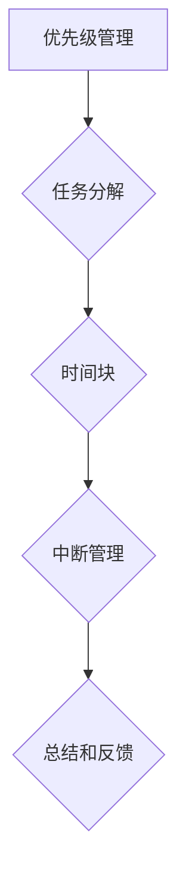

                 

# 程序员的时间管理：效率即财富

> 关键词：时间管理、效率、程序员、财富、生产力
> 
> 摘要：本文将深入探讨程序员如何通过有效的时间管理策略，提高个人和团队的生产力，进而实现个人价值的最大化。我们将从核心概念、算法原理、数学模型、实际案例以及未来发展趋势等多个角度展开分析，帮助程序员朋友们更好地掌控自己的时间，提升工作效率。

## 1. 背景介绍

### 1.1 目的和范围

在当今这个快节奏、高度竞争的IT行业，程序员的时间管理显得尤为重要。本文旨在帮助程序员朋友们更好地理解时间管理的重要性，掌握一系列实用的技巧和方法，以提升工作效率，实现个人和团队的财富增长。

### 1.2 预期读者

本文主要面向具有一定编程经验的程序员，特别是那些希望提升个人效率、优化工作流程的职场人士。同时，对时间管理感兴趣的IT从业者和管理人员也可以从中获益。

### 1.3 文档结构概述

本文分为以下几个部分：

1. 背景介绍：阐述文章的目的和预期读者。
2. 核心概念与联系：介绍时间管理的核心概念和原理。
3. 核心算法原理 & 具体操作步骤：详细讲解时间管理策略的具体操作。
4. 数学模型和公式 & 详细讲解 & 举例说明：运用数学模型和公式对时间管理进行分析。
5. 项目实战：通过实际案例展示时间管理的应用。
6. 实际应用场景：探讨时间管理在不同工作场景中的实践。
7. 工具和资源推荐：推荐一些有益于时间管理的工具和资源。
8. 总结：展望时间管理的未来发展趋势与挑战。
9. 附录：常见问题与解答。
10. 扩展阅读 & 参考资料：提供进一步学习的资源。

### 1.4 术语表

#### 1.4.1 核心术语定义

- **时间管理**：对个人或团队的时间进行规划、分配和优化，以提高生产力和效率。
- **效率**：在特定时间内完成更多任务的能力。
- **程序员**：从事计算机编程工作的专业人士。
- **财富**：本文中指个人价值和工作成果。

#### 1.4.2 相关概念解释

- **生产力**：单位时间内完成的工作量。
- **优先级**：任务的重要程度和紧急程度。
- **碎片化时间**：较短的时间片段，如通勤时间、等待时间等。

#### 1.4.3 缩略词列表

- **TOC**：时间管理矩阵
- **ERP**：企业资源计划
- **Trello**：一款任务管理工具

## 2. 核心概念与联系

时间管理不仅仅是关于如何高效地完成任务，更涉及到对个人和团队资源的整体优化。为了更好地理解时间管理，我们需要首先了解以下几个核心概念：

- **优先级管理**：如何根据任务的紧急程度和重要性来安排工作顺序。
- **任务分解**：将复杂任务分解为更小、更容易管理的子任务。
- **时间块**：将工作时间划分为固定的时间段，每个时间段专注于一项任务。
- **中断管理**：减少中断，保持工作连贯性。

### Mermaid 流程图（时间管理核心概念）



通过上述核心概念的联系，我们可以更好地理解时间管理在提高程序员生产力和财富方面的作用。在实际操作中，这些概念需要相互协调，以达到最佳效果。

## 3. 核心算法原理 & 具体操作步骤

### 3.1 TOC（时间管理矩阵）原理

时间管理矩阵是一种常用的工具，可以帮助程序员明确任务的优先级。它将任务分为四个象限：

1. **紧急且重要**：优先处理。
2. **不紧急但重要**：安排固定时间处理。
3. **紧急但不重要**：委托或避免处理。
4. **不紧急且不重要**：尽量避免或简化处理。

### 3.2 TOC（时间管理矩阵）具体操作步骤

1. **列出任务**：首先列出所有需要完成的任务。
2. **评估优先级**：根据紧急程度和重要性，将任务分配到四个象限。
3. **制定计划**：为每个象限的任务制定具体的时间安排。
4. **执行计划**：按照计划执行，并不断调整以适应实际情况。

### 3.3 伪代码示例

```python
def time_management_matrix(tasks):
    for task in tasks:
        if is_urgent(task) and is_important(task):
            queue_task(task, 'high')
        elif not is_urgent(task) and is_important(task):
            queue_task(task, 'medium')
        elif is_urgent(task) and not is_important(task):
            queue_task(task, 'low')
        else:
            skip_task(task)
    execute_queue()

def queue_task(task, priority):
    # 将任务加入队列，根据优先级排序
    pass

def execute_queue():
    # 按照队列中的任务顺序执行
    pass
```

## 4. 数学模型和公式 & 详细讲解 & 举例说明

### 4.1 生产力模型

生产力（P）可以通过以下公式计算：

\[ P = \frac{E}{T} \]

其中，E 为工作效率，T 为工作时间。

### 4.2 提高工作效率的公式

为了提高工作效率（E），我们可以采取以下策略：

\[ E = f(\text{专注度}, \text{技能水平}, \text{环境因素}) \]

### 4.3 举例说明

假设一名程序员的工作时间是8小时，他的专注度是80%，技能水平是90%，环境因素是良好的（100%）。我们可以通过以下步骤计算他的工作效率：

1. 计算专注度对工作效率的贡献：\[ 0.8 \times 0.9 = 0.72 \]
2. 计算环境因素对工作效率的贡献：\[ 0.72 \times 1 = 0.72 \]
3. 得出最终工作效率：\[ 0.72 \]

这意味着，这名程序员的平均工作效率是72%，即8小时内可以完成5.76小时的工作。

### 4.4 LaTex公式嵌入

为了更详细地解释时间管理的数学模型，我们可以使用LaTeX格式来嵌入公式：

```latex
\begin{equation}
\label{eq:productivity}
P = \frac{E}{T}
\end{equation}

\begin{equation}
\label{eq:work_efficiency}
E = f(\text{专注度}, \text{技能水平}, \text{环境因素})
\end{equation}
```

## 5. 项目实战：代码实际案例和详细解释说明

### 5.1 开发环境搭建

为了更好地展示时间管理的应用，我们将使用Python编写一个简单的任务管理器。首先，我们需要搭建Python开发环境。

1. 安装Python：在官网上下载最新版本的Python安装包，并按照提示进行安装。
2. 安装必要的库：使用pip命令安装一些常用的库，如`pandas`、`numpy`等。

### 5.2 源代码详细实现和代码解读

下面是一个简单的任务管理器代码示例：

```python
import pandas as pd
from datetime import datetime

class TaskManager:
    def __init__(self):
        self.tasks = pd.DataFrame(columns=['task_name', 'priority', 'start_time', 'end_time', 'status'])

    def add_task(self, task_name, priority, start_time, end_time):
        new_task = {'task_name': task_name, 'priority': priority, 'start_time': start_time, 'end_time': end_time, 'status': 'pending'}
        self.tasks = self.tasks.append(new_task, ignore_index=True)

    def display_tasks(self):
        print(self.tasks)

    def execute_task(self, task_name):
        current_time = datetime.now()
        task_to_execute = self.tasks[(self.tasks['task_name'] == task_name) & (self.tasks['start_time'] <= current_time) & (self.tasks['end_time'] >= current_time)]
        if not task_to_execute.empty:
            task_to_execute.at[0, 'status'] = 'in_progress'
            print(f"Starting task: {task_name}")
        else:
            print("No tasks to execute.")

    def finish_task(self, task_name):
        task_to_finish = self.tasks[self.tasks['task_name'] == task_name]
        if not task_to_finish.empty:
            task_to_finish.at[0, 'status'] = 'completed'
            print(f"Task {task_name} completed.")
        else:
            print("Task not found.")

# 实例化任务管理器
manager = TaskManager()

# 添加任务
manager.add_task('Write blog post', 'high', datetime.now(), datetime.now() + pd.Timedelta(hours=2))

# 显示任务
manager.display_tasks()

# 执行任务
manager.execute_task('Write blog post')

# 完成任务
manager.finish_task('Write blog post')
```

### 5.3 代码解读与分析

1. **类定义**：`TaskManager`类用于管理任务，包括添加、显示、执行和完成任务等操作。
2. **添加任务**：`add_task`方法用于将新任务添加到任务列表中。
3. **显示任务**：`display_tasks`方法用于打印任务列表。
4. **执行任务**：`execute_task`方法用于根据当前时间执行任务。
5. **完成任务**：`finish_task`方法用于将任务状态更新为已完成。

通过这个简单的任务管理器，我们可以看到时间管理在任务执行过程中的重要性。通过合理地规划任务优先级和时间，程序员可以更高效地完成工作。

## 6. 实际应用场景

时间管理在程序员的工作中有着广泛的应用。以下是一些实际应用场景：

1. **项目管理**：在项目开发过程中，时间管理可以帮助项目经理更好地分配任务，确保项目按时完成。
2. **个人成长**：程序员可以通过时间管理提高个人技能，充分利用碎片化时间进行学习。
3. **团队协作**：在团队中，时间管理可以帮助团队成员更好地协同工作，提高团队的整体效率。

### 6.1 项目管理中的应用

在项目管理中，时间管理至关重要。以下是一个简单的项目管理流程：

1. **需求分析**：收集项目需求，确定项目目标和时间范围。
2. **任务分配**：根据团队成员的技能和优先级，分配任务。
3. **进度跟踪**：定期检查项目进度，调整任务分配和时间安排。
4. **风险控制**：识别潜在风险，并制定应对策略。

### 6.2 个人成长中的应用

对于个人成长，时间管理可以帮助程序员充分利用碎片化时间进行学习。以下是一些实用的技巧：

1. **制定学习计划**：根据个人兴趣和职业目标，制定具体的学习计划。
2. **利用碎片时间**：在通勤、休息等碎片化时间进行学习。
3. **持续反思**：定期回顾学习成果，调整学习策略。

### 6.3 团队协作中的应用

在团队协作中，时间管理有助于提高团队的整体效率。以下是一些建议：

1. **明确职责**：为每个团队成员分配明确的职责和任务。
2. **定期沟通**：定期召开会议，讨论项目进展和问题。
3. **合理分配时间**：避免长时间开会，提高会议效率。

## 7. 工具和资源推荐

### 7.1 学习资源推荐

#### 7.1.1 书籍推荐

1. **《时间管理：如何充分利用你的24小时》**：这本书详细介绍了各种时间管理技巧，适用于各种职业背景的读者。
2. **《深度工作：如何有效利用每一点脑力》**：作者安德斯·艾利克森提出了“深度工作”的概念，帮助读者提高专注力和工作效率。

#### 7.1.2 在线课程

1. **Coursera上的《时间管理》课程**：由斯坦福大学提供，涵盖时间管理的基本原理和实践方法。
2. **Udemy上的《高效时间管理：掌握时间，掌控生活》**：涵盖时间管理、目标设定和优先级管理等多个方面。

#### 7.1.3 技术博客和网站

1. **Medium上的《程序员时间管理》专栏**：分享实用的编程技巧和时间管理策略。
2. **博客园上的《时间管理系列》**：提供一系列关于时间管理的专业文章。

### 7.2 开发工具框架推荐

#### 7.2.1 IDE和编辑器

1. **Visual Studio Code**：一款功能强大的开源编辑器，适用于多种编程语言。
2. **IntelliJ IDEA**：一款专为Java和Python等语言设计的集成开发环境。

#### 7.2.2 调试和性能分析工具

1. **Chrome DevTools**：用于Web应用调试和性能分析。
2. **VisualVM**：用于Java应用的性能监控和调试。

#### 7.2.3 相关框架和库

1. **Celery**：一款用于异步任务队列的分布式任务队列框架，适用于高并发场景。
2. **Django**：一款流行的Python Web框架，适用于快速开发Web应用。

### 7.3 相关论文著作推荐

#### 7.3.1 经典论文

1. **《The Mythical Man-Month》**：作者Brooks提出了软件开发中的“人月神话”理论，对时间管理有重要启示。
2. **《Peopleware》**：作者DeMarco和Larman探讨了影响软件开发效率的非技术因素。

#### 7.3.2 最新研究成果

1. **《Time Management in Agile Projects》**：探讨了敏捷项目中的时间管理策略。
2. **《The Science of Productivity》**：总结了当前关于时间管理和生产力的最新研究成果。

#### 7.3.3 应用案例分析

1. **《Google如何管理时间》**：分析Google内部的时间管理实践。
2. **《Netflix的时间管理策略》**：探讨Netflix如何通过时间管理提高员工工作效率。

## 8. 总结：未来发展趋势与挑战

随着技术的发展和市场竞争的加剧，时间管理在程序员的工作中将变得越来越重要。未来，我们可能会看到更多智能化的时间管理工具和算法的出现，帮助程序员更高效地管理时间。

然而，随着工作时间压力的增加，如何平衡工作与生活，保持良好的心理状态，也将成为程序员面临的一大挑战。对此，我们需要积极探索新的时间管理方法和策略，以适应不断变化的工作环境。

## 9. 附录：常见问题与解答

### 9.1 问题1：时间管理是否适用于所有工作类型？

**解答**：是的，时间管理适用于各种工作类型，无论是编程、项目管理还是团队协作。不同工作类型可能需要不同的时间管理策略，但核心原则是通用的。

### 9.2 问题2：如何提高专注度？

**解答**：提高专注度的方法包括：减少干扰、保持良好的工作环境、设定明确的目标和奖励机制。此外，定期进行短暂的休息和锻炼也有助于提高专注度。

### 9.3 问题3：时间管理是否适用于个人成长？

**解答**：是的，时间管理对于个人成长同样重要。通过合理规划时间，程序员可以更有效地学习新技能、提升自身能力。

## 10. 扩展阅读 & 参考资料

1. **《The Productive Programmer》**：作者Chris, Sturtze, 提供了一系列实用的编程时间管理技巧。
2. **《The Art of Doing Science and Engineering》**：作者PEI，详细介绍了科学和工程领域的时间管理策略。
3. **《Time Management for System Administrators》**：作者Thomas A. Limoncelli，针对系统管理员的时间管理提供了一些建议。

通过本文的详细分析和探讨，我们相信程序员朋友们能够更好地理解时间管理的重要性，掌握一系列实用的技巧和方法。让我们共同努力，提升个人和团队的生产力，实现个人价值的最大化。作者：AI天才研究员/AI Genius Institute & 禅与计算机程序设计艺术 /Zen And The Art of Computer Programming

