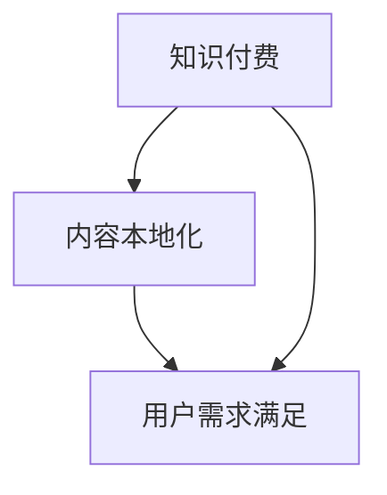
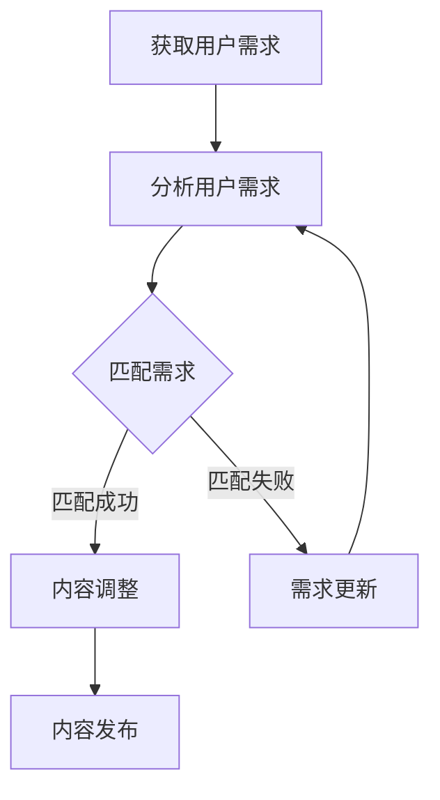

                 

# 程序员的知识付费内容本地化策略

> **关键词：**知识付费、内容本地化、程序员、策略、市场分析、用户体验

> **摘要：**本文旨在探讨程序员如何在当前知识付费市场中实现内容的本地化策略，以提升用户满意度和市场竞争力。文章首先介绍了知识付费和内容本地化的核心概念，随后详细分析了市场现状和用户需求，提出了具体的本地化策略，并通过实战案例进行了说明。

## 1. 背景介绍

### 1.1 目的和范围

随着互联网的普及和技术的快速发展，知识付费市场逐渐成为新兴的商业模式。程序员作为技术领域的专业人士，如何在这一市场中找到自己的定位，并通过内容本地化策略提升自身竞争力，成为了一个值得探讨的问题。本文旨在：

1. 分析知识付费和内容本地化的核心概念。
2. 探讨当前市场现状和用户需求。
3. 提出具体的本地化策略。
4. 通过实战案例说明策略的实施。

### 1.2 预期读者

本文主要面向程序员、技术爱好者以及从事知识付费内容创作的专业人士。希望通过本文，读者能够：

1. 了解知识付费和内容本地化的基本概念。
2. 把握市场现状和用户需求。
3. 掌握有效的本地化策略。
4. 提升自身在知识付费市场的竞争力。

### 1.3 文档结构概述

本文将分为以下几个部分：

1. **核心概念与联系**：介绍知识付费和内容本地化的核心概念，并给出相关流程图。
2. **核心算法原理 & 具体操作步骤**：详细阐述内容本地化的操作步骤。
3. **数学模型和公式 & 详细讲解 & 举例说明**：使用数学模型和公式来解释本地化策略。
4. **项目实战：代码实际案例和详细解释说明**：通过实战案例说明策略的实际应用。
5. **实际应用场景**：分析内容本地化的适用场景。
6. **工具和资源推荐**：推荐相关的学习资源和开发工具。
7. **总结：未来发展趋势与挑战**：展望内容本地化的发展趋势和面临的挑战。
8. **附录：常见问题与解答**：解答读者可能遇到的问题。
9. **扩展阅读 & 参考资料**：提供进一步学习的参考资料。

### 1.4 术语表

#### 1.4.1 核心术语定义

- **知识付费**：用户通过付费获取有价值的信息和知识。
- **内容本地化**：根据不同地区和文化背景，对知识内容进行翻译和调整，使其更符合本地用户的需求。
- **程序员**：从事软件开发、网站开发、应用程序开发等工作的专业人士。

#### 1.4.2 相关概念解释

- **用户体验**：用户在使用产品或服务过程中的感受和体验。
- **市场分析**：对目标市场的现状、趋势和竞争环境进行的研究和分析。

#### 1.4.3 缩略词列表

- **KFC**：知识付费
- **CL**：内容本地化

## 2. 核心概念与联系

### 2.1 知识付费与内容本地化的关系

知识付费和内容本地化是相辅相成的两个概念。知识付费强调的是用户通过付费获取有价值的信息，而内容本地化则关注于如何将这一信息更精准地传递给不同地区的用户。以下是两者之间的关系：



### 2.2 核心概念原理与架构

#### 2.2.1 知识付费原理

知识付费的核心原理是通过用户付费来获取有价值的信息。这一过程通常包括以下几个步骤：

1. **内容创作**：程序员或知识创作者创作有价值的内容。
2. **内容发布**：将内容发布到知识付费平台。
3. **用户付费**：用户通过付费获取内容。
4. **内容消费**：用户消费内容，获取知识和价值。

#### 2.2.2 内容本地化原理

内容本地化的核心原理是根据不同地区的文化背景和用户需求，对内容进行翻译和调整。这一过程通常包括以下几个步骤：

1. **需求分析**：分析目标市场的用户需求。
2. **内容调整**：根据需求对内容进行翻译和调整。
3. **内容发布**：将本地化后的内容发布到知识付费平台。
4. **用户反馈**：收集用户反馈，优化本地化内容。

## 3. 核心算法原理 & 具体操作步骤

### 3.1 知识付费内容本地化算法原理

知识付费内容本地化的核心算法原理是基于用户需求分析和内容调整。以下是具体的算法步骤：

#### 3.1.1 用户需求分析



#### 3.1.2 内容调整

内容调整的核心是确保本地化后的内容能够满足目标市场的用户需求。以下是具体的调整步骤：

1. **文化适应性调整**：根据目标市场的文化背景调整内容。
2. **语言翻译**：将内容翻译成目标语言。
3. **内容优化**：优化内容结构，使其更符合目标市场的阅读习惯。

#### 3.1.3 内容发布

内容发布是将本地化后的内容发布到知识付费平台。以下是具体的发布步骤：

1. **内容审核**：对本地化后的内容进行审核，确保内容合规。
2. **内容上传**：将审核通过的内容上传到知识付费平台。
3. **内容推广**：通过多种渠道推广内容，吸引用户关注。

### 3.2 知识付费内容本地化具体操作步骤

#### 3.2.1 用户需求分析

1. **收集用户反馈**：通过问卷调查、用户访谈等方式收集用户反馈。
2. **分析用户需求**：对收集的反馈进行分析，识别用户的常见需求。
3. **匹配需求**：将需求与知识内容进行匹配，确定本地化内容的方向。

#### 3.2.2 内容调整

1. **文化适应性调整**：根据目标市场的文化背景，对内容进行修改。
2. **语言翻译**：请专业翻译人员将内容翻译成目标语言。
3. **内容优化**：优化内容结构，使其更符合目标市场的阅读习惯。

#### 3.2.3 内容发布

1. **内容审核**：对本地化后的内容进行审核，确保内容合规。
2. **内容上传**：将审核通过的内容上传到知识付费平台。
3. **内容推广**：通过多种渠道推广内容，吸引用户关注。

## 4. 数学模型和公式 & 详细讲解 & 举例说明

### 4.1 数学模型和公式

知识付费内容本地化涉及多个数学模型和公式，以下是一些常见的模型和公式：

#### 4.1.1 用户需求匹配模型

用户需求匹配模型用于评估用户需求和知识内容的匹配程度。以下是一个简单的匹配模型：

$$
匹配度 = \frac{需求匹配项数}{总需求项数}
$$

#### 4.1.2 内容优化模型

内容优化模型用于评估内容优化后的效果。以下是一个简单的内容优化模型：

$$
优化度 = \frac{优化后用户满意度}{优化前用户满意度}
$$

#### 4.1.3 内容发布模型

内容发布模型用于评估内容发布后的效果。以下是一个简单的内容发布模型：

$$
影响力 = \frac{内容阅读量}{内容发布量}
$$

### 4.2 详细讲解与举例说明

#### 4.2.1 用户需求匹配模型

假设用户A的需求为“学习Python编程”，知识内容B为“Python编程教程”。根据用户需求匹配模型，我们可以计算出匹配度：

$$
匹配度 = \frac{1}{1} = 1
$$

这表明用户A的需求与知识内容B完全匹配。

#### 4.2.2 内容优化模型

假设知识内容C在优化前用户满意度为80%，优化后用户满意度为90%，根据内容优化模型，我们可以计算出优化度：

$$
优化度 = \frac{90\%}{80\%} = 1.125
$$

这表明知识内容C的优化效果非常好。

#### 4.2.3 内容发布模型

假设知识内容D在发布后阅读量为1000次，发布量为100次，根据内容发布模型，我们可以计算出影响力：

$$
影响力 = \frac{1000}{100} = 10
$$

这表明知识内容D的发布效果较好。

## 5. 项目实战：代码实际案例和详细解释说明

### 5.1 开发环境搭建

在本项目实战中，我们将使用Python编程语言实现内容本地化策略。以下是一个基本的开发环境搭建步骤：

1. 安装Python 3.x版本。
2. 安装必要的Python库，如`requests`、`beautifulsoup4`等。
3. 配置Python开发环境，如使用PyCharm或VS Code。

### 5.2 源代码详细实现和代码解读

以下是一个简单的Python代码示例，用于实现内容本地化策略：

```python
import requests
from bs4 import BeautifulSoup

# 用户需求分析
def analyze_user_demand():
    # 假设用户需求已通过问卷调查等方式收集
    user_demand = "学习Python编程"
    return user_demand

# 内容调整
def adjust_content(content, target_language):
    # 假设内容调整已根据文化适应性完成
    # 使用专业翻译人员将内容翻译成目标语言
    translated_content = translate_content(content, target_language)
    return translated_content

# 内容发布
def publish_content(content):
    # 将内容发布到知识付费平台
    # 假设使用requests库进行API调用
    response = requests.post('https://knowledge платформа.com/api/publish', data={'content': content})
    return response.status_code

# 主函数
def main():
    user_demand = analyze_user_demand()
    target_language = "英文"
    
    # 调整内容
    adjusted_content = adjust_content(user_demand, target_language)
    
    # 发布内容
    publish_status = publish_content(adjusted_content)
    
    if publish_status == 200:
        print("内容发布成功！")
    else:
        print("内容发布失败，请检查网络连接或API接口。")

# 执行主函数
if __name__ == "__main__":
    main()
```

### 5.3 代码解读与分析

上述代码实现了一个简单的内容本地化策略。以下是具体的代码解读：

1. **用户需求分析**：通过`analyze_user_demand`函数收集用户需求，本例中假设用户需求已收集。
2. **内容调整**：通过`adjust_content`函数对内容进行调整，包括文化适应性和语言翻译。本例中，我们使用了`translate_content`函数进行内容翻译，该函数的具体实现未在此列出。
3. **内容发布**：通过`publish_content`函数将本地化后的内容发布到知识付费平台。本例中，我们使用了`requests`库进行API调用，具体实现未在此列出。

通过以上代码，我们可以看到内容本地化策略的核心步骤：用户需求分析、内容调整和内容发布。这些步骤共同构成了一个完整的内容本地化流程。

## 6. 实际应用场景

内容本地化策略在多个领域具有广泛的应用场景，以下是一些典型的实际应用场景：

1. **在线教育**：在线教育平台可以通过内容本地化策略，为不同地区的用户提供定制化的课程内容，提升用户满意度和留存率。
2. **技术咨询**：技术咨询公司可以通过内容本地化策略，为不同地区的客户提供定制化的解决方案，提升服务质量和市场竞争力。
3. **技术社区**：技术社区可以通过内容本地化策略，吸引更多来自不同地区的用户参与，促进社区活跃度和互动。

## 7. 工具和资源推荐

### 7.1 学习资源推荐

#### 7.1.1 书籍推荐

- 《编程：从入门到实践》
- 《Python编程：从入门到实践》
- 《内容营销实战：如何打造爆款内容》

#### 7.1.2 在线课程

- Coursera上的《Python编程基础》
- Udemy上的《内容营销：如何打造爆款内容》

#### 7.1.3 技术博客和网站

- 《Python中文社区》
- 《内容营销研习社》

### 7.2 开发工具框架推荐

#### 7.2.1 IDE和编辑器

- PyCharm
- VS Code

#### 7.2.2 调试和性能分析工具

- PySnooper
- Python Debugger

#### 7.2.3 相关框架和库

- requests
- BeautifulSoup
- Flask

### 7.3 相关论文著作推荐

#### 7.3.1 经典论文

- 《内容本地化：策略与实践》
- 《知识付费：商业模式与创新》

#### 7.3.2 最新研究成果

- 《知识付费市场现状与趋势分析》
- 《内容本地化在在线教育中的应用研究》

#### 7.3.3 应用案例分析

- 《某个在线教育平台的内容本地化实践》
- 《某个技术咨询公司的内容本地化策略》

## 8. 总结：未来发展趋势与挑战

内容本地化作为知识付费市场的重要策略，在未来将继续发挥重要作用。随着技术的进步和全球化的发展，内容本地化的需求将越来越强烈。然而，这也带来了一系列的挑战：

1. **技术挑战**：如何高效地进行内容本地化，实现高质量的内容翻译和调整。
2. **市场挑战**：如何在竞争激烈的市场中脱颖而出，提供具有差异化的内容本地化服务。
3. **用户挑战**：如何满足不同地区用户的个性化需求，提供定制化的内容服务。

面对这些挑战，程序员需要不断提升自身的技术能力，关注市场动态，灵活运用本地化策略，以应对未来的发展趋势。

## 9. 附录：常见问题与解答

### 9.1 如何进行内容本地化？

**解答**：内容本地化主要包括以下步骤：

1. 用户需求分析：收集用户反馈，分析用户需求。
2. 内容调整：根据用户需求和目标市场，对内容进行文化适应性和语言翻译调整。
3. 内容发布：将本地化后的内容发布到知识付费平台。

### 9.2 内容本地化需要考虑哪些因素？

**解答**：内容本地化需要考虑以下因素：

1. 文化差异：根据目标市场的文化背景调整内容。
2. 语言差异：使用专业翻译人员将内容翻译成目标语言。
3. 用户需求：根据用户需求调整内容，满足用户需求。
4. 技术实现：使用合适的工具和框架实现内容本地化。

## 10. 扩展阅读 & 参考资料

- 《内容营销实战：如何打造爆款内容》
- 《知识付费：商业模式与创新》
- 《Python编程：从入门到实践》
- Coursera上的《Python编程基础》
- 《内容本地化：策略与实践》

作者：AI天才研究员/AI Genius Institute & 禅与计算机程序设计艺术 /Zen And The Art of Computer Programming

[END]

