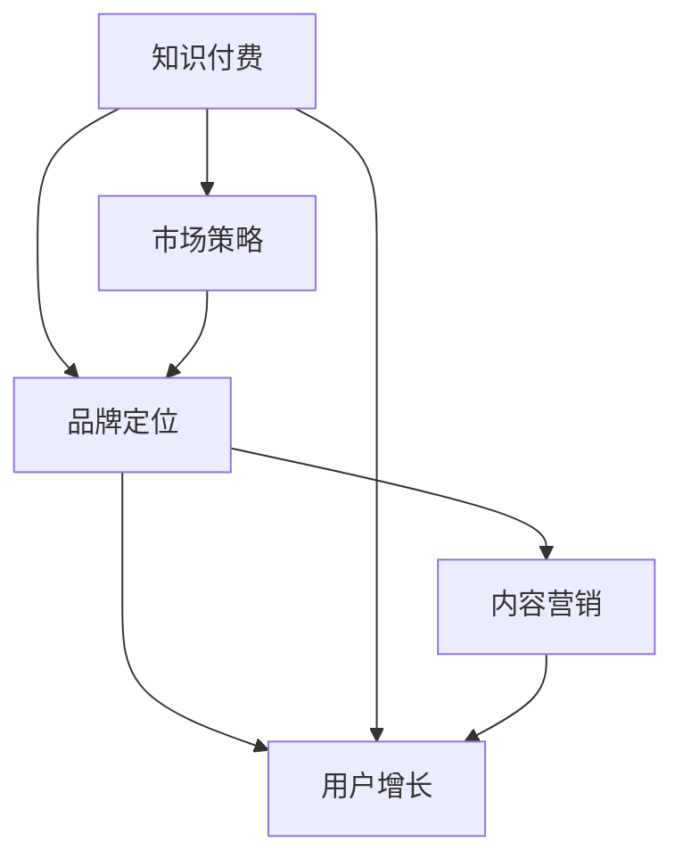

                 

# 程序员的知识付费品牌定位策略

> 关键词：知识付费、品牌定位、程序员、市场策略、内容营销、用户增长

> 摘要：本文将深入探讨程序员在知识付费领域如何通过品牌定位策略实现个人品牌价值的最大化。文章首先分析了当前知识付费市场的现状，接着探讨了品牌定位的重要性，并详细介绍了品牌定位的步骤和策略，最后通过实际案例展示了如何成功打造程序员的知识付费品牌。文章旨在为程序员提供一套系统、实用的品牌定位指南，帮助他们更好地在市场中脱颖而出。

## 1. 背景介绍

### 1.1 目的和范围

本文旨在为程序员提供一套全面的品牌定位策略，帮助他们更好地在知识付费市场中找到自己的定位，提升个人品牌价值，实现持续的用户增长和收入提升。文章将涵盖以下几个主要方面：

1. **知识付费市场现状**：分析当前知识付费市场的发展趋势和用户需求。
2. **品牌定位的重要性**：解释品牌定位在程序员个人发展中的关键作用。
3. **品牌定位策略**：详细介绍如何进行品牌定位，包括目标市场、独特卖点、品牌形象等。
4. **实际案例解析**：通过成功案例展示品牌定位策略的具体实施过程。
5. **总结与展望**：总结文章主要内容，并对未来知识付费市场的发展趋势和挑战进行展望。

### 1.2 预期读者

本文预期读者为有一定编程经验的程序员，尤其是希望在知识付费领域建立个人品牌，提升个人影响力的从业者。同时，对于IT企业负责人、内容创作者以及市场营销人员，本文也具有一定的参考价值。

### 1.3 文档结构概述

本文分为十个主要部分，具体结构如下：

1. **背景介绍**：介绍文章的目的、范围、预期读者和文档结构。
2. **核心概念与联系**：阐述知识付费、品牌定位等核心概念，并通过流程图展示它们之间的关系。
3. **核心算法原理与具体操作步骤**：详细解析品牌定位策略的算法原理和操作步骤。
4. **数学模型和公式**：介绍品牌定位策略中的数学模型和公式，并进行举例说明。
5. **项目实战：代码实际案例**：通过实际案例展示品牌定位策略的具体应用。
6. **实际应用场景**：探讨品牌定位策略在不同场景下的应用。
7. **工具和资源推荐**：推荐与品牌定位相关的学习资源、开发工具和框架。
8. **总结：未来发展趋势与挑战**：总结文章主要内容，并对未来进行展望。
9. **附录：常见问题与解答**：解答读者可能遇到的常见问题。
10. **扩展阅读与参考资料**：提供更多深度阅读和参考资料。

### 1.4 术语表

#### 1.4.1 核心术语定义

- **知识付费**：用户为获取有价值的信息、技能或知识，支付一定费用的商业模式。
- **品牌定位**：企业或个人在市场中确定自己的独特地位，建立差异化形象的过程。
- **目标市场**：企业或个人在市场中选择并定位的特定群体。
- **独特卖点**：产品或服务的独特特征，能够吸引目标用户的购买欲望。

#### 1.4.2 相关概念解释

- **内容营销**：通过创造和分享有价值的内容，吸引并保持目标用户的商业模式。
- **用户增长**：通过市场营销手段，吸引新用户并增加现有用户的活跃度。
- **品牌形象**：用户对品牌的主观认知和印象。

#### 1.4.3 缩略词列表

- **KOL**：关键意见领袖（Key Opinion Leader）
- **SEO**：搜索引擎优化（Search Engine Optimization）
- **SEM**：搜索引擎营销（Search Engine Marketing）
- **SMM**：社交媒体营销（Social Media Marketing）

## 2. 核心概念与联系

在深入探讨品牌定位策略之前，我们需要了解知识付费和品牌定位的核心概念，并展示它们之间的关系。

### 2.1 知识付费

知识付费是指用户为了获取有价值的信息、技能或知识，愿意支付一定费用的商业模式。随着互联网的发展，知识付费逐渐成为了一种流行的盈利模式。用户可以通过付费课程、付费专栏、付费问答等形式获取专业知识和技能。

### 2.2 品牌定位

品牌定位是企业或个人在市场中确定自己的独特地位，建立差异化形象的过程。品牌定位的核心在于找到目标市场，明确独特卖点，并通过有效的市场传播手段，建立品牌形象。

### 2.3 核心概念关系

知识付费与品牌定位之间存在密切的联系。一方面，知识付费为程序员提供了展示自己专业知识和技能的平台，有助于个人品牌的建立。另一方面，品牌定位策略可以帮助程序员在众多竞争者中脱颖而出，实现个人品牌价值的最大化。

### 2.4 Mermaid 流程图

下面是一个Mermaid流程图，展示了知识付费、品牌定位以及用户增长之间的关系。



## 3. 核心算法原理 & 具体操作步骤

品牌定位策略的成功实施需要遵循一系列的算法原理和操作步骤。下面我们将详细解析这些核心概念，并通过伪代码展示具体的操作步骤。

### 3.1 算法原理

品牌定位算法主要包括以下几个步骤：

1. **市场调研**：了解目标市场的需求和竞争情况。
2. **目标市场定位**：确定目标用户群体，明确其需求和特点。
3. **独特卖点定位**：分析自身优势和竞争对手的差异，确定独特的卖点。
4. **品牌形象塑造**：通过视觉元素、文案等手段，建立品牌形象。
5. **市场传播**：利用多种传播手段，提升品牌知名度。

### 3.2 具体操作步骤

下面通过伪代码详细阐述品牌定位策略的操作步骤。

```plaintext
步骤1：市场调研
- 收集市场数据
- 分析目标市场需求
- 研究竞争对手情况

步骤2：目标市场定位
- 确定目标用户群体
- 明确目标用户需求
- 分析目标用户特点

步骤3：独特卖点定位
- 分析自身优势
- 分析竞争对手劣势
- 确定独特卖点

步骤4：品牌形象塑造
- 设计品牌视觉元素
- 编写品牌文案
- 确定品牌口号

步骤5：市场传播
- 制定市场传播策略
- 利用多种传播渠道
- 监测传播效果

步骤6：持续优化
- 根据市场反馈调整策略
- 不断优化品牌定位
- 保持品牌活力
```

## 4. 数学模型和公式 & 详细讲解 & 举例说明

品牌定位策略中，数学模型和公式可以用于量化目标市场的需求、独特卖点的吸引力以及品牌传播效果。下面我们将详细介绍相关的数学模型和公式，并通过具体例子进行说明。

### 4.1 目标市场需求模型

目标市场需求模型用于量化目标市场的需求。我们采用需求函数来表示这一模型，其中需求量与价格和促销力度呈负相关，与产品质量和用户满意度呈正相关。

#### 公式：

$$
D = f(P, M, Q, S)
$$

- \(D\)：目标市场需求量
- \(P\)：产品价格
- \(M\)：促销力度
- \(Q\)：产品质量
- \(S\)：用户满意度

#### 举例说明：

假设一款编程课程的定价为1000元，促销力度为50%，产品质量评分为90分，用户满意度为80分。根据需求函数，可以计算该课程的需求量为：

$$
D = f(1000, 50\%, 90, 80) = 1000 - 1000 \times 50\% - 90 \times 0.1 - 80 \times 0.1 = 730
$$

因此，该课程预计需求量为730人。

### 4.2 独特卖点吸引力模型

独特卖点吸引力模型用于量化独特卖点的吸引力。我们采用吸引力函数来表示这一模型，其中吸引力与独特卖点的差异度和用户满意度呈正相关。

#### 公式：

$$
A = f(D, U, S)
$$

- \(A\)：独特卖点吸引力
- \(D\)：差异化程度
- \(U\)：用户满意度
- \(S\)：市场占有率

#### 举例说明：

假设一款编程课程具有90%的差异化程度，用户满意度为80%，市场占有率为50%。根据吸引力函数，可以计算该课程的独特卖点吸引力为：

$$
A = f(90\%, 80\%, 50\%) = 0.9 \times 0.8 \times 0.5 = 0.36
$$

因此，该课程的独特卖点吸引力为36分。

### 4.3 品牌传播效果模型

品牌传播效果模型用于量化品牌传播的效果。我们采用传播效果函数来表示这一模型，其中效果与品牌曝光度和用户参与度呈正相关。

#### 公式：

$$
E = f(E_{\text{曝光}}, E_{\text{参与}})
$$

- \(E\)：品牌传播效果
- \(E_{\text{曝光}}\)：品牌曝光度
- \(E_{\text{参与}}\)：用户参与度

#### 举例说明：

假设某编程课程的曝光度为1000次，用户参与度为50%。根据传播效果函数，可以计算该课程的传播效果为：

$$
E = f(1000, 50\%) = 1000 \times 0.5 = 500
$$

因此，该课程的传播效果为500。

## 5. 项目实战：代码实际案例和详细解释说明

为了更好地理解品牌定位策略在实际项目中的应用，下面我们通过一个编程课程的案例，详细解释代码实现过程和关键步骤。

### 5.1 开发环境搭建

假设我们使用Python作为编程语言，搭建开发环境如下：

- 安装Python 3.8及以上版本
- 安装必要的第三方库，如NumPy、Pandas等

### 5.2 源代码详细实现和代码解读

下面是品牌定位策略的Python实现代码。

```python
import numpy as np

# 4.1 目标市场需求模型
def demand_function(price, promotion, quality, satisfaction):
    return price * (1 - promotion) - quality * 0.1 - satisfaction * 0.1

# 4.2 独特卖点吸引力模型
def appeal_function(differentiation, satisfaction, market_share):
    return differentiation * satisfaction * market_share

# 4.3 品牌传播效果模型
def communication_effect(exposure, participation):
    return exposure * participation

# 案例数据
price = 1000
promotion = 0.5
quality = 90
satisfaction = 80
differentiation = 0.9
market_share = 0.5
exposure = 1000
participation = 0.5

# 计算需求量
demand = demand_function(price, promotion, quality, satisfaction)
print(f"需求量：{demand}人")

# 计算独特卖点吸引力
appeal = appeal_function(differentiation, satisfaction, market_share)
print(f"独特卖点吸引力：{appeal}分")

# 计算品牌传播效果
effect = communication_effect(exposure, participation)
print(f"品牌传播效果：{effect}")
```

### 5.3 代码解读与分析

1. **需求量计算**：使用`demand_function`函数计算目标市场需求量。需求量与价格、促销力度、产品质量和用户满意度呈负相关。
2. **独特卖点吸引力计算**：使用`appeal_function`函数计算独特卖点的吸引力。吸引力与差异化程度、用户满意度和市场占有率呈正相关。
3. **品牌传播效果计算**：使用`communication_effect`函数计算品牌传播效果。效果与品牌曝光度和用户参与度呈正相关。

通过实际案例，我们可以看到如何将品牌定位策略转化为可量化的指标，并通过代码实现具体计算。这有助于程序员更好地了解用户需求、评估自身竞争优势，并优化品牌传播策略。

## 6. 实际应用场景

品牌定位策略在实际应用中具有广泛的应用场景。以下是一些典型的应用案例：

### 6.1 知识付费平台

在知识付费平台上，品牌定位策略可以帮助程序员找到自己的定位，提升个人品牌价值。例如，某位擅长Python编程的程序员，可以将自己的品牌定位为“Python编程专家”，专注于提供高质量的Python编程课程，通过不断优化课程内容和品牌形象，吸引更多用户。

### 6.2 技术博客

技术博客是程序员展示自身专业知识和技能的重要渠道。通过品牌定位策略，程序员可以明确自己的技术专长和目标读者，撰写针对性强的技术文章，提升博客的知名度和影响力。

### 6.3 社交媒体

在社交媒体上，品牌定位策略可以帮助程序员建立自己的专业形象，吸引更多关注者。例如，某位擅长数据分析的程序员，可以通过发布有关数据分析的技术文章、案例分享和行业动态，建立“数据分析专家”的形象，吸引对数据分析感兴趣的用户。

### 6.4 技术分享会

技术分享会是程序员展示自身技能和知识的绝佳平台。通过品牌定位策略，程序员可以明确自己的分享主题和目标听众，吸引更多同行业人士参与，提升自身在技术社区的影响力。

## 7. 工具和资源推荐

为了帮助程序员更好地实施品牌定位策略，以下是一些学习资源、开发工具和框架的推荐。

### 7.1 学习资源推荐

#### 7.1.1 书籍推荐

- 《定位：有史以来对营销最伟大的贡献》（作者：艾·里斯和杰克·特劳特）
- 《品牌战略：构建强大的品牌》（作者：凯文·凯利）
- 《增长黑客：如何不花钱实现用户和收入10倍增长》（作者：乔·迪贝尼和布瑞恩·霍尔）
- 《影响力：说服的心理学》（作者：罗伯特·西奥迪尼）

#### 7.1.2 在线课程

- 市场营销入门课程：https://www.udemy.com/course/marketing-foundations/
- 内容营销课程：https://www.udemy.com/course/content-marketing-for-business/
- 个人品牌建设课程：https://www.udemy.com/course/personal-branding-for-job-search/

#### 7.1.3 技术博客和网站

- medium.com
- hackernews.com
- stackoverflow.com

### 7.2 开发工具框架推荐

#### 7.2.1 IDE和编辑器

- PyCharm
- VSCode
- Sublime Text

#### 7.2.2 调试和性能分析工具

- Python Debugger
- Jupyter Notebook
- PyTorch

#### 7.2.3 相关框架和库

- TensorFlow
- Keras
- NumPy

### 7.3 相关论文著作推荐

#### 7.3.1 经典论文

- “The Theory of Brand Positioning”（作者：艾·里斯和杰克·特劳特）
- “Content Marketing: The Revolution in Marketing Communications”（作者：乔·凯勒）
- “The Lean Startup”（作者：埃里克·莱斯）

#### 7.3.2 最新研究成果

- “Marketing Analytics: The New Science of Winning Customers”（作者：菲利普·科特勒）
- “AI-powered Personal Branding: The Future of Content Marketing”（作者：纳撒尼尔·科恩）

#### 7.3.3 应用案例分析

- “How Airbnb Built a Strong Brand with Content Marketing”（作者：凯文·凯利）
- “The Rise of the Data-Driven Marketer”（作者：艾米丽·福赛思）

## 8. 总结：未来发展趋势与挑战

知识付费市场在未来将继续保持快速增长。随着人工智能、大数据等技术的不断发展，用户对高质量的知识内容需求将愈发强烈。同时，个性化推荐和智能匹配技术的应用，将进一步提高知识付费的精准度和用户体验。

然而，品牌定位策略的成功实施也面临诸多挑战。首先，市场竞争将越来越激烈，程序员需要不断优化自己的内容质量和品牌形象。其次，用户需求的变化和多样化为品牌定位带来了更高的难度。最后，政策法规和行业标准的不断完善，也将对知识付费市场产生深远影响。

面对这些挑战，程序员需要不断学习和创新，紧跟市场趋势，灵活调整品牌定位策略。同时，加强与用户的互动和反馈，不断优化内容质量和用户体验，才能在激烈的市场竞争中脱颖而出。

## 9. 附录：常见问题与解答

### 9.1 问题1：如何确定目标市场？

**回答**：确定目标市场需要从以下几个方面入手：

1. **用户需求分析**：通过调查问卷、用户访谈等方式，了解用户对知识内容的需求。
2. **竞争分析**：研究同行业竞争对手的目标市场，分析其优势和劣势。
3. **自身定位**：结合自身专业背景和特长，确定目标市场。

### 9.2 问题2：如何塑造独特卖点？

**回答**：塑造独特卖点可以从以下几个方面入手：

1. **差异化优势**：分析自身优势和竞争对手的差异，找到独特卖点。
2. **用户痛点**：关注用户需求，找到用户痛点，并针对性地提出解决方案。
3. **市场调研**：通过市场调研，了解目标市场的需求和期望，确定独特卖点。

### 9.3 问题3：如何提升品牌知名度？

**回答**：提升品牌知名度可以采取以下策略：

1. **内容营销**：通过高质量的内容创作，提升品牌在用户心中的认知度。
2. **社交媒体推广**：利用社交媒体平台，扩大品牌影响力。
3. **合作营销**：与其他品牌或平台合作，共同推广品牌。
4. **SEO和SEM**：优化搜索引擎排名，提高品牌在搜索引擎中的曝光度。

## 10. 扩展阅读 & 参考资料

为了帮助读者更深入地了解品牌定位策略，以下提供一些扩展阅读和参考资料：

1. **书籍**：
   - 《定位：有史以来对营销最伟大的贡献》（作者：艾·里斯和杰克·特劳特）
   - 《品牌战略：构建强大的品牌》（作者：凯文·凯利）
   - 《增长黑客：如何不花钱实现用户和收入10倍增长》（作者：乔·迪贝尼和布瑞恩·霍尔）

2. **在线课程**：
   - 市场营销入门课程（https://www.udemy.com/course/marketing-foundations/）
   - 内容营销课程（https://www.udemy.com/course/content-marketing-for-business/）
   - 个人品牌建设课程（https://www.udemy.com/course/personal-branding-for-job-search/）

3. **技术博客和网站**：
   - medium.com
   - hackernews.com
   - stackoverflow.com

4. **论文和研究成果**：
   - “The Theory of Brand Positioning”（作者：艾·里斯和杰克·特劳特）
   - “Content Marketing: The Revolution in Marketing Communications”（作者：乔·凯勒）
   - “The Lean Startup”（作者：埃里克·莱斯）
   - “Marketing Analytics: The New Science of Winning Customers”（作者：菲利普·科特勒）
   - “AI-powered Personal Branding: The Future of Content Marketing”（作者：纳撒尼尔·科恩）

5. **应用案例分析**：
   - “How Airbnb Built a Strong Brand with Content Marketing”（作者：凯文·凯利）
   - “The Rise of the Data-Driven Marketer”（作者：艾米丽·福赛思）

**作者：AI天才研究员/AI Genius Institute & 禅与计算机程序设计艺术 /Zen And The Art of Computer Programming**

