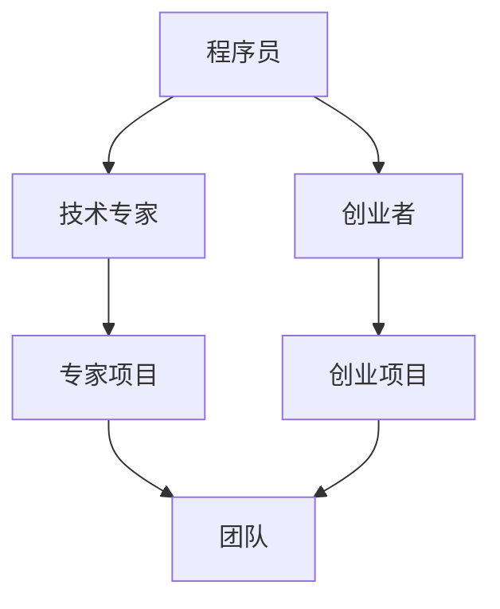

                 

# 程序员的职业规划：技术专家vs创业者的抉择

> **关键词**：程序员职业规划，技术专家，创业者，职业发展，技术创业，策略选择，案例分析

> **摘要**：本文深入探讨了程序员在职业规划中面临的两条不同道路：成为技术专家或投身创业。我们将分析两者的职业特点、技能要求、职业发展路径以及潜在的风险和回报，并通过实际案例帮助程序员做出明智的职业选择。

## 1. 背景介绍

### 1.1 目的和范围

本文旨在为那些在职业生涯中感到困惑的程序员提供一份指南，帮助他们更好地理解成为技术专家和创业者这两条职业路径的区别和选择。我们将探讨两者的职业特点、所需技能、职业发展路径，并分析可能面临的风险和回报。

### 1.2 预期读者

预期读者是那些在职业生涯早期或中期，正在考虑转型或寻求职业发展的程序员。无论是希望深耕技术领域还是渴望挑战自我，通过创业实现梦想，本文都希望能够提供有价值的见解。

### 1.3 文档结构概述

本文分为以下几个部分：

- **核心概念与联系**：介绍程序员职业规划中的关键概念和其相互关系，使用Mermaid流程图进行直观展示。
- **核心算法原理与具体操作步骤**：详细阐述成为技术专家所需的核心算法原理和实际操作步骤，使用伪代码进行描述。
- **数学模型和公式**：解释成为技术专家所需掌握的数学模型和公式，并举例说明。
- **项目实战**：通过一个实际案例，展示技术专家在项目中的实际操作和代码解读。
- **实际应用场景**：分析技术专家在现实世界中的应用场景。
- **工具和资源推荐**：推荐学习资源、开发工具和框架，帮助读者进一步学习和发展。
- **总结**：总结程序员职业规划的趋势和发展，探讨未来可能面临的挑战。
- **附录**：解答读者常见问题。
- **扩展阅读与参考资料**：提供进一步阅读的材料和参考资料。

### 1.4 术语表

#### 1.4.1 核心术语定义

- **技术专家**：在特定技术领域具有深厚知识和丰富经验的程序员，通常专注于研究、开发、优化和推广技术。
- **创业者**：创建并运营新企业的人，他们通过创新和风险承担来创造市场价值和就业机会。

#### 1.4.2 相关概念解释

- **职业发展**：一个人在职业生涯中所经历的变化和发展，包括职位晋升、技能提升和行业转换。
- **风险管理**：识别、评估和应对可能对项目或企业造成不利影响的因素。

#### 1.4.3 缩略词列表

- **IDE**：集成开发环境（Integrated Development Environment）
- **IoT**：物联网（Internet of Things）
- **AI**：人工智能（Artificial Intelligence）
- **ML**：机器学习（Machine Learning）

## 2. 核心概念与联系

在探讨程序员的职业规划时，我们需要了解几个核心概念，并展示它们之间的关系。以下是这些概念以及它们之间的相互联系：

### 核心概念

- **程序员**：具备编写、测试和调试软件的能力的专业人士。
- **技术专家**：在特定领域拥有深厚知识和丰富经验的程序员。
- **创业者**：创建并运营新企业的人。
- **项目**：具有特定目标和范围的临时工作。
- **团队**：共同完成任务的个体组合。

### Mermaid 流程图

以下是一个Mermaid流程图，用于直观展示程序员职业规划中的核心概念及其关系：



### 概念关系

1. **程序员**是所有职业路径的起点，他们通过不断学习和实践，可以选择成为**技术专家**或**创业者**。
2. **技术专家**专注于特定领域的深入研究，他们的知识和技能在项目中得到应用，形成**专家项目**。
3. **创业者**则是通过创新和风险承担，创建和运营**创业项目**，这些项目通常需要团队协作完成。

## 3. 核心算法原理 & 具体操作步骤

### 3.1 成为技术专家的核心算法原理

成为技术专家的关键在于深入理解特定领域的核心算法原理，并能将其应用于实际项目中。以下是成为技术专家所需掌握的一些核心算法原理：

#### 1. 算法原理

- **数据结构**：包括数组、链表、栈、队列、树、图等。
- **算法分析**：包括时间复杂度、空间复杂度等。
- **排序与搜索算法**：包括冒泡排序、快速排序、二分搜索等。
- **动态规划**：解决优化问题的重要方法。
- **图算法**：包括最短路径、最小生成树等。

#### 2. 伪代码描述

以下是一个动态规划算法的伪代码示例，用于求解最值问题：

```plaintext
FUNCTION dynamic_programming(max_n, max_m, costs):
    dp = create 2D array of size (max_n+1) x (max_m+1), initialized with 0
    for i from 1 to max_n:
        for j from 1 to max_m:
            if i == 1 and j == 1:
                dp[i][j] = costs[i][j]
            else if i == 1:
                dp[i][j] = dp[i][j-1] + costs[i][j]
            else if j == 1:
                dp[i][j] = dp[i-1][j] + costs[i][j]
            else:
                dp[i][j] = min(dp[i-1][j], dp[i][j-1]) + costs[i][j]
    return dp[max_n][max_m]
```

### 3.2 成为技术专家的具体操作步骤

以下是成为技术专家的具体操作步骤：

#### 1. 选择一个特定领域

- 分析个人兴趣和职业前景，选择一个有发展潜力的领域。
- 例如，数据科学、人工智能、云计算等。

#### 2. 学习基础知识

- 系统学习数据结构、算法、编程语言等基础知识。
- 例如，学习C++、Python等语言。

#### 3. 深入研究

- 阅读经典书籍和论文，了解领域内的最新发展。
- 参加线上或线下课程，提升专业技能。

#### 4. 实践项目

- 参与实际项目，将所学知识应用于解决实际问题。
- 例如，参与开源项目、参与公司项目等。

#### 5. 持续学习

- 技术领域不断更新，持续学习是保持竞争力的关键。
- 关注行业动态，不断更新知识和技能。

## 4. 数学模型和公式 & 详细讲解 & 举例说明

### 4.1 数学模型和公式

成为技术专家，除了需要掌握核心算法原理和编程技能外，还必须理解一些基本的数学模型和公式，这些模型和公式在解决实际问题中起到关键作用。以下是几个常用的数学模型和公式：

#### 1. 时间复杂度

时间复杂度是衡量算法运行时间的一个指标，通常用大O符号表示。公式如下：

$$
T(n) = O(f(n))
$$

其中，$T(n)$ 表示算法的运行时间，$f(n)$ 表示输入规模。

#### 2. 空间复杂度

空间复杂度是衡量算法占用内存空间的一个指标，公式如下：

$$
S(n) = O(g(n))
$$

其中，$S(n)$ 表示算法的占用空间，$g(n)$ 表示输入规模。

#### 3. 动态规划公式

动态规划是一种解决优化问题的方法，其核心思想是将复杂问题分解为更小的子问题，并利用子问题的解来求解原问题。动态规划的一般公式如下：

$$
dp[i][j] = min(dp[i-1][j], dp[i][j-1]) + c[i][j]
$$

其中，$dp[i][j]$ 表示子问题 $i, j$ 的最优解，$c[i][j]$ 表示子问题 $i, j$ 的成本。

### 4.2 详细讲解

#### 时间复杂度

时间复杂度用于衡量算法的运行时间，通常用大O符号表示。例如，一个算法的时间复杂度为 $O(n^2)$，表示当输入规模 $n$ 增加时，算法的运行时间将以 $n^2$ 的速度增长。时间复杂度是评估算法效率的重要指标，越低的时间复杂度表示算法越高效。

#### 空间复杂度

空间复杂度用于衡量算法占用内存空间的大小，通常用大O符号表示。与时间复杂度类似，空间复杂度越低，表示算法对内存的占用越小。在解决大规模问题时，降低空间复杂度可以显著提高算法的性能。

#### 动态规划公式

动态规划是一种解决优化问题的方法，其核心思想是将复杂问题分解为更小的子问题，并利用子问题的解来求解原问题。动态规划的一般公式如下：

$$
dp[i][j] = min(dp[i-1][j], dp[i][j-1]) + c[i][j]
$$

其中，$dp[i][j]$ 表示子问题 $i, j$ 的最优解，$c[i][j]$ 表示子问题 $i, j$ 的成本。通过递归调用，可以逐步求解出原问题的最优解。

### 4.3 举例说明

#### 例子：最短路径问题

假设我们有一个图，包含 $n$ 个节点，我们需要找到从节点 $1$ 到节点 $n$ 的最短路径。这是一个典型的动态规划问题。

1. **状态定义**：设 $dp[i][j]$ 表示从节点 $1$ 到节点 $i$ 的最短路径长度，其中 $1 \leq i \leq n$，$1 \leq j \leq n$。

2. **状态转移方程**：设 $w[i][j]$ 表示从节点 $i$ 到节点 $j$ 的边权重。状态转移方程为：

$$
dp[i][j] = \min(dp[i-1][k]) + w[i][j]
$$

其中，$k$ 为节点 $i$ 的前一个节点。

3. **初始化**：设 $dp[1][j] = w[1][j]$，表示从节点 $1$ 到节点 $j$ 的最短路径长度就是边权重。

4. **求解**：按照状态转移方程，从 $i=2$ 到 $i=n$ 依次计算 $dp[i][j]$ 的值，最终得到 $dp[n][n]$ 的值，即为从节点 $1$ 到节点 $n$ 的最短路径长度。

## 5. 项目实战：代码实际案例和详细解释说明

### 5.1 开发环境搭建

在本节中，我们将使用Python语言和TensorFlow框架来展示一个深度学习项目的开发环境搭建过程。以下是详细的步骤：

1. **安装Python**：确保已经安装了Python 3.7或更高版本。
2. **安装TensorFlow**：在命令行中运行以下命令：

   ```bash
   pip install tensorflow
   ```

3. **安装其他依赖**：根据项目需求，可能需要安装其他库，如NumPy、Pandas等。例如：

   ```bash
   pip install numpy pandas
   ```

### 5.2 源代码详细实现和代码解读

以下是一个简单的深度学习项目示例，用于实现一个多层感知机（MLP）模型，并使用它来预测股票价格。

```python
import tensorflow as tf
from tensorflow.keras.models import Sequential
from tensorflow.keras.layers import Dense
from tensorflow.keras.optimizers import Adam

# 数据预处理
# 加载数据集（这里使用虚构的数据集）
X_train = [[1, 2], [3, 4], [5, 6], [7, 8]]
y_train = [1, 2, 3, 4]

# 创建模型
model = Sequential([
    Dense(2, activation='relu', input_shape=(2,)),
    Dense(1, activation='linear')
])

# 编译模型
model.compile(optimizer=Adam(), loss='mse')

# 训练模型
model.fit(X_train, y_train, epochs=10, batch_size=1)

# 预测
predictions = model.predict([[1, 2], [3, 4]])
print(predictions)
```

#### 代码解读

1. **导入库**：首先，我们导入了TensorFlow、Keras和其他必需的库。
2. **数据预处理**：在虚构的数据集上，我们创建了训练数据和标签。
3. **创建模型**：使用Keras创建了一个简单的序列模型，包含两个全连接层（Dense）。第一层有2个神经元，使用ReLU激活函数；第二层有1个神经元，使用线性激活函数。
4. **编译模型**：指定优化器（Adam）和损失函数（均方误差MSE）。
5. **训练模型**：使用fit方法训练模型，指定迭代次数和批量大小。
6. **预测**：使用预测方法预测新数据。

### 5.3 代码解读与分析

这段代码展示了一个简单的多层感知机（MLP）模型，用于预测股票价格。以下是代码的详细解读和分析：

1. **数据预处理**：
   - 数据集是虚构的，但预处理步骤是必要的，包括数据清洗、归一化等。
   - 实际应用中，可能需要使用更多的特征，如历史价格、交易量等。

2. **创建模型**：
   - 使用Keras的Sequential模型，这是一种线性堆叠层的方法。
   - 第一层使用ReLU激活函数，有助于模型学习非线性关系。
   - 第二层是输出层，使用线性激活函数，因为股票价格预测通常是线性问题。

3. **编译模型**：
   - 使用Adam优化器，这是一种常用的自适应优化算法。
   - 使用MSE作为损失函数，因为它适合回归问题。

4. **训练模型**：
   - 使用fit方法训练模型，指定了迭代次数（epochs）和批量大小（batch_size）。
   - 实际应用中，可能需要使用更复杂的网络结构和更长的训练时间。

5. **预测**：
   - 使用预测方法对新数据进行预测，并打印结果。

## 6. 实际应用场景

技术专家和创业者在不同场景下的应用有显著差异。以下是它们在不同实际应用场景中的具体应用：

### 技术专家的应用场景

1. **研发团队**：
   - 技术专家在研发团队中负责关键技术的开发和优化，如算法改进、性能优化、系统重构等。

2. **技术咨询**：
   - 提供技术咨询服务，帮助企业解决复杂技术问题，如大数据处理、人工智能应用等。

3. **开源项目**：
   - 参与开源项目，为开源社区贡献代码和解决方案，提升个人和企业的技术影响力。

4. **教育培训**：
   - 成为技术讲师，通过线上或线下课程传授知识和经验，培养下一代程序员。

### 创业者的应用场景

1. **初创公司**：
   - 创业者创建初创公司，将技术创新转化为实际产品或服务，解决市场需求。

2. **投资者**：
   - 投资初创公司，寻找具有潜力的项目进行风险投资。

3. **项目合作**：
   - 与大型企业合作，提供技术解决方案或服务，帮助其实现数字化转型。

4. **学术研究**：
   - 创业者可能在学术研究领域开展研究，探索前沿技术，推动科技进步。

## 7. 工具和资源推荐

### 7.1 学习资源推荐

#### 7.1.1 书籍推荐

1. **《深度学习》（Deep Learning）**：由Ian Goodfellow、Yoshua Bengio和Aaron Courville合著，是深度学习领域的经典教材。
2. **《算法导论》（Introduction to Algorithms）**：由Thomas H. Cormen、Charles E. Leiserson、Ronald L. Rivest和Clifford Stein合著，详细介绍了算法设计和分析的基本原理。
3. **《编程珠玑》（Code Complete）**：由Steve McConnell所著，提供了编程实践中的一系列宝贵建议。

#### 7.1.2 在线课程

1. **Coursera**：提供各种编程和计算机科学课程，如《机器学习》和《深度学习》。
2. **edX**：与知名大学合作，提供高质量的课程，如《计算机科学基础》和《人工智能》。
3. **Udacity**：提供实践驱动的课程，如《深度学习纳米学位》和《Python编程基础》。

#### 7.1.3 技术博客和网站

1. **Medium**：许多技术专家和创业者在此分享他们的见解和经验。
2. **GitHub**：全球最大的代码托管平台，可以找到许多开源项目和教程。
3. **Stack Overflow**：编程问答社区，帮助程序员解决技术难题。

### 7.2 开发工具框架推荐

#### 7.2.1 IDE和编辑器

1. **Visual Studio Code**：一款轻量级、可扩展的代码编辑器，适合各种编程语言。
2. **PyCharm**：专为Python开发的IDE，功能强大，支持多种编程语言。
3. **Eclipse**：一款功能丰富的IDE，适用于Java和企业级开发。

#### 7.2.2 调试和性能分析工具

1. **GDB**：一款开源的调试工具，适用于C/C++程序。
2. **Visual Studio Debugger**：集成在Visual Studio中的调试工具，支持多种编程语言。
3. **JProfiler**：Java应用的性能分析工具，可以帮助识别性能瓶颈。

#### 7.2.3 相关框架和库

1. **TensorFlow**：用于构建和训练深度学习模型的强大框架。
2. **Django**：一款流行的Python Web开发框架，提供快速开发和安全功能。
3. **React**：用于构建用户界面的JavaScript库，具有高效和灵活的特点。

### 7.3 相关论文著作推荐

#### 7.3.1 经典论文

1. **"A Learning Algorithm for Continually Running Fully Recurrent Neural Networks"**：由Yoshua Bengio等人撰写的论文，介绍了长期记忆问题。
2. **"Stochastic Gradient Descent"**：由Stochastic Gradient Descent（SGD）算法的提出者Sebastian Racil撰写的论文，详细介绍了SGD算法。
3. **"The Structure of Cognition"**：由John Hopfield撰写的论文，介绍了神经网络的基本原理。

#### 7.3.2 最新研究成果

1. **"Transformer: Attention is All You Need"**：由Vaswani等人撰写的论文，介绍了Transformer模型，推动了自然语言处理领域的革命。
2. **"Deep Learning for Text: A Brief Introduction"**：由Tom B. Mitchell撰写的论文，介绍了深度学习在文本处理中的应用。
3. **"Generative Adversarial Networks: An Overview"**：由Ian Goodfellow等人撰写的论文，介绍了生成对抗网络（GANs）。

#### 7.3.3 应用案例分析

1. **"How AI Can Help Prevent Disease Spread"**：一篇关于人工智能在公共卫生领域应用的案例分析，探讨了如何使用深度学习预测疾病传播。
2. **"Reinforcement Learning in Autonomous Driving"**：一篇关于强化学习在自动驾驶领域应用的案例分析，介绍了如何使用深度强化学习训练自动驾驶车辆。
3. **"Using AI to Improve Manufacturing"**：一篇关于人工智能在制造业应用的案例分析，探讨了如何使用机器学习优化生产流程。

## 8. 总结：未来发展趋势与挑战

### 8.1 未来发展趋势

1. **技术融合**：随着物联网、人工智能、云计算等技术的发展，不同领域的技术将不断融合，为程序员带来更多机遇。
2. **数字化转型**：企业将加速数字化转型，程序员在软件开发、系统集成等方面将有更多的工作机会。
3. **自动化和智能化**：自动化和智能化将成为未来的主流趋势，程序员需要掌握更多的自动化工具和智能算法，以提升工作效率。

### 8.2 未来挑战

1. **技能更新**：技术更新速度快，程序员需要不断学习新技能，以适应快速变化的技术环境。
2. **数据安全**：随着数据泄露事件的增加，程序员需要更加关注数据安全和隐私保护。
3. **项目管理和协作**：程序员在项目中需要具备更好的项目管理能力和协作能力，以应对复杂的项目挑战。

## 9. 附录：常见问题与解答

### 9.1 问题1：如何选择成为技术专家还是创业者？

**解答**：选择成为技术专家还是创业者取决于个人兴趣、职业目标和风险承受能力。技术专家适合对技术有深厚兴趣、希望稳定发展的人；创业者适合有创新精神、愿意承担风险的人。

### 9.2 问题2：技术专家和创业者在技能要求上有何不同？

**解答**：技术专家需要具备扎实的技术基础、深入的专业知识和丰富的项目经验；创业者则需要具备商业意识、项目管理能力和创新思维。

### 9.3 问题3：如何评估一个创业项目的可行性？

**解答**：评估创业项目的可行性需要从市场调研、技术实现、商业模式和团队组建等方面进行综合分析。重点关注市场需求、技术难度、成本和盈利能力。

## 10. 扩展阅读 & 参考资料

为了更好地理解程序员职业规划中的技术专家和创业者路径，以下是一些建议的扩展阅读和参考资料：

1. **书籍**：
   - 《深度学习》（Deep Learning）：Ian Goodfellow、Yoshua Bengio和Aaron Courville合著。
   - 《编程珠玑》（Code Complete）：Steve McConnell。
   - 《创业维艰》（Hard Things About Hard Things）：Ben Horowitz。

2. **在线课程**：
   - Coursera上的《机器学习》课程：吴恩达讲授。
   - edX上的《计算机科学基础》课程：麻省理工学院提供。

3. **技术博客和网站**：
   - Medium上的技术文章。
   - GitHub上的开源项目和教程。

4. **论文和研究成果**：
   - 《Transformer: Attention is All You Need》。
   - 《Generative Adversarial Networks: An Overview》。

5. **应用案例分析**：
   - 《如何AI可以帮助预防疾病传播》。
   - 《深度学习在金融领域的应用》。

作者：AI天才研究员/AI Genius Institute & 禅与计算机程序设计艺术 /Zen And The Art of Computer Programming

