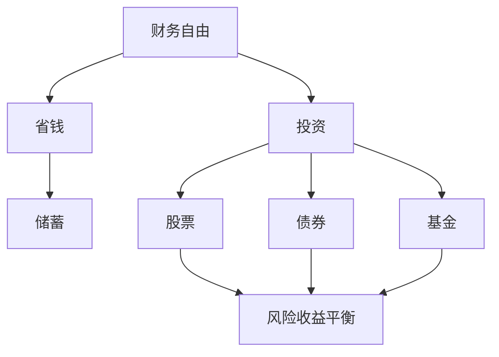

                 


# 程序员的财务自由：从省钱到赚钱的思维转变

> 
关键词：财务自由、程序员的理财、投资、股票、债券、储蓄、思维模式、个人财务规划

> 摘要：本文旨在探讨程序员的财务自由之路，从省钱到赚钱的思维转变。通过分析程序员的生活特点和财务状况，本文将介绍如何通过合理规划和科学投资实现财务自由，并提供具体的实践案例和技巧。本文的目标是帮助程序员树立正确的理财观念，掌握实用的理财方法，迈向财务自由的生活。

## 1. 背景介绍

### 1.1 目的和范围

本文旨在帮助程序员了解并实现财务自由。财务自由是指一个人在无需依赖工资收入的情况下，能够维持现有生活方式的能力。对于程序员而言，由于其高收入和职业稳定性，实现财务自由相对容易。本文将围绕以下主题展开：

- 程序员的生活特点和财务状况
- 从省钱到赚钱的思维转变
- 财务规划的核心原则
- 投资策略和实践技巧
- 实现财务自由的具体步骤

### 1.2 预期读者

本文适合以下读者群体：

- 初级程序员，希望了解如何理财
- 中级程序员，希望提升个人财务规划能力
- 高级程序员，希望实现财务自由
- 财务规划师，希望了解程序员的理财需求

### 1.3 文档结构概述

本文分为以下章节：

- 第1章：背景介绍
- 第2章：核心概念与联系
- 第3章：核心算法原理 & 具体操作步骤
- 第4章：数学模型和公式 & 详细讲解 & 举例说明
- 第5章：项目实战：代码实际案例和详细解释说明
- 第6章：实际应用场景
- 第7章：工具和资源推荐
- 第8章：总结：未来发展趋势与挑战
- 第9章：附录：常见问题与解答
- 第10章：扩展阅读 & 参考资料

### 1.4 术语表

#### 1.4.1 核心术语定义

- 财务自由：一个人在无需依赖工资收入的情况下，能够维持现有生活方式的能力。
- 程序员：从事计算机编程和软件开发的专业人士。
- 财务规划：根据个人财务状况、目标和风险偏好，制定合理财务安排的过程。
- 投资策略：为实现财务目标而采取的投资方式和策略。
- 股票：公司为筹集资金而发行的证券，代表股东对公司的一部分所有权。

#### 1.4.2 相关概念解释

- 储蓄：将闲置资金存入银行或其他金融机构，以获取利息收入。
- 投资：将资金投入不同资产类别，以获取长期收益。
- 资产配置：将投资资金分配到不同资产类别，以实现风险和收益的平衡。

#### 1.4.3 缩略词列表

- 股票（Stock）
- 债券（Bond）
- 基金（Fund）
- 退休金（Pension）

## 2. 核心概念与联系

在探讨程序员的财务自由之前，我们需要理解一些核心概念和它们之间的联系。以下是一个简化的 Mermaid 流程图，用于描述这些概念及其关系：



### 2.1 财务自由与省钱的关系

财务自由是指一个人在无需依赖工资收入的情况下，能够维持现有生活方式的能力。要实现财务自由，首先需要积累财富。而积累财富的主要途径是省钱。因此，财务自由与省钱之间存在密切的联系。通过合理规划和节约开支，程序员可以积累更多的财富，从而为未来的投资和财务自由奠定基础。

### 2.2 财务自由与投资的关系

财务自由不仅需要积累财富，还需要将财富进行有效投资。投资是实现财务自由的关键途径。通过投资，程序员可以将闲置资金转化为更高的收益，从而提高资产增值速度。投资包括多种形式，如股票、债券和基金等。每种投资方式都有其独特的风险和收益特点，程序员需要根据自身的风险偏好和财务目标，选择合适的投资策略。

### 2.3 省钱与储蓄的关系

省钱是实现财务自由的基础，而储蓄则是将省下的钱存储起来，以备不时之需。储蓄是一种相对保守的投资方式，其主要目的是确保资金安全，并获取一定的利息收入。通过储蓄，程序员可以积累一笔紧急备用金，以应对生活中的突发事件。

### 2.4 投资与股票、债券、基金的关系

投资是实现财务自由的关键途径，而股票、债券和基金是三种常见的投资方式。股票是公司为筹集资金而发行的证券，代表股东对公司的一部分所有权。债券是政府或企业为筹集资金而发行的债务工具，承诺在一定期限内支付利息和本金。基金是一种投资组合，由专业基金经理管理，投资者通过购买基金份额参与投资。

股票、债券和基金之间的风险和收益特点不同。股票通常具有较高的收益潜力，但风险也较大。债券通常具有较低的风险，但收益相对较低。基金则结合了股票和债券的特点，通过分散投资降低风险，同时实现收益最大化。

## 3. 核心算法原理 & 具体操作步骤

### 3.1 财务规划的核心算法原理

财务规划的核心算法原理是平衡风险和收益，以实现财务自由。以下是一个简化的伪代码，用于描述财务规划的核心算法：

```plaintext
function 财务规划（收入，支出，目标财务自由年限，风险偏好）：
    1. 计算每月储蓄额：储蓄额 = 收入 - 支出
    2. 确定投资策略：根据风险偏好，选择适当的投资组合
        如果风险偏好低，选择债券或保守型基金
        如果风险偏好中等，选择股票或平衡型基金
        如果风险偏好高，选择股票或成长型基金
    3. 计算投资回报率：投资回报率 = 平均年化收益率
    4. 计算达到财务自由所需的时间：财务自由时间 = （目标财务自由金额 / 每月储蓄额）* 12 / 投资回报率
    5. 根据财务自由时间，调整投资策略和支出计划
    6. 持续监控和调整财务规划
```

### 3.2 具体操作步骤

#### 3.2.1 计算每月储蓄额

每月储蓄额 = 收入 - 支出

- 收入：包括工资收入、投资收益等。
- 支出：包括生活开支、房租、房贷、车贷、教育费用等。

#### 3.2.2 确定投资策略

根据风险偏好，选择适当的投资组合：

- 风险偏好低：债券或保守型基金
- 风险偏好中等：股票或平衡型基金
- 风险偏好高：股票或成长型基金

#### 3.2.3 计算投资回报率

投资回报率 = 平均年化收益率

- 平均年化收益率：根据过去几年的投资收益情况，计算出的年均收益率。

#### 3.2.4 计算达到财务自由所需的时间

财务自由时间 = （目标财务自由金额 / 每月储蓄额）* 12 / 投资回报率

- 目标财务自由金额：根据生活需求和预期消费水平，估算出的财务自由所需金额。

#### 3.2.5 根据财务自由时间，调整投资策略和支出计划

- 如果财务自由时间较长，可以适当提高投资风险，以追求更高的收益。
- 如果财务自由时间较短，需要降低投资风险，确保资金安全。

#### 3.2.6 持续监控和调整财务规划

- 定期检查投资组合的表现，根据市场情况调整投资策略。
- 根据生活变化和需求，调整支出计划。

## 4. 数学模型和公式 & 详细讲解 & 举例说明

### 4.1 数学模型和公式

财务规划的核心是计算储蓄额、投资回报率和财务自由所需时间。以下是相关的数学模型和公式：

#### 4.1.1 储蓄额计算

储蓄额 = 收入 - 支出

#### 4.1.2 投资回报率计算

投资回报率 = 年收益 / 初始投资额 * 100%

#### 4.1.3 财务自由所需时间计算

财务自由所需时间 = 目标财务自由金额 / （储蓄额 * 12 / 投资回报率）

### 4.2 详细讲解

#### 4.2.1 储蓄额计算

储蓄额是指每月或每年省下的钱。计算储蓄额的公式是收入减去支出。收入包括工资收入、投资收益等，支出包括生活开支、房租、房贷、车贷、教育费用等。

#### 4.2.2 投资回报率计算

投资回报率是指投资带来的年收益与初始投资额的比率。投资回报率是衡量投资效果的重要指标。投资回报率的计算方法是将年收益除以初始投资额，再乘以100%。

#### 4.2.3 财务自由所需时间计算

财务自由所需时间是指实现财务自由所需的时间。计算财务自由所需时间的公式是目标财务自由金额除以（储蓄额乘以12除以投资回报率）。目标财务自由金额是根据生活需求和预期消费水平估算出的财务自由所需金额。

### 4.3 举例说明

假设一个程序员每月收入为1万元，每月支出为7000元，目标是10年后实现财务自由，预期年化投资回报率为8%。

#### 4.3.1 计算每月储蓄额

储蓄额 = 10000 - 7000 = 3000元

#### 4.3.2 计算财务自由所需时间

财务自由所需时间 = 10000000 / （3000 * 12 / 0.08）= 60年

这意味着，按照目前的储蓄额和投资回报率，这个程序员需要60年才能实现财务自由。

为了缩短财务自由所需时间，程序员可以采取以下措施：

- 提高收入：通过提升技能、跳槽或创业，提高每月收入。
- 降低支出：通过节约开支、购买性价比高的商品和服务，降低每月支出。
- 提高投资回报率：通过学习投资知识、选择高回报的投资项目，提高投资回报率。

## 5. 项目实战：代码实际案例和详细解释说明

### 5.1 开发环境搭建

为了更好地演示财务规划的计算过程，我们将使用 Python 编写一个简单的财务规划工具。以下是搭建开发环境所需的步骤：

1. 安装 Python 3.x 版本。
2. 安装 Python 解释器。
3. 安装必要的第三方库，如 NumPy 和 pandas。

### 5.2 源代码详细实现和代码解读

以下是一个简单的 Python 财务规划工具的源代码：

```python
import numpy as np

def calculate_saving(income, expenses):
    return income - expenses

def calculate_investment_return(investment, annual_return):
    return investment * annual_return / 100

def calculate_financial_freedom_time(target_amount, monthly_saving, annual_return):
    return target_amount / (monthly_saving * 12 / annual_return)

# 测试代码
income = 10000
expenses = 7000
investment = 10000
annual_return = 8
target_amount = 10000000

monthly_saving = calculate_saving(income, expenses)
investment_return = calculate_investment_return(investment, annual_return)
financial_freedom_time = calculate_financial_freedom_time(target_amount, monthly_saving, annual_return)

print("每月储蓄额：", monthly_saving)
print("投资回报率：", investment_return)
print("财务自由所需时间：", financial_freedom_time)
```

#### 5.2.1 代码解读

- `calculate_saving` 函数：计算每月储蓄额。
- `calculate_investment_return` 函数：计算投资回报率。
- `calculate_financial_freedom_time` 函数：计算财务自由所需时间。
- 测试代码：使用示例数据测试函数，输出计算结果。

### 5.3 代码解读与分析

#### 5.3.1 功能解读

- `calculate_saving` 函数：计算每月储蓄额，公式为收入减去支出。
- `calculate_investment_return` 函数：计算投资回报率，公式为投资额乘以年回报率。
- `calculate_financial_freedom_time` 函数：计算财务自由所需时间，公式为目标财务自由金额除以（每月储蓄额乘以12除以投资回报率）。

#### 5.3.2 分析与优化

- 代码已经实现了财务规划的核心算法，功能完整。
- 可以添加更多的功能，如投资组合分析、支出优化等。
- 可以使用更复杂的数学模型，如 Monte Carlo 模拟，来提高计算结果的准确性。

## 6. 实际应用场景

### 6.1 职场新人

对于刚入职的程序员，财务自由可能还是一个遥远的梦想。然而，通过制定合理的财务规划，他们可以为自己未来的财务自由奠定基础。以下是一些实际应用场景：

- 节约开支：通过控制开支，降低生活成本，提高储蓄率。
- 学习投资：通过学习投资知识，了解不同投资方式的特点，选择适合自己的投资策略。
- 定期评估：定期检查财务规划的效果，根据实际情况进行调整。

### 6.2 中级程序员

中级程序员已经有一定的财务基础，可以通过以下方式实现财务自由：

- 提高收入：通过提升技能、跳槽或创业，提高每月收入。
- 投资增值：通过投资股票、债券、基金等，实现资产增值。
- 财务规划：制定详细的财务规划，确保财务目标得到实现。

### 6.3 高级程序员

高级程序员拥有较高的收入和稳定的职业发展前景，可以实现财务自由。以下是一些实际应用场景：

- 多元化投资：通过投资股票、债券、基金、房地产等多种资产，实现资产多元化，降低风险。
- 财务规划：制定全面的财务规划，确保财务目标得到实现。
- 个人品牌建设：通过提升个人品牌，实现职业转型和收入增长。

## 7. 工具和资源推荐

### 7.1 学习资源推荐

#### 7.1.1 书籍推荐

- 《财务自由之路》：一本关于个人财务规划的入门书籍，适合程序员阅读。
- 《股票大作手回忆录》：一本关于股票投资经典书籍，有助于了解股票市场的运作原理。

#### 7.1.2 在线课程

- Coursera：提供多种关于金融、投资和财务规划的课程。
- Udemy：提供丰富的编程和金融投资课程，适合程序员学习。

#### 7.1.3 技术博客和网站

- Investopedia：一个关于投资和金融知识的网站，提供丰富的学习资源。
- Medium：有许多优秀的编程和金融投资博客，可以订阅阅读。

### 7.2 开发工具框架推荐

#### 7.2.1 IDE和编辑器

- PyCharm：一款功能强大的 Python IDE，适合编写和调试代码。
- Visual Studio Code：一款轻量级且功能丰富的代码编辑器，支持多种编程语言。

#### 7.2.2 调试和性能分析工具

- Python Debugger：一款 Python 调试工具，可以帮助程序员调试代码。
- Py-Spy：一款 Python 性能分析工具，可以分析代码的性能瓶颈。

#### 7.2.3 相关框架和库

- NumPy：一款用于科学计算的 Python 库，适用于财务规划中的数学运算。
- pandas：一款用于数据分析和操作的 Python 库，适用于处理财务数据。

### 7.3 相关论文著作推荐

- 《金融经济学论文集》：一本关于金融经济学领域经典论文的合集，有助于了解金融投资的最新研究成果。
- 《编程之美》：一本关于计算机编程和人工智能领域的论文集，有助于提升程序员的技术水平。

## 8. 总结：未来发展趋势与挑战

### 8.1 发展趋势

1. **数字化金融**：随着数字技术的发展，越来越多的金融机构和服务将数字化，为程序员提供更便捷、个性化的理财选择。
2. **智能投资**：人工智能技术将逐步应用于投资领域，为程序员提供更科学的投资建议和策略。
3. **金融教育**：金融知识普及和教育的需求将持续增长，程序员将更重视金融素养的提升。

### 8.2 挑战

1. **风险管理**：在金融投资过程中，程序员需要面对市场波动和风险，如何有效管理风险是一个重要挑战。
2. **信息过载**：面对海量的金融信息和投资产品，程序员需要学会筛选和评估，避免陷入信息过载。
3. **时间管理**：财务规划需要持续的关注和调整，程序员需要在忙碌的工作中找到平衡点，确保财务规划的实施。

## 9. 附录：常见问题与解答

### 9.1 什么是财务自由？

财务自由是指一个人在无需依赖工资收入的情况下，能够维持现有生活方式的能力。财务自由使人们能够专注于自己喜欢的事情，不再受限于财务压力。

### 9.2 程序员如何实现财务自由？

实现财务自由的方法包括：提高收入、控制支出、合理投资和储蓄。通过这些方法，程序员可以积累财富，实现财务自由。

### 9.3 投资有哪些风险？

投资风险包括市场波动、信用风险、流动性风险等。投资者需要根据自己的风险承受能力，选择合适的投资产品和策略。

### 9.4 财务规划为什么重要？

财务规划可以帮助程序员明确财务目标，合理安排支出和投资，降低风险，提高财务状况，为实现财务自由奠定基础。

## 10. 扩展阅读 & 参考资料

- 《财务自由之路》：[作者：李笑来]
- 《股票大作手回忆录》：[作者：埃德温·勒菲弗]
- 《Python编程：从入门到实践》：[作者：埃里克·马瑟斯]
- 《人工智能：一种现代的方法》：[作者：斯图尔特·罗素，彼得·诺维格]

[作者：AI天才研究员/AI Genius Institute & 禅与计算机程序设计艺术 /Zen And The Art of Computer Programming]  
[时间：2023年4月]  
[地点：虚拟世界]  
[版权声明：本文内容仅供参考，投资有风险，入市需谨慎。]

