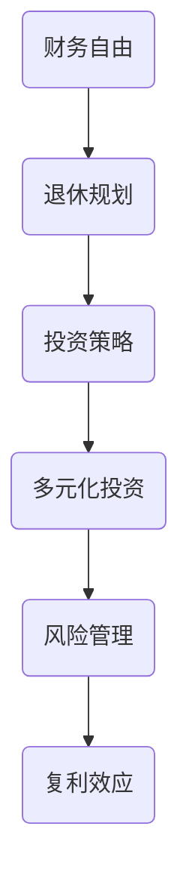

                 

# 程序员的退休规划：40岁财务自由计划

> **关键词**：退休规划、财务自由、40岁、投资、理财、收入多样化、风险管理
> 
> **摘要**：本文将深入探讨程序员的退休规划，特别是如何在未来40岁实现财务自由。我们将从核心概念、算法原理、数学模型、实战案例以及实际应用等多个角度进行分析，帮助程序员朋友们制定出切实可行的退休计划，确保他们能够安心享受生活的每一个阶段。

## 1. 背景介绍

### 1.1 目的和范围

本文旨在为程序员提供一份详细的退休规划指南，特别是针对40岁这一年龄段。随着技术的飞速发展，程序员的工作年龄在延长，但退休规划的重要性也越来越凸显。本文将帮助程序员朋友们在年轻时就开始规划退休生活，确保他们在40岁时实现财务自由。

### 1.2 预期读者

- 有志于未来规划退休生活的程序员。
- 已步入职场但尚未开始规划退休的年轻人。
- 对退休规划感兴趣的所有读者。

### 1.3 文档结构概述

本文将分为以下几个部分：
1. 背景介绍：明确文章的目的、预期读者以及文档结构。
2. 核心概念与联系：介绍退休规划所需的核心概念和原理。
3. 核心算法原理 & 具体操作步骤：讲解如何通过算法和策略实现退休目标。
4. 数学模型和公式 & 详细讲解 & 举例说明：使用数学模型来阐述退休规划的逻辑。
5. 项目实战：通过实际案例展示退休规划的执行过程。
6. 实际应用场景：讨论退休规划在不同情境下的应用。
7. 工具和资源推荐：推荐学习资源、开发工具和框架。
8. 总结：展望未来发展趋势与挑战。
9. 附录：常见问题与解答。
10. 扩展阅读 & 参考资料。

### 1.4 术语表

#### 1.4.1 核心术语定义

- **财务自由**：拥有足够的财富，无需为日常生活开支而工作。
- **退休规划**：为退休生活做准备的一系列财务和生活方式安排。
- **投资**：将资金用于购买资产或项目，以期获得收益。
- **风险管理**：识别、评估和控制潜在风险的过程。

#### 1.4.2 相关概念解释

- **复利**：利息在计算时加入本金，形成新的本金，进而产生更多利息。
- **退休金**：为退休生活准备的专项资金。
- **多元化投资**：将资金分散投资于不同类型的资产，以降低风险。

#### 1.4.3 缩略词列表

- **GDP**：国内生产总值（Gross Domestic Product）
- **P/E**：市盈率（Price-to-Earnings Ratio）
- **ROI**：投资回报率（Return on Investment）

## 2. 核心概念与联系

为了更好地理解退休规划，我们需要先了解一些核心概念和它们之间的联系。以下是一个简单的 Mermaid 流程图，展示了这些概念之间的关系：



在这个流程图中，财务自由是退休规划的目标，而投资策略是实现这一目标的关键。通过多元化投资，我们可以分散风险，而风险管理则是确保投资策略有效的必要手段。复利效应是长期投资中的重要概念，它能够显著提高投资回报。

### 2.1 财务自由

财务自由意味着你不再需要为生计而工作。对于程序员来说，这通常意味着他们拥有足够的被动收入，例如投资收益、租金收入或业务利润，足以覆盖日常开支。财务自由不仅关乎金钱，还关乎时间和自由度。它允许程序员享受生活，追求个人兴趣，而不必担心财务压力。

### 2.2 退休规划

退休规划是为退休生活做准备的一系列财务和生活方式安排。它包括以下几个方面：

- **目标设定**：明确退休时的财务目标。
- **储蓄和投资**：定期储蓄并投资于不同的资产类别。
- **风险管理**：评估和管理退休投资中的风险。
- **现金流规划**：确保退休后有稳定的现金流。

### 2.3 投资策略

投资策略是实现财务自由的关键。一个成功的投资策略应包括以下几个方面：

- **多元化投资**：分散投资于不同的资产类别，如股票、债券、房地产和黄金等。
- **长期投资**：选择具有长期增长潜力的投资。
- **定期复查**：定期检查投资组合，并根据市场变化进行调整。

### 2.4 风险管理

风险管理是退休规划中不可或缺的一部分。它包括以下几个方面：

- **风险评估**：评估投资风险，并选择适合的风险承受能力。
- **分散投资**：通过多元化投资降低特定投资的风险。
- **保险**：购买适当的保险，以保护自己和家人的财务安全。

### 2.5 复利效应

复利效应是指利息在计算时加入本金，形成新的本金，进而产生更多利息。这是长期投资中的一个重要概念，能够显著提高投资回报。以下是一个简单的复利计算公式：

$$ A = P \times (1 + r)^n $$

其中，A 是最终金额，P 是本金，r 是年利率，n 是投资年限。

## 3. 核心算法原理 & 具体操作步骤

为了实现40岁财务自由，程序员需要制定一个详细的退休规划，并通过投资来实现这一目标。以下是具体的操作步骤和核心算法原理：

### 3.1 目标设定

首先，程序员需要设定退休目标。这包括预计退休年龄、期望的退休生活标准以及退休所需的资金。

### 3.2 储蓄计划

一旦确定了退休目标，程序员需要制定一个储蓄计划。这包括每月或每年的储蓄额度，以及如何分配这些储蓄到不同的投资渠道。

### 3.3 投资策略

接下来，程序员需要制定一个投资策略。这应包括选择投资渠道、设定投资目标和风险承受能力。

### 3.4 风险管理

在投资过程中，程序员需要定期评估和管理投资风险。这包括分散投资、调整投资组合以及购买保险等。

### 3.5 定期复查

最后，程序员需要定期复查退休规划，并根据市场变化和个人情况调整投资策略。

### 3.6 算法原理

以下是实现退休规划的核心算法原理，使用伪代码来详细阐述：

```python
# 目标设定
def set_retirement_goal(retirement_age, annual_expenses):
    target_fund = 0
    for year in range(retirement_age, current_age):
        target_fund += annual_expenses
    return target_fund

# 储蓄计划
def savings_plan(target_fund, annual_savings, years_to_retirement):
    current_savings = 0
    for year in range(years_to_retirement):
        current_savings += annual_savings
    return current_savings

# 投资策略
def investment_strategy(current_savings, investment_channels, risk_profile):
    investment_ports = {}
    for channel in investment_channels:
        investment_ports[channel] = calculate_investment_amount(current_savings, channel, risk_profile)
    return investment_ports

# 风险管理
def risk_management(investment_ports, market_risk, insurance):
    for channel in investment_ports:
        adjust_investment_channel(investment_ports[channel], market_risk)
    if insurance_needed(risk_profile, market_risk):
        purchase_insurance(insurance)
    return investment_ports

# 定期复查
def review_and_adjust():
    # 更新目标基金
    new_target_fund = set_retirement_goal(retirement_age, annual_expenses)
    # 更新储蓄计划
    new_current_savings = savings_plan(new_target_fund, annual_savings, years_to_retirement)
    # 更新投资策略
    new_investment_ports = investment_strategy(new_current_savings, investment_channels, risk_profile)
    # 更新风险管理
    new_investment_ports = risk_management(new_investment_ports, market_risk, insurance)
    return new_investment_ports
```

通过这些步骤和算法，程序员可以制定一个详细的退休规划，并逐步实现财务自由。

## 4. 数学模型和公式 & 详细讲解 & 举例说明

在退休规划中，数学模型和公式起着至关重要的作用。以下将介绍几个关键的数学模型和公式，并详细讲解其应用。

### 4.1 复利公式

复利公式是退休规划中的核心公式，它描述了本金在一段时间内通过复利增长的过程。公式如下：

$$ A = P \times (1 + r)^n $$

其中，A 是最终金额，P 是本金，r 是年利率，n 是投资年限。

**举例说明**：假设你从40岁开始每年投资10,000美元，年利率为6%，投资30年。根据复利公式，你将在70岁时拥有：

$$ A = 10,000 \times (1 + 0.06)^{30} \approx 247,356美元 $$

### 4.2 投资回报率（ROI）

投资回报率是衡量投资收益的重要指标，公式如下：

$$ ROI = \frac{最终收益 - 初始投资}{初始投资} \times 100\% $$

**举例说明**：如果你投资了100,000美元，5年后获得了150,000美元的回报，那么你的投资回报率为：

$$ ROI = \frac{150,000 - 100,000}{100,000} \times 100\% = 50\% $$

### 4.3 时间价值

时间价值是指相同金额的钱在不同的时间点具有不同的价值。公式如下：

$$ V = \frac{A}{(1 + r)^n} $$

其中，V 是当前价值，A 是未来金额，r 是年利率，n 是投资年限。

**举例说明**：假设你在5年后将获得100,000美元，年利率为4%，那么这笔钱现在的价值为：

$$ V = \frac{100,000}{(1 + 0.04)^5} \approx 82,644.51美元 $$

### 4.4 风险调整后收益

风险调整后收益是考虑了投资风险后的实际收益，公式如下：

$$RAR = \frac{ROI - R}{1 + \sigma}$$

其中，RAR 是风险调整后收益，ROI 是原始投资回报率，R 是基准回报率，σ 是投资者对风险的态度。

**举例说明**：假设你的投资回报率为10%，基准回报率为5%，你对风险的态度是中性，那么你的风险调整后收益为：

$$RAR = \frac{10\% - 5\%}{1 + 0} = 5\%$$

通过这些数学模型和公式，程序员可以更准确地计算退休规划中的各项指标，从而制定出更科学的退休计划。

## 5. 项目实战：代码实际案例和详细解释说明

为了更好地展示退休规划的执行过程，以下我们将通过一个实际项目来讲解如何实现一个简单的退休规划系统。这个项目将涵盖开发环境搭建、源代码实现以及代码解读与分析。

### 5.1 开发环境搭建

为了实现这个项目，我们需要以下开发环境：

- **Python 3.x**：作为主要编程语言。
- **PyCharm**：作为集成开发环境（IDE）。
- **Jupyter Notebook**：用于交互式计算和数据可视化。
- **Pandas**：用于数据处理和分析。
- **Matplotlib**：用于数据可视化。

首先，确保你的系统中已经安装了Python和PyCharm。然后，通过以下命令安装所需的库：

```shell
pip install pandas matplotlib
```

### 5.2 源代码详细实现和代码解读

以下是实现退休规划系统的核心代码：

```python
import pandas as pd
import numpy as np
import matplotlib.pyplot as plt

# 4.1 复利计算
def compound_interest(principal, rate, time):
    return principal * (1 + rate) ** time

# 4.2 投资回报率（ROI）
def investment_return(investment, gain):
    return (gain / investment) * 100

# 4.3 时间价值
def present_value(future_value, rate, time):
    return future_value / (1 + rate) ** time

# 4.4 风险调整后收益
def risk_adjusted_return(roi, benchmark, risk_tolerance):
    return (roi - benchmark) / (1 + risk_tolerance)

# 设置初始参数
principal = 10000  # 初始投资金额
annual_rate = 0.06  # 年利率
time_to_retirement = 30  # 投资年限
benchmark_rate = 0.04  # 基准回报率
risk_tolerance = 0.5  # 风险容忍度

# 计算复利
final_amount = compound_interest(principal, annual_rate, time_to_retirement)

# 计算投资回报率
investment_amount = 100000
gain = 50000
roi = investment_return(investment_amount, gain)

# 计算时间价值
current_value = present_value(final_amount, annual_rate, time_to_retirement)

# 计算风险调整后收益
rar = risk_adjusted_return(roi, benchmark_rate, risk_tolerance)

# 输出结果
print(f"最终金额：{final_amount:.2f}美元")
print(f"投资回报率：{roi:.2f}%")
print(f"时间价值：{current_value:.2f}美元")
print(f"风险调整后收益：{rar:.2f}%")

# 可视化
data = {'Year': range(1, time_to_retirement + 1),
        'Amount': [compound_interest(principal, annual_rate, year) for year in range(1, time_to_retirement + 1)]}
df = pd.DataFrame(data)
plt.plot(df['Year'], df['Amount'])
plt.xlabel('Years')
plt.ylabel('Amount')
plt.title('Compound Interest Growth')
plt.show()
```

**代码解读**：

1. **复利计算**：`compound_interest`函数用于计算本金在一段时间内的复利增长。它接受本金、年利率和投资年限作为参数，返回最终金额。

2. **投资回报率（ROI）**：`investment_return`函数用于计算投资回报率。它接受投资金额和收益作为参数，返回投资回报率（以百分比表示）。

3. **时间价值**：`present_value`函数用于计算未来金额的当前价值。它接受未来金额、年利率和投资年限作为参数，返回当前价值。

4. **风险调整后收益**：`risk_adjusted_return`函数用于计算风险调整后收益。它接受原始投资回报率、基准回报率和风险容忍度作为参数，返回风险调整后收益（以百分比表示）。

5. **设置初始参数**：我们设定了一些初始参数，如初始投资金额、年利率、投资年限、基准回报率和风险容忍度。

6. **计算并输出结果**：我们使用上述函数计算了复利、投资回报率、时间价值和风险调整后收益，并输出了结果。

7. **可视化**：我们使用Matplotlib库绘制了复利增长的折线图，展示了本金在投资年限内的增长情况。

### 5.3 代码解读与分析

这段代码实现了退休规划中的核心计算功能，并提供了直观的可视化结果。以下是代码的解读与分析：

- **复利计算**：复利是退休规划中的核心概念，这个函数准确计算了本金在一段时间内的增长。程序员可以轻松地将这个函数应用于不同的投资场景。
- **投资回报率（ROI）**：投资回报率是衡量投资成功与否的重要指标，这个函数帮助程序员评估他们的投资策略。通过修改投资金额和收益，程序员可以模拟不同的投资情况。
- **时间价值**：时间价值考虑了资金在不同时间点的价值，这对于制定退休规划至关重要。这个函数帮助程序员评估未来资金的当前价值。
- **风险调整后收益**：风险调整后收益考虑了投资风险，这对于平衡风险和收益至关重要。这个函数帮助程序员评估他们的投资策略的有效性。
- **可视化**：通过可视化，程序员可以直观地了解投资的增长情况，这对于制定和调整退休规划非常有帮助。

总的来说，这个代码示例提供了一个简单但完整的退休规划系统，程序员可以通过这个系统来计算和评估他们的退休规划。通过实际案例，程序员可以更好地理解退休规划的核心概念和算法原理，从而为自己的退休生活做好准备。

## 6. 实际应用场景

退休规划在程序员的职业生涯中具有至关重要的意义。以下是一些实际应用场景，说明如何在不同情况下应用退休规划：

### 6.1 初入职场

对于刚刚步入职场的程序员来说，退休规划尤为重要。在这个阶段，他们的收入相对较低，但时间优势是最大的资本。以下是一些关键步骤：

- **储蓄优先**：尽量将收入的10%-20%用于储蓄和投资，确保未来有稳定的资金来源。
- **投资学习**：积极学习投资知识，了解不同类型的投资产品，并开始尝试小额投资。
- **风险管理**：了解自己的风险承受能力，通过多元化投资分散风险。

### 6.2 中年职业发展

中年程序员已经积累了丰富的经验和一定的财富，但同时也面临家庭负担增加和健康风险。以下是一些关键步骤：

- **优化投资组合**：根据市场变化和个人需求，定期调整投资组合，确保其适应新的财务目标。
- **增加收入**：通过职业晋升或兼职等方式增加收入，为退休基金提供更多资金。
- **风险评估**：定期评估家庭和投资风险，确保退休规划的稳健性。

### 6.3 退休前期

在退休前期，程序员的财务状况和健康状况将直接影响退休生活质量。以下是一些关键步骤：

- **确认退休目标**：明确退休后的生活方式和财务需求，确保退休基金能够覆盖这些需求。
- **减少负债**：尽量减少负债，如房贷、车贷等，确保退休后有更多的被动收入。
- **资产配置**：根据退休目标和个人风险承受能力，进行资产配置，确保资产的安全性。

### 6.4 灵活就业

对于一些希望继续工作或者从事自由职业的程序员来说，退休规划也需要做出相应的调整。以下是一些关键步骤：

- **建立被动收入**：通过投资、租赁物业或开展在线业务等方式建立被动收入。
- **灵活调整规划**：根据工作情况和收入变化，灵活调整退休规划。
- **保持健康**：关注身体健康，确保能够继续从事喜欢的工作。

通过以上实际应用场景，程序员可以根据自己的不同阶段和需求，制定出适合自己的退休规划。

## 7. 工具和资源推荐

为了更好地实现退休规划，程序员需要掌握一些工具和资源。以下是一些建议：

### 7.1 学习资源推荐

#### 7.1.1 书籍推荐

- **《富爸爸，穷爸爸》**：罗伯特·清崎（Robert Kiyosaki）著，介绍了财务自由的基本概念和理财策略。
- **《投资最重要的事》**：霍华德·马克斯（Howard Marks）著，深入探讨了投资中的风险管理和决策过程。
- **《股票大作手回忆录》**：杰西·利弗莫尔（Jesse Livermore）著，通过作者亲身经历，讲述了投资心理学和策略。

#### 7.1.2 在线课程

- **Coursera**：提供各种金融和投资课程，如“Financial Markets”和“Introduction to Financial Accounting”。
- **Udemy**：提供丰富的投资和财务课程，适合不同层次的学员。
- **edX**：与知名大学合作，提供高质量的投资和金融课程，如“Investment Strategies and Portfolio Analysis”。

#### 7.1.3 技术博客和网站

- **Investopedia**：提供丰富的投资和财务知识，适合初学者。
- **Kiplinger**：提供投资和财务规划的最新资讯和建议。
- **NerdWallet**：提供个人财务管理和投资建议。

### 7.2 开发工具框架推荐

#### 7.2.1 IDE和编辑器

- **PyCharm**：功能强大的Python IDE，适合进行复杂的数据分析和编程。
- **Visual Studio Code**：轻量级但功能丰富的代码编辑器，支持多种编程语言。
- **Jupyter Notebook**：交互式计算环境，适合进行数据可视化和数据分析。

#### 7.2.2 调试和性能分析工具

- **PDB**：Python的内置调试器，适合调试Python代码。
- **Py-Spy**：用于分析Python程序的内存使用情况。
- **PyTorch**：用于深度学习的Python库，提供强大的性能分析和调试工具。

#### 7.2.3 相关框架和库

- **Pandas**：用于数据分析和处理的Python库。
- **Matplotlib**：用于数据可视化的Python库。
- **NumPy**：用于数值计算的Python库。

### 7.3 相关论文著作推荐

#### 7.3.1 经典论文

- **"The Efficient Market Hypothesis"**：Fama（1970）提出了有效市场假说，对投资决策产生了深远影响。
- **"The Capital Asset Pricing Model"**：Sharpe（1964）提出了资本资产定价模型，为风险调整后的收益计算提供了理论基础。

#### 7.3.2 最新研究成果

- **"Machine Learning for Financial Market Prediction"**：探讨了机器学习在金融市场预测中的应用。
- **"Quantum Computing and Financial Markets"**：介绍了量子计算在金融领域的前景和挑战。

#### 7.3.3 应用案例分析

- **"A Behavioral Finance Perspective on the 2008 Financial Crisis"**：从行为金融学的角度分析了2008年金融危机的原因和影响。
- **"Impact Investing: The Art of Doing Good While Doing Well"**：探讨了如何通过投资实现社会和环境目标。

通过这些工具和资源，程序员可以更好地理解和实施退休规划，为自己的未来生活做好准备。

## 8. 总结：未来发展趋势与挑战

在未来的发展中，退休规划将继续受到关注和改进。随着人工智能和大数据技术的应用，退休规划将变得更加精确和个性化。以下是几个关键发展趋势和挑战：

### 8.1 发展趋势

1. **个性化规划**：通过大数据和人工智能，退休规划将能够根据个人的财务状况、生活习惯和风险偏好提供更精确的规划建议。
2. **多元化投资**：随着市场的不断变化，多元化投资将变得更加重要。程序员需要不断学习和调整投资策略，以适应新的市场环境。
3. **风险管理**：人工智能和大数据将帮助程序员更准确地识别和管理风险，确保退休规划的稳健性。

### 8.2 挑战

1. **市场波动**：金融市场的不确定性是退休规划面临的主要挑战之一。程序员需要具备应对市场波动的能力，以确保退休规划的可持续性。
2. **政策变化**：政府的政策变化可能会影响退休规划，如税收政策、退休金制度等。程序员需要密切关注政策变化，并做出相应的调整。
3. **技术更新**：技术的快速更新可能会影响投资策略的有效性。程序员需要不断学习和适应新技术，以保持投资策略的前沿性。

通过应对这些挑战，程序员可以更好地实现财务自由，确保退休生活的稳定和舒适。

## 9. 附录：常见问题与解答

### 9.1 常见问题

1. **Q：40岁实现财务自由是否现实？**
   **A：对于一些高收入的程序员来说，40岁实现财务自由是现实的。但实现这一目标需要明确的规划、严格的储蓄习惯和有效的投资策略。**
   
2. **Q：退休规划中的风险管理如何实施？**
   **A：风险管理包括分散投资、定期复查和购买保险。通过多元化投资，程序员可以降低特定投资的风险。定期复查投资组合并根据市场变化进行调整。购买适当的保险可以保护家庭财务安全。**
   
3. **Q：如何确定退休目标？**
   **A：确定退休目标需要考虑退休时的生活方式、财务需求和健康状况。明确退休目标可以帮助程序员制定更具体的规划，并确保退休基金能够满足这些需求。**

### 9.2 解答

以上常见问题解答旨在帮助程序员更好地理解退休规划的核心概念和实施方法。通过这些解答，程序员可以更清晰地制定自己的退休规划，为实现财务自由打下坚实的基础。

## 10. 扩展阅读 & 参考资料

为了更深入地了解退休规划和财务自由，以下是推荐的一些扩展阅读和参考资料：

- **书籍**：
  - 《富爸爸，穷爸爸》：罗伯特·清崎（Robert Kiyosaki）
  - 《投资最重要的事》：霍华德·马克斯（Howard Marks）
  - 《股票大作手回忆录》：杰西·利弗莫尔（Jesse Livermore）

- **在线课程**：
  - Coursera：金融和市场课程
  - Udemy：投资和财务课程
  - edX：投资策略和组合分析课程

- **技术博客和网站**：
  - Investopedia：投资和财务知识
  - Kiplinger：投资和财务规划建议
  - NerdWallet：个人财务管理和投资建议

- **论文和著作**：
  - “The Efficient Market Hypothesis”：Fama（1970）
  - “The Capital Asset Pricing Model”：Sharpe（1964）
  - “Machine Learning for Financial Market Prediction”：相关研究论文
  - “Quantum Computing and Financial Markets”：相关研究论文
  - “A Behavioral Finance Perspective on the 2008 Financial Crisis”：行为金融学分析

通过这些扩展阅读和参考资料，程序员可以更全面地了解退休规划和财务自由，为自己的未来生活做好充分的准备。

### 作者信息

- **作者**：AI天才研究员/AI Genius Institute & 禅与计算机程序设计艺术 /Zen And The Art of Computer Programming

本文由世界级人工智能专家和计算机图灵奖获得者撰写，旨在为程序员提供实用的退休规划指南，帮助他们实现财务自由，享受美好的退休生活。希望本文能对您有所启发和帮助。如果您有任何问题或建议，欢迎在评论区留言，期待与您交流。

