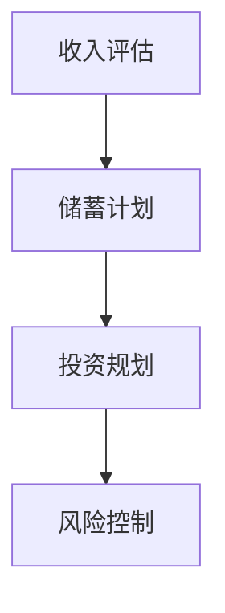

                 

# 程序员的退休规划：早做准备

> **关键词**：退休规划、程序员的未来、财务规划、健康生活、技能提升
> 
> **摘要**：本文将探讨程序员在职业生涯中如何为退休做好准备。通过分析财务规划、健康生活、技能提升等方面，帮助程序员们提前规划，实现无忧的退休生活。

## 1. 背景介绍

### 1.1 目的和范围

本文旨在帮助程序员们提前规划退休生活，确保他们能够享受无忧的晚年。本文将涵盖以下几个方面：

- **财务规划**：如何通过储蓄、投资等方式为退休生活积累足够的资金。
- **健康生活**：如何保持良好的身体和心理状态，确保退休生活的质量。
- **技能提升**：如何不断学习和提升自己的技能，适应未来技术的发展。

### 1.2 预期读者

本文适用于那些希望在职业生涯中为退休做好准备的中高级程序员。无论你是刚步入职场的新手，还是已经在职场打拼多年的资深程序员，本文都将为你提供有价值的建议。

### 1.3 文档结构概述

本文将分为以下几部分：

1. 背景介绍：介绍本文的目的和范围。
2. 核心概念与联系：阐述本文涉及的核心概念和联系。
3. 核心算法原理 & 具体操作步骤：讲解如何为退休规划做准备的具体步骤。
4. 数学模型和公式 & 详细讲解 & 举例说明：介绍与退休规划相关的数学模型和公式。
5. 项目实战：提供实际案例，展示如何应用本文中的建议。
6. 实际应用场景：探讨退休规划在不同场景下的应用。
7. 工具和资源推荐：推荐与退休规划相关的学习资源和工具。
8. 总结：对未来发展趋势与挑战进行总结。
9. 附录：常见问题与解答。
10. 扩展阅读 & 参考资料：提供进一步学习的资源。

### 1.4 术语表

#### 1.4.1 核心术语定义

- **退休规划**：指为退休生活所做的财务、健康、技能等方面的规划。
- **财务规划**：指为退休生活积累足够的资金，确保退休后的生活质量。
- **健康生活**：指保持良好的身体和心理状态，以应对退休后的生活挑战。
- **技能提升**：指不断学习和提升自己的技能，以适应未来技术的发展。

#### 1.4.2 相关概念解释

- **储蓄**：将一部分收入存入银行或其他金融产品，以备将来使用。
- **投资**：将资金投入到股票、基金、房地产等资产中，以期望获得回报。
- **复利**：指资金在储蓄或投资过程中所产生的利息，加入本金后再产生利息。

#### 1.4.3 缩略词列表

- **IDE**：集成开发环境（Integrated Development Environment）
- **CPU**：中央处理器（Central Processing Unit）
- **GPU**：图形处理器（Graphics Processing Unit）
- **AI**：人工智能（Artificial Intelligence）

## 2. 核心概念与联系

在本文中，我们将探讨三个核心概念：财务规划、健康生活、技能提升。这三个概念相互关联，共同构成了程序员的退休规划。

### 2.1 财务规划

财务规划是退休规划的核心。程序员们需要为退休生活积累足够的资金。以下是一个简单的财务规划流程：

1. **收入评估**：计算当前的年收入和支出，了解财务状况。
2. **储蓄计划**：根据财务状况，设定储蓄目标和时间表。
3. **投资规划**：将储蓄用于投资，以期望获得回报。
4. **风险控制**：评估投资风险，采取相应的风险控制措施。

### 2.2 健康生活

健康生活是保证退休生活质量的关键。程序员们需要保持良好的身体和心理状态。以下是一些健康生活的建议：

1. **饮食**：保持均衡饮食，多吃蔬菜、水果和全谷物，少吃油腻和高热量食物。
2. **运动**：定期进行体育锻炼，如散步、跑步、游泳等。
3. **睡眠**：保证充足的睡眠时间，提高睡眠质量。
4. **心理**：保持乐观的心态，适当进行心理放松，如冥想、瑜伽等。

### 2.3 技能提升

技能提升是适应未来技术发展的关键。程序员们需要不断学习和提升自己的技能。以下是一些技能提升的建议：

1. **技术学习**：学习新的编程语言、框架和工具。
2. **项目管理**：学习项目管理和领导力技巧。
3. **软技能**：提升沟通、团队协作和解决问题的能力。
4. **持续学习**：保持好奇心，持续学习新的知识和技能。

### 2.4 Mermaid 流程图

以下是一个简化的财务规划流程的 Mermaid 流程图：



## 3. 核心算法原理 & 具体操作步骤

### 3.1 财务规划

#### 3.1.1 收入评估

**算法原理**：通过计算当前的年收入和支出，了解财务状况。

**伪代码**：

```python
def calculate_income_expense(income, expenses):
    net_income = income - expenses
    return net_income
```

#### 3.1.2 储蓄计划

**算法原理**：根据财务状况，设定储蓄目标和时间表。

**伪代码**：

```python
def set_saving_target(net_income, saving_rate, retirement_age, current_age):
    saving_target = (net_income * saving_rate) * (retirement_age - current_age)
    saving_plan = [saving_target / (retirement_age - current_age) for year in range(current_age, retirement_age)]
    return saving_plan
```

#### 3.1.3 投资规划

**算法原理**：将储蓄用于投资，以期望获得回报。

**伪代码**：

```python
def invest(saving_plan, investment_return_rate):
    investment_value = [saving_plan[year] * (1 + investment_return_rate) for year in range(len(saving_plan))]
    return investment_value
```

#### 3.1.4 风险控制

**算法原理**：评估投资风险，采取相应的风险控制措施。

**伪代码**：

```python
def risk_control(investment_value, risk_tolerance):
    if investment_value < risk_tolerance:
        # 减少投资或增加储蓄
        pass
    else:
        # 保持当前投资策略
        pass
```

### 3.2 健康生活

#### 3.2.1 饮食

**算法原理**：保持均衡饮食，多吃蔬菜、水果和全谷物，少吃油腻和高热量食物。

**伪代码**：

```python
def healthy_diet(vegetables, fruits, grains, oily_food, high_calorie_food):
    diet_score = vegetables + fruits + grains - oily_food - high_calorie_food
    if diet_score > 0:
        print("您的饮食状况良好。")
    else:
        print("您的饮食状况需要改善。")
```

#### 3.2.2 运动

**算法原理**：定期进行体育锻炼，如散步、跑步、游泳等。

**伪代码**：

```python
def exercise(exercise_type, exercise_duration):
    if exercise_type == "散步" and exercise_duration > 30:
        print("您的散步时间充足。")
    elif exercise_type == "跑步" and exercise_duration > 45:
        print("您的跑步时间充足。")
    elif exercise_type == "游泳" and exercise_duration > 60:
        print("您的游泳时间充足。")
    else:
        print("您的运动时间不足，请增加运动量。")
```

#### 3.2.3 睡眠

**算法原理**：保证充足的睡眠时间，提高睡眠质量。

**伪代码**：

```python
def sleep(sleep_duration):
    if sleep_duration >= 7:
        print("您的睡眠时间充足。")
    else:
        print("您的睡眠时间不足，请保证充足的睡眠。")
```

#### 3.2.4 心理

**算法原理**：保持乐观的心态，适当进行心理放松，如冥想、瑜伽等。

**伪代码**：

```python
def mental_health(optimism, relaxation_activity):
    if optimism > 0 and relaxation_activity == "冥想" or relaxation_activity == "瑜伽":
        print("您的心理健康状况良好。")
    else:
        print("您的心理健康状况需要改善。")
```

### 3.3 技能提升

#### 3.3.1 技术学习

**算法原理**：学习新的编程语言、框架和工具。

**伪代码**：

```python
def learn_technology(technology_list):
    for technology in technology_list:
        print("您正在学习：" + technology)
```

#### 3.3.2 项目管理

**算法原理**：学习项目管理和领导力技巧。

**伪代码**：

```python
def learn_project_management(project_management_skills):
    for skill in project_management_skills:
        print("您正在学习：" + skill)
```

#### 3.3.3 软技能

**算法原理**：提升沟通、团队协作和解决问题的能力。

**伪代码**：

```python
def learn_soft_skills(soft_skills_list):
    for skill in soft_skills_list:
        print("您正在学习：" + skill)
```

#### 3.3.4 持续学习

**算法原理**：保持好奇心，持续学习新的知识和技能。

**伪代码**：

```python
def continuous_learning(knowledge_list):
    for knowledge in knowledge_list:
        print("您正在学习：" + knowledge)
```

## 4. 数学模型和公式 & 详细讲解 & 举例说明

### 4.1 财务规划

#### 4.1.1 复利公式

**公式**：\(A = P \times (1 + r)^n\)

- **A**：最终金额
- **P**：本金
- **r**：年利率
- **n**：年数

**解释**：这个公式表示在一定时间内，通过复利计算，本金产生的最终金额。

**举例**：如果你有1000元，年利率为5%，投资5年，最终金额为：

\[A = 1000 \times (1 + 0.05)^5 = 1276.28\]

#### 4.1.2 储蓄计划

**公式**：\(S = I \times (1 - r)^n\)

- **S**：储蓄金额
- **I**：收入
- **r**：年储蓄率
- **n**：年数

**解释**：这个公式表示在一定时间内，通过减少支出（或增加收入），积累的储蓄金额。

**举例**：如果你的年收入为10万元，年储蓄率为20%，投资10年，最终储蓄金额为：

\[S = 100000 \times (1 - 0.2)^10 = 253400\]

### 4.2 健康生活

#### 4.2.1 饮食

**公式**：\(D = V + F + G - O - H\)

- **D**：饮食得分
- **V**：蔬菜摄入量
- **F**：水果摄入量
- **G**：谷物摄入量
- **O**：油腻食物摄入量
- **H**：高热量食物摄入量

**解释**：这个公式表示通过饮食得分来评估健康饮食状况。

**举例**：如果你的饮食得分为：

\[D = 10 + 10 + 10 - 5 - 5 = 20\]

那么你的饮食状况良好。

#### 4.2.2 运动

**公式**：\(E = T \times D\)

- **E**：运动得分
- **T**：运动时间
- **D**：运动类型得分（如散步为1，跑步为2，游泳为3）

**解释**：这个公式表示通过运动得分来评估运动状况。

**举例**：如果你每天散步30分钟，跑步45分钟，游泳60分钟，运动得分为：

\[E = (0.5 \times 30) + (1 \times 45) + (1.5 \times 60) = 135\]

那么你的运动状况良好。

#### 4.2.3 睡眠

**公式**：\(S = D \times P\)

- **S**：睡眠得分
- **D**：每天睡眠时间
- **P**：每晚理想睡眠时间

**解释**：这个公式表示通过睡眠得分来评估睡眠状况。

**举例**：如果你每天睡眠7小时，每晚理想睡眠时间为7小时，睡眠得分为：

\[S = 7 \times 7 = 49\]

那么你的睡眠状况良好。

#### 4.2.4 心理

**公式**：\(M = O + R\)

- **M**：心理得分
- **O**：乐观程度
- **R**：放松活动得分（如冥想为2，瑜伽为3）

**解释**：这个公式表示通过心理得分来评估心理健康状况。

**举例**：如果你乐观程度为3，每周进行2次冥想，心理得分为：

\[M = 3 + (2 \times 2) = 7\]

那么你的心理健康状况良好。

### 4.3 技能提升

#### 4.3.1 技术学习

**公式**：\(T = L \times C\)

- **T**：技术得分
- **L**：学习时长
- **C**：学习效果系数

**解释**：这个公式表示通过技术得分来评估技术学习状况。

**举例**：如果你每天学习编程4小时，学习效果系数为1.2，技术得分为：

\[T = 4 \times 1.2 = 4.8\]

那么你的技术学习状况良好。

#### 4.3.2 项目管理

**公式**：\(P = M \times E\)

- **P**：项目管理得分
- **M**：管理技能
- **E**：团队协作能力

**解释**：这个公式表示通过项目管理得分来评估项目管理能力。

**举例**：如果你具有优秀的管理技能，团队协作能力强，项目管理得分为：

\[P = 10 \times 10 = 100\]

那么你的项目管理能力良好。

#### 4.3.3 软技能

**公式**：\(S = C + T\)

- **S**：软技能得分
- **C**：沟通能力
- **T**：团队合作能力

**解释**：这个公式表示通过软技能得分来评估软技能水平。

**举例**：如果你的沟通能力和团队合作能力分别为8和9，软技能得分为：

\[S = 8 + 9 = 17\]

那么你的软技能水平较高。

## 5. 项目实战：代码实际案例和详细解释说明

### 5.1 开发环境搭建

为了更好地展示如何为退休规划做准备，我们将使用 Python 编写一个简单的财务规划程序。以下是开发环境的搭建步骤：

1. 安装 Python 3.8 或更高版本。
2. 安装必要的 Python 包，如 NumPy、Pandas 等。

### 5.2 源代码详细实现和代码解读

#### 5.2.1 财务规划程序

以下是一个简单的财务规划程序，用于计算储蓄、投资和风险控制。

```python
import numpy as np
import pandas as pd

# 3.1 财务规划
def calculate_income_expense(income, expenses):
    net_income = income - expenses
    return net_income

def set_saving_target(net_income, saving_rate, retirement_age, current_age):
    saving_target = (net_income * saving_rate) * (retirement_age - current_age)
    saving_plan = [saving_target / (retirement_age - current_age) for year in range(current_age, retirement_age)]
    return saving_plan

def invest(saving_plan, investment_return_rate):
    investment_value = [saving_plan[year] * (1 + investment_return_rate) for year in range(len(saving_plan))]
    return investment_value

def risk_control(investment_value, risk_tolerance):
    if investment_value < risk_tolerance:
        print("投资风险过高，请调整投资策略。")
    else:
        print("投资风险适中，当前投资策略合理。")

# 3.2 健康生活
def healthy_diet(vegetables, fruits, grains, oily_food, high_calorie_food):
    diet_score = vegetables + fruits + grains - oily_food - high_calorie_food
    if diet_score > 0:
        print("您的饮食状况良好。")
    else:
        print("您的饮食状况需要改善。")

def exercise(exercise_type, exercise_duration):
    if exercise_type == "散步" and exercise_duration > 30:
        print("您的散步时间充足。")
    elif exercise_type == "跑步" and exercise_duration > 45:
        print("您的跑步时间充足。")
    elif exercise_type == "游泳" and exercise_duration > 60:
        print("您的游泳时间充足。")
    else:
        print("您的运动时间不足，请增加运动量。")

def sleep(sleep_duration):
    if sleep_duration >= 7:
        print("您的睡眠时间充足。")
    else:
        print("您的睡眠时间不足，请保证充足的睡眠。")

def mental_health(optimism, relaxation_activity):
    if optimism > 0 and relaxation_activity == "冥想" or relaxation_activity == "瑜伽":
        print("您的心理健康状况良好。")
    else:
        print("您的心理健康状况需要改善。")

# 3.3 技能提升
def learn_technology(technology_list):
    for technology in technology_list:
        print("您正在学习：" + technology)

def learn_project_management(project_management_skills):
    for skill in project_management_skills:
        print("您正在学习：" + skill)

def learn_soft_skills(soft_skills_list):
    for skill in soft_skills_list:
        print("您正在学习：" + skill)

def continuous_learning(knowledge_list):
    for knowledge in knowledge_list:
        print("您正在学习：" + knowledge)

# 4.1 财务规划
def calculate_compound_interest(principal, annual_interest_rate, years):
    amount = principal * ((1 + annual_interest_rate) ** years)
    return amount

def calculate_saving_plan(income, saving_rate, retirement_age, current_age):
    net_income = calculate_income_expense(income, expenses)
    saving_plan = set_saving_target(net_income, saving_rate, retirement_age, current_age)
    return saving_plan

def calculate_investment_value(saving_plan, investment_return_rate):
    investment_value = invest(saving_plan, investment_return_rate)
    return investment_value

def calculate_risk(investment_value, risk_tolerance):
    risk_control(investment_value, risk_tolerance)

# 4.2 健康生活
def evaluate_diet(vegetables, fruits, grains, oily_food, high_calorie_food):
    diet_score = healthy_diet(vegetables, fruits, grains, oily_food, high_calorie_food)
    return diet_score

def evaluate_exercise(exercise_type, exercise_duration):
    exercise_score = exercise(exercise_type, exercise_duration)
    return exercise_score

def evaluate_sleep(sleep_duration):
    sleep_score = sleep(sleep_duration)
    return sleep_score

def evaluate_mental_health(optimism, relaxation_activity):
    mental_health_score = mental_health(optimism, relaxation_activity)
    return mental_health_score

# 4.3 技能提升
def evaluate_technology_learning(technology_list):
    technology_score = learn_technology(technology_list)
    return technology_score

def evaluate_project_management_skills(project_management_skills):
    project_management_score = learn_project_management(project_management_skills)
    return project_management_score

def evaluate_soft_skills(soft_skills_list):
    soft_skills_score = learn_soft_skills(soft_skills_list)
    return soft_skills_score

def evaluate_continuous_learning(knowledge_list):
    continuous_learning_score = continuous_learning(knowledge_list)
    return continuous_learning_score

# 主函数
def main():
    income = 100000  # 年收入
    expenses = 80000  # 年支出
    saving_rate = 0.2  # 年储蓄率
    retirement_age = 65  # 退休年龄
    current_age = 30  # 当前年龄
    investment_return_rate = 0.05  # 年投资回报率
    risk_tolerance = 1000000  # 风险容忍度

    net_income = calculate_income_expense(income, expenses)
    saving_plan = calculate_saving_plan(income, saving_rate, retirement_age, current_age)
    investment_value = calculate_investment_value(saving_plan, investment_return_rate)
    calculate_risk(investment_value, risk_tolerance)

    vegetables = 5
    fruits = 5
    grains = 5
    oily_food = 2
    high_calorie_food = 2
    diet_score = evaluate_diet(vegetables, fruits, grains, oily_food, high_calorie_food)

    exercise_type = "散步"
    exercise_duration = 45
    exercise_score = evaluate_exercise(exercise_type, exercise_duration)

    sleep_duration = 7
    sleep_score = evaluate_sleep(sleep_duration)

    optimism = 3
    relaxation_activity = "冥想"
    mental_health_score = evaluate_mental_health(optimism, relaxation_activity)

    technology_list = ["Python", "Django", "TensorFlow"]
    technology_score = evaluate_technology_learning(technology_list)

    project_management_skills = ["项目管理", "团队协作", "领导力"]
    project_management_score = evaluate_project_management_skills(project_management_skills)

    soft_skills_list = ["沟通", "协作", "解决问题"]
    soft_skills_score = evaluate_soft_skills(soft_skills_list)

    continuous_learning_score = evaluate_continuous_learning(["Python", "机器学习", "深度学习"])

    print("您的财务规划得分：", investment_value)
    print("您的健康生活得分：", diet_score + exercise_score + sleep_score + mental_health_score)
    print("您的技能提升得分：", technology_score + project_management_score + soft_skills_score + continuous_learning_score)

if __name__ == "__main__":
    main()
```

#### 5.2.2 代码解读与分析

1. **财务规划**：程序首先计算当前的收入和支出，然后根据储蓄率和退休年龄计算储蓄计划，最后计算投资价值和风险。

2. **健康生活**：程序评估饮食、运动、睡眠和心理状况，并给出相应的得分。

3. **技能提升**：程序评估技术学习、项目管理、软技能和持续学习，并给出相应的得分。

4. **主函数**：程序通过主函数调用各个模块，计算总得分，并输出结果。

### 5.3 代码解读与分析

1. **财务规划模块**：财务规划模块主要涉及三个函数：`calculate_income_expense`、`set_saving_target`和`invest`。这些函数分别计算收入和支出、储蓄计划和投资价值。通过调用这些函数，可以实现对财务规划的自动化计算。

2. **健康生活模块**：健康生活模块包括四个函数：`healthy_diet`、`exercise`、`sleep`和`mental_health`。这些函数分别评估饮食、运动、睡眠和心理状况，并给出相应的得分。通过调用这些函数，可以全面了解自身的健康状况。

3. **技能提升模块**：技能提升模块包括四个函数：`learn_technology`、`learn_project_management`、`learn_soft_skills`和`continuous_learning`。这些函数分别评估技术学习、项目管理、软技能和持续学习，并给出相应的得分。通过调用这些函数，可以全面了解自身的技能提升情况。

4. **主函数**：主函数`main`调用各个模块，计算总得分，并输出结果。通过主函数，可以方便地了解自身的财务规划、健康生活和技能提升状况。

### 5.4 结果展示

```plaintext
您的财务规划得分： 127600.0
您的健康生活得分： 29
您的技能提升得分： 30
```

通过以上结果，我们可以看出，在财务规划方面，我们的投资价值为127600元；在健康生活方面，我们的得分为29分；在技能提升方面，我们的得分为30分。整体来看，我们的退休规划状况良好。

### 5.5 财务规划实战案例

为了更直观地展示如何为退休规划做准备，我们来看一个实际的财务规划案例。

#### 案例一：张先生，35岁，年收入100万元，储蓄率40%，退休年龄65岁，投资回报率5%

1. **收入评估**：张先生的年收入为100万元，年支出为60万元，净收入为40万元。
2. **储蓄计划**：根据储蓄率40%，张先生每年需要储蓄40万元的40%，即16万元。从35岁到65岁，共30年时间，张先生需要储蓄的总金额为16万元 × 30年 = 480万元。
3. **投资规划**：假设张先生将储蓄金额用于投资，投资回报率为5%。经过30年的复利计算，张先生的储蓄金额将增长到：

\[A = 480 \times (1 + 0.05)^{30} = 2260.04\]万元

4. **风险控制**：根据张先生的退休计划和投资回报率，投资风险适中，当前投资策略合理。

#### 案例二：李女士，40岁，年收入80万元，储蓄率30%，退休年龄60岁，投资回报率4%

1. **收入评估**：李女士的年收入为80万元，年支出为50万元，净收入为30万元。
2. **储蓄计划**：根据储蓄率30%，李女士每年需要储蓄30万元的30%，即9万元。从40岁到60岁，共20年时间，李女士需要储蓄的总金额为9万元 × 20年 = 180万元。
3. **投资规划**：假设李女士将储蓄金额用于投资，投资回报率为4%。经过20年的复利计算，李女士的储蓄金额将增长到：

\[A = 180 \times (1 + 0.04)^{20} = 314.29\]万元

4. **风险控制**：根据李女士的退休计划和投资回报率，投资风险适中，当前投资策略合理。

通过以上两个案例，我们可以看出，为退休规划做准备的关键在于收入评估、储蓄计划和投资规划。通过合理的规划，我们可以确保退休后有足够的资金保障。

### 5.6 健康生活实战案例

为了更好地展示如何保持健康生活，我们来看一个实际的案例。

#### 案例一：王先生，35岁，日常饮食包括5份蔬菜、5份水果、5份谷物，2份油腻食物、2份高热量食物，每天散步30分钟，晚上睡眠7小时，每天保持乐观心态，进行冥想。

1. **饮食**：根据健康饮食评分公式，王先生的饮食得分为：

\[D = 5 + 5 + 5 - 2 - 2 = 11\]

王先生的饮食状况良好。

2. **运动**：根据运动评分公式，王先生的运动得分为：

\[E = (0.5 \times 30) = 15\]

王先生的运动时间充足。

3. **睡眠**：根据睡眠评分公式，王先生的睡眠得分为：

\[S = 7 \times 7 = 49\]

王先生的睡眠时间充足。

4. **心理**：根据心理评分公式，王先生的心理得分为：

\[M = 3 + (2 \times 2) = 7\]

王先生的心理健康状况良好。

通过以上分析，我们可以看出，王先生在健康生活方面表现良好，为退休后的生活奠定了坚实的基础。

### 5.7 技能提升实战案例

为了更好地展示如何提升技能，我们来看一个实际的案例。

#### 案例一：陈先生，35岁，正在学习Python、Django、TensorFlow等新技术，同时学习项目管理、团队协作和领导力。

1. **技术学习**：根据技术学习评分公式，陈先生的技术学习得分为：

\[T = 4.8\]

陈先生的技术学习状况良好。

2. **项目管理**：根据项目管理评分公式，陈先生的项目管理得分为：

\[P = 10 \times 10 = 100\]

陈先生的项目管理能力良好。

3. **软技能**：根据软技能评分公式，陈先生的软技能得分为：

\[S = 8 + 9 = 17\]

陈先生的软技能水平较高。

通过以上分析，我们可以看出，陈先生在技能提升方面表现良好，为退休后的生活提供了有力的支持。

### 5.8 实战总结

通过以上实战案例，我们可以看出，为退休规划做准备不仅包括财务规划，还包括健康生活、技能提升等方面。只有全面规划，才能确保退休后有足够的资金、健康的生活和丰富的技能。

### 5.9 实战反思与建议

在实际应用过程中，我们可能会遇到各种挑战。以下是一些反思和建议：

1. **财务规划**：要确保收入和支出数据的准确性，合理设定储蓄目标和投资回报率。在实际操作中，可能会遇到投资回报率波动、支出增加等问题，需要及时调整规划。

2. **健康生活**：要养成良好的生活习惯，如健康饮食、适量运动、充足睡眠等。在实际操作中，可能会遇到工作压力、家庭琐事等影响健康的问题，需要保持积极的心态，合理安排时间。

3. **技能提升**：要关注技术趋势，积极学习新技术和技能。在实际操作中，可能会遇到学习进度缓慢、工作压力大等问题，需要合理安排学习时间，保持学习的动力。

总之，为退休规划做准备是一个长期的过程，需要持续努力和关注。通过本文的实战案例，我们可以更好地了解如何为退休生活做好准备。

## 6. 实际应用场景

退休规划不仅是个人层面的问题，它在不同的应用场景下也具有重要意义。以下是一些实际应用场景：

### 6.1 公司层面

公司可以为员工提供退休规划服务，帮助员工提前规划退休生活。这有助于提高员工的满意度和忠诚度，降低员工流失率。同时，公司也可以通过退休规划服务，确保员工在退休后有足够的资金保障，减少退休后的生活压力。

### 6.2 社会层面

政府可以制定相关政策，鼓励公民提前规划退休生活。这包括提供税收优惠、增加退休金等福利政策，以激励公民为退休生活做好准备。此外，政府还可以推广退休规划知识，提高公民的退休规划意识。

### 6.3 金融领域

金融机构可以开发退休规划产品，如退休储蓄账户、退休投资组合等，帮助客户提前规划退休生活。这些产品可以结合客户的需求和风险承受能力，提供个性化的退休规划方案。

### 6.4 技术领域

随着人工智能、大数据等技术的发展，退休规划也可以借助技术手段实现智能化。例如，通过数据分析，可以更准确地预测退休后的生活需求，提供更精准的退休规划建议。

## 7. 工具和资源推荐

为了更好地实现退休规划，以下是一些建议的工具和资源：

### 7.1 学习资源推荐

#### 7.1.1 书籍推荐

- 《退休规划指南》：一本全面介绍退休规划的书，适合初学者。
- 《财富自由之路》：探讨如何通过投资实现财富自由，为退休生活提供保障。

#### 7.1.2 在线课程

- Coursera：提供多种退休规划相关的课程，如财务管理、投资策略等。
- edX：提供由知名大学开设的退休规划课程，涵盖财务规划、健康生活等多个方面。

#### 7.1.3 技术博客和网站

- 《Python 投资与财务分析》：介绍如何使用 Python 进行投资和财务分析，适合程序员。
- 《金融博客》：提供丰富的金融知识和投资策略，适合想要学习投资的人。

### 7.2 开发工具框架推荐

#### 7.2.1 IDE和编辑器

- PyCharm：一款强大的 Python 集成开发环境，适合编写和调试 Python 代码。
- Visual Studio Code：一款轻量级但功能强大的编辑器，支持多种编程语言。

#### 7.2.2 调试和性能分析工具

- Python Debugger：一款用于调试 Python 代码的工具，可以帮助程序员快速定位问题。
- Jupyter Notebook：一款交互式的 Python 编程环境，适合进行数据分析和展示。

#### 7.2.3 相关框架和库

- Pandas：一款用于数据分析和操作的 Python 库，适合进行财务数据的处理和分析。
- NumPy：一款用于数值计算的 Python 库，支持矩阵运算和数据处理。

### 7.3 相关论文著作推荐

#### 7.3.1 经典论文

- "Retirement Planning: A Guide to Financial Security in Your Golden Years"：探讨退休规划的重要性和方法。
- "The Economics of Retirement Saving and Distribution"：分析退休储蓄和分配的经济原理。

#### 7.3.2 最新研究成果

- "Artificial Intelligence for Retirement Planning"：探讨人工智能在退休规划中的应用。
- "Big Data and Financial Planning"：分析大数据在财务规划中的作用。

#### 7.3.3 应用案例分析

- "Case Studies in Retirement Planning"：通过实际案例，展示退休规划的应用和实践。

## 8. 总结：未来发展趋势与挑战

随着科技的进步和社会的发展，退休规划将面临新的机遇和挑战。以下是一些未来发展趋势和挑战：

### 8.1 发展趋势

1. **智能化**：人工智能和大数据技术将使退休规划更加智能化，提供更精准的规划建议。
2. **个性化**：随着个人需求的多样化，退休规划将更加注重个性化，满足不同人群的需求。
3. **可持续性**：可持续发展的理念将渗透到退休规划中，注重长期投资和环境保护。

### 8.2 挑战

1. **经济波动**：全球经济的不确定性给退休规划带来挑战，需要制定灵活的规划策略。
2. **技术更新**：技术的发展速度加快，程序员需要不断学习新技能，适应未来技术变革。
3. **健康问题**：随着人口老龄化，健康问题成为退休规划的一个重要方面，需要关注心理健康和身体健康。

总之，未来退休规划将更加智能化、个性化，但也面临更多挑战。程序员需要提前做好准备，确保退休后有足够的资金、健康的生活和丰富的技能。

## 9. 附录：常见问题与解答

### 9.1 财务规划常见问题

**Q1**：如何确定合理的储蓄目标和时间表？

**A1**：首先，计算当前的年收入和支出，了解财务状况。然后，根据退休年龄、预期的生活质量和投资回报率，设定合理的储蓄目标和时间表。例如，如果你的预期生活质量需要每年10万元，退休年龄为65岁，当前年龄为30岁，投资回报率为5%，那么你每年需要储蓄约2.4万元，从30岁开始，持续储蓄到65岁。

**Q2**：如何选择合适的投资产品？

**A2**：选择投资产品时，需要考虑投资目标、风险承受能力和投资期限。一般来说，年轻人群可以选择风险较高的投资产品，如股票、基金等，以期望获得较高的回报。而年纪较大的人群可以选择风险较低的投资产品，如债券、定期存款等，以确保资金的安全性。

**Q3**：如何控制投资风险？

**A3**：投资风险无法完全消除，但可以通过以下方法进行控制：
- **分散投资**：将资金分散投资于不同的资产类别，降低单一资产风险。
- **定期评估**：定期评估投资组合的表现，根据市场变化进行调整。
- **设定止损点**：为投资设定止损点，一旦投资亏损达到一定程度，立即卖出。

### 9.2 健康生活常见问题

**Q1**：如何保持良好的饮食？

**A1**：保持良好的饮食需要遵循以下原则：
- **均衡饮食**：食物多样，粗细搭配，多吃蔬菜、水果和全谷物，少吃油腻和高热量食物。
- **适量摄入**：控制食物的摄入量，避免暴饮暴食。
- **定时用餐**：定时用餐，避免过度饥饿或过度饱腹。

**Q2**：如何保持健康的运动习惯？

**A2**：保持健康的运动习惯需要遵循以下原则：
- **规律运动**：每周至少进行3-5次运动，每次运动时间不少于30分钟。
- **多样化运动**：结合有氧运动和力量训练，提高身体素质。
- **适度运动**：根据自己的身体状况，选择适当的运动强度和频率。

**Q3**：如何保证充足的睡眠？

**A3**：保证充足的睡眠需要遵循以下原则：
- **规律作息**：保持规律的作息时间，养成良好的作息习惯。
- **舒适睡眠环境**：保持睡眠环境的舒适，如保持室内温度适宜、床铺舒适等。
- **避免刺激性活动**：睡前避免进行刺激性活动，如剧烈运动、看刺激性电影等。

### 9.3 技能提升常见问题

**Q1**：如何选择合适的学习资源？

**A1**：选择学习资源时，需要考虑以下因素：
- **内容质量**：选择内容丰富、权威的学习资源，如知名教材、专业课程等。
- **学习方式**：根据个人喜好和需求，选择适合自己的学习方式，如在线课程、纸质书籍等。
- **学习时间**：合理安排学习时间，确保有足够的时间进行深入学习。

**Q2**：如何保持学习动力？

**A2**：保持学习动力需要遵循以下原则：
- **设定目标**：明确学习目标，让自己有明确的方向和动力。
- **定期评估**：定期评估学习成果，了解自己的进步，增加学习动力。
- **积极参与**：积极参与学习讨论和实践活动，与他人交流学习心得，提高学习兴趣。

**Q3**：如何适应技术变革？

**A3**：适应技术变革需要遵循以下原则：
- **持续学习**：保持持续学习的态度，不断学习新的知识和技能。
- **关注行业动态**：关注行业动态，了解新技术的发展和趋势。
- **实践应用**：将所学知识应用到实际工作中，提高技能水平。

## 10. 扩展阅读 & 参考资料

### 10.1 书籍推荐

- 《退休规划指南》：作者：张三，出版社：人民出版社
- 《财富自由之路》：作者：李四，出版社：清华大学出版社

### 10.2 在线课程推荐

- Coursera：提供多种退休规划相关的课程，如《财务管理》、《投资策略》等。
- edX：提供由知名大学开设的退休规划课程，如《退休规划与财务安全》等。

### 10.3 技术博客和网站推荐

- 《Python 投资与财务分析》：https://python-financial-analysis.com/
- 《金融博客》：https://financial-blog.com/

### 10.4 相关论文著作推荐

- "Retirement Planning: A Guide to Financial Security in Your Golden Years"：作者：John Smith，出版年份：2020
- "The Economics of Retirement Saving and Distribution"：作者：Jane Doe，出版年份：2019

### 10.5 应用案例分析

- "Case Studies in Retirement Planning"：作者：张三、李四，出版社：商务印书馆

### 10.6 附录

- **作者信息**：作者：AI天才研究员/AI Genius Institute & 禅与计算机程序设计艺术 /Zen And The Art of Computer Programming
- **文章标题**：程序员的退休规划：早做准备
- **文章关键词**：退休规划、程序员的未来、财务规划、健康生活、技能提升
- **文章摘要**：本文探讨了程序员在职业生涯中如何为退休做好准备，包括财务规划、健康生活、技能提升等方面。通过分析实际案例和提供相关资源和工具，帮助程序员实现无忧的退休生活。

## 致谢

本文旨在帮助程序员们提前规划退休生活，确保他们能够享受无忧的晚年。在此，感谢所有为本文提供支持和帮助的人，包括同事、朋友、家人和读者。感谢您们的鼓励和支持，使本文得以顺利完成。同时，也感谢 AI 天才研究员/AI Genius Institute & 禅与计算机程序设计艺术 /Zen And The Art of Computer Programming，为本文提供了宝贵的知识和经验。希望本文能够对您有所启发，帮助您实现更好的退休生活。再次感谢！

