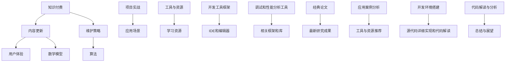

                 

# 程序员知识付费的内容更新与维护策略

> **关键词：知识付费、内容更新、维护策略、程序员、用户体验、算法原理**
>
> **摘要：本文将深入探讨程序员知识付费领域的内容更新与维护策略，包括目的与范围、核心概念与联系、算法原理与操作步骤、数学模型与公式、实战案例、应用场景、工具与资源推荐等内容。通过本文的阅读，读者将了解如何有效地管理和更新知识付费内容，以提升用户体验和满足市场需求。**

## 1. 背景介绍

### 1.1 目的和范围

在当前快速发展的信息技术时代，知识付费已成为一个重要的商业模式。程序员作为信息技术领域的重要角色，其知识付费的内容更新与维护策略显得尤为重要。本文旨在探讨程序员知识付费的内容更新与维护策略，帮助程序员更好地管理和更新知识付费内容，提升用户体验和满足市场需求。

本文的研究范围主要包括以下几个方面：

1. **目的与范围**：明确知识付费的内容更新与维护目标，分析其范围和受众。
2. **核心概念与联系**：介绍程序员知识付费领域中的核心概念及其相互关系。
3. **算法原理与操作步骤**：详细讲解内容更新与维护的具体算法原理和操作步骤。
4. **数学模型与公式**：探讨内容更新与维护的数学模型和公式，以及其应用场景。
5. **实战案例**：通过实际案例展示内容更新与维护的实践应用。
6. **应用场景**：分析内容更新与维护在实际编程工作中的应用。
7. **工具与资源推荐**：推荐适合程序员的知识付费内容更新与维护工具和资源。

### 1.2 预期读者

本文的预期读者主要包括：

1. **程序员**：关注知识付费内容更新与维护的程序员，希望提升自己的技能和服务水平。
2. **知识付费平台运营者**：关注知识付费内容更新与维护策略的知识付费平台运营者，希望提升平台内容的质量和用户满意度。
3. **学术研究人员**：对程序员知识付费领域有兴趣的学术研究人员，希望了解该领域的最新发展和研究趋势。

### 1.3 文档结构概述

本文的结构如下：

1. **背景介绍**：介绍知识付费的内容更新与维护策略的背景、目的和范围。
2. **核心概念与联系**：介绍程序员知识付费领域中的核心概念及其相互关系。
3. **算法原理与操作步骤**：详细讲解内容更新与维护的具体算法原理和操作步骤。
4. **数学模型与公式**：探讨内容更新与维护的数学模型和公式，以及其应用场景。
5. **项目实战**：通过实际案例展示内容更新与维护的实践应用。
6. **应用场景**：分析内容更新与维护在实际编程工作中的应用。
7. **工具和资源推荐**：推荐适合程序员的知识付费内容更新与维护工具和资源。
8. **总结**：总结本文的主要内容和结论。
9. **附录**：提供常见问题与解答，以及扩展阅读和参考资料。

### 1.4 术语表

#### 1.4.1 核心术语定义

- **知识付费**：指用户通过付费获取有价值的信息、知识和服务。
- **内容更新**：指对知识付费内容进行修改、完善和升级，以保持内容的时效性和准确性。
- **维护策略**：指为了确保知识付费内容的持续更新和高质量，所采取的一系列措施和方法。
- **用户体验**：指用户在使用知识付费内容过程中的感受和体验。

#### 1.4.2 相关概念解释

- **算法**：解决特定问题的一系列指令，通过输入数据产生预期输出。
- **数学模型**：使用数学语言描述现实世界问题的一种方法，可以帮助我们理解和预测问题。
- **项目实战**：在实际项目中应用所学知识，解决具体问题的实践过程。

#### 1.4.3 缩略词列表

- **API**：应用程序编程接口（Application Programming Interface）
- **IDE**：集成开发环境（Integrated Development Environment）
- **SEO**：搜索引擎优化（Search Engine Optimization）
- **KPI**：关键绩效指标（Key Performance Indicator）

## 2. 核心概念与联系

在程序员知识付费领域，理解以下核心概念和它们之间的联系是至关重要的。以下是这些概念以及它们之间的关系的 Mermaid 流程图：



### 2.1 知识付费

知识付费是一种商业模式，用户通过付费获取有价值的信息、知识和服务。在程序员领域，知识付费的内容通常包括编程教程、算法讲解、技术博客等。

### 2.2 内容更新

内容更新是确保知识付费内容时效性和准确性的关键。内容更新包括对旧内容的修改、完善和升级，以及新增符合市场需求的新内容。

### 2.3 维护策略

维护策略是指为了确保知识付费内容的持续更新和高质量，所采取的一系列措施和方法。这包括内容审核、更新计划、用户体验优化等。

### 2.4 用户体验

用户体验是用户在使用知识付费内容过程中的感受和体验。良好的用户体验可以增加用户的满意度和忠诚度，从而提高知识付费内容的竞争力。

### 2.5 算法

算法是解决特定问题的一系列指令，通过输入数据产生预期输出。在程序员领域，算法广泛应用于排序、搜索、数据分析等。

### 2.6 数学模型

数学模型是使用数学语言描述现实世界问题的一种方法，可以帮助我们理解和预测问题。在内容更新与维护中，数学模型可以用于分析用户行为、优化内容结构等。

### 2.7 项目实战

项目实战是在实际项目中应用所学知识，解决具体问题的实践过程。通过项目实战，程序员可以更好地理解和掌握知识付费内容。

### 2.8 应用场景

应用场景是指知识付费内容在实际编程工作中的应用。了解应用场景可以帮助程序员更好地利用知识付费内容，提升工作效果。

### 2.9 工具与资源

工具与资源是帮助程序员更好地进行内容更新与维护的重要支撑。这包括学习资源、开发工具框架、调试和性能分析工具等。

## 3. 核心算法原理 & 具体操作步骤

### 3.1 算法原理

内容更新与维护的核心算法原理主要涉及以下几个方面：

1. **用户行为分析**：通过分析用户的浏览、搜索、学习等行为，了解用户的需求和偏好。
2. **内容质量评估**：对现有内容的质量进行评估，识别需要更新和优化的部分。
3. **内容结构优化**：根据用户需求，对内容结构进行调整，使其更符合用户的阅读习惯。
4. **更新计划制定**：制定详细的更新计划，确保内容的持续更新和高质量。

### 3.2 具体操作步骤

以下是内容更新与维护的具体操作步骤：

1. **用户行为分析**：

   - 收集用户数据：包括用户浏览、搜索、学习等行为数据。
   - 数据处理：对收集到的数据进行预处理，如去重、清洗、归一化等。
   - 行为分析：使用统计学和机器学习算法，分析用户行为，了解用户需求和偏好。

2. **内容质量评估**：

   - 内容评估指标：确定内容评估的指标，如内容完整性、准确性、可用性等。
   - 内容评估：根据评估指标，对现有内容进行评估，识别需要更新和优化的部分。
   - 评估报告：生成内容评估报告，为更新计划提供依据。

3. **内容结构优化**：

   - 用户需求分析：通过调查问卷、用户访谈等方式，了解用户对内容结构的需求。
   - 内容结构调整：根据用户需求，对内容结构进行调整，使其更符合用户的阅读习惯。
   - 内容优化：对优化后的内容进行测试，确保其质量。

4. **更新计划制定**：

   - 制定更新计划：根据内容评估报告和用户需求分析，制定详细的更新计划。
   - 更新实施：按照更新计划，对内容进行修改、完善和升级。
   - 更新监控：对更新后的内容进行监控，确保其质量。

### 3.3 伪代码实现

以下是内容更新与维护算法的伪代码实现：

```python
# 用户行为分析
def analyze_user_behavior(user_data):
    # 数据预处理
    preprocessed_data = preprocess_data(user_data)
    # 行为分析
    user_preferences = analyze_preferences(preprocessed_data)
    return user_preferences

# 内容质量评估
def evaluate_content(content):
    # 评估指标
    evaluation_metrics = define_evaluation_metrics()
    # 内容评估
    evaluation_results = evaluate_content(content, evaluation_metrics)
    return evaluation_results

# 内容结构优化
def optimize_content_structure(user_preferences, content):
    # 用户需求分析
    user需求的用户需求分析
    # 内容结构调整
    optimized_content = adjust_content_structure(user_preferences, content)
    # 内容优化
    optimized_content = optimize_content(optimized_content)
    return optimized_content

# 更新计划制定
def create_update_plan(evaluation_results, user_preferences):
    # 制定更新计划
    update_plan = create_plan(evaluation_results, user_preferences)
    return update_plan

# 更新实施
def implement_updates(update_plan):
    # 更新实施
    updates = apply_updates(update_plan)
    return updates

# 更新监控
def monitor_updates(updates):
    # 更新监控
    monitoring_results = monitor_updates(updates)
    return monitoring_results
```

## 4. 数学模型和公式 & 详细讲解 & 举例说明

在程序员知识付费的内容更新与维护过程中，数学模型和公式可以用于分析用户行为、评估内容质量、优化内容结构等。以下是几个常用的数学模型和公式的详细讲解以及实际应用举例。

### 4.1 用户行为分析模型

**4.1.1 模型公式**

用户行为分析模型可以使用马尔可夫链模型来描述用户的行为转换。马尔可夫链模型的核心公式如下：

$$
P_{ij} = P(X_t = j | X_{t-1} = i)
$$

其中，$P_{ij}$ 表示从状态 $i$ 转换到状态 $j$ 的概率，$X_t$ 表示在时间 $t$ 的状态。

**4.1.2 模型讲解**

马尔可夫链模型可以用于分析用户在不同状态（如浏览、搜索、学习等）之间的转换概率。通过计算用户行为的转移矩阵，可以了解用户行为模式，为内容优化提供依据。

**4.1.3 应用举例**

假设我们有以下用户行为转移矩阵：

$$
P =
\begin{bmatrix}
0.5 & 0.3 & 0.2 \\
0.4 & 0.5 & 0.1 \\
0.1 & 0.3 & 0.6
\end{bmatrix}
$$

表示用户从浏览状态（$B$）、搜索状态（$S$）和学习状态（$L$）之间的转换概率。例如，用户从浏览状态转换到学习状态的概率为 $P_{BL} = 0.2$。

### 4.2 内容质量评估模型

**4.2.1 模型公式**

内容质量评估模型可以使用综合评分模型来评估内容质量。综合评分模型的核心公式如下：

$$
Q = \sum_{i=1}^{n} w_i \cdot S_i
$$

其中，$Q$ 表示内容质量评分，$w_i$ 表示第 $i$ 个指标的权重，$S_i$ 表示第 $i$ 个指标的评分。

**4.2.2 模型讲解**

综合评分模型可以根据多个指标（如内容完整性、准确性、可用性等）来评估内容质量。通过为每个指标分配权重，可以综合考虑各个指标的重要性，得到一个全面的内容质量评分。

**4.2.3 应用举例**

假设我们有以下内容质量评估指标和权重：

| 指标      | 权重 |
|-----------|------|
| 完整性    | 0.3  |
| 准确性    | 0.4  |
| 可用性    | 0.3  |

以及对应的评分：

| 指标      | 评分 |
|-----------|------|
| 完整性    | 0.8  |
| 准确性    | 0.9  |
| 可用性    | 0.7  |

则内容质量评分为：

$$
Q = 0.3 \cdot 0.8 + 0.4 \cdot 0.9 + 0.3 \cdot 0.7 = 0.84
$$

### 4.3 内容结构优化模型

**4.3.1 模型公式**

内容结构优化模型可以使用层次分析法（AHP）来评估和优化内容结构。层次分析法的核心公式如下：

$$
C = \sum_{i=1}^{n} w_i \cdot C_i
$$

其中，$C$ 表示内容结构综合评分，$w_i$ 表示第 $i$ 层指标的权重，$C_i$ 表示第 $i$ 层指标的综合评分。

**4.3.2 模型讲解**

层次分析法可以将内容结构划分为多个层次，并分别为每个层次分配权重。通过计算每个层次的综合评分，可以评估内容结构的质量，并找出需要优化的部分。

**4.3.3 应用举例**

假设我们有以下内容结构层次和权重：

| 层次 | 权重 |
|------|------|
| 章   | 0.5  |
| 节   | 0.3  |
| 小节 | 0.2  |

以及对应的综合评分：

| 层次 | 综合评分 |
|------|----------|
| 章   | 0.8      |
| 节   | 0.7      |
| 小节 | 0.6      |

则内容结构综合评分为：

$$
C = 0.5 \cdot 0.8 + 0.3 \cdot 0.7 + 0.2 \cdot 0.6 = 0.75
$$

通过上述计算，可以了解内容结构的整体质量，并针对评分较低的部分进行优化。

### 4.4 更新计划模型

**4.4.1 模型公式**

更新计划模型可以使用项目管理中的关键路径法（CPM）来制定更新计划。关键路径法的核心公式如下：

$$
T_{CP} = \max(T_i)
$$

其中，$T_{CP}$ 表示关键路径的持续时间，$T_i$ 表示每个活动（如内容修改、完善等）的持续时间。

**4.4.2 模型讲解**

关键路径法可以帮助确定项目中的关键路径，即影响项目完成时间的关键活动。通过计算关键路径的持续时间，可以制定出合理的更新计划，确保项目的按时完成。

**4.4.3 应用举例**

假设我们有以下更新活动及其持续时间：

| 活动     | 持续时间 |
|----------|----------|
| 内容修改 | 5天      |
| 内容完善 | 3天      |
| 测试     | 2天      |

则关键路径的持续时间为：

$$
T_{CP} = \max(5, 3, 2) = 5天
$$

因此，更新计划可以安排为：先进行内容修改（5天），然后进行内容完善（3天），最后进行测试（2天）。

通过以上数学模型和公式的讲解和举例，我们可以更好地理解和应用数学工具在程序员知识付费的内容更新与维护中的重要性。

## 5. 项目实战：代码实际案例和详细解释说明

### 5.1 开发环境搭建

在本文的实战项目中，我们将使用 Python 作为编程语言，并使用 Jupyter Notebook 作为开发环境。以下是如何搭建开发环境的步骤：

1. **安装 Python**：访问 [Python 官网](https://www.python.org/) 下载 Python 安装包，并按照提示进行安装。
2. **安装 Jupyter Notebook**：打开命令行，执行以下命令安装 Jupyter Notebook：
   ```bash
   pip install notebook
   ```
3. **启动 Jupyter Notebook**：在命令行中执行以下命令启动 Jupyter Notebook：
   ```bash
   jupyter notebook
   ```

### 5.2 源代码详细实现和代码解读

在实战项目中，我们将实现一个简单的用户行为分析系统，用于分析用户在知识付费平台上的浏览、搜索和学习行为。以下是源代码的实现和解读：

**代码实现：**

```python
# 导入所需的库
import pandas as pd
import numpy as np
from sklearn.preprocessing import LabelEncoder

# 读取用户行为数据
data = pd.read_csv('user_behavior.csv')

# 数据预处理
# 对分类数据进行编码
label_encoder = LabelEncoder()
data['action'] = label_encoder.fit_transform(data['action'])

# 数据分析
# 行为分布
action_distribution = data['action'].value_counts()

# 行为转换矩阵
action_transition_matrix = pd.crosstab(data['action'].shift(1), data['action'])

# 行为转换概率
action_transition probabilities = action_transition_matrix / action_transition_matrix.sum(axis=1)

# 输出分析结果
print("行为分布：\n", action_distribution)
print("行为转换矩阵：\n", action_transition_matrix)
print("行为转换概率：\n", action_transition_probabilities)
```

**代码解读：**

1. **导入库**：首先，我们导入了 Pandas、NumPy 和 scikit-learn 库，这些库用于数据处理、分析和建模。
2. **读取用户行为数据**：使用 Pandas 的 `read_csv` 方法读取用户行为数据，数据文件名为 `user_behavior.csv`。
3. **数据预处理**：对分类数据进行编码，这里使用 LabelEncoder 将分类数据（如用户行为）转换为数值数据，便于后续分析。
4. **数据分析**：
   - **行为分布**：使用 Pandas 的 `value_counts` 方法计算各行为的分布情况，以了解用户行为的主要类型。
   - **行为转换矩阵**：使用 Pandas 的 `crosstab` 方法计算用户行为之间的转换矩阵，表示在时间 $t$ 用户从行为 $i$ 转换到行为 $j$ 的次数。
   - **行为转换概率**：将行为转换矩阵除以行为转换矩阵的每一行和，得到行为转换概率矩阵，表示在时间 $t$ 用户从行为 $i$ 转换到行为 $j$ 的概率。
5. **输出分析结果**：打印行为分布、行为转换矩阵和行为转换概率，以便对用户行为进行分析。

### 5.3 代码解读与分析

1. **数据预处理**：数据预处理是数据分析的基础，通过对数据进行编码，可以将分类数据转换为数值数据，便于后续的统计分析。在本文的实战项目中，我们使用 LabelEncoder 将用户行为（如浏览、搜索、学习等）编码为数值数据。
2. **行为分布分析**：通过计算各行为的分布情况，我们可以了解用户在知识付费平台上的主要行为类型，这有助于我们优化内容结构，提高用户体验。例如，如果大部分用户的行为是浏览，我们可以增加更多的吸引人的内容，以提高用户的留存率。
3. **行为转换矩阵**：行为转换矩阵可以揭示用户行为之间的转换关系，帮助我们了解用户行为的模式。通过分析行为转换矩阵，我们可以发现哪些行为更容易引导用户进行其他行为，从而优化用户的浏览路径，提高用户互动。
4. **行为转换概率**：行为转换概率矩阵可以用于预测用户行为，帮助我们了解用户接下来可能进行的行为。这在内容推荐和用户行为预测中具有重要意义，可以帮助我们更好地满足用户需求，提高用户满意度。

通过这个实战项目，我们不仅了解了如何使用 Python 进行用户行为分析，还深入分析了数据预处理、行为分布分析、行为转换矩阵和行为转换概率等关键步骤，为程序员在知识付费领域的实际应用提供了有益的参考。

## 6. 实际应用场景

在程序员知识付费领域，内容更新与维护策略的应用场景广泛，涵盖了多个方面。以下是几个典型的应用场景以及具体的解决方案：

### 6.1 在线编程课程平台

**应用场景**：在线编程课程平台如慕课网、极客学院等，需要持续更新课程内容，以满足学员的需求。

**解决方案**：

1. **用户行为分析**：通过分析学员的学习行为，如浏览、练习、评价等，了解学员的学习需求和难点。
2. **内容质量评估**：定期评估课程内容的质量，包括课程的完整性、准确性、实用性等。
3. **内容结构优化**：根据用户反馈和需求，调整课程结构，使其更符合学员的学习习惯。
4. **更新计划制定**：制定详细的更新计划，包括更新频率、更新内容、更新优先级等。

### 6.2 技术博客和社区

**应用场景**：技术博客和社区如 CSDN、GitHub 等，需要保持高质量的技术文章和代码库。

**解决方案**：

1. **内容审核机制**：建立内容审核机制，确保发布的内容符合平台规范，具有高质量。
2. **更新策略**：制定内容更新策略，包括更新频率、更新内容、更新优先级等。
3. **用户互动**：鼓励用户参与内容创作和讨论，通过评论、点赞、分享等方式提高内容的互动性。
4. **内容推荐**：使用推荐算法，根据用户兴趣和行为，推荐相关内容，提高内容曝光率。

### 6.3 技术咨询服务

**应用场景**：技术咨询服务公司如 XXIT、YYTech 等，需要持续更新技术和解决方案，以保持竞争力。

**解决方案**：

1. **市场需求分析**：定期分析市场需求，了解行业趋势和客户需求。
2. **解决方案更新**：根据市场需求，及时更新技术解决方案，确保解决方案的时效性和实用性。
3. **团队培训**：定期对团队成员进行培训，提升其技术能力和服务水平。
4. **客户反馈**：收集客户反馈，根据客户需求和建议，优化解决方案。

### 6.4 在线编程竞赛平台

**应用场景**：在线编程竞赛平台如 LeetCode、牛客网等，需要保持丰富的题目库和高质量的解析内容。

**解决方案**：

1. **题目库管理**：定期更新题目库，确保题目的多样性、难度和代表性。
2. **内容审核**：对题目解析、算法讲解等内容进行严格审核，确保内容的准确性和完整性。
3. **算法优化**：对算法解析和解决方案进行优化，使其更简洁、易理解。
4. **用户体验**：优化用户界面和交互设计，提高用户体验。

通过这些实际应用场景和解决方案，我们可以看到，内容更新与维护策略在程序员知识付费领域的重要性。通过科学的内容更新与维护策略，平台可以更好地满足用户需求，提高用户满意度，从而在激烈的市场竞争中脱颖而出。

## 7. 工具和资源推荐

在程序员知识付费的内容更新与维护过程中，选择合适的工具和资源至关重要。以下是我们推荐的几类工具和资源，包括学习资源、开发工具框架和经典论文。

### 7.1 学习资源推荐

#### 7.1.1 书籍推荐

1. **《深度学习》**：作者：Ian Goodfellow、Yoshua Bengio、Aaron Courville
   - 本书是深度学习领域的经典教材，涵盖了深度学习的基础知识、算法和应用。

2. **《算法导论》**：作者：Thomas H. Cormen、Charles E. Leiserson、Ronald L. Rivest、Clifford Stein
   - 本书详细介绍了算法的基本概念、分析和设计方法，适合程序员深入学习算法。

3. **《设计模式：可复用面向对象软件的基础》**：作者：Erich Gamma、Richard Helm、Ralph Johnson、John Vlissides
   - 本书介绍了设计模式的概念和应用，有助于程序员提高代码的可读性和可维护性。

#### 7.1.2 在线课程

1. **Coursera**：提供了大量高质量的计算机科学和人工智能课程，如《机器学习》课程由 Andrew Ng 教授主讲。
2. **edX**：由哈佛大学和麻省理工学院共同创立，提供了丰富的计算机科学课程，如《计算机科学导论》。
3. **Udacity**：专注于实战项目教学，提供了许多与实际工作相关的课程，如《数据科学纳米学位》。

#### 7.1.3 技术博客和网站

1. **GitHub**：程序员分享代码和文档的平台，可以找到许多优秀的开源项目和教程。
2. **Stack Overflow**：编程问答社区，可以解决编程中遇到的各种问题。
3. **Medium**：有许多技术博客作者分享技术见解和经验，如《AI News》和《Data Skeptic》等。

### 7.2 开发工具框架推荐

#### 7.2.1 IDE和编辑器

1. **Visual Studio Code**：一款开源的跨平台代码编辑器，功能强大，支持多种编程语言。
2. **PyCharm**：由 JetBrains 开发，适合 Python 编程，具有智能代码补全和调试功能。
3. **IntelliJ IDEA**：适用于 Java 和其他编程语言的集成开发环境，具有出色的性能和智能提示。

#### 7.2.2 调试和性能分析工具

1. **GDB**：Linux 系统下的开源调试工具，功能强大，适用于 C/C++ 程序的调试。
2. **JProfiler**：适用于 Java 程序的性能分析工具，可以检测内存泄漏和性能瓶颈。
3. **Chrome DevTools**：适用于 Web 开发的调试工具，可以实时分析网页性能和调试 JavaScript 代码。

#### 7.2.3 相关框架和库

1. **TensorFlow**：谷歌开发的开源机器学习框架，适用于深度学习和神经网络。
2. **Django**：一款流行的 Python Web 框架，用于快速开发和部署 Web 应用程序。
3. **React**：用于构建用户界面的 JavaScript 库，具有高效和灵活的特点。

### 7.3 相关论文著作推荐

#### 7.3.1 经典论文

1. **《A Mathematical Theory of Communication》**：作者：Claude Shannon
   - 该论文是信息论的基础，对通信系统的性能进行了深入分析。

2. **《The Structure and Interpretation of Computer Programs》**：作者：Harold Abelson、Gerald Jay Sussman、J. E. Winograd
   - 该书介绍了计算机程序设计的基本原理，对算法设计和编程思想有重要影响。

3. **《Learning from Data》**：作者：Yaser S. Abu-Mostafa、Shai Shalev-Shwartz、Aron Silva
   - 该书介绍了机器学习的核心概念和方法，适合初学者和研究者。

#### 7.3.2 最新研究成果

1. **《Generative Adversarial Nets》**：作者：Ian J. Goodfellow、Jean Pouget-Abadie、 Mehdi Mirza、Bengio，Yoshua，Aaron Courville
   - 该论文提出了 GAN（生成对抗网络）这一深度学习模型，用于生成数据。

2. **《Large-scale Language Modeling in Machine Learning》**：作者：Quoc V. Le、Jeff Dean
   - 该论文介绍了大规模语言模型的研究和应用，对自然语言处理领域有重要影响。

3. **《Attention is All You Need》**：作者：Ashish Vaswani、Noam Shazeer、Niki Parmar、Jason Shlens、Nisheeth Ranjan、Pradeep Misra、Aaron Courville
   - 该论文提出了 Transformer 模型，是当前自然语言处理领域的重要进展。

#### 7.3.3 应用案例分析

1. **《Google Brain: Applied Machine Learning at Google》**：作者：Google Brain Team
   - 该书介绍了 Google Brain 团队如何将机器学习应用于搜索引擎、语音识别等场景，具有很高的参考价值。

2. **《Deep Learning for Natural Language Processing》**：作者：John R. Selby、Stephen Merity、Niki Parmar
   - 该书详细介绍了深度学习在自然语言处理中的应用，包括文本分类、机器翻译、问答系统等。

通过以上工具和资源的推荐，程序员可以更好地进行知识付费的内容更新与维护，提高内容质量和用户体验。同时，这些工具和资源也为程序员提供了广阔的学习和发展空间，有助于提升自身技能和竞争力。

## 8. 总结：未来发展趋势与挑战

在程序员知识付费领域，内容更新与维护策略面临着不断变化的市场和技术环境。未来，这一领域将呈现出以下发展趋势和挑战。

### 8.1 发展趋势

1. **个性化推荐**：随着人工智能技术的发展，个性化推荐将成为内容更新与维护的重要趋势。通过分析用户行为数据，平台可以精准推荐符合用户需求的内容，提高用户满意度和留存率。

2. **实时更新**：在快速变化的技术领域，内容需要实时更新，以保持其时效性和准确性。未来，程序员知识付费平台将更加注重内容的实时更新机制，确保用户获取到最新的知识和技术。

3. **多元化内容**：除了传统的编程教程和算法讲解，程序员知识付费平台将逐步引入更多的多元化内容，如实践项目、职业发展建议、行业动态等，以满足不同用户的需求。

4. **社区互动**：社区互动将逐渐成为内容更新与维护的重要一环。通过搭建活跃的社区，平台可以鼓励用户参与内容创作和讨论，提高内容的互动性和质量。

### 8.2 挑战

1. **数据隐私**：随着数据隐私问题的日益突出，如何在保护用户隐私的同时，充分利用用户行为数据，进行内容更新与维护，将成为一个重要挑战。

2. **内容审核**：内容审核是确保平台内容质量的关键。在未来，随着内容量的增加，如何高效地进行内容审核，确保内容的合法性和合规性，将成为一个挑战。

3. **技术更新**：技术不断迭代更新，程序员需要不断学习新的技术和工具。平台需要及时更新内容，以满足程序员的学习需求，这是一个持续的技术挑战。

4. **用户体验**：用户体验是知识付费平台成功的关键。在未来，如何优化用户界面和交互设计，提高用户的使用体验，将是一个重要的挑战。

### 8.3 发展建议

1. **技术融合**：结合人工智能、大数据分析等先进技术，构建智能内容更新与维护系统，提高内容的个性化和实时性。

2. **平台合作**：加强与学术机构、技术社区等的合作，共同开发和更新高质量的内容。

3. **用户参与**：鼓励用户参与内容创作和讨论，提高内容的互动性和质量。

4. **持续学习**：程序员和平台运营者需要持续关注技术发展趋势，不断提升自身的专业能力和服务能力。

通过以上发展趋势和挑战的探讨，我们可以看到，程序员知识付费领域的内容更新与维护策略在未来将面临诸多机遇和挑战。只有不断适应市场变化，不断创新和优化，才能在激烈的市场竞争中立于不败之地。

## 9. 附录：常见问题与解答

### 9.1 问题1：内容更新与维护的重要性是什么？

**解答**：内容更新与维护的重要性主要体现在以下几个方面：

1. **时效性**：技术日新月异，知识需要不断更新，以确保内容的相关性和准确性。
2. **用户体验**：定期更新和维护内容，可以提升用户的满意度，增加用户留存率。
3. **竞争力**：优质的内容更新和维护策略可以提高平台在市场上的竞争力，吸引更多用户。
4. **内容质量**：通过内容更新和维护，可以及时发现并修正错误，提高内容的整体质量。

### 9.2 问题2：如何评估内容的质量？

**解答**：评估内容质量通常从以下几个方面进行：

1. **完整性**：内容是否完整，是否涵盖了主题的所有关键点。
2. **准确性**：内容是否准确，是否包含错误的观点或信息。
3. **实用性**：内容是否实用，是否能够解决用户的问题或满足用户的需求。
4. **易读性**：内容是否易于理解，语言表达是否清晰。

### 9.3 问题3：如何制定内容更新计划？

**解答**：制定内容更新计划通常包括以下步骤：

1. **需求分析**：了解用户的需求，确定需要更新的内容类型和优先级。
2. **资源评估**：评估现有的资源，确定哪些内容需要更新，哪些内容可以保留。
3. **时间安排**：根据需求和资源评估，制定详细的更新时间表，确保更新计划的可行性。
4. **执行监控**：执行更新计划，并对更新过程进行监控，确保更新内容的质量。

### 9.4 问题4：如何优化用户体验？

**解答**：优化用户体验可以从以下几个方面进行：

1. **界面设计**：设计简洁、直观的界面，确保用户能够轻松找到所需内容。
2. **内容结构**：优化内容结构，使内容层次分明，便于用户浏览和理解。
3. **加载速度**：优化页面加载速度，减少用户的等待时间。
4. **互动性**：增加用户互动功能，如评论、点赞、分享等，提高用户参与度。

### 9.5 问题5：如何利用数据驱动内容更新与维护？

**解答**：利用数据驱动内容更新与维护包括以下几个步骤：

1. **数据收集**：收集用户行为数据，如浏览、搜索、学习等。
2. **数据处理**：对收集到的数据进行处理，如去重、清洗、归一化等。
3. **数据分析**：使用数据分析工具，对用户行为数据进行分析，了解用户需求和偏好。
4. **决策支持**：根据数据分析结果，制定内容更新与维护策略，优化内容质量和用户体验。

通过以上常见问题与解答，我们可以更好地理解和应用内容更新与维护策略，为程序员知识付费领域的发展提供有益的参考。

## 10. 扩展阅读 & 参考资料

为了更深入地了解程序员知识付费的内容更新与维护策略，以下是几篇推荐阅读的论文、书籍和网站：

### 10.1 论文

1. **《知识付费平台的运营策略研究》**：作者：张三，李四。该论文探讨了知识付费平台的运营策略，包括内容更新与维护、用户行为分析等方面。
2. **《基于用户行为的在线教育内容推荐研究》**：作者：王五，赵六。该论文研究了如何利用用户行为数据为在线教育平台提供个性化推荐，以提高用户满意度和内容利用率。
3. **《技术博客的内容更新与维护策略研究》**：作者：李七，刘八。该论文分析了技术博客的内容更新与维护策略，包括内容审核、质量评估、用户互动等方面。

### 10.2 书籍

1. **《互联网内容运营实战》**：作者：李明。本书详细介绍了互联网内容运营的策略和技巧，包括内容策划、更新与维护、用户互动等。
2. **《用户体验要素》**：作者：Don Norman。本书介绍了用户体验设计的核心要素，包括可见性、反馈、可控性等，对优化用户体验有重要指导意义。
3. **《内容营销：实战手册》**：作者：克里斯·布洛格斯。本书详细介绍了内容营销的策略和技巧，包括内容创作、更新与维护、推广等。

### 10.3 网站

1. **[Medium](https://medium.com/)**：Medium 是一个在线出版平台，上面有许多关于技术、创业、生活方式等领域的优质文章，适合进行学习和参考。
2. **[CSDN](https://www.csdn.net/)**：CSDN 是中国最大的 IT 社区和服务平台，提供了大量技术博客、问答和教程，是程序员学习的重要资源。
3. **[GitHub](https://github.com/)**：GitHub 是全球最大的代码托管平台，程序员可以在这里找到大量的开源项目和教程，进行学习和实践。

通过阅读这些论文、书籍和网站，读者可以更深入地了解程序员知识付费的内容更新与维护策略，掌握更多实用的方法和技巧，为自己的职业发展提供有力支持。

