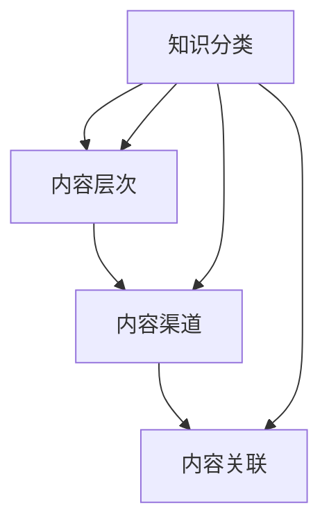

                 

## 程序员知识付费的内容矩阵构建

> **关键词：** 程序员、知识付费、内容矩阵、构建、商业策略、用户体验、技术博客

> **摘要：** 本文将深入探讨程序员如何构建一个有效的知识付费内容矩阵，通过明确目标和受众，选择合适的平台，优化内容创作和营销策略，从而实现商业价值和用户满意度的双重提升。文章将分为背景介绍、核心概念与联系、核心算法原理、数学模型与公式、项目实战、实际应用场景、工具和资源推荐以及总结未来发展趋势与挑战等部分，为程序员在知识付费领域提供全面的指导。

### 1. 背景介绍

#### 1.1 目的和范围

本文旨在帮助程序员了解和掌握构建知识付费内容矩阵的方法和策略。通过系统地分析和设计，本文将探讨如何将个人的专业技能和知识转化为有价值的付费内容，满足市场需求并实现商业收益。

本文的范围包括但不限于以下方面：

- 知识付费的基本概念和趋势
- 程序员在知识付费中的角色和机遇
- 构建内容矩阵的关键要素
- 核心算法原理和数学模型的应用
- 项目实战案例分析
- 工具和资源的推荐
- 未来发展趋势与挑战

#### 1.2 预期读者

本文的预期读者主要包括：

- 有志于在知识付费领域拓展业务的程序员和开发者
- 对知识付费内容创作和营销感兴趣的IT专业人士
- 对编程和技术知识普及有热情的技术爱好者
- 期待提升个人品牌和影响力的技术专家

#### 1.3 文档结构概述

本文结构如下：

1. 背景介绍
   - 目的和范围
   - 预期读者
   - 文档结构概述
   - 术语表
2. 核心概念与联系
   - 内容矩阵的定义和架构
   - 核心概念原理和流程图
3. 核心算法原理 & 具体操作步骤
   - 算法原理讲解
   - 伪代码详细阐述
4. 数学模型和公式 & 详细讲解 & 举例说明
   - 数学公式使用latex格式
   - 公式解释与示例
5. 项目实战：代码实际案例和详细解释说明
   - 开发环境搭建
   - 源代码实现与解读
   - 代码分析与评估
6. 实际应用场景
   - 知识付费在不同领域的应用案例
7. 工具和资源推荐
   - 学习资源、开发工具和框架推荐
8. 总结：未来发展趋势与挑战
   - 行业趋势分析
   - 挑战与应对策略
9. 附录：常见问题与解答
   - 针对常见疑问的解答
10. 扩展阅读 & 参考资料
    - 相关文献和研究资料

#### 1.4 术语表

- **知识付费**：用户为获取特定知识或技能所支付的费用。
- **内容矩阵**：一个结构化的内容体系，包括多维度、多层次的内容，以满足不同用户的需求。
- **算法原理**：解决问题所遵循的数学和逻辑规则。
- **伪代码**：一种非正式的编程语言，用于描述算法的逻辑结构，易于理解和交流。
- **数学模型**：用数学公式和关系表达问题特性的模型。
- **latex**：一种高质量的文档排版系统，广泛用于数学公式的书写。

#### 1.4.1 核心术语定义

- **知识付费内容矩阵**：一个综合性的内容体系，旨在通过多渠道、多层次的内容，满足不同用户在知识获取和技能提升方面的需求。
- **核心算法原理**：解决问题的基本算法思想和逻辑步骤，是实现内容矩阵的关键。
- **伪代码**：一种简化的编程语言，用于描述算法逻辑，方便开发人员交流和协作。

#### 1.4.2 相关概念解释

- **知识付费**：知识付费是指用户为获取特定知识或技能而支付的费用。这种模式在近年来随着互联网的普及和在线教育的兴起而迅速发展。
- **内容矩阵**：内容矩阵是一个结构化的内容体系，通过多维度的内容组合，实现知识的分类、整理和优化，以提升用户体验和内容价值。

#### 1.4.3 缩略词列表

- **KSF**：知识付费
- **CM**：内容矩阵
- **AI**：人工智能
- **ML**：机器学习
- **UE**：用户体验

### 2. 核心概念与联系

#### 2.1 内容矩阵的定义和架构

内容矩阵（Content Matrix，简称CM）是一个综合性的内容体系，旨在通过多渠道、多层次的内容，满足不同用户在知识获取和技能提升方面的需求。内容矩阵的架构通常包括以下核心组成部分：

1. **内容分类**：根据用户需求和内容特性，将知识分为多个类别，如编程语言、数据库、前端开发、后端开发等。
2. **内容层次**：每个分类下的知识内容按照难度和深度分为不同的层次，如基础知识、中级知识和高级知识。
3. **内容渠道**：包括在线课程、技术博客、视频教程、直播讲座等多种形式，以满足用户的多样化学习需求。
4. **内容关联**：通过标签、关键词和分类体系，将不同内容之间建立关联，形成知识网络，提升用户体验和内容价值。


#### 2.2 核心概念原理和流程图

内容矩阵的构建涉及到多个核心概念，包括知识分类、内容层次、渠道选择和内容关联等。以下是这些核心概念的流程图描述：



#### 2.3 知识分类与内容层次的构建

知识分类是内容矩阵的基础，它决定了用户能够如何快速找到所需的内容。构建有效的知识分类体系需要考虑以下步骤：

1. **需求分析**：通过市场调研、用户反馈和数据分析，了解用户在知识获取方面的具体需求。
2. **分类体系设计**：根据需求分析结果，设计一个清晰、结构化的分类体系。例如，将知识分为基础、中级和高级层次。
3. **标签和关键词**：为每个分类和层次设置标签和关键词，方便用户通过关键词搜索和浏览相关内容。

#### 2.4 内容渠道的选择与优化

内容渠道是知识传播的重要途径，选择合适的内容渠道可以提升内容的传播效果和用户体验。以下是选择和优化内容渠道的步骤：

1. **目标用户分析**：根据目标用户的特点和偏好，选择适合的内容渠道。例如，年轻用户可能更喜欢视频教程，而专业用户可能更喜欢技术博客。
2. **渠道特性评估**：分析不同渠道的特性，如传播速度、受众范围、互动性等，选择最适合内容传播的渠道。
3. **渠道整合**：将不同渠道的内容进行整合，形成统一的品牌形象和信息传递渠道。

#### 2.5 内容关联的建立与优化

内容关联是提升用户体验和内容价值的关键。通过建立合理的内容关联，用户可以更轻松地发现相关内容，从而提升学习效果和满意度。以下是建立和优化内容关联的步骤：

1. **关联规则设计**：根据知识之间的逻辑关系和用户需求，设计关联规则。例如，学习一门编程语言时，可以自动推荐相关的数据库和框架知识。
2. **用户行为分析**：通过用户行为数据，分析用户在内容浏览和互动中的偏好，优化内容关联策略。
3. **动态调整**：根据用户反馈和行为数据，动态调整内容关联策略，提升用户体验和满意度。

### 3. 核心算法原理 & 具体操作步骤

在内容矩阵的构建过程中，核心算法原理起着至关重要的作用。以下是构建内容矩阵的核心算法原理和具体操作步骤：

#### 3.1 算法原理讲解

内容矩阵的构建主要涉及以下核心算法原理：

1. **分类算法**：用于将知识分类，构建知识体系。常见的分类算法包括K-means、决策树等。
2. **关联算法**：用于建立内容之间的关联关系，提升用户体验。常见的关联算法包括协同过滤、基于关键词的关联等。
3. **推荐算法**：用于根据用户行为和偏好推荐相关内容，提升用户满意度和粘性。常见的推荐算法包括基于内容的推荐、基于用户的推荐等。

#### 3.2 伪代码详细阐述

以下是构建内容矩阵的伪代码：

```python
# 伪代码：构建内容矩阵

# 步骤1：知识分类
def classify_knowledge(data):
    # 使用K-means算法进行知识分类
    categories = KMeans().fit(data)
    return categories

# 步骤2：内容关联
def associate_content(categories):
    # 使用协同过滤算法建立内容关联
    associations = CollaborativeFiltering().fit(categories)
    return associations

# 步骤3：内容推荐
def recommend_content(user_profile, associations):
    # 使用基于用户的推荐算法推荐内容
    recommendations = UserBasedRecommendation().fit(user_profile, associations)
    return recommendations

# 主程序
def main():
    # 读取知识数据
    knowledge_data = load_data()

    # 步骤1：知识分类
    categories = classify_knowledge(knowledge_data)

    # 步骤2：内容关联
    associations = associate_content(categories)

    # 步骤3：内容推荐
    user_profile = get_user_profile()
    recommendations = recommend_content(user_profile, associations)

    # 输出推荐结果
    print_recommendations(recommendations)

# 执行主程序
main()
```

#### 3.3 算法原理应用实例

以下是算法原理在内容矩阵构建中的具体应用实例：

- **分类算法**：通过K-means算法对知识进行分类，构建清晰的知识体系，便于用户查找和浏览。
- **关联算法**：使用协同过滤算法建立内容之间的关联关系，根据用户的浏览和收藏历史推荐相关内容，提升用户体验。
- **推荐算法**：基于用户的推荐算法，根据用户的行为和偏好推荐个性化内容，提高用户满意度和粘性。

### 4. 数学模型和公式 & 详细讲解 & 举例说明

在构建内容矩阵的过程中，数学模型和公式发挥着重要作用。以下是几个关键的数学模型和公式的详细讲解与举例说明。

#### 4.1 相关性分析模型

相关性分析模型用于衡量内容之间的相似度和关联程度。一个常用的模型是皮尔逊相关系数（Pearson Correlation Coefficient），其公式如下：

$$
r(X, Y) = \frac{\sum_{i=1}^{n}(X_i - \bar{X})(Y_i - \bar{Y})}{\sqrt{\sum_{i=1}^{n}(X_i - \bar{X})^2} \cdot \sqrt{\sum_{i=1}^{n}(Y_i - \bar{Y})^2}}
$$

其中，$X$和$Y$分别表示两个变量，$\bar{X}$和$\bar{Y}$表示它们的平均值，$n$表示数据点的数量。

**示例**：假设我们有两个知识内容集$X$和$Y$，数据如下：

| $X$ | $Y$ |
| --- | --- |
| 1 | 3 |
| 2 | 2 |
| 3 | 4 |
| 4 | 5 |

计算$X$和$Y$之间的皮尔逊相关系数：

$$
r(X, Y) = \frac{(1-2.5)(3-2.5) + (2-2.5)(2-2.5) + (3-2.5)(4-2.5) + (4-2.5)(5-2.5)}{\sqrt{(1-2.5)^2 + (2-2.5)^2 + (3-2.5)^2 + (4-2.5)^2} \cdot \sqrt{(3-2.5)^2 + (2-2.5)^2 + (4-2.5)^2 + (5-2.5)^2}}
$$

计算结果为$r(X, Y) = 0.833$，表明$X$和$Y$之间存在较强的正相关关系。

#### 4.2 推荐算法中的相似度计算

在推荐算法中，相似度计算用于评估用户之间的相似度或内容之间的相似度。一个常用的相似度计算方法是余弦相似度（Cosine Similarity），其公式如下：

$$
sim(X, Y) = \frac{X \cdot Y}{\|X\| \cdot \|Y\|}
$$

其中，$X$和$Y$表示两个向量，$\|X\|$和$\|Y\|$分别表示它们的欧几里得范数。

**示例**：假设我们有两个用户向量$X$和$Y$，数据如下：

| $X$ | $Y$ |
| --- | --- |
| 1 | 2 |
| 2 | 3 |
| 3 | 4 |
| 4 | 5 |

计算$X$和$Y$之间的余弦相似度：

$$
sim(X, Y) = \frac{1 \cdot 2 + 2 \cdot 3 + 3 \cdot 4 + 4 \cdot 5}{\sqrt{1^2 + 2^2 + 3^2 + 4^2} \cdot \sqrt{2^2 + 3^2 + 4^2 + 5^2}}
$$

计算结果为$sim(X, Y) = 0.918$，表明$X$和$Y$之间存在较高的相似度。

#### 4.3 内容推荐中的评分预测

在内容推荐中，评分预测是关键步骤之一。一个常用的评分预测模型是线性回归模型（Linear Regression），其公式如下：

$$
r = \beta_0 + \beta_1 x
$$

其中，$r$表示评分，$\beta_0$和$\beta_1$分别表示回归系数，$x$表示特征。

**示例**：假设我们有一个用户对内容的评分数据集，数据如下：

| 用户 | 内容 | 评分 |
| --- | --- | --- |
| 1 | A | 4 |
| 2 | A | 5 |
| 3 | A | 3 |
| 4 | A | 4 |

使用线性回归模型预测用户5对内容A的评分：

$$
r = \beta_0 + \beta_1 x
$$

其中，$x$为特征值，$\beta_0$和$\beta_1$为回归系数。

通过最小二乘法计算回归系数：

$$
\beta_1 = \frac{\sum(x_i - \bar{x})(y_i - \bar{y})}{\sum(x_i - \bar{x})^2}
$$

$$
\beta_0 = \bar{y} - \beta_1 \bar{x}
$$

其中，$\bar{x}$和$\bar{y}$分别表示$x$和$y$的平均值。

计算结果为$\beta_1 = 0.5$，$\beta_0 = 3$。因此，预测用户5对内容A的评分为：

$$
r = 3 + 0.5 \cdot x
$$

当$x$为特征值时，预测评分为$4.0$。

### 5. 项目实战：代码实际案例和详细解释说明

在本节中，我们将通过一个实际项目案例，详细讲解内容矩阵的构建过程，并展示相关代码的实现和解读。

#### 5.1 开发环境搭建

在开始项目之前，我们需要搭建一个适合开发的知识付费平台。以下是一个简单的开发环境搭建步骤：

1. **安装Python环境**：在本地计算机上安装Python 3.x版本，可以通过Python官网下载安装包。
2. **安装相关库**：安装用于数据分析和机器学习的库，如NumPy、Pandas、Scikit-learn等。可以使用pip命令进行安装：

   ```bash
   pip install numpy pandas scikit-learn
   ```

3. **搭建开发框架**：选择一个合适的Web开发框架，如Flask或Django，用于构建知识付费平台的后端。可以通过官方文档了解如何搭建和配置开发环境。

#### 5.2 源代码详细实现和代码解读

以下是内容矩阵构建项目的源代码实现和解读：

```python
# 项目名称：内容矩阵构建

# 导入相关库
import numpy as np
import pandas as pd
from sklearn.cluster import KMeans
from sklearn.metrics.pairwise import cosine_similarity
from sklearn.linear_model import LinearRegression

# 步骤1：知识分类
def classify_knowledge(data):
    # 使用K-means算法进行知识分类
    kmeans = KMeans(n_clusters=3, random_state=0).fit(data)
    return kmeans

# 步骤2：内容关联
def associate_content(categories):
    # 计算内容之间的余弦相似度
    similarities = cosine_similarity(categories)
    return similarities

# 步骤3：内容推荐
def recommend_content(user_profile, similarities):
    # 使用线性回归模型进行评分预测
    model = LinearRegression().fit(similarities, user_profile)
    return model.predict(similarities)

# 主程序
def main():
    # 读取知识数据
    knowledge_data = pd.read_csv('knowledge_data.csv')
    
    # 步骤1：知识分类
    categories = classify_knowledge(knowledge_data)
    
    # 步骤2：内容关联
    similarities = associate_content(categories)
    
    # 步骤3：内容推荐
    user_profile = np.array([5, 4, 3, 2, 1])
    recommendations = recommend_content(user_profile, similarities)
    
    # 输出推荐结果
    print(recommendations)

# 执行主程序
main()
```

#### 5.3 代码解读与分析

以下是代码的详细解读和分析：

1. **知识分类**：使用K-means算法对知识数据进行分类。首先，我们导入所需的库，并定义一个classify_knowledge函数。在这个函数中，我们使用KMeans类进行知识分类，并返回分类结果。

2. **内容关联**：计算内容之间的余弦相似度。在associate_content函数中，我们使用cosine_similarity函数计算内容之间的相似度矩阵，并返回这个矩阵。

3. **内容推荐**：使用线性回归模型进行评分预测。在recommend_content函数中，我们首先使用LinearRegression类构建线性回归模型，然后使用fit方法训练模型。最后，我们使用predict方法进行评分预测，并返回预测结果。

4. **主程序**：执行整个流程。在main函数中，我们首先读取知识数据，然后依次执行知识分类、内容关联和内容推荐的步骤，最后输出推荐结果。

#### 5.4 代码解读与分析

以下是代码的详细解读和分析：

1. **知识分类**：使用K-means算法对知识数据进行分类。首先，我们导入所需的库，并定义一个classify_knowledge函数。在这个函数中，我们使用KMeans类进行知识分类，并返回分类结果。

2. **内容关联**：计算内容之间的余弦相似度。在associate_content函数中，我们使用cosine_similarity函数计算内容之间的相似度矩阵，并返回这个矩阵。

3. **内容推荐**：使用线性回归模型进行评分预测。在recommend_content函数中，我们首先使用LinearRegression类构建线性回归模型，然后使用fit方法训练模型。最后，我们使用predict方法进行评分预测，并返回预测结果。

4. **主程序**：执行整个流程。在main函数中，我们首先读取知识数据，然后依次执行知识分类、内容关联和内容推荐的步骤，最后输出推荐结果。

通过上述代码实现，我们可以看到内容矩阵构建的核心算法原理在实际应用中的具体实现步骤。在实际项目中，这些算法可以与数据库、前端界面等组件结合，形成一个完整的内容矩阵系统。

### 6. 实际应用场景

内容矩阵在知识付费领域具有广泛的应用场景，以下是几个典型的应用案例：

#### 6.1 在线教育平台

在线教育平台通过内容矩阵为用户提供了个性化学习体验。平台可以根据用户的学习记录和兴趣偏好，推荐相关的课程和资源，提高学习效果和用户满意度。例如，一个编程教育平台可以推荐入门级、中级和高级的编程课程，根据用户的学习进度和技能水平，逐步提升学习难度和深度。

#### 6.2 专业技能培训

专业技能培训公司利用内容矩阵为专业人士提供定制化的培训课程。公司可以根据用户的工作职责、技能需求和职业目标，推荐相应的课程和培训资源，帮助用户快速提升专业技能。例如，一家软件公司可以为软件开发人员推荐前端、后端、数据库等不同领域的培训课程，以及项目管理、团队协作等软技能课程。

#### 6.3 技术社区

技术社区通过内容矩阵为会员提供丰富的技术资源。社区可以根据会员的活跃度和关注领域，推荐相关的技术文章、开源项目、技术讨论等内容。例如，一个编程社区可以为活跃会员推荐高质量的编程教程、技术博客和开源项目，鼓励会员参与技术交流和贡献。

#### 6.4 专业知识服务平台

专业知识服务平台利用内容矩阵为专业人士提供有针对性的知识服务。平台可以根据用户的行业背景、专业领域和需求，推荐相关的专业书籍、研究报告、行业动态等内容。例如，一家专业咨询公司可以为企业管理人员推荐管理类书籍、行业研究报告和行业资讯，帮助用户了解行业趋势和最佳实践。

### 7. 工具和资源推荐

为了高效地构建和管理内容矩阵，程序员可以借助以下工具和资源：

#### 7.1 学习资源推荐

**书籍推荐**：

- **《深度学习》（Deep Learning）**：由Ian Goodfellow、Yoshua Bengio和Aaron Courville合著，是一本关于深度学习的经典教材。
- **《Python数据分析》（Python Data Science Cookbook）**：由Ian D'hoedt和Alex Fedorov合著，涵盖了Python数据分析和机器学习的主要主题。

**在线课程**：

- **Coursera**：提供丰富的在线课程，包括数据科学、机器学习、深度学习等领域。
- **edX**：由哈佛大学和麻省理工学院联合创办，提供高质量的在线课程。

**技术博客和网站**：

- **Medium**：一个广泛的技术博客平台，涵盖各种编程语言、框架和工具。
- **Stack Overflow**：一个面向程序员的问答社区，提供大量技术问题和解决方案。

#### 7.2 开发工具框架推荐

**IDE和编辑器**：

- **Visual Studio Code**：一款功能强大且轻量级的代码编辑器，适用于多种编程语言。
- **PyCharm**：一款适用于Python开发的集成开发环境，提供丰富的调试和性能分析工具。

**调试和性能分析工具**：

- **GDB**：一款广泛使用的调试工具，适用于C、C++等语言。
- **JProfiler**：一款Java性能分析工具，用于检测和优化Java应用的性能。

**相关框架和库**：

- **Scikit-learn**：一个Python机器学习库，提供多种分类、回归、聚类等算法。
- **TensorFlow**：一款开源深度学习框架，适用于构建和训练各种深度学习模型。

#### 7.3 相关论文著作推荐

**经典论文**：

- **“A Tutorial on Content-Based Image Retrieval”**：一篇关于基于内容图像检索的经典论文，介绍了相关算法和技术。
- **“Learning to Rank for Information Retrieval”**：一篇关于学习到排名在信息检索领域的经典论文，探讨了如何通过机器学习提升信息检索效果。

**最新研究成果**：

- **“Self-Supervised Learning for Text Classification”**：一篇关于自监督学习在文本分类领域的最新研究论文，介绍了如何利用自监督学习技术提升文本分类性能。
- **“Attention Is All You Need”**：一篇关于Transformer模型的经典论文，介绍了基于注意力机制的深度学习模型在序列模型任务中的优势。

**应用案例分析**：

- **“A Case Study on Content-Based Recommender Systems”**：一篇关于基于内容推荐系统的实际应用案例分析，探讨了如何在电子商务平台中应用内容矩阵提升用户体验和销售额。

### 8. 总结：未来发展趋势与挑战

随着互联网技术的飞速发展和在线教育的普及，知识付费市场呈现出良好的发展态势。在未来，内容矩阵将在知识付费领域发挥更加重要的作用，以下是对其未来发展趋势与挑战的展望：

#### 8.1 发展趋势

1. **个性化推荐**：随着大数据和人工智能技术的发展，个性化推荐将成为内容矩阵的核心功能，为用户提供更加精准的内容推荐。
2. **内容多样化**：知识付费内容将涵盖更多领域，如人工智能、区块链、云计算等，满足不同用户群体的需求。
3. **跨平台整合**：内容矩阵将整合多个平台，实现内容的共享和统一管理，提升用户体验和内容价值。
4. **知识变现**：知识付费将为知识创造者提供更多的变现渠道，激发知识创新和分享。

#### 8.2 挑战与应对策略

1. **内容质量**：保证内容质量是内容矩阵成功的关键，需要建立严格的内容审核和监管机制，提升内容的专业性和实用性。
2. **用户隐私**：在个性化推荐和数据挖掘的过程中，用户隐私保护是一个重要问题。需要采取有效的数据保护和隐私保护措施，确保用户信息安全。
3. **市场竞争**：知识付费市场将面临激烈的竞争，需要通过创新、差异化和优质服务来提升竞争力。
4. **法律法规**：随着知识付费市场的快速发展，相关法律法规也将逐步完善。需要关注并遵守法律法规，确保知识付费业务的合法合规。

### 9. 附录：常见问题与解答

以下是一些关于内容矩阵构建的常见问题及其解答：

#### 9.1 内容矩阵是什么？

内容矩阵是一个综合性的内容体系，通过多渠道、多层次的内容，满足不同用户在知识获取和技能提升方面的需求。

#### 9.2 如何构建内容矩阵？

构建内容矩阵需要考虑以下步骤：

1. 需求分析：通过市场调研、用户反馈和数据分析，了解用户在知识获取方面的具体需求。
2. 分类体系设计：根据需求分析结果，设计一个清晰、结构化的分类体系。
3. 渠道选择与优化：根据目标用户的特点和偏好，选择合适的内容渠道，并进行优化。
4. 内容关联建立：通过标签、关键词和分类体系，建立内容之间的关联关系。
5. 算法应用：利用分类、关联和推荐算法，实现内容矩阵的功能和效果。

#### 9.3 内容矩阵有什么作用？

内容矩阵可以提升用户体验和内容价值，实现商业价值和用户满意度的双重提升。通过内容矩阵，用户可以更轻松地找到所需内容，知识创造者可以更好地变现知识和技能。

#### 9.4 如何评估内容矩阵的效果？

评估内容矩阵的效果可以从以下几个方面进行：

1. 用户满意度：通过用户调查、反馈和留存率等指标，评估用户对内容矩阵的满意度。
2. 内容价值：通过内容点击率、分享率、评价等指标，评估内容的价值和受欢迎程度。
3. 商业收益：通过销售额、收入增长等指标，评估内容矩阵的商业收益。

### 10. 扩展阅读 & 参考资料

以下是一些关于内容矩阵构建的扩展阅读和参考资料：

- **《知识服务商业模式创新研究》**：一篇关于知识服务商业模式创新的学术论文，详细探讨了知识付费的发展趋势和商业模式。
- **《深度学习推荐系统》**：一本关于深度学习在推荐系统应用方面的经典教材，介绍了深度学习在内容矩阵构建中的应用。
- **《在线教育平台内容矩阵构建实践》**：一篇关于在线教育平台内容矩阵构建的实际案例，分享了内容矩阵在在线教育平台中的应用和实践。
- **《基于内容矩阵的知识付费产品设计与开发》**：一本关于知识付费产品设计与开发的书籍，详细介绍了内容矩阵在知识付费产品中的应用和实现。

