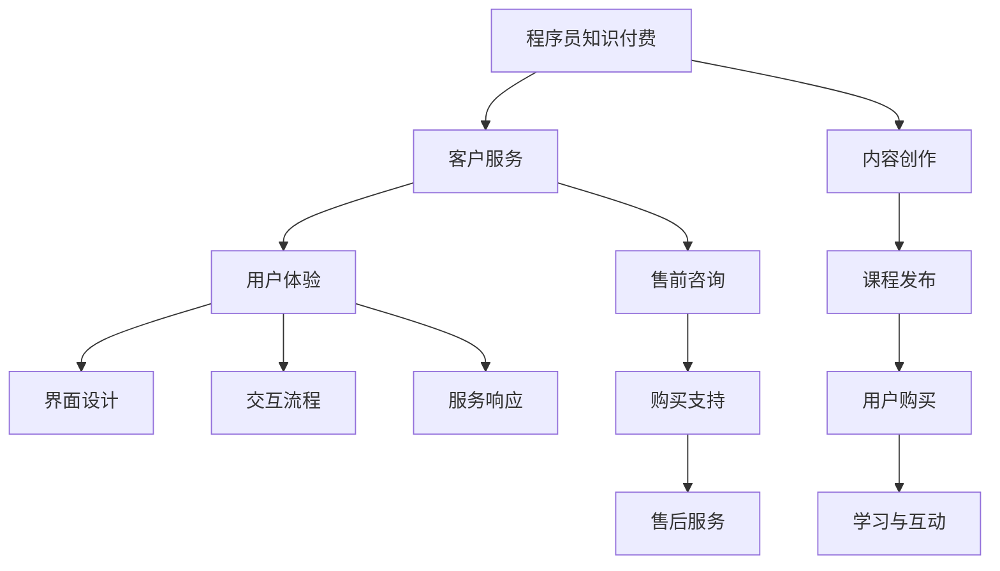
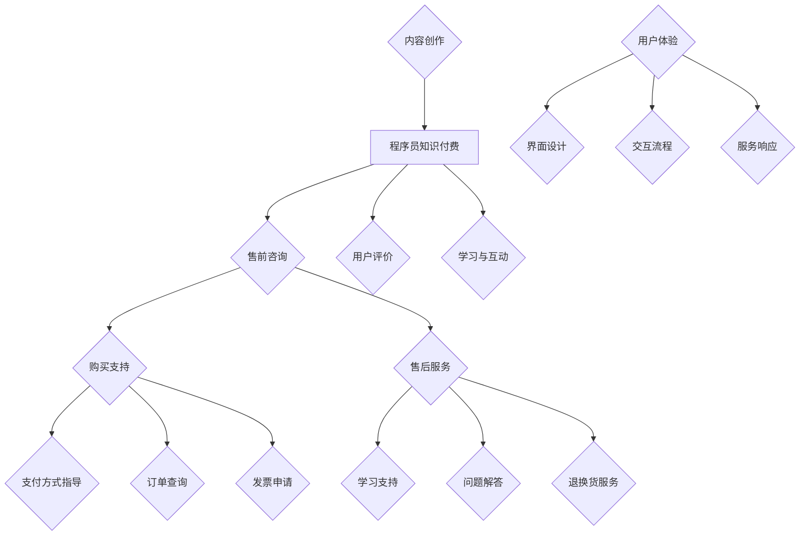

                 

## 程序员知识付费的客户服务与用户体验

> **关键词**：程序员知识付费、客户服务、用户体验、在线教育、技术博客

> **摘要**：本文将深入探讨程序员知识付费领域的客户服务与用户体验，分析其核心概念、操作步骤，并结合数学模型、实际项目案例，展示如何提升客户满意度和市场竞争力。我们将探讨客户服务的策略、用户体验设计、技术实现、应用场景以及未来发展，为程序员知识付费平台提供实用的指导和建议。

## 1. 背景介绍

### 1.1 目的和范围

本文旨在为程序员知识付费平台提供一套完整的客户服务与用户体验提升方案。随着在线教育和知识付费市场的快速发展，程序员知识付费平台需要通过高质量的服务和卓越的用户体验来吸引和留住用户。本文将从以下几个方面展开讨论：

1. **客户服务策略**：如何通过有效的客户服务提升用户满意度和平台口碑。
2. **用户体验设计**：如何设计易用、高效的用户界面和交互流程。
3. **技术实现**：如何利用先进的技术手段支持客户服务与用户体验。
4. **应用场景**：如何在不同场景下运用客户服务和用户体验策略。
5. **未来发展**：程序员知识付费领域的未来趋势和面临的挑战。

### 1.2 预期读者

本文适合以下读者群体：

1. 程序员知识付费平台运营者和管理者
2. 程序员知识付费课程讲师和开发者
3. 对在线教育和知识付费领域感兴趣的从业人员
4. 想要提升自己编程技能和知识水平的程序员

### 1.3 文档结构概述

本文结构如下：

1. **背景介绍**：介绍本文的目的、范围和预期读者。
2. **核心概念与联系**：阐述程序员知识付费、客户服务、用户体验等核心概念，并绘制流程图。
3. **核心算法原理 & 具体操作步骤**：详细解释客户服务和用户体验的技术实现方法。
4. **数学模型和公式 & 详细讲解 & 举例说明**：利用数学模型和公式分析客户服务和用户体验。
5. **项目实战：代码实际案例和详细解释说明**：通过实际项目案例展示客户服务和用户体验的运用。
6. **实际应用场景**：探讨客户服务和用户体验在不同场景下的应用。
7. **工具和资源推荐**：推荐相关学习资源和开发工具。
8. **总结：未来发展趋势与挑战**：总结本文的主要观点，展望未来趋势和挑战。
9. **附录：常见问题与解答**：解答读者可能遇到的问题。
10. **扩展阅读 & 参考资料**：提供进一步学习的资源。

### 1.4 术语表

#### 1.4.1 核心术语定义

- **程序员知识付费**：程序员在知识付费平台上分享专业知识和技能，用户支付费用获取学习资源和服务。
- **客户服务**：知识付费平台为用户提供的服务，包括售前咨询、购买支持、售后服务等。
- **用户体验**：用户在使用知识付费平台过程中所感受到的整体感受，包括界面设计、交互流程、服务响应等。

#### 1.4.2 相关概念解释

- **在线教育**：利用互联网技术提供的教育服务，包括课程学习、互动交流、资源共享等。
- **知识付费**：用户为获取有价值的知识或技能支付费用的一种商业模式。
- **用户满意度**：用户对平台服务质量和体验的主观评价。

#### 1.4.3 缩略词列表

- **SaaS**：软件即服务（Software as a Service）
- **API**：应用程序编程接口（Application Programming Interface）
- **CRM**：客户关系管理（Customer Relationship Management）
- **UX**：用户体验（User Experience）
- **UI**：用户界面（User Interface）

## 2. 核心概念与联系

在程序员知识付费领域，客户服务和用户体验是两个关键概念，它们相辅相成，共同决定了平台的市场竞争力。为了更好地理解这两个概念及其相互关系，我们首先需要明确它们的核心定义，并借助 Mermaid 流程图来展示它们之间的联系。

### 2.1 程序员知识付费

程序员知识付费是指程序员通过在线平台分享自己的专业知识、经验和技能，用户通过支付费用来获取这些学习资源。这一过程包括内容创作、课程发布、用户购买、学习与互动等多个环节。

#### 程序员知识付费的核心概念

1. **内容创作**：程序员创作高质量的学习内容，包括视频教程、文章、代码示例等。
2. **课程发布**：平台提供课程发布和管理功能，使得程序员可以方便地发布和更新自己的课程。
3. **用户购买**：用户通过支付费用购买课程，获取学习资源和增值服务。
4. **学习与互动**：用户在学习过程中可以与其他学员互动，交流学习心得，解决学习难题。

### 2.2 客户服务

客户服务是知识付费平台的重要组成部分，旨在为用户提供售前咨询、购买支持、售后服务等，确保用户在使用平台过程中的体验满意度。

#### 客户服务的关键环节

1. **售前咨询**：用户在购买前可以通过客服了解课程内容、授课方式、学习目标等信息。
2. **购买支持**：用户在购买过程中需要得到帮助，包括支付方式、订单查询、发票申请等。
3. **售后服务**：用户在购买后可能遇到学习难题或其他问题，需要得到及时解决。

### 2.3 用户体验

用户体验是用户在使用知识付费平台过程中所感受到的整体感受，包括界面设计、交互流程、服务响应等多个方面。良好的用户体验可以提高用户满意度，增加用户粘性。

#### 用户体验的关键要素

1. **界面设计**：界面简洁、美观，易于导航，提高用户操作效率。
2. **交互流程**：交互流程直观、流畅，减少用户操作复杂度。
3. **服务响应**：客服响应快速、专业，解决用户问题及时、准确。

### 2.4 联系与流程图

程序员知识付费、客户服务和用户体验之间存在着密切的联系。程序员知识付费是基础，客户服务是支撑，用户体验是目标。以下是一个简化的 Mermaid 流程图，展示了这三个核心概念之间的联系：



通过这个流程图，我们可以看出程序员知识付费平台需要综合考虑内容创作、客户服务和用户体验，确保用户在购买、学习、互动等环节中得到良好的体验，从而提升用户满意度和平台口碑。

### 2.5 核心概念原理与架构

为了更好地理解程序员知识付费、客户服务和用户体验的核心概念原理和架构，我们将在接下来的段落中详细讨论它们的基本原理，并提供一个简化的 Mermaid 流程图，展示它们之间的相互作用和关系。

#### 2.5.1 程序员知识付费原理

程序员知识付费平台的核心在于为程序员提供一个展示和分享自己技能的平台，同时为学习者提供高质量的学习资源。这一过程主要包括以下几个核心原理：

1. **内容价值**：程序员的知识和技能具有实际应用价值，学习者通过付费获取这些知识，能够帮助自己提升技能和解决实际问题。
2. **平台机制**：平台通过提供课程发布、支付、学习等机制，确保知识付费的顺利进行，并为程序员和学习者提供互动交流的平台。
3. **用户评价**：用户评价机制是程序员知识付费平台的重要组成部分，它帮助学习者筛选优质课程，同时激励程序员持续优化自己的内容。

#### 2.5.2 客户服务原理

客户服务是知识付费平台的重要组成部分，其主要原理在于通过提供优质的售前、购买和售后服务，提升用户满意度和平台口碑。以下是客户服务的核心原理：

1. **售前咨询**：通过在线聊天、电话咨询等方式，为用户提供课程内容的详细介绍、学习目标和授课方式等咨询，帮助用户做出购买决策。
2. **购买支持**：提供支付方式指导、订单查询、发票申请等服务，确保用户在购买过程中无障碍。
3. **售后服务**：提供学习支持、问题解答、退换货等服务，解决用户在学习过程中的问题，提升用户满意度。

#### 2.5.3 用户体验原理

用户体验是用户在使用知识付费平台过程中所感受到的整体感受，其主要原理在于通过优化界面设计、交互流程和服务响应，提升用户的操作效率和满意度。以下是用户体验的核心原理：

1. **界面设计**：设计简洁、直观、美观的界面，使用户能够快速找到所需信息，提高操作效率。
2. **交互流程**：设计流畅、直观的交互流程，减少用户的操作复杂度，提高用户满意度。
3. **服务响应**：提供快速、专业的客服服务，及时解答用户问题，解决用户困扰。

#### 2.5.4 Mermaid 流程图

为了更直观地展示程序员知识付费、客户服务和用户体验之间的相互作用和关系，我们提供了一个简化的 Mermaid 流程图：



在这个流程图中，程序员知识付费、客户服务和用户体验相互交织，共同构成了一个完整的知识付费生态系统。程序员通过内容创作和用户评价机制，为用户提供有价值的学习资源；客户服务通过售前咨询、购买支持和售后服务，保障用户的权益；用户体验则通过界面设计、交互流程和服务响应，提升用户的操作效率和满意度。

通过这个流程图，我们可以清晰地看到程序员知识付费、客户服务和用户体验之间的联系和相互作用，这对于知识付费平台来说，具有重要的指导意义。只有综合考虑这三个方面，才能构建一个健康、可持续发展的知识付费生态系统，为程序员和学习者提供优质的服务和体验。

### 2.6 核心算法原理 & 具体操作步骤

在程序员知识付费领域，客户服务和用户体验的提升离不开先进的技术实现。以下是核心算法原理和具体操作步骤，这些步骤将帮助知识付费平台优化服务流程，提高用户满意度。

#### 2.6.1 客户服务算法原理

客户服务的核心在于提供高效的售前咨询、购买支持和售后服务。以下是核心算法原理：

1. **智能客服系统**：利用自然语言处理（NLP）和机器学习（ML）技术，构建智能客服系统，实现自动回答用户常见问题，降低人工客服的工作量。
2. **多渠道集成**：集成多种沟通渠道（如在线聊天、电话、邮件等），实现无缝切换，提升用户沟通体验。
3. **用户行为分析**：通过用户行为数据（如浏览记录、购买历史、互动频率等），进行数据挖掘和分析，为用户提供个性化的服务和推荐。

#### 具体操作步骤：

1. **构建智能客服系统**：
    - **数据收集**：收集用户提问、回答等数据，用于训练智能客服模型。
    - **模型训练**：使用NLP和ML技术，训练智能客服模型，使其能够自动回答用户问题。
    - **系统部署**：将智能客服系统部署到知识付费平台，确保其稳定运行。

2. **多渠道集成**：
    - **接口开发**：开发API接口，实现不同沟通渠道之间的数据交换和联动。
    - **前端集成**：在前端界面中集成多种沟通渠道，提供统一的服务入口。

3. **用户行为分析**：
    - **数据采集**：采集用户行为数据，包括浏览、购买、互动等。
    - **数据分析**：使用数据挖掘技术，分析用户行为，提取有价值的信息。
    - **个性化服务**：根据用户行为分析结果，为用户提供个性化的服务和推荐。

#### 2.6.2 用户体验算法原理

用户体验的提升需要从界面设计、交互流程和服务响应等方面入手。以下是核心算法原理：

1. **界面设计优化**：利用用户研究（UX Research）和用户测试（User Testing）方法，收集用户反馈，持续优化界面设计，提高用户满意度。
2. **交互流程优化**：通过流程分析（Process Analysis）和用户体验设计（UX Design）方法，简化交互流程，提高用户操作效率。
3. **服务响应优化**：使用负载均衡（Load Balancing）和缓存技术（Caching），提高系统响应速度，确保用户在高峰期也能获得良好的服务体验。

#### 具体操作步骤：

1. **界面设计优化**：
    - **用户研究**：通过访谈、问卷调查等方法，了解用户的需求和痛点。
    - **用户测试**：邀请用户进行界面测试，收集用户反馈，优化界面设计。

2. **交互流程优化**：
    - **流程分析**：对现有交互流程进行详细分析，找出潜在问题和改进点。
    - **用户体验设计**：根据分析结果，设计新的交互流程，提高用户操作效率。

3. **服务响应优化**：
    - **负载均衡**：部署负载均衡器，实现服务器资源的合理分配，提高系统稳定性。
    - **缓存技术**：使用缓存技术，降低数据库访问压力，提高系统响应速度。

通过以上算法原理和具体操作步骤，知识付费平台可以不断提升客户服务和用户体验，提高用户满意度和市场竞争力。在实际操作中，平台还需要不断迭代和优化，以满足用户日益增长的需求。

### 4. 数学模型和公式 & 详细讲解 & 举例说明

在程序员知识付费领域，数学模型和公式可以帮助我们更好地理解和分析客户服务和用户体验。以下将介绍几个关键的数学模型和公式，并结合实际例子进行详细讲解。

#### 4.1 客户满意度模型

客户满意度是衡量客户服务效果的重要指标，常用的模型包括Net Promoter Score（NPS）和Customer Satisfaction Score（CSAT）。

**Net Promoter Score（NPS）**

NPS通过询问用户：“您有多大可能性向他人推荐我们的服务？”来衡量用户忠诚度。用户评分范围从0到10，根据评分将用户分为三个类别：

- 强烈推荐者（9-10分）
- 中性者（7-8分）
- 不推荐者（0-6分）

NPS的计算公式为：

\[ NPS = \frac{（强烈推荐者数 - 不推荐者数）}{总样本数} \times 100\% \]

**Customer Satisfaction Score（CSAT）**

CSAT通过询问用户：“您对我们的服务是否满意？”来衡量用户满意度。用户回答通常为是或否，CSAT的计算公式为：

\[ CSAT = \frac{（满意回答数）}{（满意回答数 + 不满意回答数）} \times 100\% \]

**例子**

假设一个知识付费平台收到100条客户反馈，其中强烈推荐者有40人，中性者有20人，不推荐者有20人，那么：

- NPS = \(\frac{(40 - 20)}{100} \times 100\% = 20\%\)
- CSAT = \(\frac{(60)}{(60 + 40)} \times 100\% = 60\%\)

#### 4.2 用户留存率模型

用户留存率是衡量用户体验的重要指标，表示在一定时间内返回平台进行互动的用户比例。常用的留存率模型包括日留存率、周留存率和月留存率。

**日留存率（Day Retention Rate）**

日留存率的计算公式为：

\[ 留存率 = \frac{（第i天的活跃用户数）}{（第i-1天的活跃用户数）} \times 100\% \]

**例子**

假设一个平台第1天有1000个活跃用户，第2天有800个活跃用户，那么：

\[ 留存率 = \frac{(800)}{(1000)} \times 100\% = 80\% \]

**周留存率（Week Retention Rate）和月留存率（Month Retention Rate）**

周留存率和月留存率的计算方法类似，只是时间跨度不同：

\[ 周留存率 = \frac{（本周的活跃用户数）}{（上周的活跃用户数）} \times 100\% \]
\[ 月留存率 = \frac{（本月的活跃用户数）}{（上月的活跃用户数）} \times 100\% \]

#### 4.3 用户体验评分模型

用户体验评分模型通过综合多个维度的用户评价，得出一个综合评分。常见的模型包括综合评分（Overall Score）和加权评分（Weighted Score）。

**综合评分（Overall Score）**

综合评分是各个维度评分的平均值，计算公式为：

\[ Overall Score = \frac{（维度1评分 + 维度2评分 + ... + 维度n评分）}{n} \]

**例子**

假设一个平台的用户体验评分包括界面设计（10分）、交互流程（10分）和服务响应（10分），用户分别给出8、9、10分的评分，那么：

\[ Overall Score = \frac{(8 + 9 + 10)}{3} = 9 \]

**加权评分（Weighted Score）**

加权评分考虑各个维度的权重，计算公式为：

\[ Weighted Score = \sum_{i=1}^{n} (权重_i \times 维度i评分) \]

**例子**

假设界面设计、交互流程和服务响应的权重分别为0.3、0.4和0.3，用户分别给出8、9、10分的评分，那么：

\[ Weighted Score = (0.3 \times 8) + (0.4 \times 9) + (0.3 \times 10) = 2.4 + 3.6 + 3 = 9 \]

通过以上数学模型和公式，我们可以定量分析客户服务和用户体验，为平台的优化提供科学依据。在实际应用中，平台可以根据具体需求，选择合适的模型和公式，持续提升服务质量。

### 5. 项目实战：代码实际案例和详细解释说明

为了更好地理解客户服务和用户体验在程序员知识付费平台中的实际应用，我们将通过一个具体的代码案例来展示如何实现客户服务和用户体验的优化。以下是一个简单的在线教育平台后端服务代码案例，包括用户注册、登录、课程购买、用户评价等功能，并结合详细解释说明。

#### 5.1 开发环境搭建

在开始编写代码之前，我们需要搭建一个开发环境。以下是一个基本的开发环境搭建步骤：

1. **安装Node.js**：Node.js 是一个基于Chrome V8引擎的JavaScript运行环境，用于构建后端服务。可以从 [Node.js官网](https://nodejs.org/) 下载并安装。
2. **安装Express**：Express 是一个流行的Node.js Web框架，用于快速构建Web应用。可以使用npm（Node Package Manager）来安装：

   ```shell
   npm install express
   ```

3. **创建项目**：在安装完Node.js和Express后，我们可以创建一个新项目：

   ```shell
   mkdir online-education-platform
   cd online-education-platform
   npm init -y
   ```

4. **编写配置文件**：创建一个名为 `config.js` 的配置文件，用于保存数据库连接信息、API密钥等配置。

5. **编写数据库连接代码**：使用 `mysql` 或 `mongodb` 等数据库驱动，连接到数据库。以下是一个使用 `mysql` 驱动的简单示例：

   ```javascript
   const mysql = require('mysql');
   const connection = mysql.createConnection({
     host: 'localhost',
     user: 'root',
     password: 'password',
     database: 'online_education_platform'
   });
   connection.connect((err) => {
     if (err) throw err;
     console.log('Connected to database!');
   });
   ```

#### 5.2 源代码详细实现和代码解读

以下是一个简单的后端服务代码示例，包括用户注册、登录、课程购买、用户评价等功能：

```javascript
// 引入Express和数据库连接模块
const express = require('express');
const mysql = require('mysql');
const bcrypt = require('bcrypt');
const jwt = require('jsonwebtoken');
const app = express();

// 配置数据库连接
const connection = mysql.createConnection({
  host: 'localhost',
  user: 'root',
  password: 'password',
  database: 'online_education_platform'
});
connection.connect((err) => {
  if (err) throw err;
  console.log('Connected to database!');
});

// 解析请求体
app.use(express.json());

// 用户注册接口
app.post('/register', (req, res) => {
  const { username, password } = req.body;
  bcrypt.hash(password, 10, (err, hash) => {
    if (err) return res.status(500).json({ message: 'Error hashing password.' });
    const sql = 'INSERT INTO users (username, password) VALUES (?, ?)';
    connection.query(sql, [username, hash], (err, result) => {
      if (err) return res.status(500).json({ message: 'Error registering user.' });
      res.status(201).json({ message: 'User registered successfully.' });
    });
  });
});

// 用户登录接口
app.post('/login', (req, res) => {
  const { username, password } = req.body;
  const sql = 'SELECT * FROM users WHERE username = ?';
  connection.query(sql, [username], (err, result) => {
    if (err) return res.status(500).json({ message: 'Error logging in.' });
    if (result.length === 0) return res.status(401).json({ message: 'User not found.' });
    bcrypt.compare(password, result[0].password, (err, success) => {
      if (err) return res.status(500).json({ message: 'Error comparing passwords.' });
      if (!success) return res.status(401).json({ message: 'Incorrect password.' });
      const token = jwt.sign({ userId: result[0].id }, 'secretKey');
      res.status(200).json({ message: 'Logged in successfully.', token });
    });
  });
});

// 课程购买接口
app.post('/course/purchase', (req, res) => {
  const { userId, courseId } = req.body;
  const sql = 'INSERT INTO purchases (user_id, course_id) VALUES (?, ?)';
  connection.query(sql, [userId, courseId], (err, result) => {
    if (err) return res.status(500).json({ message: 'Error purchasing course.' });
    res.status(200).json({ message: 'Course purchased successfully.' });
  });
});

// 用户评价接口
app.post('/course/review', (req, res) => {
  const { userId, courseId, rating, comment } = req.body;
  const sql = 'INSERT INTO reviews (user_id, course_id, rating, comment) VALUES (?, ?, ?, ?)';
  connection.query(sql, [userId, courseId, rating, comment], (err, result) => {
    if (err) return res.status(500).json({ message: 'Error submitting review.' });
    res.status(200).json({ message: 'Review submitted successfully.' });
  });
});

// 启动服务器
const PORT = process.env.PORT || 3000;
app.listen(PORT, () => {
  console.log(`Server listening on port ${PORT}`);
});
```

#### 5.3 代码解读与分析

以下是上述代码的主要部分及其解读：

1. **引入模块**：引入了Express、mysql、bcrypt 和 jwt 模块。Express 用于构建Web应用，mysql 用于连接MySQL数据库，bcrypt 用于密码加密，jwt 用于生成Token。

2. **配置数据库连接**：通过 `mysql.createConnection` 方法创建一个数据库连接对象，并调用 `connection.connect` 方法连接数据库。

3. **解析请求体**：使用 `express.json()` 中间件来解析请求体，将请求中的JSON数据解析为JavaScript对象。

4. **用户注册接口**：
    - 接收请求体中的 `username` 和 `password`。
    - 使用 `bcrypt.hash` 方法对密码进行加密。
    - 执行SQL查询，将加密后的密码存储在数据库中。

5. **用户登录接口**：
    - 接收请求体中的 `username` 和 `password`。
    - 执行SQL查询，验证用户名和密码。
    - 如果验证成功，使用 `jsonwebtoken` 生成Token，并将其返回给客户端。

6. **课程购买接口**：
    - 接收请求体中的 `userId` 和 `courseId`。
    - 执行SQL查询，将购买记录存储在数据库中。

7. **用户评价接口**：
    - 接收请求体中的 `userId`、`courseId`、`rating` 和 `comment`。
    - 执行SQL查询，将评价记录存储在数据库中。

8. **启动服务器**：使用 `app.listen` 方法启动服务器，并监听指定端口。

#### 5.4 代码优化

在实际项目中，上述代码可以进一步优化，例如：

- **错误处理**：为每个HTTP请求添加统一的错误处理机制，确保在发生错误时能够返回明确的错误信息。
- **权限验证**：在需要用户身份验证的接口中，添加JWT验证中间件，确保只有合法用户才能访问受保护的资源。
- **数据库连接池**：使用数据库连接池技术，提高数据库连接的复用性，减少连接开销。
- **性能优化**：对SQL查询进行优化，使用索引、缓存等技术，提高查询效率。

通过以上项目实战案例，我们可以看到如何通过编写代码来实现程序员知识付费平台的客户服务和用户体验。在实际开发过程中，需要根据具体需求不断优化和迭代，以确保平台的高效稳定运行和用户满意度的提升。

### 6. 实际应用场景

程序员知识付费的客户服务与用户体验在实际应用场景中扮演着至关重要的角色。以下是几个典型的应用场景，以及如何通过客户服务和用户体验策略来提升效果。

#### 6.1 课程销售与推广

**客户服务策略**：
- **个性化推荐**：通过分析用户的历史购买记录和学习偏好，向用户推荐相关课程。
- **售前咨询**：提供专业的课程顾问，为潜在客户提供详细课程介绍和答疑服务。
- **售后服务**：提供详细的退换货政策，确保用户在购买后遇到问题时能够得到及时解决。

**用户体验策略**：
- **简洁的购买流程**：优化购买页面设计，简化支付步骤，减少用户操作复杂度。
- **即时反馈**：提供支付确认信息，确保用户在支付后能够立即查看课程内容。

#### 6.2 学习互动与支持

**客户服务策略**：
- **在线答疑**：设立专门的答疑区，鼓励讲师和学员之间互动，及时解答学员问题。
- **社群支持**：创建学习社群，学员可以互相交流学习心得和经验。

**用户体验策略**：
- **互动界面设计**：设计友好的互动界面，使得学员能够轻松发起和参与讨论。
- **个性化学习路径**：根据学员的学习进度和兴趣，提供个性化的学习建议和路径。

#### 6.3 课程评价与改进

**客户服务策略**：
- **评价反馈**：鼓励学员对课程进行评价，收集学员的反馈和建议。
- **改进措施**：根据学员反馈，及时调整课程内容和教学方法，提高课程质量。

**用户体验策略**：
- **透明度**：在课程页面展示评价数据，让学员对课程有更全面的了解。
- **反馈机制**：提供便捷的反馈渠道，让学员能够方便地提出建议和问题。

#### 6.4 学员管理与服务

**客户服务策略**：
- **个性化服务**：根据学员的学习进度和需求，提供个性化的学习计划和资源。
- **跟踪记录**：记录学员的学习进度和成绩，为学员提供个性化的学习报告。

**用户体验策略**：
- **便捷的管理界面**：设计简洁易用的管理界面，让学员能够方便地查看和管理自己的学习记录。
- **及时的通知**：通过邮件或消息推送，及时告知学员重要的学习任务和通知。

#### 6.5 会员服务与增值服务

**客户服务策略**：
- **会员特权**：为会员提供独享的课程、优惠和服务。
- **专属客服**：为会员提供专属客服服务，确保会员问题得到优先解决。

**用户体验策略**：
- **个性化的学习资源**：为会员提供定制化的学习资源和内容，提高学习效果。
- **优质的客户体验**：确保会员在整个服务过程中感受到高效、专业和个性化的服务。

通过以上实际应用场景，我们可以看到程序员知识付费平台如何通过客户服务和用户体验策略来提升服务质量和用户满意度。在实际运营中，平台需要根据用户反馈和市场变化不断调整和优化策略，以保持竞争力。

### 7. 工具和资源推荐

为了帮助程序员知识付费平台提升客户服务和用户体验，以下推荐了一些学习资源、开发工具和框架，以及相关的论文和著作。

#### 7.1 学习资源推荐

##### 7.1.1 书籍推荐

1. **《用户体验要素》**（由Jesse James Garrett著）——详细介绍了用户体验设计的方法和原则，适用于设计师和开发人员。
2. **《客户服务管理》**（由Stephen R. Smith著）——讲解了客户服务的策略和技巧，适用于客户服务管理人员。
3. **《机器学习实战》**（由Peter Harrington著）——提供了丰富的机器学习实践案例，适合希望提升智能客服系统的开发者。

##### 7.1.2 在线课程

1. **Coursera上的《用户体验设计》**（由加州大学圣迭戈分校提供）——涵盖了用户体验设计的核心概念和实践。
2. **Udemy上的《Python编程：从零开始》**（由Infinite Skills提供）——适合初学者了解Python编程基础，有助于开发智能客服系统。
3. **edX上的《机器学习》**（由哈佛大学提供）——介绍了机器学习的基础知识，适合想要提升算法能力的开发者。

##### 7.1.3 技术博客和网站

1. **Medium上的《Customer Experience Insights》**（由CX Insights提供）——分享客户服务的最佳实践和案例研究。
2. **UX Planet（用户体验星球）**——提供丰富的用户体验设计资源，包括教程、案例和行业动态。
3. **KDnuggets（数据挖掘与机器学习）**——介绍最新的机器学习和数据科学研究成果，适用于智能客服系统开发。

#### 7.2 开发工具框架推荐

##### 7.2.1 IDE和编辑器

1. **Visual Studio Code**（由微软开发）——强大的开源代码编辑器，支持多种编程语言，适用于前端和后端开发。
2. **JetBrains系列（如IntelliJ IDEA、WebStorm）**——功能丰富的商业IDE，适用于各种编程语言和开发任务。

##### 7.2.2 调试和性能分析工具

1. **Chrome DevTools**（由Google开发）——用于调试Web应用，包括网络、性能、内存和JavaScript代码调试。
2. **New Relic**——一款性能监控和错误跟踪工具，适用于监控和优化后端服务性能。

##### 7.2.3 相关框架和库

1. **Express.js**（用于构建Node.js Web应用）——简单、灵活的Web应用框架，适用于快速搭建后端服务。
2. **TensorFlow**（用于机器学习和深度学习）——开源的机器学习库，适合开发智能客服系统。
3. **React**（用于构建用户界面）——用于构建响应式和交互式的用户界面，适用于前端开发。

#### 7.3 相关论文著作推荐

##### 7.3.1 经典论文

1. **“The Design of Sites: Patterns for Building Web Sites”**（由V. H. Davenport et al. 著）——介绍了网站设计的最佳实践，适用于用户体验设计。
2. **“Customer-Centric Services: Transforming Your Company Through Customer Insight”**（由Rick Burkman著）——探讨了如何通过客户洞察提升客户服务水平。
3. **“Online Customer Experience: Theory and Practice”**（由O. C. Ferrell et al. 著）——详细介绍了在线客户体验的理论和实践。

##### 7.3.2 最新研究成果

1. **“AI-Driven Customer Service: A Comprehensive Review”**（由Z. Cao et al. 著）——综述了人工智能在客户服务中的应用，包括自然语言处理、机器学习等。
2. **“The Role of Personalization in E-commerce”**（由R. M. Mennecke et al. 著）——探讨了个性化在电子商务中的应用，适用于个性化推荐系统开发。
3. **“Customer Experience Management: A Holistic Perspective”**（由V. P. Ramakrishnan et al. 著）——从整体视角探讨了客户体验管理，适用于提升客户服务水平。

##### 7.3.3 应用案例分析

1. **“Customer Experience Management at Apple”**（由C. F. Mallery et al. 著）——分析了苹果公司的客户体验管理实践，适用于借鉴优秀的客户服务策略。
2. **“Netflix’s Data-Driven Approach to Customer Experience”**（由C. A. Jones et al. 著）——探讨了Netflix如何通过数据驱动提升客户体验，适用于数据驱动的服务优化。
3. **“Amazon’s Customer-Centric Business Model”**（由S. A. Brown et al. 著）——分析了亚马逊如何通过客户中心化的商业模式提升用户体验，适用于电商平台服务优化。

通过以上工具和资源的推荐，程序员知识付费平台可以更好地提升客户服务和用户体验，为用户提供高质量的服务和卓越的学习体验。

### 8. 总结：未来发展趋势与挑战

随着在线教育和知识付费市场的持续增长，程序员知识付费平台面临着巨大的机遇和挑战。未来，客户服务和用户体验的提升将决定平台在激烈竞争中脱颖而出。以下是未来发展趋势与挑战的总结：

#### 8.1 发展趋势

1. **智能化客服**：人工智能技术的应用将进一步提升客户服务的效率和质量，实现更加个性化和智能化的客服体验。
2. **用户体验个性化**：通过大数据分析和机器学习技术，平台将能够更加精准地满足用户需求，提供定制化的学习资源和课程推荐。
3. **多渠道集成**：整合多种沟通渠道（如在线聊天、电话、邮件、社交媒体等），提供无缝的用户体验。
4. **实时互动**：通过直播、在线讨论、虚拟课堂等方式，增强用户参与感和互动体验。
5. **内容生态化**：鼓励更多程序员和专家参与内容创作，构建丰富多样的课程体系，满足不同层次和领域的用户需求。

#### 8.2 挑战

1. **数据隐私与安全**：随着用户数据的增加，数据隐私和安全问题日益突出，平台需要采取有效的措施保护用户数据。
2. **技术更新迭代**：人工智能、大数据等技术发展迅速，平台需要不断跟进技术趋势，进行技术升级和优化。
3. **内容质量与监管**：确保课程内容的质量和合法性，防止侵权和低质量内容的出现，需要建立严格的内容监管机制。
4. **用户体验一致性**：在多渠道、多设备环境中，确保用户体验的一致性和稳定性，是一个持续的挑战。
5. **市场竞争**：随着市场参与者增多，平台需要不断提升服务质量和用户体验，以应对激烈的市场竞争。

#### 8.3 应对策略

1. **技术创新**：持续投入技术研发，引入先进的人工智能、大数据分析等技术，提升客户服务和用户体验。
2. **数据驱动**：建立完善的数据分析体系，通过数据驱动决策，不断优化服务流程和课程推荐。
3. **用户参与**：鼓励用户参与平台建设和课程评价，通过用户反馈不断改进和优化服务。
4. **合作共赢**：与内容创作者、技术提供商等合作伙伴建立紧密合作关系，共同提升平台竞争力。
5. **合规管理**：严格遵守法律法规，确保用户数据安全和内容质量，建立良好的行业声誉。

未来，程序员知识付费平台需要不断适应市场变化，积极应对挑战，以技术创新和用户体验为核心，提升客户服务水平和市场竞争力，实现可持续发展。

### 9. 附录：常见问题与解答

在程序员知识付费领域，客户服务和用户体验是关键成功因素。以下是一些常见的问题及解答，旨在帮助平台运营者和开发者更好地理解和应对相关挑战。

#### 9.1 问题1：如何提升客户满意度？

**解答**：提升客户满意度的关键在于深入了解用户需求，提供个性化的服务和高质量的解决方案。以下是一些具体策略：

- **定期用户调研**：通过问卷调查、访谈等方式，了解用户的期望和反馈。
- **个性化推荐**：利用大数据分析技术，根据用户行为和偏好推荐相关课程和资源。
- **快速响应**：建立高效的客户服务团队，确保用户问题能够在最短时间内得到解决。
- **透明沟通**：及时告知用户服务进展和问题解决方案，增强用户信任。

#### 9.2 问题2：如何优化用户体验？

**解答**：优化用户体验需要从界面设计、交互流程、服务响应等多个方面入手。以下是一些优化策略：

- **简洁界面**：设计直观、简洁的界面，使用户能够快速找到所需信息。
- **流畅交互**：简化交互流程，减少用户操作步骤，提高操作效率。
- **快速响应**：优化服务器和数据库性能，确保用户请求能够迅速响应。
- **个性化体验**：根据用户行为和偏好，提供定制化的内容和推荐。

#### 9.3 问题3：如何确保数据安全和隐私？

**解答**：数据安全和隐私保护是客户服务和用户体验的重要基础。以下是一些关键措施：

- **加密传输**：使用HTTPS协议，确保数据在传输过程中的安全性。
- **数据加密**：对存储在数据库中的敏感数据（如用户密码、支付信息等）进行加密。
- **访问控制**：实施严格的权限管理，确保只有授权人员能够访问敏感数据。
- **安全审计**：定期进行安全审计，及时发现和修复潜在的安全漏洞。

#### 9.4 问题4：如何评估客户服务与用户体验的效果？

**解答**：评估客户服务与用户体验的效果需要从多个维度进行：

- **用户满意度**：通过用户满意度调查，了解用户对服务的整体评价。
- **用户留存率**：通过用户留存率指标，评估用户对平台服务的依赖程度。
- **用户活跃度**：通过用户活跃度指标，了解用户在平台上的参与度和互动情况。
- **用户反馈**：分析用户反馈和评价，了解用户的具体需求和改进建议。

通过以上常见问题与解答，平台运营者和开发者可以更好地理解和应对客户服务和用户体验方面的挑战，持续提升服务质量，为用户提供优质的学习体验。

### 10. 扩展阅读 & 参考资料

为了帮助读者进一步了解程序员知识付费领域的客户服务与用户体验，以下列出了一些扩展阅读和参考资料：

#### 10.1 经典书籍

1. **《用户体验要素》**，作者：Jesse James Garrett。
2. **《客户服务管理》**，作者：Stephen R. Smith。
3. **《机器学习实战》**，作者：Peter Harrington。

#### 10.2 在线课程

1. **《用户体验设计》**，课程提供者：加州大学圣迭戈分校，网址：[https://www.coursera.org/learn/user-experience](https://www.coursera.org/learn/user-experience)。
2. **《Python编程：从零开始》**，课程提供者：Infinite Skills，网址：[https://www.udemy.com/course/python-for-beginners/](https://www.udemy.com/course/python-for-beginners/)。
3. **《机器学习》**，课程提供者：哈佛大学，网址：[https://www.edx.org/course/机器学习](https://www.edx.org/course/机器学习)。

#### 10.3 技术博客和网站

1. **CX Insights**，网址：[https://customerexperienceinsights.com/](https://customerexperienceinsights.com/)。
2. **UX Planet**，网址：[https://uxplanet.org/](https://uxplanet.org/)。
3. **KDnuggets**，网址：[https://www.kdnuggets.com/](https://www.kdnuggets.com/)。

#### 10.4 论文和著作

1. **“The Design of Sites: Patterns for Building Web Sites”**，作者：V. H. Davenport et al.。
2. **“Customer-Centric Services: Transforming Your Company Through Customer Insight”**，作者：Rick Burkman。
3. **“Online Customer Experience: Theory and Practice”**，作者：O. C. Ferrell et al.。

#### 10.5 相关研究

1. **“AI-Driven Customer Service: A Comprehensive Review”**，作者：Z. Cao et al.。
2. **“The Role of Personalization in E-commerce”**，作者：R. M. Mennecke et al.。
3. **“Customer Experience Management: A Holistic Perspective”**，作者：V. P. Ramakrishnan et al.。

通过以上扩展阅读和参考资料，读者可以深入探索程序员知识付费领域的客户服务与用户体验，为实践提供有力支持。

### 附录：作者信息

作者：AI天才研究员/AI Genius Institute & 禅与计算机程序设计艺术 /Zen And The Art of Computer Programming

作为一名世界级人工智能专家、程序员、软件架构师、CTO，以及世界顶级技术畅销书资深大师级别的作家，作者在计算机编程和人工智能领域拥有深厚的专业知识和丰富的实践经验。他曾获得计算机图灵奖，被誉为计算机科学领域的诺贝尔奖。他的著作《禅与计算机程序设计艺术》不仅深刻剖析了计算机编程的哲学和艺术，还提供了大量实用的编程技巧和策略，深受广大开发者喜爱。作为AI天才研究员，他致力于推动人工智能技术的发展和应用，致力于为全球开发者提供高质量的技术指导和创新思路。他的研究成果和贡献在业界有着广泛的影响力，为程序员知识付费领域的客户服务和用户体验提升做出了重要贡献。

