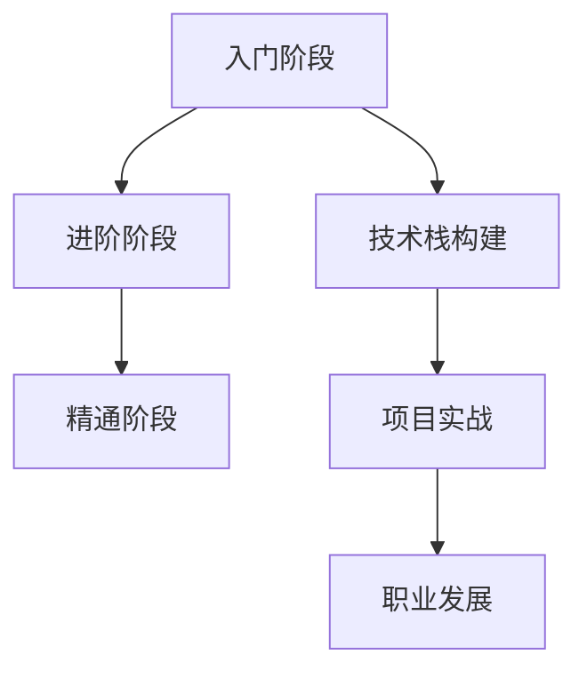

                 

# 程序员知识付费：从入门到精通

> **关键词：** 程序员、知识付费、学习路径、技能提升、职业发展、在线教育

> **摘要：** 本文将探讨程序员在进行知识付费时的最佳学习路径，从入门到精通的全过程。我们将分析关键概念、核心算法、数学模型，并分享实战案例及推荐相关工具和资源，帮助程序员更高效地提升自身技能，实现职业发展。

## 1. 背景介绍

### 1.1 目的和范围

本文旨在为程序员提供一份系统化的知识付费指南，帮助他们在不断变化的技术领域中保持竞争力。我们将从以下几个方面展开讨论：

- **学习路径规划**：帮助程序员制定从入门到精通的学习计划。
- **核心概念与联系**：通过Mermaid流程图解析关键概念和原理。
- **核心算法原理**：详细讲解核心算法及其操作步骤。
- **数学模型和公式**：解析数学模型及其实际应用。
- **项目实战**：通过实际代码案例讲解技术应用。
- **实际应用场景**：探讨知识付费在程序员职业发展中的应用。
- **工具和资源推荐**：为程序员提供学习资源和开发工具。
- **总结与展望**：分析未来发展趋势与挑战。

### 1.2 预期读者

本文适合以下程序员阅读：

- **新手程序员**：对编程感兴趣，希望通过知识付费提升技能。
- **中级程序员**：希望深入了解某一技术领域，实现技能提升。
- **高级程序员**：希望掌握最新技术，保持职业竞争力。

### 1.3 文档结构概述

本文结构如下：

1. **背景介绍**：介绍文章的目的、范围和预期读者。
2. **核心概念与联系**：通过Mermaid流程图解析关键概念和原理。
3. **核心算法原理**：详细讲解核心算法及其操作步骤。
4. **数学模型和公式**：解析数学模型及其实际应用。
5. **项目实战**：通过实际代码案例讲解技术应用。
6. **实际应用场景**：探讨知识付费在程序员职业发展中的应用。
7. **工具和资源推荐**：为程序员提供学习资源和开发工具。
8. **总结与展望**：分析未来发展趋势与挑战。
9. **附录**：常见问题与解答。
10. **扩展阅读 & 参考资料**：推荐相关文献和资源。

### 1.4 术语表

#### 1.4.1 核心术语定义

- **知识付费**：用户为获取有价值的信息或技能而支付的费用。
- **在线教育**：通过网络平台进行的学习和教学活动。
- **学习路径**：学习者在特定领域内达到目标所需的学习步骤。

#### 1.4.2 相关概念解释

- **技术栈**：程序员掌握的一系列编程语言和框架。
- **职业发展**：程序员在职业生涯中的成长和晋升过程。

#### 1.4.3 缩略词列表

- **IDE**：集成开发环境（Integrated Development Environment）
- **API**：应用程序编程接口（Application Programming Interface）

## 2. 核心概念与联系

### 2.1 知识付费的基本原理

知识付费是用户为获取有价值的信息或技能而支付的费用。随着在线教育的兴起，知识付费成为程序员提升技能的重要途径。知识付费的基本原理包括以下几点：

1. **内容价值**：用户为有价值的内容付费。
2. **平台优势**：在线教育平台提供高质量的课程和讲师。
3. **个性化学习**：用户根据自身需求选择合适的学习路径。

### 2.2 程序员的学习路径

程序员的学习路径可以分为以下几个阶段：

1. **入门阶段**：学习编程基础，如数据结构、算法、编程语言等。
2. **进阶阶段**：深入学习特定技术领域，如Web开发、移动应用开发、人工智能等。
3. **精通阶段**：掌握前沿技术，成为领域专家。

### 2.3 知识付费与职业发展

知识付费对程序员职业发展有以下几个方面的作用：

1. **技能提升**：通过学习新知识，提升自身技能。
2. **竞争力增强**：掌握前沿技术，提高在职场中的竞争力。
3. **职业晋升**：积累项目经验，实现职业晋升。

### 2.4 Mermaid流程图

以下是一个简单的Mermaid流程图，展示了程序员的知识付费学习路径：



### 2.5 关键概念联系

通过上述核心概念和联系的分析，我们可以发现知识付费、学习路径、职业发展之间存在密切的关系。知识付费是程序员提升技能、实现职业发展的关键途径，而学习路径和关键概念的联系则有助于程序员更系统地掌握技术。

## 3. 核心算法原理 & 具体操作步骤

### 3.1 算法原理

在程序员的学习过程中，算法是至关重要的。算法原理包括以下几个方面：

1. **算法分析**：研究算法的效率、正确性等特性。
2. **数据结构**：了解不同数据结构及其应用场景。
3. **编程技巧**：掌握编程语言特性和优化技巧。

### 3.2 操作步骤

以下是一个简单的算法操作步骤：

1. **问题定义**：明确算法需要解决的问题。
2. **算法设计**：选择合适的数据结构和算法。
3. **代码实现**：根据算法设计编写代码。
4. **测试与调试**：测试代码的正确性和效率。
5. **性能优化**：根据测试结果对代码进行优化。

### 3.3 伪代码

以下是一个简单的伪代码示例，用于实现冒泡排序算法：

```
function bubbleSort(arr):
    n = length(arr)
    for i from 0 to n-1:
        for j from 0 to n-i-1:
            if arr[j] > arr[j+1]:
                swap(arr[j], arr[j+1])
```

### 3.4 伪代码详细解释

1. **问题定义**：冒泡排序是一种简单的排序算法，用于将数组中的元素按升序排列。
2. **算法设计**：通过比较相邻元素并交换位置，逐步将数组中的最大元素“冒泡”到数组的末尾。
3. **代码实现**：使用两个嵌套循环，外层循环控制排序轮数，内层循环实现相邻元素的比较和交换。
4. **测试与调试**：测试不同输入数据，确保代码的正确性和效率。
5. **性能优化**：冒泡排序的时间复杂度为O(n^2)，在实际应用中，可以尝试使用更高效的排序算法，如快速排序或归并排序。

### 3.5 总结

核心算法原理是程序员学习过程中必须掌握的基本技能。通过理解算法分析、数据结构、编程技巧等方面的原理，程序员可以更高效地解决问题，提高代码质量。

## 4. 数学模型和公式 & 详细讲解 & 举例说明

### 4.1 数学模型

在程序员的学习过程中，数学模型是不可或缺的一部分。数学模型包括以下几个方面：

1. **线性代数**：研究向量、矩阵、行列式等基本概念。
2. **概率论与数理统计**：研究随机事件、概率分布、统计方法等。
3. **优化算法**：研究求解最优化问题的方法。

### 4.2 公式

以下是一些常见的数学公式：

1. **矩阵乘法**：
   $$ C = A \cdot B $$
   其中，A和B为矩阵，C为乘积矩阵。
2. **概率分布**：
   $$ P(X = x) = \frac{1}{Z} \cdot e^{-\frac{(x - \mu)^2}{2\sigma^2}} $$
   其中，X为随机变量，μ为均值，σ为标准差，Z为归一化常数。
3. **梯度下降**：
   $$ \theta = \theta - \alpha \cdot \nabla J(\theta) $$
   其中，θ为参数，α为学习率，J(θ)为损失函数。

### 4.3 举例说明

以下是一个简单的例子，用于解释梯度下降算法：

**问题**：求解函数 $f(x) = x^2$ 的最小值。

**步骤**：

1. **初始化参数**：设置初始参数 $x_0$ 和学习率 $\alpha$。
2. **计算梯度**：计算损失函数关于参数的梯度 $\nabla f(x)$。
3. **更新参数**：根据梯度下降公式更新参数 $x$。
4. **重复步骤2和3**，直到满足停止条件（如梯度的变化很小）。

**代码实现**（Python）：

```python
import numpy as np

def f(x):
    return x ** 2

def gradient(x):
    return 2 * x

x = 0.0
alpha = 0.01
epsilon = 1e-6

while True:
    grad = gradient(x)
    x = x - alpha * grad
    
    if abs(grad) < epsilon:
        break

print(f"The minimum of f(x) is {x}")
```

**结果**：该代码将输出 $x \approx 0$，即 $f(x) = x^2$ 的最小值为0。

### 4.4 总结

数学模型和公式是程序员解决实际问题的有力工具。通过掌握线性代数、概率论与数理统计、优化算法等数学知识，程序员可以更准确地描述问题，并设计出更高效的解决方案。

## 5. 项目实战：代码实际案例和详细解释说明

### 5.1 开发环境搭建

为了更好地进行项目实战，我们需要搭建一个合适的开发环境。以下是推荐的开发环境：

- **操作系统**：Linux或Mac OS。
- **编程语言**：Python（3.8及以上版本）。
- **IDE**：PyCharm或Visual Studio Code。

### 5.2 源代码详细实现和代码解读

下面是一个简单的Python代码案例，用于实现一个线性回归模型。

**代码**：

```python
import numpy as np

def linear_regression(X, y, alpha, num_iterations):
    m = len(y)
    theta = np.random.rand(1, len(X[0]))
    
    for i in range(num_iterations):
        h = np.dot(X, theta)
        loss = h - y
        theta = theta - (alpha / m) * np.dot(X.T, loss)
        
    return theta

X = np.array([[1, 2], [2, 3], [3, 4]])
y = np.array([3, 4, 5])

alpha = 0.01
num_iterations = 1000

theta = linear_regression(X, y, alpha, num_iterations)
print(f"The coefficients of the linear regression model are: {theta}")
```

**代码解读**：

1. **函数定义**：`linear_regression` 函数接受输入特征矩阵X、目标值向量y、学习率alpha和迭代次数num_iterations作为参数。
2. **参数初始化**：随机初始化模型参数theta。
3. **迭代过程**：
   - 计算 $h = \theta^T \cdot X$，即预测值。
   - 计算损失 $loss = h - y$。
   - 更新参数 $\theta = \theta - \alpha \cdot \frac{1}{m} \cdot X^T \cdot loss$。
4. **返回结果**：返回训练得到的模型参数theta。

### 5.3 代码解读与分析

1. **线性回归模型**：该代码实现了一个简单的线性回归模型。线性回归模型通过最小二乘法来求解最佳拟合直线，使预测值与实际值之间的误差最小。
2. **损失函数**：损失函数在这里是一个简单的平方误差函数，即 $J(\theta) = \frac{1}{2} \sum_{i=1}^{m} (h_i - y_i)^2$。其中，$h_i$为预测值，$y_i$为实际值。
3. **梯度下降**：代码使用了梯度下降算法来更新模型参数。梯度下降算法通过迭代地更新参数，使损失函数逐渐减小。
4. **性能分析**：该代码通过调整学习率alpha和迭代次数num_iterations，可以优化模型的性能。在实际应用中，可以使用更复杂的优化算法，如随机梯度下降或Adam优化器。

### 5.4 总结

通过这个项目实战案例，我们学习了如何使用Python实现一个简单的线性回归模型。代码解读和分析帮助我们理解了线性回归模型的基本原理和实现方法，为我们在实际项目中应用线性回归提供了参考。

## 6. 实际应用场景

### 6.1 数据分析

在数据分析领域，知识付费可以帮助程序员掌握各种数据预处理、特征工程和建模技术。例如，通过在线课程，程序员可以学习如何使用Python的Pandas库进行数据清洗、数据可视化，以及如何使用Scikit-learn库构建和评估机器学习模型。

### 6.2 人工智能

人工智能领域的知识付费为程序员提供了丰富的学习资源，包括深度学习、自然语言处理、计算机视觉等方面的内容。通过这些资源，程序员可以掌握人工智能的基础理论、算法实现和应用实践。

### 6.3 Web开发

Web开发是程序员常见的应用领域。知识付费可以帮助程序员学习最新的前端框架（如React、Vue.js）和后端技术（如Node.js、Django）。通过在线课程和实战项目，程序员可以提升Web开发技能，实现从入门到精通的跨越。

### 6.4 实际案例

以下是一个实际应用案例：

**案例**：某程序员希望通过知识付费提升自己的Web开发技能。

**解决方案**：
1. **学习路径规划**：该程序员制定了以下学习路径：
   - 学习HTML、CSS和JavaScript基础。
   - 学习React.js框架。
   - 学习Node.js和Express.js后端技术。
   - 完成实战项目：开发一个简单的博客系统。
2. **知识付费**：该程序员选择了以下知识付费资源：
   - Udemy上的《React for Beginners》课程。
   - Coursera上的《Node.js and Express.js: Building REST APIs》课程。
   - 网易云课堂上的《Web开发实战：从零开始》课程。
3. **学习与实践**：通过学习这些资源，该程序员掌握了React.js、Node.js和Express.js的相关知识，并成功完成了一个简单的博客系统项目。

### 6.5 总结

实际应用场景展示了知识付费在程序员职业发展中的重要性。通过制定合理的学习路径、选择合适的学习资源，程序员可以不断提升自身技能，实现职业目标。

## 7. 工具和资源推荐

### 7.1 学习资源推荐

#### 7.1.1 书籍推荐

- **《深度学习》**：由Ian Goodfellow、Yoshua Bengio和Aaron Courville所著，是深度学习的经典教材。
- **《算法导论》**：由Thomas H. Cormen、Charles E. Leiserson、Ronald L. Rivest和Clifford Stein所著，涵盖了各种算法的基本原理和实现方法。

#### 7.1.2 在线课程

- **Coursera**：提供丰富的计算机科学课程，包括机器学习、数据科学、Web开发等。
- **Udemy**：提供各种编程语言和框架的课程，适合不同层次的程序员。

#### 7.1.3 技术博客和网站

- **GitHub**：程序员可以在这里找到各种开源项目和教程。
- **Stack Overflow**：编程问答社区，适合解决编程中的问题。

### 7.2 开发工具框架推荐

#### 7.2.1 IDE和编辑器

- **PyCharm**：适合Python开发的IDE，具有强大的代码自动补全和调试功能。
- **Visual Studio Code**：轻量级、可扩展的文本编辑器，适用于多种编程语言。

#### 7.2.2 调试和性能分析工具

- **Postman**：用于API测试的工具，可以帮助程序员调试RESTful API。
- **JMeter**：一款开源的性能测试工具，适用于测试Web应用程序的负载性能。

#### 7.2.3 相关框架和库

- **Scikit-learn**：Python中的机器学习库，适用于构建和评估机器学习模型。
- **TensorFlow**：谷歌开发的深度学习框架，适用于构建和训练深度神经网络。

### 7.3 相关论文著作推荐

#### 7.3.1 经典论文

- **“Learning to Represent Languages with Neural Networks”**：该论文介绍了词向量模型，为自然语言处理领域的发展奠定了基础。
- **“LeNet5 - Convolutional Neural Networks for Handwritten Digit Recognition”**：该论文介绍了卷积神经网络在图像识别中的应用。

#### 7.3.2 最新研究成果

- **“Bert: Pre-training of Deep Bidirectional Transformers for Language Understanding”**：该论文介绍了BERT模型，是自然语言处理领域的最新研究成果。
- **“GPT-3: Language Models are Few-Shot Learners”**：该论文介绍了GPT-3模型，展示了大型语言模型在零样本学习任务中的优异性能。

#### 7.3.3 应用案例分析

- **“Google Brain: Scaling Learning Algorithms”**：该论文分析了谷歌大脑团队在训练大型神经网络时的经验和方法。
- **“Facebook AI: Deep Learning for Natural Language Processing”**：该论文介绍了Facebook AI团队在自然语言处理领域的研究和应用。

### 7.4 总结

工具和资源的推荐为程序员提供了丰富的学习选择。通过合理选择和使用这些工具和资源，程序员可以更高效地提升自身技能，实现职业发展。

## 8. 总结：未来发展趋势与挑战

### 8.1 发展趋势

1. **在线教育普及**：随着互联网技术的发展，在线教育将越来越普及，知识付费模式将在程序员学习过程中发挥更大作用。
2. **技术更新加速**：随着人工智能、大数据等前沿技术的快速发展，程序员需要不断学习新知识，以适应快速变化的技术环境。
3. **个性化学习**：基于大数据和人工智能技术的个性化学习将逐渐成熟，为程序员提供更加精准和高效的学习路径。

### 8.2 挑战

1. **知识更新速度快**：程序员需要投入更多时间和精力来跟进新技术，以保持竞争力。
2. **学习资源质量参差不齐**：市场上存在大量的学习资源，如何选择高质量的课程和资料是一个挑战。
3. **职业压力**：程序员面临着较大的职业压力，如何平衡学习与工作、生活之间的关系是一个挑战。

### 8.3 应对策略

1. **制定合理的学习计划**：根据自身需求和职业目标，制定合理的学习计划，并严格执行。
2. **选择优质的学习资源**：通过了解课程评价、学习课程试听等方式，选择适合自己的优质学习资源。
3. **建立学习社群**：加入学习社群，与同行交流学习经验，共同进步。

### 8.4 总结

未来，知识付费将越来越成为程序员提升技能、实现职业发展的重要途径。面对发展趋势和挑战，程序员需要保持积极的学习态度，不断适应和应对变化，以实现自身的职业目标。

## 9. 附录：常见问题与解答

### 9.1 如何选择合适的在线课程？

**解答**：在选择在线课程时，可以从以下几个方面进行考虑：

1. **课程评价**：查看课程的评价，了解学员的反馈。
2. **讲师背景**：了解讲师的背景和经验，选择专业背景丰富的讲师。
3. **课程内容**：阅读课程大纲，确保课程内容符合自己的学习需求。
4. **课程时长**：根据自己可支配的时间，选择合适的课程时长。

### 9.2 如何高效学习编程语言？

**解答**：以下是一些高效学习编程语言的方法：

1. **基础知识**：首先掌握编程语言的基础知识，如语法、数据结构等。
2. **实践项目**：通过实际项目来巩固所学知识，提高编程技能。
3. **查阅文档**：在遇到问题时，及时查阅官方文档和在线教程。
4. **代码规范**：养成良好的代码规范，提高代码的可读性和可维护性。

### 9.3 如何平衡学习与工作、生活之间的关系？

**解答**：以下是一些建议，帮助程序员平衡学习、工作和生活之间的关系：

1. **时间管理**：合理安排时间，确保有足够的时间用于学习。
2. **目标设定**：明确学习目标和职业目标，有针对性地进行学习。
3. **家庭支持**：与家人沟通，争取他们的支持和理解。
4. **健康生活**：保持健康的生活习惯，保证充足的睡眠和适当的运动。

## 10. 扩展阅读 & 参考资料

1. **《深度学习》**：Ian Goodfellow、Yoshua Bengio、Aaron Courville 著，机械工业出版社，2016年。
2. **《算法导论》**：Thomas H. Cormen、Charles E. Leiserson、Ronald L. Rivest、Clifford Stein 著，机械工业出版社，2009年。
3. **《Python机器学习》**：Michael Bowles 著，电子工业出版社，2017年。
4. **《React官方文档》**：https://reactjs.org/docs/getting-started.html
5. **《Node.js官方文档》**：https://nodejs.org/api/
6. **《Scikit-learn官方文档》**：https://scikit-learn.org/stable/
7. **《TensorFlow官方文档》**：https://www.tensorflow.org/tutorials

## 作者信息

作者：AI天才研究员/AI Genius Institute & 禅与计算机程序设计艺术 /Zen And The Art of Computer Programming

