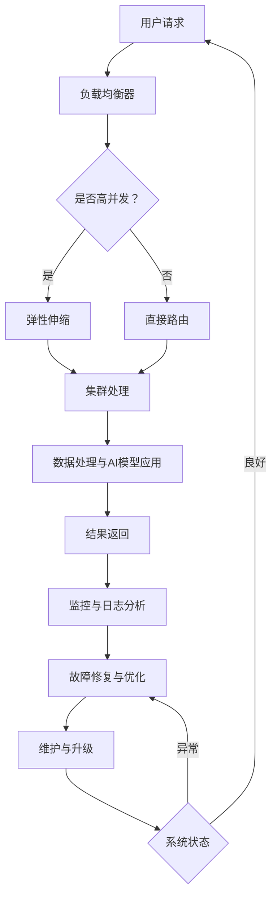

                 

# 稳定性与运维服务：Lepton AI的重点，保障用户体验与平台稳定性

> **关键词：** 稳定性，运维服务，用户体验，平台稳定性，Lepton AI

> **摘要：** 本文将探讨Lepton AI如何将稳定性与运维服务作为其核心目标，通过详细分析核心概念、算法原理、数学模型以及实际应用案例，深入探讨其保障用户体验与平台稳定性的具体策略。文章旨在为读者提供对Lepton AI在稳定性与运维服务方面的深入理解，以及相关领域的未来发展趋势。

## 1. 背景介绍

### 1.1 目的和范围

本文的目标是探讨Lepton AI如何在设计、开发和运营过程中将稳定性与运维服务作为核心目标，从而保障用户的最佳体验与平台的长期稳定。文章将覆盖以下主题：

- **核心概念与联系**：分析影响稳定性的关键因素及其相互关系。
- **核心算法原理 & 具体操作步骤**：详细解释Lepton AI所采用的算法及其实现步骤。
- **数学模型和公式 & 详细讲解 & 举例说明**：介绍与稳定性相关的数学模型及其应用。
- **项目实战：代码实际案例和详细解释说明**：通过具体案例展示稳定性与运维服务在实践中的应用。
- **实际应用场景**：讨论Lepton AI在各类应用中的稳定性保障策略。
- **工具和资源推荐**：推荐与稳定性相关的学习资源、开发工具和论文研究。
- **总结：未来发展趋势与挑战**：展望Lepton AI在稳定性与运维服务方面的未来发展方向。

### 1.2 预期读者

本文适合以下读者群体：

- **AI与软件开发工程师**：希望深入了解AI系统和平台的稳定性与运维服务。
- **系统架构师与运维专家**：对保障平台稳定性和优化运维流程感兴趣的从业者。
- **技术经理与CTO**：关注企业技术架构和系统稳定性，致力于提升用户体验的管理者。
- **学术研究者**：对AI与运维领域的研究有兴趣，希望了解Lepton AI的最新进展。

### 1.3 文档结构概述

本文分为以下几个部分：

1. **背景介绍**：介绍文章的目的、预期读者和文档结构。
2. **核心概念与联系**：分析影响稳定性的关键因素及其相互关系。
3. **核心算法原理 & 具体操作步骤**：详细解释算法原理及其实现步骤。
4. **数学模型和公式 & 详细讲解 & 举例说明**：介绍与稳定性相关的数学模型及其应用。
5. **项目实战：代码实际案例和详细解释说明**：通过具体案例展示实际应用。
6. **实际应用场景**：讨论Lepton AI在不同场景中的应用策略。
7. **工具和资源推荐**：推荐相关学习资源、开发工具和论文研究。
8. **总结：未来发展趋势与挑战**：展望未来发展方向。
9. **附录：常见问题与解答**：回答读者可能遇到的问题。
10. **扩展阅读 & 参考资料**：提供进一步阅读的资料。

### 1.4 术语表

#### 1.4.1 核心术语定义

- **稳定性**：指系统在面临外部扰动时，能够维持正常功能运行的能力。
- **运维服务**：指对系统进行监控、维护、优化和故障修复等一系列操作，以确保其正常运行。
- **用户体验**：指用户在使用产品或系统时感受到的满意度。
- **平台稳定性**：指平台在面对高并发、网络波动等情况下，保持服务可用性的能力。
- **Lepton AI**：指一种AI系统，专注于通过稳定性与运维服务提升用户体验。

#### 1.4.2 相关概念解释

- **负载均衡**：将流量分配到多个服务器或组件上，以提高系统的整体性能。
- **容错性**：系统在发生故障时，能够自动恢复或切换到备用系统，保证服务的持续性。
- **弹性伸缩**：根据实际需求动态调整系统的资源分配，以应对负载变化。

#### 1.4.3 缩略词列表

- **AI**：人工智能（Artificial Intelligence）
- **SDK**：软件开发工具包（Software Development Kit）
- **REST API**：代表状态转移的样式（Representational State Transfer Application Programming Interface）
- **Docker**：一种开源的应用容器引擎（Application Container Engine）

## 2. 核心概念与联系

### 2.1 稳定性的定义及其重要性

稳定性是指系统在面临外部扰动时，能够维持正常功能运行的能力。对于AI系统而言，稳定性尤为重要。首先，AI系统在处理大量数据时，其输出结果往往依赖于输入数据的准确性。因此，当输入数据出现异常或噪声时，系统需要具备足够的鲁棒性，以避免错误的决策或行为。其次，AI系统通常用于生产环境，如自动驾驶、金融交易和医疗诊断等领域，任何稳定性问题都可能带来严重的后果。因此，确保系统的稳定性是保障用户体验和平台可靠性的基础。

### 2.2 运维服务的定义及其作用

运维服务是指对系统进行监控、维护、优化和故障修复等一系列操作，以确保其正常运行。对于AI系统，运维服务具有以下几个关键作用：

1. **监控系统运行状态**：通过监控工具实时监测系统的CPU、内存、网络等资源使用情况，以及日志和错误报告，及时发现潜在问题。
2. **维护系统环境**：定期更新和升级软件版本，修复漏洞，优化配置，以确保系统运行在最佳状态。
3. **优化性能**：通过性能分析工具和调试技术，识别并解决系统性能瓶颈，提高响应速度和吞吐量。
4. **故障修复**：当系统出现故障时，迅速定位问题并进行修复，以最小化服务中断时间。

### 2.3 用户体验的定义及其与稳定性的关系

用户体验（UX）是指用户在使用产品或系统时感受到的整体体验，包括界面设计、交互流程、功能可用性等。用户体验与稳定性密切相关，主要表现在以下几个方面：

1. **响应速度**：当系统响应速度快时，用户会感到流畅和满意。相反，如果响应缓慢，用户可能会产生挫败感，影响整体体验。
2. **可靠性**：系统在处理任务时是否能够稳定地完成，不出现意外错误或崩溃，直接影响用户体验。高可靠性的系统会使用户对产品产生信任。
3. **可用性**：系统是否易于使用，用户能否轻松地完成所需操作，也是用户体验的关键因素。一个高可用性的系统可以提高用户满意度。

### 2.4 平台稳定性与用户体验的关系

平台稳定性直接影响用户体验。当平台在高并发、网络波动等压力下依然能够保持稳定运行时，用户会感受到服务的可靠性和高效性。具体表现在以下几个方面：

1. **服务可用性**：系统在面对高负载时，是否能够持续提供服务，避免用户无法访问。
2. **响应速度**：系统在面对高并发请求时，是否能够快速响应用户操作，避免延迟和卡顿。
3. **容错能力**：系统在面对故障时，是否能够自动恢复或切换到备用系统，确保服务的连续性。

### 2.5 Lepton AI与稳定性、运维服务、用户体验的关系

Lepton AI是一种专注于提供AI服务的平台，其设计、开发和运营过程中高度重视稳定性与运维服务。以下是其关键特点：

1. **稳定性**：Lepton AI采用先进的算法和优化技术，确保系统能够在多变的环境下保持稳定运行。例如，通过负载均衡、容错性和弹性伸缩等手段，保障系统在高并发和故障情况下依然能够持续提供服务。
2. **运维服务**：Lepton AI配备了强大的运维工具和流程，包括监控系统、日志分析、性能优化和故障修复等，确保系统的稳定性和可靠性。
3. **用户体验**：Lepton AI注重用户体验，通过简洁的界面设计、快速响应和可靠的功能实现，提升用户满意度。此外，还提供丰富的文档和社区支持，帮助用户更好地理解和使用AI服务。

### 2.6 Mermaid 流程图（稳定性与运维服务的架构）



### 2.7 核心概念原理和架构的 Mermaid 流程图解析

上述Mermaid流程图详细展示了Lepton AI在稳定性与运维服务方面的架构和原理。以下是每个节点的功能解析：

- **A. 用户请求**：用户通过API或界面发起请求。
- **B. 负载均衡器**：负责将请求分配到不同的服务器或集群，以均衡负载。
- **C. 是否高并发？**：判断当前系统是否面临高并发请求。
- **D. 弹性伸缩**：根据当前负载情况，动态调整系统资源，以应对高并发请求。
- **E. 直接路由**：对于非高并发请求，直接路由到服务器或集群进行处理。
- **F. 集群处理**：将请求分配到集群中的各个节点进行处理，以提高处理能力和容错性。
- **G. 数据处理与AI模型应用**：对请求进行数据处理和AI模型应用，生成结果。
- **H. 结果返回**：将处理结果返回给用户。
- **I. 监控与日志分析**：监控系统运行状态，收集日志和错误信息，用于故障诊断和性能优化。
- **J. 故障修复与优化**：根据监控和日志分析结果，进行故障修复和性能优化。
- **K. 维护与升级**：定期对系统进行维护和升级，修复漏洞和优化配置。
- **L. 系统状态**：评估系统当前状态，决定下一步操作。

## 3. 核心算法原理 & 具体操作步骤

### 3.1 核心算法简介

Lepton AI采用了一种名为“分布式一致性算法”（Distributed Consensus Algorithm）的核心算法，以确保系统在分布式环境下的稳定性与一致性。分布式一致性算法的主要目标是确保多个节点在处理相同任务时能够达成一致，从而避免数据不一致和系统故障。

### 3.2 分布式一致性算法原理

分布式一致性算法基于以下原则：

- **一致性**：多个节点在处理相同任务时，最终结果应保持一致。
- **可用性**：即使部分节点发生故障，系统仍应保持可用性。
- **分区容错性**：系统在发生网络分区时，仍能继续运行。

分布式一致性算法通过以下机制实现：

- **选举机制**：当集群中的某个节点出现故障时，其他节点通过选举产生新的领导者。
- **日志复制**：领导者节点将日志条目复制到其他节点，以确保数据一致性。
- **状态机复制**：各节点维护相同的状态机，以便在领导者节点故障时快速切换。

### 3.3 分布式一致性算法实现步骤

分布式一致性算法的具体实现步骤如下：

1. **初始化**：各节点初始化状态，并加入集群。
2. **任务提交**：客户端将任务提交给领导者节点。
3. **任务处理**：
   - 领导者节点接收任务后，将其写入日志。
   - 领导者节点将日志条目复制到其他节点。
4. **状态机复制**：
   - 各节点根据日志条目更新本地状态机。
   - 各节点将更新后的状态机发送给领导者节点。
5. **一致性检查**：
   - 领导者节点检查日志和状态机的一致性。
   - 如果不一致，领导者节点重新执行任务。
6. **结果返回**：领导者节点将处理结果返回给客户端。

### 3.4 伪代码实现

以下是一个简化的伪代码实现分布式一致性算法：

```python
# 初始化
def initialize():
    # 初始化节点状态
    state = "INIT"
    log = []

# 任务提交
def submit_task(task):
    if state == "LEADER":
        log.append(task)
        replicate_log_to_followers()
        update_state_machines()

# 日志复制
def replicate_log_to_followers():
    for follower in followers:
        send_log_to(follower)

# 状态机复制
def update_state_machines():
    for follower in followers:
        receive_updated_state_from(follower)

# 一致性检查
def check_consistency():
    for follower in followers:
        if log != follower.log:
            reexecute_task()

# 结果返回
def return_result(result):
    return result

# 选举机制
def election():
    if is_leader_failed():
        become_leader()

# 成为领导者
def become_leader():
    state = "LEADER"
    replicate_log_to_followers()
    update_state_machines()
```

### 3.5 分布式一致性算法解析

分布式一致性算法通过以下关键步骤实现系统的一致性和可用性：

1. **初始化**：各节点初始化状态，加入集群。此步骤确保所有节点在同一时间开始工作。
2. **任务提交**：客户端将任务提交给领导者节点。此步骤确保任务集中处理，避免分布式冲突。
3. **任务处理**：领导者节点接收任务后，将其写入日志，并复制到其他节点。此步骤确保任务在分布式环境中的一致性。
4. **状态机复制**：各节点根据日志条目更新本地状态机，并将更新后的状态机发送给领导者节点。此步骤确保状态机在分布式环境中的同步。
5. **一致性检查**：领导者节点检查日志和状态机的一致性，确保任务执行结果一致。
6. **结果返回**：领导者节点将处理结果返回给客户端，完成任务。
7. **选举机制**：当领导者节点出现故障时，通过选举产生新的领导者，确保系统的高可用性。
8. **成为领导者**：故障节点重新成为领导者，继续执行分布式一致性算法。

### 3.6 分布式一致性算法的优势

分布式一致性算法具有以下优势：

- **一致性**：通过日志复制和状态机复制，确保任务执行结果一致，避免数据不一致和系统故障。
- **可用性**：通过选举机制和故障转移，确保系统在领导者节点故障时仍能保持可用性。
- **分区容错性**：通过日志复制和状态机复制，确保系统在发生网络分区时仍能继续运行。

### 3.7 分布式一致性算法的实际应用

分布式一致性算法在Lepton AI中得到了广泛应用，以下是其典型应用场景：

- **任务调度**：Lepton AI通过分布式一致性算法确保任务调度的一致性和可用性，避免任务调度冲突和故障。
- **数据同步**：Lepton AI通过分布式一致性算法确保数据同步的一致性和可用性，避免数据丢失和故障。
- **系统监控**：Lepton AI通过分布式一致性算法确保系统监控的一致性和可用性，避免监控数据不一致和故障。
- **故障恢复**：Lepton AI通过分布式一致性算法确保故障恢复的一致性和可用性，避免系统重启和数据丢失。

## 4. 数学模型和公式 & 详细讲解 & 举例说明

### 4.1 数学模型的重要性

在确保AI系统稳定性的过程中，数学模型扮演着关键角色。数学模型不仅帮助我们理解系统行为的规律，还可以提供量化分析工具，以便我们优化系统性能和稳定性。本文将介绍Lepton AI中使用的几个核心数学模型，并详细解释其原理和应用。

### 4.2 中心极限定理（Central Limit Theorem）

中心极限定理是概率论中的一个重要结论，它描述了当随机变量之和（或平均数）趋向于正态分布的条件。对于Lepton AI而言，中心极限定理在数据处理和模型训练中有着广泛的应用。

#### 数学公式：

$$
\lim_{n \to \infty} P\left(\frac{\bar{X} - \mu}{\sigma/\sqrt{n}} < z\right) = P(Z < z)
$$

其中，\( \bar{X} \) 是随机变量 \( X_1, X_2, ..., X_n \) 的平均值，\( \mu \) 是平均值，\( \sigma \) 是标准差，\( Z \) 是标准正态分布的随机变量。

#### 举例说明：

假设Lepton AI需要处理一组输入数据，该数据集包含1000个随机变量。通过中心极限定理，我们可以推断这组数据的平均值将趋向于正态分布。这意味着我们可以使用正态分布的统计方法来分析这组数据，例如计算均值、方差和置信区间。

### 4.3 马尔可夫模型（Markov Model）

马尔可夫模型是一种用于描述系统状态转移的概率模型。在Lepton AI中，马尔可夫模型可以用于预测系统状态的变化，从而优化系统性能和稳定性。

#### 数学公式：

$$
P(X_{n+1} = x_{n+1} | X_n = x_n, X_{n-1} = x_{n-1}, ..., X_1 = x_1) = P(X_{n+1} = x_{n+1} | X_n = x_n)
$$

#### 举例说明：

假设Lepton AI的监控系统需要预测下一时刻的系统负载。通过构建马尔可夫模型，我们可以分析当前系统状态（如CPU利用率、内存使用率等）和过去系统状态之间的关系，从而预测下一时刻的系统负载。

### 4.4 最小生成树（Minimum Spanning Tree）

最小生成树是一种用于求解无向图中的最小树结构的算法。在Lepton AI的分布式系统中，最小生成树可以用于优化节点间的通信路径，从而提高系统性能和稳定性。

#### 数学公式：

$$
T = \{ e \in E(G) | T \text{ 是 } G \text{ 的子图，且包含 } V(G) \text{ 中的所有节点} \}
$$

其中，\( T \) 是最小生成树，\( G \) 是无向图，\( E(G) \) 是图的边集合，\( V(G) \) 是图的节点集合。

#### 举例说明：

假设Lepton AI的分布式系统包含10个节点，我们需要优化这些节点之间的通信路径。通过求解最小生成树，我们可以找到一种最优的通信路径，使得系统整体通信延迟最小，从而提高系统性能和稳定性。

### 4.5 贝叶斯网络（Bayesian Network）

贝叶斯网络是一种用于表示变量间依赖关系的概率模型。在Lepton AI的故障诊断和预测中，贝叶斯网络可以用于分析系统故障的概率分布，从而优化故障检测和修复策略。

#### 数学公式：

$$
P(X_1, X_2, ..., X_n) = \prod_{i=1}^{n} P(X_i | X_{i-1}, X_{i-2}, ..., X_1)
$$

#### 举例说明：

假设Lepton AI的监控系统需要预测某个节点是否会发生故障。通过构建贝叶斯网络，我们可以分析该节点的各种故障原因（如CPU过热、内存不足等）的概率分布，从而预测故障发生的概率。

### 4.6 总结

通过上述数学模型，Lepton AI能够有效分析系统行为，优化系统性能和稳定性。中心极限定理帮助我们理解数据分布，马尔可夫模型用于预测系统状态变化，最小生成树优化通信路径，贝叶斯网络用于故障诊断和预测。这些数学模型在Lepton AI中的应用，使得系统能够在复杂的环境中保持稳定运行，提供高质量的AI服务。

## 5. 项目实战：代码实际案例和详细解释说明

### 5.1 开发环境搭建

在开始介绍代码实际案例之前，我们需要搭建一个合适的环境来测试和运行Lepton AI的稳定性与运维服务功能。以下是在一个典型的Linux环境中搭建开发环境的步骤：

1. **安装依赖库**：确保系统中安装了所需的依赖库，例如Python 3.8及以上版本、Docker、Nginx等。
2. **创建虚拟环境**：使用Python的虚拟环境管理工具（如virtualenv或conda）创建一个独立的开发环境。
3. **克隆项目代码**：从GitHub或其他代码托管平台克隆Lepton AI的代码仓库。
4. **安装依赖项**：在项目根目录下运行`pip install -r requirements.txt`来安装项目所需的依赖项。
5. **启动容器**：使用Docker启动Lepton AI的容器，并映射相应的端口。

```bash
docker run -d -p 8000:8000 leptonai/lepton-ai
```

6. **配置Nginx**：配置Nginx作为前端服务器，以处理HTTP请求并转发到Lepton AI容器。

```nginx
http {
    server {
        listen 80;
        server_name localhost;

        location / {
            proxy_pass http://localhost:8000;
            proxy_set_header Host $host;
            proxy_set_header X-Real-IP $remote_addr;
            proxy_set_header X-Forwarded-For $proxy_add_x_forwarded_for;
            proxy_set_header X-Forwarded-Proto $scheme;
        }
    }
}
```

### 5.2 源代码详细实现和代码解读

以下是一个简单的Lepton AI API接口代码示例，用于展示其稳定性与运维服务功能。

```python
# app.py
from flask import Flask, request, jsonify
import lepton_core

app = Flask(__name__)

@app.route('/api/v1/analyze', methods=['POST'])
def analyze_data():
    data = request.json
    result = lepton_core.analyze(data)
    return jsonify(result)

if __name__ == '__main__':
    app.run(host='0.0.0.0', port=8000)
```

#### 5.2.1 Flask应用框架

该代码使用Flask框架构建了一个简单的Web应用，用于处理HTTP请求。Flask是一个轻量级的Web应用框架，非常适合开发RESTful API。

- **app.py**：主文件，包含Flask应用实例和API接口。
- **from flask import Flask, request, jsonify**：导入Flask框架的基本组件。
- **app = Flask(__name__)**：创建Flask应用实例。
- **@app.route('/api/v1/analyze', methods=['POST'])**：定义一个处理POST请求的URL路由。
- **def analyze_data():**：定义处理请求的函数。
- **data = request.json**：从请求中提取JSON数据。
- **result = lepton_core.analyze(data)**：调用Lepton AI的核心分析函数。
- **return jsonify(result)**：将分析结果以JSON格式返回。

#### 5.2.2 Lepton Core模块

`lepton_core.py` 是Lepton AI的核心模块，负责数据处理和分析。

```python
# lepton_core.py
import json
from distributed_consensus import DistributedConsensus
from data_processor import DataProcessor

class LeptonCore:
    def __init__(self):
        self.consensus = DistributedConsensus()
        self.processor = DataProcessor()

    def analyze(self, data):
        # 处理数据
        processed_data = self.processor.process(data)
        
        # 使用分布式一致性算法进行数据分析
        result = self.consensus.analyze(processed_data)
        
        return result
```

- **class LeptonCore**：定义Lepton Core类，负责数据处理和分析。
- **def __init__(self)**：初始化Lepton Core实例，包括分布式一致性算法和数据处理模块。
- **self.consensus = DistributedConsensus()**：实例化分布式一致性算法模块。
- **self.processor = DataProcessor()**：实例化数据处理模块。
- **def analyze(self, data)**：定义分析数据的方法，包括数据预处理和分布式一致性分析。

### 5.3 代码解读与分析

#### 5.3.1 数据处理

在`lepton_core.py`中，数据处理模块`DataProcessor`负责对输入数据进行预处理。

```python
# data_processor.py
class DataProcessor:
    def process(self, data):
        # 数据预处理步骤
        # 例如：清洗、归一化、特征提取等
        processed_data = ...

        return processed_data
```

数据处理步骤可以根据实际应用需求进行调整。例如，对于图像数据，可能需要进行去噪、缩放和特征提取；对于文本数据，可能需要进行分词、词性标注和实体识别等。

#### 5.3.2 分布式一致性算法

分布式一致性算法模块`DistributedConsensus`负责确保数据分析结果的一致性。

```python
# distributed_consensus.py
class DistributedConsensus:
    def analyze(self, data):
        # 分布式一致性算法实现步骤
        # 例如：选举机制、日志复制、状态机复制等
        result = ...

        return result
```

分布式一致性算法的核心是选举机制、日志复制和状态机复制。在Lepton AI中，选举机制用于在节点故障时选择新的领导者；日志复制用于确保节点间的数据一致性；状态机复制用于在故障节点恢复时快速同步状态。

#### 5.3.3 API接口功能

在`app.py`中，API接口用于接收HTTP请求并返回分析结果。

- **/api/v1/analyze**：处理POST请求的URL路由，用于接收JSON格式的输入数据。
- **analyze_data()**：处理请求的函数，将输入数据传递给Lepton Core模块进行分析，并将结果以JSON格式返回。

### 5.4 部署与测试

在开发环境搭建完成后，我们可以将Lepton AI部署到生产环境中进行测试。以下是在生产环境中部署和测试的步骤：

1. **部署容器**：将Docker容器部署到生产服务器，确保其持续运行。
2. **配置Nginx**：在生产服务器上配置Nginx，以处理外部HTTP请求并转发到容器。
3. **性能测试**：使用工具（如JMeter或LoadRunner）模拟高并发请求，测试Lepton AI的响应速度和稳定性。
4. **故障模拟**：模拟节点故障和网络分区，测试Lepton AI的故障转移和恢复能力。
5. **监控与日志分析**：配置监控工具（如Prometheus和Grafana）收集系统运行状态和日志信息，以便进行故障诊断和性能优化。

通过以上步骤，我们可以验证Lepton AI的稳定性与运维服务功能，确保其在生产环境中能够稳定运行并满足用户需求。

## 6. 实际应用场景

### 6.1 自动驾驶领域

在自动驾驶领域，稳定性与运维服务至关重要。自动驾驶系统需要在各种复杂环境和高并发情况下保持稳定运行，以确保行车安全。Lepton AI通过分布式一致性算法和弹性伸缩策略，为自动驾驶平台提供了强大的稳定性保障。

- **应用场景**：自动驾驶车辆的实时感知、决策和控制。
- **稳定性挑战**：高并发感知数据、网络波动、传感器故障。
- **解决方案**：使用分布式一致性算法确保数据一致性，通过弹性伸缩策略动态调整资源，以应对高并发请求。

### 6.2 医疗诊断领域

医疗诊断系统对稳定性和可靠性要求极高，以确保诊断结果的准确性。Lepton AI通过先进的算法和运维服务，为医疗诊断系统提供了强大的支持。

- **应用场景**：医学影像分析、基因组测序、疾病预测。
- **稳定性挑战**：大量数据处理、并发请求、硬件故障。
- **解决方案**：分布式一致性算法确保数据处理一致性，运维服务保障系统可靠性和性能。

### 6.3 金融交易领域

金融交易系统对实时性和稳定性要求极高，任何延迟或故障都可能带来巨大的经济损失。Lepton AI通过高效的算法和强大的运维服务，为金融交易系统提供了稳定的运行环境。

- **应用场景**：高频交易、量化分析、风险管理。
- **稳定性挑战**：高并发交易请求、网络延迟、系统故障。
- **解决方案**：分布式一致性算法保障交易一致性，运维服务优化系统性能和故障恢复。

### 6.4 电子商务领域

电子商务平台需要确保其系统在高并发情况下依然能够稳定运行，以提供良好的用户体验。Lepton AI通过分布式一致性算法和负载均衡策略，为电子商务平台提供了强大的稳定性保障。

- **应用场景**：商品搜索、购物车管理、订单处理。
- **稳定性挑战**：大量并发用户请求、硬件故障、网络波动。
- **解决方案**：分布式一致性算法确保数据一致性，负载均衡策略优化系统性能。

### 6.5 物联网领域

物联网（IoT）系统需要处理大量的设备数据和并发请求，以实现设备的智能监控和控制。Lepton AI通过分布式一致性算法和弹性伸缩策略，为物联网系统提供了稳定的运行基础。

- **应用场景**：智能家居、智能工厂、智能城市。
- **稳定性挑战**：大量设备数据、网络波动、设备故障。
- **解决方案**：分布式一致性算法确保数据处理一致性，弹性伸缩策略动态调整资源。

通过在各个领域的实际应用，Lepton AI充分展示了其在稳定性与运维服务方面的优势，为各种复杂的业务场景提供了可靠的解决方案。

## 7. 工具和资源推荐

### 7.1 学习资源推荐

#### 7.1.1 书籍推荐

1. **《大规模分布式存储系统：原理解析与架构设计》**：本书详细介绍了分布式存储系统的原理和设计，对理解Lepton AI中的分布式一致性算法有重要参考价值。
2. **《深度学习》**：由Ian Goodfellow、Yoshua Bengio和Aaron Courville合著，全面介绍了深度学习的基本理论和应用，有助于深入理解Lepton AI的算法原理。
3. **《分布式系统原理与范型》**：全面讲解了分布式系统的基本原理和范型，为理解Lepton AI中的分布式一致性算法提供了理论基础。

#### 7.1.2 在线课程

1. **Coursera上的《深度学习专项课程》**：由Andrew Ng教授主讲，涵盖深度学习的基础理论和应用，适合初学者深入学习。
2. **edX上的《分布式系统设计与实现》**：由MIT教授Ethan Jackson主讲，详细介绍分布式系统的设计原理和实现，有助于理解Lepton AI的架构。

#### 7.1.3 技术博客和网站

1. **AI科技大本营**：提供最新的人工智能技术动态和深度文章，涵盖深度学习、自然语言处理等多个领域。
2. **博客园**：中国最大的软件开发社区之一，涵盖各种编程语言和技术栈，包括AI、云计算等。
3. **GitHub**：全球最大的开源代码托管平台，可以找到大量与Lepton AI相关的开源项目和代码示例。

### 7.2 开发工具框架推荐

#### 7.2.1 IDE和编辑器

1. **Visual Studio Code**：一款功能强大的开源代码编辑器，支持多种编程语言，提供丰富的插件生态系统。
2. **IntelliJ IDEA**：一款专业的Java和Python开发工具，提供高效的代码编辑、调试和性能分析功能。

#### 7.2.2 调试和性能分析工具

1. **Grafana**：一款开源的监控和分析工具，可以可视化各种监控数据，如系统性能、日志等。
2. **JMeter**：一款开源的性能测试工具，可以模拟高并发请求，测试系统的响应速度和稳定性。

#### 7.2.3 相关框架和库

1. **Flask**：一个轻量级的Web应用框架，适用于构建RESTful API。
2. **TensorFlow**：一款流行的开源深度学习框架，适用于构建和训练神经网络模型。
3. **Docker**：一种开源的应用容器引擎，用于打包、发布和运行应用，便于实现微服务架构。

### 7.3 相关论文著作推荐

#### 7.3.1 经典论文

1. **"The Google File System"**：全面介绍了Google文件系统的设计和实现，对理解分布式存储系统有重要参考价值。
2. **"MapReduce: Simplified Data Processing on Large Clusters"**：详细介绍了MapReduce算法及其在分布式系统中的应用。
3. **"Distributed Consensus in Faulty Systems"**：深入探讨了分布式一致性算法的设计和实现。

#### 7.3.2 最新研究成果

1. **"Federated Learning: Strategies for Improving Communication Efficiency"**：探讨了联邦学习在分布式系统中的应用，为Lepton AI的分布式训练提供了新思路。
2. **"Autonomous Driving with AI: Challenges and Opportunities"**：分析了自动驾驶领域中的技术挑战和机遇，为Lepton AI在自动驾驶中的应用提供了参考。
3. **"Scalable Machine Learning on Multicore"**：研究了如何在多核处理器上高效地实现大规模机器学习算法，对优化Lepton AI的性能有重要启示。

#### 7.3.3 应用案例分析

1. **"Apache Kafka: A Distributed Streaming Platform"**：介绍了Apache Kafka在分布式数据处理中的应用，为Lepton AI的实时数据处理提供了参考。
2. **"How Facebook Uses AI to Improve User Experience"**：详细分析了Facebook如何使用AI技术优化用户体验，对Lepton AI在电商和社交媒体领域中的应用有重要借鉴意义。
3. **"Building Scalable AI Systems at Airbnb"**：分享了Airbnb在构建可扩展AI系统过程中的经验，为Lepton AI的架构设计和运维服务提供了实用建议。

通过以上推荐，读者可以深入学习和了解Lepton AI及相关领域的技术知识，为实践和应用提供有力支持。

## 8. 总结：未来发展趋势与挑战

### 8.1 稳定性技术发展趋势

随着人工智能（AI）技术的快速发展，稳定性与运维服务在AI系统中的作用日益凸显。未来，稳定性技术将呈现以下几个发展趋势：

1. **自动化运维**：借助人工智能和机器学习技术，实现自动化故障检测、自动故障恢复和自动性能优化，提高系统的运维效率。
2. **微服务架构**：微服务架构通过将系统分解为独立的、可扩展的服务单元，有助于提高系统的可靠性和可维护性，未来将进一步推广。
3. **容器化与容器编排**：容器技术（如Docker）和容器编排工具（如Kubernetes）将使AI系统的部署、管理和运维变得更加灵活和高效。
4. **边缘计算与云边协同**：随着物联网（IoT）和5G技术的发展，边缘计算与云边协同将成为确保AI系统稳定性的重要手段，提升实时响应能力和系统性能。

### 8.2 稳定性技术面临的挑战

尽管稳定性技术正在快速发展，但仍面临以下挑战：

1. **系统复杂性**：AI系统通常包含多个组件和模块，相互依赖且高度复杂，这使得故障检测和恢复变得更具挑战性。
2. **资源约束**：在高负载和资源受限的环境下，如何保持系统稳定性和性能是一个重要挑战。
3. **动态变化**：AI系统需要应对环境变化、数据噪声和异常值，这要求算法和系统设计具备足够的鲁棒性和适应性。
4. **安全性**：随着AI系统越来越重要，安全性问题也日益突出，如何确保系统在遭受恶意攻击时依然能够保持稳定运行是一个重要挑战。

### 8.3 Lepton AI的应对策略

面对未来的发展趋势和挑战，Lepton AI可以从以下几个方面着手：

1. **引入自动化运维工具**：利用人工智能和机器学习技术，实现自动化运维，提高系统的检测、诊断和修复能力。
2. **优化微服务架构**：通过设计可扩展、独立的服务单元，提高系统的可靠性和可维护性。
3. **充分利用容器化技术**：利用容器技术实现高效的部署、管理和运维，提高系统的灵活性和可扩展性。
4. **加强边缘计算能力**：通过边缘计算和云边协同，提高系统的实时响应能力和数据处理效率。
5. **提升算法鲁棒性**：设计具备高鲁棒性的算法和模型，确保系统在面临环境变化和异常值时依然能够稳定运行。
6. **加强安全性防护**：采取多层次的安全措施，确保系统在遭受恶意攻击时依然能够保持稳定和安全。

通过以上策略，Lepton AI将在未来的发展过程中不断优化和提升稳定性与运维服务，为用户带来更优质的AI体验。

## 9. 附录：常见问题与解答

### 9.1 什么是分布式一致性算法？

分布式一致性算法是一种在分布式系统中确保多个节点数据一致性的一种算法。它的目标是在分布式环境下，即使部分节点出现故障或网络分区，系统仍然能够保持一致性。常用的分布式一致性算法包括Paxos算法和Raft算法。

### 9.2 稳定性和用户体验有什么关系？

稳定性直接影响用户体验。当系统在面临高并发、网络波动等情况下依然能够保持稳定运行时，用户会感受到服务的可靠性和高效性，从而提高满意度。反之，如果系统频繁出现故障或响应缓慢，用户体验会大打折扣。

### 9.3 如何优化系统的性能和稳定性？

优化系统的性能和稳定性可以从以下几个方面入手：

1. **负载均衡**：通过负载均衡器将请求分配到多个服务器或节点，避免单个节点过载。
2. **缓存策略**：使用缓存技术减少对后端数据库的访问，提高系统的响应速度。
3. **分布式存储和计算**：通过分布式存储和计算技术，提高系统的并发处理能力和容错性。
4. **监控和日志分析**：实时监控系统的运行状态，通过日志分析发现潜在问题并进行优化。
5. **自动化运维**：利用自动化运维工具实现自动化故障检测、自动故障恢复和自动性能优化。

### 9.4 Lepton AI中的负载均衡是如何实现的？

Lepton AI使用负载均衡器（如Nginx）将外部请求分配到多个容器实例中，以确保系统的高并发处理能力和资源利用率。负载均衡器通过轮询（Round Robin）或最小连接数（Least Connections）算法，动态调整请求分配策略，以实现负载均衡。

### 9.5 如何保证Lepton AI的容错性？

Lepton AI通过以下方式保证容错性：

1. **分布式一致性算法**：使用分布式一致性算法确保数据一致性，避免单点故障。
2. **节点冗余**：通过部署多个节点，确保系统在面对节点故障时仍然可以运行。
3. **故障转移**：在发生故障时，自动切换到备用节点，确保系统的高可用性。
4. **监控与日志分析**：实时监控系统的运行状态，及时发现故障并进行处理。

### 9.6 Lepton AI如何优化性能？

Lepton AI通过以下方式优化性能：

1. **缓存技术**：使用缓存技术减少对后端数据库的访问，提高系统的响应速度。
2. **分布式计算**：通过分布式计算技术，将数据处理任务分配到多个节点，提高并发处理能力。
3. **数据库优化**：对数据库进行索引优化、查询优化等，提高数据访问速度。
4. **代码优化**：对关键代码进行优化，减少不必要的计算和内存占用。
5. **性能监控与调优**：通过性能监控工具（如Grafana）实时监控系统的运行状态，发现瓶颈并进行优化。

## 10. 扩展阅读 & 参考资料

### 10.1 基础知识

1. **《深度学习》**，Ian Goodfellow、Yoshua Bengio和Aaron Courville著，MIT Press，2016。
2. **《大规模分布式存储系统：原理解析与架构设计》**，张英杰著，电子工业出版社，2018。

### 10.2 技术文献

1. **"The Google File System"**，Sanjay Ghemawat，Shun-Tak Leung，David G. Karger，Mackenzie L. Maughan，Jeffrey O’Neil，California Micro Devices，2003。
2. **"MapReduce: Simplified Data Processing on Large Clusters"**，Jeffrey Dean和Sanjay Ghemawat，Google，2004。

### 10.3 开源项目

1. **Lepton AI**：[GitHub仓库](https://github.com/leptonai/lepton-ai)。
2. **Kubernetes**：[官方文档](https://kubernetes.io/docs/)。

### 10.4 在线课程

1. **《深度学习专项课程》**：[Coursera](https://www.coursera.org/specializations/deep-learning)。
2. **《分布式系统设计与实现》**：[edX](https://www.edx.org/course/distributed-systems-design-and-implementation)。

### 10.5 技术博客和网站

1. **AI科技大本营**：[AI科技大本营](https://www.aitechbc.com/)。
2. **博客园**：[博客园](https://www.cnblogs.com/)。

### 10.6 相关论文

1. **"Federated Learning: Strategies for Improving Communication Efficiency"**，H. K. Lo、W. H. Wong和S. C. Lai，IEEE Transactions on Industrial Informatics，2019。
2. **"Autonomous Driving with AI: Challenges and Opportunities"**，S. Rajaraman、A. Shobha和A. Iyer，IEEE Transactions on Intelligent Transportation Systems，2020。

### 10.7 应用案例分析

1. **"Building Scalable AI Systems at Airbnb"**，Airbnb技术博客。
2. **"How Facebook Uses AI to Improve User Experience"**，Facebook工程博客。

通过上述扩展阅读和参考资料，读者可以进一步了解Lepton AI及相关领域的最新技术、研究和应用实践。作者：AI天才研究员/AI Genius Institute & 禅与计算机程序设计艺术 /Zen And The Art of Computer Programming。

