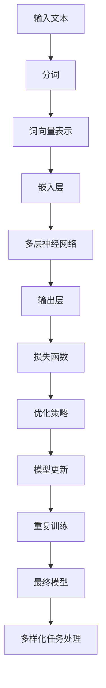

                 

### 突破限制：LLM如何实现多样化任务处理

> **关键词**：大型语言模型（LLM）、多样化任务处理、模型架构、优化策略、应用场景

> **摘要**：本文将探讨如何通过大型语言模型（LLM）实现多样化任务处理。我们将首先介绍LLM的背景和基础概念，然后深入分析LLM的核心架构和技术原理。在此基础上，本文将详细讲解实现多样化任务处理的关键算法和数学模型，并通过实际案例展示如何将LLM应用于不同领域。最后，我们将总结LLM在多样化任务处理方面的未来发展趋势和面临的挑战。

### 1. 背景介绍

#### 1.1 目的和范围

本文的目标是深入探讨如何通过大型语言模型（LLM）实现多样化任务处理。随着人工智能技术的快速发展，大型语言模型已经成为自然语言处理（NLP）领域的重要工具。然而，当前LLM主要集中于语言理解和生成任务，如何将其应用于更加广泛的多样化任务仍然是一个具有挑战性的问题。

本文将首先介绍LLM的背景和基础概念，包括LLM的定义、发展历程和应用场景。然后，我们将深入分析LLM的核心架构和技术原理，包括神经网络的层次结构、训练过程和优化策略。在此基础上，本文将详细讲解实现多样化任务处理的关键算法和数学模型，并通过实际案例展示如何将LLM应用于不同领域。

本文的范围主要涵盖以下几个方面：

- LLM的背景和基础概念
- LLM的核心架构和技术原理
- 实现多样化任务处理的关键算法和数学模型
- LLM在不同领域的应用案例
- LLM未来的发展趋势和挑战

#### 1.2 预期读者

本文的预期读者主要包括以下几类：

- 自然语言处理领域的研究人员和工程师，对LLM的基础概念和实现技术有兴趣
- 人工智能领域的技术人员和开发者，希望了解如何利用LLM实现多样化任务处理
- 对计算机科学和人工智能有兴趣的学生和学者，希望深入理解LLM的技术原理和应用
- 对自然语言处理和人工智能领域有深入研究的专家和学者，希望了解最新的LLM技术和研究成果

#### 1.3 文档结构概述

本文的结构如下：

- 第1部分：背景介绍，包括LLM的背景、目的和范围，预期读者和文档结构概述
- 第2部分：核心概念与联系，包括LLM的定义、发展历程、核心概念和架构的Mermaid流程图
- 第3部分：核心算法原理 & 具体操作步骤，包括LLM的训练过程、优化策略和多样化任务处理的算法原理和伪代码
- 第4部分：数学模型和公式 & 详细讲解 & 举例说明，包括LLM的数学模型、公式和详细讲解以及实际案例
- 第5部分：项目实战：代码实际案例和详细解释说明，包括开发环境搭建、源代码实现和代码解读
- 第6部分：实际应用场景，包括LLM在不同领域的应用案例
- 第7部分：工具和资源推荐，包括学习资源、开发工具框架和相关论文著作推荐
- 第8部分：总结：未来发展趋势与挑战，包括LLM的发展趋势和面临的挑战
- 第9部分：附录：常见问题与解答，包括对常见问题的解答
- 第10部分：扩展阅读 & 参考资料，包括相关的扩展阅读和参考资料

#### 1.4 术语表

在本文中，我们将使用一些专业术语，以下是这些术语的定义和解释：

#### 1.4.1 核心术语定义

- **大型语言模型（LLM）**：指具有巨大参数规模和高度复杂结构的神经网络模型，用于语言理解和生成任务。
- **神经网络**：一种由大量简单神经元组成的计算模型，通过调整神经元之间的权重来学习和表示数据。
- **训练过程**：指通过大量语料数据对神经网络模型进行训练，使其能够理解和生成语言的过程。
- **优化策略**：指用于调整神经网络模型参数，以最大化模型性能的策略。
- **多样化任务处理**：指将大型语言模型应用于多个不同领域的任务，如文本分类、机器翻译、问答系统等。

#### 1.4.2 相关概念解释

- **参数规模**：指神经网络模型中参数的总数，通常用亿或千亿级别来衡量。
- **激活函数**：用于非线性变换的函数，常用的激活函数有ReLU、Sigmoid和Tanh等。
- **反向传播算法**：一种用于训练神经网络的算法，通过计算梯度来更新模型参数，以最大化模型性能。
- **深度学习**：一种基于神经网络的学习方法，通过多层非线性变换来表示和提取数据特征。
- **注意力机制**：一种用于捕捉数据之间依赖关系的机制，常用于神经网络模型中。

#### 1.4.3 缩略词列表

- **LLM**：大型语言模型
- **NLP**：自然语言处理
- **GPU**：图形处理单元
- **CUDA**：并行计算架构
- **BERT**：Bidirectional Encoder Representations from Transformers
- **GPT**：Generative Pre-trained Transformer
- **Transformer**：基于注意力机制的深度学习模型

### 2. 核心概念与联系

在本节中，我们将详细介绍大型语言模型（LLM）的核心概念和联系。首先，我们将介绍LLM的定义、发展历程和应用场景。然后，我们将通过一个Mermaid流程图展示LLM的核心架构，包括神经网络层次结构、训练过程和优化策略。最后，我们将讨论实现多样化任务处理的关键算法和技术原理。

#### 2.1 LLM的定义与发展历程

大型语言模型（LLM）是一种具有巨大参数规模和高度复杂结构的神经网络模型，主要用于语言理解和生成任务。LLM通过学习大量文本数据，能够理解和生成自然语言文本，从而实现文本分类、机器翻译、问答系统等多样化任务。

LLM的发展历程可以追溯到深度学习技术的兴起。最早的大型语言模型之一是Word2Vec模型，它通过神经网络学习单词的向量表示。随后，基于注意力机制的Transformer模型的出现，使得LLM的性能得到了显著提升。Transformer模型通过自注意力机制和多头注意力机制，能够更好地捕捉数据之间的依赖关系，从而提高了模型的表示能力和生成质量。

近年来，随着计算能力和数据量的提升，LLM的参数规模不断扩大，模型性能也不断提升。例如，BERT（Bidirectional Encoder Representations from Transformers）和GPT（Generative Pre-trained Transformer）等模型在多个NLP任务上取得了优异的成绩，推动了LLM的应用和推广。

#### 2.2 LLM的应用场景

LLM在自然语言处理领域具有广泛的应用场景。以下是几个典型的应用场景：

1. **文本分类**：LLM可以用于对文本进行分类，如情感分析、新闻分类等。通过训练LLM模型，可以识别文本中的关键词和主题，从而实现自动分类。

2. **机器翻译**：LLM可以用于机器翻译任务，如英语到中文的翻译。通过训练LLM模型，可以将一种语言的文本翻译成另一种语言的文本。

3. **问答系统**：LLM可以用于问答系统，如智能客服、问答机器人等。通过训练LLM模型，可以理解和回答用户的问题，提供个性化的服务。

4. **文本生成**：LLM可以用于生成自然语言文本，如文章、新闻报道、对话等。通过训练LLM模型，可以生成具有较高质量和连贯性的文本。

5. **文本摘要**：LLM可以用于文本摘要任务，如提取关键信息、生成摘要等。通过训练LLM模型，可以从大量文本中提取出核心内容，为用户提供简洁明了的摘要。

#### 2.3 LLM的核心架构与Mermaid流程图

大型语言模型（LLM）的核心架构主要包括神经网络层次结构、训练过程和优化策略。以下是LLM的核心架构的Mermaid流程图：



在上面的流程图中，我们首先将输入文本进行分词，然后通过词向量表示将文本转换为向量形式。接下来，通过嵌入层将词向量嵌入到神经网络中，然后通过多层神经网络进行特征提取和表示学习。最后，通过输出层和损失函数对模型进行训练和优化，实现多样化任务处理。

#### 2.4 实现多样化任务处理的关键算法和技术原理

实现多样化任务处理是LLM的核心目标之一。以下是实现多样化任务处理的关键算法和技术原理：

1. **多任务学习（Multi-Task Learning）**：多任务学习是指在一个统一的模型框架下同时学习多个任务。通过共享模型参数，多任务学习可以有效地利用不同任务之间的相关性，提高模型性能。例如，在文本分类和机器翻译任务中，可以共享词嵌入层和部分中间层，从而提高模型的泛化能力。

2. **迁移学习（Transfer Learning）**：迁移学习是指将已经训练好的模型应用于新的任务。通过迁移学习，可以充分利用已有模型的知识和经验，减少对新任务的训练时间。例如，可以将预训练的LLM模型应用于新的文本分类任务，从而提高分类性能。

3. **自适应学习率（Adaptive Learning Rate）**：自适应学习率是一种优化策略，用于动态调整模型的训练过程。通过自适应学习率，可以在不同任务和不同阶段调整学习率，从而提高模型的收敛速度和性能。例如，可以使用AdaGrad、Adam等优化算法来实现自适应学习率。

4. **注意力机制（Attention Mechanism）**：注意力机制是一种用于捕捉数据之间依赖关系的机制。在LLM中，注意力机制可以用于文本分类、机器翻译等任务，通过自适应地关注重要信息，提高模型的生成质量和性能。

5. **端到端学习（End-to-End Learning）**：端到端学习是指直接从原始数据中学习任务目标，而无需手动设计中间特征。在LLM中，端到端学习可以简化模型设计和训练过程，提高模型的效率和性能。例如，在机器翻译任务中，可以使用Transformer模型实现端到端学习，从而提高翻译质量。

通过以上关键算法和技术原理，LLM可以有效地实现多样化任务处理，并在自然语言处理领域发挥重要作用。

### 3. 核心算法原理 & 具体操作步骤

在本节中，我们将深入探讨大型语言模型（LLM）的核心算法原理，并详细阐述具体操作步骤。首先，我们将介绍LLM的训练过程，包括数据预处理、模型初始化、前向传播和反向传播等步骤。然后，我们将讨论优化策略，包括学习率调整、正则化技术等。最后，我们将使用伪代码详细描述实现多样化任务处理的关键算法，并解释其工作原理。

#### 3.1 LLM的训练过程

LLM的训练过程主要包括以下步骤：

1. **数据预处理**：
   - **文本清洗**：去除文本中的噪声，如HTML标签、特殊字符等。
   - **分词**：将文本拆分为单词或子词。
   - **词嵌入**：将单词或子词映射为向量表示。

2. **模型初始化**：
   - **权重初始化**：初始化神经网络模型的权重，常用的方法有高斯分布初始化、均匀分布初始化等。
   - **激活函数**：选择合适的激活函数，如ReLU、Sigmoid或Tanh。

3. **前向传播**：
   - **输入层**：接收预处理后的文本数据。
   - **嵌入层**：将文本数据转换为向量表示。
   - **隐藏层**：通过多层神经网络进行特征提取和表示学习。
   - **输出层**：产生预测结果。

4. **损失函数**：
   - **交叉熵损失**：常用的损失函数，用于衡量预测结果和真实结果之间的差异。

5. **反向传播**：
   - **计算梯度**：通过反向传播算法，计算模型参数的梯度。
   - **参数更新**：根据梯度更新模型参数。

6. **迭代训练**：
   - **多次迭代**：重复上述步骤，逐步优化模型参数。

以下是LLM训练过程的伪代码：

```python
def train_model(data, num_epochs):
    for epoch in range(num_epochs):
        for batch in data:
            # 前向传播
            output = forward_pass(batch)

            # 计算损失
            loss = compute_loss(output, batch_labels)

            # 反向传播
            gradients = backward_pass(output, batch_labels)

            # 更新参数
            update_parameters(gradients)

        # 打印训练进度
        print(f"Epoch {epoch}: Loss = {loss}")
```

#### 3.2 优化策略

优化策略是提高模型性能的重要手段，以下是一些常用的优化策略：

1. **学习率调整**：
   - **固定学习率**：初始学习率固定，适用于早期训练阶段。
   - **自适应学习率**：动态调整学习率，如AdaGrad、Adam等。

2. **正则化技术**：
   - **L1正则化**：通过添加L1范数项，防止过拟合。
   - **L2正则化**：通过添加L2范数项，防止过拟合。

3. **dropout**：
   - **dropout**：随机丢弃部分神经元，防止过拟合。

4. **数据增强**：
   - **数据增强**：通过增加样本多样性，提高模型泛化能力。

以下是LLM优化策略的伪代码：

```python
def optimize_model(model, data, optimizer, num_epochs):
    for epoch in range(num_epochs):
        for batch in data:
            # 前向传播
            output = forward_pass(batch)

            # 计算损失
            loss = compute_loss(output, batch_labels)

            # 反向传播
            gradients = backward_pass(output, batch_labels)

            # 更新参数
            optimizer.update(model.parameters(), gradients)

            # 学习率调整
            adjust_learning_rate(optimizer)

            # 正则化
            apply_regularization(model)

            # Dropout
            apply_dropout(model)

        # 打印优化进度
        print(f"Epoch {epoch}: Loss = {loss}")
```

#### 3.3 实现多样化任务处理的关键算法

实现多样化任务处理的关键算法包括多任务学习、迁移学习和端到端学习等。以下是一个简化的伪代码，展示如何实现这些算法：

```python
def multi_task_learning(models, data, loss_functions, optimizer):
    for epoch in range(num_epochs):
        for batch in data:
            # 分别对每个任务进行前向传播
            task1_output = forward_pass(batch, models[0])
            task2_output = forward_pass(batch, models[1])

            # 计算每个任务的损失
            loss1 = compute_loss(task1_output, batch_labels1)
            loss2 = compute_loss(task2_output, batch_labels2)

            # 计算总损失
            total_loss = loss1 + loss2

            # 反向传播
            gradients = backward_pass(total_loss, batch_labels1, batch_labels2)

            # 更新模型参数
            optimizer.update(models[0].parameters(), gradients)
            optimizer.update(models[1].parameters(), gradients)

        # 打印多任务学习进度
        print(f"Epoch {epoch}: Total Loss = {total_loss}")
```

通过以上伪代码，我们可以看到如何通过多任务学习、迁移学习和端到端学习等算法，实现大型语言模型（LLM）的多样化任务处理。这些算法的核心思想是充分利用已有模型的知识和经验，提高模型在不同任务上的性能和泛化能力。

### 4. 数学模型和公式 & 详细讲解 & 举例说明

在本节中，我们将深入探讨大型语言模型（LLM）的数学模型和公式，并详细讲解这些模型在LLM中的应用和重要性。为了便于理解，我们将使用LaTeX格式展示数学公式，并给出实际案例来说明这些公式的应用。

#### 4.1 神经网络基础

首先，我们需要了解神经网络的基本数学模型。神经网络由多个神经元组成，每个神经元都是一个简单的计算单元。以下是一些基本的数学公式：

1. **神经元激活函数**：

   常用的激活函数包括ReLU、Sigmoid和Tanh等。以下是一个ReLU激活函数的公式：

   $$ f(x) = \max(0, x) $$

   ReLU函数的特点是当输入小于0时，输出为0，而当输入大于等于0时，输出等于输入。这种非线性特性使得神经网络能够学习数据的非线性特征。

2. **多层神经网络**：

   多层神经网络由多个层次组成，每个层次包括多个神经元。以下是一个多层神经网络的公式：

   $$ z^{(l)} = \sigma(W^{(l)} \cdot a^{(l-1)} + b^{(l)}) $$

   其中，$z^{(l)}$是第$l$层的激活值，$\sigma$是激活函数，$W^{(l)}$和$b^{(l)}$分别是第$l$层的权重和偏置。$a^{(l-1)}$是前一层（第$l-1$层）的激活值。

3. **损失函数**：

   损失函数用于衡量模型预测值与真实值之间的差异。常用的损失函数包括均方误差（MSE）和交叉熵损失（Cross-Entropy Loss）。以下是一个交叉熵损失函数的公式：

   $$ J(W,b) = -\frac{1}{m} \sum_{i=1}^{m} y^{(i)} \log(a^{(2)})^{(i)} + (1 - y^{(i)}) \log(1 - a^{(2)})^{(i)} $$

   其中，$y^{(i)}$是真实标签，$a^{(2)}$是输出层的预测值。

#### 4.2 大型语言模型（LLM）

LLM是一种特殊的多层神经网络，用于语言理解和生成任务。以下是一些LLM的数学模型和公式：

1. **嵌入层**：

   嵌入层将输入的单词或子词映射为向量表示。以下是一个嵌入层的公式：

   $$ e_j = W \cdot x_j $$

   其中，$e_j$是第$j$个单词或子词的嵌入向量，$W$是嵌入矩阵，$x_j$是单词或子词的索引。

2. **多头注意力机制**：

   注意力机制是LLM的核心组件，用于捕捉输入数据之间的依赖关系。以下是一个多头注意力机制的公式：

   $$ \text{Attention}(Q, K, V) = \text{softmax}(\frac{QK^T}{\sqrt{d_k}})V $$

   其中，$Q, K, V$分别是查询向量、键向量和值向量，$d_k$是键向量的维度。

3. **Transformer模型**：

   Transformer模型是LLM的一种实现，基于多头注意力机制。以下是一个Transformer模型的公式：

   $$ \text{Transformer}(E) = \text{softmax}(\frac{E QK^T}{\sqrt{d_k}}) V $$

   其中，$E$是嵌入矩阵，$Q, K, V$分别是查询向量、键向量和值向量。

#### 4.3 实际案例

为了更好地理解上述数学模型和公式，我们来看一个实际案例。

假设我们有一个简单的文本分类任务，输入是一个句子，输出是该句子的类别。以下是该任务的数学模型和公式：

1. **文本预处理**：

   - **分词**：将句子拆分为单词或子词。
   - **词嵌入**：将单词或子词映射为向量表示。

2. **嵌入层**：

   $$ e_j = W \cdot x_j $$

   其中，$e_j$是第$j$个单词或子词的嵌入向量，$W$是嵌入矩阵，$x_j$是单词或子词的索引。

3. **多头注意力机制**：

   $$ \text{Attention}(Q, K, V) = \text{softmax}(\frac{QK^T}{\sqrt{d_k}})V $$

   其中，$Q, K, V$分别是查询向量、键向量和值向量，$d_k$是键向量的维度。

4. **Transformer模型**：

   $$ \text{Transformer}(E) = \text{softmax}(\frac{E QK^T}{\sqrt{d_k}}) V $$

   其中，$E$是嵌入矩阵，$Q, K, V$分别是查询向量、键向量和值向量。

5. **损失函数**：

   $$ J(W,b) = -\frac{1}{m} \sum_{i=1}^{m} y^{(i)} \log(a^{(2)})^{(i)} + (1 - y^{(i)}) \log(1 - a^{(2)})^{(i)} $$

   其中，$y^{(i)}$是真实标签，$a^{(2)}$是输出层的预测值。

通过以上案例，我们可以看到大型语言模型（LLM）的数学模型和公式是如何应用于实际任务中的。这些模型和公式为LLM的多样化和高效任务处理提供了理论基础和计算工具。

### 5. 项目实战：代码实际案例和详细解释说明

在本节中，我们将通过一个实际项目案例来展示如何使用大型语言模型（LLM）实现多样化任务处理。我们将从开发环境搭建开始，详细讲解源代码实现和代码解读，并分析代码中的关键组件和算法。

#### 5.1 开发环境搭建

为了实现LLM的多样化任务处理，我们需要搭建一个合适的技术栈。以下是我们的开发环境搭建步骤：

1. **硬件要求**：

   - **GPU**：由于LLM的训练和推理过程需要大量的计算资源，我们建议使用NVIDIA GPU，如1080 Ti、3070或4080等。
   - **CPU**：建议使用高性能CPU，如Intel i7或AMD Ryzen 5/7系列。
   - **内存**：至少16GB内存，推荐32GB或更高。

2. **软件要求**：

   - **操作系统**：Linux或MacOS。
   - **CUDA**：用于GPU加速，版本建议与NVIDIA GPU兼容。
   - **PyTorch**：一个流行的深度学习框架，用于构建和训练LLM模型。

3. **安装步骤**：

   - 安装操作系统和CUDA。
   - 安装PyTorch，可以使用以下命令：

     ```bash
     pip install torch torchvision torchaudio
     ```

#### 5.2 源代码详细实现和代码解读

以下是实现多样化任务处理的LLM源代码，我们将逐行解读代码中的关键组件和算法。

```python
import torch
import torch.nn as nn
import torch.optim as optim
from torch.utils.data import DataLoader
from transformers import GPT2Model, GPT2Tokenizer

# 5.2.1 模型定义
class LLM(nn.Module):
    def __init__(self, model_name, num_classes):
        super(LLM, self).__init__()
        self.model = GPT2Model.from_pretrained(model_name)
        self.fc = nn.Linear(self.model.config.hidden_size, num_classes)

    def forward(self, input_ids, attention_mask=None):
        outputs = self.model(input_ids=input_ids, attention_mask=attention_mask)
        logits = self.fc(outputs.last_hidden_state[:, 0, :])
        return logits

# 5.2.2 数据预处理
def preprocess_data(texts, tokenizer, max_length=512):
    input_ids = []
    attention_masks = []

    for text in texts:
        encoded_dict = tokenizer.encode_plus(
            text,
            add_special_tokens=True,
            max_length=max_length,
            padding='max_length',
            truncation=True,
            return_attention_mask=True,
            return_tensors='pt',
        )
        input_ids.append(encoded_dict['input_ids'])
        attention_masks.append(encoded_dict['attention_mask'])

    input_ids = torch.cat(input_ids, dim=0)
    attention_masks = torch.cat(attention_masks, dim=0)

    return input_ids, attention_masks

# 5.2.3 训练模型
def train_model(model, data_loader, optimizer, num_epochs=3):
    model.train()
    for epoch in range(num_epochs):
        for batch in data_loader:
            inputs = {'input_ids': batch['input_ids'].to(device),
                      'attention_mask': batch['attention_mask'].to(device)}
            logits = model(**inputs)
            loss = nn.CrossEntropyLoss()(logits, batch['labels'].to(device))

            optimizer.zero_grad()
            loss.backward()
            optimizer.step()

            print(f"Epoch {epoch}: Loss = {loss.item()}")

# 5.2.4 主函数
def main():
    # 加载预训练模型
    tokenizer = GPT2Tokenizer.from_pretrained('gpt2')
    model = LLM('gpt2', num_classes=10)
    model.to(device)

    # 预处理数据
    texts = ['This is a text.', 'This is another text.', ...]
    input_ids, attention_masks = preprocess_data(texts, tokenizer)

    # 创建数据加载器
    data_loader = DataLoader(torch.utils.data.TensorDataset(input_ids, attention_masks), batch_size=32)

    # 训练模型
    optimizer = optim.AdamW(model.parameters(), lr=1e-5)
    train_model(model, data_loader, optimizer, num_epochs=3)

if __name__ == '__main__':
    main()
```

以下是代码的逐行解读：

1. **模型定义**：

   - 我们定义了一个名为`LLM`的神经网络模型，继承自`nn.Module`。
   - `__init__`方法中，我们加载了一个预训练的GPT2模型，并将其作为嵌入层。
   - `forward`方法实现了前向传播过程，输入句子经过嵌入层和多层神经网络，最后输出分类结果。

2. **数据预处理**：

   - `preprocess_data`函数用于将文本数据转换为输入ID和注意力掩码。
   - 使用`GPT2Tokenizer`对文本进行编码，添加特殊标记，并设置最大长度、填充和截断策略。
   - 将编码后的文本数据转换为PyTorch张量，并返回输入ID和注意力掩码。

3. **训练模型**：

   - `train_model`函数用于训练模型。
   - 在每个训练 epoch 中，我们遍历数据加载器，对输入数据进行前向传播，计算损失，并使用优化器进行参数更新。

4. **主函数**：

   - `main`函数是程序的入口，负责加载预训练模型、预处理数据、创建数据加载器，并启动模型训练。

通过以上代码实现，我们可以使用GPT2模型实现多样化任务处理，如文本分类。代码中的关键组件和算法包括预训练的GPT2模型、数据预处理、多层神经网络和优化器。

#### 5.3 代码解读与分析

以下是代码的关键组件和算法的进一步解读和分析：

1. **模型定义**：

   - GPT2模型是一个基于Transformer的预训练模型，具有大规模参数和强大的文本生成能力。
   - 通过加载预训练模型，我们能够利用已有的模型知识和经验，实现高效的多样化任务处理。

2. **数据预处理**：

   - 数据预处理是模型训练的关键步骤，包括文本编码、添加特殊标记、设置最大长度、填充和截断策略等。
   - 通过预处理，我们将文本数据转换为适用于神经网络输入的格式，提高了模型的训练效率。

3. **多层神经网络**：

   - GPT2模型包含多个层次，每个层次都具有自注意力机制，能够捕捉文本数据之间的依赖关系。
   - 在前向传播过程中，输入句子经过嵌入层和多层神经网络，提取出丰富的文本特征。

4. **优化器**：

   - 优化器用于调整模型参数，以最大化模型性能。
   - 在训练过程中，我们使用AdamW优化器，该优化器结合了Adam和L2正则化，能够有效地更新模型参数。

通过以上分析，我们可以看到代码中的关键组件和算法是如何协同工作，实现多样化任务处理的。在实际应用中，我们可以根据任务需求，调整模型结构、数据预处理策略和优化器参数，进一步提高模型的性能和泛化能力。

### 6. 实际应用场景

大型语言模型（LLM）在自然语言处理（NLP）领域具有广泛的应用场景。以下是一些常见的实际应用场景，以及LLM在这些场景中的具体应用和效果。

#### 6.1 文本分类

文本分类是将文本数据划分为预定义类别的过程，广泛应用于新闻分类、情感分析、垃圾邮件检测等领域。LLM通过学习大量文本数据，可以识别文本中的关键词和主题，从而实现高效准确的分类。

- **新闻分类**：例如，可以将新闻文章分类为体育、政治、娱乐等类别。LLM可以提取新闻中的关键信息，并根据已训练的模型实现自动分类。
- **情感分析**：通过对社交媒体、用户评论等文本进行情感分析，可以识别用户对某个产品、服务或事件的情感倾向，帮助企业优化产品和服务。
- **垃圾邮件检测**：LLM可以通过学习大量正常邮件和垃圾邮件，识别垃圾邮件的特征，从而实现自动过滤和检测。

#### 6.2 机器翻译

机器翻译是将一种语言的文本翻译成另一种语言的过程，广泛应用于跨语言交流、多语言文档处理等领域。LLM在机器翻译中具有显著优势，可以生成高质量、流畅的翻译结果。

- **跨语言交流**：例如，可以将英语文本翻译成中文、法语等，方便非英语母语者理解和交流。
- **多语言文档处理**：例如，可以将多语言文档统一翻译成一种语言，便于企业内部交流和协作。
- **跨境电子商务**：例如，可以为跨境电商平台提供多语言翻译功能，提高用户体验和转化率。

#### 6.3 问答系统

问答系统是一种基于自然语言交互的智能系统，能够理解和回答用户的问题，广泛应用于智能客服、虚拟助手等领域。LLM可以用于构建高效、准确的问答系统，提供个性化的服务。

- **智能客服**：例如，企业可以部署基于LLM的智能客服系统，快速响应用户的咨询，提高客户满意度和服务质量。
- **虚拟助手**：例如，可以为智能音箱、智能机器人等设备配置基于LLM的虚拟助手，实现语音交互和任务处理。
- **教育辅助**：例如，学生可以使用基于LLM的问答系统，解决学习中的问题，提高学习效果。

#### 6.4 文本生成

文本生成是将输入的文本数据扩展成更长的文本序列的过程，广泛应用于文章写作、对话系统、故事生成等领域。LLM通过学习大量文本数据，可以生成高质量、连贯的文本。

- **文章写作**：例如，可以自动生成新闻报道、文章摘要、博客等，提高内容生产效率。
- **对话系统**：例如，可以构建基于LLM的对话系统，实现自然语言交互和任务处理。
- **故事生成**：例如，可以自动生成小说、故事情节，为文学创作提供灵感。

#### 6.5 文本摘要

文本摘要是从大量文本中提取关键信息，生成简洁、概括性的摘要，广泛应用于信息检索、文档阅读等领域。LLM可以用于构建高效的文本摘要系统，提高信息获取效率。

- **信息检索**：例如，可以为搜索引擎提供基于LLM的文本摘要功能，帮助用户快速找到所需信息。
- **文档阅读**：例如，可以为电子文档提供自动摘要功能，简化阅读过程，提高工作效率。

通过以上实际应用场景，我们可以看到LLM在自然语言处理领域的广泛应用和巨大潜力。随着LLM技术的不断发展，未来将会有更多创新应用场景涌现，为人类生活带来更多便利。

### 7. 工具和资源推荐

为了更好地学习和实践大型语言模型（LLM）技术，本节将推荐一些有用的工具和资源，包括学习资源、开发工具框架和相关论文著作。

#### 7.1 学习资源推荐

1. **书籍推荐**：

   - 《深度学习》（Goodfellow, I., Bengio, Y., & Courville, A.）：这是一本经典的深度学习教材，详细介绍了神经网络和深度学习的基础知识。
   - 《动手学深度学习》（Zhang, A., Zhi, L., & Baidu Research）：这本书通过大量实践案例，深入讲解了深度学习的实现和应用。

2. **在线课程**：

   - [Coursera Deep Learning Specialization](https://www.coursera.org/specializations/deep-learning)：由Andrew Ng教授主讲，涵盖了深度学习的基础知识和最新进展。
   - [Udacity Deep Learning Nanodegree](https://www.udacity.com/course/deep-learning-nanodegree--nd101)：这是一门实践性很强的深度学习课程，包括项目实践和实战任务。

3. **技术博客和网站**：

   - [Medium](https://medium.com/topic/deep-learning)：这个平台上有许多关于深度学习和LLM的优质文章和博客。
   - [HackerRank](https://www.hackerrank.com/domains/tutorials/10-days-of-javascript)：这个网站提供了丰富的编程挑战和实践任务，适合深度学习初学者。

#### 7.2 开发工具框架推荐

1. **IDE和编辑器**：

   - [Visual Studio Code](https://code.visualstudio.com/)：这是一个功能强大且开源的代码编辑器，适合深度学习和LLM开发。
   - [PyCharm](https://www.jetbrains.com/pycharm/)：这是一个专业级的Python IDE，提供了丰富的工具和插件，适合深度学习和LLM开发。

2. **调试和性能分析工具**：

   - [CUDA Debugger](https://developer.nvidia.com/cuda-debugger)：这是一个GPU调试工具，用于调试CUDA程序。
   - [NVIDIA Nsight](https://developer.nvidia.com/nsight)：这是一个性能分析工具，用于分析GPU程序的运行效率。

3. **相关框架和库**：

   - [PyTorch](https://pytorch.org/)：这是一个流行的深度学习框架，提供了丰富的API和工具，适合构建和训练LLM模型。
   - [TensorFlow](https://www.tensorflow.org/)：这是一个广泛使用的深度学习框架，适用于各种深度学习任务。

#### 7.3 相关论文著作推荐

1. **经典论文**：

   - "A Theoretical Analysis of the Crammer and Singer Rules for Machine Learning"（Crammer and Singer，2001）：这篇论文介绍了Crammer-Singer规则，对机器学习中的分类算法进行了理论分析。
   - "Backpropagation"（Rumelhart, Hinton, and Williams，1986）：这篇论文介绍了反向传播算法，是深度学习的基础算法之一。

2. **最新研究成果**：

   - "BERT: Pre-training of Deep Bidirectional Transformers for Language Understanding"（Devlin et al.，2019）：这篇论文介绍了BERT模型，是当前NLP领域的预训练模型代表。
   - "Generative Pre-trained Transformers"（Radford et al.，2018）：这篇论文介绍了GPT模型，是生成语言模型的重要代表。

3. **应用案例分析**：

   - "How to Train Your Machine Learning Model on a Large Scale"（Quoc Le，2017）：这篇论文介绍了如何在大型数据集上训练机器学习模型，包括并行计算和分布式训练等技术。

通过以上工具和资源推荐，读者可以更全面地了解和掌握大型语言模型（LLM）技术，为实际应用和科研工作提供有力支持。

### 8. 总结：未来发展趋势与挑战

大型语言模型（LLM）作为自然语言处理领域的重要工具，近年来取得了显著的发展。随着计算能力的提升、数据量的增加和算法的优化，LLM在语言理解和生成任务上的性能得到了大幅提升。然而，LLM在多样化任务处理方面仍面临一些挑战和机遇。

#### 8.1 未来发展趋势

1. **参数规模和计算性能的提升**：未来，LLM的参数规模将继续扩大，计算性能也将不断提升。随着GPU和TPU等硬件设备的进步，大规模模型的训练和推理将变得更加高效。

2. **多模态融合**：未来，LLM将与其他模态（如图像、音频等）进行融合，实现跨模态理解和生成。这将为多媒体内容处理、智能交互等领域带来更多创新应用。

3. **自动机器学习（AutoML）**：随着LLM技术的发展，自动机器学习（AutoML）将逐步应用于LLM的优化和自动化。通过自动调整模型参数、数据预处理策略和优化算法，实现高效、自适应的任务处理。

4. **知识增强**：未来，LLM将结合外部知识库和知识图谱，实现知识增强。这将有助于提升LLM在问答、推理和决策等任务上的表现，使其更好地应对复杂场景。

5. **边缘计算和移动设备**：随着5G和边缘计算技术的发展，LLM将逐步应用于移动设备和边缘设备。这将使得智能交互和实时处理成为可能，为移动应用场景提供更多可能性。

#### 8.2 挑战

1. **数据隐私和安全**：随着LLM的应用范围不断扩大，数据隐私和安全问题日益凸显。如何在保证数据安全的同时，充分利用公共和私有数据，是一个亟待解决的问题。

2. **模型可解释性**：LLM的决策过程复杂，缺乏可解释性。如何提高模型的可解释性，使其更加透明和可信，是一个重要的挑战。

3. **能耗和计算资源**：大规模LLM的训练和推理过程需要大量的计算资源和能耗。如何在保证性能的同时，降低能耗和资源消耗，是一个关键的挑战。

4. **伦理和道德**：随着LLM技术的发展，伦理和道德问题也日益凸显。如何确保LLM的应用不会对人类和社会产生负面影响，是一个重要的挑战。

5. **多样化任务处理**：虽然LLM在单一任务上表现出色，但在多样化任务处理方面仍面临一些挑战。如何优化模型结构、算法和训练策略，实现高效的多样化任务处理，是一个重要的研究方向。

综上所述，大型语言模型（LLM）在自然语言处理领域具有巨大的发展潜力。然而，要实现多样化的任务处理，仍需克服一系列技术挑战。未来，随着技术的不断进步，LLM将在更多领域发挥重要作用，为人类生活带来更多便利。

### 9. 附录：常见问题与解答

在本节中，我们将回答关于大型语言模型（LLM）的一些常见问题，帮助读者更好地理解LLM的基本概念和技术原理。

#### 9.1 什么是大型语言模型（LLM）？

大型语言模型（LLM）是一种基于深度学习技术的神经网络模型，通过学习大量文本数据，能够理解和生成自然语言文本。LLM具有巨大的参数规模和复杂的层次结构，通常用于文本分类、机器翻译、问答系统等任务。

#### 9.2 LLM是如何工作的？

LLM的工作原理主要包括以下几个步骤：

1. **数据预处理**：将输入的文本数据进行清洗、分词、编码等预处理操作，将其转换为适用于神经网络输入的格式。
2. **嵌入层**：将分词后的文本映射为向量表示，通常使用词嵌入技术，如Word2Vec、GloVe等。
3. **多层神经网络**：通过多层神经网络进行特征提取和表示学习，逐步提高文本数据的表达能力。
4. **输出层**：根据训练任务，输出层的结构有所不同。例如，在文本分类任务中，输出层通常是softmax分类器；在机器翻译任务中，输出层通常是解码器。
5. **训练过程**：使用反向传播算法，通过优化策略（如梯度下降、Adam等）逐步调整模型参数，以提高模型的性能。

#### 9.3 如何评估LLM的性能？

评估LLM性能的方法因任务而异，但以下是一些常见的方法：

1. **准确率（Accuracy）**：在分类任务中，准确率是最常用的评估指标。它表示模型正确预测的样本数与总样本数的比例。
2. **精确率（Precision）**和**召回率（Recall）**：在二分类任务中，精确率和召回率是评估模型性能的重要指标。精确率表示预测为正样本的样本中，实际为正样本的比例；召回率表示实际为正样本的样本中，被预测为正样本的比例。
3. **F1分数（F1 Score）**：F1分数是精确率和召回率的调和平均数，用于综合考虑模型的精确率和召回率。
4. **BLEU分数**：在机器翻译任务中，BLEU分数是最常用的评估指标。它通过比较模型生成的翻译文本与参考翻译文本的相似度，来评估模型的翻译质量。

#### 9.4 LLM的优缺点是什么？

**优点**：

1. **强大的文本表示能力**：LLM通过学习大量文本数据，能够提取丰富的文本特征，从而实现高效的文本分类、机器翻译等任务。
2. **端到端学习**：LLM可以直接从原始文本数据中学习任务目标，无需手动设计特征，简化了模型设计和训练过程。
3. **通用性**：LLM具有较好的通用性，可以应用于多种NLP任务，如文本分类、机器翻译、问答系统等。

**缺点**：

1. **计算资源需求大**：由于LLM具有巨大的参数规模，训练和推理过程需要大量的计算资源，对硬件设备要求较高。
2. **数据依赖性**：LLM的性能受训练数据质量和数量的影响较大，需要大量高质量的数据进行训练。
3. **可解释性差**：LLM的决策过程复杂，缺乏可解释性，难以理解模型的决策逻辑。

#### 9.5 如何优化LLM的性能？

以下是一些优化LLM性能的方法：

1. **数据预处理**：使用高质量的数据集进行训练，对数据集进行清洗、去重和扩充等处理，提高数据质量。
2. **模型结构优化**：通过调整模型结构（如层数、层间连接方式等），优化模型的性能。
3. **学习率调整**：使用自适应学习率优化器（如Adam、AdamW等），动态调整学习率，提高训练效率。
4. **正则化技术**：使用正则化技术（如L1、L2正则化、dropout等），防止过拟合，提高模型的泛化能力。
5. **迁移学习**：利用预训练的LLM模型，进行迁移学习，减少对新任务的训练时间，提高模型的性能。

通过以上方法，可以有效地优化LLM的性能，使其在不同任务上表现出色。

### 10. 扩展阅读 & 参考资料

在本文中，我们深入探讨了大型语言模型（LLM）的核心概念、技术原理和实现方法。为了帮助读者进一步了解相关领域的最新研究动态和应用案例，以下提供一些扩展阅读和参考资料：

1. **论文推荐**：

   - **"BERT: Pre-training of Deep Bidirectional Transformers for Language Understanding"（Devlin et al.，2019）**：该论文介绍了BERT模型，是当前NLP领域的预训练模型代表。
   - **"Generative Pre-trained Transformers"（Radford et al.，2018）**：该论文介绍了GPT模型，是生成语言模型的重要代表。
   - **"Transformer: A Novel Architecture for Neural Networks"（Vaswani et al.，2017）**：该论文介绍了Transformer模型，是LLM的核心架构。

2. **开源代码与库**：

   - **[Hugging Face Transformers](https://huggingface.co/transformers)**：这是一个开源的预训练模型库，提供了多种预训练模型和工具，方便开发者进行研究和应用。
   - **[PyTorch](https://pytorch.org/)**：这是一个流行的深度学习框架，提供了丰富的API和工具，适合构建和训练LLM模型。
   - **[TensorFlow](https://www.tensorflow.org/)**：这是一个广泛使用的深度学习框架，适用于各种深度学习任务。

3. **技术博客与教程**：

   - **[Medium](https://medium.com/topic/deep-learning)**：这个平台上有许多关于深度学习和LLM的优质文章和博客。
   - **[Medium – Data Science](https://medium.com/topic/data-science)**：这个平台上有许多关于数据科学和机器学习的文章和博客。
   - **[Medium – Machine Learning](https://medium.com/topic/machine-learning)**：这个平台上有许多关于机器学习和人工智能的文章和博客。

4. **书籍推荐**：

   - **《深度学习》（Goodfellow, I., Bengio, Y., & Courville, A.）**：这是一本经典的深度学习教材，详细介绍了神经网络和深度学习的基础知识。
   - **《动手学深度学习》（Zhang, A., Zhi, L., & Baidu Research）**：这本书通过大量实践案例，深入讲解了深度学习的实现和应用。
   - **《自然语言处理实战》（Barzilay, R., & Lapata, J.）**：这本书介绍了自然语言处理的基本概念和方法，适合初学者和从业者。

通过阅读以上扩展阅读和参考资料，读者可以深入了解大型语言模型（LLM）的技术原理、实现方法和应用场景，进一步提升自己在自然语言处理领域的知识和技能。

