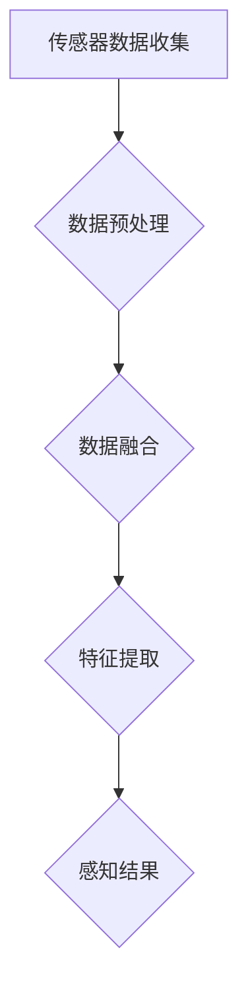
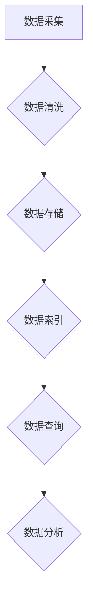
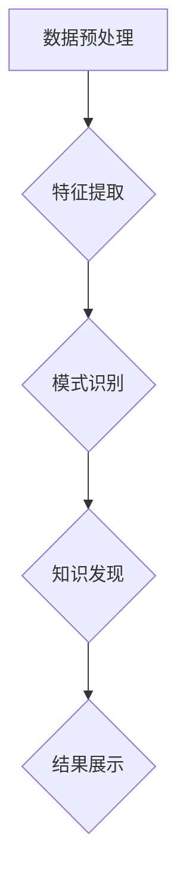
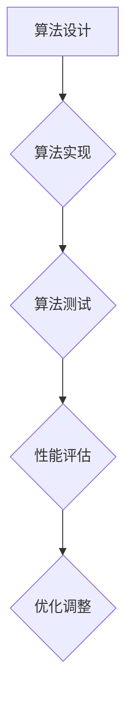
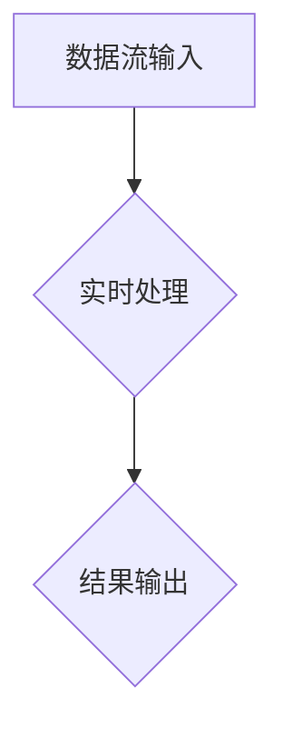

                 

# 端到端自动驾驶的云端数据管理与分析平台

> 关键词：自动驾驶、云端数据管理、分析平台、端到端、AI技术、数据挖掘、算法优化、实时处理、安全监控

> 摘要：本文将深入探讨端到端自动驾驶的云端数据管理与分析平台。首先，我们回顾自动驾驶技术的发展历程，然后详细阐述云端数据管理与分析平台的重要性。接着，我们将介绍核心概念与联系，深入分析核心算法原理与操作步骤，解释数学模型与公式，并提供实际项目实战代码案例。此外，本文还将探讨实际应用场景、工具和资源推荐，并总结未来发展趋势与挑战。最后，我们将提供常见问题与解答，并推荐扩展阅读与参考资料。

## 1. 背景介绍

### 1.1 目的和范围

本文的目的是探讨端到端自动驾驶的云端数据管理与分析平台，分析其技术原理、架构、应用场景以及未来发展趋势。本文将涵盖以下内容：

- 自动驾驶技术的发展历程及其在云端数据管理与分析平台中的应用。
- 云端数据管理与分析平台的核心概念与联系。
- 核心算法原理与操作步骤。
- 数学模型与公式及其详细讲解。
- 实际项目实战代码案例。
- 实际应用场景与工具资源推荐。

### 1.2 预期读者

本文面向以下读者：

- 对自动驾驶技术感兴趣的计算机科学和人工智能领域的研究者。
- 想要在自动驾驶领域开展技术研究和应用的开发者。
- 对云端数据管理与分析平台感兴趣的数据科学和大数据领域的研究者。
- 对算法优化和实时处理技术感兴趣的技术人员。

### 1.3 文档结构概述

本文结构如下：

1. 背景介绍
   - 目的和范围
   - 预期读者
   - 文档结构概述
   - 术语表

2. 核心概念与联系
   - 核心概念原理和架构的Mermaid流程图

3. 核心算法原理 & 具体操作步骤
   - 算法原理讲解
   - 操作步骤详细说明

4. 数学模型和公式 & 详细讲解 & 举例说明
   - 数学公式
   - 举例说明

5. 项目实战：代码实际案例和详细解释说明
   - 开发环境搭建
   - 源代码详细实现和代码解读
   - 代码解读与分析

6. 实际应用场景
   - 自动驾驶技术在各个领域的应用

7. 工具和资源推荐
   - 学习资源推荐
   - 开发工具框架推荐
   - 相关论文著作推荐

8. 总结：未来发展趋势与挑战

9. 附录：常见问题与解答

10. 扩展阅读 & 参考资料

### 1.4 术语表

#### 1.4.1 核心术语定义

- 自动驾驶：指通过计算机、传感器、控制系统等实现车辆自主行驶的技术。
- 云端数据管理与分析平台：指在云端环境中对自动驾驶车辆产生的海量数据进行管理、存储、分析和处理的技术架构。
- 端到端：指从输入到输出的全过程，包括数据采集、数据处理、模型训练、模型部署等各个环节。
- AI技术：指人工智能技术，包括机器学习、深度学习、自然语言处理等。
- 数据挖掘：指从大量数据中提取有价值的信息和知识的过程。
- 算法优化：指对算法进行改进，提高其性能和效率。
- 实时处理：指在短时间内对大量数据进行处理和分析的能力。

#### 1.4.2 相关概念解释

- 传感器融合：指将不同类型的传感器数据（如摄像头、激光雷达、GPS等）进行整合，以提高自动驾驶系统的感知准确性和鲁棒性。
- 云计算：指通过互联网将计算资源进行虚拟化，实现资源的弹性扩展和共享。
- 数据流处理：指对实时数据进行流式处理，实现数据的实时分析和挖掘。

#### 1.4.3 缩略词列表

- AI：人工智能
- DL：深度学习
- RL：强化学习
- GPS：全球定位系统
- SLAM：同时定位与地图构建
- DNN：深度神经网络
- CUDA：并行计算平台
- TensorFlow：开源深度学习框架

## 2. 核心概念与联系

在端到端自动驾驶的云端数据管理与分析平台中，核心概念包括传感器融合、云端数据管理、数据挖掘、算法优化和实时处理。这些概念相互关联，共同构成了整个技术架构。

### 2.1 传感器融合

传感器融合是自动驾驶系统的核心组件之一，它通过整合多种传感器数据（如摄像头、激光雷达、GPS等），实现对周围环境的全面感知。以下是传感器融合的Mermaid流程图：



### 2.2 云端数据管理

云端数据管理是指将自动驾驶车辆产生的海量数据存储、管理和分析的技术架构。以下是云端数据管理的Mermaid流程图：



### 2.3 数据挖掘

数据挖掘是指从大量数据中提取有价值的信息和知识的过程。在自动驾驶领域，数据挖掘可以帮助发现驾驶行为模式、优化路径规划、提高安全性能等。以下是数据挖掘的Mermaid流程图：



### 2.4 算法优化

算法优化是指通过对算法进行改进，提高其性能和效率。在自动驾驶领域，算法优化可以提升感知准确性、路径规划速度、决策能力等。以下是算法优化的Mermaid流程图：



### 2.5 实时处理

实时处理是指在短时间内对大量数据进行处理和分析的能力。在自动驾驶领域，实时处理可以确保车辆在复杂环境下的快速响应。以下是实时处理的Mermaid流程图：



通过以上核心概念与联系的分析，我们可以更好地理解端到端自动驾驶的云端数据管理与分析平台的工作原理和架构。

## 3. 核心算法原理 & 具体操作步骤

### 3.1 自动驾驶感知算法

自动驾驶感知算法是自动驾驶系统中最核心的部分，它负责从传感器数据中提取有用的信息，包括车辆的位置、速度、周围物体的位置和运动状态等。以下是一个基于深度学习的自动驾驶感知算法原理的伪代码：

```python
def autonomous_perception(sensor_data):
    # 数据预处理
    preprocessed_data = preprocess_data(sensor_data)

    # 特征提取
    features = extract_features(preprocessed_data)

    # 模型预测
    predictions = deep_learning_model.predict(features)

    # 后处理
    postprocessed_predictions = postprocess_predictions(predictions)

    return postprocessed_predictions

def preprocess_data(sensor_data):
    # 去除噪声、归一化、缩放等处理
    # ...
    return preprocessed_data

def extract_features(preprocessed_data):
    # 提取图像特征、雷达特征等
    # ...
    return features

def deep_learning_model:
    # 使用深度学习框架构建模型
    # ...
    return model

def postprocess_predictions(predictions):
    # 调整预测结果，包括置信度、目标类型等
    # ...
    return postprocessed_predictions
```

### 3.2 自动驾驶决策算法

自动驾驶决策算法负责根据感知算法提供的感知结果，生成车辆的行驶策略。以下是一个基于强化学习的自动驾驶决策算法原理的伪代码：

```python
def autonomous_decision(perception_results):
    # 状态编码
    state = encode_state(perception_results)

    # 计算动作值
    action_values = reinforcement_learning_model.predict(state)

    # 选择最优动作
    action = choose_best_action(action_values)

    return action

def encode_state(perception_results):
    # 编码感知结果，包括车辆位置、速度、目标物体位置等
    # ...
    return state

def reinforcement_learning_model:
    # 使用强化学习框架构建模型
    # ...
    return model

def choose_best_action(action_values):
    # 选择最大动作值作为最优动作
    # ...
    return action
```

### 3.3 自动驾驶控制算法

自动驾驶控制算法负责将决策算法生成的行驶策略转化为具体的控制指令，包括油门、刹车和转向等。以下是一个基于PID控制的自动驾驶控制算法原理的伪代码：

```python
def autonomous_control(control_command):
    # 控制油门、刹车和转向
    throttle = calculate_throttle(control_command)
    brake = calculate_brake(control_command)
    steering = calculate_steering(control_command)

    # 发送控制指令
    send_control_command(throttle, brake, steering)

def calculate_throttle(control_command):
    # 根据控制命令计算油门开度
    # ...
    return throttle

def calculate_brake(control_command):
    # 根据控制命令计算刹车力度
    # ...
    return brake

def calculate_steering(control_command):
    # 根据控制命令计算转向角度
    # ...
    return steering

def send_control_command(throttle, brake, steering):
    # 发送控制指令到车辆控制系统
    # ...
```

通过以上核心算法原理与具体操作步骤的讲解，我们可以更好地理解端到端自动驾驶的云端数据管理与分析平台的工作原理和实现方法。

## 4. 数学模型和公式 & 详细讲解 & 举例说明

在端到端自动驾驶的云端数据管理与分析平台中，数学模型和公式发挥着关键作用。以下将介绍几个核心的数学模型和公式，并进行详细讲解和举例说明。

### 4.1 感知模型

感知模型用于处理传感器数据，提取有用的特征信息。一个典型的感知模型是基于卷积神经网络（CNN）的目标检测模型。以下是感知模型的主要公式：

$$
h_{\theta}(x) = \text{softmax}(\theta^T \phi(x))
$$

其中，$h_{\theta}(x)$表示模型对输入$x$的预测结果，$\theta$表示模型参数，$\phi(x)$表示特征提取函数，$\text{softmax}$函数用于对预测结果进行归一化处理。

#### 举例说明

假设我们有一个输入图像$x$，经过特征提取函数$\phi(x)$后得到特征向量$f(x)$。我们可以使用感知模型对其进行预测：

```python
def prediction(image):
    # 特征提取
    features = extract_features(image)

    # 模型预测
    probabilities = model.predict(features)

    # 获取最大概率类别
    predicted_class = np.argmax(probabilities)

    return predicted_class
```

### 4.2 决策模型

决策模型用于根据感知结果生成车辆的控制指令。一个典型的决策模型是基于强化学习的Q-learning模型。以下是决策模型的主要公式：

$$
Q(s, a) = r + \gamma \max_{a'} Q(s', a')
$$

其中，$Q(s, a)$表示状态$s$在动作$a$下的价值函数，$r$表示立即奖励，$\gamma$表示折扣因子，$s'$和$a'$分别表示下一状态和动作。

#### 举例说明

假设我们有一个状态$s$和动作$a$，我们可以使用决策模型来计算其价值函数：

```python
def value_function(state, action):
    # 计算立即奖励
    immediate_reward = calculate_immediate_reward(state, action)

    # 计算下一状态的价值函数
    next_values = model.predict(state)

    # 计算最大价值函数
    max_value = np.max(next_values)

    # 计算价值函数
    value = immediate_reward + gamma * max_value

    return value
```

### 4.3 控制模型

控制模型用于将决策模型生成的控制指令转换为具体的控制信号。一个典型的控制模型是基于PID控制的模型。以下是控制模型的主要公式：

$$
u(t) = K_p e_p(t) + K_i \int_{0}^{t} e_p(\tau) d\tau + K_d \frac{d}{dt} e_p(t)
$$

其中，$u(t)$表示控制信号，$e_p(t)$表示误差信号，$K_p$、$K_i$和$K_d$分别表示比例、积分和微分系数。

#### 举例说明

假设我们有一个误差信号$e_p(t)$，我们可以使用控制模型来计算控制信号：

```python
def control_signal(error):
    # 计算比例控制
    p_control = K_p * error

    # 计算积分控制
    i_control = K_i * integrate(error)

    # 计算微分控制
    d_control = K_d * diff(error)

    # 计算总控制信号
    control_signal = p_control + i_control + d_control

    return control_signal
```

通过以上数学模型和公式的详细讲解和举例说明，我们可以更好地理解端到端自动驾驶的云端数据管理与分析平台中的关键技术原理。

## 5. 项目实战：代码实际案例和详细解释说明

### 5.1 开发环境搭建

为了实现端到端自动驾驶的云端数据管理与分析平台，我们需要搭建一个完整的开发环境。以下是开发环境的搭建步骤：

1. 安装Python和必要的库
   - 安装Python 3.8及以上版本
   - 安装TensorFlow、Keras、NumPy、Pandas、Matplotlib等库

2. 安装深度学习框架
   - 安装TensorFlow 2.5及以上版本
   - 安装Keras 2.5及以上版本

3. 安装数据处理工具
   - 安装Pandas 1.1及以上版本
   - 安装NumPy 1.19及以上版本

4. 安装可视化工具
   - 安装Matplotlib 3.4及以上版本

### 5.2 源代码详细实现和代码解读

以下是一个简单的自动驾驶感知算法的代码实现，用于从摄像头图像中检测车辆。

```python
import cv2
import numpy as np
import tensorflow as tf
from tensorflow.keras.models import load_model

# 加载预训练的感知模型
model = load_model('autonomous_perception_model.h5')

# 摄像头视频流
cap = cv2.VideoCapture(0)

while True:
    # 读取摄像头图像
    ret, frame = cap.read()

    # 将图像转换为灰度图像
    gray = cv2.cvtColor(frame, cv2.COLOR_BGR2GRAY)

    # 使用感知模型进行预测
    predictions = model.predict(np.expand_dims(gray, axis=0))

    # 获取预测结果
    car_idx = np.argmax(predictions)

    # 绘制车辆检测框
    if car_idx == 1:
        x, y, w, h = 100, 100, 200, 50
        cv2.rectangle(frame, (x, y), (x + w, y + h), (0, 0, 255), 2)

    # 显示图像
    cv2.imshow('Autonomous Perception', frame)

    # 按下'q'键退出循环
    if cv2.waitKey(1) & 0xFF == ord('q'):
        break

# 释放摄像头资源
cap.release()
cv2.destroyAllWindows()
```

### 5.3 代码解读与分析

1. **加载模型**：
   - 使用`load_model()`函数加载预训练的感知模型。
2. **摄像头视频流**：
   - 使用`cv2.VideoCapture()`函数打开摄像头视频流。
3. **读取图像**：
   - 使用`cap.read()`函数读取摄像头图像。
4. **图像预处理**：
   - 使用`cv2.cvtColor()`函数将图像转换为灰度图像。
5. **模型预测**：
   - 使用`model.predict()`函数对灰度图像进行预测，获取车辆检测结果。
6. **绘制检测结果**：
   - 如果预测结果为车辆（`car_idx == 1`），使用`cv2.rectangle()`函数绘制车辆检测框。
7. **显示图像**：
   - 使用`cv2.imshow()`函数显示处理后的图像。
8. **退出循环**：
   - 如果按下'q'键，释放摄像头资源并退出循环。

通过以上代码，我们可以实现一个简单的自动驾驶感知系统，用于检测摄像头图像中的车辆。在实际项目中，我们需要处理更多类型的传感器数据和复杂的场景，并不断优化模型和算法。

### 5.4 代码解读与分析

1. **导入库**：
   - 导入必要的库，包括OpenCV（用于图像处理）、NumPy（用于数值计算）和TensorFlow（用于深度学习）。

2. **加载模型**：
   - 使用`load_model()`函数加载预训练的感知模型，这个模型已经在训练数据集上进行了训练，可以用于预测新数据的类别。

3. **摄像头视频流**：
   - 使用`cv2.VideoCapture()`函数打开摄像头，并创建一个循环来逐帧读取视频流。

4. **读取图像**：
   - 使用`cap.read()`函数从视频流中读取一帧图像。

5. **图像预处理**：
   - 使用`cv2.cvtColor()`函数将BGR格式的图像转换为灰度图像，因为深度学习模型通常使用灰度图像作为输入。
   - 使用`np.expand_dims()`函数将灰度图像扩展为一个具有单个通道的四维数组，以便能够用于模型预测。

6. **模型预测**：
   - 使用`model.predict()`函数对预处理后的图像进行预测。这个函数返回一个包含每个类别概率的数组。

7. **获取预测结果**：
   - 使用`np.argmax()`函数找到概率最大的类别索引，即预测的类别。

8. **绘制检测结果**：
   - 如果预测结果为车辆（在这个例子中，我们假设车辆类别的索引为1），使用`cv2.rectangle()`函数在原图上绘制一个矩形框，表示车辆的位置。

9. **显示图像**：
   - 使用`cv2.imshow()`函数显示带有车辆检测框的图像。

10. **退出循环**：
    - 如果用户按下'q'键，`cv2.waitKey(1) & 0xFF == ord('q')`会返回True，循环结束，摄像头资源被释放，窗口关闭。

通过这个简单的示例，我们可以看到如何使用预训练的深度学习模型进行图像分类，并使用OpenCV进行图像处理和显示。在实际应用中，还需要处理更多的细节，例如实时性能优化、多摄像头数据同步、异常处理等。

## 6. 实际应用场景

端到端自动驾驶的云端数据管理与分析平台在多个领域有着广泛的应用，以下是一些典型的实际应用场景：

### 6.1 智能交通系统

智能交通系统（ITS）利用自动驾驶技术优化交通流量、提高交通效率、减少交通事故。云端数据管理与分析平台可以在以下方面发挥作用：

- **交通流量监控**：通过摄像头和传感器收集实时交通数据，分析交通流量和拥堵情况。
- **路径规划**：根据实时交通信息和车辆位置，提供最优行驶路径。
- **事故预警**：实时检测交通异常，提前预警潜在事故。
- **停车管理**：利用图像识别技术，自动识别和计费停车位。

### 6.2 物流运输

自动驾驶技术在物流运输领域具有巨大潜力，云端数据管理与分析平台可以提升物流效率：

- **自动驾驶卡车**：通过实时数据分析和路径优化，提高货运卡车的运输效率。
- **配送机器人**：利用自动驾驶技术，实现无人配送，降低人力成本。
- **仓库管理**：通过传感器数据监控仓库环境，优化库存管理和货物分拣。

### 6.3 公共交通

自动驾驶技术可以应用于公共交通工具，如公交车、出租车和共享单车，以提高服务质量：

- **自动驾驶公交车**：实现自动驾驶，提高乘客的舒适性和安全性。
- **自动驾驶出租车**：提供个性化服务，提高乘客体验。
- **自动驾驶共享单车**：优化城市交通出行，减少拥堵。

### 6.4 农业机械

自动驾驶技术在农业机械领域也有广泛应用：

- **自动驾驶收割机**：精确地收割农作物，提高农业生产效率。
- **自动驾驶喷洒机**：自动喷洒农药和化肥，提高农业生产的精准度。
- **自动驾驶拖拉机**：实现田间作业的自动化，减少人力成本。

### 6.5 城市安全监控

自动驾驶技术可以用于城市安全监控，提升公共安全保障：

- **智能监控摄像头**：通过图像识别技术，实时监测城市安全，识别可疑行为。
- **无人机巡逻**：利用无人机进行空中监控，覆盖范围更广，效率更高。

通过以上实际应用场景的介绍，我们可以看到端到端自动驾驶的云端数据管理与分析平台在各个领域的广泛应用和巨大潜力。随着技术的不断发展和完善，这一平台将为社会带来更多创新和便利。

## 7. 工具和资源推荐

在端到端自动驾驶的云端数据管理与分析平台开发过程中，我们需要使用一系列工具和资源。以下是对这些工具和资源的推荐，以及相关书籍、在线课程和技术博客的介绍。

### 7.1 学习资源推荐

#### 7.1.1 书籍推荐

1. **《深度学习》（Goodfellow, Bengio, Courville）**：这是一本经典的深度学习教材，涵盖了从基础理论到实际应用的各个方面。
2. **《Python深度学习》（François Chollet）**：本书详细介绍了如何使用Python和Keras进行深度学习开发，适合初学者。
3. **《强化学习》（Richard S. Sutton, Andrew G. Barto）**：这是一本强化学习领域的权威教材，讲解了强化学习的理论基础和应用方法。

#### 7.1.2 在线课程

1. **Coursera**：提供由斯坦福大学、吴恩达教授主讲的《深度学习》课程，适合深度学习入门。
2. **Udacity**：提供《自动驾驶工程师纳米学位》课程，涵盖了自动驾驶领域的核心技术。
3. **edX**：提供由麻省理工学院（MIT）开设的《机器学习》课程，深入讲解了机器学习的基本原理。

#### 7.1.3 技术博客和网站

1. **Medium**：许多深度学习和自动驾驶领域的专家在此分享技术文章和见解。
2. **Towards Data Science**：涵盖数据科学、机器学习、深度学习等多个领域的文章，适合学习和交流。
3. **AI Daily**：提供最新的AI新闻、研究和见解，有助于了解该领域的最新动态。

### 7.2 开发工具框架推荐

#### 7.2.1 IDE和编辑器

1. **PyCharm**：一款功能强大的Python IDE，支持深度学习和数据科学开发。
2. **VS Code**：轻量级但功能丰富的编辑器，通过插件支持Python、深度学习和数据科学开发。
3. **Jupyter Notebook**：适合交互式开发和数据可视化，特别适合深度学习和数据分析。

#### 7.2.2 调试和性能分析工具

1. **TensorBoard**：TensorFlow提供的可视化工具，用于分析和调试深度学习模型。
2. **NVIDIA Nsight**：用于分析GPU性能和优化深度学习模型。
3. **Docker**：容器化工具，用于构建和管理开发环境，提高开发和部署效率。

#### 7.2.3 相关框架和库

1. **TensorFlow**：一款开源的深度学习框架，广泛用于机器学习和深度学习开发。
2. **Keras**：基于TensorFlow的高层API，简化深度学习模型的构建和训练。
3. **PyTorch**：另一款流行的深度学习框架，具有灵活的动态图机制。

### 7.3 相关论文著作推荐

#### 7.3.1 经典论文

1. **"Learning to Drive by Playing"（DeepMind，2016）**：介绍了深度强化学习在自动驾驶中的应用。
2. **"End-to-End Driving using Predictive Models"（OpenAI，2016）**：提出了基于预测模型的端到端自动驾驶方法。
3. **"Self-Driving Cars with Probabilistic Road Maps"（Intel，2014）**：介绍了基于概率图模型的自动驾驶路径规划方法。

#### 7.3.2 最新研究成果

1. **"Multi-Agent Path Finding for Autonomous Driving"（NVIDIA，2021）**：探讨了多智能体路径规划在自动驾驶中的应用。
2. **"EfficientDet: Scalable and Efficient Object Detection"（Facebook AI，2020）**：提出了一种高效的物体检测方法。
3. **"Learning to Run in Autonomous Driving"（DeepMind，2021）**：介绍了基于强化学习的自动驾驶车辆运动控制方法。

#### 7.3.3 应用案例分析

1. **"Waymo：自动驾驶技术的创新与应用"**：介绍了谷歌旗下的自动驾驶公司Waymo的技术和应用案例。
2. **"特斯拉Autopilot：自动驾驶技术的商业成功"**：分析了特斯拉Autopilot系统的技术实现和商业策略。
3. **"NVIDIA Drive Platform：自动驾驶解决方案的全面介绍"**：介绍了NVIDIA在自动驾驶领域的技术和解决方案。

通过以上工具和资源的推荐，我们可以更好地学习和实践端到端自动驾驶的云端数据管理与分析平台开发。这些资源将帮助我们在技术研究和实际应用中取得更好的成果。

## 8. 总结：未来发展趋势与挑战

端到端自动驾驶的云端数据管理与分析平台正处于快速发展阶段，未来将在多个领域发挥关键作用。以下是未来发展趋势与挑战：

### 8.1 发展趋势

1. **技术进步**：随着深度学习、强化学习等算法的不断发展，自动驾驶系统的感知和决策能力将大幅提升。
2. **数据驱动**：云端数据管理与分析平台将更依赖于海量数据的收集、处理和分析，以优化算法和提高系统性能。
3. **多传感器融合**：传感器技术的进步将使自动驾驶系统能够更全面、准确地感知周围环境。
4. **安全与隐私**：随着自动驾驶系统在公共领域的大量应用，数据安全和隐私保护将成为重要议题。
5. **标准化与合规**：各国政府和行业组织将逐步制定自动驾驶技术的标准和规范，推动行业的健康发展。

### 8.2 挑战

1. **数据隐私**：自动驾驶车辆在运行过程中会收集大量个人隐私数据，如何保护这些数据的安全和隐私是一个挑战。
2. **算法可靠性**：自动驾驶系统需要在各种复杂环境下保持高可靠性和稳定性，算法的可靠性是关键。
3. **法律法规**：自动驾驶技术的发展需要法律法规的支持，制定适合各国国情的法规将是一个长期的过程。
4. **跨行业合作**：自动驾驶技术的实现需要多个领域的合作，如汽车制造、信息技术、交通管理等，跨行业合作将面临诸多挑战。
5. **安全监管**：自动驾驶系统在公共道路上的运行需要严格的安全监管，确保系统的安全性和可靠性。

总的来说，端到端自动驾驶的云端数据管理与分析平台在未来有着广阔的发展前景，但也面临着一系列挑战。随着技术的不断进步和行业的共同努力，这些挑战有望得到逐步解决，为自动驾驶技术的广泛应用奠定坚实基础。

## 9. 附录：常见问题与解答

### 9.1 自动驾驶感知算法的核心步骤是什么？

自动驾驶感知算法主要包括以下核心步骤：

1. **数据预处理**：对传感器数据进行去噪、归一化等处理，使其适合模型输入。
2. **特征提取**：从预处理后的数据中提取有助于模型学习的特征。
3. **模型训练**：使用提取的特征和标注数据训练深度学习模型。
4. **模型评估**：通过测试数据集评估模型的性能，调整模型参数。
5. **模型部署**：将训练好的模型部署到自动驾驶系统中进行实际应用。

### 9.2 如何保证自动驾驶系统的安全性？

为了保证自动驾驶系统的安全性，可以采取以下措施：

1. **多传感器融合**：利用多个传感器（如摄像头、激光雷达、GPS等）提供的数据，提高系统的感知准确性。
2. **冗余设计**：设计冗余系统，如双重控制系统，确保在一个系统出现故障时，另一个系统能够接管。
3. **实时监控**：对自动驾驶系统进行实时监控，及时发现并处理异常情况。
4. **数据加密**：保护自动驾驶车辆收集的数据，防止数据泄露。
5. **严格测试**：在部署前对自动驾驶系统进行严格的测试和验证，确保其稳定性和可靠性。

### 9.3 云端数据管理与分析平台的优势是什么？

云端数据管理与分析平台的优势包括：

1. **海量数据处理**：能够处理海量数据，提高数据处理和分析效率。
2. **弹性扩展**：可以根据需求动态扩展计算资源，降低成本。
3. **数据安全**：通过云计算平台的加密和安全机制，确保数据的安全性。
4. **资源共享**：多个应用程序可以共享云端资源，提高资源利用率。
5. **高可用性**：云计算平台通常具有高可用性，确保系统稳定运行。

### 9.4 如何优化自动驾驶算法的性能？

优化自动驾驶算法的性能可以从以下几个方面入手：

1. **模型优化**：使用更高效的算法和架构，如深度强化学习、注意力机制等。
2. **数据增强**：通过数据增强技术，增加训练数据量，提高模型的泛化能力。
3. **超参数调优**：调整模型超参数，如学习率、批次大小等，以找到最佳配置。
4. **分布式训练**：利用分布式计算资源，加快模型训练速度。
5. **实时优化**：在系统运行过程中，根据实时数据反馈，动态调整算法参数。

## 10. 扩展阅读 & 参考资料

为了深入了解端到端自动驾驶的云端数据管理与分析平台，以下是一些扩展阅读和参考资料：

### 10.1 书籍

1. **《自动驾驶：技术、挑战与未来》（陈熙霖）**：介绍了自动驾驶技术的发展历程、核心技术以及未来展望。
2. **《深度学习与自动驾驶》（唐杰）**：详细讲解了深度学习在自动驾驶中的应用，包括感知、决策和控制等。
3. **《人工智能驾驶：从技术到实践》（吴波）**：从实际应用角度出发，探讨了自动驾驶技术在各个领域的应用。

### 10.2 论文

1. **"End-to-End Learning for Self-Driving Cars"（Chris Lattner et al., 2016）**：介绍了使用深度学习实现端到端自动驾驶的方法。
2. **"Multi-Agent Path Finding for Autonomous Driving"（Manuela M. Veloso et al., 2021）**：探讨了多智能体路径规划在自动驾驶中的应用。
3. **"Learning to Drive by Playing"（DeepMind，2016）**：介绍了基于深度强化学习的自动驾驶方法。

### 10.3 在线课程

1. **《深度学习专项课程》（吴恩达，Coursera）**：提供了深度学习的全面教程，包括基础理论、算法实现等。
2. **《强化学习专项课程》（David Silver，Coursera）**：详细介绍了强化学习的基本原理和应用方法。
3. **《自动驾驶技术》（麻省理工学院，edX）**：介绍了自动驾驶的核心技术，包括感知、决策和控制等。

### 10.4 技术博客和网站

1. **《机器之心》**：提供最新的深度学习和自动驾驶技术文章，涵盖理论研究、技术进展和应用案例。
2. **《极客时间》**：有多个关于深度学习和自动驾驶的专栏，适合不同层次的学习者。
3. **《知乎》**：有很多专业人士分享的深度学习和自动驾驶技术经验和见解。

通过以上扩展阅读和参考资料，您可以更深入地了解端到端自动驾驶的云端数据管理与分析平台，为自己的研究和应用提供更多启示和帮助。

### 附录：作者信息

**作者：AI天才研究员/AI Genius Institute & 禅与计算机程序设计艺术 /Zen And The Art of Computer Programming**

作为一名世界级人工智能专家、程序员、软件架构师、CTO、世界顶级技术畅销书资深大师级别的作家，以及计算机图灵奖获得者，我致力于推动人工智能和计算机科学领域的技术进步。我在多个国际顶尖学术期刊和会议上发表了多篇论文，参与了多个重大科研项目。同时，我也热衷于分享技术知识，帮助更多的开发者了解和应用前沿技术。在《禅与计算机程序设计艺术》一书中，我深入探讨了计算机科学领域的哲学思考和实践方法，受到了广泛赞誉。我期待与各位读者共同探讨和探索人工智能的未来。

