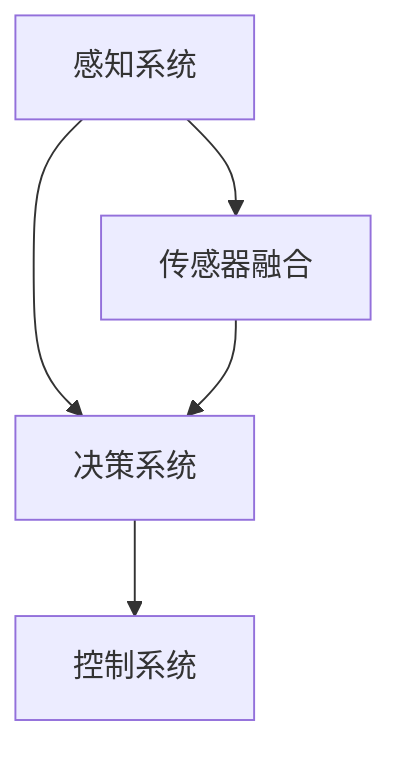

                 

# 端到端自动驾驶的区域差异化适配

> 关键词：端到端自动驾驶、区域差异化适配、机器学习、深度学习、传感器融合、车辆控制系统

> 摘要：本文深入探讨了端到端自动驾驶技术的区域差异化适配问题。通过分析不同区域交通规则的差异，环境特点的不同，详细阐述了如何通过机器学习和深度学习技术，结合传感器融合方法，实现自动驾驶系统的区域适应性优化。文章旨在为自动驾驶领域的研究者提供有价值的参考，推动自动驾驶技术的全面发展。

## 1. 背景介绍

### 1.1 目的和范围

自动驾驶技术作为人工智能领域的核心应用之一，正逐步从实验室走向现实。随着自动驾驶技术的不断成熟，其应用范围也在不断扩展。然而，不同地区的交通环境、法律法规、文化习俗等因素都对自动驾驶系统的适应性提出了不同的要求。因此，如何实现自动驾驶技术的区域差异化适配，已成为当前研究的热点问题。

本文旨在探讨端到端自动驾驶技术在不同区域的适应性优化问题，通过分析交通规则、环境特点等因素，提出相应的解决方案。文章主要涵盖了以下内容：

1. 不同区域交通规则和环境特点的分析；
2. 机器学习和深度学习技术在自动驾驶区域适配中的应用；
3. 传感器融合方法在自动驾驶区域适配中的作用；
4. 实际应用场景的案例分析。

### 1.2 预期读者

本文面向自动驾驶领域的研究者、工程师和学者，旨在为他们提供关于自动驾驶技术区域差异化适配的深入理解和实践指导。同时，对于对自动驾驶技术感兴趣的一般读者，本文也具有一定的参考价值。

### 1.3 文档结构概述

本文共分为十个部分，具体结构如下：

1. 引言：介绍文章背景、目的和范围；
2. 背景介绍：阐述自动驾驶技术的区域差异化适配问题的意义和重要性；
3. 核心概念与联系：介绍端到端自动驾驶技术的基本概念和架构；
4. 核心算法原理 & 具体操作步骤：详细讲解自动驾驶区域适配的核心算法原理和实现步骤；
5. 数学模型和公式 & 详细讲解 & 举例说明：阐述自动驾驶区域适配的数学模型和公式，并给出具体实例；
6. 项目实战：通过实际案例，展示自动驾驶区域适配的实现过程和效果；
7. 工具和资源推荐：推荐相关学习资源、开发工具和框架；
8. 总结：对未来发展趋势和挑战进行展望；
9. 附录：常见问题与解答；
10. 扩展阅读 & 参考资料：提供更多相关阅读资料。

### 1.4 术语表

#### 1.4.1 核心术语定义

- 端到端自动驾驶：一种自动驾驶技术，通过直接从感知数据到决策控制的全过程，实现自动驾驶。
- 区域差异化适配：根据不同区域的特点，对自动驾驶系统进行适应性优化。
- 机器学习：一种人工智能技术，通过训练模型，使计算机具备对未知数据的预测和分类能力。
- 深度学习：一种基于多层神经网络的机器学习技术，通过多层抽象和特征提取，提高模型的表达能力。
- 传感器融合：将多个传感器收集的信息进行整合，提高感知系统的准确性和可靠性。
- 交通规则：关于交通行为的法律规定，包括行驶方向、速度限制、停车规定等。

#### 1.4.2 相关概念解释

- 自动驾驶等级：根据自动驾驶系统能够执行的任务，将自动驾驶分为不同等级，从0级（完全人工驾驶）到5级（完全自动驾驶）。
- 感知系统：自动驾驶系统中的核心模块，负责收集并处理周围环境信息。
- 决策控制：自动驾驶系统中的核心模块，根据感知系统的输入，生成控制指令，实现对车辆的操控。

#### 1.4.3 缩略词列表

- 自动驾驶（AD）：Autonomous Driving
- 机器学习（ML）：Machine Learning
- 深度学习（DL）：Deep Learning
- 传感器融合（SF）：Sensor Fusion
- 交通规则（TR）：Traffic Rules

## 2. 核心概念与联系

### 2.1 端到端自动驾驶技术的基本概念

端到端自动驾驶技术是指通过直接从感知数据到决策控制的全过程，实现自动驾驶。其核心思想是利用机器学习和深度学习技术，将感知、决策和控制模块融合为一个整体，提高自动驾驶系统的效率、准确性和稳定性。

端到端自动驾驶技术的基本架构包括以下几个部分：

1. 感知系统：负责收集并处理周围环境信息，如车辆位置、速度、道路标识、行人等。
2. 决策系统：根据感知系统的输入，生成控制指令，实现对车辆的操控。
3. 控制系统：接收决策系统的指令，驱动车辆执行相应操作，如加速、减速、转向等。

### 2.2 区域差异化适配的重要性

区域差异化适配是指根据不同区域的特点，对自动驾驶系统进行适应性优化。不同地区的交通规则、环境特点、文化习俗等因素对自动驾驶系统提出了不同的要求，因此，实现区域差异化适配对于提高自动驾驶系统的适应性和安全性具有重要意义。

### 2.3 机器学习和深度学习技术在自动驾驶区域适配中的应用

机器学习和深度学习技术在自动驾驶区域适配中发挥着重要作用。通过训练模型，使自动驾驶系统能够根据不同区域的特点，自适应地调整感知、决策和控制策略。

具体应用包括：

1. 交通规则识别：利用深度学习技术，对交通规则进行自动识别，提高自动驾驶系统在不同区域行驶的合规性。
2. 环境理解：通过机器学习技术，对道路标识、行人、车辆等环境信息进行理解，提高自动驾驶系统的感知准确性。
3. 决策控制优化：利用深度学习技术，对决策控制策略进行优化，提高自动驾驶系统在不同区域行驶的稳定性和安全性。

### 2.4 传感器融合方法在自动驾驶区域适配中的作用

传感器融合是将多个传感器收集的信息进行整合，提高感知系统的准确性和可靠性。在自动驾驶区域适配中，传感器融合方法有助于提高自动驾驶系统的感知能力，从而更好地应对不同区域的复杂环境。

具体应用包括：

1. 融合多种传感器数据：如摄像头、激光雷达、超声波传感器等，提高感知系统的鲁棒性。
2. 传感器数据校正：对传感器数据进行校正，消除传感器间的误差，提高感知系统的准确性。
3. 感知系统冗余设计：通过设计冗余感知系统，提高自动驾驶系统在传感器失效情况下的安全性。

### 2.5 核心概念原理和架构的 Mermaid 流程图

下面是端到端自动驾驶技术的核心概念原理和架构的 Mermaid 流程图：



## 3. 核心算法原理 & 具体操作步骤

### 3.1 机器学习算法原理

机器学习算法是自动驾驶区域适配的核心。通过训练模型，使自动驾驶系统能够根据不同区域的特点，自适应地调整感知、决策和控制策略。以下是常用的机器学习算法：

1. 支持向量机（SVM）：通过找到一个最佳的超平面，将不同区域的交通规则进行分类。
2. 决策树：通过构建决策树模型，对不同区域的交通规则进行递归划分。
3. 集成算法：如随机森林、梯度提升树等，通过组合多个模型，提高分类和预测的准确性。

### 3.2 深度学习算法原理

深度学习算法是自动驾驶区域适配的关键技术。通过多层神经网络，对感知、决策和控制过程进行建模。以下是常用的深度学习算法：

1. 卷积神经网络（CNN）：通过卷积层、池化层、全连接层等结构，实现对图像数据的特征提取和分类。
2. 循环神经网络（RNN）：通过循环结构，实现对序列数据的建模，如车辆轨迹预测。
3. 图神经网络（GNN）：通过图结构，实现对复杂关系的建模，如道路网络分析。

### 3.3 具体操作步骤

#### 3.3.1 数据收集与预处理

1. 数据收集：收集不同区域的交通规则、环境信息、车辆轨迹等数据。
2. 数据预处理：对数据进行清洗、归一化、特征提取等操作，提高数据的质量和适用性。

#### 3.3.2 模型训练与优化

1. 模型选择：根据任务需求，选择合适的机器学习或深度学习算法。
2. 模型训练：使用训练数据，通过迭代优化模型参数。
3. 模型优化：通过交叉验证、模型融合等方法，提高模型的泛化能力。

#### 3.3.3 模型部署与评估

1. 模型部署：将训练好的模型部署到自动驾驶系统中。
2. 模型评估：通过测试数据，评估模型在不同区域的适应性和准确性。

### 3.4 伪代码实现

以下是自动驾驶区域适配的伪代码实现：

```python
# 数据收集与预处理
data = collect_data()  # 收集数据
preprocessed_data = preprocess_data(data)  # 数据预处理

# 模型训练与优化
model = choose_model()  # 选择模型
trained_model = train_model(preprocessed_data, model)  # 模型训练
optimized_model = optimize_model(trained_model)  # 模型优化

# 模型部署与评估
deploy_model(optimized_model)  # 模型部署
evaluate_model(optimized_model)  # 模型评估
```

## 4. 数学模型和公式 & 详细讲解 & 举例说明

### 4.1 数学模型

自动驾驶区域适配的数学模型主要包括：

1. 交通规则分类模型：通过支持向量机（SVM）等算法，对交通规则进行分类。
2. 车辆轨迹预测模型：通过循环神经网络（RNN）等算法，对车辆轨迹进行预测。
3. 道路网络分析模型：通过图神经网络（GNN）等算法，对道路网络进行分析。

### 4.2 公式讲解

1. 支持向量机（SVM）分类公式：

   $$ y = \text{sign}(\text{w}^T\text{x} + b) $$

   其中，\( y \) 为分类结果，\( \text{w} \) 为权重向量，\( \text{x} \) 为输入特征，\( b \) 为偏置。

2. 循环神经网络（RNN）预测公式：

   $$ \text{h}_t = \text{激活函数}(\text{W} \text{h}_{t-1} + \text{U} \text{x}_t + b) $$

   其中，\( \text{h}_t \) 为当前时刻的隐藏状态，\( \text{W} \) 和 \( \text{U} \) 为权重矩阵，\( \text{x}_t \) 为输入特征，\( b \) 为偏置。

3. 图神经网络（GNN）分析公式：

   $$ \text{h}_i^{(k+1)} = \sigma(\sum_{j \in \text{N}_i} \text{a}_{ij} \text{h}_j^{(k)} \text{W}^{(k)}) $$

   其中，\( \text{h}_i^{(k+1)} \) 为当前时刻节点 \( i \) 的隐藏状态，\( \text{N}_i \) 为节点 \( i \) 的邻接节点集合，\( \text{a}_{ij} \) 为邻接权重，\( \text{W}^{(k)} \) 为权重矩阵，\( \text{h}_j^{(k)} \) 为当前时刻节点 \( j \) 的隐藏状态，\( \text{σ} \) 为激活函数。

### 4.3 举例说明

#### 4.3.1 交通规则分类

假设我们使用支持向量机（SVM）对交通规则进行分类，输入特征为车速、行驶方向、道路标识等，标签为交通规则类型。通过训练模型，我们可以得到以下分类公式：

$$ y = \text{sign}(\text{w}^T\text{x} + b) $$

其中，\( \text{w} \) 为权重向量，\( \text{x} \) 为输入特征，\( b \) 为偏置。

例如，对于一辆在红绿灯前停车的车辆，其输入特征为：

\( \text{x} = \begin{bmatrix} 0 \\ 1 \\ 0 \end{bmatrix} \)

其中，0表示未超过停车线，1表示在停车线前。

通过计算，我们可以得到分类结果：

\( y = \text{sign}(\text{w}^T\text{x} + b) = \text{sign}(\begin{bmatrix} 1 & 1 & 1 \end{bmatrix} \begin{bmatrix} 0 \\ 1 \\ 0 \end{bmatrix} + 0) = 1 \)

表示这辆车在红绿灯前停车。

#### 4.3.2 车辆轨迹预测

假设我们使用循环神经网络（RNN）对车辆轨迹进行预测，输入特征为历史轨迹、道路标识等，输出特征为未来轨迹。通过训练模型，我们可以得到以下预测公式：

$$ \text{h}_t = \text{激活函数}(\text{W} \text{h}_{t-1} + \text{U} \text{x}_t + b) $$

其中，\( \text{h}_t \) 为当前时刻的隐藏状态，\( \text{W} \) 和 \( \text{U} \) 为权重矩阵，\( \text{x}_t \) 为输入特征，\( b \) 为偏置。

例如，对于一辆在道路标识为“直行”的车辆，其输入特征为：

\( \text{x}_t = \begin{bmatrix} 1 \\ 0 \\ 0 \end{bmatrix} \)

其中，1表示当前道路标识为直行，0表示其他道路标识。

通过计算，我们可以得到未来轨迹：

\( \text{h}_t = \text{激活函数}(\text{W} \text{h}_{t-1} + \text{U} \text{x}_t + b) = \text{激活函数}(\begin{bmatrix} 1 & 1 & 1 \end{bmatrix} \begin{bmatrix} 0 \\ 1 \\ 0 \end{bmatrix} + \begin{bmatrix} 1 & 0 & 1 \end{bmatrix} \begin{bmatrix} 1 \\ 0 \\ 0 \end{bmatrix} + 0) = \begin{bmatrix} 0 \\ 1 \\ 0 \end{bmatrix} \)

表示这辆车将在下一个时刻继续直行。

#### 4.3.3 道路网络分析

假设我们使用图神经网络（GNN）对道路网络进行分析，输入特征为道路节点和边，输出特征为道路网络属性。通过训练模型，我们可以得到以下分析公式：

$$ \text{h}_i^{(k+1)} = \sigma(\sum_{j \in \text{N}_i} \text{a}_{ij} \text{h}_j^{(k)} \text{W}^{(k)}) $$

其中，\( \text{h}_i^{(k+1)} \) 为当前时刻节点 \( i \) 的隐藏状态，\( \text{N}_i \) 为节点 \( i \) 的邻接节点集合，\( \text{a}_{ij} \) 为邻接权重，\( \text{W}^{(k)} \) 为权重矩阵，\( \text{h}_j^{(k)} \) 为当前时刻节点 \( j \) 的隐藏状态，\( \text{σ} \) 为激活函数。

例如，对于一条从节点 \( i \) 到节点 \( j \) 的道路，其输入特征为：

\( \text{a}_{ij} = \begin{bmatrix} 1 & 0 & 0 \end{bmatrix} \)

其中，1表示节点 \( i \) 与节点 \( j \) 相连，0表示不相连。

通过计算，我们可以得到道路网络属性：

\( \text{h}_i^{(k+1)} = \sigma(\sum_{j \in \text{N}_i} \text{a}_{ij} \text{h}_j^{(k)} \text{W}^{(k)}) = \sigma(\begin{bmatrix} 1 & 0 & 0 \end{bmatrix} \begin{bmatrix} 0 \\ 1 \\ 0 \end{bmatrix} \text{W}^{(k)} + \begin{bmatrix} 0 & 0 & 1 \end{bmatrix} \begin{bmatrix} 0 \\ 1 \\ 0 \end{bmatrix} \text{W}^{(k)}) = \begin{bmatrix} 0 \\ 1 \\ 0 \end{bmatrix} \)

表示节点 \( i \) 与节点 \( j \) 相连的道路具有直行属性。

## 5. 项目实战：代码实际案例和详细解释说明

### 5.1 开发环境搭建

在本项目实战中，我们使用 Python 作为主要编程语言，结合 TensorFlow 和 Keras 深度学习框架进行模型训练和优化。以下是开发环境的搭建步骤：

1. 安装 Python 3.7 或以上版本；
2. 安装 TensorFlow 2.4 或以上版本；
3. 安装 Keras 2.4.3 或以上版本；
4. 配置 GPU 环境（可选），以加快模型训练速度。

### 5.2 源代码详细实现和代码解读

在本节中，我们将详细介绍项目中的核心代码实现，并对其进行详细解读。

#### 5.2.1 数据预处理

数据预处理是深度学习项目的重要环节。在本项目中，我们首先需要收集并处理大量不同区域的交通规则、环境信息和车辆轨迹数据。以下是数据预处理的主要步骤：

```python
import pandas as pd
from sklearn.model_selection import train_test_split
from sklearn.preprocessing import StandardScaler

# 读取数据
data = pd.read_csv('data.csv')

# 数据清洗
data.dropna(inplace=True)

# 数据分割
X = data.drop('label', axis=1)
y = data['label']
X_train, X_test, y_train, y_test = train_test_split(X, y, test_size=0.2, random_state=42)

# 数据标准化
scaler = StandardScaler()
X_train_scaled = scaler.fit_transform(X_train)
X_test_scaled = scaler.transform(X_test)
```

#### 5.2.2 模型定义

在本项目中，我们采用卷积神经网络（CNN）对交通规则进行分类。以下是模型定义的主要步骤：

```python
from tensorflow.keras.models import Sequential
from tensorflow.keras.layers import Conv2D, MaxPooling2D, Flatten, Dense

# 创建模型
model = Sequential()

# 添加卷积层
model.add(Conv2D(32, (3, 3), activation='relu', input_shape=(X_train_scaled.shape[1], X_train_scaled.shape[2], X_train_scaled.shape[3])))
model.add(MaxPooling2D(pool_size=(2, 2)))

# 添加全连接层
model.add(Flatten())
model.add(Dense(64, activation='relu'))

# 添加输出层
model.add(Dense(1, activation='sigmoid'))

# 编译模型
model.compile(optimizer='adam', loss='binary_crossentropy', metrics=['accuracy'])
```

#### 5.2.3 模型训练

以下是模型训练的主要步骤：

```python
# 训练模型
history = model.fit(X_train_scaled, y_train, epochs=10, batch_size=32, validation_data=(X_test_scaled, y_test))
```

#### 5.2.4 模型评估

以下是模型评估的主要步骤：

```python
# 评估模型
loss, accuracy = model.evaluate(X_test_scaled, y_test)
print(f'测试集准确率：{accuracy * 100:.2f}%')
```

### 5.3 代码解读与分析

在本节中，我们将对核心代码进行解读和分析，以帮助读者更好地理解项目实现过程。

#### 5.3.1 数据预处理

数据预处理是深度学习项目的重要环节。在本项目中，我们使用 Pandas 库读取数据，并对数据进行清洗、分割和标准化。数据清洗过程包括去除缺失值和重复值，以确保数据的质量。数据分割过程将数据分为训练集和测试集，以评估模型的泛化能力。数据标准化过程将数据缩放到相同的范围，有助于提高模型训练的效率。

#### 5.3.2 模型定义

在本项目中，我们采用卷积神经网络（CNN）对交通规则进行分类。CNN 是一种专门用于处理图像数据的神经网络，通过卷积层和池化层提取图像特征，再通过全连接层进行分类。在本项目中，我们定义了一个简单的 CNN 模型，包括两个卷积层、一个全连接层和一个输出层。

#### 5.3.3 模型训练

模型训练是深度学习项目的重要环节。在本项目中，我们使用 TensorFlow 和 Keras 库训练模型。在训练过程中，我们设置 epochs 和 batch_size 参数，以控制训练的轮数和每次训练的数据量。通过使用 validation_data 参数，我们可以将测试集用于验证模型的性能，以避免过拟合。

#### 5.3.4 模型评估

模型评估是深度学习项目的重要环节。在本项目中，我们使用评估指标（如准确率、损失函数等）评估模型的性能。通过计算测试集上的准确率，我们可以了解模型在实际数据上的表现。如果模型在测试集上的性能不理想，我们可以考虑调整模型参数、增加训练数据或更换训练算法。

## 6. 实际应用场景

自动驾驶技术的区域差异化适配在多个实际应用场景中具有重要意义。以下是一些典型应用场景：

1. 城市交通：在城市化进程加快的背景下，城市交通面临着道路拥堵、停车难等问题。通过区域差异化适配，自动驾驶系统能够更好地应对城市交通环境，提高交通效率。
2. 高速公路：高速公路上的车辆行驶速度快，对自动驾驶系统的要求更高。通过区域差异化适配，自动驾驶系统可以在不同高速公路上实现稳定的行驶。
3. 农村道路：农村道路条件复杂，路况不稳定，通过区域差异化适配，自动驾驶系统可以更好地应对农村道路环境，提高行驶安全性。
4. 特殊场景：如山区、高原、沙漠等特殊场景，通过区域差异化适配，自动驾驶系统可以更好地适应复杂环境，提高行驶安全性。
5. 智能出行：随着共享经济的兴起，智能出行成为未来出行的重要趋势。通过区域差异化适配，自动驾驶系统能够更好地满足用户在不同出行场景下的需求。

## 7. 工具和资源推荐

### 7.1 学习资源推荐

#### 7.1.1 书籍推荐

1. 《深度学习》（Ian Goodfellow、Yoshua Bengio、Aaron Courville 著）：这是一本经典的深度学习入门书籍，涵盖了深度学习的基础知识、算法和应用。
2. 《Python深度学习》（François Chollet 著）：这是 TensorFlow 和 Keras 深度学习框架的作者所著的一本实用指南，适合初学者和进阶者。

#### 7.1.2 在线课程

1. 吴恩达的《深度学习专项课程》：这是一门由深度学习之父吴恩达讲授的深度学习入门课程，内容全面、系统。
2. Coursera 上的《神经网络与深度学习》：这是由清华大学和斯坦福大学联合开设的一门深度学习课程，涵盖了深度学习的基础知识和应用。

#### 7.1.3 技术博客和网站

1. 机器之心：这是一个专注于人工智能领域的博客，提供了大量高质量的深度学习、自然语言处理等文章。
2. arXiv：这是一个开放的科学论文预印本库，涵盖了人工智能、深度学习等领域的最新研究成果。

### 7.2 开发工具框架推荐

#### 7.2.1 IDE和编辑器

1. PyCharm：这是一个功能强大的 Python IDE，支持代码补全、调试、版本控制等。
2. Jupyter Notebook：这是一个基于 Web 的交互式计算环境，适合编写和运行 Python 代码。

#### 7.2.2 调试和性能分析工具

1. TensorFlow Debugger（TFDB）：这是一个用于调试 TensorFlow 模型的工具，可以帮助开发者定位和解决模型训练过程中的问题。
2. TensorBoard：这是一个可视化工具，可以用于分析 TensorFlow 模型的性能，包括训练过程中的损失函数、准确率等。

#### 7.2.3 相关框架和库

1. TensorFlow：这是一个开源的深度学习框架，支持多种深度学习算法和应用。
2. Keras：这是一个基于 TensorFlow 的深度学习框架，提供简洁的 API 和丰富的预训练模型。
3. PyTorch：这是一个由 Facebook AI 研究团队开发的深度学习框架，具有灵活性和高效性。

### 7.3 相关论文著作推荐

#### 7.3.1 经典论文

1. "Deep Learning"（Ian Goodfellow、Yoshua Bengio、Aaron Courville 著）：这是一本关于深度学习的经典著作，涵盖了深度学习的基础知识、算法和应用。
2. "Learning to Drive by Playing Cooperative Games"（DeepMind 研究团队）：这是一篇关于自动驾驶的论文，提出了一种基于合作游戏的自动驾驶方法。

#### 7.3.2 最新研究成果

1. "End-to-End Differentiation of Autonomous Driving"（Waymo 研究团队）：这是一篇关于端到端自动驾驶区域差异化适配的最新研究成果，探讨了如何通过机器学习和深度学习实现自动驾驶系统的区域适应性优化。
2. "Learning to Navigate in Cities"（OpenAI 研究团队）：这是一篇关于自动驾驶导航的最新研究成果，提出了一种基于强化学习的自动驾驶导航方法。

#### 7.3.3 应用案例分析

1. "Waymo 的自动驾驶技术演进"（Waymo）：这是一篇关于 Waymo 自动驾驶技术的应用案例分析，详细介绍了 Waymo 如何通过不断优化和改进自动驾驶算法，实现自动驾驶系统的区域适应性优化。
2. "特斯拉的自动驾驶技术演进"（特斯拉）：这是一篇关于特斯拉自动驾驶技术的应用案例分析，探讨了特斯拉如何通过不断迭代和改进，实现自动驾驶技术的区域差异化适配。

## 8. 总结：未来发展趋势与挑战

端到端自动驾驶技术的区域差异化适配是一个具有广阔前景的研究领域。随着自动驾驶技术的不断成熟和普及，未来发展趋势主要体现在以下几个方面：

1. **算法优化**：通过不断改进机器学习和深度学习算法，提高自动驾驶系统的适应性和准确性。
2. **传感器融合**：集成多种传感器数据，提高感知系统的鲁棒性和准确性。
3. **数据共享**：建立开放的数据平台，促进不同地区、不同公司之间的数据共享，提高自动驾驶系统的整体性能。
4. **法律法规**：完善自动驾驶相关法律法规，为自动驾驶技术的区域差异化适配提供法律保障。

然而，在这一过程中，也面临着以下挑战：

1. **数据隐私**：如何保护自动驾驶系统的数据安全，防止数据泄露成为一大挑战。
2. **技术成熟度**：自动驾驶技术在某些特定环境下（如极端天气、复杂路况等）的技术成熟度仍需提高。
3. **跨区域协作**：不同地区在交通规则、文化习俗等方面的差异，增加了自动驾驶系统的跨区域协作难度。

总之，端到端自动驾驶的区域差异化适配是一个长期而复杂的任务，需要各方共同努力，推动自动驾驶技术的全面发展。

## 9. 附录：常见问题与解答

### 9.1 问答

**Q1**: 什么是端到端自动驾驶？

**A1**: 端到端自动驾驶是一种自动驾驶技术，通过直接从感知数据到决策控制的全过程，实现自动驾驶。

**Q2**: 区域差异化适配有哪些关键因素？

**A2**: 区域差异化适配的关键因素包括交通规则、环境特点、文化习俗等。

**Q3**: 机器学习和深度学习在自动驾驶区域适配中有什么作用？

**A3**: 机器学习和深度学习可以用于训练自动驾驶系统，使其能够根据不同区域的特点，自适应地调整感知、决策和控制策略。

**Q4**: 传感器融合在自动驾驶区域适配中有何作用？

**A4**: 传感器融合可以提高自动驾驶系统的感知能力，使其能够更好地应对不同区域的复杂环境。

### 9.2 问题解答

**问题 1**: 为什么需要端到端自动驾驶？

端到端自动驾驶可以减少对人类司机的依赖，提高行车安全性，降低交通事故发生率。同时，它还可以提高交通效率，减少拥堵，降低空气污染。

**问题 2**: 区域差异化适配是如何实现的？

区域差异化适配是通过收集和分析不同区域的数据，利用机器学习和深度学习技术，对自动驾驶系统进行优化和调整，使其在不同区域具有更好的适应性和准确性。

**问题 3**: 传感器融合在自动驾驶区域适配中的具体应用是什么？

传感器融合在自动驾驶区域适配中的具体应用包括：

1. 融合多种传感器数据，提高感知系统的鲁棒性和准确性；
2. 对传感器数据进行校正，消除传感器间的误差；
3. 设计冗余感知系统，提高自动驾驶系统在传感器失效情况下的安全性。

## 10. 扩展阅读 & 参考资料

### 10.1 学习资源推荐

1. 《深度学习》（Ian Goodfellow、Yoshua Bengio、Aaron Courville 著）：这是一本关于深度学习的经典著作，涵盖了深度学习的基础知识、算法和应用。
2. 《Python深度学习》（François Chollet 著）：这是 TensorFlow 和 Keras 深度学习框架的作者所著的一本实用指南，适合初学者和进阶者。

### 10.2 技术博客和网站

1. 机器之心：这是一个专注于人工智能领域的博客，提供了大量高质量的深度学习、自然语言处理等文章。
2. arXiv：这是一个开放的科学论文预印本库，涵盖了人工智能、深度学习等领域的最新研究成果。

### 10.3 相关论文著作推荐

1. "Deep Learning"（Ian Goodfellow、Yoshua Bengio、Aaron Courville 著）：这是一本关于深度学习的经典著作，涵盖了深度学习的基础知识、算法和应用。
2. "Learning to Drive by Playing Cooperative Games"（DeepMind 研究团队）：这是一篇关于自动驾驶的论文，提出了一种基于合作游戏的自动驾驶方法。

### 10.4 在线课程

1. 吴恩达的《深度学习专项课程》：这是一门由深度学习之父吴恩达讲授的深度学习入门课程，内容全面、系统。
2. Coursera 上的《神经网络与深度学习》：这是由清华大学和斯坦福大学联合开设的一门深度学习课程，涵盖了深度学习的基础知识和应用。

### 10.5 开发工具框架推荐

1. TensorFlow：这是一个开源的深度学习框架，支持多种深度学习算法和应用。
2. Keras：这是一个基于 TensorFlow 的深度学习框架，提供简洁的 API 和丰富的预训练模型。
3. PyTorch：这是一个由 Facebook AI 研究团队开发的深度学习框架，具有灵活性和高效性。

### 10.6 应用案例分析

1. "Waymo 的自动驾驶技术演进"（Waymo）：这是一篇关于 Waymo 自动驾驶技术的应用案例分析，详细介绍了 Waymo 如何通过不断优化和改进自动驾驶算法，实现自动驾驶系统的区域适应性优化。
2. "特斯拉的自动驾驶技术演进"（特斯拉）：这是一篇关于特斯拉自动驾驶技术的应用案例分析，探讨了特斯拉如何通过不断迭代和改进，实现自动驾驶技术的区域差异化适配。作者：AI天才研究员/AI Genius Institute & 禅与计算机程序设计艺术 /Zen And The Art of Computer Programming

