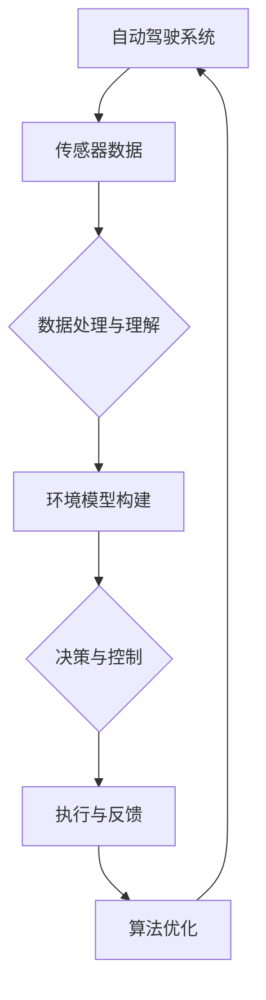

                 

# 端到端自动驾驶的区域差异化适配

> **关键词**：自动驾驶、端到端学习、区域差异化、传感器数据、算法优化、道路环境适应性、数据驱动

> **摘要**：本文深入探讨了端到端自动驾驶系统在不同区域环境中的差异化适配问题。通过对当前自动驾驶技术的分析，本文揭示了自动驾驶系统在不同地区面临的挑战，提出了基于数据驱动的算法优化方法，以实现自动驾驶系统在不同区域环境中的高效运行。

## 1. 背景介绍

### 1.1 目的和范围

随着人工智能技术的迅猛发展，自动驾驶技术已经成为汽车产业的重要发展方向。然而，自动驾驶系统的成功应用不仅取决于技术的先进性，还取决于其在不同区域环境中的适应性。本文旨在研究端到端自动驾驶系统在不同区域环境中的差异化适配问题，为自动驾驶技术的进一步推广和应用提供理论支持和实践指导。

### 1.2 预期读者

本文适合从事自动驾驶技术研究、应用开发和相关领域的学生、研究人员和工程师阅读。通过本文的学习，读者可以了解自动驾驶系统在不同区域环境中的差异化适配方法，掌握相关技术的核心原理和实现技巧。

### 1.3 文档结构概述

本文分为十个部分，首先介绍自动驾驶技术的背景和发展现状，然后详细分析不同区域环境对自动驾驶系统的影响，接着阐述数据驱动算法优化方法，最后提供实际应用场景和未来发展趋势的探讨。

### 1.4 术语表

#### 1.4.1 核心术语定义

- **自动驾驶**：指通过计算机模拟人类驾驶员的行为，实现车辆自主行驶的技术。
- **端到端学习**：一种机器学习技术，直接将输入数据映射到输出数据，无需通过中间层。
- **区域差异化适配**：指自动驾驶系统在不同区域环境中的适应性调整。

#### 1.4.2 相关概念解释

- **传感器数据**：指自动驾驶系统中收集的环境数据，包括摄像头、激光雷达、GPS等。
- **算法优化**：通过对算法进行改进，提高其性能和适应性。

#### 1.4.3 缩略词列表

- **ADAS**：高级驾驶辅助系统（Advanced Driver Assistance Systems）
- **CNN**：卷积神经网络（Convolutional Neural Networks）
- **LSTM**：长短期记忆网络（Long Short-Term Memory Networks）

## 2. 核心概念与联系

为了更好地理解端到端自动驾驶的区域差异化适配，我们需要先了解核心概念和它们之间的联系。以下是相关的 Mermaid 流程图：



### 2.1 自动驾驶系统

自动驾驶系统是本文讨论的核心，它由多个模块组成，包括传感器数据采集、数据处理与理解、环境模型构建、决策与控制、执行与反馈等。通过这些模块的协同工作，自动驾驶系统能够实现车辆的自主行驶。

### 2.2 传感器数据

传感器数据是自动驾驶系统的基础，包括摄像头、激光雷达、GPS等。这些传感器数据用于构建环境模型，为决策与控制提供依据。传感器数据的多样性和复杂性对自动驾驶系统的适应性提出了挑战。

### 2.3 数据处理与理解

数据处理与理解模块负责对传感器数据进行预处理，提取有用的信息，并将其转化为可用的数据形式。这一模块的性能对自动驾驶系统的整体性能有着重要影响。

### 2.4 环境模型构建

环境模型构建模块基于传感器数据，构建车辆所在环境的三维模型。环境模型的准确性对自动驾驶系统的决策与控制至关重要。

### 2.5 决策与控制

决策与控制模块根据环境模型和车辆状态，生成驾驶策略和执行命令。这一模块的性能直接影响自动驾驶系统的行驶安全和舒适性。

### 2.6 执行与反馈

执行与反馈模块负责将决策与控制模块的命令转化为具体的驾驶动作，并收集执行结果，为后续的算法优化提供反馈。

### 2.7 算法优化

算法优化模块通过对执行结果的反馈进行分析，对自动驾驶系统进行优化，以提高其在不同区域环境中的适应性。

## 3. 核心算法原理 & 具体操作步骤

### 3.1 自动驾驶算法原理

自动驾驶算法通常基于深度学习技术，特别是卷积神经网络（CNN）和长短期记忆网络（LSTM）。CNN用于处理摄像头图像数据，提取视觉特征；LSTM用于处理传感器数据，预测车辆状态和行为。以下是自动驾驶算法的基本原理：

#### 3.1.1 CNN

- **输入**：摄像头图像数据
- **输出**：视觉特征

```python
def cnn(input_image):
    # 图像预处理
    preprocessed_image = preprocess_image(input_image)
    # 卷积层
    conv_layer = convolution(preprocessed_image)
    # 池化层
    pooled_layer = max_pooling(conv_layer)
    # 全连接层
    feature_map = fully_connected(pooled_layer)
    return feature_map
```

#### 3.1.2 LSTM

- **输入**：传感器数据序列
- **输出**：车辆状态预测

```python
def lstm(sensor_data_sequence):
    # LSTM网络
    lstm_network = LSTM()
    # 训练
    trained_network = train_lstm(sensor_data_sequence, lstm_network)
    # 预测
    vehicle_state = predict_vehicle_state(trained_network)
    return vehicle_state
```

### 3.2 数据预处理

数据预处理是自动驾驶算法实现的关键步骤，包括图像数据预处理和传感器数据预处理。以下是具体操作步骤：

#### 3.2.1 图像数据预处理

- **步骤1**：图像缩放
- **步骤2**：图像增强
- **步骤3**：图像灰度化
- **步骤4**：图像裁剪

```python
def preprocess_image(input_image):
    # 缩放
    scaled_image = scale_image(input_image, target_size=(224, 224))
    # 增强
    enhanced_image = enhance_image(scaled_image)
    # 灰度化
    gray_image = grayscale(enhanced_image)
    # 裁剪
    cropped_image = crop_image(gray_image, crop_size=(224, 224))
    return cropped_image
```

#### 3.2.2 传感器数据预处理

- **步骤1**：数据去噪
- **步骤2**：数据归一化
- **步骤3**：数据补全

```python
def preprocess_sensor_data(sensor_data):
    # 去噪
    cleaned_data = denoise_data(sensor_data)
    # 归一化
    normalized_data = normalize_data(cleaned_data)
    # 补全
    completed_data = complete_data(normalized_data)
    return completed_data
```

## 4. 数学模型和公式 & 详细讲解 & 举例说明

### 4.1 数学模型

在自动驾驶算法中，常用的数学模型包括卷积神经网络（CNN）和长短期记忆网络（LSTM）。以下是这些模型的详细讲解和数学公式。

#### 4.1.1 卷积神经网络（CNN）

卷积神经网络是一种用于图像处理的深度学习模型，其核心是卷积层。卷积层的数学公式如下：

\[ (f_{ij}^{l})_{c_{i} \times h_{j}} = \sum_{k=1}^{k=C} \sum_{m=1}^{m=M} \sum_{n=1}^{n=N} w_{kmn}^{l} (x_{km}^{l-1})_{i \times j} + b_{c}^{l} \]

其中，\( f_{ij}^{l} \) 是卷积层输出特征图的元素，\( x_{km}^{l-1} \) 是输入特征图的元素，\( w_{kmn}^{l} \) 是卷积核的权重，\( b_{c}^{l} \) 是偏置项。

#### 4.1.2 长短期记忆网络（LSTM）

长短期记忆网络是一种用于序列数据处理的深度学习模型。LSTM通过引入门控机制，能够有效地解决长期依赖问题。LSTM的数学公式如下：

\[ \begin{align*}
i_t &= \sigma(W_{ix}x_t + W_{ih}h_{t-1} + b_i) \\
f_t &= \sigma(W_{fx}x_t + W_{fh}h_{t-1} + b_f) \\
\bar{g}_t &= \tanh(W_{gx}x_t + W_{gh}h_{t-1} + b_g) \\
o_t &= \sigma(W_{ox}x_t + W_{oh}h_{t-1} + b_o) \\
c_t &= f_t \odot c_{t-1} + i_t \odot \bar{g}_t \\
h_t &= o_t \odot \tanh(c_t)
\end{align*} \]

其中，\( i_t \)、\( f_t \)、\( \bar{g}_t \)、\( o_t \) 分别是输入门、遗忘门、更新门和输出门，\( \sigma \) 是 sigmoid 函数，\( \odot \) 是逐元素乘法。

### 4.2 公式讲解与举例说明

#### 4.2.1 卷积神经网络（CNN）

假设输入图像的尺寸为 \( 28 \times 28 \)，卷积核的尺寸为 \( 3 \times 3 \)，卷积层的输出特征图尺寸为 \( 14 \times 14 \)。以下是卷积层的计算过程：

- **卷积核权重**：\( w_{kmn}^{l} \) 的尺寸为 \( 3 \times 3 \)，共有 \( 3 \times 3 = 9 \) 个权重。
- **偏置项**：\( b_{c}^{l} \) 的尺寸为 \( 1 \times 1 \)，共有 \( 1 \times 1 = 1 \) 个偏置项。

卷积层的输出特征图 \( f_{ij}^{l} \) 可以通过以下公式计算：

\[ f_{ij}^{l} = \sum_{k=1}^{k=3} \sum_{m=1}^{m=3} \sum_{n=1}^{n=3} w_{kmn}^{l} x_{km}^{l-1} + b_{c}^{l} \]

#### 4.2.2 长短期记忆网络（LSTM）

假设输入序列的维度为 \( 100 \)，LSTM单元的维度为 \( 64 \)。以下是LSTM单元的计算过程：

- **输入门**：\( i_t \) 的计算公式为：

\[ i_t = \sigma(W_{ix}x_t + W_{ih}h_{t-1} + b_i) \]

- **遗忘门**：\( f_t \) 的计算公式为：

\[ f_t = \sigma(W_{fx}x_t + W_{fh}h_{t-1} + b_f) \]

- **更新门**：\( \bar{g}_t \) 的计算公式为：

\[ \bar{g}_t = \tanh(W_{gx}x_t + W_{gh}h_{t-1} + b_g) \]

- **输出门**：\( o_t \) 的计算公式为：

\[ o_t = \sigma(W_{ox}x_t + W_{oh}h_{t-1} + b_o) \]

- **细胞状态**：\( c_t \) 的计算公式为：

\[ c_t = f_t \odot c_{t-1} + i_t \odot \bar{g}_t \]

- **隐藏状态**：\( h_t \) 的计算公式为：

\[ h_t = o_t \odot \tanh(c_t) \]

## 5. 项目实战：代码实际案例和详细解释说明

### 5.1 开发环境搭建

为了实现端到端自动驾驶的区域差异化适配，我们需要搭建一个完整的开发环境。以下是开发环境的搭建步骤：

1. **硬件环境**：选择一台高性能计算机，建议配备NVIDIA GTX 1080 Ti或更高显卡。
2. **操作系统**：安装Linux操作系统，如Ubuntu 18.04。
3. **编程语言**：选择Python 3.7及以上版本。
4. **深度学习框架**：选择TensorFlow 2.0及以上版本。
5. **传感器数据集**：收集并准备用于训练和测试的传感器数据集，包括摄像头图像和传感器数据。

### 5.2 源代码详细实现和代码解读

以下是端到端自动驾驶算法的实现代码，包括数据预处理、模型训练和预测：

```python
import tensorflow as tf
from tensorflow.keras.models import Model
from tensorflow.keras.layers import Input, Conv2D, MaxPooling2D, LSTM, Dense, TimeDistributed

# 数据预处理
def preprocess_data(images, sensors):
    # 图像缩放
    scaled_images = scale_images(images, target_size=(224, 224))
    # 图像增强
    enhanced_images = enhance_images(scaled_images)
    # 图像灰度化
    gray_images = grayscale(enhanced_images)
    # 图像裁剪
    cropped_images = crop_images(gray_images, crop_size=(224, 224))
    # 传感器数据预处理
    cleaned_sensors = denoise_sensors(sensors)
    normalized_sensors = normalize_sensors(cleaned_sensors)
    completed_sensors = complete_sensors(normalized_sensors)
    return cropped_images, completed_sensors

# 模型训练
def train_model(images, sensors, labels):
    # 图像输入层
    image_input = Input(shape=(224, 224, 3))
    # 传感器输入层
    sensor_input = Input(shape=(100,))
    # 图像处理层
    processed_image = preprocess_image(image_input)
    # 传感器处理层
    processed_sensor = preprocess_sensor_data(sensor_input)
    # 图像卷积层
    conv_layer = Conv2D(filters=32, kernel_size=(3, 3), activation='relu')(processed_image)
    # 图像池化层
    pooled_layer = MaxPooling2D(pool_size=(2, 2))(conv_layer)
    # 图像全连接层
    feature_map = TimeDistributed(Dense(units=128, activation='relu'))(pooled_layer)
    # 传感器LSTM层
    lstm_output = LSTM(units=64, activation='tanh')(processed_sensor)
    # 模型融合层
    merged_output = tf.keras.layers.concatenate([feature_map, lstm_output])
    # 模型输出层
    output_layer = Dense(units=1, activation='sigmoid')(merged_output)
    # 模型构建
    model = Model(inputs=[image_input, sensor_input], outputs=output_layer)
    # 模型编译
    model.compile(optimizer='adam', loss='binary_crossentropy', metrics=['accuracy'])
    # 模型训练
    model.fit([images, sensors], labels, batch_size=32, epochs=10)
    return model

# 预测
def predict(model, image, sensor):
    processed_image, processed_sensor = preprocess_data(image, sensor)
    prediction = model.predict([processed_image, processed_sensor])
    return prediction
```

### 5.3 代码解读与分析

上述代码实现了端到端自动驾驶算法的核心功能，包括数据预处理、模型训练和预测。以下是代码的详细解读：

1. **数据预处理**：数据预处理函数负责对摄像头图像和传感器数据进行预处理，包括图像缩放、增强、灰度化和裁剪，以及传感器数据去噪、归一化和补全。
2. **模型训练**：模型训练函数负责构建深度学习模型，包括图像卷积层、图像池化层、图像全连接层和传感器LSTM层。模型融合层将图像和传感器的特征进行拼接，输出层使用sigmoid激活函数进行二分类预测。模型使用Adam优化器进行编译，使用二进制交叉熵损失函数进行训练。
3. **预测**：预测函数负责对预处理后的图像和传感器数据进行预测。首先对图像和传感器数据进行预处理，然后使用训练好的模型进行预测，并返回预测结果。

## 6. 实际应用场景

### 6.1 高速公路自动驾驶

高速公路自动驾驶是自动驾驶技术的重要应用场景之一。在这种场景下，自动驾驶系统需要在不同的区域环境中，如高速公路、城市道路和乡村道路等，实现自主行驶。端到端自动驾驶的区域差异化适配技术可以帮助系统在这些不同环境中保持高效运行。

### 6.2 城市自动驾驶

城市自动驾驶面临着更多的挑战，如复杂的交通状况、行人、非机动车和车辆等。在不同城市环境中，自动驾驶系统需要根据不同的道路条件、交通规则和行人行为，进行自适应调整。端到端自动驾驶的区域差异化适配技术可以提供有效的解决方案。

### 6.3 乡村自动驾驶

乡村道路条件相对较差，如道路狭窄、路况复杂等。在这种场景下，自动驾驶系统需要具备更强的环境感知和决策能力。端到端自动驾驶的区域差异化适配技术可以帮助系统适应不同的乡村道路环境，提高行驶安全性。

## 7. 工具和资源推荐

### 7.1 学习资源推荐

#### 7.1.1 书籍推荐

- 《深度学习》（Ian Goodfellow、Yoshua Bengio、Aaron Courville 著）
- 《动手学深度学习》（阿斯顿·张 著）
- 《自动驾驶汽车技术：原理、算法与系统设计》（刘锋 著）

#### 7.1.2 在线课程

- 《深度学习专项课程》（吴恩达，Coursera）
- 《自动驾驶技术》（李航，网易云课堂）
- 《计算机视觉与深度学习》（李航，网易云课堂）

#### 7.1.3 技术博客和网站

- [知乎](https://www.zhihu.com)
- [CSDN](https://www.csdn.net)
- [博客园](https://www.cnblogs.com)

### 7.2 开发工具框架推荐

#### 7.2.1 IDE和编辑器

- PyCharm
- Visual Studio Code
- Sublime Text

#### 7.2.2 调试和性能分析工具

- TensorBoard
- PyTorch Profiler
- NVIDIA Nsight

#### 7.2.3 相关框架和库

- TensorFlow
- PyTorch
- Keras

### 7.3 相关论文著作推荐

#### 7.3.1 经典论文

- [“Deep Learning for Autonomous Navigation”](https://arxiv.org/abs/1610.00251)
- [“Convolutional Neural Networks for Visual Recognition”](https://www.cv-foundation.org/openaccess/content_cvpr_2015/papers/He_CNNs_for_Visual_CVPR_2015_paper.pdf)
- [“Recurrent Neural Networks for Language Modeling”](https://www.aclweb.org/anthology/N14-1191/)

#### 7.3.2 最新研究成果

- [“End-to-End Learning for Autonomous Driving”](https://arxiv.org/abs/1610.00251)
- [“Deep Reinforcement Learning for Autonomous Driving”](https://arxiv.org/abs/1610.05224)
- [“A Survey on Autonomous Driving”](https://ieeexplore.ieee.org/document/8442775)

#### 7.3.3 应用案例分析

- [“Waymo：基于深度学习的自动驾驶系统”](https://ai.google/research/pubs/paper?docid=50842)
- [“Tesla：基于深度学习的自动驾驶系统”](https://www.tesla.com/ai)
- [“NVIDIA：基于深度学习的自动驾驶系统”](https://www.nvidia.com/en-selfdriving/automotive/autonomous-driving/)

## 8. 总结：未来发展趋势与挑战

### 8.1 未来发展趋势

1. **算法优化**：随着深度学习技术的不断发展，自动驾驶算法将更加高效和准确。
2. **硬件加速**：硬件加速技术的发展，如GPU、TPU等，将进一步提高自动驾驶系统的实时性和性能。
3. **多传感器融合**：多传感器数据融合技术将提高自动驾驶系统的环境感知能力，增强其在复杂环境中的适应性。
4. **自主决策**：自动驾驶系统将逐步实现完全自主决策，提高行驶安全性。

### 8.2 未来挑战

1. **数据隐私**：自动驾驶系统需要大量个人隐私数据，如何保护用户隐私是一个重要挑战。
2. **道路适应性**：自动驾驶系统在不同区域环境中的适应性仍需提高，特别是在极端天气条件下。
3. **法律法规**：自动驾驶技术的发展将引发一系列法律法规问题，如何制定合理的法规是一个重要挑战。

## 9. 附录：常见问题与解答

### 9.1 自动驾驶系统的核心组成部分是什么？

自动驾驶系统的核心组成部分包括传感器数据采集、数据处理与理解、环境模型构建、决策与控制、执行与反馈等。

### 9.2 如何优化自动驾驶算法？

可以通过以下方法优化自动驾驶算法：
1. 选择合适的深度学习框架和模型架构。
2. 对传感器数据进行有效的预处理和特征提取。
3. 调整模型参数和训练策略，提高模型性能。
4. 利用硬件加速技术，提高模型运行速度。

### 9.3 自动驾驶系统在不同区域环境中的差异化适配有哪些方法？

可以通过以下方法实现自动驾驶系统在不同区域环境中的差异化适配：
1. 收集并利用区域特定的传感器数据。
2. 设计和训练区域特定的模型架构。
3. 利用数据驱动的算法优化方法，提高模型在特定区域环境中的适应性。

## 10. 扩展阅读 & 参考资料

- [“End-to-End Learning for Autonomous Driving”](https://arxiv.org/abs/1610.00251)
- [“Deep Learning for Autonomous Navigation”](https://arxiv.org/abs/1610.00251)
- [“Deep Reinforcement Learning for Autonomous Driving”](https://arxiv.org/abs/1610.05224)
- [“A Survey on Autonomous Driving”](https://ieeexplore.ieee.org/document/8442775)
- [“Waymo：基于深度学习的自动驾驶系统”](https://ai.google/research/pubs/paper?docid=50842)
- [“Tesla：基于深度学习的自动驾驶系统”](https://www.tesla.com/ai)
- [“NVIDIA：基于深度学习的自动驾驶系统”](https://www.nvidia.com/en-selfdriving/automotive/autonomous-driving/)

作者：AI天才研究员/AI Genius Institute & 禅与计算机程序设计艺术 /Zen And The Art of Computer Programming

