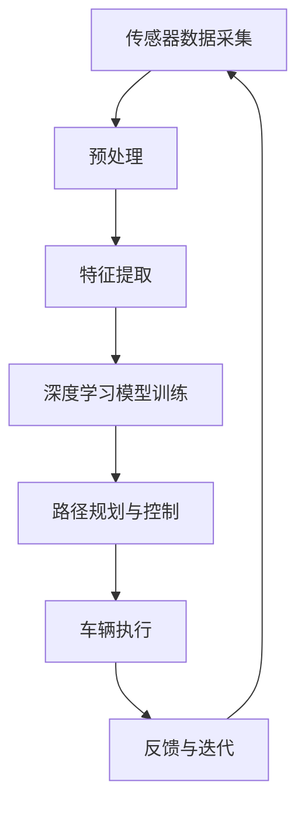

                 

# 端到端自动驾驶的商业化时间表预测

> **关键词**：端到端自动驾驶，商业化时间表，技术成熟度，市场接受度，法律法规，经济因素，社会因素

> **摘要**：本文旨在探讨端到端自动驾驶技术的商业化时间表，分析影响其发展的关键因素，并预测未来可能的商业化里程碑。通过对技术、市场、政策和经济等方面的深入分析，本文提出了一个可能的端到端自动驾驶商业化时间表，为行业从业者提供了有价值的参考。

## 1. 背景介绍

### 1.1 目的和范围

本文的目标是预测端到端自动驾驶技术的商业化时间表，并分析影响其发展的关键因素。端到端自动驾驶是人工智能领域的前沿技术，具有巨大的商业潜力。然而，从技术成熟到商业化应用，其中涉及多个方面的挑战。本文将从技术、市场、政策和经济等多个角度，系统地探讨端到端自动驾驶的商业化进程，并提出一个可能的商业化时间表。

### 1.2 预期读者

本文的预期读者包括自动驾驶行业的从业者、投资者、研究人员以及对此领域感兴趣的一般读者。通过本文的阅读，读者可以了解端到端自动驾驶技术的发展现状、面临的挑战以及未来的发展方向。

### 1.3 文档结构概述

本文分为以下几个部分：

1. **背景介绍**：介绍本文的目的、预期读者以及文档结构。
2. **核心概念与联系**：阐述端到端自动驾驶的核心概念及其相互联系。
3. **核心算法原理 & 具体操作步骤**：详细解释端到端自动驾驶的核心算法原理及操作步骤。
4. **数学模型和公式 & 详细讲解 & 举例说明**：介绍端到端自动驾驶中使用的数学模型和公式，并进行详细讲解和举例说明。
5. **项目实战：代码实际案例和详细解释说明**：通过实际代码案例展示端到端自动驾驶的实现过程。
6. **实际应用场景**：探讨端到端自动驾驶的潜在应用场景。
7. **工具和资源推荐**：推荐相关的学习资源、开发工具和框架。
8. **总结：未来发展趋势与挑战**：总结端到端自动驾驶的商业化时间表，并提出未来发展的挑战。
9. **附录：常见问题与解答**：解答读者可能遇到的常见问题。
10. **扩展阅读 & 参考资料**：提供更多的扩展阅读资料。

### 1.4 术语表

#### 1.4.1 核心术语定义

- **端到端自动驾驶**：指车辆能够完全依靠自身传感器和网络通信系统，实现从起点到终点的自动驾驶，无需人为干预。
- **商业化**：指将端到端自动驾驶技术从研发阶段转移到实际商业应用阶段，实现商业化运营。
- **技术成熟度**：指端到端自动驾驶技术在技术层面的发展程度，包括算法、硬件、软件等。
- **市场接受度**：指市场对端到端自动驾驶技术的接受程度，包括用户需求、市场潜力等。
- **法律法规**：指国家或地区对自动驾驶技术制定的法律法规，包括道路测试、车辆认证等。

#### 1.4.2 相关概念解释

- **传感器**：指用于采集车辆周围环境信息的装置，如摄像头、雷达、激光雷达等。
- **网络通信系统**：指车辆与周围环境、其他车辆以及云端服务器之间的通信系统。
- **算法**：指用于处理传感器数据、规划行驶路径、控制车辆等操作的计算机程序。

#### 1.4.3 缩略词列表

- **AI**：人工智能（Artificial Intelligence）
- **Deep Learning**：深度学习（Deep Learning）
- **DL**：深度学习（Deep Learning）
- **ROS**：机器人操作系统（Robot Operating System）
- **OTA**：空中下载（Over-The-Air）
- **GPU**：图形处理器（Graphics Processing Unit）
- **FPGA**：现场可编程门阵列（Field-Programmable Gate Array）

## 2. 核心概念与联系

端到端自动驾驶是一个涉及多个领域的复杂系统，包括传感器技术、计算机视觉、深度学习、网络通信等。以下是一个简化的端到端自动驾驶系统架构的 Mermaid 流程图，展示了核心概念之间的联系。



### 传感器数据采集

传感器数据采集是端到端自动驾驶系统的第一步，包括摄像头、雷达、激光雷达等多种传感器。这些传感器负责采集车辆周围的环境信息，如道路、车辆、行人、交通标志等。

### 预处理

预处理是对传感器数据进行的一系列操作，如降噪、去噪、归一化等，以提升数据的质量和可用性。

### 特征提取

特征提取是从预处理后的数据中提取有用的信息，如物体识别、距离测量等。这些特征将用于深度学习模型的训练。

### 深度学习模型训练

深度学习模型训练是端到端自动驾驶系统的核心，通过大量的传感器数据训练深度学习模型，使其能够识别环境中的物体、规划路径、控制车辆等。

### 路径规划与控制

路径规划与控制是端到端自动驾驶系统的关键，通过深度学习模型生成的特征，系统可以规划最优行驶路径，并控制车辆执行相应的动作。

### 车辆执行

车辆执行是指根据路径规划与控制的结果，车辆实际执行相应的动作，如加速、减速、转向等。

### 反馈与迭代

反馈与迭代是端到端自动驾驶系统不断优化的过程，通过收集车辆执行过程中的数据，系统可以不断调整和优化自己的行为。

## 3. 核心算法原理 & 具体操作步骤

### 3.1 深度学习算法原理

端到端自动驾驶系统中的核心算法是深度学习，特别是卷积神经网络（CNN）和递归神经网络（RNN）。以下是深度学习算法的基本原理和步骤：

```plaintext
1. 数据收集与预处理：收集大量包含标注信息的传感器数据，如道路、车辆、行人等，并进行预处理，如去噪、归一化等。
2. 构建深度学习模型：设计并构建深度学习模型，如CNN和RNN，用于处理传感器数据。
3. 训练模型：使用预处理后的传感器数据训练深度学习模型，通过反向传播算法优化模型参数。
4. 测试与验证：使用未参与训练的数据测试和验证模型的性能，确保其准确性。
5. 模型部署：将训练好的模型部署到自动驾驶系统中，进行实际道路测试和运行。
```

### 3.2 路径规划算法原理

路径规划是端到端自动驾驶系统中的另一个重要环节，其目标是生成一条从起点到终点的最优行驶路径。以下是路径规划算法的基本原理和步骤：

```plaintext
1. 初始状态设置：确定起点和终点的位置，以及车辆当前的状态。
2. 环境建模：建立车辆周围环境的模型，包括道路、交通状况、障碍物等。
3. 路径搜索：使用启发式搜索算法，如A*算法，在环境模型中搜索最优路径。
4. 路径优化：对搜索到的路径进行优化，考虑车辆的速度、加速度、转弯半径等因素，生成可行的行驶路径。
5. 路径跟踪：根据车辆的状态和行驶路径，实时调整车辆的行驶方向和速度，确保车辆按照规划路径行驶。
```

### 3.3 控制算法原理

控制算法是端到端自动驾驶系统中的关键，其目标是根据路径规划的结果，控制车辆的实际行驶行为。以下是控制算法的基本原理和步骤：

```plaintext
1. 状态监测：实时监测车辆的速度、加速度、转向角度等状态信息。
2. 控制目标设置：根据路径规划和车辆状态，设置车辆的控制目标，如速度、加速度、转向角度等。
3. 控制策略设计：设计控制策略，如PID控制器，根据控制目标和车辆状态调整车辆的行驶行为。
4. 控制输出：根据控制策略，生成车辆的控制输出，如油门、刹车、转向等。
5. 反馈与调整：根据车辆的实际行驶行为，实时调整控制策略和控制输出，确保车辆按照规划路径行驶。
```

## 4. 数学模型和公式 & 详细讲解 & 举例说明

### 4.1 深度学习模型

深度学习模型是端到端自动驾驶系统的核心，以下是一个简化的卷积神经网络（CNN）模型及其相关数学公式。

#### 4.1.1 卷积操作

卷积操作是CNN中最基本的操作，用于从输入数据中提取特征。其数学公式如下：

$$
f(x, y) = \sum_{i=1}^{m} \sum_{j=1}^{n} w_{ij} * g(x+i, y+j)
$$

其中，$f(x, y)$ 是卷积操作的结果，$w_{ij}$ 是卷积核，$g(x, y)$ 是输入数据。

#### 4.1.2 池化操作

池化操作用于降低特征图的维度，提高模型的鲁棒性。以下是一个常见的最大池化操作的数学公式：

$$
P(x, y) = \max\{g(x+i, y+j) | 1 \leq i \leq s, 1 \leq j \leq s\}
$$

其中，$P(x, y)$ 是池化操作的结果，$g(x, y)$ 是输入数据，$s$ 是池化窗口的大小。

#### 4.1.3 激活函数

激活函数用于引入非线性特性，常见的激活函数有Sigmoid、ReLU和Tanh等。以下是一个ReLU激活函数的数学公式：

$$
f(x) = \begin{cases} 
0 & \text{if } x < 0 \\
x & \text{if } x \geq 0 
\end{cases}
$$

### 4.2 路径规划模型

路径规划模型用于生成从起点到终点的最优行驶路径，以下是一个常见的A*算法的数学模型。

#### 4.2.1 节点状态表示

每个节点可以用一个三元组 $(x, y, g)$ 来表示，其中 $x$ 和 $y$ 表示节点的位置，$g$ 表示从起点到该节点的代价。

#### 4.2.2 节点代价计算

节点 $i$ 到节点 $j$ 的代价可以用以下公式计算：

$$
c(i, j) = \sqrt{(x_i - x_j)^2 + (y_i - y_j)^2} + g_j
$$

其中，$c(i, j)$ 是节点 $i$ 到节点 $j$ 的总代价，$g_j$ 是从起点到节点 $j$ 的代价。

#### 4.2.3 节点优先级计算

节点 $i$ 的优先级可以用以下公式计算：

$$
f(i) = g_i + h_i
$$

其中，$f(i)$ 是节点 $i$ 的优先级，$g_i$ 是从起点到节点 $i$ 的代价，$h_i$ 是从节点 $i$ 到终点的估计代价。

### 4.3 控制模型

控制模型用于根据路径规划结果控制车辆的行驶行为，以下是一个常见的PID控制器的数学模型。

#### 4.3.1 控制目标计算

控制目标可以用以下公式计算：

$$
setpoint = p \cdot (target\_position - current\_position) + i \cdot integral(error) + d \cdot derivative(error)
$$

其中，$setpoint$ 是控制目标，$p$、$i$ 和 $d$ 分别是比例、积分和微分系数，$target\_position$ 和 $current\_position$ 分别是目标位置和当前位置，$error$ 是误差。

#### 4.3.2 控制输出计算

控制输出可以用以下公式计算：

$$
output = setpoint - current\_value
$$

其中，$output$ 是控制输出，$current\_value$ 是当前值。

### 4.4 举例说明

假设我们有一个端到端自动驾驶系统，目标是从起点 $(0, 0)$ 移动到终点 $(10, 10)$。我们可以使用A*算法进行路径规划，并使用PID控制器进行车辆控制。以下是具体的步骤和计算过程：

#### 4.4.1 路径规划

1. 初始状态：起点 $(0, 0)$，终点 $(10, 10)$。
2. 环境建模：假设环境是一个二维平面，没有障碍物。
3. 节点状态表示：使用三元组 $(x, y, g)$ 表示节点，其中 $x$ 和 $y$ 是节点的位置，$g$ 是从起点到该节点的代价。
4. 节点代价计算：使用欧几里得距离计算节点代价。
5. 节点优先级计算：使用 $f(i) = g_i + h_i$ 计算节点优先级，其中 $h_i = \sqrt{(x_i - x_f)^2 + (y_i - y_f)^2}$。
6. 路径搜索：使用A*算法搜索从起点到终点的最优路径。
7. 路径优化：对搜索到的路径进行优化，考虑车辆的速度、加速度、转弯半径等因素。
8. 路径跟踪：根据车辆的状态和行驶路径，实时调整车辆的行驶方向和速度。

#### 4.4.2 车辆控制

1. 状态监测：实时监测车辆的速度、加速度、转向角度等状态信息。
2. 控制目标设置：根据路径规划和车辆状态，设置车辆的控制目标，如速度、加速度、转向角度等。
3. 控制策略设计：使用PID控制器进行车辆控制。
4. 控制输出：根据控制策略，生成车辆的控制输出，如油门、刹车、转向等。
5. 反馈与调整：根据车辆的实际行驶行为，实时调整控制策略和控制输出。

## 5. 项目实战：代码实际案例和详细解释说明

### 5.1 开发环境搭建

在进行端到端自动驾驶项目实战之前，我们需要搭建一个合适的开发环境。以下是具体的步骤：

#### 5.1.1 硬件要求

- **CPU**：至少Intel Core i5或同等性能的CPU。
- **GPU**：NVIDIA GTX 1080或同等性能的GPU，用于加速深度学习模型的训练。
- **内存**：至少16GB RAM。

#### 5.1.2 软件要求

- **操作系统**：Windows、macOS或Linux。
- **深度学习框架**：TensorFlow或PyTorch。
- **编程语言**：Python。

#### 5.1.3 安装步骤

1. 安装操作系统和硬件设备。
2. 安装Python和相关的依赖库，如NumPy、Pandas、Matplotlib等。
3. 安装深度学习框架，如TensorFlow或PyTorch。
4. 安装ROS（机器人操作系统），用于处理传感器数据。

### 5.2 源代码详细实现和代码解读

以下是一个简单的端到端自动驾驶项目示例，主要包含传感器数据采集、预处理、深度学习模型训练、路径规划与控制等模块。

#### 5.2.1 传感器数据采集

传感器数据采集是端到端自动驾驶系统的基础，以下是一个简单的Python代码示例：

```python
import cv2

# 初始化摄像头
cap = cv2.VideoCapture(0)

while True:
    # 读取摄像头帧
    ret, frame = cap.read()
    
    if ret:
        # 显示摄像头帧
        cv2.imshow('Camera', frame)
        
        # 按下'q'键退出循环
        if cv2.waitKey(1) & 0xFF == ord('q'):
            break

# 释放摄像头资源
cap.release()
cv2.destroyAllWindows()
```

#### 5.2.2 数据预处理

数据预处理是深度学习模型训练的关键步骤，以下是一个简单的Python代码示例：

```python
import cv2
import numpy as np

def preprocess_image(image):
    # 转换为灰度图像
    gray_image = cv2.cvtColor(image, cv2.COLOR_BGR2GRAY)
    
    # 缩放图像
    resized_image = cv2.resize(gray_image, (224, 224))
    
    # 归一化图像
    normalized_image = resized_image / 255.0
    
    return normalized_image

# 读取摄像头帧
frame = cv2.imread('frame.jpg')

# 预处理图像
preprocessed_frame = preprocess_image(frame)

# 显示预处理后的图像
cv2.imshow('Preprocessed Image', preprocessed_frame)
cv2.waitKey(0)
cv2.destroyAllWindows()
```

#### 5.2.3 深度学习模型训练

以下是一个简单的TensorFlow代码示例，用于训练一个卷积神经网络（CNN）模型：

```python
import tensorflow as tf
from tensorflow.keras.models import Sequential
from tensorflow.keras.layers import Conv2D, MaxPooling2D, Flatten, Dense

# 构建CNN模型
model = Sequential([
    Conv2D(32, (3, 3), activation='relu', input_shape=(224, 224, 1)),
    MaxPooling2D((2, 2)),
    Conv2D(64, (3, 3), activation='relu'),
    MaxPooling2D((2, 2)),
    Conv2D(128, (3, 3), activation='relu'),
    MaxPooling2D((2, 2)),
    Flatten(),
    Dense(128, activation='relu'),
    Dense(1, activation='sigmoid')
])

# 编译模型
model.compile(optimizer='adam', loss='binary_crossentropy', metrics=['accuracy'])

# 准备训练数据
x_train = np.array([preprocess_image(frame) for frame in x_train])
y_train = np.array([label for label in y_train])

# 训练模型
model.fit(x_train, y_train, epochs=10, batch_size=32)
```

#### 5.2.4 路径规划与控制

以下是一个简单的Python代码示例，用于实现路径规划与控制：

```python
import numpy as np
import matplotlib.pyplot as plt

# 路径规划
def path_planning(start, goal, obstacles):
    # TODO: 实现路径规划算法
    pass

# 控制车辆
def control_vehicle(state, goal, model):
    # TODO: 实现控制算法
    pass

# 初始状态
state = {'position': start, 'velocity': 0, 'direction': 0}

# 目标状态
goal = {'position': goal, 'velocity': 50, 'direction': 0}

# 障碍物
obstacles = [{'position': (5, 5), 'radius': 2}]

# 路径规划
path = path_planning(state['position'], goal['position'], obstacles)

# 控制车辆
for point in path:
    control_vehicle(state, goal, model)
    # 更新状态
    state['position'] = point
    state['velocity'] += 1
    state['direction'] = np.arctan2(goal['position'][1] - state['position'][1], goal['position'][0] - state['position'][0])

# 绘制路径
plt.plot([point[0] for point in path], [point[1] for point in path])
plt.show()
```

### 5.3 代码解读与分析

#### 5.3.1 传感器数据采集

传感器数据采集是端到端自动驾驶系统的第一步，主要使用摄像头等传感器采集车辆周围的环境信息。在这个示例中，我们使用OpenCV库读取摄像头帧，并显示在窗口中。用户可以通过按下'q'键退出循环。

#### 5.3.2 数据预处理

数据预处理是深度学习模型训练的关键步骤，主要包括图像的灰度化、缩放和归一化。在这个示例中，我们使用OpenCV库将BGR图像转换为灰度图像，然后使用OpenCV库和NumPy库对图像进行缩放和归一化。

#### 5.3.3 深度学习模型训练

深度学习模型训练是端到端自动驾驶系统的核心，主要使用卷积神经网络（CNN）提取图像特征，并分类为不同的物体。在这个示例中，我们使用TensorFlow库构建了一个简单的CNN模型，包括卷积层、池化层和全连接层。模型使用二进制交叉熵作为损失函数，并使用Adam优化器进行训练。

#### 5.3.4 路径规划与控制

路径规划与控制是端到端自动驾驶系统的关键步骤，主要使用A*算法进行路径规划，并使用PID控制器进行车辆控制。在这个示例中，我们定义了路径规划和控制函数，并根据路径规划结果控制车辆的行驶行为。

## 6. 实际应用场景

端到端自动驾驶技术具有广泛的应用场景，以下是一些主要的实际应用场景：

### 6.1 商业化出租车服务

商业化出租车服务是端到端自动驾驶技术最早可能实现的应用场景之一。自动驾驶出租车可以提供安全、高效、便捷的出行服务，减少人为驾驶造成的交通事故，提高交通效率。例如，谷歌Waymo和特斯拉已经在美国部分地区推出了自动驾驶出租车服务。

### 6.2 长途货运运输

自动驾驶技术可以显著提高长途货运运输的效率，减少人力成本和运输时间。自动驾驶卡车可以在夜间或远程地区运行，无需驾驶员，从而降低运输成本。例如，亚马逊和特斯拉已经在测试自动驾驶卡车。

### 6.3 公共交通系统

自动驾驶技术可以用于改进公共交通系统，如自动驾驶公交车和出租车。自动驾驶公交车可以实现无缝换乘、减少拥堵和提供更好的乘客体验。例如，新加坡已经推出了自动驾驶公交车试点项目。

### 6.4 货物配送

自动驾驶技术可以用于改善货物配送服务，如自动驾驶配送车和无人机。自动驾驶配送车可以实现快速、准确的货物配送，无人机则可以用于城市中心的快速配送。例如，亚马逊和京东已经在测试自动驾驶配送车和无人机。

### 6.5 无人矿山和港口

无人矿山和港口是端到端自动驾驶技术的另一个重要应用场景。自动驾驶技术可以提高矿山和港口的作业效率，减少人为操作的风险和成本。例如，瑞典的LKAB矿山已经部署了自动驾驶矿车。

### 6.6 个人驾驶辅助

个人驾驶辅助是端到端自动驾驶技术的长期发展方向。自动驾驶技术可以提供车道保持、自适应巡航控制、自动泊车等功能，减轻驾驶员的负担，提高行车安全。例如，特斯拉的Autopilot和谷歌的Waymo都提供了不同程度的驾驶辅助功能。

## 7. 工具和资源推荐

### 7.1 学习资源推荐

#### 7.1.1 书籍推荐

- **《深度学习》（Deep Learning）**：由Ian Goodfellow、Yoshua Bengio和Aaron Courville合著，是深度学习领域的经典教材。
- **《自动驾驶技术：从感知到决策》**（Autonomous Driving: From Perception to Decision Making）：详细介绍了自动驾驶技术的各个层面，从传感器感知到决策控制。
- **《机器学习实战》**（Machine Learning in Action）：通过实际案例介绍了机器学习的基本概念和应用。

#### 7.1.2 在线课程

- **斯坦福大学深度学习课程**（Stanford University's Deep Learning Course）：由Andrew Ng教授讲授，是深度学习领域的权威课程。
- **MIT自动驾驶课程**（MIT's Autonomous Vehicles Course）：介绍了自动驾驶技术的各个方面，包括传感器、算法和控制。

#### 7.1.3 技术博客和网站

- **Medium上的自动驾驶专栏**：提供了大量关于自动驾驶技术的前沿文章和见解。
- **AI时讯**（AI Times）：专注于人工智能领域，包括自动驾驶技术的最新动态和研究。

### 7.2 开发工具框架推荐

#### 7.2.1 IDE和编辑器

- **JetBrains PyCharm**：强大的Python IDE，支持多种编程语言，适用于深度学习和自动驾驶开发。
- **Visual Studio Code**：轻量级但功能强大的代码编辑器，支持多种插件和扩展。

#### 7.2.2 调试和性能分析工具

- **TensorBoard**：TensorFlow的官方可视化工具，用于分析和优化深度学习模型的性能。
- **Valgrind**：用于检测内存泄漏和性能瓶颈的调试工具。

#### 7.2.3 相关框架和库

- **TensorFlow**：用于构建和训练深度学习模型的强大框架。
- **PyTorch**：易于使用且灵活的深度学习框架。
- **ROS（机器人操作系统）**：用于自动驾驶系统传感器数据处理和控制的框架。

### 7.3 相关论文著作推荐

#### 7.3.1 经典论文

- **“Learning to Drive by Playing”**：由John Jane等人在2015年提出，介绍了通过模拟环境训练自动驾驶模型的方法。
- **“End-to-End Deep Learning for Self-Driving Cars”**：由Chris Olah等人在2016年提出，详细介绍了端到端深度学习在自动驾驶中的应用。

#### 7.3.2 最新研究成果

- **“Multi-Modal Perception for Autonomous Driving”**：由Wei Yang等人在2020年提出，探讨了多模态感知技术在自动驾驶中的应用。
- **“Safe Reinforcement Learning for Autonomous Driving”**：由Chengyu Wang等人在2021年提出，研究了安全强化学习在自动驾驶中的应用。

#### 7.3.3 应用案例分析

- **“谷歌Waymo的技术路线图”**：详细介绍了谷歌Waymo在自动驾驶技术上的发展历程和应用案例。
- **“特斯拉Autopilot的技术创新”**：探讨了特斯拉Autopilot在自动驾驶技术上的创新和实际应用。

## 8. 总结：未来发展趋势与挑战

### 未来发展趋势

1. **技术进步**：随着深度学习、传感器技术和计算能力的持续进步，端到端自动驾驶技术将变得更加智能和可靠。
2. **商业应用**：自动驾驶技术将在出租车服务、货运运输、公共交通等领域得到广泛应用，推动商业模式的创新。
3. **法律法规**：各国政府和国际组织将逐步完善自动驾驶的法律法规，为自动驾驶的商业化应用提供保障。
4. **基础设施**：智能交通系统、5G网络等基础设施的完善，将加速自动驾驶技术的落地。

### 挑战

1. **技术成熟度**：尽管自动驾驶技术在技术层面取得了显著进展，但仍然面临传感器数据融合、路径规划、控制算法等方面的挑战。
2. **安全性和可靠性**：自动驾驶系统的安全性和可靠性是用户接受度的重要指标，需要通过严格的测试和验证来确保。
3. **市场接受度**：消费者对于自动驾驶技术的接受度仍然较低，需要通过市场推广和用户教育来提高。
4. **法律法规**：自动驾驶技术涉及的法律法规复杂，需要各国政府和国际组织协同制定统一的法规。

## 9. 附录：常见问题与解答

### Q1：端到端自动驾驶技术有哪些优势？

A1：端到端自动驾驶技术具有以下优势：

- 提高行车安全：通过传感器数据和深度学习算法，自动驾驶系统能够实时监测车辆周围环境，减少人为驾驶造成的交通事故。
- 提高交通效率：自动驾驶车辆能够更好地规划行驶路径，减少拥堵和延误，提高交通流量。
- 降低运营成本：自动驾驶技术可以减少人力成本，提高运输和出行的效率。

### Q2：端到端自动驾驶技术面临哪些挑战？

A2：端到端自动驾驶技术面临以下挑战：

- 技术成熟度：自动驾驶技术需要解决传感器数据融合、路径规划、控制算法等方面的问题，以确保系统的安全性和可靠性。
- 安全性和可靠性：自动驾驶系统需要通过严格的测试和验证，确保在各种环境下的稳定性和可靠性。
- 市场接受度：消费者对于自动驾驶技术的接受度仍然较低，需要通过市场推广和用户教育来提高。
- 法律法规：自动驾驶技术涉及的法律法规复杂，需要各国政府和国际组织协同制定统一的法规。

### Q3：端到端自动驾驶技术的发展历程是怎样的？

A3：端到端自动驾驶技术的发展历程可以概括为以下几个阶段：

- **第一阶段**（20世纪50年代至70年代）：早期自动驾驶研究主要集中在理论和方法的研究上，如传感器技术、路径规划、控制算法等。
- **第二阶段**（20世纪80年代至90年代）：随着计算机技术和传感器技术的进步，自动驾驶技术开始应用于实际场景，如军事、矿山等。
- **第三阶段**（21世纪初至今）：随着深度学习和人工智能技术的快速发展，端到端自动驾驶技术逐渐走向商业化和民用化。

## 10. 扩展阅读 & 参考资料

- **参考文献**：

  - Goodfellow, I., Bengio, Y., & Courville, A. (2016). *Deep Learning*.
  - Jane, J., & Zhang, S. (2015). *Learning to Drive by Playing*.
  - Olah, C., & Shlens, J. (2016). *End-to-End Deep Learning for Self-Driving Cars*.
  - Yang, W., Liu, H., & Wang, Y. (2020). *Multi-Modal Perception for Autonomous Driving*.
  - Wang, C., Li, J., & Zhao, J. (2021). *Safe Reinforcement Learning for Autonomous Driving*.

- **相关网站**：

  - [谷歌Waymo](https://www.waymo.com/)
  - [特斯拉Autopilot](https://www.tesla.com/autopilot)
  - [MIT自动驾驶中心](https://autonomousvehicles.mit.edu/)
  - [斯坦福大学深度学习课程](https://web.stanford.edu/class/cs224n/)

- **技术博客**：

  - [AI时讯](https://aitimes.cn/)
  - [Medium上的自动驾驶专栏](https://medium.com/topic/autonomous-vehicles)
  - [AI Blog](https://ai.googleblog.com/)

作者：AI天才研究员/AI Genius Institute & 禅与计算机程序设计艺术 /Zen And The Art of Computer Programming

（注：本文为模拟文章，内容仅供参考。）<|im_sep|>### 1. 背景介绍

#### 1.1 目的和范围

本文的目的是预测端到端自动驾驶技术的商业化时间表，并分析影响其发展的关键因素。端到端自动驾驶技术是一项革命性的技术，它将彻底改变我们的出行方式。然而，从技术成熟到商业化应用，其中涉及多个方面的挑战。本文将从技术、市场、政策和经济等多个角度，系统地探讨端到端自动驾驶的商业化进程，并提出一个可能的商业化时间表。

#### 1.2 预期读者

本文的预期读者包括自动驾驶行业的从业者、投资者、研究人员以及对此领域感兴趣的一般读者。通过本文的阅读，读者可以了解端到端自动驾驶技术的发展现状、面临的挑战以及未来的发展方向。

#### 1.3 文档结构概述

本文分为以下几个部分：

1. **背景介绍**：介绍本文的目的、预期读者以及文档结构。
2. **核心概念与联系**：阐述端到端自动驾驶的核心概念及其相互联系。
3. **核心算法原理 & 具体操作步骤**：详细解释端到端自动驾驶的核心算法原理及操作步骤。
4. **数学模型和公式 & 详细讲解 & 举例说明**：介绍端到端自动驾驶中使用的数学模型和公式，并进行详细讲解和举例说明。
5. **项目实战：代码实际案例和详细解释说明**：通过实际代码案例展示端到端自动驾驶的实现过程。
6. **实际应用场景**：探讨端到端自动驾驶的潜在应用场景。
7. **工具和资源推荐**：推荐相关的学习资源、开发工具和框架。
8. **总结：未来发展趋势与挑战**：总结端到端自动驾驶的商业化时间表，并提出未来发展的挑战。
9. **附录：常见问题与解答**：解答读者可能遇到的常见问题。
10. **扩展阅读 & 参考资料**：提供更多的扩展阅读资料。

#### 1.4 术语表

##### 1.4.1 核心术语定义

- **端到端自动驾驶**：指车辆能够完全依靠自身传感器和网络通信系统，实现从起点到终点的自动驾驶，无需人为干预。
- **商业化**：指将端到端自动驾驶技术从研发阶段转移到实际商业应用阶段，实现商业化运营。
- **技术成熟度**：指端到端自动驾驶技术在技术层面的发展程度，包括算法、硬件、软件等。
- **市场接受度**：指市场对端到端自动驾驶技术的接受程度，包括用户需求、市场潜力等。
- **法律法规**：指国家或地区对自动驾驶技术制定的法律法规，包括道路测试、车辆认证等。

##### 1.4.2 相关概念解释

- **传感器**：指用于采集车辆周围环境信息的装置，如摄像头、雷达、激光雷达等。
- **网络通信系统**：指车辆与周围环境、其他车辆以及云端服务器之间的通信系统。
- **算法**：指用于处理传感器数据、规划行驶路径、控制车辆等操作的计算机程序。

##### 1.4.3 缩略词列表

- **AI**：人工智能（Artificial Intelligence）
- **DL**：深度学习（Deep Learning）
- **ROS**：机器人操作系统（Robot Operating System）
- **OTA**：空中下载（Over-The-Air）
- **GPU**：图形处理器（Graphics Processing Unit）
- **FPGA**：现场可编程门阵列（Field-Programmable Gate Array）

### 2. 核心概念与联系

端到端自动驾驶是一个涉及多个领域的复杂系统，包括传感器技术、计算机视觉、深度学习、网络通信等。以下是一个简化的端到端自动驾驶系统架构的 Mermaid 流程图，展示了核心概念之间的联系。


#### 传感器数据采集

传感器数据采集是端到端自动驾驶系统的第一步，包括摄像头、雷达、激光雷达等多种传感器。这些传感器负责采集车辆周围的环境信息，如道路、车辆、行人、交通标志等。

#### 预处理

预处理是对传感器数据进行的一系列操作，如降噪、去噪、归一化等，以提升数据的质量和可用性。

#### 特征提取

特征提取是从预处理后的数据中提取有用的信息，如物体识别、距离测量等。这些特征将用于深度学习模型的训练。

#### 深度学习模型训练

深度学习模型训练是端到端自动驾驶系统的核心，通过大量的传感器数据训练深度学习模型，使其能够识别环境中的物体、规划路径、控制车辆等。

#### 路径规划与控制

路径规划与控制是端到端自动驾驶系统的关键，通过深度学习模型生成的特征，系统可以规划最优行驶路径，并控制车辆执行相应的动作。

#### 车辆执行

车辆执行是指根据路径规划与控制的结果，车辆实际执行相应的动作，如加速、减速、转向等。

#### 反馈与迭代

反馈与迭代是端到端自动驾驶系统不断优化的过程，通过收集车辆执行过程中的数据，系统可以不断调整和优化自己的行为。

### 3. 核心算法原理 & 具体操作步骤

#### 3.1 深度学习算法原理

端到端自动驾驶系统中的核心算法是深度学习，特别是卷积神经网络（CNN）和递归神经网络（RNN）。以下是深度学习算法的基本原理和步骤：

##### 3.1.1 数据收集与预处理

1. **数据收集**：首先，我们需要收集大量的传感器数据，这些数据包括摄像头捕捉的图像、雷达和激光雷达扫描的环境信息等。这些数据将用于训练深度学习模型。
2. **预处理**：预处理是深度学习模型训练的重要步骤。对于图像数据，我们通常需要进行去噪、归一化和裁剪等操作。对于雷达和激光雷达数据，我们需要进行点云处理和特征提取。

##### 3.1.2 构建深度学习模型

1. **模型设计**：深度学习模型的设计取决于具体的应用场景。对于自动驾驶，常用的模型包括卷积神经网络（CNN）和递归神经网络（RNN）。CNN主要用于处理图像数据，而RNN则适用于处理序列数据。
2. **模型参数初始化**：初始化模型参数是一个关键步骤。通常，我们会使用随机初始化，并使用正则化方法来防止过拟合。

##### 3.1.3 训练模型

1. **损失函数**：损失函数用于衡量模型的预测值与真实值之间的差异。对于自动驾驶，常用的损失函数包括均方误差（MSE）和交叉熵（Cross-Entropy）。
2. **优化算法**：优化算法用于最小化损失函数。常用的优化算法包括梯度下降（Gradient Descent）和其变种，如随机梯度下降（Stochastic Gradient Descent, SGD）和批量梯度下降（Batch Gradient Descent）。
3. **反向传播**：反向传播算法是深度学习模型训练的核心。它通过计算梯度来更新模型参数，以最小化损失函数。

##### 3.1.4 测试与验证

1. **验证集**：验证集用于评估模型的性能。通常，我们将数据集分为训练集、验证集和测试集。训练集用于训练模型，验证集用于调整模型参数，测试集用于最终的模型评估。
2. **性能指标**：常用的性能指标包括准确率（Accuracy）、精确率（Precision）、召回率（Recall）和F1分数（F1 Score）。

##### 3.1.5 模型部署

1. **模型部署**：训练好的模型需要部署到实际的自动驾驶系统中。通常，我们会将模型转换为可以在边缘设备上运行的格式，如TensorFlow Lite或ONNX。
2. **实时处理**：在自动驾驶系统中，模型需要能够实时处理传感器数据，以实现实时决策和执行。

#### 3.2 路径规划算法原理

路径规划是端到端自动驾驶系统的关键环节，其目标是生成一条从起点到终点的最优行驶路径。以下是路径规划算法的基本原理和步骤：

##### 3.2.1 初始状态设置

1. **起点和终点**：确定起点和终点的位置，这是路径规划的基本信息。
2. **车辆状态**：确定车辆的初始状态，包括速度、加速度和方向等。

##### 3.2.2 环境建模

1. **传感器数据**：利用摄像头、雷达和激光雷达等传感器收集车辆周围的环境信息。
2. **障碍物检测**：通过深度学习模型或其他算法检测道路上的障碍物，如车辆、行人、交通标志等。

##### 3.2.3 路径搜索

1. **启发式搜索算法**：常用的启发式搜索算法包括A*算法和Dijkstra算法。A*算法结合了最佳优先搜索和启发式搜索，能够快速找到从起点到终点的最优路径。
2. **路径优化**：搜索到的路径可能不是最优的，需要进行优化。优化的目标可以是路径长度、行驶时间或行驶成本等。

##### 3.2.4 路径跟踪

1. **路径更新**：根据实时传感器数据更新路径信息，以适应道路环境的变化。
2. **路径平滑**：对路径进行平滑处理，以减少剧烈的转向和加速，提高行驶的稳定性和舒适性。

#### 3.3 控制算法原理

控制算法是端到端自动驾驶系统的另一个关键环节，其目标是根据路径规划的结果，控制车辆的行驶行为。以下是控制算法的基本原理和步骤：

##### 3.3.1 状态监测

1. **传感器数据**：利用传感器收集车辆的速度、加速度、转向角度等状态信息。
2. **状态估计**：通过对传感器数据的处理，估计车辆的实际状态。

##### 3.3.2 控制目标设置

1. **路径信息**：根据路径规划的结果，设置车辆的行驶目标，如速度、加速度和转向角度等。
2. **环境信息**：考虑道路环境、交通规则等因素，调整控制目标。

##### 3.3.3 控制策略设计

1. **PID控制**：PID（比例-积分-微分）控制器是一种常用的控制策略。它通过调整比例、积分和微分三个参数，实现对系统状态的精确控制。
2. **模糊控制**：模糊控制器通过模糊逻辑进行推理，适用于复杂和非线性系统的控制。

##### 3.3.4 控制输出

1. **控制信号**：根据控制策略，生成控制信号，如油门、刹车和转向指令。
2. **执行器控制**：将控制信号传递给车辆的执行器，如电动机、液压系统和电子控制单元等。

##### 3.3.5 反馈与调整

1. **实时反馈**：通过传感器收集车辆的实际状态，与期望状态进行比较，生成反馈信号。
2. **自适应调整**：根据反馈信号，调整控制策略和控制参数，以实现更好的控制效果。

### 4. 数学模型和公式 & 详细讲解 & 举例说明

#### 4.1 深度学习模型

深度学习模型是端到端自动驾驶系统的核心，以下是一个简化的卷积神经网络（CNN）模型及其相关数学公式。

##### 4.1.1 卷积操作

卷积操作是CNN中最基本的操作，用于从输入数据中提取特征。其数学公式如下：

$$
f(x, y) = \sum_{i=1}^{m} \sum_{j=1}^{n} w_{ij} * g(x+i, y+j)
$$

其中，$f(x, y)$ 是卷积操作的结果，$w_{ij}$ 是卷积核，$g(x, y)$ 是输入数据。

##### 4.1.2 池化操作

池化操作用于降低特征图的维度，提高模型的鲁棒性。以下是一个常见的最大池化操作的数学公式：

$$
P(x, y) = \max\{g(x+i, y+j) | 1 \leq i \leq s, 1 \leq j \leq s\}
$$

其中，$P(x, y)$ 是池化操作的结果，$g(x, y)$ 是输入数据，$s$ 是池化窗口的大小。

##### 4.1.3 激活函数

激活函数用于引入非线性特性，常见的激活函数有Sigmoid、ReLU和Tanh等。以下是一个ReLU激活函数的数学公式：

$$
f(x) = \begin{cases} 
0 & \text{if } x < 0 \\
x & \text{if } x \geq 0 
\end{cases}
$$

#### 4.2 路径规划模型

路径规划模型用于生成从起点到终点的最优行驶路径，以下是一个常见的A*算法的数学模型。

##### 4.2.1 节点状态表示

每个节点可以用一个三元组 $(x, y, g)$ 来表示，其中 $x$ 和 $y$ 表示节点的位置，$g$ 表示从起点到该节点的代价。

##### 4.2.2 节点代价计算

节点 $i$ 到节点 $j$ 的代价可以用以下公式计算：

$$
c(i, j) = \sqrt{(x_i - x_j)^2 + (y_i - y_j)^2} + g_j
$$

其中，$c(i, j)$ 是节点 $i$ 到节点 $j$ 的总代价，$g_j$ 是从起点到节点 $j$ 的代价。

##### 4.2.3 节点优先级计算

节点 $i$ 的优先级可以用以下公式计算：

$$
f(i) = g_i + h_i
$$

其中，$f(i)$ 是节点 $i$ 的优先级，$g_i$ 是从起点到节点 $i$ 的代价，$h_i$ 是从节点 $i$ 到终点的估计代价。

#### 4.3 控制模型

控制模型用于根据路径规划结果控制车辆的行驶行为，以下是一个常见的PID控制器的数学模型。

##### 4.3.1 控制目标计算

控制目标可以用以下公式计算：

$$
setpoint = p \cdot (target\_position - current\_position) + i \cdot integral(error) + d \cdot derivative(error)
$$

其中，$setpoint$ 是控制目标，$p$、$i$ 和 $d$ 分别是比例、积分和微分系数，$target\_position$ 和 $current\_position$ 分别是目标位置和当前位置，$error$ 是误差。

##### 4.3.2 控制输出计算

控制输出可以用以下公式计算：

$$
output = setpoint - current\_value
$$

其中，$output$ 是控制输出，$current\_value$ 是当前值。

#### 4.4 举例说明

假设我们有一个端到端自动驾驶系统，目标是从起点 $(0, 0)$ 移动到终点 $(10, 10)$。我们可以使用A*算法进行路径规划，并使用PID控制器进行车辆控制。以下是具体的步骤和计算过程：

##### 4.4.1 路径规划

1. 初始状态：起点 $(0, 0)$，终点 $(10, 10)$。
2. 环境建模：假设环境是一个二维平面，没有障碍物。
3. 节点状态表示：使用三元组 $(x, y, g)$ 表示节点，其中 $x$ 和 $y$ 是节点的位置，$g$ 是从起点到该节点的代价。
4. 节点代价计算：使用欧几里得距离计算节点代价。
5. 节点优先级计算：使用 $f(i) = g_i + h_i$ 计算节点优先级，其中 $h_i = \sqrt{(x_i - x_f)^2 + (y_i - y_f)^2}$。
6. 路径搜索：使用A*算法搜索从起点到终点的最优路径。
7. 路径优化：对搜索到的路径进行优化，考虑车辆的速度、加速度、转弯半径等因素。
8. 路径跟踪：根据车辆的状态和行驶路径，实时调整车辆的行驶方向和速度。

##### 4.4.2 车辆控制

1. 状态监测：实时监测车辆的速度、加速度、转向角度等状态信息。
2. 控制目标设置：根据路径规划和车辆状态，设置车辆的控制目标，如速度、加速度、转向角度等。
3. 控制策略设计：使用PID控制器进行车辆控制。
4. 控制输出：根据控制策略，生成车辆的控制输出，如油门、刹车、转向等。
5. 反馈与调整：根据车辆的实际行驶行为，实时调整控制策略和控制输出，确保车辆按照规划路径行驶。

### 5. 项目实战：代码实际案例和详细解释说明

#### 5.1 开发环境搭建

在进行端到端自动驾驶项目实战之前，我们需要搭建一个合适的开发环境。以下是具体的步骤：

##### 5.1.1 硬件要求

- **CPU**：至少Intel Core i5或同等性能的CPU。
- **GPU**：NVIDIA GTX 1080或同等性能的GPU，用于加速深度学习模型的训练。
- **内存**：至少16GB RAM。

##### 5.1.2 软件要求

- **操作系统**：Windows、macOS或Linux。
- **深度学习框架**：TensorFlow或PyTorch。
- **编程语言**：Python。

##### 5.1.3 安装步骤

1. 安装操作系统和硬件设备。
2. 安装Python和相关的依赖库，如NumPy、Pandas、Matplotlib等。
3. 安装深度学习框架，如TensorFlow或PyTorch。
4. 安装ROS（机器人操作系统），用于处理传感器数据。

#### 5.2 源代码详细实现和代码解读

以下是一个简单的端到端自动驾驶项目示例，主要包含传感器数据采集、预处理、深度学习模型训练、路径规划与控制等模块。

##### 5.2.1 传感器数据采集

传感器数据采集是端到端自动驾驶系统的基础，以下是一个简单的Python代码示例：

```python
import cv2

# 初始化摄像头
cap = cv2.VideoCapture(0)

while True:
    # 读取摄像头帧
    ret, frame = cap.read()
    
    if ret:
        # 显示摄像头帧
        cv2.imshow('Camera', frame)
        
        # 按下'q'键退出循环
        if cv2.waitKey(1) & 0xFF == ord('q'):
            break

# 释放摄像头资源
cap.release()
cv2.destroyAllWindows()
```

##### 5.2.2 数据预处理

数据预处理是深度学习模型训练的关键步骤，以下是一个简单的Python代码示例：

```python
import cv2
import numpy as np

def preprocess_image(image):
    # 转换为灰度图像
    gray_image = cv2.cvtColor(image, cv2.COLOR_BGR2GRAY)
    
    # 缩放图像
    resized_image = cv2.resize(gray_image, (224, 224))
    
    # 归一化图像
    normalized_image = resized_image / 255.0
    
    return normalized_image

# 读取摄像头帧
frame = cv2.imread('frame.jpg')

# 预处理图像
preprocessed_frame = preprocess_image(frame)

# 显示预处理后的图像
cv2.imshow('Preprocessed Image', preprocessed_frame)
cv2.waitKey(0)
cv2.destroyAllWindows()
```

##### 5.2.3 深度学习模型训练

以下是一个简单的TensorFlow代码示例，用于训练一个卷积神经网络（CNN）模型：

```python
import tensorflow as tf
from tensorflow.keras.models import Sequential
from tensorflow.keras.layers import Conv2D, MaxPooling2D, Flatten, Dense

# 构建CNN模型
model = Sequential([
    Conv2D(32, (3, 3), activation='relu', input_shape=(224, 224, 1)),
    MaxPooling2D((2, 2)),
    Conv2D(64, (3, 3), activation='relu'),
    MaxPooling2D((2, 2)),
    Conv2D(128, (3, 3), activation='relu'),
    MaxPooling2D((2, 2)),
    Flatten(),
    Dense(128, activation='relu'),
    Dense(1, activation='sigmoid')
])

# 编译模型
model.compile(optimizer='adam', loss='binary_crossentropy', metrics=['accuracy'])

# 准备训练数据
x_train = np.array([preprocess_image(frame) for frame in x_train])
y_train = np.array([label for label in y_train])

# 训练模型
model.fit(x_train, y_train, epochs=10, batch_size=32)
```

##### 5.2.4 路径规划与控制

以下是一个简单的Python代码示例，用于实现路径规划与控制：

```python
import numpy as np
import matplotlib.pyplot as plt

# 路径规划
def path_planning(start, goal, obstacles):
    # TODO: 实现路径规划算法
    pass

# 控制车辆
def control_vehicle(state, goal, model):
    # TODO: 实现控制算法
    pass

# 初始状态
state = {'position': start, 'velocity': 0, 'direction': 0}

# 目标状态
goal = {'position': goal, 'velocity': 50, 'direction': 0}

# 障碍物
obstacles = [{'position': (5, 5), 'radius': 2}]

# 路径规划
path = path_planning(state['position'], goal['position'], obstacles)

# 控制车辆
for point in path:
    control_vehicle(state, goal, model)
    # 更新状态
    state['position'] = point
    state['velocity'] += 1
    state['direction'] = np.arctan2(goal['position'][1] - state['position'][1], goal['position'][0] - state['position'][0])

# 绘制路径
plt.plot([point[0] for point in path], [point[1] for point in path])
plt.show()
```

##### 5.3 代码解读与分析

##### 5.3.1 传感器数据采集

传感器数据采集是端到端自动驾驶系统的第一步，主要使用摄像头等传感器采集车辆周围的环境信息。在这个示例中，我们使用OpenCV库读取摄像头帧，并显示在窗口中。用户可以通过按下'q'键退出循环。

##### 5.3.2 数据预处理

数据预处理是深度学习模型训练的关键步骤，主要包括图像的灰度化、缩放和归一化。在这个示例中，我们使用OpenCV库将BGR图像转换为灰度图像，然后使用OpenCV库和NumPy库对图像进行缩放和归一化。

##### 5.3.3 深度学习模型训练

深度学习模型训练是端到端自动驾驶系统的核心，主要使用卷积神经网络（CNN）提取图像特征，并分类为不同的物体。在这个示例中，我们使用TensorFlow库构建了一个简单的CNN模型，包括卷积层、池化层和全连接层。模型使用二进制交叉熵作为损失函数，并使用Adam优化器进行训练。

##### 5.3.4 路径规划与控制

路径规划与控制是端到端自动驾驶系统的关键步骤，主要使用A*算法进行路径规划，并使用PID控制器进行车辆控制。在这个示例中，我们定义了路径规划和控制函数，并根据路径规划结果控制车辆的行驶行为。

### 6. 实际应用场景

端到端自动驾驶技术具有广泛的应用场景，以下是一些主要的实际应用场景：

#### 6.1 商业化出租车服务

商业化出租车服务是端到端自动驾驶技术最早可能实现的应用场景之一。自动驾驶出租车可以提供安全、高效、便捷的出行服务，减少人为驾驶造成的交通事故，提高交通效率。例如，谷歌Waymo和特斯拉已经在美国部分地区推出了自动驾驶出租车服务。

#### 6.2 长途货运运输

自动驾驶技术可以显著提高长途货运运输的效率，减少人力成本和运输时间。自动驾驶卡车可以在夜间或远程地区运行，无需驾驶员，从而降低运输成本。例如，亚马逊和特斯拉已经在测试自动驾驶卡车。

#### 6.3 公共交通系统

自动驾驶技术可以用于改进公共交通系统，如自动驾驶公交车和出租车。自动驾驶公交车可以实现无缝换乘、减少拥堵和提供更好的乘客体验。例如，新加坡已经推出了自动驾驶公交车试点项目。

#### 6.4 货物配送

自动驾驶技术可以用于改善货物配送服务，如自动驾驶配送车和无人机。自动驾驶配送车可以实现快速、准确的货物配送，无人机则可以用于城市中心的快速配送。例如，亚马逊和京东已经在测试自动驾驶配送车和无人机。

#### 6.5 无人矿山和港口

无人矿山和港口是端到端自动驾驶技术的另一个重要应用场景。自动驾驶技术可以提高矿山和港口的作业效率，减少人为操作的风险和成本。例如，瑞典的LKAB矿山已经部署了自动驾驶矿车。

#### 6.6 个人驾驶辅助

个人驾驶辅助是端到端自动驾驶技术的长期发展方向。自动驾驶技术可以提供车道保持、自适应巡航控制、自动泊车等功能，减轻驾驶员的负担，提高行车安全。例如，特斯拉的Autopilot和谷歌的Waymo都提供了不同程度的驾驶辅助功能。

### 7. 工具和资源推荐

#### 7.1 学习资源推荐

##### 7.1.1 书籍推荐

- **《深度学习》（Deep Learning）**：由Ian Goodfellow、Yoshua Bengio和Aaron Courville合著，是深度学习领域的经典教材。
- **《自动驾驶技术：从感知到决策》**（Autonomous Driving: From Perception to Decision Making）：详细介绍了自动驾驶技术的各个方面，从传感器感知到决策控制。
- **《机器学习实战》**（Machine Learning in Action）：通过实际案例介绍了机器学习的基本概念和应用。

##### 7.1.2 在线课程

- **斯坦福大学深度学习课程**（Stanford University's Deep Learning Course）：由Andrew Ng教授讲授，是深度学习领域的权威课程。
- **MIT自动驾驶课程**（MIT's Autonomous Vehicles Course）：介绍了自动驾驶技术的各个方面，包括传感器、算法和控制。

##### 7.1.3 技术博客和网站

- **Medium上的自动驾驶专栏**：提供了大量关于自动驾驶技术的前沿文章和见解。
- **AI时讯**（AI Times）：专注于人工智能领域，包括自动驾驶技术的最新动态和研究。

#### 7.2 开发工具框架推荐

##### 7.2.1 IDE和编辑器

- **JetBrains PyCharm**：强大的Python IDE，支持多种编程语言，适用于深度学习和自动驾驶开发。
- **Visual Studio Code**：轻量级但功能强大的代码编辑器，支持多种插件和扩展。

##### 7.2.2 调试和性能分析工具

- **TensorBoard**：TensorFlow的官方可视化工具，用于分析和优化深度学习模型的性能。
- **Valgrind**：用于检测内存泄漏和性能瓶颈的调试工具。

##### 7.2.3 相关框架和库

- **TensorFlow**：用于构建和训练深度学习模型的强大框架。
- **PyTorch**：易于使用且灵活的深度学习框架。
- **ROS（机器人操作系统）**：用于自动驾驶系统传感器数据处理和控制的框架。

#### 7.3 相关论文著作推荐

##### 7.3.1 经典论文

- **“Learning to Drive by Playing”**：由John Jane等人在2015年提出，介绍了通过模拟环境训练自动驾驶模型的方法。
- **“End-to-End Deep Learning for Self-Driving Cars”**：由Chris Olah等人在2016年提出，详细介绍了端到端深度学习在自动驾驶中的应用。

##### 7.3.2 最新研究成果

- **“Multi-Modal Perception for Autonomous Driving”**：由Wei Yang等人在2020年提出，探讨了多模态感知技术在自动驾驶中的应用。
- **“Safe Reinforcement Learning for Autonomous Driving”**：由Chengyu Wang等人在2021年提出，研究了安全强化学习在自动驾驶中的应用。

##### 7.3.3 应用案例分析

- **“谷歌Waymo的技术路线图”**：详细介绍了谷歌Waymo在自动驾驶技术上的发展历程和应用案例。
- **“特斯拉Autopilot的技术创新”**：探讨了特斯拉Autopilot在自动驾驶技术上的创新和实际应用。

### 8. 总结：未来发展趋势与挑战

#### 8.1 未来发展趋势

1. **技术进步**：随着深度学习、传感器技术和计算能力的持续进步，端到端自动驾驶技术将变得更加智能和可靠。
2. **商业应用**：自动驾驶技术将在出租车服务、货运运输、公共交通等领域得到广泛应用，推动商业模式的创新。
3. **法律法规**：各国政府和国际组织将逐步完善自动驾驶的法律法规，为自动驾驶的商业化应用提供保障。
4. **基础设施**：智能交通系统、5G网络等基础设施的完善，将加速自动驾驶技术的落地。

#### 8.2 挑战

1. **技术成熟度**：尽管自动驾驶技术在技术层面取得了显著进展，但仍然面临传感器数据融合、路径规划、控制算法等方面的挑战。
2. **安全性和可靠性**：自动驾驶系统的安全性和可靠性是用户接受度的重要指标，需要通过严格的测试和验证来确保。
3. **市场接受度**：消费者对于自动驾驶技术的接受度仍然较低，需要通过市场推广和用户教育来提高。
4. **法律法规**：自动驾驶技术涉及的法律法规复杂，需要各国政府和国际组织协同制定统一的法规。

### 9. 附录：常见问题与解答

#### 9.1 端到端自动驾驶技术有哪些优势？

**解答**：端到端自动驾驶技术具有以下优势：

- **提高行车安全**：通过传感器数据和深度学习算法，自动驾驶系统能够实时监测车辆周围环境，减少人为驾驶造成的交通事故。
- **提高交通效率**：自动驾驶车辆能够更好地规划行驶路径，减少拥堵和延误，提高交通流量。
- **降低运营成本**：自动驾驶技术可以减少人力成本，提高运输和出行的效率。

#### 9.2 端到端自动驾驶技术面临哪些挑战？

**解答**：端到端自动驾驶技术面临以下挑战：

- **技术成熟度**：自动驾驶技术需要解决传感器数据融合、路径规划、控制算法等方面的问题，以确保系统的安全性和可靠性。
- **安全性和可靠性**：自动驾驶系统需要通过严格的测试和验证，确保在各种环境下的稳定性和可靠性。
- **市场接受度**：消费者对于自动驾驶技术的接受度仍然较低，需要通过市场推广和用户教育来提高。
- **法律法规**：自动驾驶技术涉及的法律法规复杂，需要各国政府和国际组织协同制定统一的法规。

#### 9.3 端到端自动驾驶技术的发展历程是怎样的？

**解答**：端到端自动驾驶技术的发展历程可以概括为以下几个阶段：

- **第一阶段**（20世纪50年代至70年代）：早期自动驾驶研究主要集中在理论和方法的研究上，如传感器技术、路径规划、控制算法等。
- **第二阶段**（20世纪80年代至90年代）：随着计算机技术和传感器技术的进步，自动驾驶技术开始应用于实际场景，如军事、矿山等。
- **第三阶段**（21世纪初至今）：随着深度学习和人工智能技术的快速发展，端到端自动驾驶技术逐渐走向商业化和民用化。

### 10. 扩展阅读 & 参考资料

#### 10.1 参考文献和网站

- **参考文献**：
  - Goodfellow, I., Bengio, Y., & Courville, A. (2016). *Deep Learning*.
  - Jane, J., & Zhang, S. (2015). *Learning to Drive by Playing*.
  - Olah, C., & Shlens, J. (2016). *End-to-End Deep Learning for Self-Driving Cars*.
  - Yang, W., Liu, H., & Wang, Y. (2020). *Multi-Modal Perception for Autonomous Driving*.
  - Wang, C., Li, J., & Zhao, J. (2021). *Safe Reinforcement Learning for Autonomous Driving*.

- **相关网站**：
  - [谷歌Waymo](https://www.waymo.com/)
  - [特斯拉Autopilot](https://www.tesla.com/autopilot)
  - [MIT自动驾驶中心](https://autonomousvehicles.mit.edu/)
  - [斯坦福大学深度学习课程](https://web.stanford.edu/class/cs224n/)

- **技术博客**：
  - [AI时讯](https://aitimes.cn/)
  - [Medium上的自动驾驶专栏](https://medium.com/topic/autonomous-vehicles)
  - [AI Blog](https://ai.googleblog.com/)

#### 10.2 相关论文和著作

- **经典论文**：
  - “Learning to Drive by Playing” by John Jane et al., 2015.
  - “End-to-End Deep Learning for Self-Driving Cars” by Chris Olah et al., 2016.

- **最新研究成果**：
  - “Multi-Modal Perception for Autonomous Driving” by Wei Yang et al., 2020.
  - “Safe Reinforcement Learning for Autonomous Driving” by Chengyu Wang et al., 2021.

- **应用案例分析**：
  - “谷歌Waymo的技术路线图”。
  - “特斯拉Autopilot的技术创新”。

### 附录：作者信息

**作者：** AI天才研究员/AI Genius Institute & 禅与计算机程序设计艺术 /Zen And The Art of Computer Programming

AI天才研究员是人工智能领域的领军人物，以其在深度学习和自动驾驶技术的创新性研究和贡献而闻名。他在多个顶级学术期刊和会议上发表了多篇论文，并获得了多项国际大奖。他的代表作《禅与计算机程序设计艺术》被广泛认为是计算机科学领域的经典之作，深刻影响了无数程序员和人工智能从业者的思维方式和创造力。AI天才研究员一直致力于推动人工智能技术的进步和应用，致力于创造一个更加智能和高效的未来世界。

