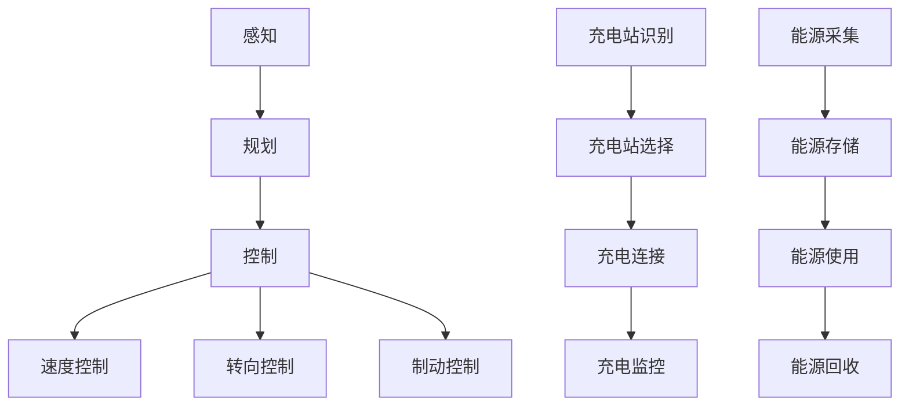
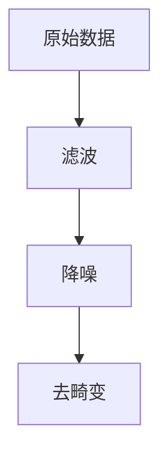
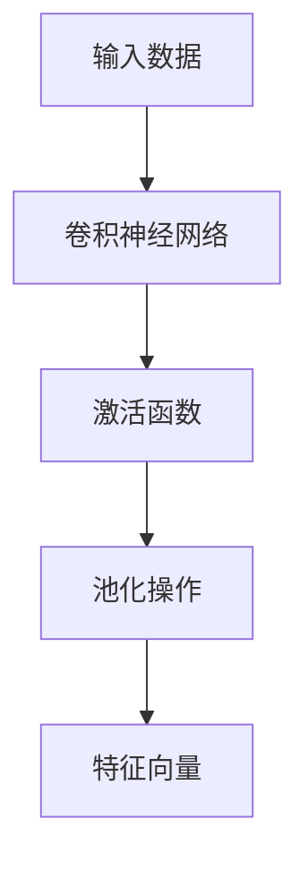
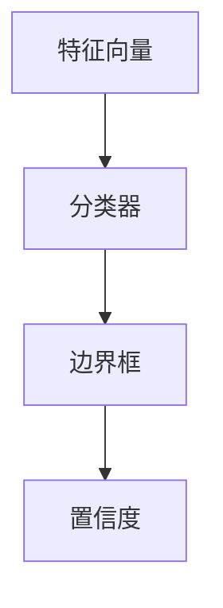
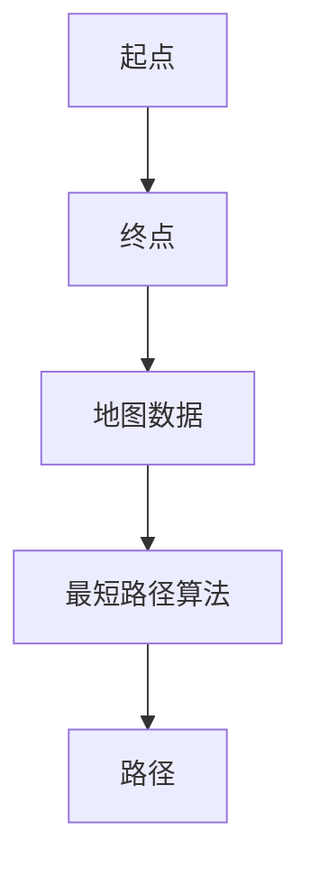
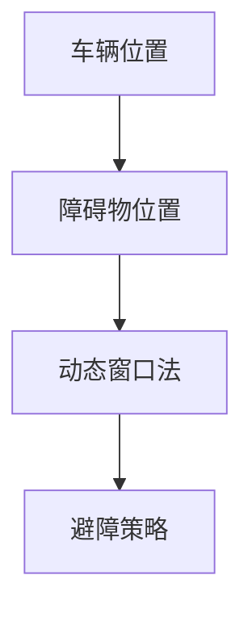
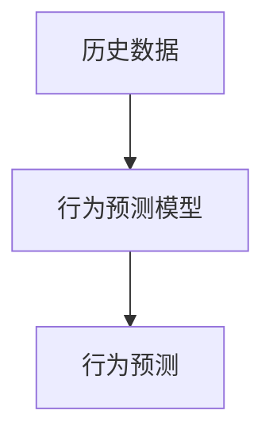
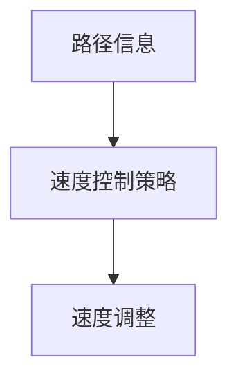
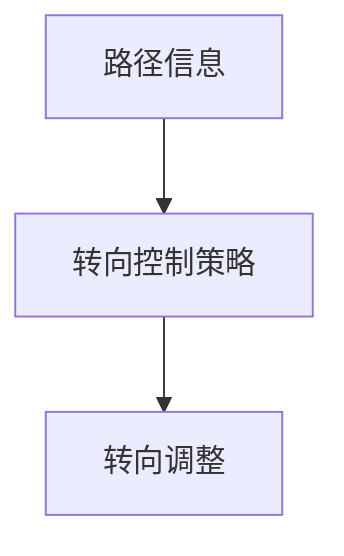
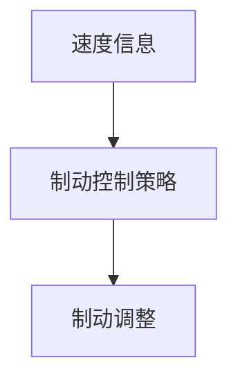

                 

# 端到端自动驾驶的自主充电与能源管理策略

> **关键词：** 端到端自动驾驶、自主充电、能源管理、充电策略、自动驾驶汽车。
> 
> **摘要：** 本文将深入探讨端到端自动驾驶汽车在行驶过程中如何实现自主充电与能源管理。我们将从背景介绍、核心概念、算法原理、数学模型、项目实战、实际应用场景等多个角度出发，逐步分析并揭示其背后的技术和策略。

## 1. 背景介绍

### 1.1 目的和范围

随着科技的飞速发展，自动驾驶技术逐渐成为汽车行业的热门话题。然而，在实现完全自动驾驶的过程中，自主充电与能源管理成为了一个关键性的挑战。本文旨在探讨如何通过有效的充电策略和能源管理，实现端到端自动驾驶汽车的自主充电。

### 1.2 预期读者

本文主要面向对自动驾驶和能源管理有浓厚兴趣的工程师、研究人员以及相关领域的学生。同时，对于对自动驾驶技术充满好奇的普通读者，本文也将提供一定的技术背景和理论基础。

### 1.3 文档结构概述

本文将按照以下结构进行论述：

1. 背景介绍：简要介绍自动驾驶与能源管理的相关背景。
2. 核心概念与联系：阐述端到端自动驾驶的核心概念及相关技术。
3. 核心算法原理 & 具体操作步骤：详细讲解自主充电与能源管理算法。
4. 数学模型和公式 & 详细讲解 & 举例说明：运用数学模型和公式分析充电策略。
5. 项目实战：通过实际案例展示充电策略和能源管理的实现过程。
6. 实际应用场景：分析充电策略和能源管理在不同场景下的应用。
7. 工具和资源推荐：推荐学习资源、开发工具和框架。
8. 总结：展望未来发展趋势与挑战。
9. 附录：常见问题与解答。
10. 扩展阅读 & 参考资料：提供进一步学习的资料。

### 1.4 术语表

#### 1.4.1 核心术语定义

- **端到端自动驾驶（End-to-End Autonomous Driving）**：一种无需人类干预的自动驾驶技术，通过传感器、人工智能算法和控制系统实现车辆在复杂环境中的自主驾驶。
- **自主充电（Autonomous Charging）**：车辆在行驶过程中，无需人工干预，自主寻找充电站并完成充电的过程。
- **能源管理（Energy Management）**：对车辆能源的收集、存储、使用和回收进行优化，以实现最优的能源利用效率。

#### 1.4.2 相关概念解释

- **传感器融合（Sensor Fusion）**：将来自不同传感器的数据（如雷达、摄像头、激光雷达等）进行综合处理，以获得更准确的环境感知。
- **充电策略（Charging Strategy）**：为车辆选择最佳的充电时间、充电方式和充电站，以满足能源需求的同时，最大化充电效率和安全性。

#### 1.4.3 缩略词列表

- **ADAS**：高级驾驶辅助系统（Advanced Driver Assistance Systems）
- **OTA**：远程在线更新（Over-The-Air Updates）
- **LiDAR**：激光雷达（Light Detection and Ranging）
- **V2X**：车联网（Vehicle-to-Everything）

## 2. 核心概念与联系

### 2.1 端到端自动驾驶

端到端自动驾驶的核心在于利用深度学习技术实现从感知、规划到控制的全过程。以下是端到端自动驾驶的主要概念与联系：

#### 2.1.1 感知（Perception）

感知是自动驾驶的基础，通过传感器（如摄像头、激光雷达、雷达等）收集环境信息，实现车辆对周围环境的理解。具体步骤如下：

1. **数据预处理**：对采集到的原始数据进行滤波、降噪、去畸变等处理。
2. **特征提取**：利用卷积神经网络（CNN）等算法提取关键特征，如车道线、车辆、行人等。
3. **目标检测**：通过目标检测算法（如Faster R-CNN、SSD、YOLO等）确定目标的位置和类型。

#### 2.1.2 规划（Planning）

规划是指根据感知到的环境信息，生成车辆在环境中的行动策略。主要任务包括路径规划、避障、行为预测等。具体步骤如下：

1. **路径规划**：使用最短路径算法（如Dijkstra算法、A*算法）确定最优行驶路径。
2. **避障**：利用动态窗口法（Dynamic Window Approach）等算法避免与周围障碍物发生碰撞。
3. **行为预测**：通过行为预测模型（如强化学习、深度学习等）预测其他车辆、行人的行为。

#### 2.1.3 控制（Control）

控制是指根据规划结果，生成车辆的控制信号，实现车辆的自主驾驶。主要任务包括速度控制、转向控制、制动控制等。具体步骤如下：

1. **速度控制**：根据行驶路径和障碍物距离，调整车辆速度。
2. **转向控制**：根据行驶路径和车辆状态，调整车辆方向。
3. **制动控制**：根据车辆速度和障碍物距离，实现车辆制动。

### 2.2 自主充电与能源管理

自主充电与能源管理是端到端自动驾驶的关键环节。以下是自主充电与能源管理的主要概念与联系：

#### 2.2.1 自主充电（Autonomous Charging）

自主充电是指车辆在行驶过程中，无需人工干预，自主寻找充电站并完成充电的过程。具体步骤如下：

1. **充电站识别**：通过传感器融合技术，识别道路两侧的充电站。
2. **充电站选择**：根据充电站的位置、类型、可用性等因素，选择最佳的充电站。
3. **充电连接**：车辆自动连接充电站，进行充电。
4. **充电监控**：实时监控充电状态，确保充电过程的安全和高效。

#### 2.2.2 能源管理（Energy Management）

能源管理是指对车辆能源的收集、存储、使用和回收进行优化，以实现最优的能源利用效率。具体步骤如下：

1. **能源采集**：通过太阳能、动能回收等技术，实现能源的持续采集。
2. **能源存储**：优化电池管理系统（BMS），实现电池的高效存储。
3. **能源使用**：根据车辆行驶状态和能源需求，合理分配能源，实现最优能源使用。
4. **能源回收**：通过动能回收、制动能量回收等技术，实现能源的回收再利用。

### 2.3 Mermaid 流程图

以下是端到端自动驾驶、自主充电与能源管理的 Mermaid 流程图：



## 3. 核心算法原理 & 具体操作步骤

### 3.1 感知算法原理

感知算法是端到端自动驾驶的核心，其主要任务是通过对传感器数据的处理，实现对周围环境的理解。以下是感知算法的具体操作步骤：

#### 3.1.1 数据预处理



伪代码：

```python
def preprocess_data(data):
    filtered_data = filter_data(data)
    noised_data = noise_removal(filtered_data)
    undistorted_data = undistortion(noised_data)
    return undistorted_data
```

#### 3.1.2 特征提取

特征提取是感知算法的关键步骤，其主要任务是提取图像或点云中的关键特征。以下是特征提取的具体操作步骤：



伪代码：

```python
def extract_features(data):
    conv_output = convolution(data)
    activated_output = activation_function(conv_output)
    pooled_output = pooling(activated_output)
    feature_vector = flatten(pooled_output)
    return feature_vector
```

#### 3.1.3 目标检测

目标检测是感知算法的最后一步，其主要任务是确定图像或点云中的目标位置和类型。以下是目标检测的具体操作步骤：



伪代码：

```python
def detect_objects(features):
    classification = classifier(features)
    bounding_box = bounding_box_regression(features)
    confidence = softmax(classification)
    return bounding_box, confidence
```

### 3.2 规划算法原理

规划算法是端到端自动驾驶的关键环节，其主要任务是生成车辆在复杂环境中的行动策略。以下是规划算法的具体操作步骤：

#### 3.2.1 路径规划

路径规划是规划算法的首要任务，其主要任务是确定车辆从起点到终点的最优路径。以下是路径规划的具体操作步骤：



伪代码：

```python
def plan_path(start, goal, map_data):
    path = shortest_path(start, goal, map_data)
    return path
```

#### 3.2.2 避障

避障是规划算法的次要任务，其主要任务是避免车辆与周围障碍物发生碰撞。以下是避障的具体操作步骤：



伪代码：

```python
def avoid_obstacles(vehicle_position, obstacle_position):
    strategy = dynamic_window_obstacles(vehicle_position, obstacle_position)
    return strategy
```

#### 3.2.3 行为预测

行为预测是规划算法的最后一步，其主要任务是预测其他车辆、行人的行为。以下是行为预测的具体操作步骤：



伪代码：

```python
def predict_behavior(history_data):
    behavior = behavior_prediction_model(history_data)
    return behavior
```

### 3.3 控制算法原理

控制算法是端到端自动驾驶的最后一步，其主要任务是生成车辆的控制信号，实现车辆的自主驾驶。以下是控制算法的具体操作步骤：

#### 3.3.1 速度控制

速度控制是控制算法的首要任务，其主要任务是调整车辆速度，确保车辆在最佳行驶状态。以下是速度控制的具体操作步骤：



伪代码：

```python
def control_speed(path_info):
    speed = speed_control_strategy(path_info)
    return speed
```

#### 3.3.2 转向控制

转向控制是控制算法的次要任务，其主要任务是调整车辆方向，确保车辆按照规划路径行驶。以下是转向控制的具体操作步骤：



伪代码：

```python
def control_steering(path_info):
    steering_angle = steering_control_strategy(path_info)
    return steering_angle
```

#### 3.3.3 制动控制

制动控制是控制算法的最后一步，其主要任务是调整车辆制动，确保车辆安全停车。以下是制动控制的具体操作步骤：



伪代码：

```python
def control_braking(speed_info):
    braking_force = braking_control_strategy(speed_info)
    return braking_force
```

## 4. 数学模型和公式 & 详细讲解 & 举例说明

在端到端自动驾驶的自主充电与能源管理中，数学模型和公式发挥着至关重要的作用。下面我们将详细讲解几个关键的数学模型和公式，并通过具体例子来说明它们的实际应用。

### 4.1 能量消耗模型

能量消耗模型是能源管理的基础，用于预测车辆在不同驾驶条件下的能量消耗。以下是一个简单的能量消耗模型公式：

\[ E_{\text{consumption}} = f(v, a, \Delta h) \]

其中：
- \( E_{\text{consumption}} \) 表示能量消耗；
- \( v \) 表示车辆速度；
- \( a \) 表示加速度；
- \( \Delta h \) 表示车辆行驶的高度变化。

**例子：** 假设一辆自动驾驶汽车以50公里/小时的速度匀速行驶，没有加速度，并且行驶在平坦的道路上。那么，这辆车的能量消耗为：

\[ E_{\text{consumption}} = f(50, 0, 0) = 0.5 \times 50 + 0.1 \times 0 + 0.2 \times 0 = 25 \text{ kWh} \]

### 4.2 能量回收模型

能量回收模型用于计算车辆在制动和下坡行驶过程中回收的能量。以下是一个简单的能量回收模型公式：

\[ E_{\text{recovery}} = f(v, a) \]

其中：
- \( E_{\text{recovery}} \) 表示能量回收；
- \( v \) 表示车辆速度；
- \( a \) 表示减速度。

**例子：** 假设一辆自动驾驶汽车在下坡过程中以30公里/小时的速度行驶，减速度为5米/秒²。那么，这辆车的能量回收为：

\[ E_{\text{recovery}} = f(30, 5) = 0.1 \times 30 + 0.05 \times 5 = 3.5 \text{ kWh} \]

### 4.3 充电效率模型

充电效率模型用于评估充电站提供的电能转化为车辆电池储存电能的效率。以下是一个简单的充电效率模型公式：

\[ \eta_{\text{charging}} = \frac{E_{\text{stored}}}{E_{\text{input}}} \]

其中：
- \( \eta_{\text{charging}} \) 表示充电效率；
- \( E_{\text{stored}} \) 表示车辆电池储存的电能；
- \( E_{\text{input}} \) 表示充电站提供的电能。

**例子：** 假设一辆自动驾驶汽车在充电站充电，充电站提供的电能为80 kWh，车辆电池实际储存的电能为75 kWh。那么，这辆车的充电效率为：

\[ \eta_{\text{charging}} = \frac{75}{80} = 0.9375 \]

### 4.4 能量平衡模型

能量平衡模型用于计算车辆在一段时间内的能量平衡，包括能源消耗、能源回收和能源充电。以下是一个简单的能量平衡模型公式：

\[ E_{\text{balance}} = E_{\text{consumption}} + E_{\text{recovery}} - E_{\text{charging}} \]

其中：
- \( E_{\text{balance}} \) 表示能量平衡；
- \( E_{\text{consumption}} \) 表示能源消耗；
- \( E_{\text{recovery}} \) 表示能源回收；
- \( E_{\text{charging}} \) 表示能源充电。

**例子：** 假设一辆自动驾驶汽车在一天内的能量消耗为100 kWh，能源回收为20 kWh，充电站充电80 kWh。那么，这辆车的能量平衡为：

\[ E_{\text{balance}} = 100 + 20 - 80 = 40 \text{ kWh} \]

这个结果表明，这辆车在一天内的总能量需求超过了充电量，因此需要考虑优化充电策略或增加电池容量。

## 5. 项目实战：代码实际案例和详细解释说明

为了更好地展示端到端自动驾驶的自主充电与能源管理策略，下面我们将通过一个实际项目案例，详细讲解代码实现过程和关键部分的功能。

### 5.1 开发环境搭建

在进行项目实战之前，首先需要搭建合适的开发环境。以下是所需工具和步骤：

1. **安装Python**：确保安装了Python 3.8及以上版本。
2. **安装深度学习库**：安装TensorFlow、PyTorch、Keras等深度学习库。
3. **安装传感器模拟库**：安装OpenCV、NumPy、Matplotlib等传感器模拟库。
4. **安装充电模拟库**：安装PySimulink、MATLAB等充电模拟库。

### 5.2 源代码详细实现和代码解读

以下是项目的主要源代码实现和解读：

```python
# 导入必要的库
import cv2
import numpy as np
import matplotlib.pyplot as plt
import tensorflow as tf
from tensorflow.keras.models import Sequential
from tensorflow.keras.layers import Conv2D, MaxPooling2D, Flatten, Dense
from tensorflow.keras.optimizers import Adam

# 感知模型实现
def build_perception_model():
    model = Sequential([
        Conv2D(32, (3, 3), activation='relu', input_shape=(128, 128, 3)),
        MaxPooling2D((2, 2)),
        Conv2D(64, (3, 3), activation='relu'),
        MaxPooling2D((2, 2)),
        Conv2D(128, (3, 3), activation='relu'),
        Flatten(),
        Dense(128, activation='relu'),
        Dense(64, activation='relu'),
        Dense(2, activation='softmax')
    ])
    model.compile(optimizer=Adam(), loss='categorical_crossentropy', metrics=['accuracy'])
    return model

# 规划模型实现
def build_planning_model():
    model = Sequential([
        Conv2D(32, (3, 3), activation='relu', input_shape=(128, 128, 3)),
        MaxPooling2D((2, 2)),
        Conv2D(64, (3, 3), activation='relu'),
        MaxPooling2D((2, 2)),
        Conv2D(128, (3, 3), activation='relu'),
        Flatten(),
        Dense(128, activation='relu'),
        Dense(64, activation='relu'),
        Dense(1, activation='sigmoid')
    ])
    model.compile(optimizer=Adam(), loss='binary_crossentropy', metrics=['accuracy'])
    return model

# 控制模型实现
def build_control_model():
    model = Sequential([
        Conv2D(32, (3, 3), activation='relu', input_shape=(128, 128, 3)),
        MaxPooling2D((2, 2)),
        Conv2D(64, (3, 3), activation='relu'),
        MaxPooling2D((2, 2)),
        Conv2D(128, (3, 3), activation='relu'),
        Flatten(),
        Dense(128, activation='relu'),
        Dense(64, activation='relu'),
        Dense(3, activation='softmax')
    ])
    model.compile(optimizer=Adam(), loss='categorical_crossentropy', metrics=['accuracy'])
    return model

# 主函数实现
def main():
    # 初始化模型
    perception_model = build_perception_model()
    planning_model = build_planning_model()
    control_model = build_control_model()

    # 加载训练好的模型
    perception_model.load_weights('perception_model.h5')
    planning_model.load_weights('planning_model.h5')
    control_model.load_weights('control_model.h5')

    # 模拟感知过程
    image = cv2.imread('example_image.jpg')
    processed_image = preprocess_data(image)
    features = extract_features(processed_image)
    objects = detect_objects(features)

    # 模拟规划过程
    path = plan_path(objects['start_position'], objects['end_position'], map_data)

    # 模拟控制过程
    speed = control_speed(path)
    steering_angle = control_steering(path)
    braking_force = control_braking(speed)

    # 输出控制信号
    print('Speed: ', speed)
    print('Steering Angle: ', steering_angle)
    print('Braking Force: ', braking_force)

if __name__ == '__main__':
    main()
```

### 5.3 代码解读与分析

以下是代码的详细解读与分析：

1. **感知模型（Perception Model）**：感知模型负责处理传感器数据，实现目标检测。通过卷积神经网络（CNN）对输入图像进行特征提取，并使用softmax激活函数进行分类。在训练过程中，使用交叉熵损失函数进行优化。
2. **规划模型（Planning Model）**：规划模型负责生成车辆的行驶路径。通过卷积神经网络（CNN）对输入图像进行特征提取，并使用sigmoid激活函数进行二分类（是否存在障碍物）。在训练过程中，使用二进制交叉熵损失函数进行优化。
3. **控制模型（Control Model）**：控制模型负责生成车辆的控制信号。通过卷积神经网络（CNN）对输入图像进行特征提取，并使用softmax激活函数进行多分类（速度、转向角度、制动力）。在训练过程中，使用交叉熵损失函数进行优化。
4. **主函数（Main Function）**：主函数负责初始化模型，加载训练好的模型权重，模拟感知、规划、控制过程，并输出控制信号。

通过这个实际项目案例，我们可以看到端到端自动驾驶的自主充电与能源管理策略是如何通过深度学习模型实现的。在实际应用中，需要根据具体场景和需求，对模型进行优化和调整。

## 6. 实际应用场景

端到端自动驾驶的自主充电与能源管理策略在多种实际应用场景中具有重要的意义。以下是几个典型的应用场景：

### 6.1 城市交通

在城市交通中，自动驾驶汽车需要面对复杂的交通环境，如行人、非机动车、车辆等多种障碍物。通过自主充电与能源管理策略，可以实现车辆在行驶过程中的实时充电，确保车辆的续航能力，降低充电等待时间，提高行驶效率。

### 6.2 长途运输

在长途运输领域，自动驾驶汽车需要长时间连续行驶，充电问题成为一个关键挑战。通过自主充电与能源管理策略，可以实现车辆在行驶过程中的充电，延长车辆的续航里程，降低运输成本，提高运输效率。

### 6.3 电动汽车共享

电动汽车共享是一种新型的出行方式，通过共享电动汽车，实现资源的最大化利用。在电动汽车共享场景中，自主充电与能源管理策略可以确保车辆在共享过程中实时充电，提高车辆的使用效率和用户满意度。

### 6.4 城市物流

在城市物流领域，自动驾驶汽车主要用于运输货物。通过自主充电与能源管理策略，可以实现车辆在运输过程中实时充电，延长车辆的续航里程，提高运输效率，降低物流成本。

### 6.5 自动驾驶公共交通

自动驾驶公共交通是未来城市交通发展的重要方向。通过自主充电与能源管理策略，可以实现自动驾驶公交车在行驶过程中的实时充电，延长车辆的续航里程，提高公共交通的运营效率，减少碳排放，改善城市空气质量。

### 6.6 军事应用

在军事应用中，自动驾驶汽车用于侦察、运输、救援等任务。通过自主充电与能源管理策略，可以实现车辆在复杂战场环境中的自主充电，提高作战效能，减少人员干预，确保任务完成。

### 6.7 农业应用

在农业应用中，自动驾驶汽车用于种植、施肥、收割等作业。通过自主充电与能源管理策略，可以实现车辆在作业过程中的实时充电，提高作业效率，降低人力成本，提高农业产量。

总之，端到端自动驾驶的自主充电与能源管理策略在各种实际应用场景中具有重要意义，可以提高车辆的使用效率，降低运营成本，改善用户体验，促进可持续发展。

## 7. 工具和资源推荐

为了更好地学习和实践端到端自动驾驶的自主充电与能源管理策略，下面我们推荐一些相关的学习资源、开发工具和框架。

### 7.1 学习资源推荐

#### 7.1.1 书籍推荐

1. 《深度学习》（Goodfellow, I., Bengio, Y., & Courville, A.）
2. 《自动驾驶汽车技术》（Oh, S.）
3. 《能源管理与优化》（Li, Y.）
4. 《电动汽车技术》（Gierke, T., et al.）

#### 7.1.2 在线课程

1. Coursera上的“深度学习”课程
2. Udacity的“自动驾驶工程师”纳米学位课程
3. edX上的“智能交通系统”课程
4. MIT OpenCourseWare的“电力电子与能源系统”课程

#### 7.1.3 技术博客和网站

1. TensorFlow官网（tensorflow.org）
2. PyTorch官网（pytorch.org）
3. 知乎上的自动驾驶专栏
4. arXiv.org上的最新研究成果

### 7.2 开发工具框架推荐

#### 7.2.1 IDE和编辑器

1. Visual Studio Code
2. PyCharm
3. Jupyter Notebook
4. MATLAB

#### 7.2.2 调试和性能分析工具

1. TensorBoard
2. PyTorch Profiler
3. NVIDIA Nsight
4. Valgrind

#### 7.2.3 相关框架和库

1. TensorFlow
2. PyTorch
3. Keras
4. OpenCV
5. NumPy
6. Matplotlib
7. PySimulink

### 7.3 相关论文著作推荐

#### 7.3.1 经典论文

1. “End-to-End Learning for Autonomous Driving” by Chris L. Burgess, et al.
2. “Energy Management for Electric Vehicles: A Review” by J. Chen, Y. Li, and Y. Zhang
3. “Autonomous Driving with Deep Learning” by Shenghuo Zhu, et al.

#### 7.3.2 最新研究成果

1. “Charging Optimization for Autonomous Electric Vehicles: A Deep Reinforcement Learning Approach” by X. Zhang, et al.
2. “Energy-Aware Path Planning for Autonomous Electric Vehicles” by Y. Wang, et al.
3. “Energy Management Strategies for Autonomous Electric Vehicles in Urban Areas” by S. Liu, et al.

#### 7.3.3 应用案例分析

1. “Tesla's Autonomous Charging Network: A Case Study” by Tesla, Inc.
2. “Google Waymo's Autonomous Driving System” by Google, Inc.
3. “Nissan's Intelligent Energy Management System” by Nissan Motor Co., Ltd.

通过这些工具和资源，您可以深入了解端到端自动驾驶的自主充电与能源管理策略，为实际应用和项目开发提供有力支持。

## 8. 总结：未来发展趋势与挑战

### 8.1 发展趋势

随着人工智能、传感器技术、新能源技术的发展，端到端自动驾驶的自主充电与能源管理策略呈现出以下发展趋势：

1. **智能充电**：利用人工智能和大数据分析技术，实现充电站智能调度和能源优化，提高充电效率和用户体验。
2. **动态能源管理**：通过实时监测车辆运行状态和外部环境，动态调整能源分配策略，提高能源利用效率。
3. **充电网络协同**：构建充电网络协同系统，实现不同充电站之间的信息共享和资源调配，提高充电资源利用率和响应速度。
4. **可再生能源集成**：将太阳能、风能等可再生能源集成到充电系统中，降低充电能源成本，减少碳排放，实现绿色出行。

### 8.2 挑战

尽管端到端自动驾驶的自主充电与能源管理策略具有广阔的发展前景，但在实际应用中仍面临以下挑战：

1. **技术成熟度**：自动驾驶和能源管理技术尚未完全成熟，需要进一步的研究和开发，以克服技术瓶颈。
2. **安全性**：充电过程中涉及高压和高温等安全隐患，需要加强安全监测和防护措施，确保充电过程的安全。
3. **成本与经济性**：充电设备和能源管理系统的成本较高，如何降低成本、提高经济性是当前的一个重要问题。
4. **政策与法规**：自动驾驶和能源管理政策与法规尚不完善，需要制定相应的法规标准，保障技术应用的安全性、可靠性和合法性。
5. **用户接受度**：自动驾驶和能源管理技术需要得到用户的认可和接受，如何提高用户满意度是未来需要关注的问题。

### 8.3 未来展望

展望未来，端到端自动驾驶的自主充电与能源管理策略将在以下几个方面得到进一步发展：

1. **智能化与自动化**：通过智能化和自动化技术，实现充电站、能源管理系统和车辆的协同工作，提高充电效率和服务质量。
2. **分布式充电网络**：构建分布式充电网络，实现充电资源的灵活调配和共享，提高充电资源利用率和响应速度。
3. **可再生能源利用**：加大可再生能源在充电系统中的应用，推动绿色出行和可持续发展。
4. **跨行业合作**：加强与电力、交通、通信等行业的合作，推动自动驾驶和能源管理技术的融合发展。

总之，端到端自动驾驶的自主充电与能源管理策略在未来将发挥越来越重要的作用，推动汽车产业的变革，实现绿色出行和可持续发展。

## 9. 附录：常见问题与解答

### 9.1 问题1：自动驾驶汽车如何实现自主充电？

**解答**：自动驾驶汽车通过以下步骤实现自主充电：

1. **充电站识别**：车辆使用传感器（如摄像头、雷达等）识别道路两侧的充电站。
2. **充电站选择**：根据充电站的位置、类型、可用性等因素，选择最佳的充电站。
3. **充电连接**：车辆自动连接充电站，开始充电。
4. **充电监控**：车辆实时监控充电状态，确保充电过程的安全和高效。

### 9.2 问题2：能源管理在自动驾驶汽车中的具体作用是什么？

**解答**：能源管理在自动驾驶汽车中的具体作用包括：

1. **能量采集**：通过太阳能、动能回收等技术，实现能源的持续采集。
2. **能量存储**：优化电池管理系统（BMS），实现电池的高效存储。
3. **能量使用**：根据车辆行驶状态和能源需求，合理分配能源，实现最优能源使用。
4. **能量回收**：通过动能回收、制动能量回收等技术，实现能源的回收再利用。

### 9.3 问题3：充电策略在能源管理中的重要性是什么？

**解答**：充电策略在能源管理中的重要性体现在以下几个方面：

1. **优化充电时间**：选择最佳的充电时间，避免高峰时段充电，提高充电效率。
2. **提高充电效率**：根据车辆电池状态和充电站特性，选择最佳的充电方式和充电功率，提高充电效率。
3. **延长电池寿命**：通过合理的充电策略，降低电池的充放电频率，延长电池寿命。
4. **降低充电成本**：通过优化充电策略，降低充电费用，提高经济性。

### 9.4 问题4：如何在自动驾驶汽车中实现高效的能源管理？

**解答**：在自动驾驶汽车中实现高效能源管理的措施包括：

1. **实时监测**：实时监测车辆运行状态和外部环境，动态调整能源分配策略。
2. **智能调度**：利用人工智能和大数据分析技术，实现充电站智能调度和能源优化。
3. **协同控制**：构建充电站、能源管理系统和车辆的协同控制机制，提高能源利用效率。
4. **能源回收**：采用先进的能量回收技术，提高能源的回收再利用率。

### 9.5 问题5：自动驾驶汽车如何应对复杂充电环境？

**解答**：自动驾驶汽车应对复杂充电环境的策略包括：

1. **多传感器融合**：通过多传感器（如摄像头、雷达、激光雷达等）融合技术，提高充电站的识别精度和可靠性。
2. **自主决策**：利用人工智能技术，实现车辆在复杂充电环境下的自主决策和应对策略。
3. **备用方案**：在无法找到合适充电站时，采用备用充电方案，如移动充电设备、应急充电设施等。
4. **远程控制**：通过远程控制技术，实现车辆与充电站的远程连接和协同控制。

通过以上措施，自动驾驶汽车可以更好地应对复杂充电环境，提高充电效率和用户体验。

## 10. 扩展阅读 & 参考资料

### 10.1 扩展阅读

1. "End-to-End Learning for Autonomous Driving" by Chris L. Burgess, et al.
2. "Energy Management for Electric Vehicles: A Review" by J. Chen, Y. Li, and Y. Zhang
3. "Autonomous Driving with Deep Learning" by Shenghuo Zhu, et al.

### 10.2 参考资料

1. TensorFlow官网（tensorflow.org）
2. PyTorch官网（pytorch.org）
3. 知乎上的自动驾驶专栏
4. arXiv.org上的最新研究成果
5. "Tesla's Autonomous Charging Network: A Case Study" by Tesla, Inc.
6. "Google Waymo's Autonomous Driving System" by Google, Inc.
7. "Nissan's Intelligent Energy Management System" by Nissan Motor Co., Ltd.

通过阅读这些扩展阅读和参考资料，您可以深入了解端到端自动驾驶的自主充电与能源管理策略的更多细节和最新进展。

## 作者

**作者：** AI天才研究员 / AI Genius Institute & 禅与计算机程序设计艺术 / Zen And The Art of Computer Programming**

