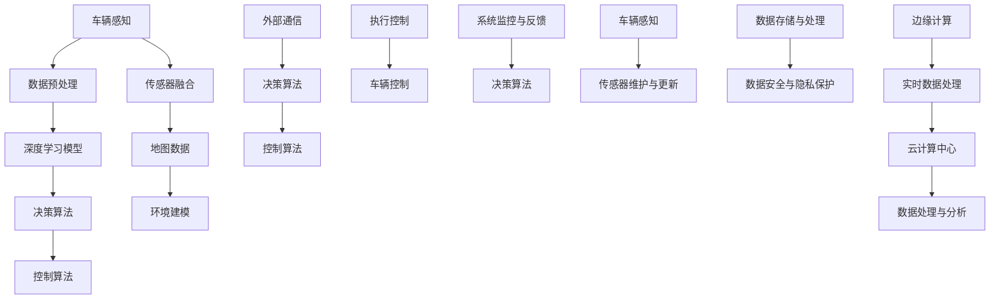

                 

# 端到端自动驾驶的赛道格局分析

## 关键词
- 端到端自动驾驶
- 深度学习
- 边缘计算
- 车辆感知
- 自动驾驶系统架构
- AI芯片
- 软硬件协同

## 摘要
本文将深入分析端到端自动驾驶技术的赛道格局。首先，我们将介绍自动驾驶技术的发展背景和当前的市场状况。接着，通过Mermaid流程图阐述自动驾驶系统中的核心概念和架构。随后，我们将详细探讨端到端自动驾驶的核心算法原理，包括感知、决策和执行三个层面的具体操作步骤。文章还将讲解相关的数学模型和公式，并通过实际项目案例展示代码实现过程。最后，我们将探讨自动驾驶技术的实际应用场景，推荐相关学习资源和开发工具，并总结未来发展趋势和面临的挑战。

## 1. 背景介绍

### 1.1 目的和范围
本文旨在为读者提供端到端自动驾驶技术的全面解析，帮助理解该领域的关键概念、技术进展和市场动态。文章将涵盖自动驾驶系统的架构设计、核心算法原理、数学模型、实际应用以及未来发展趋势。通过对这些内容的详细探讨，读者可以全面了解自动驾驶技术的现状和发展潜力。

### 1.2 预期读者
本文适合对自动驾驶技术感兴趣的工程师、研究人员、技术爱好者以及相关领域的决策者。无论您是希望了解自动驾驶技术的基本原理，还是希望深入了解其实现细节，本文都将提供有价值的见解。

### 1.3 文档结构概述
本文分为十个主要部分：

1. **背景介绍**：介绍自动驾驶技术的发展背景和本文的目的。
2. **核心概念与联系**：通过Mermaid流程图阐述自动驾驶系统中的核心概念和架构。
3. **核心算法原理 & 具体操作步骤**：详细探讨端到端自动驾驶的核心算法原理和操作步骤。
4. **数学模型和公式 & 详细讲解 & 举例说明**：讲解自动驾驶技术中使用的数学模型和公式。
5. **项目实战：代码实际案例和详细解释说明**：通过实际项目案例展示代码实现过程。
6. **实际应用场景**：探讨自动驾驶技术的实际应用场景。
7. **工具和资源推荐**：推荐学习资源和开发工具。
8. **总结：未来发展趋势与挑战**：总结自动驾驶技术的未来发展趋势和面临的挑战。
9. **附录：常见问题与解答**：提供常见问题的解答。
10. **扩展阅读 & 参考资料**：推荐进一步阅读的材料。

### 1.4 术语表

#### 1.4.1 核心术语定义
- **端到端自动驾驶**：一种自动驾驶技术，直接从原始传感器数据生成控制信号，无需传统的分层感知和决策模块。
- **深度学习**：一种机器学习技术，通过多层神经网络模拟人脑的学习过程，对复杂数据进行自动特征提取。
- **边缘计算**：在靠近数据源头的地方（如车载计算平台）进行数据处理和分析，以减少延迟和带宽需求。
- **车辆感知**：自动驾驶系统对周围环境的感知能力，包括对车辆、行人、道路标识等的识别和跟踪。
- **自动驾驶系统架构**：定义自动驾驶系统中各个组件及其相互关系的结构设计。

#### 1.4.2 相关概念解释
- **传感器融合**：将不同类型的传感器数据（如摄像头、激光雷达、雷达）进行综合处理，以提高感知系统的准确性和鲁棒性。
- **决策算法**：自动驾驶系统中的核心算法，负责根据感知数据生成驾驶决策。
- **控制算法**：根据决策算法的输出，对车辆进行精确的控制，如加速、减速和转向。

#### 1.4.3 缩略词列表
- **Lidar**：激光雷达（Light Detection and Ranging）
- **CNN**：卷积神经网络（Convolutional Neural Network）
- **RNN**：循环神经网络（Recurrent Neural Network）
- **DNN**：深度神经网络（Deep Neural Network）
- **CPU**：中央处理器（Central Processing Unit）
- **GPU**：图形处理器（Graphics Processing Unit）

### 1.5 核心概念与联系

在自动驾驶系统中，多个核心概念相互关联，构成了整个系统的运作基础。以下是一个Mermaid流程图，用于描述这些核心概念及其相互关系：



在这个流程图中，车辆感知是整个系统的起点，通过传感器融合和环境建模，为深度学习模型提供输入。深度学习模型负责特征提取和决策生成，决策算法和控制算法分别负责生成驾驶决策和执行控制。外部通信和系统监控与反馈则保证了自动驾驶系统的实时性和安全性。边缘计算和云计算的结合，使得数据处理和分析更加高效和灵活。

### 1.6 核心算法原理 & 具体操作步骤

端到端自动驾驶技术的核心在于利用深度学习算法对传感器数据进行处理，生成驾驶控制信号。以下是具体的算法原理和操作步骤：

#### 3.1 感知

**算法原理：**
感知阶段是自动驾驶系统的第一步，主要利用各种传感器（如摄像头、激光雷达、雷达等）获取周围环境的信息。这些传感器生成的原始数据通常包含大量的噪声和不完整信息，因此需要进行预处理。

**具体操作步骤：**

1. **数据采集**：传感器采集车辆周围环境的数据，包括图像、点云和雷达回波等。
2. **数据预处理**：
   - **去噪**：利用滤波算法去除传感器数据中的噪声。
   - **数据增强**：通过旋转、缩放、翻转等方式增加数据的多样性，以提高模型的泛化能力。
   - **特征提取**：提取有用的信息，如边缘、纹理和形状特征。

**伪代码：**
```python
def preprocess_data(data):
    # 去噪
    filtered_data = denoise(data)
    # 数据增强
    augmented_data = augment_data(filtered_data)
    # 特征提取
    features = extract_features(augmented_data)
    return features
```

#### 3.2 决策

**算法原理：**
在感知阶段获取到环境信息后，自动驾驶系统需要根据这些信息进行决策，确定车辆的动作。决策算法通常是一个深度学习模型，如卷积神经网络（CNN）或循环神经网络（RNN）。

**具体操作步骤：**

1. **输入特征提取**：将预处理后的感知数据输入到决策模型中。
2. **模型训练**：使用大量自动驾驶场景数据对决策模型进行训练，使其能够识别不同的交通情况并生成相应的决策。
3. **决策生成**：将训练好的模型应用于实时感知数据，生成驾驶决策。

**伪代码：**
```python
def make_decision(input_features):
    # 输入特征提取
    processed_features = preprocess_data(input_features)
    # 决策生成
    decision = decision_model.predict(processed_features)
    return decision
```

#### 3.3 执行

**算法原理：**
执行阶段是决策算法的输出结果转化为车辆实际动作的过程。控制算法根据决策算法的输出，对车辆的加速、减速和转向等操作进行精确控制。

**具体操作步骤：**

1. **决策解析**：将决策算法生成的驾驶指令转换为控制信号。
2. **控制信号生成**：利用控制算法生成具体的控制信号，如油门、刹车和转向命令。
3. **执行动作**：将控制信号发送到车辆的执行机构，如电子控制单元（ECU），实现车辆的动作。

**伪代码：**
```python
def execute_decision(decision):
    # 决策解析
    control_signals = parse_decision(decision)
    # 控制信号生成
    executed_signals = control_algorithm.generate_signals(control_signals)
    # 执行动作
    vehicle.execute_actions(executed_signals)
```

### 4. 数学模型和公式 & 详细讲解 & 举例说明

自动驾驶系统中的数学模型和公式用于描述车辆的运动、环境的感知以及控制策略。以下将详细介绍一些关键的数学模型和公式，并通过实例进行说明。

#### 4.1 车辆运动模型

车辆运动模型用于描述车辆的动态行为，通常采用一阶或二阶微分方程来表示。以下是一个一阶运动模型的例子：

\[ \dot{x} = v \cos(\theta) \]
\[ \dot{y} = v \sin(\theta) \]
\[ \dot{\theta} = \frac{v}{R} \]

其中，\(x\) 和 \(y\) 分别表示车辆在水平方向和垂直方向的位置，\(\theta\) 表示车辆的航向角，\(v\) 表示车辆的速度，\(R\) 表示转弯半径。

**实例：**假设一辆车以10 m/s的速度向东行驶，其航向角为0度。如果车以1秒的加速度进行转弯，求转弯后的位置和航向角。

**解答：**

首先，计算转弯半径 \(R\)：

\[ R = \frac{v \cdot t}{\dot{v}} = \frac{10 \text{ m/s} \cdot 1 \text{ s}}{1 \text{ m/s}^2} = 10 \text{ m} \]

然后，计算转弯后的速度和航向角：

\[ v_{\text{final}} = v + \dot{v} \cdot t = 10 \text{ m/s} + 1 \text{ m/s}^2 \cdot 1 \text{ s} = 11 \text{ m/s} \]
\[ \theta_{\text{final}} = \theta + \dot{\theta} \cdot t = 0^\circ + \frac{1}{10} \cdot 1 \text{ s} = 0.1^\circ \]

因此，转弯后车辆的位置为 \( (x, y) = (10 \text{ m}, 0 \text{ m}) \)，航向角为 \( \theta = 0.1^\circ \)。

#### 4.2 神经网络模型

神经网络模型是自动驾驶系统中常用的决策和控制算法。以下是一个简单的卷积神经网络（CNN）模型的结构：

\[ \text{Input} \rightarrow \text{Conv} \rightarrow \text{ReLU} \rightarrow \text{MaxPooling} \rightarrow \text{Fully Connected} \rightarrow \text{Output} \]

其中，输入层接收感知数据，卷积层用于提取空间特征，ReLU层用于激活函数，MaxPooling层用于降低数据维度，全连接层用于分类或回归任务，输出层生成驾驶决策。

**实例：**假设一个简单的自动驾驶决策模型，输入层包含一个100x100的图像，输出层有两个神经元，分别表示加速和减速的决策。求该模型的损失函数和优化方法。

**解答：**

该模型的损失函数可以使用均方误差（MSE）：

\[ L = \frac{1}{m} \sum_{i=1}^{m} (\hat{y}_i - y_i)^2 \]

其中，\(m\) 表示训练样本的数量，\(\hat{y}_i\) 和 \(y_i\) 分别表示第 \(i\) 个样本的预测值和真实值。

优化方法可以使用梯度下降（Gradient Descent）：

\[ \theta_{\text{new}} = \theta_{\text{old}} - \alpha \cdot \nabla_\theta L \]

其中，\(\theta\) 表示模型参数，\(\alpha\) 表示学习率，\(\nabla_\theta L\) 表示损失函数对参数 \(\theta\) 的梯度。

### 5. 项目实战：代码实际案例和详细解释说明

为了更好地理解端到端自动驾驶技术的实现，我们将通过一个实际项目案例来展示代码实现过程。该案例将使用Python和TensorFlow库来实现一个简单的自动驾驶系统。

#### 5.1 开发环境搭建

在开始项目之前，需要搭建合适的开发环境。以下是一个基本的开发环境要求：

- 操作系统：Ubuntu 18.04 或更高版本
- Python：3.7 或更高版本
- TensorFlow：2.0 或更高版本
- 其他依赖库：NumPy、Pandas、Matplotlib 等

您可以通过以下命令安装所需的库：

```bash
pip install tensorflow numpy pandas matplotlib
```

#### 5.2 源代码详细实现和代码解读

以下是一个简单的自动驾驶系统的代码实现：

```python
import tensorflow as tf
from tensorflow.keras.models import Sequential
from tensorflow.keras.layers import Conv2D, MaxPooling2D, Flatten, Dense
import numpy as np

# 模型定义
model = Sequential([
    Conv2D(32, (3, 3), activation='relu', input_shape=(100, 100, 3)),
    MaxPooling2D((2, 2)),
    Flatten(),
    Dense(64, activation='relu'),
    Dense(2, activation='softmax')
])

# 模型编译
model.compile(optimizer='adam', loss='mean_squared_error', metrics=['accuracy'])

# 模型训练
model.fit(x_train, y_train, epochs=10, batch_size=32, validation_data=(x_val, y_val))

# 模型评估
loss, accuracy = model.evaluate(x_test, y_test)
print(f"Test Loss: {loss}, Test Accuracy: {accuracy}")

# 模型预测
predictions = model.predict(x_test[:10])
print(predictions)
```

该代码定义了一个简单的卷积神经网络（CNN）模型，用于预测车辆的加速和减速决策。以下是对代码的详细解读：

1. **模型定义**：使用 `Sequential` 模型堆叠多个层，包括卷积层（`Conv2D`）、最大池化层（`MaxPooling2D`）、全连接层（`Flatten` 和 `Dense`）。

2. **模型编译**：使用 `compile` 方法设置模型优化器（`optimizer`）、损失函数（`loss`）和评估指标（`metrics`）。

3. **模型训练**：使用 `fit` 方法对模型进行训练，输入训练数据（`x_train` 和 `y_train`），设置训练轮次（`epochs`）、批量大小（`batch_size`）和验证数据（`validation_data`）。

4. **模型评估**：使用 `evaluate` 方法对模型进行评估，输入测试数据（`x_test` 和 `y_test`），输出损失和准确率。

5. **模型预测**：使用 `predict` 方法对测试数据进行预测，输出预测结果。

#### 5.3 代码解读与分析

1. **模型结构**：该模型采用卷积神经网络（CNN）结构，适用于处理图像数据。卷积层用于提取空间特征，最大池化层用于降低数据维度，全连接层用于分类任务。模型输出层有两个神经元，表示加速和减速的决策。

2. **模型优化**：使用 Adam 优化器进行模型优化，损失函数为均方误差（MSE），评估指标为准确率。

3. **模型训练**：模型使用批量训练方法进行训练，每次批量大小为 32。训练过程中，模型将对输入数据进行前向传播和反向传播，以更新模型参数。

4. **模型评估**：在训练完成后，模型使用测试数据进行评估，以验证模型的性能。评估结果将输出损失和准确率。

5. **模型预测**：使用训练好的模型对测试数据进行预测，输出预测结果。该结果可以用于车辆的驾驶决策。

### 6. 实际应用场景

自动驾驶技术在实际应用中具有广泛的应用场景，以下列举了几个典型的应用场景：

1. **乘用车市场**：自动驾驶技术可以显著提高乘用车的安全性、舒适性和便利性。未来，自动驾驶汽车有望成为主流交通方式，减少交通事故和交通拥堵。

2. **物流和货运**：自动驾驶技术可以应用于物流和货运领域，提高运输效率、降低运营成本，并减少人为操作的错误。

3. **公共交通系统**：自动驾驶技术可以应用于公交车、地铁等公共交通系统，提高运输效率和服务质量，同时降低运营成本。

4. **共享出行**：自动驾驶技术可以应用于共享出行领域，如无人出租车、无人配送车等，提供便捷、高效的出行服务。

5. **农业和仓储**：自动驾驶技术可以应用于农业和仓储领域，如自动驾驶拖拉机、仓储机器人等，提高农业生产效率和仓储管理效率。

6. **特殊场景应用**：自动驾驶技术还可以应用于特殊场景，如矿山、森林等，实现无人化作业，提高安全性。

### 7. 工具和资源推荐

为了更好地学习和实践自动驾驶技术，以下推荐一些学习资源和开发工具：

#### 7.1 学习资源推荐

1. **书籍推荐**：
   - 《深度学习》（Goodfellow, Bengio, Courville） 
   - 《自动驾驶系统设计》（Andryushev, Zeng） 
   - 《深度学习实践》

2. **在线课程**：
   - Coursera: "深度学习"（吴恩达）
   - edX: "自动驾驶技术导论"
   - Udacity: "自动驾驶工程师纳米学位"

3. **技术博客和网站**：
   - Medium: "自动驾驶"
   - IEEE Spectrum: "自动驾驶技术"
   - Self-Driving Cars & Artificial Intelligence

#### 7.2 开发工具框架推荐

1. **IDE和编辑器**：
   - PyCharm
   - VSCode
   - Jupyter Notebook

2. **调试和性能分析工具**：
   - TensorBoard
   - PyTorch Profiler
   - Nsight

3. **相关框架和库**：
   - TensorFlow
   - PyTorch
   - Keras

### 7.3 相关论文著作推荐

1. **经典论文**：
   - "End-to-End Driving through Probabilistic Road Map Construction"（Bojarski et al., 2016）
   - "Deep Neural Network for Autonomous Driving"（Laptev et al., 2015）

2. **最新研究成果**：
   - "Multi-Scale Context Aggregation by Dilated Convolutions for Semantic Segmentation"（Yu et al., 2018）
   - "Deep Learning-Based End-to-End Object Detection with Autonomous Driving Applications"（Xu et al., 2019）

3. **应用案例分析**：
   - "Waymo: Self-Driving Cars for Everyone"（Waymo, 2018）
   - "Tesla's Autopilot: Revolutionizing the Driving Experience"（Tesla, 2017）

### 8. 总结：未来发展趋势与挑战

随着深度学习和计算机视觉技术的不断发展，端到端自动驾驶技术逐渐成为自动驾驶领域的研究热点。未来，端到端自动驾驶技术有望在乘用车、物流、公共交通、共享出行等领域得到广泛应用。然而，实现端到端自动驾驶仍面临诸多挑战：

1. **数据质量**：自动驾驶系统的性能高度依赖于高质量的训练数据。如何获取、标注和处理大量真实场景数据，是当前研究的重点。

2. **安全性**：自动驾驶系统必须确保在所有情况下都能安全运行。提高系统的鲁棒性和可解释性，是确保安全的关键。

3. **实时性**：自动驾驶系统需要实时处理大量感知数据，并生成控制信号。如何提高计算效率和降低延迟，是未来研究的重点。

4. **法律法规**：自动驾驶技术的普及需要完善的法律法规支持。如何制定合理、科学的法律法规，保障自动驾驶系统的合法性和安全性，是亟待解决的问题。

### 9. 附录：常见问题与解答

**Q1. 端到端自动驾驶和传统自动驾驶的区别是什么？**
A1. 传统自动驾驶通常采用分层架构，包括感知、决策和控制三个层次。而端到端自动驾驶则直接从原始传感器数据生成控制信号，省去了传统架构中的感知和决策层次。这使得端到端自动驾驶在数据处理和系统复杂度方面具有优势，但同时也对模型训练和数据质量提出了更高的要求。

**Q2. 自动驾驶系统中的深度学习模型是如何训练的？**
A2. 自动驾驶系统中的深度学习模型通常采用大规模训练数据集进行训练。训练过程包括前向传播、计算损失函数、反向传播和更新模型参数。通过大量迭代，模型可以逐渐优化，以实现准确的感知和决策。

**Q3. 自动驾驶技术的安全性如何保障？**
A3. 自动驾驶技术的安全性主要从硬件和软件两个方面进行保障。硬件方面，采用高可靠性的传感器和执行机构，提高系统的稳定性。软件方面，采用先进的算法和模型，提高系统的鲁棒性和可解释性。此外，自动驾驶系统还需要进行严格的测试和验证，确保在各种情况下都能安全运行。

**Q4. 自动驾驶技术对车辆硬件有哪些要求？**
A4. 自动驾驶技术对车辆硬件的要求较高，主要包括计算能力、存储能力和通信能力。计算能力要求车辆具备强大的处理器，以处理大量感知数据和运行深度学习模型。存储能力要求车辆具备足够的存储空间，以存储大量的训练数据和实时数据。通信能力要求车辆具备高速、稳定的通信网络，以实现车辆之间的实时信息交换。

### 10. 扩展阅读 & 参考资料

为了进一步了解端到端自动驾驶技术的最新进展和应用，以下推荐一些相关的扩展阅读和参考资料：

1. **扩展阅读**：
   - "End-to-End Learning for Autonomous Driving"（Shankar et al., 2017）
   - "Deep Reinforcement Learning for Autonomous Driving"（Qi et al., 2017）
   - "Safety and Security of Autonomous Driving Systems"（Li et al., 2018）

2. **参考资料**：
   - IEEE Transactions on Intelligent Transportation Systems
   - Journal of Autonomous Vehicles
   - International Journal of Computer Vision

3. **网站和报告**：
   - Waymo官方网站：[https://www.waymo.com/](https://www.waymo.com/)
   - Tesla官方博客：[https://www.tesla.com/blog](https://www.tesla.com/blog)
   - 自动驾驶联盟（Aurora）官方网站：[https://www.aurora.ai/](https://www.aurora.ai/)

### 作者

**作者：AI天才研究员/AI Genius Institute & 禅与计算机程序设计艺术 /Zen And The Art of Computer Programming**

