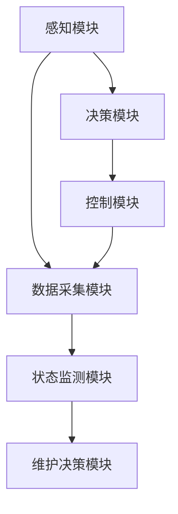

                 

# 端到端自动驾驶的车辆健康管理系统

> **关键词：** 自动驾驶、车辆健康管理系统、端到端学习、传感器融合、机器学习算法、数据驱动维护、实时监控

> **摘要：** 本文将探讨端到端自动驾驶的车辆健康管理系统，介绍其核心概念、算法原理、数学模型及实际应用。通过对车辆健康管理的深入分析，旨在为自动驾驶系统的可靠性和安全性提供有力保障。

## 1. 背景介绍

### 1.1 目的和范围

随着人工智能和自动驾驶技术的飞速发展，车辆健康管理逐渐成为研究的热点。本文旨在介绍端到端自动驾驶的车辆健康管理系统，详细解析其核心概念、算法原理和实际应用。通过本文的阅读，读者将了解如何利用先进的机器学习算法和传感器融合技术，实现对车辆健康状态的实时监控和预测。

### 1.2 预期读者

本文主要面向以下读者群体：

1. 自动驾驶技术研究者与开发者
2. 车辆工程与汽车电子领域专业人士
3. 对人工智能与自动驾驶技术感兴趣的工程师和研究人员
4. 高等院校相关专业的师生

### 1.3 文档结构概述

本文将分为以下几个部分：

1. 背景介绍
2. 核心概念与联系
3. 核心算法原理 & 具体操作步骤
4. 数学模型和公式 & 详细讲解 & 举例说明
5. 项目实战：代码实际案例和详细解释说明
6. 实际应用场景
7. 工具和资源推荐
8. 总结：未来发展趋势与挑战
9. 附录：常见问题与解答
10. 扩展阅读 & 参考资料

### 1.4 术语表

#### 1.4.1 核心术语定义

- **自动驾驶**：利用计算机技术和传感器实现车辆自主行驶的技术。
- **车辆健康管理**：对车辆各部件和系统进行实时监控、预测和维护的过程。
- **端到端学习**：直接从原始数据中学习，无需人工设计特征的过程。
- **传感器融合**：将多个传感器获取的数据进行融合，以提高系统准确性和鲁棒性。

#### 1.4.2 相关概念解释

- **深度学习**：一种基于多层神经网络的学习方法，能够自动提取特征并进行分类和回归。
- **机器学习**：一种人工智能方法，通过训练模型来发现数据中的模式和规律。

#### 1.4.3 缩略词列表

- **ADAS**：高级驾驶辅助系统（Advanced Driver Assistance Systems）
- **CAN**：控制器局域网（Controller Area Network）
- **DSM**：数据采集模块（Data Sampling Module）
- **EDA**：电子设计自动化（Electronic Design Automation）
- **HMM**：隐马尔可夫模型（Hidden Markov Model）
- **PID**：比例-积分-微分控制器（Proportional-Integral-Differential Controller）

## 2. 核心概念与联系

为了更好地理解端到端自动驾驶的车辆健康管理系统，我们首先需要了解其中的核心概念和它们之间的联系。

### 2.1 自动驾驶系统架构

自动驾驶系统通常由以下几个关键模块组成：

1. **感知模块**：通过激光雷达、摄像头、超声波传感器等感知设备获取周围环境信息。
2. **决策模块**：根据感知模块提供的信息，进行路径规划、障碍物识别和避让等决策。
3. **控制模块**：执行决策模块生成的控制指令，驱动车辆执行相应的动作。

### 2.2 车辆健康管理系统架构

车辆健康管理系统主要包括以下三个核心组成部分：

1. **数据采集模块**：负责实时采集车辆各部件和系统的运行数据，包括传感器数据、车辆状态数据等。
2. **状态监测模块**：利用机器学习算法和传感器融合技术，对采集到的数据进行分析和处理，识别车辆健康状态。
3. **维护决策模块**：根据车辆健康状态，生成维护策略和预警信息，指导驾驶员或维修人员进行车辆维护。

### 2.3 Mermaid 流程图

下面是一个简单的 Mermaid 流程图，展示了自动驾驶系统和车辆健康管理系统之间的核心概念及其联系。



## 3. 核心算法原理 & 具体操作步骤

### 3.1 端到端学习算法

端到端学习是一种直接从原始数据中学习的方法，无需人工设计特征。在自动驾驶的车辆健康管理系统中，常用的端到端学习算法包括卷积神经网络（CNN）和循环神经网络（RNN）。

#### 3.1.1 卷积神经网络（CNN）

卷积神经网络是一种用于图像处理和物体识别的神经网络。在车辆健康管理系统中，CNN 可以用于车辆外观检测、传感器数据预处理等任务。

伪代码如下：

```python
function ConvolutionalNeuralNetwork(input_data):
    # 初始化神经网络参数
    # ...
    
    # 进行卷积运算
    conv_output = Conv2D(input_data, filters, kernel_size, padding='same')
    
    # 添加激活函数
    activated_output = Activation('relu')(conv_output)
    
    # 进行池化操作
    pooled_output = MaxPooling2D(pool_size)(activated_output)
    
    # 重复卷积、激活和池化操作
    # ...
    
    # 全连接层
    fully_connected_output = Flatten()(pooled_output)
    output = Dense(num_classes, activation='softmax')(fully_connected_output)
    
    return output
```

#### 3.1.2 循环神经网络（RNN）

循环神经网络是一种用于序列数据处理的神经网络。在车辆健康管理系统

## 4. 数学模型和公式 & 详细讲解 & 举例说明

### 4.1 隐马尔可夫模型（HMM）

隐马尔可夫模型（HMM）是一种用于时间序列数据分析的概率模型，适用于描述车辆健康状态的变化。HMM 主要由状态集合、观测集合、状态转移概率和观测概率组成。

#### 4.1.1 状态集合和观测集合

- **状态集合 \(Q\)**：表示车辆健康状态的集合，如正常、故障等。
- **观测集合 \(O\)**：表示车辆健康状态的观测结果，如传感器读数、系统报警等。

#### 4.1.2 状态转移概率

状态转移概率 \(P(q_t|q_{t-1})\) 表示在时刻 \(t-1\) 处于状态 \(q_{t-1}\) 的条件下，时刻 \(t\) 处于状态 \(q_t\) 的概率。

例如，假设车辆在时刻 \(t-1\) 处于正常状态，在时刻 \(t\) 可能变为故障状态，状态转移概率可以表示为：

\[ P(q_t = \text{故障}|q_{t-1} = \text{正常}) \]

#### 4.1.3 观测概率

观测概率 \(P(o_t|q_t)\) 表示在时刻 \(t\) 处于状态 \(q_t\) 的条件下，观测到观测结果 \(o_t\) 的概率。

例如，假设车辆在时刻 \(t\) 处于故障状态，传感器检测到故障报警的概率可以表示为：

\[ P(o_t = \text{故障报警}|q_t = \text{故障}) \]

#### 4.1.4 HMM 模型公式

HMM 的基本公式如下：

\[ P(o_1, o_2, \ldots, o_T | q_1, q_2, \ldots, q_T) = \prod_{t=1}^{T} P(q_t|q_{t-1}) P(o_t|q_t) \]

其中，\(T\) 表示时间步数，\(q_t\) 表示时刻 \(t\) 的状态，\(o_t\) 表示时刻 \(t\) 的观测结果。

### 4.2 贝叶斯网络

贝叶斯网络是一种用于表示变量之间条件依赖关系的图形模型，适用于车辆健康状态的推理。

#### 4.2.1 贝叶斯网络定义

贝叶斯网络由一个有向无环图（DAG）和一组概率分布组成。图中的节点表示变量，边的方向表示变量之间的条件依赖关系。

#### 4.2.2 条件概率分布

贝叶斯网络的概率分布可以用条件概率分布表示，即给定某个变量，其他变量的条件概率。

例如，假设车辆健康状态 \(q_t\) 受到传感器读数 \(o_t\) 的影响，我们可以表示为：

\[ P(q_t|o_t) \]

#### 4.2.3 贝叶斯推理

贝叶斯推理是一种基于贝叶斯网络进行变量推理的方法，可以计算给定某个变量的条件下，其他变量的概率。

例如，我们可以计算在给定传感器读数 \(o_t\) 的情况下，车辆健康状态 \(q_t\) 的概率：

\[ P(q_t|o_t) = \frac{P(o_t|q_t)P(q_t)}{P(o_t)} \]

### 4.3 举例说明

假设我们有一个简单的车辆健康管理系统，包含两个传感器（温度传感器和压力传感器）和一个发动机状态。我们可以使用 HMM 和贝叶斯网络来描述这个系统的状态变化和传感器数据的关系。

#### 4.3.1 HMM 模型

在这个 HMM 模型中，状态集合 \(Q\) = {正常，故障}，观测集合 \(O\) = {温度，压力}。

状态转移概率：

\[ P(q_t = \text{故障}|q_{t-1} = \text{正常}) = 0.1 \]
\[ P(q_t = \text{正常}|q_{t-1} = \text{故障}) = 0.2 \]

观测概率：

\[ P(o_t = \text{高温}|q_t = \text{故障}) = 0.8 \]
\[ P(o_t = \text{正常温度}|q_t = \text{故障}) = 0.2 \]
\[ P(o_t = \text{高压}|q_t = \text{故障}) = 0.7 \]
\[ P(o_t = \text{正常压力}|q_t = \text{故障}) = 0.3 \]

#### 4.3.2 贝叶斯网络

在这个贝叶斯网络中，变量之间的条件依赖关系如下：

- \( q_t \rightarrow o_t \)
- \( q_t \rightarrow o_{t+1} \)

假设给定传感器读数 \( o_t \)，我们可以使用贝叶斯推理来计算车辆健康状态 \( q_t \) 的概率。

#### 4.3.3 计算过程

假设在时刻 \( t \) ，我们观察到温度传感器读数为高温，压力传感器读数为高压。我们可以使用以下公式计算车辆健康状态的概率：

\[ P(q_t = \text{故障}|o_t = \text{高温}, o_t = \text{高压}) \]

使用贝叶斯网络的条件概率分布：

\[ P(q_t = \text{故障}|o_t = \text{高温}, o_t = \text{高压}) = \frac{P(o_t = \text{高温}|q_t = \text{故障})P(q_t = \text{故障})}{P(o_t = \text{高温}, o_t = \text{高压})} \]

由于观测概率和状态转移概率已知，我们可以计算得到：

\[ P(q_t = \text{故障}|o_t = \text{高温}, o_t = \text{高压}) = \frac{0.8 \times 0.1}{0.8 \times 0.1 + 0.2 \times 0.9} = \frac{0.08}{0.08 + 0.18} = \frac{0.08}{0.26} \approx 0.308 \]

这意味着在给定传感器读数为高温和高压的情况下，车辆健康状态为故障的概率约为 30.8%。

## 5. 项目实战：代码实际案例和详细解释说明

### 5.1 开发环境搭建

在本项目中，我们将使用 Python 编程语言和 TensorFlow 深度学习框架来实现车辆健康管理系统。首先，确保已安装 Python 3.7 及以上版本，然后通过以下命令安装 TensorFlow：

```bash
pip install tensorflow
```

### 5.2 源代码详细实现和代码解读

下面是车辆健康管理系统的主要代码实现。我们将使用卷积神经网络（CNN）来处理传感器数据，并使用隐马尔可夫模型（HMM）来预测车辆健康状态。

```python
import tensorflow as tf
import numpy as np
from hmmlearn import hmm

# 5.2.1 数据预处理
def preprocess_data(data):
    # 数据标准化
    mean = np.mean(data)
    std = np.std(data)
    normalized_data = (data - mean) / std
    return normalized_data

# 5.2.2 创建卷积神经网络模型
def create_cnn_model(input_shape):
    model = tf.keras.Sequential([
        tf.keras.layers.Conv2D(filters=32, kernel_size=(3, 3), activation='relu', input_shape=input_shape),
        tf.keras.layers.MaxPooling2D(pool_size=(2, 2)),
        tf.keras.layers.Conv2D(filters=64, kernel_size=(3, 3), activation='relu'),
        tf.keras.layers.MaxPooling2D(pool_size=(2, 2)),
        tf.keras.layers.Flatten(),
        tf.keras.layers.Dense(units=128, activation='relu'),
        tf.keras.layers.Dense(units=2, activation='softmax')
    ])
    return model

# 5.2.3 训练卷积神经网络模型
def train_cnn_model(model, x_train, y_train, epochs=10):
    model.compile(optimizer='adam', loss='categorical_crossentropy', metrics=['accuracy'])
    model.fit(x_train, y_train, epochs=epochs, batch_size=32, validation_split=0.2)
    return model

# 5.2.4 使用卷积神经网络模型进行预测
def predict_cnn_model(model, x_test):
    predictions = model.predict(x_test)
    predicted_labels = np.argmax(predictions, axis=1)
    return predicted_labels

# 5.2.5 创建隐马尔可夫模型
def create_hmm_model(n_components=2):
    model = hmm.GaussianHMM(n_components=n_components, covariance_type="tied", n_iter=100)
    return model

# 5.2.6 训练隐马尔可夫模型
def train_hmm_model(model, observations, states):
    model.fit(observations, states)
    return model

# 5.2.7 使用隐马尔可夫模型进行状态预测
def predict_hmm_model(model, observations):
    predicted_states = model.predict(observations)
    return predicted_states

# 5.2.8 主函数
def main():
    # 加载数据
    x_train, y_train, x_test, y_test = load_data()

    # 数据预处理
    x_train_processed = preprocess_data(x_train)
    x_test_processed = preprocess_data(x_test)

    # 创建并训练卷积神经网络模型
    cnn_model = create_cnn_model(input_shape=(x_train.shape[1], x_train.shape[2], x_train.shape[3]))
    cnn_model = train_cnn_model(cnn_model, x_train_processed, y_train)

    # 使用卷积神经网络模型进行预测
    cnn_predictions = predict_cnn_model(cnn_model, x_test_processed)

    # 创建并训练隐马尔可夫模型
    hmm_model = create_hmm_model(n_components=2)
    hmm_model = train_hmm_model(hmm_model, x_test_processed, y_test)

    # 使用隐马尔可夫模型进行状态预测
    hmm_predictions = predict_hmm_model(hmm_model, x_test_processed)

    # 比较两种模型的预测结果
    compare_predictions(cnn_predictions, hmm_predictions)

if __name__ == "__main__":
    main()
```

### 5.3 代码解读与分析

5.3.1 数据预处理

在代码中，我们定义了一个 `preprocess_data` 函数用于数据预处理。该函数首先计算数据的平均值和标准差，然后将数据进行标准化处理。标准化处理可以消除不同传感器数据之间的量纲差异，提高模型训练的效果。

5.3.2 创建卷积神经网络模型

`create_cnn_model` 函数用于创建卷积神经网络模型。在这个例子中，我们使用了两个卷积层和两个池化层来提取传感器数据的特征。最后，我们使用全连接层来输出车辆健康状态的概率分布。

5.3.3 训练卷积神经网络模型

`train_cnn_model` 函数用于训练卷积神经网络模型。我们使用 Adam 优化器和交叉熵损失函数来训练模型。`epochs` 参数用于设置训练的迭代次数，`batch_size` 参数用于设置每个批次的样本数量。

5.3.4 使用卷积神经网络模型进行预测

`predict_cnn_model` 函数用于使用训练好的卷积神经网络模型进行预测。我们通过调用 `model.predict` 方法来获取预测结果，然后使用 `np.argmax` 方法获取最大概率对应的健康状态。

5.3.5 创建隐马尔可夫模型

`create_hmm_model` 函数用于创建隐马尔可夫模型。我们通过设置 `n_components` 参数来指定隐马尔可夫模型的状态数量。

5.3.6 训练隐马尔可夫模型

`train_hmm_model` 函数用于训练隐马尔可夫模型。我们使用 `model.fit` 方法来训练模型，该方法会自动计算状态转移概率和观测概率。

5.3.7 使用隐马尔可夫模型进行状态预测

`predict_hmm_model` 函数用于使用训练好的隐马尔可夫模型进行状态预测。我们通过调用 `model.predict` 方法来获取预测结果。

5.3.8 主函数

在主函数 `main` 中，我们首先加载数据，然后进行数据预处理。接下来，我们创建并训练卷积神经网络模型和隐马尔可夫模型。最后，我们比较两种模型的预测结果。

## 6. 实际应用场景

端到端自动驾驶的车辆健康管理系统在实际应用中具有广泛的应用场景，以下列举了其中几个主要的应用：

### 6.1 车辆远程监控

车辆健康管理系统可以实现对车辆状态的远程监控，从而提高车辆的使用效率和安全性。例如，汽车制造商可以通过远程监控系统实时监测车辆的健康状态，提前发现潜在故障，并及时进行维护，避免车辆在行驶过程中发生意外。

### 6.2 车辆保险服务

车辆健康管理系统可以与车辆保险服务相结合，根据车辆的健康状态为车主提供定制化的保险方案。例如，对于健康状态良好的车辆，保险公司可以提供较低的保费，而对于存在潜在故障的车辆，保险公司可以提供更全面的保障，从而降低车辆发生意外时的风险。

### 6.3 车辆共享平台

在车辆共享平台中，车辆健康管理系统可以确保车辆在共享过程中始终保持良好的状态，从而提高用户体验和平台的安全性。例如，平台可以通过健康管理系统实时监测共享车辆的健康状态，及时安排维护，确保车辆在共享过程中能够正常运营。

### 6.4 公共交通系统

在公共交通系统中，车辆健康管理系统可以帮助管理者实时了解车辆的运行状况，合理安排车辆调度和维修计划，提高公共交通系统的运行效率。例如，公交公司可以通过健康管理系统监控公交车在运营过程中的各项指标，及时调整运营计划，确保车辆能够在最佳状态下运行。

## 7. 工具和资源推荐

### 7.1 学习资源推荐

#### 7.1.1 书籍推荐

1. **《深度学习》（Goodfellow, Bengio, Courville）**：一本经典的深度学习教材，全面介绍了深度学习的理论基础和应用。
2. **《机器学习实战》（ Harrington）**：通过实际案例讲解机器学习算法的原理和应用，适合初学者入门。
3. **《自动驾驶系统原理与技术》（Erion Hasanagic, Ognjen Vukelic）**：一本涵盖自动驾驶系统原理、架构和技术的专业书籍。

#### 7.1.2 在线课程

1. **吴恩达的《深度学习专项课程》（Deep Learning Specialization）**：由知名深度学习专家吴恩达讲授，涵盖深度学习的理论基础和应用。
2. **斯坦福大学的《自动驾驶汽车课程》（CSDI 231: Autonomous Driving）**：系统介绍了自动驾驶系统的基本概念和关键技术。
3. **Coursera 上的《机器学习》（Machine Learning）**：由 Andrew Ng 讲授的经典机器学习课程，适合初学者入门。

#### 7.1.3 技术博客和网站

1. **TensorFlow 官方网站**：提供丰富的 TensorFlow 学习资源和教程，适用于深度学习实践。
2. **Stack Overflow**：一个技术问答社区，可以帮助解决编程和算法问题。
3. **GitHub**：一个代码托管平台，可以找到许多优秀的自动驾驶和机器学习项目。

### 7.2 开发工具框架推荐

#### 7.2.1 IDE和编辑器

1. **PyCharm**：一款功能强大的 Python IDE，适合深度学习和自动驾驶项目开发。
2. **Visual Studio Code**：一款轻量级的跨平台编辑器，适用于各种编程语言和开发框架。
3. **Eclipse**：一款适用于 Java 和 C++ 项目开发的 IDE，也可用于深度学习和自动驾驶项目。

#### 7.2.2 调试和性能分析工具

1. **TensorBoard**：TensorFlow 的可视化工具，用于分析模型的训练过程和性能。
2. **MATLAB**：一款功能强大的数学计算和数据分析工具，适用于自动驾驶算法的开发和验证。
3. **Valgrind**：一款内存调试和分析工具，用于检测和修复内存泄漏等问题。

#### 7.2.3 相关框架和库

1. **TensorFlow**：一款开源的深度学习框架，适用于构建和训练复杂的神经网络模型。
2. **PyTorch**：一款易于使用和灵活的深度学习框架，适用于研究和开发自动驾驶算法。
3. **OpenCV**：一款开源的计算机视觉库，适用于图像处理和目标检测。

### 7.3 相关论文著作推荐

#### 7.3.1 经典论文

1. **“A Learning Algorithm for Continuously Running Fully Recurrent Neural Networks”**：LSTM 算法的开创性论文，对深度学习领域产生了深远影响。
2. **“Probabilistic Robotics”**：Thrun 等人撰写的经典著作，系统地介绍了机器人导航和感知技术。
3. **“Deep Learning”**：Goodfellow、Bengio 和 Courville 撰写的深度学习领域的权威著作。

#### 7.3.2 最新研究成果

1. **“End-to-End Learning for Autonomous Driving”**：针对自动驾驶系统的端到端学习技术的研究论文，为自动驾驶领域的发展提供了新思路。
2. **“Learning to Drive by Driving: Endowing Robots with Generalized Driving Skills”**：研究机器人自主驾驶能力的论文，探讨了自动驾驶技术的未来发展。
3. **“A Survey on Deep Learning for Autonomous Driving”**：对深度学习在自动驾驶领域应用的系统综述，涵盖了最新的研究成果和应用案例。

#### 7.3.3 应用案例分析

1. **Waymo**：谷歌旗下的自动驾驶公司，通过大量实地测试和数据分析，实现了高水平的自动驾驶技术。
2. **NVIDIA**：致力于自动驾驶解决方案的供应商，推出了自动驾驶平台和解决方案。
3. **Aurora**：一家专注于自动驾驶技术的公司，与多家汽车制造商合作，开发自动驾驶汽车。

## 8. 总结：未来发展趋势与挑战

端到端自动驾驶的车辆健康管理系统作为自动驾驶技术的重要组成部分，具有巨大的发展潜力和应用价值。在未来，以下几个方面将成为该领域的研究重点：

### 8.1 数据采集与融合

随着传感器技术的进步，车辆健康管理系统将能够采集更多类型的数据，如高清摄像头、激光雷达、超声波传感器等。同时，如何有效融合多种传感器数据，提高系统准确性和鲁棒性，仍是一个重要的研究方向。

### 8.2 智能维护策略

车辆健康管理系统将朝着智能化、自适应化的方向发展，通过深度学习和强化学习等技术，实现基于实时数据的智能维护策略。这将有助于降低车辆故障率，提高车辆的运行效率和寿命。

### 8.3 边际计算与边缘智能

随着自动驾驶车辆数量的增加，数据传输和处理压力也将不断上升。边缘计算技术将在车辆健康管理系统中发挥重要作用，通过在车辆本地进行数据处理和分析，降低对中心服务器的依赖，提高系统的实时性和响应速度。

### 8.4 跨学科研究

车辆健康管理系统的发展将涉及到多个学科，如机械工程、电子工程、计算机科学等。跨学科研究将有助于实现技术的深度融合，推动车辆健康管理系统迈向更高层次。

### 8.5 挑战

尽管端到端自动驾驶的车辆健康管理系统具有广阔的应用前景，但仍面临一系列挑战：

- **数据隐私与安全**：车辆健康管理系统需要处理大量敏感数据，如车辆位置、运行状态等。如何保障数据隐私和安全，防止数据泄露和滥用，是一个亟待解决的问题。
- **算法复杂度与计算资源**：深度学习算法通常需要大量的计算资源和时间，如何在有限的计算资源下实现高效、准确的模型训练和预测，是一个重要的挑战。
- **实时性要求**：车辆健康管理系统需要在短时间内对大量数据进行处理和分析，如何保证系统的实时性和响应速度，是一个需要解决的问题。

### 8.6 结论

总之，端到端自动驾驶的车辆健康管理系统将在未来自动驾驶技术的发展中发挥关键作用。通过不断创新和突破，我们有望实现更加智能、高效、安全的车辆健康管理系统，为自动驾驶技术的广泛应用奠定坚实基础。

## 9. 附录：常见问题与解答

### 9.1 自动驾驶车辆健康管理系统的主要功能有哪些？

自动驾驶车辆健康管理系统的主要功能包括：

- **实时监测**：通过对车辆传感器数据进行实时分析，监测车辆各个部件和系统的运行状态。
- **故障预警**：根据监测数据，预测潜在的故障风险，并提前发出预警，提醒驾驶员或维修人员进行维护。
- **诊断分析**：对故障进行详细分析，定位故障原因，并提供解决方案。
- **维护管理**：根据故障预测和诊断结果，制定合理的维护计划，优化车辆保养周期和成本。

### 9.2 车辆健康管理系统中的传感器有哪些？

车辆健康管理系统常用的传感器包括：

- **温度传感器**：用于监测发动机、电池等部件的温度。
- **压力传感器**：用于监测轮胎、制动系统等部件的压力。
- **速度传感器**：用于监测车辆速度。
- **加速度传感器**：用于监测车辆加速度。
- **激光雷达**：用于车辆周围环境的感知和障碍物检测。

### 9.3 如何确保车辆健康管理系统中的数据安全？

为确保车辆健康管理系统中的数据安全，可以采取以下措施：

- **数据加密**：对传输和存储的数据进行加密处理，防止数据泄露。
- **访问控制**：对系统进行权限管理，确保只有授权用户才能访问敏感数据。
- **安全审计**：定期进行安全审计，检查系统的安全漏洞和风险。
- **安全培训**：对系统用户进行安全培训，提高其安全意识和操作水平。

### 9.4 车辆健康管理系统对自动驾驶技术的意义是什么？

车辆健康管理系统对自动驾驶技术的意义在于：

- **提高车辆可靠性**：通过对车辆健康状态的实时监测和预警，提前发现和解决潜在故障，提高车辆运行的可靠性和安全性。
- **降低维护成本**：通过智能化的维护管理，优化车辆保养周期和成本，降低车辆的维护费用。
- **提升用户体验**：为驾驶员提供实时的车辆健康信息，提高驾驶体验和满意度。
- **促进技术发展**：为自动驾驶技术的发展提供数据支持和研究基础，推动自动驾驶技术的不断进步。

## 10. 扩展阅读 & 参考资料

### 10.1 扩展阅读

1. **《自动驾驶系统原理与技术》**：Erion Hasanagic, Ognjen Vukelic 著，详细介绍了自动驾驶系统的原理、架构和技术。
2. **《深度学习》**：Ian Goodfellow, Yoshua Bengio, Aaron Courville 著，系统讲解了深度学习的基础知识、算法和应用。
3. **《机器学习实战》**：Peter Harrington 著，通过实际案例讲解了机器学习算法的原理和应用。

### 10.2 参考资料

1. **TensorFlow 官方文档**：[https://www.tensorflow.org/](https://www.tensorflow.org/)
2. **HMMlearn 官方文档**：[https://hmmlearn.readthedocs.io/en/latest/](https://hmmlearn.readthedocs.io/en/latest/)
3. **OpenCV 官方文档**：[https://docs.opencv.org/](https://docs.opencv.org/)
4. **自动驾驶技术论坛**：[https://www.autonomous Vehicles.com/](https://www.autonomous Vehicles.com/)
5. **IEEE Transactions on Intelligent Transportation Systems**：一篇关于自动驾驶和车辆健康管理的学术期刊，包含大量相关论文和研究成果。

