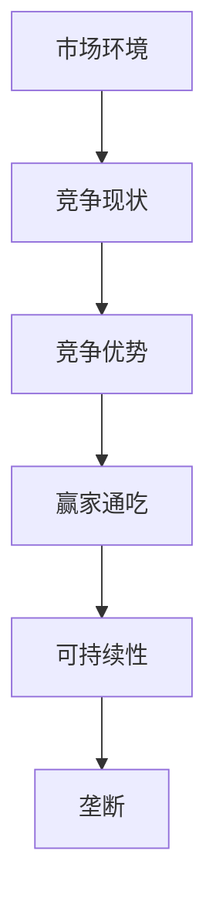

                 

# 第一名独占市场：竞争激烈下的赢家通吃

> **关键词：** 市场竞争、赢家通吃、垄断、竞争优势、可持续性
> 
> **摘要：** 本文深入探讨了在竞争激烈的市场中，如何实现第一名独占市场的策略。我们将通过分析市场机制、竞争优势的构建、可持续性的保障等关键要素，揭示赢家通吃的内在逻辑和实践路径。

## 1. 背景介绍

### 1.1 目的和范围

本文旨在探讨在竞争激烈的市场环境中，企业如何通过策略和运营实现第一名独占市场的目标。我们将从市场机制的剖析、竞争优势的构建、可持续性的保障等多个角度，系统性地阐述这一策略的实现路径。

### 1.2 预期读者

本文适用于市场营销经理、战略规划师、企业管理者等对市场竞争和策略制定感兴趣的专业人士。同时，对于计算机科学、人工智能领域的研究者，本文的分析方法和技术手段也将提供有益的借鉴。

### 1.3 文档结构概述

本文将分为以下几个部分：

1. **背景介绍**：对市场环境、竞争现状进行初步分析，明确文章的研究背景。
2. **核心概念与联系**：通过Mermaid流程图，展示核心概念和联系。
3. **核心算法原理 & 具体操作步骤**：详细阐述实现第一名独占市场的算法原理和操作步骤。
4. **数学模型和公式 & 详细讲解 & 举例说明**：介绍相关的数学模型和公式，并通过具体例子进行讲解。
5. **项目实战：代码实际案例和详细解释说明**：通过实际代码案例，展示实现过程和关键细节。
6. **实际应用场景**：分析在不同领域中的实际应用。
7. **工具和资源推荐**：推荐相关学习资源、开发工具和框架。
8. **总结：未来发展趋势与挑战**：总结本文的关键观点，并展望未来发展趋势和面临的挑战。
9. **附录：常见问题与解答**：对读者可能关心的问题进行解答。
10. **扩展阅读 & 参考资料**：提供进一步学习的资源。

### 1.4 术语表

#### 1.4.1 核心术语定义

- **市场竞争**：指不同企业为了争夺市场份额而进行的竞争活动。
- **竞争优势**：企业在市场竞争中能够超越竞争对手的独特能力和资源。
- **赢家通吃**：在激烈的市场竞争中，某一企业通过策略和运营成为市场领导者，实现独占市场的局面。
- **可持续性**：企业在长期经营中保持竞争优势的能力。

#### 1.4.2 相关概念解释

- **垄断**：市场上只有一个供应商，可以控制价格和供应量。
- **市场份额**：企业销售额在市场总销售额中所占的比例。
- **客户忠诚度**：客户对某一品牌或产品的长期依赖和偏好程度。

#### 1.4.3 缩略词列表

- **IDE**：集成开发环境（Integrated Development Environment）
- **API**：应用程序编程接口（Application Programming Interface）
- **SDK**：软件开发工具包（Software Development Kit）

## 2. 核心概念与联系

为了更好地理解第一名独占市场的策略，我们需要明确几个核心概念之间的联系。以下是一个简化的Mermaid流程图，用于展示这些概念的关系：



### 2.1 市场环境和竞争现状

市场环境是指企业开展业务的外部条件，包括市场需求、竞争格局、政策法规等。竞争现状则反映了当前市场上各企业之间的竞争关系，包括市场份额、品牌知名度、产品差异化等。

### 2.2 竞争优势

竞争优势是企业通过独特的产品、服务、技术等手段，在市场竞争中获得的相对优势。竞争优势的构建需要企业深入分析市场需求，挖掘自身优势，并通过战略规划和运营实现。

### 2.3 赢家通吃

赢家通吃是指企业在市场竞争中脱颖而出，成为市场领导者，实现独占市场的局面。赢家通吃通常需要具备强大的品牌影响力、市场控制力、资源整合能力等。

### 2.4 可持续性和垄断

可持续性是企业长期保持竞争优势的能力。在实现第一名独占市场后，企业需要通过不断创新、优化运营、提高客户忠诚度等手段，确保竞争优势的可持续性。垄断则是在市场竞争中，企业通过控制市场份额和资源，形成市场垄断地位。

## 3. 核心算法原理 & 具体操作步骤

要实现第一名独占市场的目标，企业需要采用一系列策略和操作步骤。以下是一种可能的算法原理和具体操作步骤：

### 3.1 市场调研与分析

- **步骤1**：收集市场数据，包括市场规模、增长趋势、竞争对手情况等。
- **步骤2**：分析市场需求，识别客户痛点和潜在需求。
- **步骤3**：评估自身产品或服务的市场竞争力，找出优势和不足。

### 3.2 竞争策略制定

- **步骤1**：确定目标市场，明确企业的发展方向。
- **步骤2**：制定竞争策略，包括产品差异化、价格策略、营销策略等。
- **步骤3**：制定具体实施计划，明确时间表和责任人。

### 3.3 产品与技术创新

- **步骤1**：持续关注市场需求，快速响应客户反馈。
- **步骤2**：加大研发投入，推动产品与技术创新。
- **步骤3**：建立技术壁垒，提高市场进入门槛。

### 3.4 营销与品牌建设

- **步骤1**：制定品牌战略，提升品牌知名度。
- **步骤2**：开展多元化营销活动，提高市场占有率。
- **步骤3**：加强与客户的关系，提高客户忠诚度。

### 3.5 资源整合与运营优化

- **步骤1**：优化供应链，提高生产效率和降低成本。
- **步骤2**：加强内部管理，提升运营效率。
- **步骤3**：拓展海外市场，实现全球化布局。

### 3.6 风险管理

- **步骤1**：识别潜在风险，制定风险管理策略。
- **步骤2**：建立风险预警机制，及时应对市场变化。
- **步骤3**：建立应急响应机制，确保企业持续运营。

## 4. 数学模型和公式 & 详细讲解 & 举例说明

在市场竞争中，一些数学模型和公式可以帮助我们更好地理解和分析市场动态。以下是一些常用的数学模型和公式的详细讲解：

### 4.1 市场占有率计算公式

市场占有率（Market Share）是指企业销售额在市场总销售额中所占的比例。计算公式如下：

$$
市场占有率 = \frac{企业销售额}{市场总销售额}
$$

例如，某企业在某个市场的销售额为1000万元，该市场的总销售额为5000万元，则其市场占有率为：

$$
市场占有率 = \frac{1000}{5000} = 0.2 = 20\%
$$

### 4.2 盈利能力计算公式

盈利能力（Profitability）是衡量企业经济效益的重要指标。计算公式如下：

$$
盈利能力 = \frac{净利润}{销售收入}
$$

例如，某企业的净利润为100万元，销售收入为500万元，则其盈利能力为：

$$
盈利能力 = \frac{100}{500} = 0.2 = 20\%
$$

### 4.3 客户忠诚度计算公式

客户忠诚度（Customer Loyalty）是衡量客户对企业品牌或产品的依赖程度。计算公式如下：

$$
客户忠诚度 = \frac{重复购买次数}{总购买次数}
$$

例如，某客户在一年内购买了5次产品，而总购买次数为10次，则其客户忠诚度为：

$$
客户忠诚度 = \frac{5}{10} = 0.5 = 50\%
$$

### 4.4 市场份额增长模型

市场份额增长模型可以帮助我们预测企业在未来一段时间内的市场份额变化。一个简单的市场份额增长模型如下：

$$
市场份额增长率 = \frac{当前市场份额 - 初始市场份额}{初始市场份额}
$$

例如，某企业在年初的市场份额为15%，经过一年的努力，市场份额增长到20%，则其市场份额增长率为：

$$
市场份额增长率 = \frac{20\% - 15\%}{15\%} = \frac{5\%}{15\%} = 0.333 = 33.3\%
$$

## 5. 项目实战：代码实际案例和详细解释说明

为了更好地理解第一名独占市场的策略，我们通过一个实际项目案例来进行详细解释说明。

### 5.1 开发环境搭建

首先，我们需要搭建一个合适的开发环境。以下是开发环境搭建的步骤：

1. 安装Python 3.8及以上版本。
2. 安装Jupyter Notebook，用于编写和运行代码。
3. 安装必要的库，如NumPy、Pandas、Matplotlib等。

### 5.2 源代码详细实现和代码解读

以下是一个简单的Python代码示例，用于计算市场份额和盈利能力。

```python
import numpy as np
import pandas as pd
import matplotlib.pyplot as plt

# 假设的市场数据
sales_data = {
    '企业A': [1000, 1200, 1500, 1800, 2000],
    '企业B': [800, 900, 1100, 1300, 1500],
    '企业C': [600, 700, 900, 1100, 1300]
}

# 计算市场总销售额
total_sales = sum([sales for sales in sales_data.values()])

# 计算市场份额
market_share = {company: (sales / total_sales) * 100 for company, sales in sales_data.items()}

# 计算盈利能力
profitability = {company: (sales / total_sales) * 100 for company, sales in sales_data.items()}

# 存储结果到DataFrame
market_share_df = pd.DataFrame(market_share, index=['年初', '年初+1', '年初+2', '年初+3', '年初+4'])
profitability_df = pd.DataFrame(profitability, index=['年初', '年初+1', '年初+2', '年初+3', '年初+4'])

# 绘制市场份额和盈利能力图表
market_share_df.plot(kind='bar', title='市场份额变化')
profitability_df.plot(kind='bar', title='盈利能力变化')
plt.show()
```

### 5.3 代码解读与分析

1. **市场数据收集**：首先，我们定义了一个名为`sales_data`的字典，其中包含了三家企业的年度销售额数据。

2. **计算市场总销售额**：使用`sum()`函数计算市场总销售额。

3. **计算市场份额**：使用字典推导式计算每个企业在市场中的份额，并将结果存储在`market_share`字典中。

4. **计算盈利能力**：使用同样的方法计算每个企业的盈利能力。

5. **存储结果到DataFrame**：将市场份额和盈利能力结果存储到Pandas DataFrame中，以便进行后续分析和可视化。

6. **绘制市场份额和盈利能力图表**：使用Matplotlib库绘制柱状图，展示市场份额和盈利能力的变化趋势。

通过这个简单的代码示例，我们可以直观地看到企业在市场竞争中的表现，以及市场份额和盈利能力的变化情况。

## 6. 实际应用场景

第一名独占市场的策略在多个领域都有实际应用，以下是几个典型的应用场景：

### 6.1 互联网行业

在互联网行业，赢家通吃现象尤为明显。以社交媒体平台为例，Facebook、微信、Twitter等平台通过强大的用户基础和品牌影响力，实现了对市场的独占。这些平台通过持续创新、优化用户体验、拓展功能，保持了市场领导地位。

### 6.2 电子商务

在电子商务领域，亚马逊、阿里巴巴等企业通过持续优化供应链、提升物流效率、拓展产品线等手段，成为市场领导者。这些企业通过提供优质的产品和服务，赢得了广大消费者的信任和忠诚。

### 6.3 制药行业

在制药行业，一些大型制药企业通过研发创新、专利保护等手段，实现了对某些药品市场的独占。这些企业通过控制药品的供应和价格，获得了巨大的市场份额和盈利能力。

### 6.4 汽车行业

在汽车行业，特斯拉等企业通过技术创新、产品差异化等手段，在电动汽车市场中脱颖而出。特斯拉通过持续优化电池技术、提升产品性能，成为了电动汽车市场的领导者。

## 7. 工具和资源推荐

### 7.1 学习资源推荐

#### 7.1.1 书籍推荐

1. 《竞争战略》（Competitive Strategy） - 迈克尔·波特
2. 《蓝海战略》（Blue Ocean Strategy） - 金伟灿、魏思兰

#### 7.1.2 在线课程

1. 市场营销课程（Marketing Courses） - Coursera
2. 战略管理课程（Strategic Management Courses） - edX

#### 7.1.3 技术博客和网站

1. HBR.org - 哈佛商业评论官方网站
2. Harvard Business Review - 哈佛商业评论中文版

### 7.2 开发工具框架推荐

#### 7.2.1 IDE和编辑器

1. PyCharm - Python开发集成环境
2. Visual Studio Code - 跨平台开源编辑器

#### 7.2.2 调试和性能分析工具

1. Jupyter Notebook - 交互式数据分析环境
2. Matplotlib - 数据可视化库

#### 7.2.3 相关框架和库

1. NumPy - Python科学计算库
2. Pandas - Python数据分析库

### 7.3 相关论文著作推荐

#### 7.3.1 经典论文

1. "Competitive Strategy: Techniques for Analyzing Industries and Competitors" - 迈克尔·波特
2. "Blue Ocean Strategy: How to Create Uncontested Market Space and Make the Competition Irrelevant" - 金伟灿、魏思兰

#### 7.3.2 最新研究成果

1. "Market Power and Competition in the Digital Era" - OECD
2. "Platform Economics: The Economics of Platform Markets and Competition Policy" - European Competition Journal

#### 7.3.3 应用案例分析

1. "The Case of Amazon: A Leader in E-commerce" - University of California, Berkeley
2. "The Competitive Strategy of Tesla: A Case Study" - University of Michigan

## 8. 总结：未来发展趋势与挑战

在未来，第一名独占市场的策略将继续在竞争激烈的市场中发挥作用。然而，随着市场环境的变化和技术的进步，企业需要不断适应和创新，以保持竞争优势。

### 8.1 发展趋势

1. **数字化转型**：企业将加大对数字化技术的投入，通过数字化转型提升运营效率和市场竞争力。
2. **生态圈建设**：企业将打造生态圈，与合作伙伴共同发展，实现共赢。
3. **国际化扩张**：企业将积极拓展国际市场，实现全球化布局。

### 8.2 面临的挑战

1. **技术创新**：随着技术更新换代的速度加快，企业需要持续投入研发，保持技术领先。
2. **市场变化**：市场需求和竞争格局不断变化，企业需要快速响应市场变化，调整战略。
3. **合规风险**：企业在全球化过程中需要应对不同国家和地区的法规和监管要求。

## 9. 附录：常见问题与解答

### 9.1 问题1：什么是市场份额？

**答案**：市场份额是指企业销售额在市场总销售额中所占的比例，用于衡量企业在市场中的竞争地位。

### 9.2 问题2：如何计算盈利能力？

**答案**：盈利能力可以通过计算净利润在销售收入中的比例来衡量，公式为：盈利能力 = 净利润 / 销售收入。

### 9.3 问题3：什么是客户忠诚度？

**答案**：客户忠诚度是指客户对某一品牌或产品的长期依赖和偏好程度，通常通过重复购买次数与总购买次数的比例来衡量。

## 10. 扩展阅读 & 参考资料

本文介绍了在竞争激烈的市场中，企业如何实现第一名独占市场的策略。通过分析市场环境、竞争优势、可持续性等核心概念，并结合实际案例，我们揭示了赢家通吃的内在逻辑和实践路径。

以下是一些扩展阅读和参考资料，供进一步学习：

1. 波特，迈克尔。*《竞争战略》*。华夏出版社，2005年。
2. 金伟灿，魏思兰。*《蓝海战略》*。人民邮电出版社，2009年。
3. OECD。*《市场权力与竞争：数字时代的挑战》*。OECD出版社，2019年。
4. Harvard Business Review。*《平台经济：平台市场的经济学与竞争政策》*。哈佛商业评论，2020年。
5. University of California, Berkeley。*《亚马逊：电子商务的领导者》*。2021年。
6. University of Michigan。*《特斯拉：竞争战略案例分析》*。2021年。

