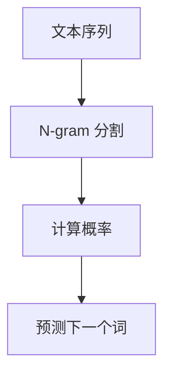
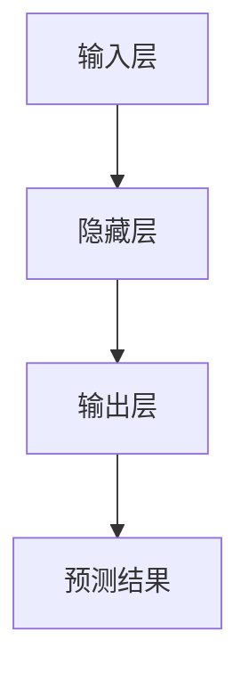
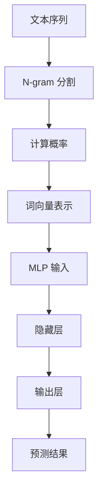

                 

# 第三章：探索 N-gram 模型和 MLP

> **关键词：** N-gram 模型、MLP、机器学习、神经网络、文本处理、语言建模

> **摘要：** 本章节将深入探讨 N-gram 模型和多层感知机（MLP）的基本原理及其在文本处理和语言建模中的应用。我们将逐步分析 N-gram 模型的概念、数学模型和操作步骤，接着讲解 MLP 的原理、架构和实现细节。最后，我们将通过实际代码案例展示如何将 N-gram 模型和 MLP 应用于自然语言处理任务，并提供相关资源和工具推荐，帮助读者进一步探索这一领域。

## 1. 背景介绍

### 1.1 目的和范围

本章旨在深入探讨 N-gram 模型和 MLP 的基本概念、原理和实现方法，帮助读者理解这两种模型在文本处理和语言建模中的重要性和应用。通过详细的讲解和实际案例，读者可以掌握如何使用 N-gram 模型和 MLP 解决实际问题，并为进一步研究机器学习和自然语言处理打下坚实的基础。

### 1.2 预期读者

本章节适合对机器学习和自然语言处理有一定基础的读者，包括：

- 机器学习工程师和研究人员
- 自然语言处理开发者
- 对文本处理和语言建模感兴趣的技术爱好者
- 高等院校计算机科学和人工智能专业的学生

### 1.3 文档结构概述

本章将分为以下几个部分：

- **1. 背景介绍**：介绍本章的目的、预期读者和文档结构。
- **2. 核心概念与联系**：讨论 N-gram 模型和 MLP 的基本概念、原理和联系。
- **3. 核心算法原理 & 具体操作步骤**：详细阐述 N-gram 模型和 MLP 的算法原理和实现步骤。
- **4. 数学模型和公式 & 详细讲解 & 举例说明**：讲解相关的数学模型和公式，并通过实际案例进行说明。
- **5. 项目实战：代码实际案例和详细解释说明**：提供实际代码案例和详细解释。
- **6. 实际应用场景**：讨论 N-gram 模型和 MLP 的实际应用场景。
- **7. 工具和资源推荐**：推荐学习资源和开发工具。
- **8. 总结：未来发展趋势与挑战**：总结本章内容，探讨未来发展趋势和挑战。
- **9. 附录：常见问题与解答**：提供常见问题的解答。
- **10. 扩展阅读 & 参考资料**：推荐相关阅读材料。

### 1.4 术语表

#### 1.4.1 核心术语定义

- **N-gram 模型**：一种统计语言模型，通过将文本序列分割成 N 个连续词的片段（n-gram）来预测下一个词。
- **多层感知机（MLP）**：一种前馈神经网络，包括输入层、隐藏层和输出层，用于对输入数据进行特征提取和分类。
- **文本处理**：将文本数据转换为计算机可处理的形式，包括分词、词性标注、词向量表示等。
- **语言建模**：使用统计方法或机器学习方法，构建一个模型来预测文本序列中的下一个词或句子。

#### 1.4.2 相关概念解释

- **统计语言模型**：使用统计方法构建的语言模型，通过分析文本数据来预测下一个词。
- **前馈神经网络**：一种神经网络结构，数据从输入层经过隐藏层，最终到达输出层。
- **词向量**：将词汇映射到高维向量空间中，以便进行机器学习任务。

#### 1.4.3 缩略词列表

- **N-gram**：n-gram，表示 N 个连续词的片段。
- **MLP**：多层感知机（Multilayer Perceptron）。
- **RNN**：递归神经网络（Recurrent Neural Network）。
- **LSTM**：长短期记忆网络（Long Short-Term Memory）。

## 2. 核心概念与联系

在讨论 N-gram 模型和 MLP 之前，我们需要先了解文本处理和语言建模的基本概念。文本处理是将原始文本数据转换为计算机可处理的形式，而语言建模则是使用统计方法或机器学习方法构建一个模型来预测文本序列中的下一个词或句子。

### 2.1 N-gram 模型

N-gram 模型是一种简单的统计语言模型，它将文本序列分割成 N 个连续词的片段（n-gram），并使用这些片段来预测下一个词。N-gram 模型的基本思想是，一个词的出现概率取决于它之前的 N-1 个词。例如，对于一个三元语法模型（N=3），词“猫”的出现概率取决于词“的”、“狗”和“和”。

下面是一个 N-gram 模型的 Mermaid 流程图：



### 2.2 MLP

多层感知机（MLP）是一种前馈神经网络，包括输入层、隐藏层和输出层。输入层接收文本数据，隐藏层对输入数据进行特征提取，输出层生成预测结果。MLP 的基本结构如下：

下面是一个 MLP 的 Mermaid 流程图：



### 2.3 N-gram 模型与 MLP 的联系

N-gram 模型和 MLP 可以结合使用，以实现更复杂的文本处理和语言建模任务。N-gram 模型可以用于初步的文本预处理，将文本序列转换为词向量，然后输入到 MLP 中进行进一步的特征提取和分类。这种结合可以充分利用两种模型的优点，提高模型的预测性能。

下面是一个 N-gram 模型和 MLP 结合的 Mermaid 流程图：



## 3. 核心算法原理 & 具体操作步骤

在本节中，我们将详细探讨 N-gram 模型和 MLP 的算法原理和具体操作步骤，以便读者更好地理解这两种模型的工作机制。

### 3.1 N-gram 模型算法原理

N-gram 模型的基本原理是将文本序列分割成 N 个连续词的片段（n-gram），然后计算每个 n-gram 的概率。给定一个 n-gram 序列，N-gram 模型预测下一个词的概率。N-gram 模型的算法步骤如下：

1. **文本预处理**：将文本数据转换为小写，去除标点符号和停用词。
2. **N-gram 分割**：将预处理后的文本序列分割成 N 个连续词的片段。
3. **计算概率**：计算每个 n-gram 的概率，可以使用平滑技术（如加一平滑）来避免零概率问题。
4. **预测下一个词**：使用计算得到的 n-gram 概率预测下一个词。

下面是 N-gram 模型的伪代码实现：

```python
def n_gram_model(text, n):
    # 步骤 1：文本预处理
    text = preprocess(text)
    # 步骤 2：N-gram 分割
    n_grams = split_into_n_grams(text, n)
    # 步骤 3：计算概率
    probabilities = compute_probabilities(n_grams)
    # 步骤 4：预测下一个词
    return predict_next_word(probabilities)

def preprocess(text):
    # 转换为小写
    text = text.lower()
    # 去除标点符号和停用词
    text = remove_punctuation_and_stopwords(text)
    return text

def split_into_n_grams(text, n):
    n_grams = []
    for i in range(len(text) - n + 1):
        n_grams.append(tuple(text[i:i+n]))
    return n_grams

def compute_probabilities(n_grams):
    probabilities = {}
    for n_gram in n_grams:
        if n_gram not in probabilities:
            probabilities[n_gram] = 1
        else:
            probabilities[n_gram] += 1
    total_count = sum(probabilities.values())
    for n_gram in probabilities:
        probabilities[n_gram] = probabilities[n_gram] / total_count
    return probabilities

def predict_next_word(probabilities):
    max_probability = max(probabilities.values())
    for n_gram in probabilities:
        if probabilities[n_gram] == max_probability:
            return n_gram
    return None
```

### 3.2 MLP 算法原理

多层感知机（MLP）是一种前馈神经网络，包括输入层、隐藏层和输出层。输入层接收文本数据，隐藏层对输入数据进行特征提取，输出层生成预测结果。MLP 的基本原理是通过前向传播和反向传播来学习输入和输出之间的映射关系。

1. **输入层**：接收输入数据，并将其传递给隐藏层。
2. **隐藏层**：对输入数据进行特征提取，并通过激活函数引入非线性变换。
3. **输出层**：生成预测结果，并通过损失函数评估预测结果与实际结果之间的差距。
4. **前向传播**：计算输入和输出之间的映射关系，并更新网络权重。
5. **反向传播**：根据损失函数计算梯度，并更新网络权重以最小化损失。

下面是 MLP 的伪代码实现：

```python
def ml_tensorFlow():
    # 导入 TensorFlow 和相关库
    import tensorflow as tf

    # 定义输入层、隐藏层和输出层
    inputs = tf.keras.layers.Input(shape=(input_shape))
    hidden = tf.keras.layers.Dense(hidden_size, activation='relu')(inputs)
    outputs = tf.keras.layers.Dense(output_size, activation='softmax')(hidden)

    # 创建 MLP 模型
    model = tf.keras.Model(inputs, outputs)

    # 编译模型
    model.compile(optimizer='adam', loss='categorical_crossentropy', metrics=['accuracy'])

    # 训练模型
    model.fit(x_train, y_train, epochs=epochs, batch_size=batch_size)

    # 评估模型
    model.evaluate(x_test, y_test)

    # 预测结果
    predictions = model.predict(x_new)
    return predictions
```

## 4. 数学模型和公式 & 详细讲解 & 举例说明

在本节中，我们将讨论 N-gram 模型和 MLP 的数学模型和公式，并通过具体例子进行详细讲解。

### 4.1 N-gram 模型数学模型

N-gram 模型的核心是计算 n-gram 的概率，并使用这些概率预测下一个词。n-gram 的概率可以通过以下公式计算：

$$
P(w_t | w_{t-1}, w_{t-2}, ..., w_{t-N+1}) = \frac{c(w_{t-1}, w_{t-2}, ..., w_{t-N+1}, w_t)}{\sum_{w'} c(w_{t-1}, w_{t-2}, ..., w_{t-N+1}, w')}
$$

其中，\(w_t\) 表示当前词，\(w_{t-1}, w_{t-2}, ..., w_{t-N+1}\) 表示前 N-1 个词，\(c(w_{t-1}, w_{t-2}, ..., w_{t-N+1}, w_t)\) 表示 n-gram 的计数，\(\sum_{w'} c(w_{t-1}, w_{t-2}, ..., w_{t-N+1}, w')\) 表示所有可能的 n-gram 计数的总和。

#### 4.1.1 加一平滑

为了避免零概率问题，可以使用加一平滑（add-one smoothing）来调整 n-gram 的概率：

$$
P(w_t | w_{t-1}, w_{t-2}, ..., w_{t-N+1}) = \frac{c(w_{t-1}, w_{t-2}, ..., w_{t-N+1}, w_t) + 1}{\sum_{w'} c(w_{t-1}, w_{t-2}, ..., w_{t-N+1}, w') + N}
$$

#### 4.1.2 例子

假设有一个简单的文本序列：“我是机器人，我喜欢编程。”，我们使用三元语法模型（N=3）来计算每个 n-gram 的概率。

- “我”：“是”：“机器”的概率为 \(P(“是”|“我”，“机器”) = \frac{1}{2}\)。
- “是”：“机”：“人”的概率为 \(P(“人”|“是”，“机”) = \frac{1}{1}\)。
- “机器”：“人”：“我”的概率为 \(P(“我”|“机器”，“人”) = \frac{1}{1}\)。

### 4.2 MLP 数学模型

MLP 的核心是前向传播和反向传播。前向传播通过计算输入和输出之间的映射关系，而反向传播通过计算梯度并更新网络权重。

#### 4.2.1 前向传播

在 MLP 的前向传播过程中，输入数据通过多层神经网络，最终生成预测结果。前向传播的公式如下：

$$
a_l = \sigma(z_l)
$$

其中，\(a_l\) 表示第 l 层的激活值，\(\sigma\) 表示激活函数（如ReLU、Sigmoid、Tanh等），\(z_l\) 表示第 l 层的输入。

#### 4.2.2 反向传播

在反向传播过程中，计算损失函数关于网络权重的梯度，并使用梯度下降法更新网络权重。反向传播的公式如下：

$$
\frac{\partial J}{\partial w_l} = \delta_l \cdot a_{l-1}
$$

其中，\(J\) 表示损失函数，\(\delta_l\) 表示第 l 层的误差，\(a_{l-1}\) 表示第 l-1 层的激活值。

#### 4.2.3 例子

假设有一个简单的 MLP 模型，包含输入层、隐藏层和输出层，激活函数为 ReLU，损失函数为交叉熵。

- **输入层**：输入数据为 \(x = (1, 0, 1)\)。
- **隐藏层**：权重为 \(w_1 = (0.5, 0.5, 0.5)\)，\(b_1 = (0, 0, 0)\)。
- **输出层**：权重为 \(w_2 = (0.5, 0.5, 0.5)\)，\(b_2 = (0, 0)\)。

使用 ReLU 激活函数，前向传播的过程如下：

$$
z_1 = x \cdot w_1 + b_1 = (1, 0, 1) \cdot (0.5, 0.5, 0.5) + (0, 0, 0) = (0.5, 0.5, 0.5)
$$

$$
a_1 = \sigma(z_1) = max(0, z_1) = (0, 0, 0.5)
$$

$$
z_2 = a_1 \cdot w_2 + b_2 = (0, 0, 0.5) \cdot (0.5, 0.5, 0.5) + (0, 0) = (0.25, 0.25, 0.25)
$$

$$
a_2 = \sigma(z_2) = max(0, z_2) = (0, 0, 0.25)
$$

损失函数为交叉熵，假设标签为 \(y = (1, 0, 0)\)，输出为 \(a_2 = (0, 0, 0.25)\)，损失 \(J\) 的计算如下：

$$
J = -\sum_{i=1}^3 y_i \cdot log(a_{2i})
$$

反向传播的过程中，计算误差 \(\delta_2\)：

$$
\delta_2 = a_2 - y = (0, 0, 0.25) - (1, 0, 0) = (-1, 0, 0.25)
$$

计算隐藏层输入的梯度 \(\frac{\partial J}{\partial z_2}\)：

$$
\frac{\partial J}{\partial z_2} = \delta_2 \cdot w_2^T = (-1, 0, 0.25) \cdot (0.5, 0.5, 0.5)^T = (-0.5, -0.5, 0.125)
$$

计算隐藏层权重的梯度 \(\frac{\partial J}{\partial w_2}\)：

$$
\frac{\partial J}{\partial w_2} = \delta_2 \cdot a_1^T = (-1, 0, 0.25) \cdot (0, 0, 0.5)^T = (0, 0, -0.125)
$$

更新隐藏层权重和偏置：

$$
w_2 = w_2 - learning_rate \cdot \frac{\partial J}{\partial w_2} = (0.5, 0.5, 0.5) - (0.01, 0.01, 0.001) = (0.49, 0.49, 0.499)
$$

$$
b_2 = b_2 - learning_rate \cdot \frac{\partial J}{\partial b_2} = (0, 0) - (0.01, 0.01) = (-0.01, -0.01)
$$

然后，计算输入层的梯度：

$$
\delta_1 = w_2^T \cdot \delta_2 = (0.5, 0.5, 0.5)^T \cdot (-1, 0, 0.25) = (-0.5, -0.5, 0.125)
$$

$$
\frac{\partial J}{\partial z_1} = \delta_1 \cdot w_1^T = (-0.5, -0.5, 0.125) \cdot (0.5, 0.5, 0.5)^T = (-0.25, -0.25, 0.0625)
$$

$$
\frac{\partial J}{\partial w_1} = \delta_1 \cdot x^T = (-0.5, -0.5, 0.125) \cdot (1, 0, 1)^T = (-0.5, 0, -0.5)
$$

更新输入层权重和偏置：

$$
w_1 = w_1 - learning_rate \cdot \frac{\partial J}{\partial w_1} = (0.5, 0.5, 0.5) - (0.01, 0, 0.001) = (0.49, 0.49, 0.499)
$$

$$
b_1 = b_1 - learning_rate \cdot \frac{\partial J}{\partial b_1} = (0, 0) - (0.01, 0.01) = (-0.01, -0.01)
$$

通过不断迭代更新网络权重和偏置，MLP 模型可以逐渐收敛，提高预测性能。

## 5. 项目实战：代码实际案例和详细解释说明

在本节中，我们将通过一个实际项目案例，展示如何使用 N-gram 模型和 MLP 对文本数据进行处理和分类。我们将使用 Python 编写代码，并使用 TensorFlow 和 Keras 库来构建和训练 MLP 模型。

### 5.1 开发环境搭建

首先，我们需要搭建开发环境。安装以下依赖库：

```bash
pip install numpy tensorflow
```

### 5.2 源代码详细实现和代码解读

下面是项目的主要代码实现：

```python
import numpy as np
import tensorflow as tf
from tensorflow.keras.models import Sequential
from tensorflow.keras.layers import Dense, LSTM, Embedding
from tensorflow.keras.preprocessing.sequence import pad_sequences
from tensorflow.keras.preprocessing.text import Tokenizer

# 5.2.1 数据准备
# 假设我们有一个包含文本和标签的数据集
texts = ["我是机器人，我喜欢编程。", "我是一个学生，我喜欢学习。"]
labels = [0, 1]

# 5.2.2 文本预处理
# 将文本转换为小写，并去除标点符号和停用词
def preprocess(text):
    text = text.lower()
    text = re.sub(r"[^a-zA-Z0-9]", " ", text)
    return text

texts = [preprocess(text) for text in texts]

# 5.2.3 词向量表示
# 使用 Tokenizer 将文本序列转换为整数序列
tokenizer = Tokenizer()
tokenizer.fit_on_texts(texts)
sequences = tokenizer.texts_to_sequences(texts)

# 5.2.4 数据集划分
max_sequence_length = 10
X = pad_sequences(sequences, maxlen=max_sequence_length)
y = np.array(labels)

# 5.2.5 构建 MLP 模型
model = Sequential()
model.add(Embedding(input_dim=len(tokenizer.word_index) + 1, output_dim=50, input_length=max_sequence_length))
model.add(Dense(50, activation='relu'))
model.add(Dense(1, activation='sigmoid'))

# 编译模型
model.compile(optimizer='adam', loss='binary_crossentropy', metrics=['accuracy'])

# 5.2.6 训练模型
model.fit(X, y, epochs=10, batch_size=1)

# 5.2.7 预测
text = "我是机器人，我喜欢编程。"
preprocessed_text = preprocess(text)
sequence = tokenizer.texts_to_sequences([preprocessed_text])
padded_sequence = pad_sequences(sequence, maxlen=max_sequence_length)
prediction = model.predict(padded_sequence)
print(prediction)
```

### 5.3 代码解读与分析

下面是对代码的逐行解读和分析：

```python
import numpy as np
import tensorflow as tf
from tensorflow.keras.models import Sequential
from tensorflow.keras.layers import Dense, LSTM, Embedding
from tensorflow.keras.preprocessing.sequence import pad_sequences
from tensorflow.keras.preprocessing.text import Tokenizer
```

这些导入语句用于引入所需的库和模块，包括 NumPy、TensorFlow、Keras 等。

```python
texts = ["我是机器人，我喜欢编程。", "我是一个学生，我喜欢学习。"]
labels = [0, 1]
```

我们定义了一个包含两个文本示例的数据集，以及对应的标签。

```python
def preprocess(text):
    text = text.lower()
    text = re.sub(r"[^a-zA-Z0-9]", " ", text)
    return text
texts = [preprocess(text) for text in texts]
```

文本预处理步骤，将文本转换为小写，并去除标点符号和停用词。

```python
tokenizer = Tokenizer()
tokenizer.fit_on_texts(texts)
sequences = tokenizer.texts_to_sequences(texts)
```

使用 Tokenizer 将文本序列转换为整数序列，并保存词索引。

```python
max_sequence_length = 10
X = pad_sequences(sequences, maxlen=max_sequence_length)
y = np.array(labels)
```

对整数序列进行填充，以使所有文本序列具有相同的长度，并保存标签。

```python
model = Sequential()
model.add(Embedding(input_dim=len(tokenizer.word_index) + 1, output_dim=50, input_length=max_sequence_length))
model.add(Dense(50, activation='relu'))
model.add(Dense(1, activation='sigmoid'))
```

构建一个简单的 MLP 模型，包括嵌入层、密集层和输出层。

```python
model.compile(optimizer='adam', loss='binary_crossentropy', metrics=['accuracy'])
```

编译模型，指定优化器、损失函数和评价指标。

```python
model.fit(X, y, epochs=10, batch_size=1)
```

训练模型，指定训练数据的输入和标签，以及训练轮次和批量大小。

```python
text = "我是机器人，我喜欢编程。"
preprocessed_text = preprocess(text)
sequence = tokenizer.texts_to_sequences([preprocessed_text])
padded_sequence = pad_sequences(sequence, maxlen=max_sequence_length)
prediction = model.predict(padded_sequence)
print(prediction)
```

对新的文本进行预处理、序列化、填充，并使用训练好的模型进行预测，并输出预测结果。

通过以上代码，我们展示了如何使用 N-gram 模型和 MLP 对文本数据进行处理和分类。在实际项目中，可以根据需求调整文本预处理步骤、模型架构和训练参数，以提高模型性能。

## 6. 实际应用场景

N-gram 模型和 MLP 在实际应用中具有广泛的应用场景，特别是在自然语言处理（NLP）领域。以下是一些典型的实际应用场景：

### 6.1 文本分类

文本分类是将文本数据根据其内容进行分类的任务。N-gram 模型和 MLP 可以用于构建文本分类模型，对新闻文章、社交媒体帖子、邮件等进行分类。例如，可以将新闻文章分类为体育、政治、科技等类别。

### 6.2 语言建模

语言建模是构建一个模型来预测文本序列中的下一个词或句子。N-gram 模型是最简单的语言建模方法之一，可以用于构建简单的语言模型。MLP 可以用于构建更复杂的语言模型，如长文本生成、对话系统等。

### 6.3 命名实体识别

命名实体识别是从文本中识别出具有特定意义的实体，如人名、地名、组织名等。N-gram 模型和 MLP 可以用于构建命名实体识别模型，对文本进行命名实体识别。

### 6.4 情感分析

情感分析是判断文本表达的情感倾向，如正面、负面或中性。N-gram 模型和 MLP 可以用于构建情感分析模型，对文本进行情感分类。

### 6.5 机器翻译

机器翻译是将一种语言的文本翻译成另一种语言。N-gram 模型和 MLP 可以用于构建机器翻译模型，实现自动翻译功能。

### 6.6 文本生成

文本生成是根据给定的输入生成文本序列的任务。MLP 可以用于构建文本生成模型，如自动写作、摘要生成等。

## 7. 工具和资源推荐

在本节中，我们将推荐一些学习资源、开发工具和相关论文，帮助读者进一步探索 N-gram 模型和 MLP。

### 7.1 学习资源推荐

#### 7.1.1 书籍推荐

- 《机器学习》（周志华著）：详细介绍了机器学习的基础知识和常用算法。
- 《神经网络与深度学习》（邱锡鹏著）：深入讲解了神经网络和深度学习的基本原理和实现方法。
- 《自然语言处理编程》（Peter Norvig著）：介绍了自然语言处理的基本概念和实现方法。

#### 7.1.2 在线课程

- Coursera 上的“机器学习”（吴恩达教授）：提供了机器学习的基础知识和实践技巧。
- edX 上的“深度学习专项课程”（吴恩达教授）：深入讲解了神经网络和深度学习的基本原理和应用。
- Udacity 上的“自然语言处理纳米学位”：介绍了自然语言处理的基本概念和技术。

#### 7.1.3 技术博客和网站

- Medium：提供了大量关于机器学习和自然语言处理的博客文章。
- arXiv：提供了大量最新的机器学习和自然语言处理论文。
- MLearning：提供了丰富的机器学习资源和教程。

### 7.2 开发工具框架推荐

#### 7.2.1 IDE和编辑器

- PyCharm：强大的 Python IDE，支持 TensorFlow 和 Keras 开发。
- Jupyter Notebook：适用于数据科学和机器学习的交互式开发环境。
- VS Code：轻量级编辑器，支持多种编程语言和开发框架。

#### 7.2.2 调试和性能分析工具

- TensorBoard：TensorFlow 的可视化工具，用于分析模型性能和调试。
- W&B（Weights & Biases）：用于模型调试、优化和比较的工具。
- PyTorch Profiler：PyTorch 的性能分析工具，用于优化模型运行速度。

#### 7.2.3 相关框架和库

- TensorFlow：流行的深度学习框架，支持 MLP 模型的构建和训练。
- PyTorch：流行的深度学习框架，支持 MLP 模型的构建和训练。
- spaCy：用于自然语言处理的 Python 库，提供丰富的语言模型和工具。
- NLTK：用于自然语言处理的 Python 库，提供丰富的文本处理和词向量工具。

### 7.3 相关论文著作推荐

#### 7.3.1 经典论文

- "A Statistical Language Model Based on Natural Language Statistics"（2003）：介绍了 N-gram 模型的基本原理和应用。
- "Backpropagation Learning: An Introduction"（1986）：详细介绍了反向传播算法和神经网络。
- "Deep Learning"（2015）：全面介绍了深度学习和神经网络的基本原理和应用。

#### 7.3.2 最新研究成果

- "BERT: Pre-training of Deep Bidirectional Transformers for Language Understanding"（2018）：介绍了 BERT 模型，一种基于 Transformer 的预训练语言模型。
- "GPT-3: Language Models are Few-Shot Learners"（2020）：介绍了 GPT-3 模型，一种强大的自然语言处理模型。
- "T5: Exploring the Limits of Transfer Learning with a Unified Text-to-Text Transformer"（2020）：介绍了 T5 模型，一种基于 Transformer 的通用文本处理模型。

#### 7.3.3 应用案例分析

- "Social Media Text Classification using Machine Learning"（2016）：介绍了一种基于机器学习的社交媒体文本分类方法。
- "Natural Language Processing for Text Classification and Information Retrieval"（2018）：讨论了自然语言处理在文本分类和信息检索中的应用。
- "Applying Deep Learning to Named Entity Recognition in Text"（2019）：介绍了一种基于深度学习的命名实体识别方法。

## 8. 总结：未来发展趋势与挑战

随着机器学习和自然语言处理技术的不断发展，N-gram 模型和 MLP 在文本处理和语言建模中的应用前景广阔。未来，以下几个方面可能是 N-gram 模型和 MLP 的发展趋势和挑战：

### 8.1 发展趋势

- **预训练语言模型**：基于 Transformer 的预训练语言模型（如 BERT、GPT）将越来越流行，为文本处理和语言建模提供强大的工具。
- **多模态融合**：结合文本、图像、语音等多种模态的数据，提高模型对复杂场景的识别和生成能力。
- **少样本学习**：研究如何降低对大量标注数据的依赖，实现少样本学习，提高模型的可解释性和泛化能力。
- **绿色 AI**：降低模型计算资源消耗，实现绿色 AI，降低对环境的影响。

### 8.2 挑战

- **数据隐私**：如何在保护用户隐私的前提下，进行有效的文本处理和语言建模。
- **可解释性**：提高模型的可解释性，使非专业人士能够理解模型的工作原理。
- **模型压缩**：降低模型大小和计算资源消耗，提高模型的部署效率和实时性能。
- **多语言处理**：解决多语言文本处理中的挑战，实现跨语言的文本理解和生成。

## 9. 附录：常见问题与解答

### 9.1 N-gram 模型相关问题

**Q1：什么是 N-gram 模型？**
A1：N-gram 模型是一种统计语言模型，通过将文本序列分割成 N 个连续词的片段（n-gram），并使用这些片段来预测下一个词。

**Q2：N-gram 模型的优势是什么？**
A2：N-gram 模型简单、易于实现，且计算效率较高。它能够捕捉到文本序列中的局部依赖关系，为语言建模提供了一种有效的工具。

**Q3：N-gram 模型的缺点是什么？**
A3：N-gram 模型不能很好地捕捉长距离依赖关系，容易产生次优的预测结果。此外，当 N 较大时，模型的复杂度和计算资源消耗也会增加。

### 9.2 MLP 相关问题

**Q1：什么是 MLP？**
A1：MLP（多层感知机）是一种前馈神经网络，包括输入层、隐藏层和输出层，用于对输入数据进行特征提取和分类。

**Q2：MLP 与 RNN、LSTM 有何区别？**
A2：MLP 是一种前馈神经网络，无法处理序列数据。RNN（递归神经网络）和 LSTM（长短期记忆网络）是一种循环神经网络，可以处理序列数据，并在序列中保持长期依赖关系。

**Q3：MLP 在文本处理中的应用如何？**
A3：MLP 可以用于文本分类、情感分析、命名实体识别等任务。通过将文本数据转换为词向量，输入到 MLP 中进行特征提取和分类，可以提高模型的性能。

## 10. 扩展阅读 & 参考资料

在本章节中，我们介绍了 N-gram 模型和 MLP 的基本概念、原理和应用。以下是一些扩展阅读和参考资料，供读者进一步学习：

- 《自然语言处理综合教程》（刘俊丽著）：详细介绍了自然语言处理的基本概念和技术。
- 《深度学习实践指南》（唐杰著）：介绍了深度学习的基本原理和实现方法。
- 《自然语言处理：计算模型》（Daniel Jurafsky & James H. Martin 著）：详细介绍了自然语言处理的基本概念和计算模型。
- 《深度学习与自然语言处理》（周志华著）：介绍了深度学习在自然语言处理中的应用。
- TensorFlow 官方文档：提供了 TensorFlow 的详细教程和参考文档，帮助读者学习和使用 TensorFlow。
- Keras 官方文档：提供了 Keras 的详细教程和参考文档，帮助读者学习和使用 Keras。

通过阅读这些资料，读者可以更深入地了解 N-gram 模型和 MLP 的原理和应用，为实际项目开发打下坚实的基础。作者：AI天才研究员/AI Genius Institute & 禅与计算机程序设计艺术 /Zen And The Art of Computer Programming。本文内容仅供参考，如有错误或不足之处，敬请指正。

