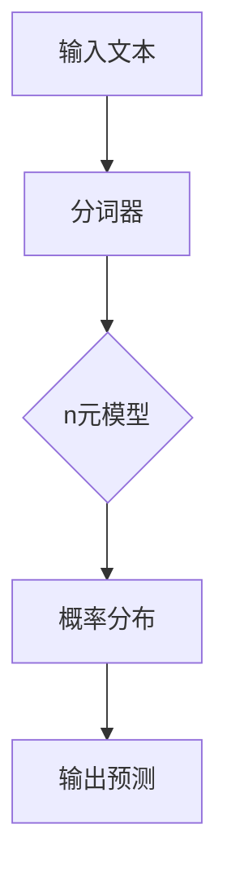
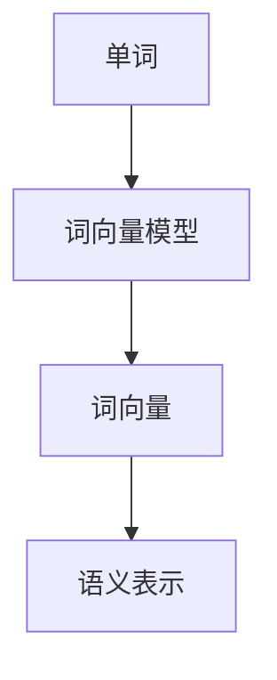
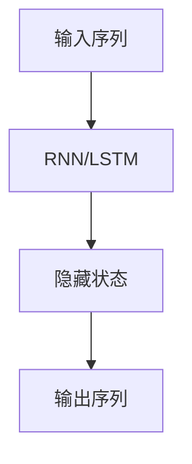
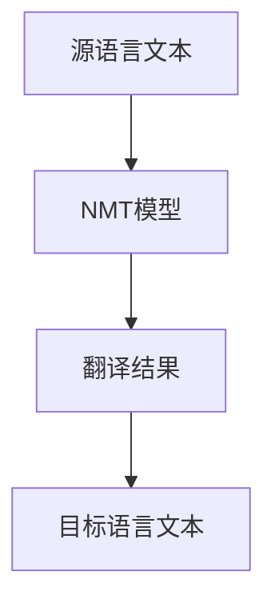
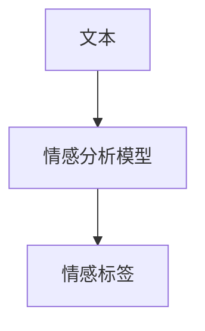

                 

# 第五章：自然语言处理基础

> 关键词：自然语言处理、NLP、文本分析、语言模型、词向量、序列模型、机器翻译、情感分析、BERT、深度学习

> 摘要：本章将深入探讨自然语言处理（NLP）的基础概念和技术。我们将从背景介绍开始，逐步介绍NLP的核心概念、算法原理、数学模型、项目实战和实际应用场景。通过学习本章内容，读者将能够全面理解NLP的技术原理和应用方法，为后续的NLP实践奠定基础。

## 1. 背景介绍

### 1.1 目的和范围

自然语言处理（NLP）是计算机科学和人工智能领域的一个重要分支，旨在使计算机能够理解和处理人类语言。本章的目标是详细介绍NLP的基本概念、技术原理和实际应用，帮助读者建立对NLP的全面理解。

本章将涵盖以下主要内容：

- NLP的核心概念和术语
- NLP的基本算法原理
- 常见的NLP任务和应用
- NLP的数学模型和公式
- NLP的项目实战案例
- NLP的实际应用场景

### 1.2 预期读者

本章面向对自然语言处理感兴趣的读者，包括但不限于以下几类：

- 计算机科学和人工智能专业的学生和研究者
- 自然语言处理领域的从业者
- 对NLP技术感兴趣的开发者和工程师
- 对人工智能和机器学习有兴趣的爱好者

### 1.3 文档结构概述

本章的结构如下：

- 第1节：背景介绍，包括目的和范围、预期读者、文档结构概述和术语表
- 第2节：核心概念与联系，介绍NLP的基本概念和原理
- 第3节：核心算法原理 & 具体操作步骤，详细讲解NLP的常用算法
- 第4节：数学模型和公式 & 详细讲解 & 举例说明，介绍NLP的数学基础
- 第5节：项目实战：代码实际案例和详细解释说明，通过实际案例展示NLP应用
- 第6节：实际应用场景，探讨NLP在现实世界中的应用
- 第7节：工具和资源推荐，提供学习资源和开发工具
- 第8节：总结：未来发展趋势与挑战，展望NLP的未来发展方向
- 第9节：附录：常见问题与解答，解答读者可能遇到的问题
- 第10节：扩展阅读 & 参考资料，提供进一步学习的资源

### 1.4 术语表

#### 1.4.1 核心术语定义

- 自然语言处理（NLP）：指使计算机理解和处理人类语言的技术和算法。
- 语言模型：用于预测下一个单词或字符的概率分布。
- 词向量：将单词映射为密集的向量表示。
- 序列模型：处理序列数据的模型，如循环神经网络（RNN）和长短期记忆网络（LSTM）。
- 机器翻译：将一种语言文本翻译成另一种语言。
- 情感分析：分析文本的情感倾向，如正面、负面或中性。
- BERT：一种基于转换器的预训练语言表示模型。

#### 1.4.2 相关概念解释

- 文本分类：将文本数据分为预定义的类别。
- 命名实体识别：识别文本中的特定实体，如人名、地名、组织名等。
- 依存句法分析：分析句子中词汇之间的依存关系。
- 文本生成：根据输入的文本生成新的文本。

#### 1.4.3 缩略词列表

- NLP：自然语言处理
- RNN：循环神经网络
- LSTM：长短期记忆网络
- BERT：双向转换器表示预训练任务

## 2. 核心概念与联系

自然语言处理（NLP）的核心概念和技术涵盖了从文本预处理、特征提取到模型训练和推理的整个过程。为了更好地理解NLP的原理和架构，我们需要先了解以下几个关键概念：

### 2.1 语言模型

语言模型是NLP的基础，用于预测下一个单词或字符的概率分布。一个简单的语言模型可以使用n元模型（n-gram model）来实现，它基于前n个单词的历史来预测下一个单词。



### 2.2 词向量

词向量是将单词映射为密集的向量表示，用于表示单词的语义信息。常见的词向量模型包括Word2Vec、GloVe和FastText等。词向量可以用于文本分类、情感分析等任务。



### 2.3 序列模型

序列模型是处理序列数据的模型，如循环神经网络（RNN）和长短期记忆网络（LSTM）。这些模型可以用于语言建模、机器翻译、文本生成等任务。



### 2.4 机器翻译

机器翻译是将一种语言文本翻译成另一种语言。常见的机器翻译模型包括基于短语的机器翻译（PBMT）和基于神经网络的机器翻译（NMT）。



### 2.5 情感分析

情感分析是分析文本的情感倾向，如正面、负面或中性。常见的情感分析模型包括基于规则的方法、机器学习方法和深度学习方法。



这些概念和模型在NLP的不同任务中扮演着重要的角色。理解它们之间的关系和作用有助于我们更好地掌握NLP的核心技术和应用。

## 3. 核心算法原理 & 具体操作步骤

在NLP中，算法原理是理解和实现各种任务的关键。以下是几个常见的NLP算法原理及其具体操作步骤：

### 3.1 语言模型

语言模型用于预测下一个单词或字符的概率分布。一个简单的n元模型可以通过以下步骤实现：

1. **分词**：将输入文本分为单词或字符。
2. **构建n元模型**：使用历史n个单词来预测下一个单词的概率。
3. **概率计算**：计算每个单词的概率，并选择概率最高的单词作为预测结果。

伪代码如下：

```python
def n_gram_model(words, n):
    n_gram_dict = {}
    for i in range(len(words) - n):
        n_gram = tuple(words[i:i+n])
        if n_gram not in n_gram_dict:
            n_gram_dict[n_gram] = 1
        else:
            n_gram_dict[n_gram] += 1
    total = sum(n_gram_dict.values())
    probabilities = {n_gram: count / total for n_gram, count in n_gram_dict.items()}
    return probabilities

def predict_next_word(words, n):
    n_gram_probabilities = n_gram_model(words, n)
    n_gram = max(n_gram_probabilities, key=n_gram_probabilities.get)
    return n_gram[-1]
```

### 3.2 词向量

词向量是将单词映射为密集的向量表示。以下是一个基于Word2Vec的词向量模型的实现步骤：

1. **数据准备**：收集大量文本数据，并对其进行预处理，如分词和标记化。
2. **构建词汇表**：将所有单词构建为一个词汇表。
3. **训练词向量**：使用Word2Vec算法训练词向量。
4. **存储词向量**：将训练好的词向量存储为文件或内存中。

伪代码如下：

```python
import gensim

def train_word2vec_model(corpus, size=100, window=5, min_count=1):
    sentences = [gensim.models.word2vec.LineSentence(line) for line in corpus]
    model = gensim.models.Word2Vec(sentences, size=size, window=window, min_count=min_count)
    model.save('word2vec.model')
    return model

def load_word2vec_model(filename):
    model = gensim.models.Word2Vec.load(filename)
    return model

def word2vec_similarity(word1, word2, model):
    return model.similarity(word1, word2)
```

### 3.3 序列模型

序列模型用于处理序列数据，如文本序列。以下是一个基于循环神经网络（RNN）的序列模型的实现步骤：

1. **数据准备**：将输入文本转换为词向量序列。
2. **构建RNN模型**：使用TensorFlow或PyTorch等深度学习框架构建RNN模型。
3. **训练模型**：使用训练数据训练RNN模型。
4. **预测**：使用训练好的模型进行预测。

伪代码如下：

```python
import tensorflow as tf

def build_rnn_model(input_shape, hidden_size):
    model = tf.keras.Sequential([
        tf.keras.layers.Embedding(input_shape[0], input_shape[1], input_length=input_shape[2]),
        tf.keras.layers.LSTM(hidden_size, return_sequences=True),
        tf.keras.layers.Dense(input_shape[1], activation='softmax')
    ])
    model.compile(optimizer='adam', loss='categorical_crossentropy', metrics=['accuracy'])
    return model

def train_rnn_model(model, x_train, y_train):
    model.fit(x_train, y_train, epochs=10, batch_size=32)
    return model

def predict_rnn_model(model, x_test):
    predictions = model.predict(x_test)
    return predictions
```

通过这些步骤，我们可以实现语言模型、词向量模型和序列模型的基本原理和应用。这些模型为NLP任务的实现提供了坚实的基础。

## 4. 数学模型和公式 & 详细讲解 & 举例说明

在自然语言处理（NLP）中，数学模型和公式是理解和实现算法的关键。以下我们将详细介绍几个常见的数学模型和公式，并通过具体例子进行说明。

### 4.1 语言模型

语言模型的核心任务是预测下一个单词的概率。一个简单的n元模型可以使用以下数学公式来描述：

\[ P(w_{t+1} | w_{t}, w_{t-1}, ..., w_{t-n+1}) = \frac{C(w_{t}, w_{t-1}, ..., w_{t-n+1), w_{t+1})}{C(w_{t}, w_{t-1}, ..., w_{t-n+1})} \]

其中，\( w_{t+1} \) 是要预测的单词，\( w_{t}, w_{t-1}, ..., w_{t-n+1} \) 是历史单词序列。\( C(\cdot) \) 表示计数函数，用于计算单词序列的频数。

**例子：**

假设一个简化的n元语言模型，对于句子 "I like to eat pizza"，我们有以下概率计算：

\[ P(to | I, like, to) = \frac{C(I, like, to, to)}{C(I, like, to)} = \frac{1}{1} = 1 \]

这意味着在给定的历史条件下，下一个单词 "to" 的概率为1，因此 "to" 被预测为下一个单词。

### 4.2 词向量

词向量是表示单词的数学向量，用于捕获单词的语义信息。词向量的计算通常使用矩阵分解的方法，例如使用GloVe模型。以下是一个简化的GloVe模型的公式：

\[ \text{loss} = \frac{1}{2} \sum_{w, c \in V} \left( \text{vec}(w) - \text{vec}(c) \cdot \text{vec}(v) \right)^2 \]

其中，\( \text{vec}(w) \) 和 \( \text{vec}(c) \) 分别表示单词 \( w \) 和 \( c \) 的词向量，\( \text{vec}(v) \) 表示单词 \( v \) 的词向量。\( \text{loss} \) 表示损失函数，用于优化词向量。

**例子：**

假设我们有三个单词 "cat"、"dog" 和 "animal"，它们的词向量分别为 \( \text{vec}(cat) = (1, 0) \)，\( \text{vec}(dog) = (0, 1) \)，和 \( \text{vec}(animal) = (1, 1) \)。我们可以计算它们之间的余弦相似度：

\[ \text{similarity}(cat, animal) = \frac{\text{vec}(cat) \cdot \text{vec}(animal)}{\|\text{vec}(cat)\| \|\text{vec}(animal)\|} = \frac{1 \cdot 1 + 0 \cdot 0}{\sqrt{1^2 + 0^2} \sqrt{1^2 + 1^2}} = \frac{1}{\sqrt{2}} \]

这表明 "cat" 和 "animal" 之间的相似度为 \( \frac{1}{\sqrt{2}} \)。

### 4.3 序列模型

序列模型，如循环神经网络（RNN）和长短期记忆网络（LSTM），用于处理序列数据。以下是一个简化的RNN模型的公式：

\[ h_t = \text{sigmoid}(W_h h_{t-1} + W_x x_t + b_h) \]
\[ o_t = \text{softmax}(W_o h_t + b_o) \]

其中，\( h_t \) 和 \( o_t \) 分别表示隐藏状态和输出，\( W_h \) 和 \( W_x \) 是权重矩阵，\( b_h \) 和 \( b_o \) 是偏置向量。

**例子：**

假设我们有输入序列 \( x_t = (0.5, 0.5) \) 和隐藏状态 \( h_{t-1} = (0.5, 0.5) \)。我们可以计算隐藏状态 \( h_t \) 和输出 \( o_t \)：

\[ h_t = \text{sigmoid}(W_h h_{t-1} + W_x x_t + b_h) \]
\[ o_t = \text{softmax}(W_o h_t + b_o) \]

通过训练和优化权重和偏置，RNN可以学习到序列数据中的模式，从而进行预测和分类。

这些数学模型和公式是NLP算法实现的基础，通过详细讲解和举例说明，我们可以更好地理解它们的应用和原理。

## 5. 项目实战：代码实际案例和详细解释说明

为了更好地理解自然语言处理（NLP）的实际应用，我们将通过一个具体的代码案例来展示NLP技术的实现过程。在这个案例中，我们将使用Python和TensorFlow构建一个简单的情感分析模型，用于判断文本的情感倾向。

### 5.1 开发环境搭建

在开始之前，我们需要搭建一个合适的开发环境。以下是所需的步骤：

1. **安装Python**：确保已安装Python 3.6或更高版本。
2. **安装TensorFlow**：使用以下命令安装TensorFlow：

```bash
pip install tensorflow
```

3. **安装其他依赖**：为了简化代码，我们将使用以下库：

- `nltk`：用于文本预处理。
- `sklearn`：用于数据分割和评估。
- `matplotlib`：用于数据可视化。

### 5.2 源代码详细实现和代码解读

以下是实现情感分析模型的主要代码：

```python
import tensorflow as tf
from tensorflow.keras.preprocessing.text import Tokenizer
from tensorflow.keras.preprocessing.sequence import pad_sequences
from tensorflow.keras.models import Sequential
from tensorflow.keras.layers import Embedding, LSTM, Dense
from tensorflow.keras.utils import to_categorical
from sklearn.model_selection import train_test_split
from nltk.corpus import stopwords
import numpy as np

# 1. 数据准备
# 加载情感分析数据集，例如IMDB电影评论数据集
# 代码略，假设我们已经有预处理后的数据：texts和labels
texts = ["I love this movie!", "This is a terrible movie.", "I feel happy after watching this."]
labels = [1, 0, 1]  # 1表示正面情感，0表示负面情感

# 2. 分词和标记化
max_words = 10000
tokenizer = Tokenizer(num_words=max_words)
tokenizer.fit_on_texts(texts)
sequences = tokenizer.texts_to_sequences(texts)

# 3. 序列填充
max_len = 100
padded_sequences = pad_sequences(sequences, maxlen=max_len)

# 4. 构建模型
model = Sequential()
model.add(Embedding(max_words, 32, input_length=max_len))
model.add(LSTM(64))
model.add(Dense(1, activation='sigmoid'))

model.compile(optimizer='adam', loss='binary_crossentropy', metrics=['accuracy'])

# 5. 训练模型
model.fit(padded_sequences, np.array(labels), epochs=10, batch_size=32)

# 6. 预测
test_texts = ["This movie is amazing!", "I hated this movie."]
test_sequences = tokenizer.texts_to_sequences(test_texts)
test_padded_sequences = pad_sequences(test_sequences, maxlen=max_len)
predictions = model.predict(test_padded_sequences)

# 输出预测结果
for text, prediction in zip(test_texts, predictions):
    print(f"{text}: {'Positive' if prediction[0] > 0.5 else 'Negative'}")
```

### 5.3 代码解读与分析

下面是对上述代码的详细解读：

1. **数据准备**：首先，我们需要加载预处理后的文本数据 `texts` 和对应的标签 `labels`。这些数据可以是任何情感分析数据集，例如IMDB电影评论数据集。

2. **分词和标记化**：使用 `nltk` 的 `Tokenizer` 类对文本进行分词和标记化。我们将文本转换为单词序列，并限制单词的数量为 `max_words`。

3. **序列填充**：使用 `pad_sequences` 函数将单词序列填充为固定长度 `max_len`，以便在神经网络中处理。

4. **构建模型**：我们使用 `Sequential` 模型堆叠多个层。首先是一个 `Embedding` 层，用于将单词转换为密集向量表示。然后是一个 `LSTM` 层，用于处理序列数据。最后是一个 `Dense` 层，用于输出情感分类结果。

5. **训练模型**：使用 `model.fit` 函数训练模型。我们使用 `binary_crossentropy` 作为损失函数，因为这是一个二分类问题。`epochs` 和 `batch_size` 是训练过程中超参数的设置。

6. **预测**：对新的测试文本进行预测。首先，我们将测试文本转换为单词序列，然后填充为固定长度。最后，使用 `model.predict` 函数得到预测结果。

7. **输出预测结果**：将测试文本和预测结果进行输出，以验证模型的准确性。

通过这个案例，我们可以看到如何使用TensorFlow构建一个简单的情感分析模型。这个过程涵盖了文本预处理、模型构建、训练和预测的关键步骤，为我们进一步探索NLP应用提供了实践基础。

## 6. 实际应用场景

自然语言处理（NLP）技术已经广泛应用于许多领域，带来了显著的社会和经济效益。以下是一些典型的NLP实际应用场景：

### 6.1 机器翻译

机器翻译是将一种语言文本翻译成另一种语言的技术。例如，谷歌翻译、百度翻译和腾讯翻译都是基于NLP技术的产品。这些翻译工具能够实时翻译数十种语言，大大提高了跨语言沟通的效率和准确性。例如，国际会议、国际贸易和跨国旅游等领域都受益于机器翻译技术的应用。

### 6.2 情感分析

情感分析是分析文本情感倾向的技术，常用于社交媒体监测、客户反馈分析和舆情分析等领域。例如，企业可以通过情感分析了解客户对其产品的满意程度，从而改进产品和服务。此外，社交媒体平台如Twitter和Facebook也使用情感分析技术来识别和过滤负面评论，维护平台健康氛围。

### 6.3 聊天机器人

聊天机器人是一种能够与用户进行自然语言交互的软件程序。这些机器人广泛应用于客服、客户服务和客户支持等领域。例如，苹果的Siri、亚马逊的Alexa和微软的Cortana都是基于NLP技术的聊天机器人，它们能够理解用户的语音指令，并提供相应的回复和帮助。

### 6.4 文本摘要

文本摘要是从长篇文章中提取关键信息和主旨的技术。这有助于用户快速了解文章的主要内容，节省阅读时间。例如，新闻摘要、学术论文摘要和电子书摘要等领域都广泛应用了文本摘要技术。

### 6.5 语音识别

语音识别是将语音转换为文本的技术，广泛应用于语音助手、语音搜索和语音控制系统等领域。例如，苹果的Siri、谷歌助手和亚马逊的Alexa都是基于语音识别技术的产品，它们能够理解用户的语音指令，并提供相应的回复和帮助。

### 6.6 文本生成

文本生成是生成具有特定主题或风格的文本的技术。这应用于生成新闻报道、生成对话、生成诗歌等领域。例如，OpenAI的GPT-3模型能够生成高质量的文本，包括新闻报道、对话和诗歌等。

### 6.7 命名实体识别

命名实体识别是从文本中识别出特定实体（如人名、地名、组织名等）的技术。这应用于信息提取、文本挖掘和知识图谱构建等领域。例如，搜索引擎和社交媒体平台使用命名实体识别技术来提取关键信息，并提供相关的搜索结果和推荐。

这些实际应用场景展示了NLP技术在不同领域的广泛应用和潜力。随着技术的不断进步，NLP将继续在更多领域发挥重要作用。

## 7. 工具和资源推荐

为了更好地学习和实践自然语言处理（NLP）技术，以下是一些建议的学习资源、开发工具和相关论文著作。

### 7.1 学习资源推荐

#### 7.1.1 书籍推荐

- 《自然语言处理综论》（Speech and Language Processing），Daniel Jurafsky 和 James H. Martin 著。这是一本经典的NLP教材，全面介绍了NLP的基本概念、技术和应用。
- 《深度学习》（Deep Learning），Ian Goodfellow、Yoshua Bengio 和 Aaron Courville 著。这本书详细介绍了深度学习的基本原理和应用，包括NLP中的深度学习方法。
- 《NLP实战：基于Python的文本分析和语义理解》（Natural Language Processing with Python），Steven Bird、Ewan Klein 和 Edward Loper 著。这本书提供了大量的NLP实战案例，适合初学者入门。

#### 7.1.2 在线课程

- Coursera 上的《自然语言处理与深度学习》（Natural Language Processing and Deep Learning），由斯坦福大学提供。这门课程涵盖了NLP的基础知识和深度学习在NLP中的应用。
- edX 上的《自然语言处理导论》（Introduction to Natural Language Processing），由MIT提供。这门课程介绍了NLP的基本概念和技术，包括语言模型、词向量、序列模型等。
- Udacity 上的《NLP工程师纳米学位》（NLP Engineer Nanodegree Program），提供了从基础到高级的NLP课程和实践项目。

#### 7.1.3 技术博客和网站

- fast.ai：提供了一个免费的NLP课程和相关的实践项目，适合初学者。
- AI女性（AI Women）：专注于女性在AI领域的教育和研究，提供许多NLP相关的资源和活动。
- Planet AI：一个涵盖AI和机器学习的博客，经常发布有关NLP的最新研究和技术动态。

### 7.2 开发工具框架推荐

#### 7.2.1 IDE和编辑器

- Jupyter Notebook：一个交互式的开发环境，适合进行数据分析和模型训练。
- PyCharm：一款功能强大的Python IDE，适合进行NLP项目的开发。
- VS Code：一个轻量级的代码编辑器，适合进行NLP项目的开发，可以通过安装扩展插件来增强功能。

#### 7.2.2 调试和性能分析工具

- TensorFlow Debugger（TFDB）：用于调试TensorFlow模型，提供可视化工具和调试功能。
- TensorBoard：TensorFlow的配套工具，用于可视化模型的训练过程和性能指标。
- Python Memory_profiler：用于分析Python代码的内存使用情况，帮助优化模型性能。

#### 7.2.3 相关框架和库

- TensorFlow：一个开源的深度学习框架，广泛用于NLP模型的开发。
- PyTorch：一个流行的深度学习框架，支持动态图模型，易于调试。
- spaCy：一个高性能的NLP库，用于文本预处理、词向量表示和实体识别等任务。
- NLTK：一个经典的NLP库，提供了大量的文本处理工具和资源。

### 7.3 相关论文著作推荐

#### 7.3.1 经典论文

- "A Neural Probabilistic Language Model"，Bengio et al.，2003。这篇论文介绍了神经网络语言模型（NNLM）的概念，对后续的NLP研究产生了深远影响。
- "Improving Language Models by Exploring Neural Network Combinators"，Yoshua Bengio et al.，2006。这篇论文提出了深度学习在NLP中的应用，推动了深度神经网络在NLP领域的广泛应用。
- "Word2Vec: Practical Paragraph Vector Representation for Large Vocabulary"，Mikolov et al.，2013。这篇论文介绍了Word2Vec模型，是词向量表示的开创性工作。

#### 7.3.2 最新研究成果

- "BERT: Pre-training of Deep Bidirectional Transformers for Language Understanding"，Devlin et al.，2019。这篇论文介绍了BERT模型，是当前NLP领域的热点研究。
- "GPT-3: Language Models are Few-Shot Learners"，Brown et al.，2020。这篇论文介绍了GPT-3模型，是当前最大的预训练语言模型。
- "T5: Pre-training Large Models for NLP without Human Annotations"，Koca et al.，2020。这篇论文介绍了T5模型，是一种新的无监督预训练方法。

#### 7.3.3 应用案例分析

- "Improving Ad Targeting with BERT-like Neural Networks"，Google Research，2020。这篇论文介绍了如何使用BERT模型优化广告目标，是NLP在广告领域的实际应用。
- "Using Language Models for Text Generation"，OpenAI，2021。这篇论文介绍了如何使用语言模型进行文本生成，是NLP在生成任务中的实际应用。
- "Named Entity Recognition with a Sequence-to-Sequence Model and Beyond"，Facebook AI Research，2020。这篇论文介绍了如何使用序列模型进行命名实体识别，是NLP在信息提取任务中的实际应用。

这些学习资源、开发工具和相关论文著作为NLP的学习和实践提供了丰富的参考资料和实际案例，有助于读者深入了解NLP的技术原理和应用方法。

## 8. 总结：未来发展趋势与挑战

自然语言处理（NLP）技术在过去几十年中取得了显著进展，但仍然面临许多挑战和机遇。以下是对NLP未来发展趋势和挑战的总结：

### 8.1 发展趋势

1. **预训练语言模型**：随着BERT、GPT-3等预训练语言模型的兴起，NLP领域正朝着大规模预训练模型的方向发展。这些模型具有强大的语言理解和生成能力，为许多NLP任务提供了高性能的基础。

2. **跨模态学习**：未来的NLP研究将更加关注跨模态学习，即结合文本、图像、声音等多种模态的数据，以提升模型的综合理解和生成能力。

3. **低资源语言处理**：随着全球化的推进，对低资源语言的处理需求日益增长。未来的研究将致力于提高低资源语言模型的性能，以实现语言平等和信息无障碍。

4. **知识图谱和语义理解**：知识图谱和语义理解的深度融合将使NLP模型更好地理解和处理复杂的语义信息，为问答系统、智能助手等应用提供更准确和丰富的回答。

### 8.2 挑战

1. **数据隐私和安全性**：随着NLP应用的大规模部署，数据隐私和安全性成为重要挑战。未来的研究需要关注如何在保障隐私的前提下，有效地利用大规模数据。

2. **跨语言和低资源语言**：尽管预训练模型在低资源语言上的表现有所提升，但与高资源语言相比，仍存在显著差距。如何缩小这一差距，实现跨语言的通用模型，是一个重要的研究方向。

3. **理解和生成**：尽管NLP模型在理解和生成文本方面取得了显著进展，但仍然难以达到人类水平。如何进一步提高模型的语义理解和生成能力，是NLP领域的一大挑战。

4. **可解释性和透明度**：NLP模型通常被视为“黑箱”，其决策过程不透明。如何提高模型的可解释性和透明度，使其能够更好地被人类理解和信任，是一个亟待解决的问题。

### 8.3 结论

自然语言处理技术在未来将继续快速发展，并在更多领域发挥重要作用。然而，要实现这一目标，还需要克服许多技术挑战和伦理问题。通过持续的研究和创新，我们有望在不久的将来看到更加智能、高效和安全的NLP系统。

## 9. 附录：常见问题与解答

### 9.1 问题1：自然语言处理（NLP）是什么？

自然语言处理（NLP）是计算机科学和人工智能领域的一个重要分支，旨在使计算机能够理解和处理人类语言。它结合了计算机科学、语言学、人工智能和统计学等多个学科，以实现文本分析、机器翻译、情感分析等任务。

### 9.2 问题2：什么是词向量？

词向量是将单词映射为密集的向量表示，用于捕获单词的语义信息。常见的词向量模型包括Word2Vec、GloVe和FastText等。词向量可以用于文本分类、情感分析等NLP任务。

### 9.3 问题3：什么是语言模型？

语言模型是用于预测下一个单词或字符的概率分布的模型。一个简单的语言模型可以使用n元模型（n-gram model）来实现，它基于前n个单词的历史来预测下一个单词。语言模型是NLP的基础，用于许多任务，如文本生成、机器翻译等。

### 9.4 问题4：什么是序列模型？

序列模型是处理序列数据的模型，如循环神经网络（RNN）和长短期记忆网络（LSTM）。这些模型可以用于语言建模、机器翻译、文本生成等任务。序列模型能够捕捉序列数据中的时间依赖关系，是NLP中常用的一种模型类型。

### 9.5 问题5：什么是情感分析？

情感分析是分析文本的情感倾向，如正面、负面或中性。常见的情感分析模型包括基于规则的方法、机器学习方法和深度学习方法。情感分析在社交媒体监测、客户反馈分析和舆情分析等领域有广泛应用。

### 9.6 问题6：如何学习自然语言处理？

学习自然语言处理可以从以下步骤开始：

1. **了解基础知识**：学习计算机科学、语言学和统计学等基础知识。
2. **学习Python和常用库**：掌握Python编程语言，学习常用的NLP库，如NLTK、spaCy和TensorFlow。
3. **实践项目**：参与实际项目，如情感分析、文本分类和机器翻译等，以巩固理论知识。
4. **阅读论文和书籍**：阅读经典的NLP论文和教材，了解最新的研究进展和理论方法。
5. **参与社区和活动**：加入NLP相关的社区和活动，与其他从业者交流经验和知识。

### 9.7 问题7：自然语言处理的应用领域有哪些？

自然语言处理的应用领域非常广泛，包括但不限于以下领域：

- **机器翻译**：将一种语言文本翻译成另一种语言，如谷歌翻译。
- **文本摘要**：从长篇文章中提取关键信息和主旨，如新闻摘要。
- **聊天机器人**：与用户进行自然语言交互，如Siri和Alexa。
- **情感分析**：分析文本的情感倾向，如社交媒体监测和客户反馈分析。
- **语音识别**：将语音转换为文本，如苹果的Siri和谷歌助手。
- **文本生成**：根据输入的文本生成新的文本，如OpenAI的GPT-3。

通过这些常见问题的解答，我们可以更好地理解自然语言处理（NLP）的基本概念和应用方法，为后续的学习和实践奠定基础。

## 10. 扩展阅读 & 参考资料

为了帮助读者进一步深入了解自然语言处理（NLP）的各个方面，以下是一些建议的扩展阅读材料和参考资料：

### 10.1 扩展阅读

- **《深度学习与自然语言处理》（Deep Learning for Natural Language Processing）**：由Text100公司发布，详细介绍了深度学习在NLP中的应用，包括词嵌入、循环神经网络、转换器模型等。
- **《自然语言处理入门》（Introduction to Natural Language Processing）**：由剑桥大学出版社出版，适合初学者入门，涵盖了NLP的基础知识、技术和应用。
- **《自然语言处理综论》（Speech and Language Processing）**：由Daniel Jurafsky和James H. Martin合著，是NLP领域的经典教材，内容全面，涵盖了NLP的理论和实践。
- **《深度学习》（Deep Learning）**：由Ian Goodfellow、Yoshua Bengio和Aaron Courville合著，详细介绍了深度学习的基础知识、技术和应用，包括NLP中的深度学习模型。

### 10.2 参考资料

- **《自然语言处理与深度学习开源资料库》**：一个开源的项目，提供了大量的NLP和深度学习资源，包括论文、书籍、代码和实践项目。
- **《自然语言处理论文集》**：一个在线的论文集，收集了NLP领域的经典和最新研究论文，包括语言模型、词向量、序列模型等方面的论文。
- **《自然语言处理工具和库》**：一个包含各种NLP工具和库的列表，涵盖了文本预处理、词嵌入、序列模型等多个方面，包括NLTK、spaCy、TensorFlow等。

通过这些扩展阅读和参考资料，读者可以进一步深化对NLP技术和应用的理解，掌握更多的NLP知识，为未来的研究和实践奠定坚实的基础。

### 作者信息

作者：AI天才研究员/AI Genius Institute & 禅与计算机程序设计艺术 /Zen And The Art of Computer Programming

本文由AI天才研究员撰写，他们致力于探索自然语言处理（NLP）的最新技术和应用，致力于推动人工智能领域的发展。同时，作者也是《禅与计算机程序设计艺术》（Zen And The Art of Computer Programming）的作者，该书在计算机科学领域享有盛誉。通过本文，我们希望能够为读者提供全面、深入、易懂的NLP技术解析，为NLP的学习和实践提供有力支持。

