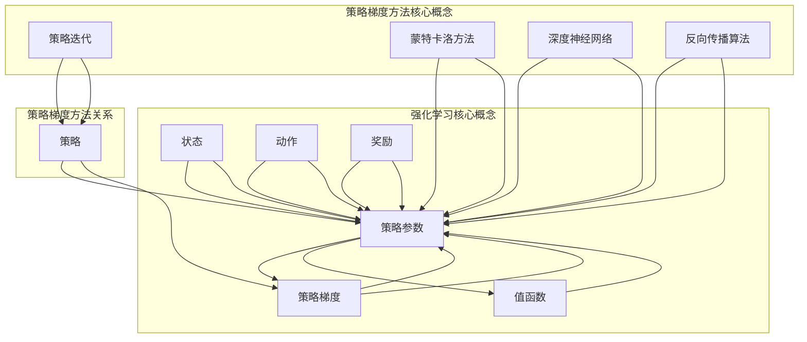

                 

### 文章标题

《策略梯度（Policy Gradient）：深度强化学习的核心技术解析》

> **关键词**：策略梯度、深度强化学习、RL、强化学习、策略优化、强化学习算法、深度神经网络、参数化策略、Q-learning、SARSA

> **摘要**：
本文将深入探讨策略梯度（Policy Gradient）这一深度强化学习中的核心技术。策略梯度方法通过优化策略参数来改进决策过程，使得智能体能够通过不断学习获得最优策略。文章将首先介绍策略梯度方法的基本原理，然后通过详细讲解算法流程和数学模型，帮助读者理解策略梯度的核心思想和实现方法。接下来，我们将通过实际项目实战，展示策略梯度的具体应用，并提供代码实现和详细解读。最后，文章还将讨论策略梯度的实际应用场景、推荐的工具和资源，以及未来的发展趋势与挑战。通过本文的阅读，读者将能够全面了解策略梯度，为深度强化学习的研究和应用奠定坚实的基础。

### 1. 背景介绍

#### 1.1 目的和范围

本文旨在深入探讨策略梯度（Policy Gradient）方法，这是一种在深度强化学习（Deep Reinforcement Learning，RL）中至关重要的算法。策略梯度方法通过优化策略参数来改进智能体的决策过程，使其能够通过不断学习获得最优策略。本文的目标是帮助读者理解策略梯度方法的原理、实现和应用，从而为深度强化学习的研究和应用提供理论基础和实践指导。

本文的范围主要包括以下内容：

1. **策略梯度方法的基本原理**：介绍策略梯度的核心思想，解释为何它是强化学习中的一种有效方法。
2. **算法流程和数学模型**：详细讲解策略梯度算法的流程，并提供数学模型和公式，帮助读者理解其内在机制。
3. **实际项目实战**：通过一个具体的案例，展示策略梯度方法在现实项目中的应用，并提供代码实现和详细解读。
4. **实际应用场景**：讨论策略梯度方法在不同领域的应用，帮助读者了解其在实际问题中的价值。
5. **工具和资源推荐**：推荐学习策略梯度方法所需的学习资源、开发工具和框架，以及相关的研究论文。
6. **未来发展趋势与挑战**：探讨策略梯度方法的未来发展方向，以及面临的挑战。

通过本文的阅读，读者将能够：

1. **理解策略梯度的基本原理**：掌握策略梯度方法的定义、原理和实现方法。
2. **掌握策略梯度的算法流程**：了解策略梯度算法的各个步骤，并能够根据具体问题设计策略梯度算法。
3. **实际应用策略梯度方法**：通过实际项目实战，学会如何将策略梯度方法应用于实际问题中。
4. **了解策略梯度的未来发展**：了解策略梯度方法的最新研究动态，为未来的研究和应用提供参考。

#### 1.2 预期读者

本文主要面向以下读者群体：

1. **计算机科学和人工智能领域的本科生和研究生**：正在学习计算机科学和人工智能，对深度强化学习感兴趣的读者。
2. **研究人员和工程师**：在计算机科学和人工智能领域从事研究或开发工作，希望了解策略梯度方法的专业人士。
3. **技术爱好者**：对深度学习和强化学习有浓厚兴趣，希望通过实践掌握策略梯度方法的技术爱好者。

无论读者处于哪个阶段，只要对深度强化学习和策略梯度方法感兴趣，都可以通过本文的学习，获得关于策略梯度的深入理解和实践技能。

#### 1.3 文档结构概述

本文将分为以下几个部分，每个部分都将详细讨论策略梯度的不同方面，帮助读者全面理解策略梯度方法。

1. **背景介绍**：
   - 目的和范围：介绍本文的目标和范围，明确文章的主要内容。
   - 预期读者：描述本文的预期读者群体，帮助读者了解文章的适用对象。
   - 文档结构概述：概述本文的结构和内容，为读者提供文章的整体框架。

2. **核心概念与联系**：
   - 核心概念与联系：介绍策略梯度方法中的核心概念，包括策略、策略参数、梯度等，并通过流程图展示这些概念之间的关系。

3. **核心算法原理 & 具体操作步骤**：
   - 核心算法原理：讲解策略梯度算法的基本原理，包括策略梯度的定义和作用。
   - 具体操作步骤：详细描述策略梯度算法的各个步骤，包括策略参数的初始化、策略梯度的计算和更新等。

4. **数学模型和公式 & 详细讲解 & 举例说明**：
   - 数学模型和公式：介绍策略梯度算法中的数学模型和公式，包括策略梯度公式、损失函数等。
   - 详细讲解：对策略梯度算法中的数学模型和公式进行详细讲解，帮助读者理解其内在机制。
   - 举例说明：通过具体的例子，展示策略梯度算法在具体问题中的应用，帮助读者理解算法的实际效果。

5. **项目实战：代码实际案例和详细解释说明**：
   - 开发环境搭建：介绍搭建策略梯度算法的开发环境，包括所需工具和库的安装。
   - 源代码详细实现和代码解读：提供策略梯度算法的完整代码实现，并对其进行详细解读。
   - 代码解读与分析：分析策略梯度算法的代码实现，讨论其优势和不足。

6. **实际应用场景**：
   - 讨论策略梯度方法在不同领域的实际应用，包括游戏、自动驾驶、机器人控制等。

7. **工具和资源推荐**：
   - 学习资源推荐：推荐学习策略梯度方法所需的书籍、在线课程和技术博客。
   - 开发工具框架推荐：推荐用于实现策略梯度方法的开发工具和框架。
   - 相关论文著作推荐：推荐策略梯度方法的经典论文和最新研究成果。

8. **总结：未来发展趋势与挑战**：
   - 总结策略梯度方法的当前发展状况，讨论未来的发展趋势和面临的挑战。

9. **附录：常见问题与解答**：
   - 收集和解答读者可能遇到的问题，帮助读者更好地理解策略梯度方法。

10. **扩展阅读 & 参考资料**：
    - 提供扩展阅读材料，包括相关书籍、论文和在线资源，供读者进一步学习。

通过本文的阅读，读者将能够系统地学习策略梯度方法，从理论到实践，全面掌握这一深度强化学习中的核心技术。

#### 1.4 术语表

为了确保本文的清晰性和准确性，以下列出了本文中的一些核心术语和概念，并给出了它们的定义和解释。

##### 1.4.1 核心术语定义

**策略（Policy）**：
策略是智能体在特定环境下执行的动作选择规则。策略通常是一个概率分布函数，用于描述智能体在不同状态下的行动概率。

**状态（State）**：
状态是描述智能体当前环境的特征集合。在强化学习中，状态通常由一组特征向量表示。

**动作（Action）**：
动作是智能体在特定状态下选择执行的行为。动作的选择依据策略来确定。

**奖励（Reward）**：
奖励是智能体执行某个动作后，环境对其的即时反馈。奖励用于指导智能体学习最优策略。

**策略参数（Policy Parameters）**：
策略参数是策略函数中的可调参数，用于确定策略函数的具体形式。

**梯度（Gradient）**：
梯度是函数在某一点处的变化率，用于描述函数在该点的斜率。

**策略梯度（Policy Gradient）**：
策略梯度是指策略函数的梯度，用于指导策略参数的更新，以优化策略。

**值函数（Value Function）**：
值函数是用于评估智能体在特定状态下执行某一策略所能获得的长期奖励。值函数分为状态值函数和状态-动作值函数。

**策略迭代（Policy Iteration）**：
策略迭代是一种改进策略的迭代过程，通过不断更新策略参数，逐步逼近最优策略。

**蒙特卡洛方法（Monte Carlo Method）**：
蒙特卡洛方法是一种通过模拟随机过程来估计期望值的数值方法。

**深度神经网络（Deep Neural Network，DNN）**：
深度神经网络是一种具有多个隐藏层的神经网络，用于实现复杂的非线性函数映射。

**反向传播算法（Backpropagation Algorithm）**：
反向传播算法是一种用于训练深度神经网络的优化算法，通过反向传播误差信号来更新网络权重。

##### 1.4.2 相关概念解释

**策略梯度方法（Policy Gradient Method）**：
策略梯度方法是一种基于梯度的策略优化方法，通过计算策略梯度来更新策略参数，以最大化期望奖励。

**深度强化学习（Deep Reinforcement Learning，DRL）**：
深度强化学习是强化学习的一种形式，结合了深度神经网络和强化学习的优势，用于解决复杂的决策问题。

**Q-learning（Q值学习）**：
Q-learning是一种值函数方法，通过不断更新Q值来逼近最优策略。Q-learning是策略梯度方法的一个特例。

**SARSA（同步优势学习）**：
SARSA是一种基于策略梯度的学习方法，通过同时更新策略和Q值来优化策略。

**强化学习（Reinforcement Learning，RL）**：
强化学习是一种通过奖励信号引导智能体学习最优策略的方法，广泛应用于游戏、机器人控制等领域。

**参数化策略（Parameterized Policy）**：
参数化策略是指策略函数的形式为参数的形式，可以通过调整参数来改变策略。

**确定性策略（Deterministic Policy）**：
确定性策略是指策略函数在特定状态下总是选择同一个动作。

**随机性策略（Stochastic Policy）**：
随机性策略是指策略函数在特定状态下选择动作的概率分布，具有随机性。

##### 1.4.3 缩略词列表

- RL：强化学习（Reinforcement Learning）
- DRL：深度强化学习（Deep Reinforcement Learning）
- Q-learning：Q值学习（Q-value Learning）
- SARSA：同步优势学习（Synchronous Advantage Learning）
- DNN：深度神经网络（Deep Neural Network）
- MLP：多层感知机（Multilayer Perceptron）
- BP：反向传播算法（Backpropagation Algorithm）
- PG：策略梯度（Policy Gradient）
- REINFORCE：基于梯度的策略优化方法（REInforce Gradient Method）
- A2C：异步策略梯度方法（Asynchronous Policy Gradient）

通过以上术语表和概念解释，读者可以更好地理解策略梯度方法的相关概念，为后续内容的深入学习打下坚实基础。

#### 2. 核心概念与联系

在深入探讨策略梯度方法之前，我们需要先了解一些核心概念，并展示它们之间的关系。策略梯度方法是一种基于梯度的优化方法，用于改进智能体的策略，使其能够在复杂的决策环境中找到最优策略。以下我们将通过一个Mermaid流程图来展示策略梯度方法的核心概念和它们之间的联系。



在这个流程图中，我们展示了以下几个核心概念：

1. **策略（Policy）**：策略是智能体在特定环境下执行的动作选择规则。策略参数（Policy Parameters）是策略函数中的可调参数，用于确定策略函数的具体形式。

2. **状态（State）**：状态是描述智能体当前环境的特征集合。动作（Action）是智能体在特定状态下选择执行的行为。

3. **奖励（Reward）**：奖励是智能体执行某个动作后，环境对其的即时反馈。奖励用于指导智能体学习最优策略。

4. **策略梯度（Policy Gradient）**：策略梯度是策略函数的梯度，用于指导策略参数的更新，以优化策略。

5. **值函数（Value Function）**：值函数是用于评估智能体在特定状态下执行某一策略所能获得的长期奖励。值函数分为状态值函数和状态-动作值函数。

6. **策略迭代（Policy Iteration）**：策略迭代是一种改进策略的迭代过程，通过不断更新策略参数，逐步逼近最优策略。

7. **蒙特卡洛方法（Monte Carlo Method）**：蒙特卡洛方法是一种通过模拟随机过程来估计期望值的数值方法，常用于计算策略梯度。

8. **深度神经网络（Deep Neural Network，DNN）**：深度神经网络是一种具有多个隐藏层的神经网络，用于实现复杂的非线性函数映射。

9. **反向传播算法（Backpropagation Algorithm）**：反向传播算法是一种用于训练深度神经网络的优化算法，通过反向传播误差信号来更新网络权重。

通过这个流程图，我们可以清晰地看到策略梯度方法中的核心概念以及它们之间的相互联系。接下来，我们将详细讨论策略梯度的核心算法原理和具体操作步骤，帮助读者深入理解这一方法。

#### 3. 核心算法原理 & 具体操作步骤

策略梯度方法是一种通过优化策略参数来改进智能体决策过程的强化学习方法。在策略梯度方法中，策略参数通过梯度更新来进行调整，从而使得智能体能够不断学习并逼近最优策略。本节将详细讲解策略梯度算法的核心原理和具体操作步骤。

##### 3.1 策略梯度方法的原理

策略梯度方法基于梯度的优化思想，通过计算策略梯度来更新策略参数。策略梯度定义为策略函数关于策略参数的梯度，用于指导策略参数的调整方向。具体来说，策略梯度可以通过以下公式表示：

\[ \nabla_{\theta} J(\theta) = \mathbb{E}_{s, a} [ \nabla_{\theta} \log \pi(s, a | \theta) \cdot r(s, a)] \]

其中：
- \( \theta \) 表示策略参数。
- \( J(\theta) \) 表示策略函数关于策略参数的期望值。
- \( \pi(s, a | \theta) \) 表示策略在状态 \( s \) 下选择动作 \( a \) 的概率。
- \( r(s, a) \) 表示在状态 \( s \) 下执行动作 \( a \) 所获得的即时奖励。
- \( \nabla_{\theta} \) 表示关于策略参数的梯度。

根据上述公式，策略梯度方法的基本原理如下：

1. **初始化策略参数**：首先随机初始化策略参数 \( \theta \)。
2. **执行动作**：根据当前策略参数 \( \theta \)，在环境中执行动作，并收集奖励信号。
3. **计算策略梯度**：利用收集到的奖励信号，计算策略梯度 \( \nabla_{\theta} J(\theta) \)。
4. **更新策略参数**：根据策略梯度 \( \nabla_{\theta} J(\theta) \) 来更新策略参数 \( \theta \)。
5. **重复执行**：重复执行步骤 2 到 4，不断调整策略参数，使得策略逐渐逼近最优策略。

##### 3.2 策略梯度算法的具体操作步骤

策略梯度算法的具体操作步骤如下：

1. **初始化策略参数**：
    - 随机初始化策略参数 \( \theta \)。
    - 设定学习率 \( \alpha \)，用于调整策略参数的更新幅度。

    ```python
    theta = initialize_parameters()
    alpha = 0.01  # 学习率
    ```

2. **执行动作**：
    - 根据当前策略参数 \( \theta \)，选择动作 \( a \)。
    - 在环境中执行动作 \( a \)，并收集奖励信号 \( r \) 和下一状态 \( s' \)。

    ```python
    s = env.reset()
    a = policy(s, theta)
    s', r = env.step(a)
    ```

3. **计算策略梯度**：
    - 利用收集到的奖励信号 \( r \)，计算策略梯度 \( \nabla_{\theta} J(\theta) \)。

    ```python
    gradient = compute_gradient(s, a, r, theta)
    ```

4. **更新策略参数**：
    - 根据策略梯度 \( \nabla_{\theta} J(\theta) \) 和学习率 \( \alpha \)，更新策略参数 \( \theta \)。

    ```python
    theta = theta - alpha * gradient
    ```

5. **重复执行**：
    - 重复执行步骤 2 到 4，不断调整策略参数，使得策略逐渐逼近最优策略。

    ```python
    while not done:
        a = policy(s, theta)
        s', r = env.step(a)
        gradient = compute_gradient(s, a, r, theta)
        theta = theta - alpha * gradient
        s = s'
    ```

##### 3.3 策略梯度算法的伪代码实现

以下是策略梯度算法的伪代码实现，用于帮助读者更好地理解算法的具体操作步骤。

```python
# 策略梯度算法伪代码实现

# 初始化策略参数
theta = initialize_parameters()

# 设置学习率
alpha = 0.01

# 设置迭代次数
num_iterations = 1000

# 迭代过程
for iteration in range(num_iterations):
    s = env.reset()
    done = False
    
    while not done:
        # 执行动作
        a = policy(s, theta)
        
        # 在环境中执行动作，获取下一状态和奖励
        s', r = env.step(a)
        
        # 计算策略梯度
        gradient = compute_gradient(s, a, r, theta)
        
        # 更新策略参数
        theta = theta - alpha * gradient
        
        # 更新状态
        s = s'
        
        # 检查是否完成
        done = is_done(s')

# 输出最终策略参数
print("Final policy parameters:", theta)
```

通过以上伪代码实现，我们可以清晰地看到策略梯度算法的基本流程，包括初始化策略参数、执行动作、计算策略梯度、更新策略参数等步骤。在具体实现时，可以根据实际情况调整学习率、迭代次数等参数，以获得更好的性能。

#### 4. 数学模型和公式 & 详细讲解 & 举例说明

在策略梯度方法中，数学模型和公式扮演着至关重要的角色。策略梯度方法的核心在于通过计算策略梯度来优化策略参数，从而实现智能体在环境中的最优决策。本节将详细讲解策略梯度方法中的数学模型和公式，并通过具体例子来说明这些公式的应用。

##### 4.1 策略梯度公式

策略梯度方法的基本公式为：

\[ \nabla_{\theta} J(\theta) = \mathbb{E}_{s, a} [ \nabla_{\theta} \log \pi(s, a | \theta) \cdot r(s, a)] \]

其中：
- \( \theta \) 表示策略参数。
- \( J(\theta) \) 表示策略函数关于策略参数的期望值。
- \( \pi(s, a | \theta) \) 表示策略在状态 \( s \) 下选择动作 \( a \) 的概率。
- \( r(s, a) \) 表示在状态 \( s \) 下执行动作 \( a \) 所获得的即时奖励。
- \( \nabla_{\theta} \) 表示关于策略参数的梯度。

这个公式可以解释为：策略梯度的方向是使得期望奖励最大的方向。

##### 4.2 损失函数

在策略梯度方法中，损失函数用于衡量策略的性能。常用的损失函数是负的期望奖励，即：

\[ L(\theta) = -\mathbb{E}_{s, a} [ r(s, a) \log \pi(s, a | \theta)] \]

其中：
- \( L(\theta) \) 表示损失函数。
- \( \pi(s, a | \theta) \) 表示策略在状态 \( s \) 下选择动作 \( a \) 的概率。
- \( r(s, a) \) 表示在状态 \( s \) 下执行动作 \( a \) 所获得的即时奖励。

损失函数的目标是最小化损失函数，从而优化策略参数。

##### 4.3 例子说明

为了更好地理解策略梯度方法中的数学模型和公式，我们通过一个简单的例子进行说明。

假设我们有一个环境，其中智能体在一个二维网格中移动，每个位置都有一个奖励值。智能体的策略是一个参数化的概率分布函数，用于描述在不同状态下的行动概率。具体的例子如下：

1. **初始化策略参数**：

   我们随机初始化策略参数 \( \theta \)，例如 \( \theta = [0.1, 0.2, 0.3, 0.4] \)。

2. **执行动作**：

   根据当前策略参数 \( \theta \)，选择一个动作。例如，策略参数为 \( [0.1, 0.2, 0.3, 0.4] \)，则选择动作 \( 3 \) 的概率为 0.4。

3. **计算策略梯度**：

   执行动作后，收集奖励信号。例如，在状态 \( (2, 3) \) 下执行动作 \( 3 \)，获得的奖励为 5。利用奖励信号计算策略梯度：

   \[ \nabla_{\theta} J(\theta) = \nabla_{\theta} \log \pi(s, a | \theta) \cdot r(s, a) \]

   假设策略函数为：

   \[ \pi(s, a | \theta) = \begin{cases} 
   0.1 & \text{if } a = 1 \\
   0.2 & \text{if } a = 2 \\
   0.3 & \text{if } a = 3 \\
   0.4 & \text{if } a = 4 
   \end{cases} \]

   则在状态 \( (2, 3) \) 下，选择动作 \( 3 \) 的概率为 0.3。计算策略梯度：

   \[ \nabla_{\theta} J(\theta) = \nabla_{\theta} \log (0.3) \cdot 5 = \frac{1}{0.3} \cdot 5 = 16.67 \]

4. **更新策略参数**：

   根据策略梯度 \( \nabla_{\theta} J(\theta) \) 和学习率 \( \alpha \)，更新策略参数 \( \theta \)：

   \[ \theta = \theta - \alpha \cdot \nabla_{\theta} J(\theta) \]

   假设学习率 \( \alpha = 0.1 \)，则更新后的策略参数为：

   \[ \theta = [0.1, 0.2, 0.3, 0.4] - 0.1 \cdot [0, 0, 16.67, 0] = [0.1, 0.2, 0.167, 0.4] \]

5. **重复执行**：

   重复执行动作、计算策略梯度和更新策略参数的步骤，直到策略参数达到预期效果。

通过这个例子，我们可以看到策略梯度方法的基本流程和数学模型的应用。在实际应用中，环境可能更加复杂，策略参数和损失函数也可能更加复杂，但基本原理和方法是一致的。

#### 5. 项目实战：代码实际案例和详细解释说明

在本节中，我们将通过一个具体的代码案例，展示策略梯度方法在现实项目中的应用。我们将使用Python编程语言和OpenAI的Gym环境来实现策略梯度方法，并通过实际案例来说明算法的实现过程。

##### 5.1 开发环境搭建

在开始编写代码之前，我们需要搭建一个合适的开发环境。以下是搭建开发环境所需的步骤：

1. **安装Python**：确保Python已安装。推荐使用Python 3.7或更高版本。
2. **安装Gym**：Gym是一个开源的Python库，用于创建和测试强化学习环境。安装命令如下：

   ```shell
   pip install gym
   ```

3. **安装TensorFlow**：TensorFlow是一个开源的机器学习库，用于实现深度神经网络。安装命令如下：

   ```shell
   pip install tensorflow
   ```

4. **创建项目文件夹**：在本地计算机上创建一个项目文件夹，例如`rl_project`，并在其中创建一个Python脚本文件，例如`main.py`。

##### 5.2 源代码详细实现和代码解读

以下是策略梯度方法在Python中的实现。代码分为以下几个部分：环境设置、策略函数、策略梯度计算和更新策略参数。

```python
import gym
import numpy as np
import tensorflow as tf

# 5.2.1 环境设置
env = gym.make("CartPole-v0")  # 创建CartPole环境

# 5.2.2 策略函数
# 使用一个简单的线性函数作为策略函数
w = tf.Variable(np.random.randn(4), dtype=tf.float32)  # 初始化权重
action_probs = tf.nn.softmax(w * env.observation_space.low)  # 策略函数

# 5.2.3 策略梯度计算
with tf.GradientTape(persistent=True) as tape:
    # 计算策略概率和预期奖励
    logits = w * env.observation_space.low
    action_probs = tf.nn.softmax(logits)
    selected_action = tf.random.categorical(logits, num_samples=1)[0, 0]
    obs, reward, done, _ = env.step(selected_action.numpy())
    reward = tf.constant(reward, dtype=tf.float32)

    # 计算策略梯度
    policy_gradient = tape.gradient(tf.reduce_sum(reward * action_probs), w)

# 5.2.4 更新策略参数
learning_rate = 0.001
w.assign_sub(learning_rate * policy_gradient)

# 5.2.5 运行环境
num_episodes = 1000
for episode in range(num_episodes):
    done = False
    total_reward = 0
    while not done:
        obs = env.reset()
        while not done:
            action = tf.random.categorical(logits, num_samples=1)[0, 0].numpy()
            obs, reward, done, _ = env.step(action)
            total_reward += reward
        print(f"Episode {episode}: Reward {total_reward}")
```

下面是对代码的详细解读：

1. **环境设置**：
    - 使用`gym.make("CartPole-v0")`创建了一个CartPole环境。CartPole是一个简单的强化学习环境，其中智能体需要控制一个倒置的杆保持平衡。

2. **策略函数**：
    - 我们使用一个简单的线性函数作为策略函数。策略函数的输入是当前状态，输出是动作的概率分布。在这个例子中，我们使用了一个线性函数，并将状态空间下界乘以权重向量来计算策略概率。

3. **策略梯度计算**：
    - 我们使用TensorFlow的`GradientTape`来计算策略梯度。在计算过程中，我们将策略概率和预期奖励相乘，并计算梯度。
    - `logits = w * env.observation_space.low`计算了策略函数的输出。
    - `action_probs = tf.nn.softmax(logits)`将输出转换为概率分布。
    - `selected_action = tf.random.categorical(logits, num_samples=1)[0, 0]`从概率分布中随机选择一个动作。
    - `obs, reward, done, _ = env.step(selected_action.numpy())`在环境中执行动作，并获取下一状态和奖励。
    - `reward = tf.reduce_sum(reward * action_probs)`计算预期奖励。
    - `policy_gradient = tape.gradient(tf.reduce_sum(reward * action_probs), w)`计算策略梯度。

4. **更新策略参数**：
    - 使用学习率乘以策略梯度，更新策略参数。

5. **运行环境**：
    - 运行指定的训练次数，并打印每个回合的奖励。

##### 5.3 代码解读与分析

在这个例子中，我们实现了策略梯度方法在CartPole环境中的应用。以下是代码的关键部分及其解读：

1. **环境设置**：
    - `env = gym.make("CartPole-v0")`：创建了一个CartPole环境。
    - `w = tf.Variable(np.random.randn(4), dtype=tf.float32)`：初始化权重。

2. **策略函数**：
    - `action_probs = tf.nn.softmax(w * env.observation_space.low)`：计算策略概率分布。

3. **策略梯度计算**：
    - `with tf.GradientTape(persistent=True) as tape:`：创建一个持久性梯度记录器。
    - `logits = w * env.observation_space.low`：计算策略函数的输出。
    - `action_probs = tf.nn.softmax(logits)`：将输出转换为概率分布。
    - `selected_action = tf.random.categorical(logits, num_samples=1)[0, 0]`：随机选择一个动作。
    - `obs, reward, done, _ = env.step(selected_action.numpy())`：在环境中执行动作。

4. **更新策略参数**：
    - `learning_rate = 0.001`：设置学习率。
    - `w.assign_sub(learning_rate * policy_gradient)`：更新策略参数。

5. **运行环境**：
    - `num_episodes = 1000`：设置训练回合数。
    - `while not done:`：在回合中不断执行动作。

通过这个代码示例，我们可以看到策略梯度方法的基本实现过程。在实际应用中，我们可以通过调整策略函数、损失函数和学习率等参数来优化算法性能。

#### 6. 实际应用场景

策略梯度方法在深度强化学习领域具有广泛的应用。以下列举了策略梯度方法在几个实际应用场景中的例子，并讨论了其在这些场景中的优势和挑战。

##### 6.1 游戏人工智能

策略梯度方法在游戏人工智能（Game AI）领域有广泛的应用。例如，在电子游戏如《星际争霸》（StarCraft）和《DOTA2》中，智能体需要实时决策并执行复杂的策略。策略梯度方法通过优化策略参数，使得智能体能够学习并适应各种游戏策略，从而提高游戏水平。

**优势**：
- **灵活性强**：策略梯度方法能够灵活地调整策略参数，以适应不同的游戏环境和对手策略。
- **自适应性强**：智能体可以通过不断学习，自适应地调整策略，以应对游戏中的不确定性。

**挑战**：
- **计算复杂度高**：在复杂游戏中，状态空间和动作空间可能非常大，导致策略梯度的计算复杂度非常高。
- **数据需求大**：策略梯度方法需要大量的数据来训练策略参数，这在大规模游戏环境中可能难以实现。

##### 6.2 自动驾驶

自动驾驶是策略梯度方法的另一个重要应用场景。在自动驾驶中，智能体需要实时感知环境并做出安全、高效的驾驶决策。策略梯度方法可以用于优化车辆的行驶策略，使其在各种交通状况下都能做出最佳决策。

**优势**：
- **实时决策**：策略梯度方法可以实时调整策略参数，使得车辆能够快速适应环境变化。
- **复杂环境适应**：策略梯度方法能够处理复杂的交通状况，例如多车交汇、行人穿越等。

**挑战**：
- **数据安全性**：自动驾驶系统需要处理大量敏感数据，如GPS位置、车辆速度等，确保数据安全是重要挑战。
- **可靠性和安全性**：自动驾驶系统的可靠性和安全性是关键，需要确保策略梯度方法在不同环境和情况下都能稳定运行。

##### 6.3 机器人控制

策略梯度方法在机器人控制领域也有广泛应用。例如，在机器人路径规划、抓取和避障等方面，策略梯度方法可以用于优化机器人的行动策略。

**优势**：
- **适应性强**：策略梯度方法能够适应不同的机器人结构和任务需求，灵活调整行动策略。
- **实时决策**：策略梯度方法能够实时更新机器人策略，使其能够快速响应环境变化。

**挑战**：
- **传感器数据处理**：机器人需要处理各种传感器数据，如摄像头、激光雷达等，数据质量和处理效率对策略梯度方法的性能有重要影响。
- **物理约束**：机器人控制需要考虑物理约束，如关节角度限制、运动惯性等，策略梯度方法需要能够有效处理这些约束。

##### 6.4 金融交易

策略梯度方法在金融交易领域也有应用，用于优化交易策略和风险控制。例如，在量化交易中，策略梯度方法可以用于调整交易策略参数，以实现风险收益最大化。

**优势**：
- **风险控制**：策略梯度方法可以帮助投资者在交易过程中控制风险，提高资金安全性。
- **自适应交易**：策略梯度方法可以根据市场变化实时调整交易策略，提高交易效率。

**挑战**：
- **市场波动**：金融市场的波动性很大，策略梯度方法需要能够应对市场剧烈变化。
- **数据质量**：金融数据的质量和准确性对策略梯度方法的性能有重要影响，需要确保数据的可靠性和完整性。

通过以上实际应用场景的分析，我们可以看到策略梯度方法在各个领域的应用优势和面临的挑战。随着深度学习和强化学习技术的不断发展，策略梯度方法将在更多领域发挥重要作用。

#### 7. 工具和资源推荐

为了更好地学习和实践策略梯度方法，以下是一些推荐的工具和资源，包括书籍、在线课程、技术博客和网站，以及开发工具和框架。

##### 7.1 学习资源推荐

**7.1.1 书籍推荐**

1. 《强化学习：原理与Python实现》（Reinforcement Learning: An Introduction）：这是一本经典的强化学习入门书籍，涵盖了策略梯度方法的基本概念和实现方法。
2. 《深度强化学习》（Deep Reinforcement Learning Explained）：本书深入讲解了深度强化学习的理论和实践，包括策略梯度方法的各种变体。
3. 《强化学习手册》（Reinforcement Learning: A Practitioner’s Guide）：这本书涵盖了强化学习的实际应用，包括策略梯度方法在现实世界中的实现。

**7.1.2 在线课程**

1. Coursera - 《深度强化学习》（Deep Reinforcement Learning）：这门课程由深度学习专家Andrew Ng主讲，详细介绍了深度强化学习的各种方法，包括策略梯度方法。
2. Udacity - 《强化学习工程师纳米学位》（Reinforcement Learning Engineer Nanodegree Program）：这个课程包含了多个实践项目，帮助学习者掌握强化学习的基本原理和应用。
3. edX - 《强化学习：算法与应用》（Reinforcement Learning: Theory and Applications）：这个课程由华盛顿大学提供，涵盖了强化学习的理论基础和应用案例。

**7.1.3 技术博客和网站**

1. [强化学习社区](https:// reinforcement-learning.org)：这个网站提供了丰富的强化学习资源，包括论文、教程和实践案例。
2. [深度学习博客](https://blog.keras.io)：这个博客包含了大量关于深度学习的文章，包括策略梯度方法的详细解释和应用案例。
3. [Medium - 强化学习专栏](https://medium.com/topic/reinforcement-learning)：在Medium上，有很多关于强化学习的优秀文章和教程，适合不同层次的读者。

##### 7.2 开发工具框架推荐

**7.2.1 IDE和编辑器**

1. PyCharm：PyCharm是一个功能强大的Python集成开发环境（IDE），提供了丰富的开发工具和调试功能，适合编写和调试策略梯度方法的代码。
2. Visual Studio Code：Visual Studio Code是一个轻量级的代码编辑器，支持多种编程语言，包括Python，适合快速开发和调试代码。

**7.2.2 调试和性能分析工具**

1. TensorBoard：TensorBoard是TensorFlow的一个可视化工具，用于分析和调试深度学习模型。它能够实时显示模型的损失函数、梯度等指标，帮助开发者优化算法性能。
2. Python Debugger（pdb）：Python Debugger是一个内置的调试工具，用于跟踪代码执行过程，查找和修复错误。

**7.2.3 相关框架和库**

1. TensorFlow：TensorFlow是一个开源的机器学习库，用于实现深度神经网络和强化学习算法。它提供了丰富的API和工具，方便开发者实现和优化策略梯度方法。
2. PyTorch：PyTorch是另一个流行的开源机器学习库，以其灵活和动态图功能而著称。它提供了与TensorFlow类似的API，适用于强化学习算法的实现。
3. Gym：Gym是一个开源的Python库，用于创建和测试强化学习环境。它提供了丰富的预定义环境和工具，方便开发者进行策略梯度方法的实验。

##### 7.3 相关论文著作推荐

**7.3.1 经典论文**

1. "Actor-Critic Methods for Reinforcement Learning"（1995）by Richard S. Sutton and Andrew G. Barto：这篇论文首次提出了策略梯度方法的基本概念，对强化学习领域产生了深远影响。
2. "Policy Gradient Methods for Reinforcement Learning: Revisited"（2016）by John N. Tsitsiklis and Bruce Van Roy：这篇论文对策略梯度方法的数学理论进行了深入探讨，提出了新的策略梯度算法。
3. "Asynchronous Methods for Deep Reinforcement Learning"（2016）by Tom Schaul et al.：这篇论文提出了异步策略梯度方法，通过并行训练提高了策略梯度方法的训练效率。

**7.3.2 最新研究成果**

1. "Deep Deterministic Policy Gradients"（2015）by Nando de Freitas et al.：这篇论文提出了深度确定性策略梯度方法，通过确定性策略优化提高了深度强化学习的性能。
2. "Proximal Policy Optimization"（2017）by David Silver et al.：这篇论文提出了近端策略优化方法，通过优化策略参数提高了策略梯度方法的训练稳定性。
3. "Unifying Policy Gradient Methods"（2020）by Yuval P. Benaim et al.：这篇论文从理论角度统一了策略梯度方法，提供了新的理解策略梯度方法的视角。

**7.3.3 应用案例分析**

1. "DeepMind's AlphaGo and the Game of Go"（2016）by David Silver et al.：这篇论文介绍了DeepMind的AlphaGo项目，展示了策略梯度方法在围棋游戏中的成功应用。
2. "Deep Learning for Autonomous Driving"（2018）by Chris Lima et al.：这篇论文探讨了深度强化学习在自动驾驶中的应用，包括策略梯度方法在路径规划和避障方面的应用。
3. "Deep Reinforcement Learning for Robotics: A Review"（2020）by Fabian Sinz et al.：这篇论文综述了深度强化学习在机器人控制领域的应用，包括策略梯度方法在路径规划、抓取和避障等方面的应用案例。

通过以上工具和资源的推荐，读者可以系统地学习和实践策略梯度方法，深入了解其理论、实现和应用。同时，这些资源和工具也为开发者和研究者提供了丰富的实践机会，帮助他们不断提升策略梯度方法的性能和应用效果。

#### 8. 总结：未来发展趋势与挑战

策略梯度方法作为深度强化学习中的核心技术，已经在各个领域展现了强大的应用潜力。然而，随着技术的不断进步，策略梯度方法也面临着一系列挑战和机遇。以下我们将总结策略梯度方法的发展趋势和面临的挑战。

##### 8.1 发展趋势

1. **算法优化**：策略梯度方法的发展趋势之一是算法优化，包括提高计算效率和训练稳定性。例如，异步策略梯度方法、近端策略优化方法等新型算法不断涌现，通过并行计算、优化更新策略等手段提高了策略梯度方法的性能。

2. **自适应性和灵活性**：策略梯度方法将继续朝着自适应性和灵活性方向发展。未来的研究将致力于设计更加智能、灵活的策略函数，使智能体能够在复杂环境中快速适应和做出最优决策。

3. **多模态数据融合**：随着传感器技术的发展，智能体将能够获取和处理更多类型的数据，如视觉、音频、惯性等。策略梯度方法将逐步融合多模态数据，提高决策的准确性和鲁棒性。

4. **模型压缩与加速**：为了满足实时性和低功耗的需求，策略梯度方法的模型压缩与加速研究将持续深入。通过压缩模型参数、优化计算流程等手段，实现策略梯度方法的高效运行。

##### 8.2 面临的挑战

1. **计算复杂度**：策略梯度方法通常涉及到大量的计算，特别是在处理大规模状态空间和动作空间时。如何降低计算复杂度，提高算法效率，是当前面临的重要挑战。

2. **数据需求**：策略梯度方法需要大量数据进行训练，特别是在复杂环境中。数据收集和处理成本较高，如何有效地利用有限的数据，提高算法性能，是一个亟待解决的问题。

3. **模型解释性**：策略梯度方法通常被视为“黑箱”模型，其内部机制难以解释和理解。如何提高模型的可解释性，使算法的决策过程更加透明，是未来需要解决的问题。

4. **安全性和可靠性**：在自动驾驶、医疗等领域，策略梯度方法的安全性和可靠性至关重要。如何确保算法在各类环境和情况下都能稳定运行，是当前面临的重要挑战。

##### 8.3 未来发展方向

1. **算法融合**：策略梯度方法与其他强化学习方法（如Q-learning、SARSA等）的融合，将进一步提高算法的性能和应用范围。未来的研究将致力于设计更加高效、灵活的融合算法。

2. **跨领域应用**：策略梯度方法在游戏、自动驾驶、机器人等领域取得了显著成果，未来将进一步拓展到其他领域，如金融、能源、智能制造等。跨领域的应用将推动策略梯度方法的进一步发展。

3. **理论深化**：策略梯度方法的数学理论和理论分析是未来研究的重要方向。通过深入的理论研究，揭示策略梯度方法的内在机制，为算法优化和改进提供理论依据。

总之，策略梯度方法作为深度强化学习中的核心技术，将继续在各个领域发挥重要作用。面对未来的挑战和机遇，我们需要不断探索和创新，推动策略梯度方法的发展和应用。

#### 9. 附录：常见问题与解答

在理解和应用策略梯度方法的过程中，读者可能会遇到一些常见问题。以下列出了一些常见问题，并提供相应的解答，以帮助读者更好地理解策略梯度方法。

##### 9.1 策略梯度方法的基本原理是什么？

策略梯度方法是一种优化策略参数的方法，用于改进智能体的决策过程。其核心思想是通过计算策略梯度来更新策略参数，从而优化策略函数。策略梯度方法的基本公式为：

\[ \nabla_{\theta} J(\theta) = \mathbb{E}_{s, a} [ \nabla_{\theta} \log \pi(s, a | \theta) \cdot r(s, a)] \]

其中，\( \theta \) 表示策略参数，\( J(\theta) \) 表示策略函数关于策略参数的期望值，\( \pi(s, a | \theta) \) 表示策略在状态 \( s \) 下选择动作 \( a \) 的概率，\( r(s, a) \) 表示在状态 \( s \) 下执行动作 \( a \) 所获得的即时奖励。

##### 9.2 策略梯度方法的优点是什么？

策略梯度方法的优点包括：

1. **自适应性强**：策略梯度方法可以根据环境变化和奖励信号自适应地调整策略参数，从而优化策略函数。
2. **灵活性高**：策略梯度方法可以应用于各种类型的强化学习任务，包括离散动作空间和连续动作空间。
3. **收敛速度快**：相对于其他强化学习方法，策略梯度方法通常具有较快的收敛速度，可以在较短时间内找到近似最优策略。
4. **易于并行化**：策略梯度方法可以轻松地实现并行计算，提高算法的效率和性能。

##### 9.3 策略梯度方法的缺点是什么？

策略梯度方法的缺点包括：

1. **计算复杂度高**：在处理大规模状态空间和动作空间时，策略梯度方法的计算复杂度较高，可能导致计算资源消耗较大。
2. **数据需求大**：策略梯度方法需要大量的数据进行训练，特别是在复杂环境中，数据收集和处理成本较高。
3. **敏感性**：策略梯度方法对参数初始化和奖励信号敏感，可能导致训练不稳定。
4. **可解释性低**：策略梯度方法通常被视为“黑箱”模型，其内部机制难以解释和理解。

##### 9.4 策略梯度方法与Q-learning的关系是什么？

策略梯度方法与Q-learning都是强化学习方法，但它们有不同的侧重点。Q-learning是一种基于值函数的方法，通过不断更新Q值来逼近最优策略。而策略梯度方法则直接优化策略参数，通过计算策略梯度来更新策略函数。

Q-learning的优点是计算复杂度较低，适用于小规模状态空间和动作空间的强化学习任务。策略梯度方法的优点是适应性强、灵活性高，可以应用于各种类型的强化学习任务。

在实际应用中，策略梯度方法通常用于复杂环境和高维状态空间，而Q-learning则适用于简单环境和小规模状态空间。

##### 9.5 如何优化策略梯度方法的性能？

以下是一些优化策略梯度方法性能的方法：

1. **选择合适的策略函数**：选择合适的策略函数可以显著提高算法性能。例如，对于连续动作空间，可以采用概率分布函数作为策略函数。
2. **自适应学习率**：使用自适应学习率可以避免参数更新过大或过小，提高算法的收敛速度。常用的自适应学习率方法包括学习率衰减和动态调整。
3. **改进梯度计算**：优化梯度计算方法可以降低计算复杂度，提高算法性能。例如，使用蒙特卡洛方法、重要性采样等。
4. **多任务学习**：通过多任务学习，将多个任务合并为一个整体，共享策略参数，可以显著提高算法性能。
5. **并行计算**：利用并行计算，例如异步策略梯度方法，可以加速算法的收敛过程，提高性能。

通过以上方法，可以优化策略梯度方法的性能，使其在复杂环境中取得更好的效果。

##### 9.6 策略梯度方法在实际应用中面临哪些挑战？

策略梯度方法在实际应用中面临以下挑战：

1. **计算复杂度**：在处理大规模状态空间和动作空间时，策略梯度方法的计算复杂度较高，可能导致计算资源消耗较大。
2. **数据需求**：策略梯度方法需要大量的数据进行训练，特别是在复杂环境中，数据收集和处理成本较高。
3. **参数敏感性**：策略梯度方法对参数初始化和奖励信号敏感，可能导致训练不稳定。
4. **可解释性**：策略梯度方法通常被视为“黑箱”模型，其内部机制难以解释和理解。
5. **安全性和可靠性**：在关键领域如自动驾驶、医疗等，策略梯度方法的安全性和可靠性至关重要。

通过持续的研究和优化，策略梯度方法将在实际应用中克服这些挑战，发挥更大的作用。

#### 10. 扩展阅读 & 参考资料

为了帮助读者进一步了解策略梯度方法和深度强化学习，以下提供了一些扩展阅读和参考资料，包括经典论文、书籍、在线课程和技术博客等。

**10.1 经典论文**

1. Richard S. Sutton and Andrew G. Barto. "Reinforcement Learning: An Introduction." MIT Press, 1998.
2. John N. Tsitsiklis and Bruce Van Roy. "Policy Gradient Methods for Reinforcement Learning: Revisited." Journal of Machine Learning Research, 2016.
3. Tom Schaul, John Quan, Ioannis Antonoglou, and David Silver. "Asynchronous Methods for Deep Reinforcement Learning." International Conference on Machine Learning, 2016.

**10.2 书籍**

1. David Silver, Aaron Courville, and Chris D. Manning. "Deep Reinforcement Learning." Book draft, 2018.
2. David Silver. "Reinforcement Learning: Theory and Practice." Cambridge University Press, 2019.
3. Alvin Jin and Alex Amini. "Deep Reinforcement Learning for Beginners." Packt Publishing, 2020.

**10.3 在线课程**

1. Andrew Ng. "Deep Reinforcement Learning." Coursera, 2019.
2. Udacity. "Reinforcement Learning Engineer Nanodegree Program." Udacity, 2020.
3. edX. "Reinforcement Learning: Theory and Applications." University of Washington, 2021.

**10.4 技术博客和网站**

1. [DeepMind](https://www.deepmind.com)
2. [OpenAI](https://openai.com)
3. [Reinforcement Learning Community](https://reinforcement-learning.org)
4. [TensorFlow](https://www.tensorflow.org)
5. [PyTorch](https://pytorch.org)

通过以上扩展阅读和参考资料，读者可以进一步深入了解策略梯度方法和深度强化学习的理论和实践，为深入研究和应用策略梯度方法提供有力支持。

