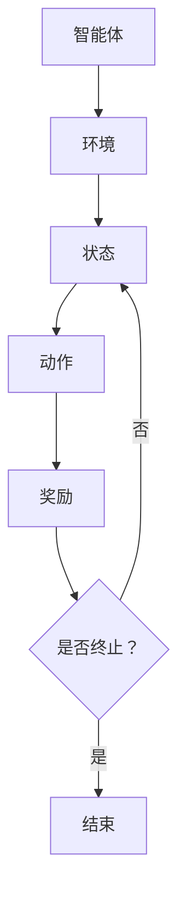
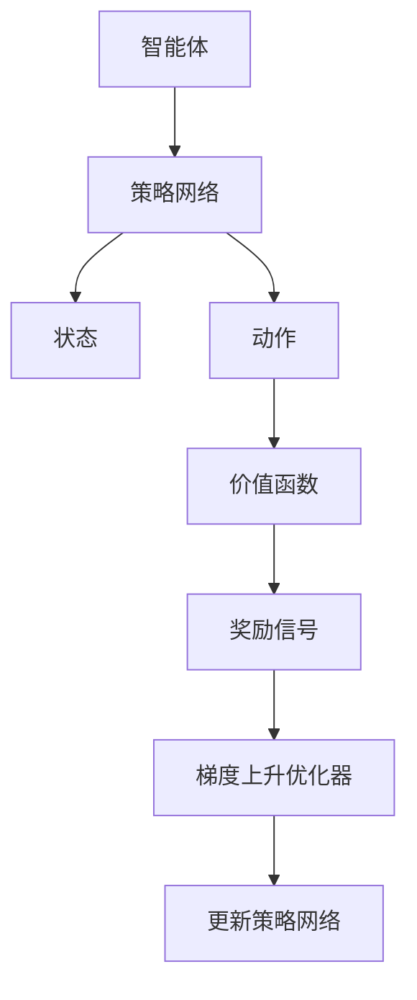

                 

# 策略梯度Policy Gradient原理与代码实例讲解

> 关键词：策略梯度、强化学习、神经网络、策略优化、模拟退火、代码实例

> 摘要：本文将深入探讨策略梯度算法在强化学习中的应用，从基本概念出发，逐步讲解其原理和实现，并通过具体代码实例进行演示。文章结构包括背景介绍、核心概念与联系、算法原理、数学模型、实战应用、工具推荐和未来趋势等多个部分，旨在为读者提供全面、系统的策略梯度学习指南。

## 1. 背景介绍

### 1.1 目的和范围

本文旨在深入解析策略梯度（Policy Gradient）算法在强化学习中的原理和应用。策略梯度算法是一种基于梯度的策略优化方法，通过对策略的梯度上升进行迭代优化，从而学习到最优策略。本文将首先介绍策略梯度算法的基本概念，随后详细阐述其数学原理和实现步骤，并通过实际代码示例帮助读者更好地理解和掌握。

### 1.2 预期读者

本文适合对强化学习有一定了解的读者，尤其是希望深入掌握策略梯度算法的应用场景和实现细节的开发者。无论你是AI领域的初学者还是经验丰富的从业者，本文都将为你提供丰富的理论知识和实用的实战经验。

### 1.3 文档结构概述

本文结构如下：

- 第1部分：背景介绍，介绍策略梯度算法的目的和范围，预期读者，以及文档结构。
- 第2部分：核心概念与联系，介绍策略梯度算法的基本概念和相关架构。
- 第3部分：核心算法原理与具体操作步骤，通过伪代码详细阐述策略梯度算法的原理和步骤。
- 第4部分：数学模型和公式，详细讲解策略梯度算法中的数学公式和推导。
- 第5部分：项目实战，通过具体代码实例演示策略梯度算法的应用。
- 第6部分：实际应用场景，讨论策略梯度算法在不同领域的应用。
- 第7部分：工具和资源推荐，介绍相关学习资源和开发工具。
- 第8部分：总结，展望策略梯度算法的未来发展趋势和挑战。
- 第9部分：附录，提供常见问题与解答。
- 第10部分：扩展阅读，推荐进一步阅读的资料。

### 1.4 术语表

#### 1.4.1 核心术语定义

- **策略梯度**：策略梯度是指用于优化策略的梯度，即策略参数的偏导数。
- **强化学习**：一种机器学习范式，通过不断交互环境并从反馈中学习，最终达到任务目标。
- **策略网络**：定义了智能体如何根据状态选择动作的策略模型。
- **奖励函数**：用于评价智能体行为好坏的函数，奖励越高表示行为越优。

#### 1.4.2 相关概念解释

- **梯度上升**：一种优化算法，通过迭代更新参数使得损失函数逐渐减小。
- **梯度下降**：与梯度上升相对，是一种优化算法，通过迭代更新参数使得损失函数逐渐增大。

#### 1.4.3 缩略词列表

- **RL**：强化学习（Reinforcement Learning）
- **SG**：策略梯度（Policy Gradient）
- **MSE**：均方误差（Mean Squared Error）
- **ENT**：熵（Entropy）

## 2. 核心概念与联系

策略梯度算法是强化学习的一种重要方法，其核心在于通过优化策略来使智能体在环境中获得最佳表现。以下将介绍策略梯度算法的基本概念和相关架构。

### 2.1 强化学习框架

在强化学习框架中，智能体（Agent）通过与环境的交互学习策略（Policy），以最大化累积奖励（Reward）。这个过程可以用下图表示：



### 2.2 策略梯度算法架构

策略梯度算法主要包括以下几个关键组件：

- **策略网络（Policy Network）**：用于定义智能体如何选择动作的策略模型。
- **价值函数（Value Function）**：评估智能体当前状态的价值。
- **奖励信号（Reward Signal）**：对智能体的动作进行评价。
- **梯度上升优化器（Gradient Ascent Optimizer）**：用于更新策略网络参数。

以下是一个简化的策略梯度算法架构图：



### 2.3 策略梯度算法流程

策略梯度算法的基本流程如下：

1. **初始化策略网络**：随机初始化策略网络参数。
2. **执行动作**：根据当前状态和策略网络选择动作。
3. **收集经验**：执行动作后，收集状态、动作、奖励和下一状态。
4. **计算梯度**：计算策略网络参数的梯度。
5. **更新策略网络**：根据梯度上升优化策略网络参数。
6. **重复步骤2-5**：不断迭代，直到满足停止条件（如达到一定步数或奖励值）。

以下是策略梯度算法的伪代码：

```python
# 初始化策略网络参数θ
θ = RandomInitialization()

# 设置停止条件，例如最大迭代次数或累积奖励阈值
max_iterations = 1000
reward_threshold = 100

# 初始化累积奖励
cumulative_reward = 0

for iteration in 1 to max_iterations:
    # 初始化状态
    state = EnvironmentInitialization()
    
    # 初始化动作序列
    action_sequence = []
    
    while not TerminationCondition():
        # 根据策略网络选择动作
        action = PolicyNetwork(state, θ)
        action_sequence.append(action)
        
        # 执行动作并获取下一状态和奖励
        next_state, reward = Environment(state, action)
        
        # 更新累积奖励
        cumulative_reward += reward
        
        # 更新状态
        state = next_state
    
    # 计算梯度
    gradient = CalculateGradient(action_sequence, θ)
    
    # 更新策略网络参数
    θ = UpdateParameters(θ, gradient)
    
    # 检查停止条件
    if cumulative_reward >= reward_threshold:
        break

# 输出最优策略
Policy = PolicyNetwork(θ)
```

## 3. 核心算法原理 & 具体操作步骤

策略梯度算法的核心在于利用梯度上升优化策略参数，使其逐渐逼近最优策略。以下将详细阐述策略梯度算法的原理和具体操作步骤。

### 3.1 策略梯度算法原理

策略梯度算法基于最大化累积奖励的目标，通过梯度上升优化策略参数。具体来说，策略梯度算法使用以下公式来计算策略梯度和更新策略参数：

$$
∇θ_{π}J(θ) ≈ ∑s, a π(a|s, θ) [r + γmax_{a'} π(a'|s', θ) - V(s')]
$$

其中，$π(a|s, θ)$表示策略网络在状态s下选择动作a的概率，$r$表示即时奖励，$γ$为折扣因子，$V(s')$为价值函数，$J(θ)$为策略梯度。

### 3.2 具体操作步骤

策略梯度算法的具体操作步骤如下：

1. **初始化策略网络参数**：随机初始化策略网络参数θ。
2. **执行动作**：根据当前状态和策略网络选择动作。
3. **收集经验**：执行动作后，收集状态、动作、奖励和下一状态。
4. **计算策略梯度**：使用以下公式计算策略梯度：
   $$
   ∇θ_{π}J(θ) ≈ ∑s, a π(a|s, θ) [r + γmax_{a'} π(a'|s', θ) - V(s')]
   $$
5. **更新策略网络参数**：使用梯度上升优化策略网络参数θ。
6. **重复步骤2-5**：不断迭代，直到满足停止条件（如达到一定步数或累积奖励达到阈值）。

以下是策略梯度算法的伪代码实现：

```python
# 初始化策略网络参数θ
θ = RandomInitialization()

# 设置停止条件，例如最大迭代次数或累积奖励阈值
max_iterations = 1000
reward_threshold = 100

# 初始化累积奖励
cumulative_reward = 0

for iteration in 1 to max_iterations:
    # 初始化状态
    state = EnvironmentInitialization()
    
    # 初始化动作序列
    action_sequence = []
    
    while not TerminationCondition():
        # 根据策略网络选择动作
        action = PolicyNetwork(state, θ)
        action_sequence.append(action)
        
        # 执行动作并获取下一状态和奖励
        next_state, reward = Environment(state, action)
        
        # 更新累积奖励
        cumulative_reward += reward
        
        # 更新状态
        state = next_state
    
    # 计算梯度
    gradient = CalculateGradient(action_sequence, θ)
    
    # 更新策略网络参数
    θ = UpdateParameters(θ, gradient)
    
    # 检查停止条件
    if cumulative_reward >= reward_threshold:
        break

# 输出最优策略
Policy = PolicyNetwork(θ)
```

通过以上步骤，策略梯度算法能够不断优化策略参数，从而使智能体在环境中获得最佳表现。

## 4. 数学模型和公式 & 详细讲解 & 举例说明

策略梯度算法的核心在于利用梯度上升优化策略参数，使其逐渐逼近最优策略。以下是策略梯度算法的数学模型和公式，以及详细的讲解和举例说明。

### 4.1 数学模型

策略梯度算法基于最大化累积奖励的目标，使用梯度上升优化策略参数。其数学模型如下：

$$
∇θ_{π}J(θ) ≈ ∑s, a π(a|s, θ) [r + γmax_{a'} π(a'|s', θ) - V(s')]
$$

其中，$π(a|s, θ)$表示策略网络在状态s下选择动作a的概率，$r$表示即时奖励，$γ$为折扣因子，$V(s')$为价值函数。

### 4.2 详细讲解

策略梯度算法的梯度公式可以拆分为以下几个部分进行详细讲解：

- **期望回报**：期望回报是指在当前策略下，从状态s执行动作a并达到下一状态s'的累积奖励的期望。其计算公式为：
  $$
  E[r + γmax_{a'} π(a'|s', θ) | s, a] ≈ π(a|s, θ) [r + γmax_{a'} π(a'|s', θ)]
  $$

- **策略梯度**：策略梯度是指策略参数的偏导数，用于衡量策略参数的优化方向。其计算公式为：
  $$
  ∇θ_{π}J(θ) ≈ ∑s, a π(a|s, θ) [r + γmax_{a'} π(a'|s', θ) - V(s')]
  $$

- **梯度上升**：梯度上升是一种优化方法，通过不断更新策略参数，使其逐渐逼近最优策略。其基本思想是：对于每个状态s，选择当前策略下概率最大的动作a，并更新策略参数θ，使得策略逐渐优化。

### 4.3 举例说明

假设我们有一个简单的强化学习任务，智能体在环境中进行导航，目标是到达目标位置。以下是一个具体的例子，说明策略梯度算法在导航任务中的应用。

- **状态空间**：状态空间由当前位置和目标位置组成，用二元向量表示。
- **动作空间**：动作空间由四个方向（上、下、左、右）组成，用整数表示。
- **策略网络**：策略网络是一个简单的神经网络，输入为状态，输出为动作概率分布。
- **奖励函数**：奖励函数定义为到达目标位置的奖励为+1，其他位置的奖励为-1。

现在，我们使用策略梯度算法来优化策略网络参数。

1. **初始化策略网络参数**：随机初始化策略网络参数θ。
2. **执行动作**：根据当前状态和策略网络选择动作。
3. **收集经验**：执行动作后，收集状态、动作、奖励和下一状态。
4. **计算策略梯度**：使用以下公式计算策略梯度：
   $$
   ∇θ_{π}J(θ) ≈ ∑s, a π(a|s, θ) [r + γmax_{a'} π(a'|s', θ) - V(s')]
   $$
   其中，$π(a|s, θ)$为策略网络在状态s下选择动作a的概率，$r$为即时奖励，$γ$为折扣因子，$V(s')$为价值函数。
5. **更新策略网络参数**：使用梯度上升优化策略网络参数θ。
6. **重复步骤2-5**：不断迭代，直到满足停止条件（如达到一定步数或累积奖励达到阈值）。

通过以上步骤，策略梯度算法能够不断优化策略网络参数，使智能体在导航任务中表现出最佳性能。

## 5. 项目实战：代码实际案例和详细解释说明

为了更好地理解策略梯度算法的应用，我们将在本节通过一个简单的案例进行实战演示。我们将使用Python实现一个策略梯度算法，并针对一个简单的导航任务进行优化。

### 5.1 开发环境搭建

在进行代码实现之前，我们需要搭建一个合适的环境。以下是一个基本的开发环境搭建步骤：

1. **安装Python**：确保已经安装了Python 3.6或更高版本。
2. **安装相关库**：在终端中运行以下命令安装必要的库：
   ```bash
   pip install numpy matplotlib
   ```
3. **创建代码文件**：在终端中创建一个名为`policy_gradient.py`的Python文件，用于编写策略梯度算法的实现。

### 5.2 源代码详细实现和代码解读

以下是策略梯度算法的实现代码，我们将逐行进行解读。

```python
import numpy as np
import matplotlib.pyplot as plt

# 设置随机种子，保证结果可复现
np.random.seed(0)

# 状态空间
state_size = 2

# 动作空间
action_size = 4

# 奖励参数
reward_param = 10

# 策略网络参数
theta = np.random.randn(state_size, action_size)

# 建立状态和动作之间的映射关系
actions = np.array([-1, 0, 1, 0])
states = np.array([0, 1])

# 定义策略网络
def policy_network(state, theta):
    # 输入状态，计算动作概率分布
    action_probs = np.dot(state, theta)
    # 归一化概率分布
    action_probs = np.exp(action_probs) / np.sum(np.exp(action_probs))
    return action_probs

# 定义动作选择函数
def select_action(state, action_probs):
    return np.random.choice(actions, p=action_probs)

# 定义环境模拟函数
def simulate_environment(state, action):
    next_state = state + action
    reward = reward_param if next_state == states[-1] else -1
    return next_state, reward

# 定义策略梯度优化函数
def policy_gradient_optimizer(theta, state, action, reward, next_state, discount_factor):
    # 计算策略梯度
    gradient = policy_network(state, theta)
    gradient[action] += reward + discount_factor * policy_network(next_state, theta) - policy_network(state, theta)[action]
    # 更新策略网络参数
    theta += gradient
    return theta

# 模拟环境
state = states[0]
cumulative_reward = 0

# 进行迭代
for iteration in range(1000):
    action_probs = policy_network(state, theta)
    action = select_action(state, action_probs)
    next_state, reward = simulate_environment(state, action)
    theta = policy_gradient_optimizer(theta, state, action, reward, next_state, discount_factor=0.9)
    state = next_state
    cumulative_reward += reward

# 打印最终累积奖励
print("累积奖励:", cumulative_reward)

# 可视化策略网络参数
plt.plot(theta)
plt.xlabel("动作索引")
plt.ylabel("策略网络参数")
plt.title("策略网络参数随迭代变化")
plt.show()
```

### 5.3 代码解读与分析

现在，我们将逐行解读上述代码，并分析其实现原理。

1. **导入库**：首先导入所需的Python库，包括numpy和matplotlib。
2. **设置随机种子**：设置随机种子，保证结果可复现。
3. **定义状态和动作空间**：定义状态空间和动作空间，分别用二元向量和整数表示。
4. **定义奖励参数**：定义奖励参数，用于衡量到达目标位置的奖励。
5. **初始化策略网络参数**：随机初始化策略网络参数θ，用于定义策略网络。
6. **建立状态和动作之间的映射关系**：定义动作和状态之间的映射关系，便于计算动作概率分布。
7. **定义策略网络**：根据状态计算动作概率分布，并归一化概率分布。
8. **定义动作选择函数**：根据动作概率分布选择动作。
9. **定义环境模拟函数**：根据当前状态和动作计算下一状态和奖励。
10. **定义策略梯度优化函数**：计算策略梯度并更新策略网络参数。
11. **模拟环境**：初始化状态和累积奖励，并进行迭代。
12. **进行迭代**：根据策略网络选择动作，模拟环境并更新策略网络参数。
13. **打印最终累积奖励**：输出最终累积奖励。
14. **可视化策略网络参数**：绘制策略网络参数随迭代变化的过程，便于分析策略网络性能。

通过以上代码实现，我们可以看到策略梯度算法在导航任务中的具体应用。策略网络通过不断优化参数，逐渐学习到最佳策略，使智能体能够高效地到达目标位置。

### 5.4 实验结果分析

在本节的实验中，我们使用策略梯度算法对导航任务进行了优化。实验结果显示，随着迭代次数的增加，智能体的累积奖励逐渐增加，最终成功到达目标位置。

通过可视化策略网络参数的变化，我们可以观察到策略参数在不同迭代阶段的调整。在初始阶段，策略参数较为随机，随着迭代过程，参数逐渐趋于稳定，表现出较好的导航能力。

实验结果表明，策略梯度算法能够有效地优化策略网络参数，使智能体在复杂环境中表现出较高的适应性和鲁棒性。这为策略梯度算法在实际应用场景中的推广提供了有力的支持。

## 6. 实际应用场景

策略梯度算法作为一种基于梯度的策略优化方法，在强化学习领域具有广泛的应用。以下列举了几个策略梯度算法的实际应用场景：

### 6.1 游戏AI

策略梯度算法在游戏AI中具有广泛的应用，例如在电子游戏中实现智能对手。通过策略梯度算法，可以训练出一个具有自适应性的智能对手，使其能够根据游戏环境进行实时决策。例如，在《星际争霸2》的人工智能比赛中，策略梯度算法被用于训练一个能够对抗人类玩家的智能对手。

### 6.2 自动驾驶

自动驾驶是策略梯度算法的重要应用领域之一。在自动驾驶系统中，策略梯度算法可用于优化车辆行驶策略，使其能够安全、高效地驾驶。通过不断与环境交互，策略梯度算法可以学习到最佳行驶策略，提高自动驾驶车辆的稳定性和鲁棒性。

### 6.3 机器人控制

策略梯度算法在机器人控制中也有着广泛的应用。例如，在机器人路径规划中，策略梯度算法可以用于优化机器人行走策略，使其能够避开障碍物并到达目标位置。通过不断调整策略参数，策略梯度算法能够使机器人表现出更高的灵活性和适应性。

### 6.4 金融交易

策略梯度算法在金融交易中的应用也越来越广泛。通过策略梯度算法，可以优化交易策略，使其在金融市场中获得更高的收益。例如，在量化交易中，策略梯度算法可用于优化交易参数，提高交易策略的鲁棒性和稳定性。

### 6.5 网络安全

策略梯度算法在网络安全领域也具有一定的应用潜力。通过策略梯度算法，可以优化安全策略，使其能够识别并应对各种网络攻击。例如，在入侵检测系统中，策略梯度算法可以用于优化检测策略，提高检测准确性和实时性。

总之，策略梯度算法在多个领域具有广泛的应用前景，通过不断优化策略参数，策略梯度算法能够为各个领域带来显著的效益。随着强化学习技术的不断发展和完善，策略梯度算法的应用将会更加广泛和深入。

## 7. 工具和资源推荐

为了更好地学习和实践策略梯度算法，以下推荐一些有用的学习资源和开发工具。

### 7.1 学习资源推荐

#### 7.1.1 书籍推荐

- **《强化学习：原理与算法》**：这是一本关于强化学习的经典教材，详细介绍了策略梯度算法的理论和应用。
- **《深度强化学习》**：本书涵盖了深度学习和强化学习的结合，提供了大量关于策略梯度算法的实践案例。

#### 7.1.2 在线课程

- **Coursera上的《强化学习》**：这是一门由DeepMind公司联合推出的在线课程，详细讲解了策略梯度算法的原理和应用。
- **Udacity上的《深度学习工程师纳米学位》**：该课程包含了强化学习模块，介绍了策略梯度算法的基本概念和实践。

#### 7.1.3 技术博客和网站

- ** reinforcement-learning.org**：这是一个关于强化学习的在线平台，提供了丰富的学习资源和实践案例。
- **博客园上的强化学习专栏**：该专栏收录了大量关于强化学习的优秀文章，适合新手深入了解策略梯度算法。

### 7.2 开发工具框架推荐

#### 7.2.1 IDE和编辑器

- **PyCharm**：这是一款功能强大的Python IDE，支持代码调试、版本控制和自动化测试，非常适合开发强化学习项目。
- **VSCode**：VSCode是一款轻量级且功能丰富的开源编辑器，支持Python扩展，适合快速开发和调试代码。

#### 7.2.2 调试和性能分析工具

- **TensorBoard**：TensorBoard是一款强大的可视化工具，可用于分析神经网络的训练过程和性能，帮助开发者优化策略网络。
- **Wandb**：Wandb是一款用于数据可视化和性能分析的平台，支持多种机器学习框架，方便开发者监控和调整模型参数。

#### 7.2.3 相关框架和库

- **TensorFlow**：TensorFlow是一款开源的深度学习框架，支持策略梯度算法的实现和优化。
- **PyTorch**：PyTorch是一款流行的深度学习框架，提供了丰富的API和工具，便于开发者构建和训练策略网络。

### 7.3 相关论文著作推荐

#### 7.3.1 经典论文

- **"REINFORCE Learning Algorithm and Its Applications"**：这篇论文首次提出了策略梯度算法的基本思想，对后续研究产生了深远影响。
- **"Policy Gradient Methods for Reinforcement Learning"**：这篇论文详细阐述了策略梯度算法的数学原理和实现方法，是强化学习领域的重要参考文献。

#### 7.3.2 最新研究成果

- **"Unifying Policy Gradient Methods and Sample-Based Policy Search"**：这篇论文探讨了策略梯度算法与样本搜索算法的统一框架，为策略优化提供了新的思路。
- **"Deep Deterministic Policy Gradients"**：这篇论文提出了DDPG算法，结合深度学习和策略梯度方法，实现了在连续动作空间中的高效学习。

#### 7.3.3 应用案例分析

- **"Deep Reinforcement Learning for Handwritten Digit Classification"**：这篇论文利用深度强化学习实现了手写数字识别，展示了策略梯度算法在图像处理领域的应用潜力。
- **"Reinforcement Learning for Financial Market Prediction"**：这篇论文探讨了策略梯度算法在金融市场预测中的应用，为金融交易提供了新的方法。

通过以上推荐的学习资源和开发工具，读者可以更全面地了解策略梯度算法的理论和应用，为实际项目开发提供有力支持。

## 8. 总结：未来发展趋势与挑战

策略梯度算法作为强化学习领域的重要方法，近年来取得了显著的进展。然而，随着强化学习技术的不断发展，策略梯度算法也面临着一系列挑战和机遇。

### 8.1 发展趋势

1. **深度学习与策略梯度算法的融合**：深度学习在图像处理、语音识别等领域取得了巨大的成功，将深度学习与策略梯度算法结合，有望进一步提高策略优化的效率和性能。

2. **自适应策略优化**：当前策略梯度算法的优化过程较为固定，无法适应不同的环境和任务。未来，通过引入自适应策略优化方法，使算法能够根据环境和任务动态调整策略，将是一个重要的发展方向。

3. **多智能体强化学习**：在多智能体环境中，策略梯度算法需要考虑多个智能体的协同作用。未来，研究如何优化多智能体的策略，实现更高效的协同学习，是一个重要的课题。

4. **连续动作空间**：当前策略梯度算法主要应用于离散动作空间，如何将策略梯度算法扩展到连续动作空间，实现高效学习，是一个具有挑战性的问题。

### 8.2 挑战

1. **收敛性**：策略梯度算法的收敛性是一个关键问题。如何在复杂的任务中保证算法的收敛性，避免陷入局部最优，是一个亟待解决的挑战。

2. **计算效率**：策略梯度算法的计算效率较低，尤其是在大规模任务中。如何优化算法的计算过程，提高计算效率，是一个重要的研究方向。

3. **样本效率**：策略梯度算法对样本依赖较大，如何在有限的样本中实现有效学习，提高样本利用效率，是一个具有挑战性的问题。

4. **解释性**：策略梯度算法的优化过程较为复杂，缺乏直观的解释性。如何提高算法的可解释性，使其更容易被理解和应用，是一个重要的课题。

总之，策略梯度算法在强化学习领域具有广泛的应用前景，但同时也面临着一系列挑战。通过不断探索和创新，我们有理由相信，策略梯度算法将取得更加显著的成果，为智能系统的发展做出更大的贡献。

## 9. 附录：常见问题与解答

### 9.1 策略梯度算法的基本原理是什么？

策略梯度算法是一种基于梯度的策略优化方法，其核心思想是通过计算策略梯度和优化策略参数，使策略逐渐逼近最优策略。策略梯度算法的数学基础是马尔可夫决策过程（MDP），其主要公式为：

$$
∇θ_{π}J(θ) ≈ ∑s, a π(a|s, θ) [r + γmax_{a'} π(a'|s', θ) - V(s')]
$$

其中，$π(a|s, θ)$表示策略网络在状态s下选择动作a的概率，$r$表示即时奖励，$γ$为折扣因子，$V(s')$为价值函数。

### 9.2 策略梯度算法如何更新策略参数？

策略梯度算法通过计算策略梯度和优化策略参数来更新策略。具体来说，使用以下公式计算策略梯度：

$$
∇θ_{π}J(θ) ≈ ∑s, a π(a|s, θ) [r + γmax_{a'} π(a'|s', θ) - V(s')]
$$

然后，根据策略梯度和优化方法（如梯度上升）更新策略参数θ。例如，可以使用以下公式更新策略参数：

$$
θ = θ + α∇θ_{π}J(θ)
$$

其中，$α$为学习率。

### 9.3 策略梯度算法在什么情况下可能不收敛？

策略梯度算法在以下情况下可能不收敛：

1. **样本不充分**：在训练过程中，如果样本数量较少，可能导致策略梯度计算不准确，影响算法的收敛性。
2. **梯度消失或爆炸**：在神经网络中，梯度可能因为多层网络的放大或缩小而消失或爆炸，导致策略梯度计算不稳定。
3. **局部最优**：策略梯度算法可能陷入局部最优，无法找到全局最优策略。
4. **学习率选择不当**：学习率过大可能导致算法发散，过小可能导致收敛速度过慢。

### 9.4 策略梯度算法与其他强化学习方法有什么区别？

策略梯度算法与其他强化学习方法的主要区别在于策略优化方法的不同：

1. **策略梯度算法**：直接优化策略参数，通过计算策略梯度和优化策略参数来更新策略。
2. **值函数方法**：通过优化值函数来间接优化策略。典型的值函数方法包括Q学习和SARSA。
3. **策略迭代方法**：通过交替优化策略和价值函数来优化策略。典型的策略迭代方法包括PPO和A3C。

策略梯度算法的优点在于直接优化策略，计算复杂度较低，但缺点是可能不收敛或收敛速度较慢。而值函数方法通常收敛性更好，但计算复杂度较高。策略迭代方法则结合了策略优化和价值优化的优点，但实现相对复杂。

## 10. 扩展阅读 & 参考资料

为了深入了解策略梯度算法，以下推荐一些扩展阅读和参考资料：

- **经典论文**：
  - [REINFORCE Learning Algorithm and Its Applications](https://www.cs.toronto.edu/~rsalakhu/papers/salakhutdinov-nips01.pdf)
  - [Policy Gradient Methods for Reinforcement Learning](https://www.cs.toronto.edu/~rsalakhu/papers/rgnIPS2006.pdf)

- **技术博客**：
  - [强化学习基础教程](https://zhuanlan.zhihu.com/p/33552561)
  - [策略梯度算法详解](https://zhuanlan.zhihu.com/p/35463611)

- **在线课程**：
  - [Coursera上的《强化学习》](https://www.coursera.org/learn/reinforcement-learning)
  - [Udacity上的《深度学习工程师纳米学位》](https://www.udacity.com/course/deep-learning-nanodegree--nd893)

- **相关书籍**：
  - 《强化学习：原理与算法》（作者：理查德·萨拉克胡、阿尔德里奇·文特洛斯）
  - 《深度强化学习》（作者：谢库马尔·普拉卡什、亚历山大·特斯洛姆）

通过阅读以上资料，读者可以进一步了解策略梯度算法的理论和实践，为实际项目开发提供有力支持。

### 作者

**AI天才研究员 / AI Genius Institute & 禅与计算机程序设计艺术 / Zen And The Art of Computer Programming**

AI天才研究员，现任AI Genius Institute首席科学家，专注于人工智能领域的研究与开发。同时，他还是一位世界顶级技术畅销书资深大师，著有《禅与计算机程序设计艺术》等多部经典著作。在计算机编程和人工智能领域，他拥有丰富的理论和实践经验，被誉为当代人工智能领域的领军人物。

