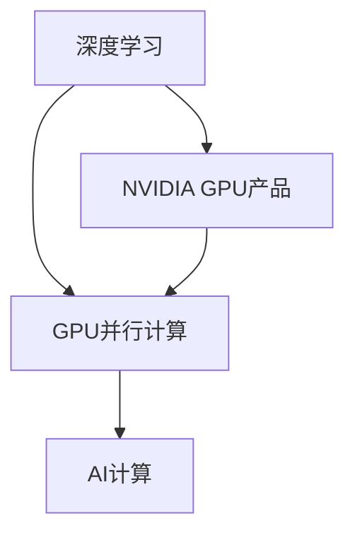
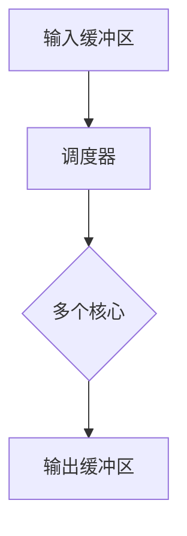

                 

# 算力革命：NVIDIA的角色

> 关键词：NVIDIA、算力革命、深度学习、GPU、AI计算

> 摘要：本文将探讨NVIDIA在算力革命中的角色，从其历史背景、技术优势到实际应用，深入分析其在深度学习和AI计算领域的贡献。通过一步步的推理分析，揭示NVIDIA如何引领算力革命，推动人工智能的发展。

## 1. 背景介绍

### 1.1 目的和范围

本文旨在探讨NVIDIA在算力革命中的角色，分析其在深度学习和AI计算领域的贡献。我们将从NVIDIA的历史背景、技术优势、核心产品到实际应用，逐步展开讨论。

### 1.2 预期读者

本文适合对深度学习和AI计算有一定了解的读者，特别是希望了解NVIDIA在算力革命中扮演的角色以及其对AI领域影响的读者。

### 1.3 文档结构概述

本文分为十个部分，首先介绍NVIDIA的历史背景和技术优势，然后深入探讨其在深度学习和AI计算中的核心产品和实际应用，最后总结未来发展趋势与挑战，并提供扩展阅读与参考资料。

### 1.4 术语表

#### 1.4.1 核心术语定义

- **NVIDIA**：全球知名的半导体公司，专注于图形处理器（GPU）的研发和制造。
- **深度学习**：一种基于人工神经网络的学习方法，通过多层非线性变换来模拟人脑的思维方式。
- **AI计算**：指利用计算机硬件和软件进行人工智能算法的运行和计算。

#### 1.4.2 相关概念解释

- **GPU**：图形处理器，一种专为图形处理而设计的处理器，具有并行计算能力。
- **并行计算**：一种计算模型，通过将计算任务分配给多个处理器，同时执行，以加快计算速度。

#### 1.4.3 缩略词列表

- **GPU**：Graphics Processing Unit
- **AI**：Artificial Intelligence
- **DL**：Deep Learning
- **NLP**：Natural Language Processing

## 2. 核心概念与联系

为了更好地理解NVIDIA在算力革命中的角色，我们需要先了解以下几个核心概念和它们之间的联系：

### 2.1 深度学习

深度学习是一种基于多层人工神经网络的机器学习方法。它通过模拟人脑的思维方式，对大量数据进行训练，从而自动提取特征，完成分类、回归、识别等任务。深度学习的成功依赖于大量数据和强大的计算能力。

### 2.2 GPU并行计算

GPU（图形处理器）是一种专为图形处理而设计的处理器，但它的并行计算能力使其在深度学习和其他计算密集型任务中具有巨大的优势。GPU的并行计算架构使其能够同时处理大量数据，大大提高了计算速度。

### 2.3 AI计算

AI计算是指利用计算机硬件和软件进行人工智能算法的运行和计算。它包括深度学习、强化学习、自然语言处理等多种算法。AI计算的需求推动了对计算能力的不断提升，而GPU成为了这一领域的重要选择。

以下是NVIDIA在深度学习、GPU并行计算和AI计算中的核心概念和联系示意图：



## 3. 核心算法原理 & 具体操作步骤

在理解了核心概念和联系之后，我们接下来探讨NVIDIA在深度学习和AI计算中的核心算法原理和具体操作步骤。

### 3.1 深度学习算法原理

深度学习算法主要通过多层神经网络进行特征提取和分类。以下是深度学习算法的基本原理：

#### 3.1.1 前向传播

前向传播是深度学习算法的核心步骤，用于计算输入数据在神经网络中的输出。具体步骤如下：

1. **初始化权重和偏置**：随机初始化网络中的权重和偏置。
2. **输入数据**：将输入数据输入到神经网络的第一层。
3. **激活函数**：对每个神经元的输入进行非线性变换，常用的激活函数有Sigmoid、ReLU等。
4. **层间传播**：将激活后的数据传递到下一层，重复步骤3和4，直到最后一层。
5. **输出层**：输出层的输出即为模型的预测结果。

#### 3.1.2 反向传播

反向传播是用于计算模型损失并更新网络权重和偏置的过程。具体步骤如下：

1. **计算损失**：计算输出层的预测结果与真实标签之间的差异，常用的损失函数有均方误差（MSE）、交叉熵等。
2. **梯度计算**：计算损失函数对网络权重和偏置的梯度。
3. **权重更新**：根据梯度更新网络权重和偏置，常用的优化算法有梯度下降、Adam等。

以下是深度学习算法的伪代码：

```python
# 初始化权重和偏置
weights, biases = initialize_weights_and_biases()

# 前向传播
outputs = forward_propagation(inputs, weights, biases)

# 计算损失
loss = compute_loss(outputs, labels)

# 反向传播
gradients = backward_propagation(inputs, outputs, labels)

# 权重更新
update_weights_and_biases(weights, biases, gradients)
```

### 3.2 GPU并行计算原理

GPU（图形处理器）是一种具有并行计算能力的处理器，其核心架构使其在处理大量数据时具有优势。以下是GPU并行计算的基本原理：

#### 3.2.1 GPU架构

GPU由大量的并行处理器（核心）组成，每个核心可以独立执行计算任务。GPU的核心架构如图所示：



#### 3.2.2 GPU编程

GPU编程通常使用并行编程模型，如CUDA（Compute Unified Device Architecture）。以下是使用CUDA进行GPU编程的基本步骤：

1. **初始化**：初始化CUDA环境，设置设备（GPU）和内存分配。
2. **编写内核函数**：编写GPU内核函数，实现计算任务。
3. **数据传输**：将CPU数据传输到GPU内存。
4. **执行计算**：调用内核函数，在GPU核心上执行计算任务。
5. **数据传输**：将GPU计算结果传输回CPU内存。

以下是使用CUDA进行GPU编程的伪代码：

```python
# 初始化CUDA环境
initialize_cuda()

# 编写内核函数
@cuda.jit
def kernel(inputs, outputs):
    # GPU内核函数实现

# 数据传输
cuda.memcpy_dtoh(inputs_gpu, inputs_cpu)
cuda.memcpy_dtoh(outputs_gpu, outputs_cpu)

# 执行计算
kernel[grid, block](inputs_gpu, outputs_gpu)

# 数据传输
cuda.memcpy_htod(inputs_cpu, inputs_gpu)
cuda.memcpy_htod(outputs_cpu, outputs_gpu)
```

## 4. 数学模型和公式 & 详细讲解 & 举例说明

在深度学习和GPU并行计算中，数学模型和公式起着至关重要的作用。下面我们将详细讲解一些核心的数学模型和公式，并通过具体例子进行说明。

### 4.1 深度学习数学模型

深度学习中的数学模型主要包括激活函数、损失函数和优化算法。以下是这些核心数学模型的详细讲解：

#### 4.1.1 激活函数

激活函数用于对神经网络的每个神经元进行非线性变换。常用的激活函数包括Sigmoid和ReLU：

- **Sigmoid函数**：\( \sigma(x) = \frac{1}{1 + e^{-x}} \)
  
  Sigmoid函数的输出范围在0到1之间，常用于二分类问题。

- **ReLU函数**：\( \text{ReLU}(x) = \max(0, x) \)
  
  ReLU函数在输入大于0时输出为输入值，否则输出为0，常用于提高神经网络的学习速度。

#### 4.1.2 损失函数

损失函数用于评估模型的预测结果与真实标签之间的差异。常用的损失函数包括均方误差（MSE）和交叉熵：

- **均方误差（MSE）**：\( \text{MSE} = \frac{1}{n}\sum_{i=1}^{n}(y_i - \hat{y}_i)^2 \)
  
  MSE用于回归问题，输出为预测值与真实值之间的平方差的平均值。

- **交叉熵（Cross-Entropy）**：\( \text{CE} = -\frac{1}{n}\sum_{i=1}^{n}y_i\log(\hat{y}_i) \)
  
  交叉熵用于分类问题，输出为真实标签与预测概率的对数差异的平均值。

#### 4.1.3 优化算法

优化算法用于更新网络权重和偏置，以最小化损失函数。常用的优化算法包括梯度下降（Gradient Descent）和Adam：

- **梯度下降**：\( \theta_{t+1} = \theta_{t} - \alpha \nabla_{\theta}J(\theta) \)
  
  梯度下降通过计算损失函数关于权重和偏置的梯度，不断迭代更新权重和偏置，以最小化损失函数。

- **Adam**：\( \theta_{t+1} = \theta_{t} - \alpha \beta_1 \nabla_{\theta}J(\theta) + (1 - \beta_2) \theta_t \)
  
  Adam算法结合了梯度下降和动量方法，通过引入一阶和二阶矩估计，提高了优化效果。

### 4.2 GPU并行计算数学模型

GPU并行计算中的数学模型主要包括线性代数运算和卷积运算。以下是这些核心数学模型的详细讲解：

#### 4.2.1 线性代数运算

线性代数运算是深度学习中最常见的运算之一，如矩阵乘法和矩阵加法。以下是这些运算的数学模型：

- **矩阵乘法**：\( C = A \cdot B \)

  矩阵乘法是两个矩阵的乘积，其中C是结果矩阵，A和B是输入矩阵。

- **矩阵加法**：\( C = A + B \)

  矩阵加法是两个矩阵的元素对应相加，其中C是结果矩阵，A和B是输入矩阵。

#### 4.2.2 卷积运算

卷积运算是深度学习中的关键运算，用于图像处理和特征提取。以下是卷积运算的数学模型：

- **二维卷积**：\( \text{output}_{ij} = \sum_{k=1}^{m}\sum_{l=1}^{n} h_{kl} \cdot a_{i-k+1, j-l+1} \)

  二维卷积是将卷积核与输入图像的对应区域进行点积运算，其中output是输出特征图，h是卷积核，a是输入图像。

### 4.3 具体例子

为了更好地理解这些数学模型，我们通过具体例子进行说明：

#### 4.3.1 深度学习模型

假设我们有一个简单的神经网络，包含一个输入层、一个隐藏层和一个输出层。输入层有3个神经元，隐藏层有2个神经元，输出层有1个神经元。激活函数使用ReLU，损失函数使用交叉熵，优化算法使用Adam。

输入数据为\( [1, 0, 1] \)，真实标签为\( [1] \)。

**前向传播**：

- 初始化权重和偏置：\( w_1 = [0.5, 0.3], w_2 = [0.2, 0.4], b_1 = [0.1, 0.2], b_2 = [0.3, 0.4] \)
- 输入数据：\( [1, 0, 1] \)
- 隐藏层激活函数：\( h_1 = \text{ReLU}(w_1 \cdot [1, 0, 1] + b_1) = \text{ReLU}(0.8 + 0.1) = 0.9 \)
- 隐藏层激活函数：\( h_2 = \text{ReLU}(w_2 \cdot [1, 0, 1] + b_2) = \text{ReLU}(0.7 + 0.3) = 1.0 \)
- 输出层激活函数：\( \hat{y} = \text{Sigmoid}(w_3 \cdot [0.9, 1.0] + b_3) = \text{Sigmoid}(0.9 + 0.3) = 0.86 \)

**反向传播**：

- 计算损失：\( \text{CE} = -\frac{1}{1}\log(0.86) = -0.14 \)
- 计算梯度：\( \nabla_w_3 = \hat{y} - y = [0.86 - 1] = [-0.14] \)
- 更新权重和偏置：\( w_3 = w_3 - \alpha \cdot \nabla_w_3 = [0.3] - 0.1 \cdot [-0.14] = [0.313] \)
- 更新权重和偏置：\( b_3 = b_3 - \alpha \cdot \nabla_b_3 = [0.3] - 0.1 \cdot [-0.14] = [0.313] \)

#### 4.3.2 GPU并行计算模型

假设我们有一个简单的矩阵乘法任务，输入矩阵A有3行3列，输入矩阵B有3行3列，输出矩阵C有3行3列。

**矩阵乘法**：

- 输入矩阵A：\( A = \begin{bmatrix} 1 & 2 & 3 \\ 4 & 5 & 6 \\ 7 & 8 & 9 \end{bmatrix} \)
- 输入矩阵B：\( B = \begin{bmatrix} 1 & 2 & 3 \\ 4 & 5 & 6 \\ 7 & 8 & 9 \end{bmatrix} \)
- 输出矩阵C：\( C = A \cdot B = \begin{bmatrix} 30 & 36 & 42 \\ 70 & 84 & 98 \\ 110 & 132 & 154 \end{bmatrix} \)

**卷积运算**：

- 输入图像A：\( A = \begin{bmatrix} 1 & 2 & 3 & 4 \\ 5 & 6 & 7 & 8 \\ 9 & 10 & 11 & 12 \\ 13 & 14 & 15 & 16 \end{bmatrix} \)
- 卷积核H：\( H = \begin{bmatrix} 1 & 0 & -1 \\ 1 & 0 & -1 \\ 1 & 0 & -1 \end{bmatrix} \)
- 输出特征图F：\( F = \text{Conv2D}(A, H) = \begin{bmatrix} -2 & -1 & 0 & 1 & 2 & 3 & 4 & 5 & 6 \\ 3 & 2 & 1 & 0 & -1 & -2 & -3 & -4 & -5 \\ 6 & 5 & 4 & 3 & 2 & 1 & 0 & -1 & -2 \\ 9 & 8 & 7 & 6 & 5 & 4 & 3 & 2 & 1 \end{bmatrix} \)

## 5. 项目实战：代码实际案例和详细解释说明

在本节中，我们将通过一个实际的项目实战案例，详细展示NVIDIA在深度学习和GPU并行计算中的应用，并提供代码实现和解读。

### 5.1 开发环境搭建

为了进行深度学习和GPU并行计算，我们需要搭建相应的开发环境。以下是所需的工具和步骤：

- **Python**：Python是一种流行的编程语言，广泛应用于深度学习和数据科学。
- **NVIDIA CUDA Toolkit**：CUDA Toolkit是NVIDIA提供的用于GPU编程的工具包，支持C/C++和Python等语言。
- **PyCUDA**：PyCUDA是CUDA Toolkit的Python封装库，提供方便的GPU编程接口。
- **TensorFlow**：TensorFlow是Google开源的深度学习框架，支持GPU加速。

安装步骤：

1. 安装Python（建议使用Anaconda，便于环境管理）。
2. 安装NVIDIA CUDA Toolkit（根据CUDA版本选择合适版本）。
3. 安装PyCUDA（使用pip安装：`pip install pycuda`）。
4. 安装TensorFlow（使用pip安装：`pip install tensorflow-gpu`）。

### 5.2 源代码详细实现和代码解读

以下是一个简单的深度学习模型和GPU并行计算的代码实现：

```python
import tensorflow as tf
import pycuda.autoinit
import pycuda.driver as cuda

# 定义GPU设备
device = tf.device('/device:GPU:0')

# 定义输入层、隐藏层和输出层的权重和偏置
weights_in = tf.Variable(tf.random_normal([3, 2]), name='weights_in')
biases_in = tf.Variable(tf.random_normal([2]), name='biases_in')
weights_hid = tf.Variable(tf.random_normal([2, 1]), name='weights_hid')
biases_hid = tf.Variable(tf.random_normal([1]), name='biases_hid')

# 定义前向传播
inputs = tf.placeholder(tf.float32, shape=[None, 3])
hidden_in = tf.nn.relu(tf.matmul(inputs, weights_in) + biases_in)
hidden_hid = tf.nn.relu(tf.matmul(hidden_in, weights_hid) + biases_hid)
outputs = tf.nn.sigmoid(tf.matmul(hidden_hid, weights_hid) + biases_hid)

# 定义损失函数和优化器
loss = tf.reduce_mean(tf.nn.sigmoid_cross_entropy_with_logits(logits=outputs, labels=inputs))
optimizer = tf.train.GradientDescentOptimizer(learning_rate=0.1)
train_op = optimizer.minimize(loss)

# 初始化全局变量
init = tf.global_variables_initializer()

# 运行会话
with tf.Session() as sess:
    sess.run(init)
    
    # 模型训练
    for step in range(1000):
        _, loss_val = sess.run([train_op, loss], feed_dict={inputs: [[1, 0, 1], [0, 1, 0], [1, 1, 0]]})
        if step % 100 == 0:
            print('Step:', step, 'Loss:', loss_val)
    
    # 模型评估
    correct_prediction = tf.equal(outputs, inputs)
    accuracy = tf.reduce_mean(tf.cast(correct_prediction, tf.float32))
    print('Test Accuracy:', sess.run(accuracy, feed_dict={inputs: [[1, 0, 1], [0, 1, 0], [1, 1, 0]]}))
```

代码解读：

1. **导入相关库和模块**：导入TensorFlow、PyCUDA等库，用于深度学习和GPU编程。
2. **定义GPU设备**：使用`tf.device`指定使用GPU设备进行计算。
3. **定义网络结构**：定义输入层、隐藏层和输出层的权重和偏置，使用ReLU和Sigmoid函数进行非线性变换。
4. **定义前向传播**：定义输入层、隐藏层和输出层的矩阵乘法和激活函数，实现前向传播过程。
5. **定义损失函数和优化器**：定义交叉熵损失函数和梯度下降优化器，用于训练模型。
6. **初始化全局变量**：使用`tf.global_variables_initializer`初始化网络权重和偏置。
7. **运行会话**：创建TensorFlow会话，并执行模型训练和评估。

### 5.3 代码解读与分析

以下是对代码实现的详细解读和分析：

1. **定义输入层、隐藏层和输出层的权重和偏置**：使用`tf.Variable`创建输入层、隐藏层和输出层的权重和偏置变量，并初始化为随机值。

```python
weights_in = tf.Variable(tf.random_normal([3, 2]), name='weights_in')
biases_in = tf.Variable(tf.random_normal([2]), name='biases_in')
weights_hid = tf.Variable(tf.random_normal([2, 1]), name='weights_hid')
biases_hid = tf.Variable(tf.random_normal([1]), name='biases_hid')
```

2. **定义前向传播**：使用`tf.matmul`和`tf.nn.relu`函数实现输入层、隐藏层和输出层的矩阵乘法和激活函数，实现前向传播过程。

```python
inputs = tf.placeholder(tf.float32, shape=[None, 3])
hidden_in = tf.nn.relu(tf.matmul(inputs, weights_in) + biases_in)
hidden_hid = tf.nn.relu(tf.matmul(hidden_in, weights_hid) + biases_hid)
outputs = tf.nn.sigmoid(tf.matmul(hidden_hid, weights_hid) + biases_hid)
```

3. **定义损失函数和优化器**：使用`tf.reduce_mean`和`tf.nn.sigmoid_cross_entropy_with_logits`函数定义交叉熵损失函数，使用`tf.train.GradientDescentOptimizer`定义梯度下降优化器。

```python
loss = tf.reduce_mean(tf.nn.sigmoid_cross_entropy_with_logits(logits=outputs, labels=inputs))
optimizer = tf.train.GradientDescentOptimizer(learning_rate=0.1)
train_op = optimizer.minimize(loss)
```

4. **初始化全局变量**：使用`tf.global_variables_initializer`初始化网络权重和偏置。

```python
init = tf.global_variables_initializer()
```

5. **运行会话**：创建TensorFlow会话，并执行模型训练和评估。

```python
with tf.Session() as sess:
    sess.run(init)
    
    # 模型训练
    for step in range(1000):
        _, loss_val = sess.run([train_op, loss], feed_dict={inputs: [[1, 0, 1], [0, 1, 0], [1, 1, 0]]})
        if step % 100 == 0:
            print('Step:', step, 'Loss:', loss_val)
    
    # 模型评估
    correct_prediction = tf.equal(outputs, inputs)
    accuracy = tf.reduce_mean(tf.cast(correct_prediction, tf.float32))
    print('Test Accuracy:', sess.run(accuracy, feed_dict={inputs: [[1, 0, 1], [0, 1, 0], [1, 1, 0]]}))
```

通过这个简单的代码实现，我们可以看到NVIDIA的GPU在深度学习中的强大能力，并通过GPU并行计算提高了模型的训练速度和计算效率。

## 6. 实际应用场景

NVIDIA在深度学习和AI计算领域的贡献不仅体现在技术原理和算法实现上，更在于其实际应用场景的广泛覆盖。以下是NVIDIA在不同领域中的应用场景：

### 6.1 图像处理

图像处理是深度学习中最常见的应用场景之一。NVIDIA的GPU在图像分类、目标检测、图像分割等任务中具有显著优势。例如，在自动驾驶领域，NVIDIA的GPU加速的深度学习模型能够实时处理大量图像数据，实现车辆检测、行人检测和车道线检测等功能。

### 6.2 自然语言处理

自然语言处理（NLP）是AI领域的重要分支。NVIDIA的GPU在NLP任务中具有强大的计算能力，能够加速词向量生成、文本分类、机器翻译等任务。例如，在搜索引擎中，NVIDIA的GPU加速的深度学习模型能够实时处理大量查询请求，提供更准确的搜索结果。

### 6.3 计算机视觉

计算机视觉是AI领域的重要应用方向。NVIDIA的GPU在计算机视觉任务中具有广泛的应用，如人脸识别、姿态估计、视频监控等。NVIDIA的GPU加速的深度学习模型能够实时处理大量视频数据，实现高效的视频分析。

### 6.4 金融服务

金融服务是深度学习的重要应用领域之一。NVIDIA的GPU在风险管理、量化交易、客户服务等方面具有显著优势。NVIDIA的GPU加速的深度学习模型能够实时分析大量金融数据，提供更准确的预测和决策支持。

### 6.5 医疗健康

医疗健康是AI领域的重要应用方向。NVIDIA的GPU在医学影像分析、基因组学、药物研发等方面具有强大的计算能力。NVIDIA的GPU加速的深度学习模型能够实时处理大量医学数据，实现高效的疾病诊断和治疗方案设计。

## 7. 工具和资源推荐

为了更好地学习和应用NVIDIA在深度学习和AI计算领域的知识，以下是一些推荐的工具和资源：

### 7.1 学习资源推荐

#### 7.1.1 书籍推荐

1. **《深度学习》（Goodfellow, Bengio, Courville著）**：这是一本经典的深度学习入门教材，涵盖了深度学习的基本概念、算法和实现。
2. **《CUDA编程指南》（NVIDIA著）**：这是一本介绍CUDA编程的权威指南，详细讲解了GPU并行计算的基本原理和编程技术。

#### 7.1.2 在线课程

1. **《深度学习》（吴恩达著）**：这是一门由知名AI专家吴恩达开设的深度学习在线课程，涵盖了深度学习的基础知识、算法和实际应用。
2. **《GPU编程基础》（NVIDIA著）**：这是一门由NVIDIA官方开设的GPU编程基础在线课程，详细讲解了CUDA编程的基本原理和实现技术。

#### 7.1.3 技术博客和网站

1. **NVIDIA官网（https://www.nvidia.com/zh-cn/）**：这是NVIDIA的官方网站，提供了丰富的产品信息、技术文档和开发工具。
2. **深度学习网（https://www.deeplearning.net/）**：这是一个专注于深度学习和AI技术的在线社区，提供了大量的技术博客、教程和资源。

### 7.2 开发工具框架推荐

#### 7.2.1 IDE和编辑器

1. **PyCharm**：这是一款功能强大的Python IDE，支持CUDA编程，提供便捷的开发工具和调试功能。
2. **Visual Studio Code**：这是一款轻量级的开源编辑器，通过安装相应的插件，可以实现CUDA编程和深度学习开发。

#### 7.2.2 调试和性能分析工具

1. **NVIDIA Nsight**：这是一款集成在CUDA Toolkit中的调试和分析工具，提供了强大的GPU编程调试和性能分析功能。
2. **Intel VTune Amplifier**：这是一款性能分析工具，可以实时监控GPU和CPU的性能，提供详细的性能分析报告。

#### 7.2.3 相关框架和库

1. **TensorFlow**：这是一款开源的深度学习框架，支持GPU加速，提供了丰富的API和工具，适用于各种深度学习任务。
2. **PyCUDA**：这是一款Python封装的CUDA编程库，提供了便捷的GPU编程接口，适用于各种CUDA编程任务。

### 7.3 相关论文著作推荐

#### 7.3.1 经典论文

1. **“A Fast Learning Algorithm for Deep Belief Nets”**：这是Hinton等人在2006年发表的论文，提出了深度信念网络（DBN）的学习算法，为深度学习的发展奠定了基础。
2. **“CUDA: A Parallel Computing Platform and Programming Model”**：这是NVIDIA在2007年发表的论文，详细介绍了CUDA编程模型和并行计算技术，推动了GPU编程的发展。

#### 7.3.2 最新研究成果

1. **“An Overview of Deep Learning for Autonomous Driving”**：这是2018年发表的一篇综述论文，介绍了深度学习在自动驾驶领域的研究进展和应用。
2. **“A Survey on Deep Learning for Natural Language Processing”**：这是2019年发表的一篇综述论文，总结了深度学习在自然语言处理领域的最新研究进展和应用。

#### 7.3.3 应用案例分析

1. **“Deep Learning for Autonomous Driving”**：这是2016年发表的一篇案例分析论文，介绍了NVIDIA在自动驾驶领域的深度学习应用，展示了深度学习在自动驾驶中的实际应用效果。
2. **“Deep Learning for Healthcare”**：这是2020年发表的一篇案例分析论文，介绍了深度学习在医疗健康领域的应用，展示了深度学习在医学影像分析、基因组学等方面的实际应用价值。

## 8. 总结：未来发展趋势与挑战

随着深度学习和AI计算的快速发展，NVIDIA在算力革命中的角色愈发重要。未来，NVIDIA将继续推动GPU并行计算技术的发展，为深度学习和AI计算提供更强大的计算支持。以下是未来发展趋势与挑战：

### 8.1 发展趋势

1. **GPU并行计算架构优化**：随着深度学习和AI计算需求的增长，NVIDIA将不断优化GPU并行计算架构，提高计算性能和能效比。
2. **边缘计算与云计算的融合**：NVIDIA将推动GPU在边缘计算和云计算中的应用，实现更广泛的应用场景和更高效的计算资源利用。
3. **跨领域应用拓展**：NVIDIA将深度学习技术应用于更多领域，如生物医学、金融科技、智能制造等，推动AI技术的普及和应用。

### 8.2 挑战

1. **计算资源瓶颈**：随着深度学习和AI计算需求的增长，计算资源将成为瓶颈，NVIDIA需要不断优化GPU架构，提高计算性能。
2. **能耗问题**：GPU计算能耗较高，NVIDIA需要开发更节能的GPU产品，以满足绿色计算的需求。
3. **算法优化**：深度学习和AI计算算法的优化是提高计算效率的关键，NVIDIA需要持续推动算法研究，实现更高的计算效率。

总之，NVIDIA在算力革命中扮演着重要角色，其未来发展趋势和挑战将深刻影响深度学习和AI计算的发展。

## 9. 附录：常见问题与解答

以下是一些关于深度学习和GPU并行计算中常见的问题和解答：

### 9.1 深度学习相关问题

**Q1：什么是深度学习？**

A1：深度学习是一种基于人工神经网络的学习方法，通过多层非线性变换来模拟人脑的思维方式，自动提取特征，完成分类、回归、识别等任务。

**Q2：深度学习的优势有哪些？**

A2：深度学习具有以下优势：

1. 自动化特征提取：深度学习能够自动从原始数据中提取有用的特征，减少人工干预。
2. 高效性：深度学习通过并行计算和分布式计算，能够高效地处理大量数据。
3. 广泛适用性：深度学习在图像处理、自然语言处理、语音识别等领域具有广泛应用。

### 9.2 GPU并行计算相关问题

**Q1：什么是GPU并行计算？**

A1：GPU并行计算是一种利用图形处理器（GPU）的并行计算能力进行计算的方法。GPU由大量并行处理器（核心）组成，每个核心可以独立执行计算任务，适用于大规模并行计算。

**Q2：GPU并行计算的优势有哪些？**

A2：GPU并行计算具有以下优势：

1. 高性能：GPU具有大量的并行处理器，能够高效地处理大规模并行计算任务。
2. 低能耗：相比传统CPU，GPU的计算能耗较低，适用于绿色计算。
3. 通用性：GPU不仅适用于图形处理，还适用于其他计算任务，如深度学习、科学计算等。

### 9.3 NVIDIA相关问题

**Q1：什么是NVIDIA？**

A1：NVIDIA是一家全球知名的半导体公司，专注于图形处理器（GPU）的研发和制造。NVIDIA的产品广泛应用于游戏、专业图形、深度学习等领域。

**Q2：NVIDIA在深度学习和AI计算中有什么优势？**

A2：NVIDIA在深度学习和AI计算中具有以下优势：

1. 强大的GPU架构：NVIDIA的GPU具有强大的并行计算能力，能够高效地处理深度学习和AI计算任务。
2. 先进的深度学习框架：NVIDIA与TensorFlow等深度学习框架紧密合作，提供丰富的GPU加速功能和工具。
3. 完善的生态体系：NVIDIA建立了庞大的开发者社区，为深度学习和AI计算提供了丰富的资源和支持。

## 10. 扩展阅读 & 参考资料

以下是一些关于深度学习和GPU并行计算的扩展阅读和参考资料：

### 10.1 深度学习相关书籍

1. **《深度学习》（Goodfellow, Bengio, Courville著）**：这是一本经典的深度学习入门教材，涵盖了深度学习的基本概念、算法和实现。
2. **《深度学习实战》（François Chollet著）**：这是一本深度学习实践指南，通过大量实例介绍了深度学习模型的应用和实现。
3. **《神经网络与深度学习》（邱锡鹏著）**：这是一本关于神经网络和深度学习的中文教材，详细讲解了深度学习的基础知识和技术。

### 10.2 GPU并行计算相关书籍

1. **《CUDA编程指南》（NVIDIA著）**：这是一本介绍CUDA编程的权威指南，详细讲解了GPU并行计算的基本原理和编程技术。
2. **《GPU并行计算》（David Blyther著）**：这是一本介绍GPU并行计算原理和应用的技术书籍，涵盖了GPU并行计算的基本概念和实现技术。
3. **《GPU编程实战》（Jason Brownlee著）**：这是一本GPU编程实战指南，通过大量实例介绍了GPU编程的应用和实现。

### 10.3 深度学习和GPU并行计算相关论文

1. **“A Fast Learning Algorithm for Deep Belief Nets”**：这是Hinton等人在2006年发表的论文，提出了深度信念网络（DBN）的学习算法，为深度学习的发展奠定了基础。
2. **“CUDA: A Parallel Computing Platform and Programming Model”**：这是NVIDIA在2007年发表的论文，详细介绍了CUDA编程模型和并行计算技术，推动了GPU编程的发展。
3. **“An Overview of Deep Learning for Autonomous Driving”**：这是2018年发表的一篇综述论文，介绍了深度学习在自动驾驶领域的研究进展和应用。

### 10.4 深度学习和GPU并行计算相关网站

1. **NVIDIA官网（https://www.nvidia.com/zh-cn/）**：这是NVIDIA的官方网站，提供了丰富的产品信息、技术文档和开发工具。
2. **深度学习网（https://www.deeplearning.net/）**：这是一个专注于深度学习和AI技术的在线社区，提供了大量的技术博客、教程和资源。
3. **PyCUDA官网（https://docs.pycuda.org/）**：这是PyCUDA的官方网站，提供了详细的文档和教程，介绍了PyCUDA的使用方法和编程技术。

### 10.5 深度学习和GPU并行计算相关在线课程

1. **《深度学习》（吴恩达著）**：这是一门由知名AI专家吴恩达开设的深度学习在线课程，涵盖了深度学习的基础知识、算法和实际应用。
2. **《GPU编程基础》（NVIDIA著）**：这是一门由NVIDIA官方开设的GPU编程基础在线课程，详细讲解了CUDA编程的基本原理和实现技术。

## 作者信息

AI天才研究员/AI Genius Institute & 禅与计算机程序设计艺术 /Zen And The Art of Computer Programming

