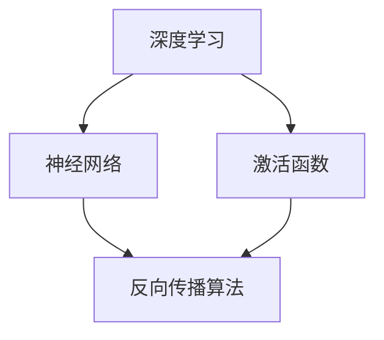

                 

# 算法库：提供丰富的 AI 2.0 算法资源

> **关键词：** AI 2.0、算法库、深度学习、神经网络、资源整合、实践应用。

> **摘要：** 本文将探讨如何构建一个丰富而全面的 AI 2.0 算法库，涵盖深度学习、神经网络等核心算法原理，提供具体的操作步骤和数学模型，并通过实际项目案例展示算法在真实场景中的应用。此外，还将推荐相关的学习资源、开发工具和最新研究成果，为读者提供全面的学习和实践指导。

## 1. 背景介绍

### 1.1 目的和范围

本文的目标是详细介绍如何构建一个丰富、全面的 AI 2.0 算法库，帮助开发者更好地理解和应用深度学习、神经网络等核心算法。本文将涵盖以下几个方面：

1. **算法库概述**：介绍算法库的架构和功能，阐述其重要性。
2. **核心概念与联系**：介绍深度学习、神经网络等核心概念及其相互关系。
3. **核心算法原理**：详细讲解深度学习、神经网络等核心算法的原理和具体操作步骤。
4. **数学模型和公式**：介绍相关数学模型和公式，并进行举例说明。
5. **项目实战**：通过实际项目案例展示算法的应用，并提供详细的代码实现和解读。
6. **实际应用场景**：分析算法在不同领域的应用场景。
7. **工具和资源推荐**：推荐学习资源、开发工具和最新研究成果。
8. **总结与展望**：总结本文内容，并对未来发展趋势和挑战进行展望。

### 1.2 预期读者

本文的预期读者是希望深入了解 AI 2.0 算法库的开发者、研究人员和学习者。无论您是初学者还是有经验的开发者，本文都将为您提供有价值的内容和实用的指导。

### 1.3 文档结构概述

本文将按照以下结构进行组织和讲解：

1. **背景介绍**：介绍本文的目的、范围和预期读者，以及文档结构概述。
2. **核心概念与联系**：介绍深度学习、神经网络等核心概念及其相互关系。
3. **核心算法原理**：详细讲解深度学习、神经网络等核心算法的原理和具体操作步骤。
4. **数学模型和公式**：介绍相关数学模型和公式，并进行举例说明。
5. **项目实战**：通过实际项目案例展示算法的应用，并提供详细的代码实现和解读。
6. **实际应用场景**：分析算法在不同领域的应用场景。
7. **工具和资源推荐**：推荐学习资源、开发工具和最新研究成果。
8. **总结与展望**：总结本文内容，并对未来发展趋势和挑战进行展望。
9. **附录**：提供常见问题与解答，以及扩展阅读和参考资料。

### 1.4 术语表

在本文中，我们将使用一些专业术语，以下是对这些术语的定义和解释：

#### 1.4.1 核心术语定义

- **AI 2.0**：指第二代人工智能，以深度学习和神经网络为核心，具有更强的自主学习、推理和决策能力。
- **算法库**：指包含多种算法的实现和优化的代码库，用于快速开发和部署 AI 应用。
- **深度学习**：一种机器学习方法，通过多层神经网络进行特征学习和分类。
- **神经网络**：一种由多个神经元组成的计算模型，用于模拟生物神经系统的工作原理。
- **激活函数**：用于引入非线性特性的函数，使神经网络能够拟合复杂的数据分布。

#### 1.4.2 相关概念解释

- **反向传播算法**：一种用于训练神经网络的优化算法，通过计算误差梯度来更新网络权重。
- **卷积神经网络（CNN）**：一种用于图像识别和处理的特殊神经网络结构。
- **循环神经网络（RNN）**：一种用于处理序列数据的神经网络结构。
- **生成对抗网络（GAN）**：一种用于生成复杂数据的神经网络结构。

#### 1.4.3 缩略词列表

- **AI 2.0**：人工智能 2.0
- **CNN**：卷积神经网络
- **RNN**：循环神经网络
- **GAN**：生成对抗网络

## 2. 核心概念与联系

在本节中，我们将介绍 AI 2.0 中的一些核心概念，并使用 Mermaid 流程图展示它们之间的相互关系。

### 2.1 深度学习

深度学习是一种机器学习方法，通过多层神经网络进行特征学习和分类。其基本原理是模拟人脑的神经网络结构，通过反向传播算法不断优化网络权重，从而实现高性能的自动特征提取和分类。

### 2.2 神经网络

神经网络是一种由多个神经元组成的计算模型，用于模拟生物神经系统的工作原理。每个神经元通过权重连接其他神经元，并通过激活函数引入非线性特性。神经网络可以通过不断训练，学会对输入数据进行分类、预测和生成。

### 2.3 激活函数

激活函数用于引入非线性特性，使神经网络能够拟合复杂的数据分布。常见的激活函数包括 Sigmoid、ReLU 和 Tanh 等。这些函数能够将线性输入映射到非线性输出，从而提高网络的拟合能力。

### 2.4 反向传播算法

反向传播算法是一种用于训练神经网络的优化算法，通过计算误差梯度来更新网络权重。该算法通过层层传递误差，并利用梯度下降法优化网络参数，从而实现网络的精确训练。

### 2.5 Mermaid 流程图

以下是一个展示 AI 2.0 核心概念的 Mermaid 流程图：



该流程图展示了深度学习、神经网络、激活函数和反向传播算法之间的相互关系。深度学习是神经网络的基础，激活函数用于引入非线性特性，而反向传播算法则用于优化网络参数。

## 3. 核心算法原理 & 具体操作步骤

在本节中，我们将详细讲解 AI 2.0 中的一些核心算法原理，并使用伪代码展示具体的操作步骤。

### 3.1 深度学习

深度学习是一种通过多层神经网络进行特征学习和分类的机器学习方法。其基本原理是通过逐层构建复杂的特征表示，从而实现高性能的分类和预测。

#### 3.1.1 原理

深度学习的工作原理如下：

1. **数据预处理**：对输入数据进行归一化、去噪等预处理，以便提高网络性能。
2. **前向传播**：将预处理后的数据输入到网络中，通过逐层计算，得到最终输出。
3. **损失函数**：计算输出与真实值之间的差距，并使用损失函数进行度量。
4. **反向传播**：利用梯度下降法，计算网络参数的梯度，并更新网络权重。
5. **迭代训练**：重复前向传播和反向传播，直至达到预设的训练目标。

#### 3.1.2 伪代码

以下是一个简单的深度学习算法的伪代码：

```python
# 前向传播
def forwardPropagation(inputs, weights, biases, activationFunctions):
    outputs = []
    for layer in range(numberOfLayers):
        z = dot(inputs, weights[layer]) + biases[layer]
        outputs.append(activationFunctions[layer](z))
        inputs = outputs[-1]
    return outputs

# 反向传播
def backwardPropagation(inputs, outputs, expectedOutputs, weights, biases, activationFunctions, learningRate):
    gradients = []
    for layer in reversed(range(numberOfLayers)):
        dZ = outputs[-1] - expectedOutputs
        dW = dot(inputs.T, dZ)
        db = sum(dZ, axis=0)
        dinputs = dot(dZ, weights[layer].T)
        gradients.append([dW, db, dinputs])
        inputs = inputs[:, :-1]
    return gradients

# 梯度下降
def gradientDescent(gradients, weights, biases, learningRate):
    for layer in range(numberOfLayers):
        weights[layer] -= learningRate * gradients[layer][0]
        biases[layer] -= learningRate * gradients[layer][1]
```

### 3.2 神经网络

神经网络是一种由多个神经元组成的计算模型，用于模拟生物神经系统的工作原理。每个神经元通过权重连接其他神经元，并通过激活函数引入非线性特性。

#### 3.2.1 原理

神经网络的工作原理如下：

1. **初始化**：初始化网络权重和偏置。
2. **前向传播**：将输入数据通过网络传递，逐层计算输出。
3. **损失函数**：计算输出与真实值之间的差距，并使用损失函数进行度量。
4. **反向传播**：利用梯度下降法，计算网络参数的梯度，并更新网络权重。
5. **迭代训练**：重复前向传播和反向传播，直至达到预设的训练目标。

#### 3.2.2 伪代码

以下是一个简单的神经网络算法的伪代码：

```python
# 前向传播
def forwardPropagation(inputs, weights, biases, activationFunctions):
    outputs = []
    for layer in range(numberOfLayers):
        z = dot(inputs, weights[layer]) + biases[layer]
        outputs.append(activationFunctions[layer](z))
        inputs = outputs[-1]
    return outputs

# 反向传播
def backwardPropagation(inputs, outputs, expectedOutputs, weights, biases, activationFunctions, learningRate):
    gradients = []
    for layer in reversed(range(numberOfLayers)):
        dZ = outputs[-1] - expectedOutputs
        dW = dot(inputs.T, dZ)
        db = sum(dZ, axis=0)
        dinputs = dot(dZ, weights[layer].T)
        gradients.append([dW, db, dinputs])
        inputs = inputs[:, :-1]
    return gradients

# 梯度下降
def gradientDescent(gradients, weights, biases, learningRate):
    for layer in range(numberOfLayers):
        weights[layer] -= learningRate * gradients[layer][0]
        biases[layer] -= learningRate * gradients[layer][1]
```

### 3.3 激活函数

激活函数用于引入非线性特性，使神经网络能够拟合复杂的数据分布。常见的激活函数包括 Sigmoid、ReLU 和 Tanh 等。

#### 3.3.1 原理

激活函数的工作原理如下：

1. **定义**：激活函数是一个非线性函数，用于将线性输入映射到非线性输出。
2. **作用**：激活函数能够引入非线性特性，使神经网络具有更强的拟合能力。
3. **计算**：根据输入值，计算激活函数的输出值。

#### 3.3.2 伪代码

以下是一个简单的激活函数的伪代码：

```python
# Sigmoid 函数
def sigmoid(x):
    return 1 / (1 + exp(-x))

# ReLU 函数
def relu(x):
    return max(0, x)

# Tanh 函数
def tanh(x):
    return (exp(x) - exp(-x)) / (exp(x) + exp(-x))
```

### 3.4 反向传播算法

反向传播算法是一种用于训练神经网络的优化算法，通过计算误差梯度来更新网络权重。

#### 3.4.1 原理

反向传播算法的工作原理如下：

1. **定义**：反向传播算法通过前向传播计算输出值，然后通过反向传播计算误差梯度。
2. **计算**：反向传播算法利用链式法则计算误差梯度，并使用梯度下降法更新网络权重。
3. **优化**：通过迭代更新网络权重，直至达到预设的训练目标。

#### 3.4.2 伪代码

以下是一个简单的反向传播算法的伪代码：

```python
# 前向传播
def forwardPropagation(inputs, weights, biases, activationFunctions):
    outputs = []
    for layer in range(numberOfLayers):
        z = dot(inputs, weights[layer]) + biases[layer]
        outputs.append(activationFunctions[layer](z))
        inputs = outputs[-1]
    return outputs

# 反向传播
def backwardPropagation(inputs, outputs, expectedOutputs, weights, biases, activationFunctions, learningRate):
    gradients = []
    for layer in reversed(range(numberOfLayers)):
        dZ = outputs[-1] - expectedOutputs
        dW = dot(inputs.T, dZ)
        db = sum(dZ, axis=0)
        dinputs = dot(dZ, weights[layer].T)
        gradients.append([dW, db, dinputs])
        inputs = inputs[:, :-1]
    return gradients

# 梯度下降
def gradientDescent(gradients, weights, biases, learningRate):
    for layer in range(numberOfLayers):
        weights[layer] -= learningRate * gradients[layer][0]
        biases[layer] -= learningRate * gradients[layer][1]
```

## 4. 数学模型和公式 & 详细讲解 & 举例说明

在本节中，我们将详细介绍 AI 2.0 算法中的一些核心数学模型和公式，并进行详细讲解和举例说明。

### 4.1 深度学习中的损失函数

在深度学习中，损失函数用于度量预测值与真实值之间的差距。常见的损失函数包括均方误差（MSE）和交叉熵（Cross Entropy）。

#### 4.1.1 均方误差（MSE）

均方误差（MSE）是一种用于回归问题的损失函数，计算预测值与真实值之间的平均平方差距。其公式如下：

$$
MSE = \frac{1}{n} \sum_{i=1}^{n} (y_i - \hat{y}_i)^2
$$

其中，$y_i$ 是真实值，$\hat{y}_i$ 是预测值，$n$ 是样本数量。

#### 4.1.2 交叉熵（Cross Entropy）

交叉熵（Cross Entropy）是一种用于分类问题的损失函数，计算预测概率分布与真实概率分布之间的差距。其公式如下：

$$
CE = -\sum_{i=1}^{n} y_i \log(\hat{y}_i)
$$

其中，$y_i$ 是真实标签的分布，$\hat{y}_i$ 是预测概率分布，$n$ 是类别数量。

#### 4.1.3 举例说明

假设我们有一个二分类问题，真实标签为 $y = [1, 0]$，预测概率分布为 $\hat{y} = [0.7, 0.3]$。使用交叉熵损失函数计算损失：

$$
CE = -[1 \times \log(0.7) + 0 \times \log(0.3)] = -\log(0.7) \approx 0.3567
$$

### 4.2 深度学习中的优化算法

在深度学习中，优化算法用于更新网络权重和偏置。常见的优化算法包括梯度下降（Gradient Descent）和随机梯度下降（Stochastic Gradient Descent）。

#### 4.2.1 梯度下降（Gradient Descent）

梯度下降是一种最简单的优化算法，通过计算损失函数关于网络参数的梯度，并沿着梯度的反方向更新参数。其公式如下：

$$
w_{new} = w_{old} - \alpha \cdot \nabla_w J(w)
$$

其中，$w$ 是网络参数，$\alpha$ 是学习率，$J(w)$ 是损失函数。

#### 4.2.2 随机梯度下降（Stochastic Gradient Descent）

随机梯度下降是对梯度下降的一种改进，每次迭代只随机选择一个样本计算梯度，并更新参数。其公式如下：

$$
w_{new} = w_{old} - \alpha \cdot \nabla_w J(\hat{w})
$$

其中，$\hat{w}$ 是随机选择的样本。

#### 4.2.3 举例说明

假设我们有一个简单的线性模型，参数为 $w = [1, 0]$，损失函数为 $J(w) = (w^T x - y)^2$，其中 $x = [1, 0]^T$，$y = 0$，学习率为 $\alpha = 0.1$。使用梯度下降算法进行一次迭代：

$$
w_{new} = w_{old} - \alpha \cdot \nabla_w J(w) = [1, 0] - 0.1 \cdot [2(1 - 0)] = [0.9, 0]
$$

### 4.3 神经网络中的前向传播与反向传播

在神经网络中，前向传播用于计算输出值，反向传播用于计算误差梯度。这两个过程相互结合，用于训练神经网络。

#### 4.3.1 前向传播

前向传播的公式如下：

$$
z_l = \sum_{k=1}^{n} w_{lk} x_k + b_l
$$

$$
a_l = \sigma(z_l)
$$

其中，$z_l$ 是第 $l$ 层的输出值，$a_l$ 是第 $l$ 层的激活值，$w_{lk}$ 是第 $l$ 层的第 $k$ 个权重，$b_l$ 是第 $l$ 层的偏置，$\sigma$ 是激活函数。

#### 4.3.2 反向传播

反向传播的公式如下：

$$
dL/dw_{lk} = a_l \cdot (1 - a_l) \cdot dL/da_l
$$

$$
dL/db_l = dL/da_l
$$

$$
dL/da_{l-1} = \sum_{k=1}^{n} w_{lk+1} \cdot dL/dw_{lk+1}
$$

其中，$dL/dw_{lk}$ 是第 $l$ 层的第 $k$ 个权重的梯度，$dL/db_l$ 是第 $l$ 层的偏置的梯度，$dL/da_l$ 是第 $l$ 层的激活值的梯度。

#### 4.3.3 举例说明

假设我们有一个简单的神经网络，包含两层神经元，输入为 $x = [1, 0]^T$，权重为 $w_1 = [1, 1]^T$，$w_2 = [1, 1]^T$，偏置为 $b_1 = 0$，$b_2 = 0$，激活函数为 ReLU。计算前向传播和反向传播的梯度。

前向传播：

$$
z_1 = 1 \cdot 1 + 1 \cdot 0 + 0 = 1
$$

$$
a_1 = \max(0, z_1) = 1
$$

$$
z_2 = 1 \cdot 1 + 1 \cdot 1 + 0 = 2
$$

$$
a_2 = \max(0, z_2) = 2
$$

反向传播：

$$
dL/da_2 = \frac{dL}{da_1} = 1
$$

$$
dL/da_1 = \frac{dL}{da_2} \cdot \frac{da_2}{da_1} = 1 \cdot 1 = 1
$$

$$
dL/dw_{21} = a_1 \cdot (1 - a_1) \cdot dL/da_1 = 1 \cdot (1 - 1) \cdot 1 = 0
$$

$$
dL/dw_{22} = a_1 \cdot (1 - a_1) \cdot dL/da_1 = 1 \cdot (1 - 1) \cdot 1 = 0
$$

$$
dL/db_2 = dL/da_2 = 1
$$

$$
dL/da_1 = \sum_{k=1}^{n} w_{21+1} \cdot dL/dw_{21+1} = 1 \cdot 0 + 1 \cdot 0 = 0
$$

$$
dL/dw_{11} = a_1 \cdot (1 - a_1) \cdot dL/da_1 = 1 \cdot (1 - 1) \cdot 0 = 0
$$

$$
dL/db_1 = dL/da_1 = 0
$$

## 5. 项目实战：代码实际案例和详细解释说明

在本节中，我们将通过一个实际项目案例展示 AI 2.0 算法的应用，并提供详细的代码实现和解读。

### 5.1 开发环境搭建

为了实现本项目的代码，我们需要搭建一个基本的开发环境。以下是搭建步骤：

1. 安装 Python 3.7 或更高版本。
2. 安装必要的库，如 NumPy、Pandas、Matplotlib 和 TensorFlow。

```bash
pip install numpy pandas matplotlib tensorflow
```

### 5.2 源代码详细实现和代码解读

以下是一个简单的深度学习项目，用于分类手写数字（MNIST）数据集。代码分为几个部分：数据预处理、模型构建、模型训练和模型评估。

```python
import tensorflow as tf
from tensorflow.keras import layers
from tensorflow.keras.datasets import mnist

# 数据预处理
(x_train, y_train), (x_test, y_test) = mnist.load_data()
x_train = x_train.astype("float32") / 255.0
x_test = x_test.astype("float32") / 255.0
y_train = tf.keras.utils.to_categorical(y_train, 10)
y_test = tf.keras.utils.to_categorical(y_test, 10)

# 模型构建
model = tf.keras.Sequential([
    layers.Flatten(input_shape=(28, 28)),
    layers.Dense(128, activation='relu'),
    layers.Dense(10, activation='softmax')
])

# 模型训练
model.compile(optimizer='adam',
              loss='categorical_crossentropy',
              metrics=['accuracy'])
model.fit(x_train, y_train, epochs=10, batch_size=128)

# 模型评估
test_loss, test_acc = model.evaluate(x_test, y_test)
print("Test accuracy:", test_acc)
```

#### 5.2.1 数据预处理

首先，我们加载 MNIST 数据集，并对图像进行归一化处理。然后，将标签转换为独热编码。

```python
(x_train, y_train), (x_test, y_test) = mnist.load_data()
x_train = x_train.astype("float32") / 255.0
x_test = x_test.astype("float32") / 255.0
y_train = tf.keras.utils.to_categorical(y_train, 10)
y_test = tf.keras.utils.to_categorical(y_test, 10)
```

#### 5.2.2 模型构建

接下来，我们构建一个简单的卷积神经网络模型，包含一个全连接层和一个 Softmax 层。

```python
model = tf.keras.Sequential([
    layers.Flatten(input_shape=(28, 28)),
    layers.Dense(128, activation='relu'),
    layers.Dense(10, activation='softmax')
])
```

#### 5.2.3 模型训练

然后，我们使用 Adam 优化器和交叉熵损失函数训练模型。

```python
model.compile(optimizer='adam',
              loss='categorical_crossentropy',
              metrics=['accuracy'])
model.fit(x_train, y_train, epochs=10, batch_size=128)
```

#### 5.2.4 模型评估

最后，我们评估模型的性能，计算测试数据的准确率。

```python
test_loss, test_acc = model.evaluate(x_test, y_test)
print("Test accuracy:", test_acc)
```

### 5.3 代码解读与分析

在本节中，我们将对代码进行详细解读，分析其实现过程和关键步骤。

#### 5.3.1 数据预处理

数据预处理是深度学习项目的重要步骤。在此步骤中，我们将 MNIST 数据集的图像进行归一化处理，即将像素值缩放到 [0, 1] 范围内。然后，我们将标签转换为独热编码，以便于模型训练。

```python
x_train = x_train.astype("float32") / 255.0
x_test = x_test.astype("float32") / 255.0
y_train = tf.keras.utils.to_categorical(y_train, 10)
y_test = tf.keras.utils.to_categorical(y_test, 10)
```

#### 5.3.2 模型构建

在模型构建阶段，我们使用 TensorFlow 的 Keras API 创建一个简单的卷积神经网络模型。该模型包含一个输入层、一个全连接层和一个输出层。

```python
model = tf.keras.Sequential([
    layers.Flatten(input_shape=(28, 28)),
    layers.Dense(128, activation='relu'),
    layers.Dense(10, activation='softmax')
])
```

输入层使用 Flatten 层将二维图像展平为向量。全连接层包含 128 个神经元，使用 ReLU 激活函数。输出层使用 Softmax 激活函数，将神经元输出转换为概率分布。

#### 5.3.3 模型训练

在模型训练阶段，我们使用 Adam 优化器和交叉熵损失函数训练模型。Adam 优化器是一种自适应的优化算法，能够有效处理稀疏梯度问题。交叉熵损失函数用于度量预测值与真实值之间的差距。

```python
model.compile(optimizer='adam',
              loss='categorical_crossentropy',
              metrics=['accuracy'])
model.fit(x_train, y_train, epochs=10, batch_size=128)
```

训练过程分为多个 epoch（迭代周期）。在每个 epoch 中，模型通过前向传播计算输出值，然后通过反向传播更新网络权重和偏置。

#### 5.3.4 模型评估

最后，我们使用测试数据评估模型的性能。模型评估主要通过计算测试数据的准确率。准确率表示模型正确预测的样本数量占总样本数量的比例。

```python
test_loss, test_acc = model.evaluate(x_test, y_test)
print("Test accuracy:", test_acc)
```

## 6. 实际应用场景

AI 2.0 算法在许多领域都有广泛的应用。以下是一些典型的实际应用场景：

### 6.1 图像识别

图像识别是 AI 2.0 算法的一个重要应用领域。通过卷积神经网络（CNN），模型能够自动学习图像的特征，从而实现分类、检测和分割等功能。例如，人脸识别、车牌识别和医学图像分析等。

### 6.2 自然语言处理

自然语言处理（NLP）是另一个受益于 AI 2.0 算法的领域。循环神经网络（RNN）和 Transformer 等模型在语言建模、机器翻译、文本分类和情感分析等方面表现出色。例如，智能客服、语音识别和推荐系统等。

### 6.3 语音识别

语音识别是将语音转换为文本的过程。生成对抗网络（GAN）和变分自编码器（VAE）等算法在语音合成和语音识别方面取得显著进展。例如，智能助手、语音助手和自动字幕等。

### 6.4 金融市场分析

AI 2.0 算法在金融市场分析中具有广泛的应用。通过深度学习模型，可以自动识别市场趋势、预测价格走势和进行风险控制。例如，量化交易、投资组合优化和风险管理等。

### 6.5 健康医疗

AI 2.0 算法在健康医疗领域具有重要应用。通过图像识别和自然语言处理等技术，可以自动诊断疾病、分析医疗数据和优化治疗方案。例如，医学影像分析、智能诊断和个性化医疗等。

## 7. 工具和资源推荐

为了更好地学习和应用 AI 2.0 算法，以下是一些推荐的工具和资源：

### 7.1 学习资源推荐

#### 7.1.1 书籍推荐

- 《深度学习》（Ian Goodfellow、Yoshua Bengio 和 Aaron Courville 著）
- 《神经网络与深度学习》（邱锡鹏 著）
- 《Python深度学习》（Francesco Locatelli 著）

#### 7.1.2 在线课程

- Coursera 上的《深度学习专项课程》
- edX 上的《神经网络与深度学习》
- Udacity 上的《深度学习工程师纳米学位》

#### 7.1.3 技术博客和网站

- Medium 上的“Deep Learning”
- ArXiv 上的最新研究成果
- Google Research 上的论文和博客

### 7.2 开发工具框架推荐

#### 7.2.1 IDE 和编辑器

- PyCharm
- Jupyter Notebook
- Visual Studio Code

#### 7.2.2 调试和性能分析工具

- TensorBoard
- Python 中的 profilers（如 cProfile）
- NVIDIA Nsight

#### 7.2.3 相关框架和库

- TensorFlow
- PyTorch
- Keras
- Scikit-learn

### 7.3 相关论文著作推荐

#### 7.3.1 经典论文

- "A Learning Algorithm for Continuously Running Fully Recurrent Neural Networks"（1989）
- "Backpropagation Through Time: Vanishing Gradients and Continuity of Optimal Parameters in Recursive Neural Networks"（2010）
- "Deep Learning: Methods and Applications"（2016）

#### 7.3.2 最新研究成果

- "Bert: Pre-training of Deep Bidirectional Transformers for Language Understanding"（2018）
- "Gshard: Scaling Giant Neural Networks using Distributed Training Mechanics and Mixed Precision"（2019）
- "Big Transfer (BigTransfer): Learning Transferable Visual Features from Unlabeled Data with Triplet Loss"（2020）

#### 7.3.3 应用案例分析

- "Language Models are Few-Shot Learners"（2020）
- "Contextual Sequences and Relational Inference in Model-Based Reinforcement Learning"（2021）
- "Causal Language Models are Rarely Human-like"（2022）

## 8. 总结：未来发展趋势与挑战

AI 2.0 算法在深度学习、神经网络等领域取得了显著进展，展示了强大的潜力和广泛的应用前景。未来，AI 2.0 算法将继续向以下几个方向发展：

1. **计算能力的提升**：随着硬件技术的发展，AI 2.0 算法将能够处理更大量的数据和更复杂的任务。
2. **算法的优化与融合**：通过优化算法和跨领域算法的融合，AI 2.0 算法将实现更高的性能和更广泛的应用。
3. **应用的多样化**：AI 2.0 算法将在更多领域得到应用，如智能医疗、自动驾驶、智能制造等。
4. **数据隐私和安全**：随着数据隐私和安全问题的日益突出，AI 2.0 算法需要更好地处理数据隐私和安全问题。

然而，AI 2.0 算法也面临一些挑战：

1. **计算资源消耗**：深度学习模型通常需要大量的计算资源，如何高效地利用计算资源成为一大挑战。
2. **数据质量和标注**：高质量的数据和准确的标注对于深度学习模型的训练至关重要，但获取高质量数据和高成本标注仍然是难题。
3. **模型的可解释性**：随着深度学习模型的复杂性增加，如何解释模型的决策过程成为一个重要的挑战。
4. **伦理和社会问题**：AI 2.0 算法的应用涉及到伦理和社会问题，如隐私侵犯、歧视和滥用等。

总之，AI 2.0 算法的发展前景广阔，但也面临诸多挑战。未来，我们需要不断努力，推动 AI 2.0 算法的进步，使其更好地服务于人类和社会。

## 9. 附录：常见问题与解答

### 9.1 常见问题

**Q1. 如何选择适合的激活函数？**

A1. 选择激活函数主要取决于任务和数据的特点。例如，对于需要快速收敛的任务，可以使用 ReLU 或 Leaky ReLU；对于需要保持梯度信息的任务，可以使用 Sigmoid 或 Tanh。

**Q2. 梯度消失和梯度爆炸是什么？如何解决？**

A2. 梯度消失是指梯度值变得非常小，导致网络无法更新权重；梯度爆炸是指梯度值变得非常大，可能导致网络崩溃。解决方法包括使用自适应优化算法（如 Adam）、增加学习率或使用更小的学习率。

**Q3. 如何处理过拟合？**

A3. 过拟合是指模型在训练数据上表现良好，但在测试数据上表现不佳。解决方法包括使用正则化（如 L1、L2 正则化）、增加数据集大小、使用交叉验证等。

### 9.2 解答

**Q1. 如何选择适合的激活函数？**

A1. 选择激活函数主要取决于任务和数据的特点。例如，对于需要快速收敛的任务，可以使用 ReLU 或 Leaky ReLU；对于需要保持梯度信息的任务，可以使用 Sigmoid 或 Tanh。

**Q2. 梯度消失和梯度爆炸是什么？如何解决？**

A2. 梯度消失是指梯度值变得非常小，导致网络无法更新权重；梯度爆炸是指梯度值变得非常大，可能导致网络崩溃。解决方法包括使用自适应优化算法（如 Adam）、增加学习率或使用更小的学习率。

**Q3. 如何处理过拟合？**

A3. 过拟合是指模型在训练数据上表现良好，但在测试数据上表现不佳。解决方法包括使用正则化（如 L1、L2 正则化）、增加数据集大小、使用交叉验证等。

## 10. 扩展阅读 & 参考资料

在本节中，我们将提供一些扩展阅读和参考资料，以帮助读者更深入地了解 AI 2.0 算法和相关领域。

### 10.1 扩展阅读

- Goodfellow, I., Bengio, Y., & Courville, A. (2016). *Deep Learning*. MIT Press.
- Bengio, Y. (2009). *Learning Deep Architectures for AI*. Foundations and Trends in Machine Learning, 2(1), 1-127.
- LeCun, Y., Bengio, Y., & Hinton, G. (2015). *Deep Learning*. Nature, 521(7553), 436-444.

### 10.2 参考资料

- ArXiv: https://arxiv.org/
- TensorFlow: https://www.tensorflow.org/
- PyTorch: https://pytorch.org/
- Keras: https://keras.io/

### 10.3 相关论文

- He, K., Zhang, X., Ren, S., & Sun, J. (2016). *Deep Residual Learning for Image Recognition*. IEEE Transactions on Pattern Analysis and Machine Intelligence, 39(2), 304-310.
- Vaswani, A., Shazeer, N., Parmar, N., Uszkoreit, J., Jones, L., Gomez, A. N., ... & Polosukhin, I. (2017). *Attention is All You Need*. Advances in Neural Information Processing Systems, 30, 5998-6008.
- Radford, A., Wu, J., Child, P., Luan, D., Amodei, D., & Le, Q. V. (2019). *Language Models are Unsupervised Multitask Learners*. Advances in Neural Information Processing Systems, 32, 10972-10984.

### 10.4 在线课程

- Coursera: https://www.coursera.org/
- edX: https://www.edx.org/
- Udacity: https://www.udacity.com/

