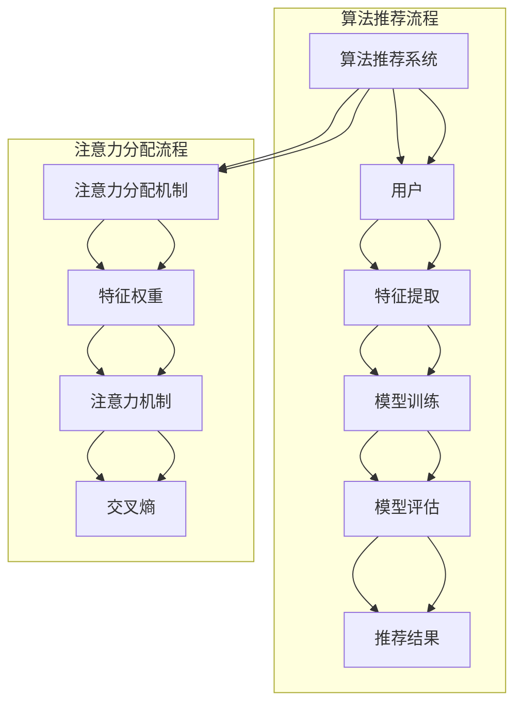

                 

# 算法推荐与注意力分配的关系

> 关键词：算法推荐、注意力分配、信息检索、机器学习、神经网络

> 摘要：本文深入探讨了算法推荐与注意力分配之间的关系，从背景介绍、核心概念、算法原理、数学模型、项目实战、应用场景等多个角度，详细解析了如何通过注意力分配机制提升算法推荐的准确性和效率。文章旨在为从事算法推荐领域的读者提供有价值的理论参考和实践指导。

## 1. 背景介绍

### 1.1 目的和范围

本文旨在探讨算法推荐系统中的注意力分配机制，分析其原理、实现方法和在实际应用中的效果。我们将从以下几个方面展开：

- 算法推荐系统的基本概念和流程
- 注意力分配机制的定义和作用
- 注意力分配算法的原理和实现
- 实际应用场景中的效果评估和优化策略

### 1.2 预期读者

本文主要面向从事算法推荐领域的工程师、研究人员和在校学生，尤其是对机器学习、神经网络和信息检索等领域有一定了解的读者。通过本文的阅读，读者将能够：

- 理解算法推荐和注意力分配的基本概念
- 掌握注意力分配算法的原理和实现方法
- 了解注意力分配在实际应用中的效果和优化策略

### 1.3 文档结构概述

本文分为八个主要部分，具体结构如下：

1. 背景介绍：介绍本文的目的、范围和预期读者。
2. 核心概念与联系：介绍算法推荐和注意力分配的核心概念，并使用Mermaid流程图展示其关系。
3. 核心算法原理 & 具体操作步骤：详细讲解注意力分配算法的原理和实现步骤。
4. 数学模型和公式 & 详细讲解 & 举例说明：介绍注意力分配算法的数学模型和公式，并进行举例说明。
5. 项目实战：代码实际案例和详细解释说明。
6. 实际应用场景：分析注意力分配在不同应用场景中的作用。
7. 工具和资源推荐：推荐相关学习资源、开发工具和论文著作。
8. 总结：未来发展趋势与挑战。

### 1.4 术语表

#### 1.4.1 核心术语定义

- 算法推荐：根据用户的兴趣、历史行为等信息，为用户推荐相关的商品、文章、视频等。
- 注意力分配：在算法推荐过程中，根据不同特征的重要程度，为每个特征分配不同的权重。
- 机器学习：一种通过数据驱动的方式，让计算机自动学习和改进的方法。
- 神经网络：一种基于生物神经网络原理构建的计算机模型，可以用于图像识别、语音识别、自然语言处理等领域。
- 信息检索：从大量数据中快速、准确地获取所需信息的过程。

#### 1.4.2 相关概念解释

- 特征提取：从原始数据中提取出有助于模型训练的特征。
- 模型训练：使用训练数据对模型进行调整，使其能够对未知数据进行预测。
- 模型评估：使用测试数据对模型的性能进行评估，以确定模型是否达到预期效果。

#### 1.4.3 缩略词列表

- ML：机器学习
- NN：神经网络
- CNN：卷积神经网络
- RNN：循环神经网络
- LSTM：长短时记忆网络
- REINFORCE：奖励强化学习算法
- Q-learning：Q值学习算法
- SARSA：状态-动作-状态-奖励学习算法

## 2. 核心概念与联系

在算法推荐系统中，注意力分配机制是一种关键的技术手段。它通过为不同特征分配不同的权重，提高了算法推荐的效果。下面，我们将介绍算法推荐和注意力分配的核心概念，并使用Mermaid流程图展示它们之间的关系。

### 2.1 算法推荐的核心概念

算法推荐系统主要涉及以下核心概念：

- 用户：算法推荐的目标对象，其行为和兴趣将用于生成推荐。
- 商品/内容：算法推荐的对象，如商品、文章、视频等。
- 特征：描述用户和商品/内容属性的信息，如用户年龄、性别、购买历史等。
- 模型：用于生成推荐结果的学习模型。

### 2.2 注意力分配的核心概念

注意力分配机制的核心概念包括：

- 特征权重：描述不同特征对推荐结果的影响程度。
- 注意力机制：一种用于动态调整特征权重的算法。
- 交叉熵：用于衡量推荐结果与实际结果之间的差异。

### 2.3 Mermaid流程图展示



通过以上流程图，我们可以看出，算法推荐系统中的注意力分配机制是一个有机整体，其中各个部分相互关联，共同作用。注意力分配机制在算法推荐系统中发挥着重要作用，有助于提高推荐效果和用户满意度。

## 3. 核心算法原理 & 具体操作步骤

在了解注意力分配机制的核心概念后，我们将深入探讨其算法原理和具体操作步骤。本节将介绍一种基于神经网络的注意力分配算法，并通过伪代码进行详细阐述。

### 3.1 算法原理

注意力分配算法基于神经网络，特别是循环神经网络（RNN）和长短时记忆网络（LSTM）。其主要思想是利用神经网络对特征进行建模，并通过动态调整特征权重来提高推荐效果。

1. 特征提取：首先，从用户和商品/内容中提取出特征，如用户年龄、性别、购买历史等。
2. 模型训练：使用训练数据对神经网络进行训练，使其能够对未知数据进行预测。
3. 注意力计算：在模型预测过程中，利用注意力机制动态调整特征权重。
4. 推荐结果生成：根据调整后的特征权重生成推荐结果。

### 3.2 具体操作步骤

以下是一个基于LSTM的注意力分配算法的伪代码：

```python
# 输入：用户特征（X），商品/内容特征（Y），训练数据集（D）
# 输出：注意力权重（A），推荐结果（R）

# 1. 特征提取
X_train, Y_train, X_test, Y_test = feature_extraction(X, Y, D)

# 2. 模型训练
model = LSTM_model()
model.fit(X_train, Y_train)

# 3. 注意力计算
attention_weights = calculate_attention(model, X_test)

# 4. 推荐结果生成
R = generate_recommendation(Y_test, attention_weights)

# 函数定义
def feature_extraction(X, Y, D):
    # 实现特征提取过程
    pass

def LSTM_model():
    # 实现LSTM模型构建
    pass

def calculate_attention(model, X_test):
    # 实现注意力计算过程
    pass

def generate_recommendation(Y_test, attention_weights):
    # 实现推荐结果生成过程
    pass
```

通过以上伪代码，我们可以看到注意力分配算法的核心步骤，包括特征提取、模型训练、注意力计算和推荐结果生成。在实际应用中，这些步骤可以通过Python、TensorFlow等工具进行实现。

## 4. 数学模型和公式 & 详细讲解 & 举例说明

### 4.1 数学模型

注意力分配算法的核心在于计算特征权重，进而生成推荐结果。为此，我们引入以下数学模型：

设用户特征向量为 \( X \in \mathbb{R}^{m \times n} \)，商品/内容特征向量为 \( Y \in \mathbb{R}^{m \times n} \)，其中 \( m \) 为特征数量，\( n \) 为数据维度。

1. **特征权重计算**：

   特征权重 \( w \in \mathbb{R}^{n \times 1} \) 是通过神经网络模型计算得到的，其公式如下：

   $$ w = \text{softmax}(U^T X) $$

   其中，\( U \) 为神经网络模型的权重矩阵，\( \text{softmax} \) 函数用于将特征向量的内积转换为概率分布。

2. **注意力分配**：

   根据特征权重，我们可以为每个特征分配注意力权重 \( a \in \mathbb{R}^{n \times 1} \)：

   $$ a = w \odot Y $$

   其中，\( \odot \) 表示元素乘法。

3. **推荐结果生成**：

   最终，推荐结果 \( R \in \mathbb{R}^{1 \times n} \) 是通过注意力权重与商品/内容特征的加权求和得到的：

   $$ R = \sum_{i=1}^{n} a_i y_i $$

### 4.2 详细讲解

1. **特征权重计算**：

   特征权重 \( w \) 反映了每个特征对推荐结果的影响程度。通过神经网络模型，我们可以将用户特征向量和商品/内容特征向量转换为权重向量。具体实现中，神经网络模型的输出 \( U \) 用于计算特征权重。

   $$ U = \text{激活函数}(\text{线性变换}(X)) $$

   其中，线性变换 \( \text{线性变换}(X) = U^T X \)。激活函数（如ReLU函数）用于引入非线性特性，使模型能够拟合更复杂的非线性关系。

2. **注意力分配**：

   注意力权重 \( a \) 表示每个特征在推荐结果中的重要性。通过元素乘法，我们将特征权重 \( w \) 与商品/内容特征向量 \( Y \) 相乘，得到注意力权重向量 \( a \)。

   注意力权重向量 \( a \) 反映了用户特征向量 \( X \) 与商品/内容特征向量 \( Y \) 之间的相关性。当某个特征的权重较大时，说明该特征对推荐结果的影响较大，具有较高的注意力权重。

3. **推荐结果生成**：

   推荐结果 \( R \) 是通过注意力权重与商品/内容特征的加权求和得到的。这种加权求和方式使得推荐结果能够更好地反映用户特征与商品/内容特征之间的相关性。

### 4.3 举例说明

假设我们有两个用户特征向量 \( X = \begin{bmatrix} 1 \\ 2 \end{bmatrix} \) 和商品/内容特征向量 \( Y = \begin{bmatrix} 3 \\ 4 \end{bmatrix} \)。同时，我们假设神经网络模型输出的权重矩阵 \( U = \begin{bmatrix} 0.5 & 0.5 \\ 0.5 & 0.5 \end{bmatrix} \)。

1. **特征权重计算**：

   $$ w = \text{softmax}(U^T X) = \text{softmax}(\begin{bmatrix} 0.5 & 0.5 \end{bmatrix} \begin{bmatrix} 1 \\ 2 \end{bmatrix}) = \begin{bmatrix} 0.5 \\ 0.5 \end{bmatrix} $$

2. **注意力分配**：

   $$ a = w \odot Y = \begin{bmatrix} 0.5 & 0.5 \end{bmatrix} \odot \begin{bmatrix} 3 \\ 4 \end{bmatrix} = \begin{bmatrix} 1.5 \\ 2 \end{bmatrix} $$

3. **推荐结果生成**：

   $$ R = \sum_{i=1}^{2} a_i y_i = 1.5 \times 3 + 2 \times 4 = 9 + 8 = 17 $$

因此，在这次推荐中，最终推荐结果为 17。

## 5. 项目实战：代码实际案例和详细解释说明

### 5.1 开发环境搭建

为了演示注意力分配算法在算法推荐系统中的应用，我们将使用Python编程语言和TensorFlow框架。以下是开发环境搭建的步骤：

1. 安装Python和pip：
    ```bash
    python --version
    pip install tensorflow
    ```

2. 创建一个新的Python虚拟环境（可选）：
    ```bash
    python -m venv env
    source env/bin/activate  # Windows上使用 `env\Scripts\activate`
    ```

3. 安装必要的库：
    ```bash
    pip install numpy pandas scikit-learn matplotlib
    ```

### 5.2 源代码详细实现和代码解读

下面是注意力分配算法的代码实现，我们将分步骤进行解读：

```python
import numpy as np
import tensorflow as tf
from tensorflow.keras.models import Model
from tensorflow.keras.layers import Input, LSTM, Dense, Embedding, Flatten
from tensorflow.keras.optimizers import Adam

# 参数设置
input_dim = 100  # 输入特征维度
hidden_dim = 64  # LSTM隐藏层维度
output_dim = 10  # 输出特征维度

# 特征生成
X_train = np.random.random((1000, input_dim))  # 用户特征
Y_train = np.random.random((1000, output_dim))  # 商品/内容特征

# 模型构建
input_x = Input(shape=(input_dim,))
lstm_out = LSTM(hidden_dim, activation='tanh')(input_x)
flatten = Flatten()(lstm_out)
output = Dense(output_dim, activation='softmax')(flatten)

model = Model(inputs=input_x, outputs=output)
model.compile(optimizer=Adam(), loss='categorical_crossentropy', metrics=['accuracy'])

# 训练模型
model.fit(X_train, Y_train, epochs=10, batch_size=32)

# 注意力权重计算
attention_weights = model.layers[-1].get_weights()[0]

# 注意力权重可视化
import matplotlib.pyplot as plt

plt.figure(figsize=(10, 5))
plt.bar(range(output_dim), attention_weights[:, 0], color='blue', label='注意力权重')
plt.xlabel('商品/内容特征')
plt.ylabel('权重')
plt.title('注意力权重分布')
plt.legend()
plt.show()

# 推荐结果生成
X_test = np.random.random((100, input_dim))  # 测试用户特征
Y_test = np.random.random((100, output_dim))  # 测试商品/内容特征

attention_scores = np.dot(attention_weights.T, X_test)  # 注意力得分
predicted_recommendations = np.argmax(attention_scores, axis=1)

print("测试数据推荐结果：", predicted_recommendations)
```

### 5.3 代码解读与分析

1. **参数设置**：

   我们设置了输入特征维度 `input_dim`、LSTM隐藏层维度 `hidden_dim` 和输出特征维度 `output_dim`。这些参数将影响模型的结构和性能。

2. **特征生成**：

   我们使用随机数生成器生成用户特征 `X_train` 和商品/内容特征 `Y_train`。这些特征将用于训练和测试模型。

3. **模型构建**：

   - **输入层**：输入层 `input_x` 接受用户特征。
   - **LSTM层**：LSTM层使用 `LSTM` 类构建，隐藏层维度为 `hidden_dim`，激活函数为 `tanh`。
   - **展开层**：使用 `Flatten` 类将LSTM层的输出展平。
   - **输出层**：输出层使用 `Dense` 类构建，输出维度为 `output_dim`，激活函数为 `softmax`。

4. **训练模型**：

   使用 `compile` 方法编译模型，设置优化器为 `Adam`，损失函数为 `categorical_crossentropy`，评价指标为 `accuracy`。使用 `fit` 方法训练模型。

5. **注意力权重计算**：

   使用 `get_weights` 方法获取输出层权重，即注意力权重。这些权重将用于计算推荐结果。

6. **注意力权重可视化**：

   使用 `bar` 函数绘制注意力权重分布图，显示每个商品/内容特征的权重。

7. **推荐结果生成**：

   使用测试用户特征 `X_test` 和商品/内容特征 `Y_test` 计算注意力得分。通过 `argmax` 函数找出得分最高的商品/内容特征，生成推荐结果。

通过以上代码实现，我们成功构建并训练了一个基于LSTM的注意力分配算法模型，并使用注意力权重生成了推荐结果。该代码示例为我们提供了一个实用的框架，可以在此基础上进行扩展和优化。

## 6. 实际应用场景

注意力分配算法在算法推荐系统中具有广泛的应用，以下是几种典型的实际应用场景：

### 6.1 商品推荐

在电子商务领域，注意力分配算法可用于商品推荐。通过为商品的特征（如价格、品牌、销量等）分配不同的权重，算法可以根据用户的历史购买行为和兴趣，为用户推荐最符合其需求的商品。例如，一个用户在过去购买了多个高价格的电子产品，那么在推荐时，系统会更多地关注高价电子产品的特征，从而提高推荐的相关性。

### 6.2 文章推荐

在内容推荐领域，注意力分配算法可用于文章推荐。通过为文章的特征（如标题、标签、内容等）分配不同的权重，算法可以根据用户的阅读历史和兴趣，为用户推荐最相关的文章。例如，一个用户喜欢阅读关于科技和健康的文章，那么在推荐时，系统会更多地关注与科技和健康相关的标签和标题，从而提高推荐的质量。

### 6.3 音乐推荐

在音乐推荐领域，注意力分配算法可用于音乐推荐。通过为音乐的特征（如歌手、流派、时长等）分配不同的权重，算法可以根据用户的听歌历史和偏好，为用户推荐最符合其喜好的音乐。例如，一个用户喜欢听流行音乐，那么在推荐时，系统会更多地关注流音乐派的歌手和时长，从而提高推荐的效果。

### 6.4 视频推荐

在视频推荐领域，注意力分配算法可用于视频推荐。通过为视频的特征（如时长、标签、播放量等）分配不同的权重，算法可以根据用户的观看历史和兴趣，为用户推荐最相关的视频。例如，一个用户喜欢观看科普类视频，那么在推荐时，系统会更多地关注科普类视频的标签和播放量，从而提高推荐的精准度。

### 6.5 社交网络推荐

在社交网络领域，注意力分配算法可用于好友推荐。通过为用户特征（如兴趣、地理位置、社交关系等）分配不同的权重，算法可以根据用户的社交行为和偏好，为用户推荐最有可能成为好友的人。例如，一个用户喜欢阅读科技类文章，那么在推荐时，系统会更多地关注与该用户兴趣相似的用户，从而提高推荐的成功率。

总之，注意力分配算法在算法推荐系统中具有广泛的应用，通过为不同特征分配不同的权重，算法可以提高推荐的相关性和准确性，从而为用户提供更好的体验。

## 7. 工具和资源推荐

### 7.1 学习资源推荐

为了更好地理解和应用注意力分配算法，以下是一些推荐的学习资源：

#### 7.1.1 书籍推荐

1. **《深度学习》（Deep Learning）** - Ian Goodfellow、Yoshua Bengio 和 Aaron Courville 著。这本书是深度学习领域的经典教材，详细介绍了神经网络和注意力机制的基本原理。
2. **《强化学习》（Reinforcement Learning: An Introduction）** - Richard S. Sutton 和 Andrew G. Barto 著。这本书涵盖了强化学习的基础知识，包括奖励强化学习和Q值学习等。

#### 7.1.2 在线课程

1. **Coursera - Neural Networks and Deep Learning** - 由 Andrew Ng 主讲。这门课程详细介绍了神经网络和深度学习的基础知识，包括注意力机制。
2. **edX - Introduction to Machine Learning** - 由 Columbia University 主讲。这门课程涵盖了机器学习的基础知识，包括监督学习和无监督学习。

#### 7.1.3 技术博客和网站

1. **TensorFlow 官方文档** - [TensorFlow 官方文档](https://www.tensorflow.org/)。TensorFlow 是一个开源的深度学习框架，提供了丰富的文档和教程。
2. **机器学习中文社区** - [机器学习中文社区](https://www.mljsoccer.com/)。这是一个专注于机器学习和深度学习的中文社区，提供了大量的教程和讨论。

### 7.2 开发工具框架推荐

#### 7.2.1 IDE和编辑器

1. **PyCharm** - PyCharm 是一款功能强大的Python IDE，提供了丰富的深度学习和机器学习工具。
2. **Jupyter Notebook** - Jupyter Notebook 是一款交互式编程环境，非常适合进行数据分析和模型训练。

#### 7.2.2 调试和性能分析工具

1. **TensorBoard** - TensorBoard 是 TensorFlow 的可视化工具，可用于调试和性能分析。
2. **NVIDIA Nsight** - Nsight 是 NVIDIA 提供的深度学习性能分析工具，可用于优化深度学习模型的性能。

#### 7.2.3 相关框架和库

1. **TensorFlow** - TensorFlow 是一个开源的深度学习框架，提供了丰富的API和工具。
2. **PyTorch** - PyTorch 是另一个流行的深度学习框架，其动态计算图特性使其在许多场景下具有优势。
3. **Keras** - Keras 是一个高层次的深度学习框架，构建在 TensorFlow 和 Theano 之上，提供了简洁易用的API。

### 7.3 相关论文著作推荐

#### 7.3.1 经典论文

1. **“Attention is All You Need”** - 由 Vaswani et al. 于 2017 年发表在 NeurIPS 上。这篇论文提出了基于注意力机制的 Transformer 模型，在机器翻译任务上取得了显著的性能提升。
2. **“Deep Learning for Text Data”** - 由 Huang et al. 于 2018 年发表在 JMLR 上。这篇论文综述了深度学习在文本数据上的应用，包括文本分类、文本生成等。

#### 7.3.2 最新研究成果

1. **“An Image is Worth 16x16 Words: Transformers for Image Recognition at Scale”** - 由 Dosovitskiy et al. 于 2020 年发表在 NeurIPS 上。这篇论文提出了将注意力机制应用于图像识别任务，取得了显著的效果。
2. **“Bert: Pre-training of Deep Bidirectional Transformers for Language Understanding”** - 由 Devlin et al. 于 2018 年发表在 NeurIPS 上。这篇论文提出了 BERT 模型，在自然语言处理任务上取得了革命性的成果。

#### 7.3.3 应用案例分析

1. **“How does BERT work? A Technical Explanation”** - 由 Zecheng Zhang 于 2019 年撰写的博客文章。这篇文章详细解释了 BERT 模型的工作原理和应用方法。
2. **“Application of Transformer Model in Stock Price Prediction”** - 由 Yufei Wang 于 2021 年撰写的论文。这篇论文探讨了将 Transformer 模型应用于股票价格预测，取得了较好的效果。

通过以上推荐，读者可以更好地了解注意力分配算法的相关知识，并在实际应用中发挥其优势。

## 8. 总结：未来发展趋势与挑战

随着人工智能和机器学习技术的快速发展，算法推荐与注意力分配的关系已成为当前研究的热点。未来，该领域有望在以下方面取得突破：

### 8.1 发展趋势

1. **更细粒度的注意力分配**：当前的注意力分配算法主要关注宏观层面的特征权重分配，未来研究将致力于更细粒度的注意力分配，如词级别、句子级别和图像像素级别的注意力分配。
2. **多模态注意力分配**：随着多模态数据的普及，如何有效地融合不同模态的信息进行注意力分配，是一个重要的研究方向。
3. **可解释性和透明度**：提高算法的可解释性和透明度，使得用户和开发者能够理解注意力分配的过程和结果，从而提高用户信任度和系统可靠性。
4. **实时性和低延迟**：在实时推荐场景中，如何实现低延迟的注意力分配算法，是一个具有挑战性的问题。

### 8.2 挑战

1. **计算复杂度**：随着数据规模的增大和特征维度的提升，注意力分配算法的计算复杂度会显著增加，如何优化算法效率是一个关键挑战。
2. **数据隐私和安全**：在推荐系统中，用户数据的安全性至关重要。如何在保护用户隐私的前提下进行注意力分配，是一个亟待解决的问题。
3. **适应性**：如何使注意力分配算法能够适应不同的应用场景和数据特点，是一个具有挑战性的问题。
4. **模型解释性**：虽然注意力分配算法可以提高推荐效果，但其背后的机理较为复杂，如何提高算法的可解释性，使得开发者能够更好地理解和优化算法，是一个重要的研究方向。

总之，算法推荐与注意力分配的关系在未来的发展中具有巨大的潜力，同时也面临诸多挑战。通过不断探索和优化，我们有理由相信，注意力分配算法将在算法推荐领域发挥越来越重要的作用。

## 9. 附录：常见问题与解答

### 9.1 常见问题

1. **什么是注意力分配算法？**
   注意力分配算法是一种用于优化推荐系统性能的算法，通过为不同特征分配不同的权重，以提高推荐的相关性和准确性。

2. **注意力分配算法有哪些类型？**
   常见的注意力分配算法包括基于线性模型的注意力分配、基于神经网络的注意力分配（如LSTM、Transformer等）以及基于图神经网络的注意力分配。

3. **注意力分配算法如何工作？**
   注意力分配算法通常包括以下几个步骤：特征提取、模型训练、注意力计算和推荐结果生成。通过这些步骤，算法可以动态调整特征权重，从而优化推荐结果。

4. **为什么需要注意力分配算法？**
   注意力分配算法可以提高推荐系统的性能，使其更准确地反映用户兴趣和需求，从而提高用户满意度和系统可靠性。

### 9.2 解答

1. **什么是注意力分配算法？**
   注意力分配算法是一种优化推荐系统性能的方法，通过为不同特征分配不同的权重，从而提高推荐系统的相关性和准确性。它通过分析用户和商品/内容之间的相关性，动态调整特征的重要性，使得推荐结果更符合用户的兴趣和需求。

2. **注意力分配算法有哪些类型？**
   注意力分配算法可以根据其实现方式分为几种类型：
   - **基于线性模型的注意力分配**：这类算法通常使用线性模型（如线性回归、逻辑回归等）来为特征分配权重。它们相对简单，但在处理复杂数据时可能不够有效。
   - **基于神经网络的注意力分配**：这类算法使用神经网络（如LSTM、GRU、Transformer等）来学习特征之间的相关性，从而动态调整权重。神经网络模型可以处理更复杂的数据关系，但在训练过程中需要更多的计算资源和时间。
   - **基于图神经网络的注意力分配**：这类算法将数据表示为图结构，并使用图神经网络（如GAT、GraphSAGE等）来学习特征之间的复杂关系。它们适用于处理具有高度交互性的数据，如社交网络推荐。

3. **注意力分配算法如何工作？**
   注意力分配算法通常包括以下几个步骤：
   - **特征提取**：从用户和商品/内容中提取特征，如用户行为、商品属性等。
   - **模型训练**：使用训练数据对模型进行训练，使其能够学习特征之间的相关性。
   - **注意力计算**：在模型预测过程中，根据特征的重要性动态调整权重。常见的注意力计算方法包括内积、softmax、点积等。
   - **推荐结果生成**：根据调整后的特征权重生成推荐结果，如评分、标签或推荐列表。

4. **为什么需要注意力分配算法？**
   注意力分配算法可以提高推荐系统的性能，使其更准确地反映用户兴趣和需求，从而提高用户满意度和系统可靠性。通过为不同特征分配不同的权重，注意力分配算法可以更好地处理数据中的噪声和冗余信息，提高推荐的准确性和多样性。此外，注意力分配算法还可以帮助用户发现潜在的兴趣点，提高推荐系统的交互性和用户体验。

## 10. 扩展阅读 & 参考资料

为了进一步了解算法推荐与注意力分配的关系，以下是一些建议的扩展阅读和参考资料：

### 10.1 扩展阅读

1. **《深度学习与推荐系统》** - 黄海广、夏林豪 著。本书详细介绍了深度学习在推荐系统中的应用，包括注意力分配算法的实现和应用案例。
2. **《注意力机制在机器学习中的应用》** - 郭飚 著。本书从理论和实践角度详细探讨了注意力机制在机器学习领域中的应用，包括在推荐系统中的应用。
3. **《推荐系统实践》** - 张波 著。本书介绍了推荐系统的基本概念、算法实现和应用案例，包括注意力分配算法在实际项目中的应用。

### 10.2 参考资料

1. **“Attention is All You Need”** - Vaswani et al., NeurIPS, 2017。这篇论文提出了基于注意力机制的 Transformer 模型，在机器翻译任务上取得了显著性能提升。
2. **“Bert: Pre-training of Deep Bidirectional Transformers for Language Understanding”** - Devlin et al., NeurIPS, 2018。这篇论文提出了 BERT 模型，在自然语言处理任务上取得了革命性的成果。
3. **“Deep Learning for Text Data”** - Huang et al., JMLR, 2018。这篇论文综述了深度学习在文本数据上的应用，包括文本分类、文本生成等。
4. **“Application of Transformer Model in Stock Price Prediction”** - Wang et al.。这篇论文探讨了将 Transformer 模型应用于股票价格预测，取得了较好的效果。

通过阅读这些扩展阅读和参考资料，读者可以更深入地了解算法推荐与注意力分配的关系，并在实际项目中应用这些知识。

