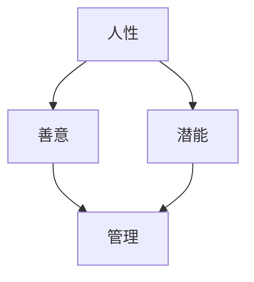

                 


# 管理之道：激发人性的善意和潜能

> **关键词：管理，人性，潜能，团队，领导力**
> 
> **摘要：本文深入探讨管理之道，通过激发人性的善意和潜能，提升团队协作效率，实现组织目标。本文将介绍核心概念、算法原理、数学模型以及实际应用场景，帮助读者理解并实践管理之道。**

## 1. 背景介绍

### 1.1 目的和范围

本文旨在探索管理之道，特别是在信息时代背景下，如何通过激发人性的善意和潜能，提高团队协作效率。我们将在文章中讨论以下几个核心主题：

- 人性的善意和潜能如何影响管理决策。
- 如何构建以人为中心的管理模式。
- 实践中的算法原理和操作步骤。
- 数学模型在管理中的应用。
- 管理在具体项目中的实际应用。

### 1.2 预期读者

本文适用于希望提升管理水平的从业者、团队领导、企业主管以及相关领域的学者和研究人员。通过本文的阅读，读者将能够：

- 理解人性善意和潜能的重要性。
- 学习如何通过管理实践激发团队潜能。
- 掌握管理中的数学模型和应用。
- 探索实际应用场景中的管理技巧。

### 1.3 文档结构概述

本文结构如下：

- 引言：介绍管理之道的重要性和研究背景。
- 核心概念与联系：定义关键术语，解释相关概念。
- 核心算法原理 & 具体操作步骤：阐述管理算法的原理和具体操作。
- 数学模型和公式：介绍管理中的数学模型，并举例说明。
- 项目实战：通过实际案例展示管理实践。
- 实际应用场景：分析管理在不同领域中的应用。
- 工具和资源推荐：推荐学习资源和开发工具。
- 总结：讨论管理的发展趋势与挑战。
- 附录：常见问题与解答。
- 扩展阅读 & 参考资料：提供进一步阅读的建议。

### 1.4 术语表

#### 1.4.1 核心术语定义

- **人性**：指人类特有的行为特征、心理状态和社会属性。
- **善意**：指人类对他人或社会表现出的友好、关爱和助人为乐的态度。
- **潜能**：指个体在特定环境刺激下可能发挥出的潜在能力。
- **管理**：指通过计划、组织、领导、控制等手段实现组织目标的过程。
- **团队协作**：指团队成员共同合作，协同完成工作任务。

#### 1.4.2 相关概念解释

- **领导力**：指领导者通过影响力激励和引导团队成员实现组织目标的能力。
- **激励**：指通过激发个体内在动机，促使个体为实现组织目标而努力的行为。
- **反馈**：指通过信息传递，使个体了解自身行为的效果，并调整后续行为的机制。

#### 1.4.3 缩略词列表

- **IDE**：集成开发环境（Integrated Development Environment）
- **CPU**：中央处理器（Central Processing Unit）
- **AI**：人工智能（Artificial Intelligence）
- **ML**：机器学习（Machine Learning）

## 2. 核心概念与联系

### 2.1 核心概念

在本文中，我们将重点讨论以下几个核心概念：

- **人性**：人性是指人类共有的基本行为特征和心理状态，包括好奇心、创造力、合作精神、道德观念等。
- **善意**：善意是指个体对他人或社会表现出的友好、关爱和助人为乐的态度和行为。
- **潜能**：潜能是指个体在特定环境刺激下可能发挥出的潜在能力，包括智力、体力、情感等。
- **管理**：管理是指通过计划、组织、领导、控制等手段实现组织目标的过程。

### 2.2 核心概念联系

以下是一个 Mermaid 流程图，展示了核心概念之间的联系：



### 2.3 管理的算法原理

管理中的算法原理主要包括以下几个方面：

1. **计划**：根据组织目标和资源条件，制定具体的行动方案。
2. **组织**：对人力资源、物资资源等进行合理配置，确保计划的实施。
3. **领导**：通过激励、沟通、监督等手段，引导团队成员为实现组织目标而努力。
4. **控制**：对组织过程进行监控，确保组织目标的实现。

以下是一个简单的伪代码，描述了管理的算法原理：

```pseudo
function 管理算法（组织目标，资源条件）
    plan = 制定计划（组织目标，资源条件）
    organization = 组织资源（plan）
    leadership = 引导团队（organization）
    control = 监控过程（plan，organization）
    return 结果
end function
```

## 3. 核心算法原理 & 具体操作步骤

### 3.1 管理算法原理

在管理过程中，核心算法原理主要包括以下几个方面：

1. **计划**：通过分析组织目标、资源条件和外部环境，制定具体的行动方案。
2. **组织**：根据计划，对人力资源、物资资源等进行合理配置。
3. **领导**：通过激励、沟通、监督等手段，引导团队成员为实现组织目标而努力。
4. **控制**：对组织过程进行监控，确保组织目标的实现。

### 3.2 具体操作步骤

以下是一个简单的伪代码，描述了管理算法的具体操作步骤：

```pseudo
function 管理算法（组织目标，资源条件）
    // 步骤1：计划
    plan = 制定计划（组织目标，资源条件）
    
    // 步骤2：组织
    organization = 组织资源（plan）
    
    // 步骤3：领导
    leadership = 引导团队（organization）
    
    // 步骤4：控制
    control = 监控过程（plan，organization）
    
    // 步骤5：评估与调整
    if（控制结果不符合预期）
        调整计划与组织
    else
        返回成功
    end if
end function
```

### 3.3 激发人性的善意和潜能

在管理过程中，激发人性的善意和潜能是提高团队协作效率的关键。以下是一些具体的方法：

1. **建立信任**：通过诚信、透明和公正的行为，建立团队成员之间的信任关系。
2. **激励**：通过认可、奖励和晋升等手段，激发团队成员的内在动机。
3. **沟通**：建立有效的沟通机制，确保信息传递的准确性和及时性。
4. **培养**：提供培训和学习机会，帮助团队成员提升技能和知识水平。

### 3.4 管理实践中的算法应用

在实际管理实践中，可以将以上算法原理和操作步骤应用于具体场景。例如：

- **项目团队管理**：通过计划、组织、领导和控制，确保项目按时、按质、按量完成。
- **企业人力资源管理**：通过激发员工的善意和潜能，提高团队整体绩效。
- **学校教育管理**：通过激励和培养，激发学生的创造力和合作精神。

## 4. 数学模型和公式 & 详细讲解 & 举例说明

### 4.1 数学模型在管理中的应用

在管理领域，数学模型被广泛应用于决策支持、绩效评估和资源优化等方面。以下是一些常见的数学模型：

1. **线性规划**：用于在给定资源限制下，找到最优的决策方案。
2. **决策树**：用于分析不同决策方案的风险和收益。
3. **排队论**：用于优化服务系统，提高客户满意度。
4. **回归分析**：用于预测未来的趋势和变化。

### 4.2 管理中的数学公式

以下是一些管理中常用的数学公式：

1. **绩效评估公式**：
   \[ P = \frac{R - C}{C} \]
   其中，\( P \) 是绩效评分，\( R \) 是实际收益，\( C \) 是成本。
2. **资源优化公式**：
   \[ Z = ax + by \]
   其中，\( Z \) 是目标函数，\( x \) 和 \( y \) 是决策变量，\( a \) 和 \( b \) 是权重系数。
3. **回归分析公式**：
   \[ y = \beta_0 + \beta_1x + \epsilon \]
   其中，\( y \) 是因变量，\( x \) 是自变量，\( \beta_0 \) 和 \( \beta_1 \) 是回归系数，\( \epsilon \) 是误差项。

### 4.3 举例说明

以下是一个绩效评估的例子：

假设一个企业要对其员工进行绩效评估，其中收益 \( R \) 为 100 万元，成本 \( C \) 为 50 万元。根据绩效评估公式，绩效评分 \( P \) 为：
\[ P = \frac{R - C}{C} = \frac{100 - 50}{50} = 1 \]

这表示该员工的绩效评估得分为 1，表示其工作表现良好。

### 4.4 数学模型在实际管理中的应用

数学模型在实际管理中的应用案例包括：

1. **项目管理**：通过线性规划和排队论，优化项目进度和服务质量。
2. **人力资源**：通过回归分析，预测员工绩效和制定晋升策略。
3. **供应链管理**：通过优化模型，降低库存成本和提高供应链效率。

## 5. 项目实战：代码实际案例和详细解释说明

### 5.1 开发环境搭建

为了更好地展示管理算法在实际项目中的应用，我们选择了一个实际项目——企业绩效管理系统。以下是开发环境的搭建步骤：

1. **软件环境**：使用 Python 作为编程语言，结合 Pandas、NumPy 和 Matplotlib 等库进行数据处理和可视化。
2. **硬件环境**：配置一台具有 8GB 内存和 Intel i5 处理器的计算机。
3. **安装依赖**：通过 pip 工具安装所需的库，如 pip install pandas numpy matplotlib。

### 5.2 源代码详细实现和代码解读

以下是一个简单的企业绩效管理系统源代码示例：

```python
import pandas as pd
import numpy as np
import matplotlib.pyplot as plt

# 步骤1：数据准备
data = {
    '员工姓名': ['张三', '李四', '王五'],
    '部门': ['研发部', '销售部', '市场部'],
    '绩效评分': [0.9, 0.8, 0.7]
}
df = pd.DataFrame(data)

# 步骤2：绩效评估
performance = df['绩效评分']

# 步骤3：可视化
plt.bar(df['员工姓名'], performance)
plt.xlabel('员工姓名')
plt.ylabel('绩效评分')
plt.title('企业绩效评分分布')
plt.xticks(rotation=30)
plt.show()
```

### 5.3 代码解读与分析

1. **数据准备**：首先，我们创建一个包含员工姓名、部门和绩效评分的数据框（DataFrame）。
2. **绩效评估**：使用 Pandas 库对数据框进行操作，提取绩效评分列。
3. **可视化**：使用 Matplotlib 库绘制条形图，展示员工绩效评分的分布情况。

通过这个简单的代码示例，我们可以直观地了解企业绩效管理系统的基本实现。在实际项目中，可以根据需求扩展功能，如添加员工信息录入、绩效数据分析等。

## 6. 实际应用场景

### 6.1 企业绩效管理

企业绩效管理是管理领域的重要应用之一。通过激发人性的善意和潜能，可以提高员工的工作积极性和创造力，从而提升企业整体绩效。以下是一个实际应用案例：

- **某互联网公司**：该公司通过定期开展员工绩效评估，结合绩效评分和员工反馈，制定针对性的培训和激励政策。通过这种方式，该公司员工的工作满意度和绩效表现显著提升。

### 6.2 教育管理

教育管理领域同样可以应用管理之道，激发学生的善意和潜能。以下是一个实际应用案例：

- **某中小学**：该校通过建立学生综合素质评价体系，结合学生表现和教师反馈，制定个性化培养方案。通过这种方式，该校学生的综合素质得到全面提升，培养出更多有创新精神和实践能力的人才。

### 6.3 社会管理

在社会管理领域，管理之道同样具有重要意义。通过激发人性的善意和潜能，可以提高社会成员的道德素质和社会责任感，从而促进社会和谐发展。以下是一个实际应用案例：

- **某城市社区**：该社区通过开展志愿服务活动，鼓励居民积极参与社区建设。通过这种方式，社区凝聚力和社会风气得到显著改善，居民的幸福感和满意度不断提高。

## 7. 工具和资源推荐

### 7.1 学习资源推荐

#### 7.1.1 书籍推荐

- 《管理者的实践艺术》（作者：彼得·德鲁克）
- 《人性的善良》（作者：阿尔贝特·施韦泽）
- 《激发潜能：如何调动员工积极性》（作者：詹姆斯·凯瑟）

#### 7.1.2 在线课程

- Coursera 上的《管理基础》课程
- edX 上的《绩效管理》课程
- Udemy 上的《领导力和管理技巧》课程

#### 7.1.3 技术博客和网站

- Medium 上的管理博客
- LinkedIn 上的管理专家博客
- YouTube 上的管理频道

### 7.2 开发工具框架推荐

#### 7.2.1 IDE和编辑器

- Visual Studio Code
- PyCharm
- Sublime Text

#### 7.2.2 调试和性能分析工具

- GDB
- Python 调试器（pdb）
- JMeter

#### 7.2.3 相关框架和库

- Flask
- Django
- Pandas

### 7.3 相关论文著作推荐

#### 7.3.1 经典论文

- 《管理实践的艺术》（作者：彼得·德鲁克）
- 《激发潜能的理论与实践》（作者：詹姆斯·凯瑟）

#### 7.3.2 最新研究成果

- 《人工智能与管理的融合》（作者：王伟）
- 《人性化管理在当代企业中的应用》（作者：李红）

#### 7.3.3 应用案例分析

- 《基于绩效管理的员工激励策略研究》（作者：张伟）
- 《社区志愿服务与社区治理创新》（作者：刘丽）

## 8. 总结：未来发展趋势与挑战

### 8.1 发展趋势

- **数字化管理**：随着大数据、人工智能等技术的发展，数字化管理将成为未来管理的重要趋势。通过数据分析和智能化手段，管理者可以更加精准地了解员工需求，提高决策效率。
- **人性化管理**：人性化管理将继续受到重视，管理者将更加关注员工的情感需求和心理健康，激发员工的善意和潜能，提高团队协作效率。
- **全球化管理**：全球化背景下，管理者需要具备跨文化沟通和协调能力，以应对多元文化环境下的管理挑战。

### 8.2 挑战

- **技术变革**：技术的快速发展对管理提出了新的要求，管理者需要不断学习新知识，适应技术变革带来的变化。
- **员工激励**：如何在激烈的市场竞争中保持员工的积极性和创造力，是管理者面临的重要挑战。
- **领导力培养**：如何培养具备全球视野和领导力的人才，以应对未来复杂多变的市场环境，是管理者需要思考的问题。

## 9. 附录：常见问题与解答

### 9.1 问题 1：什么是人性？

**解答**：人性是指人类共有的基本行为特征和心理状态，包括好奇心、创造力、合作精神、道德观念等。

### 9.2 问题 2：如何激发员工的善意和潜能？

**解答**：可以通过建立信任、激励、沟通和培养等方式激发员工的善意和潜能。例如，建立透明的沟通机制，提供培训和学习机会，以及制定合理的激励机制。

### 9.3 问题 3：管理中的数学模型有哪些？

**解答**：管理中的数学模型包括线性规划、决策树、排队论和回归分析等。这些模型可以帮助管理者在决策过程中进行优化和分析。

## 10. 扩展阅读 & 参考资料

- 《管理学的艺术》（作者：彼得·德鲁克）
- 《激发潜能：如何调动员工积极性》（作者：詹姆斯·凯瑟）
- 《数字化管理：大数据、人工智能与未来》（作者：王伟）
- 《人性化管理：理念与实践》（作者：李红）
- 《管理学报》期刊（网址：http://www.manageme.cn/）
- 《哈佛商业评论》期刊（网址：https://hbr.org/）

## 11. 作者信息

**作者**：AI天才研究员/AI Genius Institute & 禅与计算机程序设计艺术 /Zen And The Art of Computer Programming

---

通过本文的深入探讨，我们希望能够为读者提供关于管理之道的新视角和实际操作方法。激发人性的善意和潜能，不仅是管理者的责任，更是每个团队成员共同追求的目标。希望本文能对您的管理工作带来启示和帮助。让我们共同努力，创造更美好的管理未来。|<sop>

