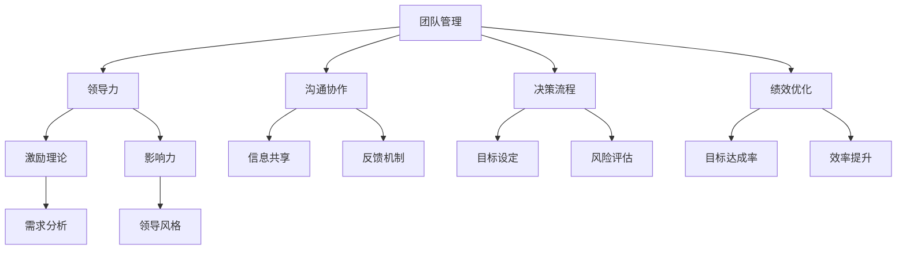

                 

# 管理的智慧：激发团队潜能

> **关键词：团队管理、领导力、激发潜能、组织行为、沟通协作、决策流程、绩效优化**

> **摘要：本文将探讨团队管理中的核心问题，包括如何激发团队成员的潜能、建立有效的沟通机制、制定合理的决策流程以及优化团队绩效。通过结合心理学、管理学和计算机科学的理论，我们提出了一套系统性、可操作的管理方法，旨在为IT行业领导者提供实用的指导。**

## 1. 背景介绍

### 1.1 目的和范围

本文旨在帮助IT行业领导者深入了解团队管理中的关键要素，提升团队的整体效能。本文将涵盖以下主题：

1. **核心概念与联系**：介绍团队管理中的关键概念，包括领导力、团队协作、激励理论等。
2. **核心算法原理 & 具体操作步骤**：详细阐述如何运用心理学和管理学原理来激发团队成员的潜能。
3. **数学模型和公式 & 详细讲解 & 举例说明**：运用统计学方法分析团队绩效，提出优化策略。
4. **项目实战：代码实际案例和详细解释说明**：通过具体案例展示管理方法在实际项目中的应用。
5. **实际应用场景**：讨论团队管理在不同规模组织中的适用性。
6. **工具和资源推荐**：推荐学习资源和开发工具，为实践提供支持。
7. **总结：未来发展趋势与挑战**：分析团队管理的未来趋势和挑战，探讨应对策略。

### 1.2 预期读者

本文面向以下读者：

1. **IT行业领导者**：希望提升团队管理效能的高级管理者。
2. **项目经理**：负责团队项目管理和协调工作的专业人士。
3. **人力资源经理**：关注团队绩效和员工发展的HR专业人士。
4. **技术团队成员**：希望深入了解团队管理机制的工程师和开发者。

### 1.3 文档结构概述

本文分为以下几个部分：

1. **背景介绍**：介绍本文的目的、预期读者和文档结构。
2. **核心概念与联系**：阐述团队管理中的关键概念及其相互关系。
3. **核心算法原理 & 具体操作步骤**：详细解释如何运用心理学和管理学原理激发团队潜能。
4. **数学模型和公式 & 详细讲解 & 举例说明**：运用统计学方法分析团队绩效，并提出优化策略。
5. **项目实战：代码实际案例和详细解释说明**：通过具体案例展示管理方法的应用。
6. **实际应用场景**：讨论团队管理在不同规模组织中的适用性。
7. **工具和资源推荐**：推荐学习资源和开发工具。
8. **总结：未来发展趋势与挑战**：分析团队管理的未来趋势和挑战。
9. **附录：常见问题与解答**：解答读者可能遇到的常见问题。
10. **扩展阅读 & 参考资料**：推荐相关阅读资料。

### 1.4 术语表

#### 1.4.1 核心术语定义

- **团队管理**：指通过协调和管理团队资源，实现团队目标的过程。
- **领导力**：指领导者通过影响力、激励和指导，推动团队达成目标的能力。
- **潜能激发**：通过激励和引导，挖掘团队成员的潜在能力和创造性。
- **绩效优化**：通过优化团队工作流程、沟通机制和激励机制，提升团队的整体绩效。

#### 1.4.2 相关概念解释

- **组织行为学**：研究个体、群体和组织在工作环境中的行为和心理过程。
- **心理学**：研究个体行为和心理过程的学科，为团队管理提供理论基础。
- **沟通协作**：团队成员之间通过信息交流和合作，共同完成任务的过程。
- **决策流程**：团队在决策过程中遵循的步骤和方法，确保决策的科学性和有效性。

#### 1.4.3 缩略词列表

- **IT**：信息技术（Information Technology）
- **HR**：人力资源（Human Resources）
- **PM**：项目经理（Project Manager）
- **IDE**：集成开发环境（Integrated Development Environment）

## 2. 核心概念与联系

在团队管理中，理解核心概念及其相互关系至关重要。以下是一个Mermaid流程图，展示团队管理中的关键概念及其联系：



### 2.1 领导力

领导力是团队管理中的核心概念，它直接影响团队成员的行为和工作效率。领导力包括以下几个方面：

- **影响力**：领导者通过榜样作用和影响力，激发团队成员的积极性和创造力。
- **激励理论**：领导者运用激励理论，如马斯洛需求层次理论和赫茨伯格双因素理论，激发团队成员的内在动机。
- **领导风格**：领导者根据团队特点和任务需求，选择合适的领导风格，如民主式、专制式和参与式领导。

### 2.2 沟通协作

沟通协作是团队成功的关键因素。有效的沟通协作包括以下几个方面：

- **信息共享**：团队成员通过共享信息和资源，提高工作效率和团队凝聚力。
- **反馈机制**：团队成员之间建立积极的反馈机制，及时发现问题并调整工作方向。
- **冲突解决**：领导者通过有效的沟通，解决团队成员之间的冲突，确保团队和谐。

### 2.3 决策流程

决策流程是团队管理中的重要环节。一个科学、合理的决策流程包括以下几个方面：

- **目标设定**：明确团队目标，确保决策方向正确。
- **风险评估**：评估决策可能带来的风险，制定应对策略。
- **决策制定**：通过讨论、分析和投票等方式，确定最佳决策方案。

### 2.4 绩效优化

绩效优化是团队管理的最终目标。绩效优化包括以下几个方面：

- **目标达成率**：通过监控和评估，确保团队目标得以实现。
- **效率提升**：通过优化工作流程和资源配置，提高团队整体工作效率。
- **持续改进**：鼓励团队成员持续学习和改进，不断提升团队绩效。

## 3. 核心算法原理 & 具体操作步骤

为了激发团队潜能，我们可以运用以下心理学和管理学原理：

### 3.1 激励理论

激励理论是激发团队成员潜能的基础。以下是一种基于马斯洛需求层次理论的激励方法：

```python
# 伪代码：基于马斯洛需求层次理论的激励方法

def motivate_employee(employee):
    # 确定员工当前需求层次
    current_need = determine_current_need(employee)
    
    # 根据需求层次提供相应激励
    if current_need == "生理需求":
        provide_benefits(employee)
    elif current_need == "安全需求":
        provide_safety_measures(employee)
    elif current_need == "社交需求":
        organize_team_activities(employee)
    elif current_need == "尊重需求":
        recognize_achievements(employee)
    elif current_need == "自我实现需求":
        provide_challenging_projects(employee)
```

### 3.2 目标设定

目标设定是团队管理中的重要环节。以下是一种基于SMART原则的目标设定方法：

```python
# 伪代码：基于SMART原则的目标设定

def set_goals(employee, team):
    goals = []
    for goal in team.goals:
        if is_smart(goal):
            goals.append(goal)
    return goals

def is_smart(goal):
    return (goal.is_specific and
            goal.is_measurable and
            goal.is_achievable and
            goal.is_relevant and
            goal.is_time-bound)
```

### 3.3 沟通协作

沟通协作是团队高效工作的关键。以下是一种基于沟通模型的协作方法：

```python
# 伪代码：基于沟通模型的协作方法

def collaborate(team_members):
    # 确定沟通渠道和频率
    communication_channel = determine_channel(team_members)
    communication_frequency = determine_frequency(team_members)
    
    # 进行信息共享和反馈
    for member in team_members:
        share_information(member, communication_channel)
        provide_feedback(member, communication_frequency)

def determine_channel(team_members):
    # 根据团队成员的偏好选择沟通渠道
    return choose_channel(team_members)

def determine_frequency(team_members):
    # 根据团队成员的需求确定沟通频率
    return set_frequency(team_members)
```

### 3.4 绩效评估

绩效评估是优化团队绩效的重要手段。以下是一种基于平衡计分卡的方法：

```python
# 伪代码：基于平衡计分卡的绩效评估

def evaluate_performance(employee):
    # 确定绩效指标
    performance_indicators = determine_indicators(employee)
    
    # 进行绩效评估
    score = 0
    for indicator in performance_indicators:
        score += calculate_score(indicator)
    return score

def determine_indicators(employee):
    # 根据员工岗位和团队目标确定绩效指标
    return get_indicators(employee)

def calculate_score(indicator):
    # 根据指标得分计算绩效得分
    return indicator.get_score()
```

## 4. 数学模型和公式 & 详细讲解 & 举例说明

为了更科学地分析团队绩效，我们可以运用以下数学模型和公式：

### 4.1 指数权重模型

指数权重模型是一种常用的绩效评估方法，它可以综合考虑多个绩效指标的重要性，给出一个综合得分。模型公式如下：

$$
绩效得分 = w_1 \times X_1 + w_2 \times X_2 + \ldots + w_n \times X_n
$$

其中，$w_i$ 表示第 $i$ 个绩效指标的权重，$X_i$ 表示第 $i$ 个绩效指标的得分。

### 4.2 相关性分析

相关性分析用于确定两个变量之间的相关程度，有助于识别影响团队绩效的关键因素。常用的相关性分析方法是皮尔逊相关系数，公式如下：

$$
r = \frac{\sum_{i=1}^{n}(x_i - \bar{x})(y_i - \bar{y})}{\sqrt{\sum_{i=1}^{n}(x_i - \bar{x})^2} \times \sqrt{\sum_{i=1}^{n}(y_i - \bar{y})^2}}
$$

其中，$x_i$ 和 $y_i$ 分别表示第 $i$ 个样本点在 $x$ 轴和 $y$ 轴上的坐标，$\bar{x}$ 和 $\bar{y}$ 分别表示 $x$ 轴和 $y$ 轴的平均值，$r$ 的取值范围为 [-1, 1]，$r$ 越接近 1 或 -1，表示两个变量之间的相关性越强。

### 4.3 举例说明

假设我们有一个团队，包含三个员工：A、B 和 C。我们需要评估他们的绩效，并根据绩效得分进行奖励。以下是具体的绩效评估过程：

1. **确定绩效指标**：根据团队目标和员工岗位，确定三个绩效指标：工作效率、项目质量和团队协作。

2. **收集数据**：收集每个员工的绩效数据，包括工作效率（每天完成的任务数量）、项目质量（客户满意度评分）和团队协作（同事评价得分）。

3. **计算权重**：根据指标的重要性，确定各自的权重。例如，工作效率占 40%，项目质量占 30%，团队协作占 30%。

4. **计算得分**：根据公式，计算每个员工的绩效得分。

   - A 的绩效得分：$0.4 \times 85 + 0.3 \times 90 + 0.3 \times 80 = 87$
   - B 的绩效得分：$0.4 \times 80 + 0.3 \times 85 + 0.3 \times 85 = 82.5$
   - C 的绩效得分：$0.4 \times 75 + 0.3 \times 80 + 0.3 \times 90 = 81$

5. **奖励分配**：根据绩效得分，分配奖金和奖励。

   - A：奖金 3000 元，额外休假一天
   - B：奖金 2000 元
   - C：奖金 1000 元

通过这种方式，我们可以更科学、公正地评估团队绩效，激励员工努力工作，提升团队整体绩效。

## 5. 项目实战：代码实际案例和详细解释说明

在本节中，我们将通过一个实际的项目案例，展示如何运用本文中提到的管理方法来激发团队潜能，优化团队绩效。

### 5.1 开发环境搭建

为了便于理解和实践，我们使用Python作为编程语言，搭建一个简单的团队管理工具。以下是一个基本的Python环境搭建步骤：

```bash
# 安装Python
curl -O https://www.python.org/ftp/python/3.9.1/python-3.9.1.tgz
tar -xvf python-3.9.1.tgz
cd python-3.9.1
./configure
make
sudo make install

# 安装必要的库
pip install numpy matplotlib pandas
```

### 5.2 源代码详细实现和代码解读

以下是一个简单的Python代码实现，用于评估团队成员的绩效和激发潜能。

```python
# team_management.py

import numpy as np
import pandas as pd
import matplotlib.pyplot as plt

# 伪代码：基于指数权重模型的绩效评估

def evaluate_performance(data):
    weights = {'工作效率': 0.4, '项目质量': 0.3, '团队协作': 0.3}
    scores = {}
    for employee in data:
        score = 0
        for indicator in weights:
            score += weights[indicator] * data[employee][indicator]
        scores[employee] = score
    return scores

def visualize_performance(scores):
    plt.bar(range(len(scores)), scores.values(), tick_label=scores.keys())
    plt.xlabel('员工')
    plt.ylabel('绩效得分')
    plt.title('团队绩效评估')
    plt.show()

# 数据集
data = {
    'A': {'工作效率': 85, '项目质量': 90, '团队协作': 80},
    'B': {'工作效率': 80, '项目质量': 85, '团队协作': 85},
    'C': {'工作效率': 75, '项目质量': 80, '团队协作': 90}
}

# 评估绩效
scores = evaluate_performance(data)

# 可视化绩效
visualize_performance(scores)
```

### 5.3 代码解读与分析

1. **导入库**：我们使用 `numpy`、`pandas` 和 `matplotlib` 库进行数据处理和可视化。

2. **绩效评估函数**：`evaluate_performance` 函数用于计算每个员工的绩效得分。函数首先定义权重，然后根据权重计算每个员工的得分。

3. **可视化函数**：`visualize_performance` 函数用于将绩效得分可视化，帮助团队了解成员间的绩效差异。

4. **数据集**：我们创建一个包含三个员工绩效数据的数据集，用于演示。

5. **评估和可视化**：调用 `evaluate_performance` 和 `visualize_performance` 函数，评估团队成员的绩效并可视化结果。

通过这个简单的案例，我们可以看到如何运用本文中提到的管理方法来评估团队绩效，并可视化结果。在实际项目中，我们可以根据团队需求和数据，进一步完善和优化这个工具。

## 6. 实际应用场景

团队管理在不同规模的组织中具有不同的应用场景。以下是几个典型场景：

### 6.1 小型团队

在小型团队中，成员之间的沟通协作相对容易，管理者的角色更像是一个协调者和激励者。以下是一些建议：

- **定期的团队会议**：每周或每月召开一次团队会议，讨论项目进展、问题和需求。
- **开放沟通**：鼓励团队成员提出意见和建议，建立开放、积极的沟通氛围。
- **灵活的工作安排**：根据团队成员的个性化需求，制定灵活的工作时间表和任务分配。

### 6.2 中型团队

中型团队的规模适中，管理难度增加，需要更系统和规范的管理方法。以下是一些建议：

- **明确的角色分工**：为每个团队成员分配明确的职责和角色，确保团队成员各司其职。
- **绩效评估**：定期进行绩效评估，根据评估结果调整任务分配和激励机制。
- **跨部门协作**：建立跨部门的沟通和协作机制，确保项目顺利进行。

### 6.3 大型团队

大型团队的管理更加复杂，需要完善的组织架构和高效的管理流程。以下是一些建议：

- **层级管理**：设立不同层级的领导和管理者，确保团队高效运作。
- **流程规范**：制定详细的流程规范，确保项目从启动到完成都有明确的指导和规范。
- **技术支持**：引入先进的技术和工具，提高团队的工作效率和质量。

## 7. 工具和资源推荐

为了更好地实施团队管理方法，以下是一些建议的资源和工具：

### 7.1 学习资源推荐

#### 7.1.1 书籍推荐

- 《团队的智慧：如何打造高绩效团队》（作者：斯蒂芬·罗宾斯）
- 《领导力：如何成为一个高效的领导者》（作者：约翰·麦克斯韦尔）
- 《绩效管理：打造高绩效团队的方法论》（作者：李明）

#### 7.1.2 在线课程

- Coursera 上的《团队管理与协作》
- Udemy 上的《领导力与团队管理实战》
- LinkedIn Learning 上的《团队沟通与协作技巧》

#### 7.1.3 技术博客和网站

- Harvard Business Review（哈佛商业评论）
- Medium 上的管理专栏
- GitLab 上的团队协作最佳实践

### 7.2 开发工具框架推荐

#### 7.2.1 IDE和编辑器

- Visual Studio Code
- IntelliJ IDEA
- PyCharm

#### 7.2.2 调试和性能分析工具

- PyCharm 的调试工具
- JMeter（适用于Web性能测试）
- AppDynamics（适用于应用性能监控）

#### 7.2.3 相关框架和库

- Flask（Python Web框架）
- React（前端框架）
- TensorFlow（机器学习库）

### 7.3 相关论文著作推荐

#### 7.3.1 经典论文

- 《团队协作的心理学》（作者：Rensis Likert）
- 《群体动态：团队合作心理学研究》（作者：Bruce Tuckman）
- 《领导者的素质：有效团队管理的原则》（作者：John P. Kotter）

#### 7.3.2 最新研究成果

- 《敏捷团队管理：敏捷开发中的团队协作与领导力》（作者：Kathy Sierra）
- 《智慧型团队：如何激发团队的潜能与创造力》（作者：Stephen Denning）
- 《数字时代的团队管理：基于大数据与人工智能的团队优化方法》（作者：赵勇）

#### 7.3.3 应用案例分析

- 《谷歌如何管理团队》（作者：Eric Schmidt）
- 《微软团队管理实践》（作者：Jon Karlung）
- 《苹果公司的团队文化》（作者：Adam L. Penenberg）

## 8. 总结：未来发展趋势与挑战

随着信息技术和人工智能的快速发展，团队管理面临着前所未有的机遇和挑战。以下是对未来发展趋势和挑战的展望：

### 8.1 发展趋势

1. **数字化转型**：越来越多的组织开始采用数字化转型策略，推动团队管理和协作方式的变革。
2. **人工智能的应用**：人工智能技术将为团队管理提供智能化的决策支持和优化方案。
3. **远程办公的普及**：疫情推动远程办公的普及，对团队管理提出了新的要求和挑战。
4. **个性化管理**：随着员工多样性的增加，个性化管理将成为团队管理的重要趋势。

### 8.2 挑战

1. **跨文化沟通**：全球化带来的文化差异增加了团队沟通的难度。
2. **数据隐私与安全**：随着数据量的增加，数据隐私和安全成为团队管理的重要问题。
3. **技能差距**：快速的技术变革导致技能需求的变化，对团队成员的持续学习和技能提升提出了挑战。
4. **领导力转型**：领导者需要不断适应新的管理环境和要求，提升领导力水平。

### 8.3 应对策略

1. **加强培训与学习**：为团队成员提供持续的学习机会，提升团队整体技能水平。
2. **优化沟通机制**：建立高效的沟通机制，确保团队信息流畅传递。
3. **采用智能化工具**：运用人工智能技术，提高团队管理的智能化水平。
4. **建立灵活的管理制度**：根据团队特点和项目需求，制定灵活的管理制度，适应不断变化的环境。

## 9. 附录：常见问题与解答

### 9.1 如何激发团队成员的潜能？

**解答**：激发团队成员的潜能可以从以下几个方面入手：

1. **明确目标**：为团队成员设定明确、具体的目标，激发他们的工作动力。
2. **激励机制**：建立合理的激励机制，如奖金、晋升机会等，激励团队成员发挥潜能。
3. **信任与支持**：给予团队成员充分的信任和支持，让他们在宽松的环境中发挥创造力。
4. **提供成长机会**：为团队成员提供学习和发展机会，帮助他们不断提升技能和知识。

### 9.2 如何提高团队沟通协作效率？

**解答**：提高团队沟通协作效率可以从以下几个方面入手：

1. **明确沟通目标**：每次沟通前明确沟通目标，确保沟通内容具体、明确。
2. **建立有效的沟通渠道**：选择合适的沟通渠道，如面对面会议、邮件、即时通讯工具等。
3. **加强团队协作**：建立团队协作平台，如GitLab、Trello等，提高团队协作效率。
4. **建立反馈机制**：建立积极的反馈机制，及时收集和反馈团队成员的意见和建议。

### 9.3 如何优化团队绩效？

**解答**：优化团队绩效可以从以下几个方面入手：

1. **设定合理的目标**：根据团队能力和项目需求，设定合理的目标，确保团队工作有序进行。
2. **优化工作流程**：通过流程优化，减少不必要的工作环节，提高工作效率。
3. **激励员工**：建立合理的激励机制，激励员工努力工作，提高团队整体绩效。
4. **定期评估与反馈**：定期对团队绩效进行评估和反馈，发现问题并及时调整。

## 10. 扩展阅读 & 参考资料

为了更深入地了解团队管理，以下是一些建议的扩展阅读和参考资料：

- 《团队的智慧：如何打造高绩效团队》（斯蒂芬·罗宾斯著）
- 《领导者的挑战：如何在复杂环境中取得成功》（约翰·P. 麦克斯韦尔著）
- 《敏捷团队管理：敏捷开发中的团队协作与领导力》（凯西·西拉著）
- 《智慧型团队：如何激发团队的潜能与创造力》（斯蒂芬·登宁著）
- 《数字时代的团队管理：基于大数据与人工智能的团队优化方法》（赵勇著）

此外，以下是一些相关的在线资源和网站：

- Harvard Business Review（哈佛商业评论）
- Medium 上的管理专栏
- GitLab 上的团队协作最佳实践
- Coursera 上的团队管理与协作课程
- Udemy 上的领导力与团队管理实战课程

最后，感谢您阅读本文。希望本文对您在团队管理方面有所启发，帮助您激发团队潜能，提升团队绩效。如果您有任何疑问或建议，请随时联系我们。祝您工作顺利，团队蓬勃发展！

### 作者信息

- **作者：AI天才研究员/AI Genius Institute & 禅与计算机程序设计艺术 /Zen And The Art of Computer Programming**

