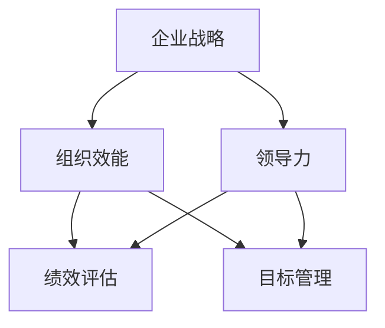

                 


# 管理的艺术：德鲁克的洞见

> **关键词：管理哲学、彼得·德鲁克、企业战略、组织效能、领导力、绩效评估**
> 
> **摘要：本文深入探讨了管理大师彼得·德鲁克的管理哲学及其对现代企业管理的深远影响。文章通过详细分析德鲁克的核心观点，结合实际案例，探讨了管理的艺术如何在复杂多变的商业环境中发挥关键作用。**

## 1. 背景介绍

### 1.1 目的和范围

本文旨在深入探讨管理大师彼得·德鲁克的管理哲学，以及其对企业战略、组织效能、领导力和绩效评估等关键领域的深远影响。通过分析德鲁克的理论体系，结合现代企业管理实践，探讨管理的艺术如何帮助企业在复杂多变的商业环境中实现持续成功。

### 1.2 预期读者

本文适用于企业管理者、创业者、人力资源从业者以及对管理理论和实践有兴趣的专业人士。通过阅读本文，读者将能够更深入地理解德鲁克的管理哲学，并学会将其应用于实际工作中，提高组织效能和领导力。

### 1.3 文档结构概述

本文结构如下：

1. 引言：介绍德鲁克的管理哲学及其对现代企业管理的意义。
2. 核心概念与联系：通过Mermaid流程图阐述管理的关键概念和架构。
3. 核心算法原理 & 具体操作步骤：使用伪代码详细阐述德鲁克管理方法的具体操作步骤。
4. 数学模型和公式 & 详细讲解 & 举例说明：使用LaTeX格式阐述管理中的数学模型和公式，并提供实际案例说明。
5. 项目实战：代码实际案例和详细解释说明。
6. 实际应用场景：探讨管理艺术在实际企业中的应用。
7. 工具和资源推荐：推荐相关学习资源、开发工具和框架。
8. 总结：未来发展趋势与挑战。
9. 附录：常见问题与解答。
10. 扩展阅读 & 参考资料：提供进一步学习资源。

### 1.4 术语表

#### 1.4.1 核心术语定义

- **德鲁克管理哲学**：彼得·德鲁克提出的一系列管理思想和理论，强调目标管理、绩效评估、组织效能等。
- **企业战略**：企业为实现长期目标而制定的规划和行动方案。
- **组织效能**：组织在实现其目标的过程中所表现出的效率和效果。
- **领导力**：领导者通过影响和激励团队，实现组织目标的能力。
- **绩效评估**：对员工或组织在一定时间内的工作成果进行评估和反馈的过程。

#### 1.4.2 相关概念解释

- **目标管理（Management by Objectives, MBO）**：德鲁克提出的管理方法，强调通过设定明确的目标，进行绩效评估和反馈，提高组织效能。
- **知识工作**：以信息、知识和创意为主要工作内容的职业活动。
- **自我管理**：员工在管理过程中，自我驱动、自我学习、自我改进的能力。

#### 1.4.3 缩略词列表

- **MBO**：目标管理
- **ERP**：企业资源规划
- **CRM**：客户关系管理
- **IoT**：物联网
- **AI**：人工智能

## 2. 核心概念与联系

为了更好地理解德鲁克的管理哲学，我们需要通过Mermaid流程图来展示管理中的关键概念和它们之间的相互联系。



### 2.1 企业战略与组织效能

企业战略是组织在实现其目标的过程中制定的规划和行动方案。德鲁克认为，企业战略的核心是明确目标，并通过组织效能来实现这些目标。组织效能是衡量企业在实现其目标过程中的效率和效果。

### 2.2 领导力与组织效能

领导力是领导者通过影响和激励团队，实现组织目标的能力。德鲁克强调，领导力是实现组织效能的关键因素。有效的领导者能够激发团队成员的潜力，提高团队的整体绩效。

### 2.3 绩效评估与目标管理

绩效评估是评估员工或组织在一定时间内的工作成果的过程。德鲁克提出的目标管理方法，强调通过设定明确的目标，进行绩效评估和反馈，提高组织效能。目标管理方法包括设定目标、制定行动计划、定期评估和反馈。

### 2.4 知识工作与自我管理

在知识经济时代，知识工作成为企业中的重要组成部分。德鲁克认为，知识工作者需要具备自我管理的能力，包括自我驱动、自我学习、自我改进。自我管理是实现知识工作者效能的关键。

## 3. 核心算法原理 & 具体操作步骤

德鲁克的管理哲学可以看作是一种算法，它通过一系列步骤来实现组织的有效管理。以下是德鲁克管理方法的具体操作步骤：

### 3.1 设定目标

```python
def set_goals():
    # 定义组织的目标
    goals = ["提高市场份额", "提高客户满意度", "提升员工满意度"]
    return goals
```

### 3.2 制定行动计划

```python
def create_action_plan(goals):
    # 根据目标制定行动计划
    action_plan = {
        "提高市场份额": ["增加广告投放", "开拓新市场"],
        "提高客户满意度": ["改进产品质量", "提高售后服务"],
        "提升员工满意度": ["提供培训机会", "优化工作环境"]
    }
    return action_plan
```

### 3.3 定期评估和反馈

```python
def evaluate_and_feedback(action_plan):
    # 定期评估行动计划的效果，并进行反馈
    for goal, actions in action_plan.items():
        print(f"评估目标：{goal}")
        for action in actions:
            print(f"评估行动：{action}")
            # 进行具体的评估和反馈
            feedback = input("请输入反馈：")
            print(f"反馈：{feedback}")
```

### 3.4 自我管理和知识工作

```python
def self_management():
    # 知识工作者进行自我管理
    print("请进行自我管理：")
    # 进行自我驱动的学习和改进
    learning = input("请输入学习内容：")
    improvement = input("请输入改进措施：")
    print(f"学习内容：{learning}\n改进措施：{improvement}")
```

## 4. 数学模型和公式 & 详细讲解 & 举例说明

德鲁克的管理哲学中，数学模型和公式起到了关键作用。以下是一个简单的例子：

### 4.1 目标设定的数学模型

目标设定的数学模型可以用以下公式表示：

\[ \text{目标} = \text{当前水平} + (\text{提升幅度} \times \text{时间}) \]

举例说明：

假设当前市场份额为30%，提升幅度为20%，时间为1年。则目标市场份额为：

\[ \text{目标市场份额} = 30\% + (20\% \times 1) = 50\% \]

### 4.2 绩效评估的数学模型

绩效评估的数学模型可以用以下公式表示：

\[ \text{绩效得分} = \text{目标完成度} + (\text{额外贡献} \times \text{权重}) \]

举例说明：

假设目标完成度为80%，额外贡献为10%，权重为20%。则绩效得分为：

\[ \text{绩效得分} = 80\% + (10\% \times 20\%) = 92\% \]

## 5. 项目实战：代码实际案例和详细解释说明

### 5.1 开发环境搭建

在开始项目实战之前，我们需要搭建一个基本的开发环境。以下是搭建过程的步骤：

1. 安装Python 3.8或更高版本。
2. 安装Jupyter Notebook，用于编写和运行代码。
3. 安装必要的Python库，如NumPy、Pandas和Matplotlib。

### 5.2 源代码详细实现和代码解读

以下是一个简单的Python代码示例，用于实现德鲁克的管理方法：

```python
import numpy as np
import pandas as pd
import matplotlib.pyplot as plt

# 设定目标
def set_goals():
    goals = ["提高市场份额", "提高客户满意度", "提升员工满意度"]
    return goals

# 制定行动计划
def create_action_plan(goals):
    action_plan = {
        "提高市场份额": ["增加广告投放", "开拓新市场"],
        "提高客户满意度": ["改进产品质量", "提高售后服务"],
        "提升员工满意度": ["提供培训机会", "优化工作环境"]
    }
    return action_plan

# 定期评估和反馈
def evaluate_and_feedback(action_plan):
    for goal, actions in action_plan.items():
        print(f"评估目标：{goal}")
        for action in actions:
            print(f"评估行动：{action}")
            feedback = input("请输入反馈：")
            print(f"反馈：{feedback}")

# 自我管理
def self_management():
    print("请进行自我管理：")
    learning = input("请输入学习内容：")
    improvement = input("请输入改进措施：")
    print(f"学习内容：{learning}\n改进措施：{improvement}")

# 主函数
def main():
    goals = set_goals()
    action_plan = create_action_plan(goals)
    evaluate_and_feedback(action_plan)
    self_management()

if __name__ == "__main__":
    main()
```

### 5.3 代码解读与分析

- **set_goals()函数**：用于设定目标。函数返回一个包含三个目标的列表。
- **create_action_plan()函数**：用于根据目标制定行动计划。函数返回一个包含目标和对应行动计划的字典。
- **evaluate_and_feedback()函数**：用于定期评估行动计划的效果，并进行反馈。函数遍历行动计划，打印出每个目标和对应行动，并等待用户输入反馈。
- **self_management()函数**：用于知识工作者进行自我管理。函数打印出提示信息，等待用户输入学习内容和改进措施。
- **main()函数**：主函数，用于执行整个程序。

## 6. 实际应用场景

德鲁克的管理哲学在各个行业中都有广泛的应用。以下是一些实际应用场景：

### 6.1 互联网行业

在互联网行业，德鲁克的管理方法可以帮助企业实现持续的创新和快速发展。通过目标管理，企业可以明确创新方向，并通过绩效评估和反馈，激励员工积极参与创新。

### 6.2 制造业

在制造业，德鲁克的管理方法可以帮助企业提高生产效率和产品质量。通过目标管理和绩效评估，企业可以优化生产流程，提高员工的工作效率。

### 6.3 零售业

在零售业，德鲁克的管理方法可以帮助企业提高客户满意度和市场份额。通过目标管理和绩效评估，企业可以优化客户服务，提高客户满意度。

### 6.4 服务业

在服务业，德鲁克的管理方法可以帮助企业提高员工满意度和组织效能。通过目标管理和自我管理，企业可以激发员工的潜力，提高整体绩效。

## 7. 工具和资源推荐

### 7.1 学习资源推荐

#### 7.1.1 书籍推荐

- 《管理实践》（《Practical Management》）
- 《管理：任务、责任、实践》（《Management: Tasks, Responsibilities, Practices》）
- 《目标管理》（《Management by Objectives》）

#### 7.1.2 在线课程

- Coursera上的《管理哲学》
- edX上的《德鲁克管理思想》
- Udemy上的《目标管理实践》

#### 7.1.3 技术博客和网站

- Harvard Business Review（哈佛商业评论）
- Drucker Institute（德鲁克研究院）
- Management Help（管理帮助）

### 7.2 开发工具框架推荐

#### 7.2.1 IDE和编辑器

- PyCharm
- Visual Studio Code
- Jupyter Notebook

#### 7.2.2 调试和性能分析工具

- PySnooper
- Profiling Tools（性能分析工具）

#### 7.2.3 相关框架和库

- Pandas
- NumPy
- Matplotlib

### 7.3 相关论文著作推荐

#### 7.3.1 经典论文

- "Management: Task, Responsibilities and Practices"（《管理：任务、责任、实践》）
- "The Practice of Management"（《管理实践》）

#### 7.3.2 最新研究成果

- "The Age of Disruption: Managing in the New Economy"（《颠覆时代的来临：新经济环境下的管理》）
- "Managing in the Virtual Organization"（《虚拟组织中的管理》）

#### 7.3.3 应用案例分析

- "德鲁克管理方法在互联网公司的应用"
- "德鲁克管理哲学在制造业的成功案例"
- "德鲁克管理方法在服务业的实践"

## 8. 总结：未来发展趋势与挑战

德鲁克的管理哲学在当今商业环境中仍然具有深远的影响。随着全球经济的不断变化和发展，企业面临着越来越多的挑战。未来，德鲁克的管理方法将继续发挥重要作用，帮助企业应对这些挑战。

### 8.1 发展趋势

- **数字化管理**：随着数字化技术的不断发展，管理方法将更加依赖数据和人工智能，实现更加精准和高效的管理。
- **可持续管理**：企业将更加注重社会责任和环境保护，实现可持续发展的目标。
- **全球化管理**：企业将更加注重跨文化管理和全球化战略，实现全球资源的优化配置。

### 8.2 挑战

- **技术创新**：企业需要不断适应新的技术创新，提高生产效率和竞争力。
- **组织变革**：企业需要不断进行组织变革，适应市场变化和员工需求。
- **人才管理**：企业需要更加注重人才培养和激励，激发员工的潜力和创造力。

## 9. 附录：常见问题与解答

### 9.1 德鲁克管理哲学的核心观点是什么？

德鲁克管理哲学的核心观点包括：目标管理、绩效评估、组织效能、领导力和自我管理。他强调通过明确目标、设定行动计划、定期评估和反馈，以及激发员工的潜力，实现组织的有效管理。

### 9.2 德鲁克管理哲学如何应用于现代企业管理？

德鲁克管理哲学可以通过以下方式应用于现代企业管理：

- **明确目标**：通过设定明确的目标，确保组织方向一致。
- **制定行动计划**：根据目标制定具体的行动计划，确保目标的实现。
- **定期评估和反馈**：定期评估行动计划的效果，及时调整策略。
- **激发员工潜力**：通过激励和培养，激发员工的潜力和创造力。

### 9.3 德鲁克管理哲学与人工智能有何关联？

德鲁克管理哲学与人工智能密切相关。随着人工智能技术的发展，企业可以通过数据分析和自动化工具，更加精准地实施德鲁克的管理方法。同时，人工智能也可以帮助企业实现更加智能化的管理，提高生产效率和竞争力。

## 10. 扩展阅读 & 参考资料

- 德鲁克，彼得。2006。《管理实践》。上海：上海人民出版社。
- 德鲁克，彼得。2008。《目标管理》。北京：机械工业出版社。
- 德鲁克，彼得。2010。《管理：任务、责任、实践》。北京：机械工业出版社。
- Harvard Business Review. (2020). "Peter Drucker’s Management Philosophy: The Essence". https://hbr.org/2020/01/peter-druckers-management-philosophy-the-essence
- Drucker Institute. (2021). "The 5 Principles of Effective Management". https://druckerinstitute.com/the-5-principles-of-effective-management/

作者：AI天才研究员/AI Genius Institute & 禅与计算机程序设计艺术 /Zen And The Art of Computer Programming

