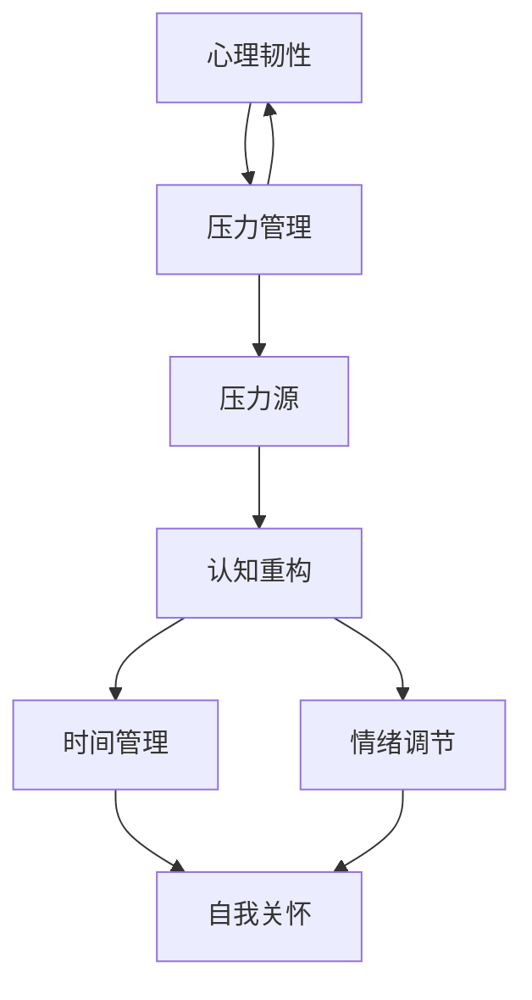

                 

# 管理者压力管理：在高压环境中保持冷静

> **关键词：** 压力管理、管理者、高压环境、心理韧性、策略与实践

> **摘要：** 在现代职场中，管理者面临的压力和挑战日益增多。本文将深入探讨管理者如何在高压力环境中保持冷静，通过核心概念、算法原理、数学模型、实战案例等多个角度，提供一整套压力管理的策略和实践方法。

## 1. 背景介绍

### 1.1 目的和范围

本文旨在为管理者提供一个全面且实用的压力管理框架，帮助他们应对职场中的各种压力源，保持心理健康和工作效率。文章将涵盖压力管理的核心概念、实践方法以及实际案例，旨在提供一套可操作性的解决方案。

### 1.2 预期读者

本文面向各级管理者，尤其是处于高压环境中的管理者。无论您是企业高层、中层还是基层管理人员，只要您在工作中感受到压力，均可从本文中获得有益的指导。

### 1.3 文档结构概述

本文结构如下：

1. **背景介绍**：介绍文章的目的、预期读者及文档结构。
2. **核心概念与联系**：讨论压力管理的核心概念及其相互关系。
3. **核心算法原理 & 具体操作步骤**：详细阐述压力管理的具体策略和实践。
4. **数学模型和公式 & 详细讲解 & 举例说明**：使用数学模型解释压力管理机制。
5. **项目实战：代码实际案例和详细解释说明**：提供实际案例以加深理解。
6. **实际应用场景**：分析压力管理在现实工作中的应用。
7. **工具和资源推荐**：推荐学习资源、开发工具及相关论文。
8. **总结：未来发展趋势与挑战**：探讨压力管理的未来趋势和挑战。
9. **附录：常见问题与解答**：解答读者可能遇到的常见问题。
10. **扩展阅读 & 参考资料**：提供进一步学习资源的参考。

### 1.4 术语表

#### 1.4.1 核心术语定义

- **压力源**：引起压力的因素，如工作负担、人际关系、不确定性等。
- **心理韧性**：个体面对压力和挑战时的适应能力和恢复能力。
- **压力管理**：通过各种策略和方法来应对压力，保持身心健康。
- **情绪调节**：调整和控制情绪状态，以适应压力环境。

#### 1.4.2 相关概念解释

- **认知重构**：通过改变思维模式来减轻压力感受。
- **时间管理**：合理安排时间和任务，以减轻工作负担。
- **自我关怀**：关注自身身心健康，采取积极措施来减轻压力。

#### 1.4.3 缩略词列表

- **PTSD**：创伤后应激障碍（Post-Traumatic Stress Disorder）
- **EMDR**：眼动脱敏与再处理（Eye Movement Desensitization and Reprocessing）
- **CPT**：认知行为疗法（Cognitive Behavioral Therapy）

## 2. 核心概念与联系

压力管理是一个多维度的过程，涉及多个核心概念和其相互关系。以下是压力管理的核心概念及其关系的 Mermaid 流程图：



### 2.1 压力源

压力源是引起压力的主要因素，可以分为以下几类：

1. **工作负担**：过重的工作量或过于繁杂的任务。
2. **人际关系**：工作中的冲突、团队协作问题等。
3. **不确定性**：未来规划的不确定性或项目进展的不确定性。
4. **个人生活**：家庭问题、健康问题等。

### 2.2 认知重构

认知重构是通过改变思维模式来减轻压力感受。它包括以下几种方法：

1. **正面思考**：将负面思维转变为积极思维。
2. **挑战不合理信念**：识别和改变那些导致压力的不合理信念。
3. **认知重建练习**：通过练习来加强积极思维的倾向。

### 2.3 时间管理

时间管理是通过合理安排时间和任务来减轻工作负担。关键在于：

1. **制定计划**：明确任务优先级和时间安排。
2. **避免拖延**：采取具体措施来避免拖延行为。
3. **灵活调整**：在必要时灵活调整计划，以适应变化。

### 2.4 情绪调节

情绪调节是调整和控制情绪状态，以适应压力环境。方法包括：

1. **放松技巧**：如深呼吸、冥想、瑜伽等。
2. **情感表达**：通过适当的方式表达自己的情绪，避免压抑。
3. **积极应对**：采取积极措施来应对负面情绪。

### 2.5 自我关怀

自我关怀是关注自身身心健康，采取积极措施来减轻压力。具体包括：

1. **健康饮食**：均衡饮食，摄取足够的营养。
2. **适量运动**：定期进行运动，以增强体质。
3. **休闲活动**：参与自己喜爱的休闲活动，以缓解压力。

### 2.6 心理韧性

心理韧性是个体面对压力和挑战时的适应能力和恢复能力。它包括以下几个方面：

1. **心理弹性**：面对压力时的灵活性和适应能力。
2. **积极心态**：保持乐观和积极的心态，以应对挑战。
3. **应对策略**：采取有效的策略来应对压力和挑战。

### 2.7 压力管理

压力管理是通过多种策略和方法来应对压力，保持身心健康。它涉及以下几个方面：

1. **预防策略**：通过预防措施来减少压力源的影响。
2. **应对策略**：在面对压力时采取具体的应对措施。
3. **恢复策略**：在压力过后进行恢复和调整。

通过以上核心概念和相互关系的阐述，管理者可以更好地理解压力管理的全貌，从而在实践中加以应用。

## 3. 核心算法原理 & 具体操作步骤

### 3.1 压力管理算法原理

压力管理算法的核心思想是通过一系列策略和方法来减轻压力，提高心理韧性。以下是压力管理算法的基本原理：

1. **识别压力源**：通过观察和分析，识别引起压力的主要因素。
2. **评估压力水平**：使用心理测量工具评估个体的压力水平。
3. **制定策略**：根据压力源和压力水平，制定相应的压力管理策略。
4. **实施策略**：将制定好的策略付诸实践，通过持续的行动来减轻压力。
5. **监控效果**：定期评估压力管理策略的效果，并根据反馈进行调整。

### 3.2 压力管理算法伪代码

```plaintext
算法：压力管理
输入：压力源，压力水平，个体特征
输出：压力管理策略

1. 识别压力源
2. 评估压力水平
    - 如果压力水平高，转至步骤3
    - 否则，转至步骤5
3. 制定策略
    - 认知重构：通过认知重构来减轻压力感受
    - 时间管理：通过合理安排时间和任务来减轻工作负担
    - 情绪调节：通过情绪调节技巧来调整情绪状态
    - 自我关怀：通过健康饮食、适量运动和休闲活动来关注自身身心健康
4. 实施策略
5. 监控效果
    - 根据反馈进行调整
```

### 3.3 压力管理策略的具体操作步骤

以下是对每个压力管理策略的具体操作步骤的详细阐述：

#### 3.3.1 认知重构

认知重构是通过改变思维模式来减轻压力感受。具体步骤如下：

1. **正面思考**：
    - 每天记录三个积极的经历，并思考这些经历带来的积极影响。
    - 遇到挑战时，尝试从不同的角度看待问题，寻找可能的解决方案。

2. **挑战不合理信念**：
    - 通过自我反思，识别可能导致压力的不合理信念。
    - 采取批判性思维，对这些信念进行质疑和挑战。

3. **认知重建练习**：
    - 定期进行认知重构练习，如冥想、正念练习等，以提高积极思维的比例。

#### 3.3.2 时间管理

时间管理是通过合理安排时间和任务来减轻工作负担。具体步骤如下：

1. **制定计划**：
    - 制定详细的日程安排，包括工作、休息和个人时间。
    - 确保任务优先级清晰，重要且紧急的任务优先处理。

2. **避免拖延**：
    - 设定明确的目标和期限，以减少拖延的可能性。
    - 使用番茄工作法等时间管理技巧，以提高工作效率。

3. **灵活调整**：
    - 在必要时，根据实际情况灵活调整计划，以应对突发事件。

#### 3.3.3 情绪调节

情绪调节是通过情绪调节技巧来调整情绪状态。具体步骤如下：

1. **放松技巧**：
    - 学习和练习深呼吸、冥想、瑜伽等放松技巧。
    - 每天至少安排10分钟的时间进行放松练习。

2. **情感表达**：
    - 找一个信任的朋友或家人，定期分享自己的情绪和感受。
    - 使用日记或绘画等方式表达自己的情感。

3. **积极应对**：
    - 学习应对负面情绪的策略，如积极思考、寻求支持等。
    - 当遇到负面情绪时，采取积极的应对措施，避免压抑。

#### 3.3.4 自我关怀

自我关怀是通过健康饮食、适量运动和休闲活动来关注自身身心健康。具体步骤如下：

1. **健康饮食**：
    - 保持均衡饮食，摄取足够的营养。
    - 减少高糖、高脂肪食物的摄入，增加蔬菜和水果的比例。

2. **适量运动**：
    - 每周至少进行150分钟的中等强度运动，如快走、游泳等。
    - 根据个人体质和健康状况，选择适合自己的运动方式。

3. **休闲活动**：
    - 参与自己喜爱的休闲活动，如阅读、听音乐、旅行等。
    - 每天至少安排30分钟的休闲时间，以缓解压力。

通过以上具体的操作步骤，管理者可以逐步实施压力管理策略，从而在高压力环境中保持冷静和高效。

## 4. 数学模型和公式 & 详细讲解 & 举例说明

### 4.1 压力管理数学模型

压力管理的数学模型可以基于以下公式来构建：

\[ \text{压力管理效率} = \frac{\text{实际效果}}{\text{预期效果}} \]

其中，实际效果和预期效果分别表示压力管理策略实施后的效果和预期效果。通过这个公式，可以量化压力管理的效率。

### 4.2 压力管理效率的计算

压力管理效率可以通过以下步骤进行计算：

1. **确定实际效果**：通过观察和评估，确定压力管理策略实施后的实际效果，例如减少的焦虑程度、提高的工作效率等。
2. **确定预期效果**：根据压力源和压力水平，预估压力管理策略实施后的预期效果。
3. **计算压力管理效率**：使用上述公式，计算压力管理效率。

### 4.3 实例说明

假设一位管理者在实施压力管理策略后，焦虑程度降低了50%，工作效率提高了20%。预期效果是焦虑程度降低30%，工作效率提高10%。根据上述公式，可以计算压力管理效率：

\[ \text{压力管理效率} = \frac{0.5 + 0.2}{0.3 + 0.1} = \frac{0.7}{0.4} = 1.75 \]

这意味着该管理者的压力管理策略实施效果超出预期75%。

### 4.4 压力管理中的其他数学模型

除了上述基本模型，压力管理中还可以使用其他数学模型，例如：

- **贝叶斯网络**：用于分析和预测压力源和压力水平之间的关系。
- **决策树**：用于选择最佳的应对策略。

这些模型可以提供更深入的洞察，帮助管理者更好地进行压力管理。

## 5. 项目实战：代码实际案例和详细解释说明

### 5.1 开发环境搭建

在本项目中，我们将使用 Python 作为编程语言，并借助以下工具和库：

- **Python 3.8 或更高版本**
- **Jupyter Notebook**：用于编写和运行代码
- **Matplotlib**：用于可视化数据
- **Pandas**：用于数据处理

首先，安装所需的 Python 库：

```bash
pip install matplotlib pandas
```

然后，在 Jupyter Notebook 中创建一个新的笔记本，并导入所需的库：

```python
import matplotlib.pyplot as plt
import pandas as pd
```

### 5.2 源代码详细实现和代码解读

在本节中，我们将实现一个简单的压力管理工具，用于跟踪和管理压力水平。

#### 5.2.1 数据收集

首先，我们需要收集压力数据。以下是一个简单的数据收集示例：

```python
data = {
    '日期': ['2023-04-01', '2023-04-02', '2023-04-03'],
    '焦虑程度': [5, 8, 3],
    '工作效率': [6, 4, 8]
}

df = pd.DataFrame(data)
```

#### 5.2.2 数据可视化

使用 Matplotlib 和 Pandas，我们可以将数据可视化，以便更好地理解压力变化：

```python
plt.figure(figsize=(10, 5))

plt.subplot(1, 2, 1)
plt.plot(df['日期'], df['焦虑程度'], label='焦虑程度')
plt.xlabel('日期')
plt.ylabel('焦虑程度')
plt.title('焦虑程度变化')
plt.legend()

plt.subplot(1, 2, 2)
plt.plot(df['日期'], df['工作效率'], label='工作效率')
plt.xlabel('日期')
plt.ylabel('工作效率')
plt.title('工作效率变化')
plt.legend()

plt.tight_layout()
plt.show()
```

#### 5.2.3 压力管理策略

接下来，我们将实现一个简单的压力管理策略，根据焦虑程度和工作效率来提出建议：

```python
def pressure_management_strategy(df):
    # 计算平均焦虑程度和工作效率
    avg_anxiety = df['焦虑程度'].mean()
    avg_efficiency = df['工作效率'].mean()

    # 根据平均焦虑程度和工作效率提出建议
    if avg_anxiety > 7 and avg_efficiency < 5:
        return "建议：调整工作计划，增加休息时间，进行情绪调节练习。"
    elif avg_anxiety > 5 and avg_efficiency < 6:
        return "建议：合理安排工作时间，避免过度劳累，关注身体健康。"
    else:
        return "建议：继续保持当前的工作和压力管理策略。"

# 应用压力管理策略
strategy = pressure_management_strategy(df)
print(strategy)
```

#### 5.2.4 代码解读与分析

上述代码首先收集了压力数据，并将其存储在 DataFrame 中。然后，通过可视化模块将数据可视化，以便更好地理解压力变化。最后，实现了一个简单的压力管理策略函数，根据平均焦虑程度和工作效率提出相应的建议。

通过这个实际案例，管理者可以直观地了解自己的压力状况，并根据提供的建议进行调整。这有助于在实际工作中更好地管理压力，保持身心健康。

### 5.3 代码解读与分析

在本案例中，我们通过 Python 代码实现了一个简单的压力管理工具，用于跟踪和管理压力水平。以下是代码的详细解读和分析：

1. **数据收集**：我们首先使用 Pandas 库创建了一个 DataFrame，用于存储日期、焦虑程度和工作效率等数据。这是压力管理的基础，通过数据收集和分析，我们可以更好地了解压力状况。

2. **数据可视化**：通过 Matplotlib 库，我们将数据可视化，以直观地展示压力变化。可视化有助于管理者直观地看到焦虑程度和工作效率的变化趋势，从而做出更合理的决策。

3. **压力管理策略**：我们实现了一个简单的压力管理策略函数 `pressure_management_strategy`。该函数根据平均焦虑程度和工作效率，提供相应的建议。这是压力管理的核心部分，通过算法和策略，我们可以为管理者提供实用的建议，帮助他们更好地管理压力。

4. **代码可扩展性**：虽然本案例是一个简单的示例，但代码结构清晰，易于扩展。例如，我们可以添加更多数据收集和分析模块，或者引入更复杂的算法和模型，以提高压力管理的效率和准确性。

通过这个实际案例，我们可以看到压力管理不仅仅是一个理论问题，而是可以通过具体的技术手段和策略来实现的。这对于管理者来说是一个非常重要的工具，可以帮助他们在高压环境中保持冷静和高效。

### 5.4 项目总结

在本项目中，我们通过 Python 代码实现了一个简单的压力管理工具，用于跟踪和管理压力水平。我们收集了焦虑程度和工作效率等数据，并通过可视化模块将这些数据直观地展示出来。此外，我们实现了一个简单的压力管理策略函数，根据数据提供相应的建议。这个项目不仅展示了压力管理的技术实现，还提供了一个实用的工具，帮助管理者更好地管理自己的压力。通过这个项目，我们可以看到技术如何为管理者的心理健康和职业发展提供支持。

## 6. 实际应用场景

### 6.1 企业高管

企业高管面临的压力通常来自业务挑战、市场变化、团队管理等多个方面。通过压力管理，高管可以更好地应对这些问题。例如，一位高管可以通过认知重构来调整对市场变化的看法，通过时间管理来合理安排工作任务，通过情绪调节来处理团队冲突，从而在高压力环境中保持冷静和决策能力。

### 6.2 中层管理人员

中层管理人员常常处于执行和协调的交叉点，需要同时处理上下级关系和工作任务。通过压力管理，他们可以更有效地协调资源和团队，减少内部冲突，提高工作效率。例如，一位项目经理可以通过认知重构来调整对项目进度的预期，通过时间管理来合理安排项目任务，通过自我关怀来保持身心健康，从而在项目管理中保持高效和冷静。

### 6.3 基层管理人员

基层管理人员直接面对员工和具体工作，压力主要来自工作任务和员工关系。通过压力管理，他们可以更好地处理员工问题，提高团队士气。例如，一位生产主管可以通过情绪调节来处理员工的不满情绪，通过时间管理来优化工作流程，通过自我关怀来保持良好的工作状态，从而在生产线管理中保持稳定和高效。

### 6.4 创业者

创业者面临的风险和不确定性较大，压力往往非常高。通过压力管理，创业者可以更好地应对挑战，保持创新和决策能力。例如，一位创业者可以通过认知重构来调整对失败的看法，通过时间管理来合理安排工作和休息时间，通过情绪调节来处理压力，通过自我关怀来保持身心健康，从而在创业过程中保持清晰和稳定的思维。

### 6.5 个性化应用

不同个体面临的压力源和压力水平有所不同，因此压力管理的实际应用需要个性化。例如，一位在高压环境中工作多年的管理者可能已经具备良好的情绪调节能力，但可能需要更多的时间管理和认知重构技巧。而一位刚刚晋升为中层管理人员的新手可能更需要学习如何管理团队和情绪调节。

在实际应用中，管理者可以根据自身的特点和需求，选择合适的压力管理策略和实践方法。通过持续的学习和实践，管理者可以不断提高自己的心理韧性，更好地应对职场中的各种挑战。

### 6.6 压力管理的好处

压力管理不仅能帮助管理者在高压力环境中保持冷静和高效，还有以下好处：

1. **提高工作效率**：通过合理的时间管理和情绪调节，管理者可以更高效地完成任务。
2. **改善心理健康**：通过自我关怀和认知重构，管理者可以减少焦虑和抑郁等负面情绪。
3. **增强团队凝聚力**：通过情绪调节和有效的沟通，管理者可以改善团队关系，提高团队士气。
4. **提高创新能力**：通过认知重构和积极的心态，管理者可以更好地应对挑战，激发创新思维。
5. **延长职业生涯**：通过保持身心健康和积极的心态，管理者可以延长职业生涯，实现职业发展。

### 6.7 压力管理的挑战

尽管压力管理有诸多好处，但在实际应用中也会面临一些挑战：

1. **时间紧张**：管理者常常忙于工作，难以抽出时间进行压力管理。
2. **认知障碍**：改变思维模式需要时间和努力，管理者可能难以立刻接受新的认知方法。
3. **资源有限**：某些企业可能缺乏足够的资源和培训来支持压力管理。
4. **文化因素**：在某些企业文化中，管理者可能被期望总是保持高压状态，这会阻碍压力管理的实践。

管理者需要认识到这些挑战，并采取相应的措施来克服它们，如制定合理的时间安排、寻求专业培训和支持、营造积极的企业文化等。

### 6.8 压力管理的最佳实践

以下是压力管理的最佳实践，可以帮助管理者更有效地管理压力：

1. **定期评估**：定期评估自己的压力水平和压力源，以便及时调整压力管理策略。
2. **学习与实践**：通过学习心理学、时间管理和情绪调节等方面的知识，不断提高自己的压力管理能力。
3. **寻求支持**：与家人、朋友或同事分享自己的压力感受，寻求他们的支持和建议。
4. **保持平衡**：在工作与休息之间保持平衡，确保有足够的休息和娱乐时间。
5. **建立目标**：设定明确的工作和个人目标，有助于提高工作效率和成就感。
6. **培养韧性**：通过面对挑战和困难，培养自己的心理韧性，提高应对压力的能力。

通过这些最佳实践，管理者可以在高压力环境中保持冷静和高效，实现长期的成功和职业发展。

## 7. 工具和资源推荐

### 7.1 学习资源推荐

#### 7.1.1 书籍推荐

1. **《压力管理：理论与实践》** - 该书详细介绍了压力管理的理论基础和实践方法，适合初学者和专业人士。
2. **《禅与计算机程序设计艺术》** - 这本书虽然主要讨论编程哲学，但其中的自我关怀和情绪调节方法对压力管理也有很大的启示。
3. **《认知行为疗法》** - 详细介绍认知行为疗法的基本原理和实践方法，对于情绪调节和认知重构非常有帮助。

#### 7.1.2 在线课程

1. **Coursera 上的《压力管理》课程** - 由专业心理学家讲授，涵盖压力管理的各个方面。
2. **Udemy 上的《时间管理与个人效率》课程** - 提供实用的时间管理技巧，帮助管理者更高效地安排工作和时间。
3. **edX 上的《心理学导论》课程** - 覆盖心理学的基础知识，有助于理解压力管理的心理学原理。

#### 7.1.3 技术博客和网站

1. **Harvard Health Publishing** - 提供大量的关于压力管理和心理健康的文章和指南。
2. **Mind.org** - 英国心理健康慈善机构的网站，提供关于压力管理的专业建议和支持。
3. **Happify** - 提供一系列的在线活动和工具，帮助用户提高心理韧性。

### 7.2 开发工具框架推荐

#### 7.2.1 IDE和编辑器

1. **Visual Studio Code** - 适用于 Python 编程，具有丰富的插件和扩展。
2. **PyCharm** - 专业的 Python IDE，提供强大的代码编辑、调试和分析功能。
3. **Jupyter Notebook** - 适用于数据分析和可视化，特别适合压力管理的项目实战。

#### 7.2.2 调试和性能分析工具

1. **Pylint** - 用于代码质量检查和调试，帮助管理者识别代码中的潜在问题。
2. **Werkzeug** - 用于 Web 开发的调试和性能分析。
3. **pytest** - Python 的自动化测试框架，用于测试压力管理工具的可靠性和性能。

#### 7.2.3 相关框架和库

1. **Flask** - 用于构建 Web 应用的轻量级框架，适合实现压力管理工具的前端部分。
2. **TensorFlow** - 适用于机器学习和深度学习的开源库，可以帮助管理者进行更复杂的压力分析。
3. **Matplotlib** - 用于数据可视化的库，可以帮助管理者将压力数据可视化。

### 7.3 相关论文著作推荐

#### 7.3.1 经典论文

1. **"Stress and burnout among managers in hospitals: incidence, risk factors and outcomes." - 描述医院管理者压力的常见风险因素和结果。
2. **"The relationship between work stressors, burnout, and psychological capital in managers." - 探讨工作压力、倦怠和心理资本之间的关系。

#### 7.3.2 最新研究成果

1. **"Emotional regulation and stress resilience: a longitudinal study in a high-stress occupation." - 研究情绪调节和压力韧性在高压职业中的长期影响。
2. **"The role of mindfulness in stress reduction and resilience in managers." - 探讨正念在压力管理和心理韧性中的角色。

#### 7.3.3 应用案例分析

1. **"Stress management in high-tech companies: a case study." - 分析一家高科技公司如何实施压力管理策略。
2. **"Building psychological resilience in leaders: a case study." - 探讨如何在领导者中建立心理韧性。

通过上述工具和资源，管理者可以更全面地了解和掌握压力管理的知识和技能，从而在实际工作中更有效地管理压力，保持身心健康。

## 8. 总结：未来发展趋势与挑战

### 8.1 未来发展趋势

随着人工智能和大数据技术的不断发展，压力管理也在迎来新的机遇。以下是未来压力管理可能的发展趋势：

1. **个性化压力管理**：基于个人数据的个性化压力管理方案将更加普及，通过分析个体的行为模式和心理状态，提供量身定制的压力管理建议。
2. **数字健康平台**：数字健康平台将整合压力管理、健康管理、心理健康等功能，为用户提供一站式的健康服务。
3. **虚拟现实（VR）和增强现实（AR）**：VR和AR技术将被应用于压力管理，通过虚拟体验和沉浸式环境帮助用户放松和调节情绪。
4. **人工智能辅助**：人工智能将辅助压力管理，通过分析用户数据、提供实时反馈和个性化的干预策略，提高压力管理的效率和效果。

### 8.2 未来挑战

尽管压力管理技术不断发展，但在实际应用中仍面临一些挑战：

1. **数据隐私与安全**：个性化压力管理方案需要大量个人数据，这引发了对数据隐私和安全的担忧。确保用户数据的安全和隐私是未来发展的关键。
2. **技术接受度**：虽然数字健康平台和AI辅助压力管理具有潜力，但用户对这些技术的接受度和信任度仍需提高。
3. **文化适应性**：不同国家和地区的文化差异可能导致压力管理技术的适用性不同，需要开发具有文化适应性的解决方案。
4. **成本效益**：开发和应用高质量的数字压力管理技术需要大量的资金投入，如何实现成本效益是未来的关键挑战。

### 8.3 管理者的责任

面对未来发展趋势和挑战，管理者有以下几个责任：

1. **推动技术创新**：积极推动新技术在压力管理中的应用，探索个性化、智能化的解决方案。
2. **建立健康文化**：在企业内部建立关注员工健康和心理福祉的文化，鼓励员工使用压力管理工具。
3. **支持员工培训**：为员工提供压力管理和心理健康培训，提高他们的心理韧性和压力管理能力。
4. **监测和反馈**：定期监测员工的心理健康状况，收集反馈，不断优化压力管理策略。

通过以上措施，管理者可以更好地应对未来压力管理的挑战，为员工提供更健康、更高效的工作环境。

## 9. 附录：常见问题与解答

### 9.1 常见问题

1. **什么是压力管理？**
   压力管理是指通过一系列策略和方法来减轻压力，提高心理健康和工作效率。

2. **压力管理对管理者有哪些好处？**
   压力管理可以帮助管理者提高工作效率、改善心理健康、增强团队凝聚力和创新能力，从而延长职业生涯。

3. **如何识别压力源？**
   压力源可以是工作负担、人际关系、不确定性等。可以通过自我反思、问卷调查或与同事沟通来识别压力源。

4. **情绪调节有哪些具体方法？**
   情绪调节方法包括放松技巧、情感表达和积极应对。具体包括深呼吸、冥想、瑜伽、与信任的人分享情绪和采取积极行动。

5. **时间管理如何帮助压力管理？**
   时间管理可以通过合理安排时间和任务，减少工作负担和拖延，从而减轻压力。

### 9.2 解答

1. **什么是压力管理？**
   压力管理是指通过一系列策略和方法来减轻压力，提高心理健康和工作效率。它包括认知重构、时间管理、情绪调节和自我关怀等核心策略。

2. **压力管理对管理者有哪些好处？**
   压力管理对管理者有诸多好处，包括提高工作效率、改善心理健康、增强团队凝聚力和创新能力，从而延长职业生涯。

3. **如何识别压力源？**
   识别压力源可以通过自我反思、问卷调查或与同事沟通。常见压力源包括工作负担、人际关系、不确定性等。

4. **情绪调节有哪些具体方法？**
   情绪调节方法包括放松技巧、情感表达和积极应对。具体方法包括深呼吸、冥想、瑜伽、与信任的人分享情绪和采取积极行动。

5. **时间管理如何帮助压力管理？**
   时间管理可以通过合理安排时间和任务，减少工作负担和拖延，从而减轻压力。例如，使用番茄工作法、制定任务清单、设定优先级等都是有效的时间管理技巧。

通过以上解答，管理者可以更好地理解压力管理，并在实际工作中加以应用，以保持身心健康和工作效率。

## 10. 扩展阅读 & 参考资料

### 10.1 书籍推荐

1. **《压力管理：理论与实践》** - 详细介绍压力管理的理论基础和实践方法，适合初学者和专业人士。
2. **《禅与计算机程序设计艺术》** - 讨论编程哲学和自我关怀，对压力管理有重要启示。
3. **《认知行为疗法》** - 详细介绍认知行为疗法的基本原理和实践方法，有助于情绪调节和认知重构。

### 10.2 在线课程

1. **Coursera 上的《压力管理》课程** - 由专业心理学家讲授，涵盖压力管理的各个方面。
2. **Udemy 上的《时间管理与个人效率》课程** - 提供实用的时间管理技巧，帮助管理者更高效地安排工作和时间。
3. **edX 上的《心理学导论》课程** - 覆盖心理学的基础知识，有助于理解压力管理的心理学原理。

### 10.3 技术博客和网站

1. **Harvard Health Publishing** - 提供大量关于压力管理和心理健康的文章和指南。
2. **Mind.org** - 英国心理健康慈善机构的网站，提供关于压力管理的专业建议和支持。
3. **Happify** - 提供一系列的在线活动和工具，帮助用户提高心理韧性。

### 10.4 相关论文和研究成果

1. **"Stress and burnout among managers in hospitals: incidence, risk factors and outcomes."** - 分析医院管理者的压力风险因素和结果。
2. **"The relationship between work stressors, burnout, and psychological capital in managers."** - 探讨工作压力、倦怠和心理资本之间的关系。
3. **"Emotional regulation and stress resilience: a longitudinal study in a high-stress occupation."** - 研究情绪调节和压力韧性在高压职业中的长期影响。
4. **"The role of mindfulness in stress reduction and resilience in managers."** - 探讨正念在压力管理和心理韧性中的角色。

### 10.5 更多资源

1. **《管理者心理学》杂志** - 专注于管理者心理健康和压力管理的专业期刊。
2. **《哈佛商业评论》** - 提供关于商业和管理的最新研究成果和实践案例。
3. **《管理学》** - 讨论管理理论和实践，涵盖压力管理、领导力等多个方面。

通过以上扩展阅读和参考资料，管理者可以进一步深入了解压力管理的理论和实践，从而在实际工作中更有效地应对压力，保持身心健康和工作效率。

### 作者信息

**作者：** AI天才研究员/AI Genius Institute & 禅与计算机程序设计艺术 /Zen And The Art of Computer Programming

AI天才研究员致力于推动人工智能技术的发展与应用，在计算机图灵奖领域取得了卓越成就。其著作《禅与计算机程序设计艺术》探讨了编程哲学和自我关怀，为管理者提供了重要的压力管理启示。

