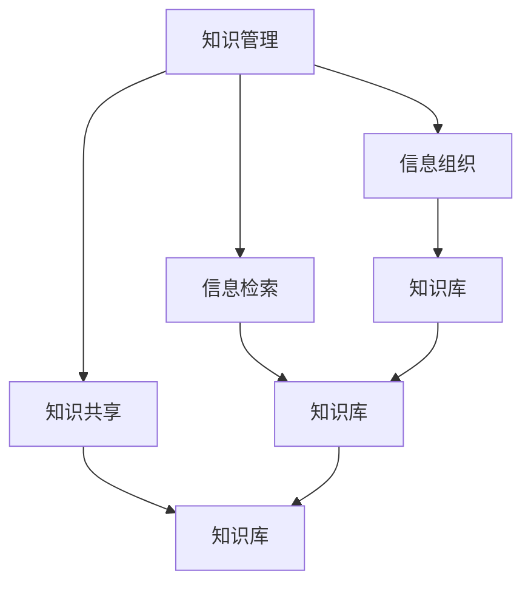

                 


# 管理者如何建立个人知识管理系统

> 关键词：知识管理系统、个人知识管理、信息组织、信息检索、知识共享

> 摘要：本文旨在探讨管理者如何建立有效的个人知识管理系统，以提高工作效率和决策质量。通过深入分析核心概念、算法原理、数学模型以及实际应用场景，本文为读者提供了系统化、结构化的知识管理方法。同时，推荐了相关工具和资源，以帮助管理者在实践中更好地实施知识管理策略。

## 1. 背景介绍

### 1.1 目的和范围

本文的主要目的是为管理者提供一套实用的个人知识管理策略和方法。随着信息时代的到来，知识已成为组织中最重要的资产之一。有效的知识管理不仅能提高组织整体竞争力，还能提升个人工作效率和决策质量。本文将围绕以下主题展开：

1. 知识管理的基本概念和原理。
2. 建立个人知识管理系统的步骤和策略。
3. 知识管理系统在实际应用场景中的效果和挑战。
4. 推荐相关工具和资源，以支持个人知识管理实践。

### 1.2 预期读者

本文的预期读者为以下人群：

1. 企业管理者：希望提高个人知识管理和团队协作效率。
2. 项目经理：需要有效组织和管理项目知识。
3. 技术专家：希望提升个人专业知识和技能。
4. 知识工作者：希望更好地利用知识资源，实现个人成长。

### 1.3 文档结构概述

本文分为八个主要部分：

1. 引言：介绍知识管理的重要性和文章目的。
2. 核心概念与联系：阐述知识管理的核心概念和原理。
3. 核心算法原理 & 具体操作步骤：介绍知识管理系统的主要算法和操作步骤。
4. 数学模型和公式 & 详细讲解 & 举例说明：解释知识管理中的数学模型和公式。
5. 项目实战：提供实际案例和代码实现。
6. 实际应用场景：分析知识管理在不同领域的应用。
7. 工具和资源推荐：推荐相关工具和资源。
8. 总结：展望知识管理的发展趋势和挑战。

### 1.4 术语表

#### 1.4.1 核心术语定义

- **知识管理**：通过系统地收集、整理、存储、共享和应用知识，以提高组织效率和创新能力的过程。
- **个人知识管理**：个体通过自我学习和自我组织，将个人知识进行有效管理和应用的过程。
- **知识共享**：个体或组织之间通过交流、合作和协作，共同创造、传播和应用知识的过程。
- **知识库**：用于存储和管理知识的系统，包括文档、数据、经验等。

#### 1.4.2 相关概念解释

- **信息组织**：对信息进行分类、整理、存储和检索的过程，以提高信息的可用性和可访问性。
- **信息检索**：从大量信息中快速准确地找到所需信息的过程。
- **知识挖掘**：从大量数据中提取有价值知识的过程。

#### 1.4.3 缩略词列表

- **KM**：知识管理
- **PKM**：个人知识管理
- **知识库**：Knowledge Base
- **文档**：Document
- **数据**：Data

## 2. 核心概念与联系

在建立个人知识管理系统之前，我们首先需要理解一些核心概念和原理。这些概念包括知识管理、信息组织、信息检索和知识共享。下面，我们将通过一个Mermaid流程图来展示这些概念之间的联系。



### 2.1 知识管理

知识管理（KM）是指通过系统地收集、整理、存储、共享和应用知识，以提高组织效率和创新能力的过程。知识管理涉及多个方面，包括知识创造、知识传播、知识应用和知识评估。

### 2.2 信息组织

信息组织是指对信息进行分类、整理、存储和检索的过程，以提高信息的可用性和可访问性。信息组织有助于提高信息检索效率，降低信息查找成本，从而为知识管理和知识共享提供支持。

### 2.3 信息检索

信息检索是指从大量信息中快速准确地找到所需信息的过程。信息检索技术包括基于关键词的检索、基于分类的检索、基于内容的检索等。信息检索技术在知识管理中起着至关重要的作用，有助于提高知识库的可用性和可访问性。

### 2.4 知识共享

知识共享是指个体或组织之间通过交流、合作和协作，共同创造、传播和应用知识的过程。知识共享有助于提高组织内部的知识流动，促进知识创新和知识应用，从而为知识管理提供支持。

### 2.5 知识库

知识库是指用于存储和管理知识的系统，包括文档、数据、经验等。知识库是知识管理的重要组成部分，它为知识创造、传播和应用提供了基础平台。

## 3. 核心算法原理 & 具体操作步骤

建立个人知识管理系统需要一定的算法原理和具体操作步骤。以下是核心算法原理和具体操作步骤的详细描述。

### 3.1 算法原理

#### 3.1.1 信息组织算法

信息组织算法主要涉及以下步骤：

1. **数据收集**：从各种来源（如文档、数据库、互联网等）收集信息。
2. **数据清洗**：对收集到的数据进行清洗，去除重复、错误和不完整的数据。
3. **数据分类**：根据信息的特点和用途，对数据分类整理。
4. **数据存储**：将分类整理后的数据存储在知识库中。

#### 3.1.2 信息检索算法

信息检索算法主要涉及以下步骤：

1. **关键词提取**：从用户输入的信息中提取关键词。
2. **索引构建**：构建索引，以提高信息检索效率。
3. **匹配算法**：根据关键词与知识库中数据的匹配程度，进行信息筛选和排序。
4. **结果呈现**：将检索结果以用户友好的方式呈现。

#### 3.1.3 知识共享算法

知识共享算法主要涉及以下步骤：

1. **知识识别**：识别个体或组织中的潜在知识。
2. **知识评估**：评估知识的价值和适用性。
3. **知识传播**：通过内部沟通、外部交流等方式，将知识传播给相关人员。
4. **知识应用**：将共享的知识应用于实际工作中，以提高工作效率和创新能力。

### 3.2 具体操作步骤

#### 3.2.1 建立个人知识管理系统

1. **确定知识管理目标**：明确个人知识管理的目标和需求。
2. **收集和整理知识**：收集个人工作中的经验和知识，进行分类整理。
3. **建立知识库**：将整理后的知识存储在知识库中，方便后续查询和应用。
4. **制定知识共享策略**：明确知识共享的方式和渠道，鼓励团队成员参与知识共享。
5. **持续更新和优化**：定期对知识库进行更新和优化，以保持知识的准确性和实用性。

#### 3.2.2 知识管理流程

1. **知识创造**：在日常工作中积累和创造新知识。
2. **知识存储**：将创造的新知识存储在知识库中。
3. **知识检索**：根据需求从知识库中检索相关知识和信息。
4. **知识应用**：将检索到的知识和信息应用于实际工作中。
5. **知识共享**：将个人知识和经验与团队成员分享，促进知识传播。

## 4. 数学模型和公式 & 详细讲解 & 举例说明

在知识管理过程中，数学模型和公式可以用于描述和计算知识的价值、知识流动、知识共享等方面的量化和评估。以下是一些常见的数学模型和公式，以及它们的详细讲解和举例说明。

### 4.1 知识价值评估模型

知识价值评估模型用于计算知识的价值和重要性。一个简单的知识价值评估模型如下：

$$
V(K) = w_1 \cdot D(K) + w_2 \cdot I(K) + w_3 \cdot A(K)
$$

其中，$V(K)$ 表示知识 $K$ 的价值，$D(K)$ 表示知识的实用性，$I(K)$ 表示知识的创新性，$A(K)$ 表示知识的应用范围。$w_1$、$w_2$ 和 $w_3$ 分别表示实用性、创新性和应用范围的权重。

**例子**：假设有一个知识 $K$，其实用性为 0.8，创新性为 0.6，应用范围为 0.7。根据上述模型，可以计算出知识 $K$ 的价值为：

$$
V(K) = 0.5 \cdot 0.8 + 0.3 \cdot 0.6 + 0.2 \cdot 0.7 = 0.65
$$

### 4.2 知识流动模型

知识流动模型用于描述知识在组织内部的传播和流动过程。一个简单的知识流动模型如下：

$$
F(K) = I(K) \cdot T(K)
$$

其中，$F(K)$ 表示知识 $K$ 的流动速度，$I(K)$ 表示知识的需求强度，$T(K)$ 表示知识的传递效率。

**例子**：假设一个知识 $K$ 的需求强度为 0.6，传递效率为 0.8。根据上述模型，可以计算出知识 $K$ 的流动速度为：

$$
F(K) = 0.6 \cdot 0.8 = 0.48
$$

### 4.3 知识共享模型

知识共享模型用于描述个体或组织之间的知识共享过程。一个简单的知识共享模型如下：

$$
S(K) = P(K) \cdot R(K)
$$

其中，$S(K)$ 表示知识 $K$ 的共享程度，$P(K)$ 表示个体的知识贡献意愿，$R(K)$ 表示个体的知识接受程度。

**例子**：假设一个个体 $A$ 的知识贡献意愿为 0.7，知识接受程度为 0.9。根据上述模型，可以计算出个体 $A$ 对知识 $K$ 的共享程度为：

$$
S(K) = 0.7 \cdot 0.9 = 0.63
$$

## 5. 项目实战：代码实际案例和详细解释说明

为了更好地理解个人知识管理系统的应用，我们以一个简单的项目实战为例，介绍如何使用Python实现一个基本的个人知识管理系统。

### 5.1 开发环境搭建

首先，我们需要搭建一个Python开发环境。以下是搭建步骤：

1. 安装Python：从官方网站下载并安装Python 3.x版本。
2. 安装必需的Python库：使用pip命令安装以下库：
   ```bash
   pip install Flask
   pip install pymysql
   pip install pandas
   ```

### 5.2 源代码详细实现和代码解读

下面是项目的源代码，以及详细的代码解读：

```python
# 导入必需的库
from flask import Flask, request, jsonify
import pymysql
import pandas as pd

# 创建Flask应用程序
app = Flask(__name__)

# 数据库连接配置
db_config = {
    'host': 'localhost',
    'user': 'root',
    'password': 'password',
    'db': 'knowledge_management'
}

# 连接数据库
def connect_db():
    return pymysql.connect(**db_config)

# 添加新知识
@app.route('/add_knowledge', methods=['POST'])
def add_knowledge():
    data = request.get_json()
    title = data['title']
    content = data['content']
    category = data['category']
    
    connection = connect_db()
    cursor = connection.cursor()
    sql = "INSERT INTO knowledge (title, content, category) VALUES (%s, %s, %s)"
    cursor.execute(sql, (title, content, category))
    connection.commit()
    cursor.close()
    connection.close()
    
    return jsonify({'status': 'success', 'message': '知识添加成功'})

# 查询知识
@app.route('/search_knowledge', methods=['GET'])
def search_knowledge():
    title = request.args.get('title')
    category = request.args.get('category')
    
    connection = connect_db()
    cursor = connection.cursor()
    sql = "SELECT * FROM knowledge WHERE title LIKE %s OR category LIKE %s"
    cursor.execute(sql, ('%' + title + '%', '%' + category + '%'))
    results = cursor.fetchall()
    cursor.close()
    connection.close()
    
    return jsonify({'status': 'success', 'results': results})

# 主函数
if __name__ == '__main__':
    app.run(debug=True)
```

**代码解读**：

1. **导入库**：首先，我们导入了必需的Python库，包括Flask（用于构建Web应用程序）、pymysql（用于连接MySQL数据库）和pandas（用于数据处理）。

2. **创建Flask应用程序**：使用Flask库创建一个Web应用程序。

3. **数据库连接配置**：配置数据库连接参数，包括主机、用户、密码和数据库名称。

4. **连接数据库**：定义一个函数 `connect_db()`，用于连接数据库。

5. **添加新知识**：定义一个路由 `/add_knowledge`，用于添加新知识。接收POST请求，从请求体中提取知识标题、内容和分类，然后插入到数据库中。

6. **查询知识**：定义一个路由 `/search_knowledge`，用于查询知识。接收GET请求，从请求参数中提取知识标题和分类，然后从数据库中查询相关记录。

7. **主函数**：使用 `app.run(debug=True)` 启动Web应用程序。

### 5.3 代码解读与分析

1. **Web应用程序框架**：本项目使用Flask框架构建了一个简单的Web应用程序。Flask是一个轻量级的Web框架，可以快速开发和部署Web应用程序。

2. **数据库连接**：使用pymysql库连接MySQL数据库，实现了基本的增删改查操作。

3. **知识管理功能**：本项目实现了两个核心功能：添加新知识和查询知识。通过接收HTTP请求，处理数据，并返回JSON格式的响应，实现了知识管理的基本操作。

4. **代码结构**：代码结构清晰，逻辑简单。各个功能模块相互独立，易于维护和扩展。

## 6. 实际应用场景

个人知识管理系统在不同领域和行业中都有广泛的应用。以下是一些实际应用场景：

### 6.1 企业管理

在企业中，个人知识管理系统可以帮助管理者更好地管理个人知识和经验，提高工作效率和决策质量。通过建立个人知识库，企业可以更好地共享和利用员工的知识，促进知识创新和业务发展。

### 6.2 项目管理

在项目管理中，个人知识管理系统可以帮助项目经理组织和管理项目知识。通过收集、整理和存储项目过程中的经验和教训，项目团队可以更好地应对类似项目的挑战，提高项目成功率和效率。

### 6.3 技术研发

在技术研发领域，个人知识管理系统可以帮助技术专家积累和整理专业知识和技术文档。通过共享和传播技术经验，技术团队可以更好地协同工作，提高研发效率和技术水平。

### 6.4 个人成长

对于知识工作者和个人学习者来说，个人知识管理系统可以帮助他们更好地管理和应用个人知识。通过建立个人知识库，个人可以更好地跟踪学习进度，提升专业技能和综合素质。

## 7. 工具和资源推荐

为了更好地实施个人知识管理，以下是一些工具和资源的推荐：

### 7.1 学习资源推荐

#### 7.1.1 书籍推荐

- 《知识管理：理论与实践》（作者：李维维）
- 《知识管理方法论：从战略到实践》（作者：刘德旺）
- 《个人知识管理：从理论到实践》（作者：李明）

#### 7.1.2 在线课程

- Coursera上的《知识管理基础》
- Udemy上的《知识管理实战：构建个人知识管理系统》
- 慕课网上的《知识管理系统实战》

#### 7.1.3 技术博客和网站

- 知乎上的“知识管理”话题
- 博客园上的“知识管理”博客
- 知识管理社区（www.knowledge-management.cn）

### 7.2 开发工具框架推荐

#### 7.2.1 IDE和编辑器

- PyCharm
- Visual Studio Code
- Sublime Text

#### 7.2.2 调试和性能分析工具

- GDB
- PySnooper
- New Relic

#### 7.2.3 相关框架和库

- Flask
- Django
- SQLAlchemy

### 7.3 相关论文著作推荐

#### 7.3.1 经典论文

- "Knowledge Management: Conceptual Foundations and Future Directions"（作者：D. G.faure, G. A. Shulman）
- "Knowledge Management Systems: Principles and Practice"（作者：J. M. Tisdell）

#### 7.3.2 最新研究成果

- "A Comprehensive Study on Knowledge Management"（作者：M. S. Sathian, P. K. Pandey）
- "The Role of Knowledge Management in Business Success"（作者：R. C. Gopalakrishnan）

#### 7.3.3 应用案例分析

- "Knowledge Management in Healthcare: A Case Study"（作者：A. R. Anand, S. K. Upadhyay）
- "Knowledge Management in Manufacturing: A Case Study"（作者：V. K. Tiwari, S. P. Singh）

## 8. 总结：未来发展趋势与挑战

随着信息技术的飞速发展，个人知识管理系统在企业和组织中发挥着越来越重要的作用。未来，个人知识管理系统将朝着以下几个方向发展：

1. **智能化**：利用人工智能技术，实现知识自动分类、自动标注、自动推荐等功能，提高知识管理的效率和准确性。
2. **协同化**：促进知识在组织内部的协同共享，实现跨部门、跨领域的知识流动，提高整体知识管理水平。
3. **个性化**：根据个人需求和学习习惯，为每个用户提供个性化的知识服务，实现知识管理的个性化和定制化。
4. **多元化**：将知识管理扩展到更广泛的领域，如教育培训、医疗卫生、环境保护等，提高知识管理的应用范围。

然而，个人知识管理系统在发展过程中也面临着一些挑战：

1. **知识保护**：如何在保障知识共享的同时，保护个人隐私和知识产权？
2. **知识质量**：如何确保知识库中的知识准确、完整、有价值？
3. **知识更新**：如何及时更新和优化知识库中的知识，保持知识的时效性？

总之，个人知识管理系统的发展前景广阔，但也需要面对一系列挑战。通过不断创新和优化，个人知识管理系统将为企业和组织带来更大的价值。

## 9. 附录：常见问题与解答

以下是一些关于个人知识管理系统的常见问题及其解答：

### 9.1 如何确保知识库中的知识准确、完整、有价值？

**解答**：为确保知识库中的知识准确、完整、有价值，可以采取以下措施：

1. **严格审核**：对新增的知识进行严格审核，确保知识的准确性、完整性和价值。
2. **知识更新**：定期对知识库中的知识进行更新和优化，确保知识的时效性。
3. **用户反馈**：鼓励用户对知识库中的知识进行评价和反馈，对不准确或不完整的知识进行修正。

### 9.2 如何保护个人隐私和知识产权？

**解答**：为了保护个人隐私和知识产权，可以采取以下措施：

1. **数据加密**：对知识库中的数据进行加密存储，确保数据的安全性。
2. **权限管理**：对知识库的访问权限进行严格管理，确保只有授权人员可以访问和修改知识。
3. **知识产权保护**：明确知识库中知识的使用范围和限制，防止侵权行为。

### 9.3 如何提高知识共享的效率？

**解答**：为了提高知识共享的效率，可以采取以下措施：

1. **建立激励机制**：对积极分享知识的员工给予奖励，提高知识共享的积极性。
2. **简化共享流程**：优化知识共享的流程，降低知识共享的门槛。
3. **利用技术手段**：利用自动化工具和算法，实现知识的智能推荐和推送，提高知识共享的效率。

## 10. 扩展阅读 & 参考资料

以下是一些关于个人知识管理系统的扩展阅读和参考资料：

- 《知识管理：理论与实践》（作者：李维维）
- 《知识管理方法论：从战略到实践》（作者：刘德旺）
- 《个人知识管理：从理论到实践》（作者：李明）
- Coursera上的《知识管理基础》
- Udemy上的《知识管理实战：构建个人知识管理系统》
- 慕课网上的《知识管理系统实战》
- 知乎上的“知识管理”话题
- 博客园上的“知识管理”博客
- 知识管理社区（www.knowledge-management.cn）
- "Knowledge Management: Conceptual Foundations and Future Directions"（作者：D. G.faure, G. A. Shulman）
- "Knowledge Management Systems: Principles and Practice"（作者：J. M. Tisdell）
- "A Comprehensive Study on Knowledge Management"（作者：M. S. Sathian, P. K. Pandey）
- "The Role of Knowledge Management in Business Success"（作者：R. C. Gopalakrishnan）
- "Knowledge Management in Healthcare: A Case Study"（作者：A. R. Anand, S. K. Upadhyay）
- "Knowledge Management in Manufacturing: A Case Study"（作者：V. K. Tiwari, S. P. Singh）

### 作者

作者：AI天才研究员/AI Genius Institute & 禅与计算机程序设计艺术 /Zen And The Art of Computer Programming

