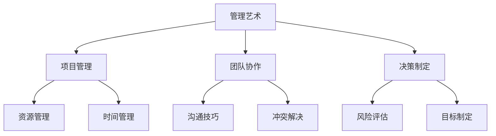
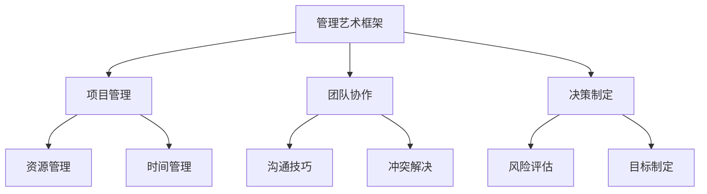

                 


# 管理艺术：从策略到执行

> **关键词**：管理策略、执行、项目管理、决策制定、团队协作
> 
> **摘要**：本文深入探讨了从策略制定到执行的完整过程，剖析了项目管理、团队协作、决策制定等关键环节，结合实际案例，为IT领域的从业者提供了实用的管理方法和技巧。

## 1. 背景介绍

### 1.1 目的和范围

本文旨在探讨管理艺术在IT领域的应用，从策略制定到执行的全过程。通过分析项目管理、团队协作、决策制定等核心环节，为IT从业者提供一套实用且具有指导意义的管理方法。

### 1.2 预期读者

本篇文章适合具有一定IT项目管理经验的读者，尤其是从事软件开发、系统集成、IT咨询服务等领域的专业人士。

### 1.3 文档结构概述

本文结构分为十个部分：

1. 背景介绍：介绍文章的目的、预期读者和结构。
2. 核心概念与联系：阐述管理艺术的基本概念和原理。
3. 核心算法原理 & 具体操作步骤：详细讲解策略制定到执行的过程。
4. 数学模型和公式 & 详细讲解 & 举例说明：运用数学模型辅助理解。
5. 项目实战：代码实际案例和详细解释说明。
6. 实际应用场景：分析管理艺术在不同场景的应用。
7. 工具和资源推荐：推荐学习资源、开发工具和框架。
8. 总结：未来发展趋势与挑战。
9. 附录：常见问题与解答。
10. 扩展阅读 & 参考资料：提供进一步的阅读建议。

### 1.4 术语表

#### 1.4.1 核心术语定义

- **管理艺术**：在特定领域内，将理论知识与实践经验相结合，运用科学方法进行决策和执行的过程。
- **策略**：为实现目标而制定的总体计划和方法。
- **执行**：将策略转化为具体行动的过程。
- **项目管理**：运用系统方法，规划、组织、协调和控制项目资源，实现项目目标的过程。
- **团队协作**：团队成员共同合作，完成共同任务的过程。

#### 1.4.2 相关概念解释

- **决策制定**：在不确定环境下，根据既定目标和条件，选择最佳行动方案的过程。
- **项目计划**：对项目目标、任务、资源、时间等进行详细规划和安排的过程。

#### 1.4.3 缩略词列表

- **IT**：信息技术（Information Technology）
- **PM**：项目管理（Project Management）
- **QA**：质量保证（Quality Assurance）
- **SDLC**：软件开发生命周期（Software Development Life Cycle）

## 2. 核心概念与联系

### 2.1 管理艺术的概念原理

管理艺术是IT领域不可或缺的一部分，它涉及到多个层面的知识和技能。首先，我们需要了解管理艺术的基本概念，如图所示：



### 2.2 管理艺术的架构

管理艺术的架构可以看作是一个多维度的框架，它不仅包括项目管理、团队协作和决策制定，还包括资源管理、时间管理、沟通技巧、冲突解决和风险评估等多个方面。以下是一个简化的Mermaid流程图：



### 2.3 管理艺术的核心原理

管理艺术的核心原理主要包括以下几个方面：

1. **系统性**：将管理过程视为一个整体，各个环节相互关联、相互影响。
2. **动态性**：管理过程是动态变化的，需要根据实际情况进行调整。
3. **目标导向**：明确目标和预期成果，将管理活动与目标紧密联系。
4. **科学性**：运用科学方法进行分析和决策，提高管理效率。
5. **人文关怀**：关注团队成员的需求，建立良好的团队氛围。

## 3. 核心算法原理 & 具体操作步骤

### 3.1 策略制定算法

策略制定是管理艺术的重要环节，以下是一个简单的策略制定算法：

```pseudo
Algorithm 策略制定算法
输入：目标，约束条件
输出：策略

1. 确定目标：明确项目或任务的目标。
2. 收集信息：收集与目标相关的各种信息，如市场需求、技术可行性等。
3. 分析现状：分析当前环境、资源、团队状况等。
4. 制定备选方案：基于现状和分析结果，制定多个备选方案。
5. 评估方案：对备选方案进行评估，考虑可行性、成本、风险等因素。
6. 选择最佳方案：根据评估结果，选择最佳方案。
7. 制定实施计划：为最佳方案制定详细的实施计划。
```

### 3.2 执行步骤

策略制定完成后，需要将其转化为具体的行动。以下是执行的基本步骤：

```pseudo
Algorithm 执行步骤
输入：策略，实施计划
输出：执行结果

1. 分解任务：将策略分解为具体的任务。
2. 分配资源：根据任务需求，合理分配资源。
3. 制定时间表：为任务制定时间表，确保任务按时完成。
4. 监控进度：实时监控任务进度，确保执行过程按计划进行。
5. 风险管理：识别潜在风险，制定相应的应对措施。
6. 沟通协作：保持团队成员之间的沟通和协作，确保任务顺利完成。
7. 调整优化：根据执行过程中的实际情况，及时调整和优化策略和计划。
```

## 4. 数学模型和公式 & 详细讲解 & 举例说明

### 4.1 数学模型

在管理艺术中，数学模型可以帮助我们更准确地分析问题，制定策略。以下是一个简单的项目管理中的成本效益分析模型：

$$
C = C_p + C_v + C_r
$$

其中，$C$ 为总成本，$C_p$ 为人力成本，$C_v$ 为设备成本，$C_r$ 为其他成本。

### 4.2 详细讲解

- **人力成本 ($C_p$)**：根据项目需求，计算所需的人力资源数量和工资水平。
- **设备成本 ($C_v$)**：根据项目需求，计算所需设备的购置成本和运营成本。
- **其他成本 ($C_r$)**：包括差旅费、培训费、沟通成本等。

### 4.3 举例说明

假设一个软件开发项目，需要 10 名开发人员，每人每月工资 10000 元；需要购买 5 台服务器，每台服务器购置成本 5000 元，运营成本每月 1000 元；其他成本为 5000 元。则该项目的总成本为：

$$
C = 10 \times 10000 + 5 \times 5000 + 5000 = 150000（元）
$$

### 4.4 案例分析

一个IT系统集成项目，需要完成以下任务：

1. 项目分析：成本 20000 元。
2. 系统设计：成本 30000 元。
3. 硬件采购：成本 50000 元。
4. 软件开发：成本 70000 元。
5. 测试与验收：成本 25000 元。

根据成本效益分析模型，计算项目的总成本和利润：

$$
C = 20000 + 30000 + 50000 + 70000 + 25000 = 205000（元）
$$

假设项目的销售收入为 250000 元，则利润为：

$$
利润 = 销售收入 - 总成本 = 250000 - 205000 = 45000（元）
$$

## 5. 项目实战：代码实际案例和详细解释说明

### 5.1 开发环境搭建

为了更好地理解管理艺术在实际项目中的应用，我们以一个简单的软件开发项目为例。首先，我们需要搭建一个开发环境。

#### 5.1.1 环境需求

- 操作系统：Windows/Linux/Mac
- 编程语言：Python
- 版本控制：Git
- 开发工具：PyCharm/VSCode

#### 5.1.2 环境搭建步骤

1. 安装操作系统。
2. 安装Python。
3. 安装Git。
4. 安装PyCharm/VSCode。

### 5.2 源代码详细实现和代码解读

以下是一个简单的Python程序，用于计算项目总成本和利润。

```python
def calculate_total_cost(hours, salary_per_hour, server_count, server_price, other_cost):
    human_cost = hours * salary_per_hour
    device_cost = server_count * server_price
    total_cost = human_cost + device_cost + other_cost
    return total_cost

def calculate_profit(sales_revenue, total_cost):
    profit = sales_revenue - total_cost
    return profit

# 项目数据
hours = 10
salary_per_hour = 10000
server_count = 5
server_price = 5000
other_cost = 5000
sales_revenue = 250000

# 计算成本和利润
total_cost = calculate_total_cost(hours, salary_per_hour, server_count, server_price, other_cost)
profit = calculate_profit(sales_revenue, total_cost)

print(f"总成本：{total_cost}元")
print(f"利润：{profit}元")
```

#### 5.2.1 代码解读

1. **定义函数**：`calculate_total_cost` 和 `calculate_profit` 分别用于计算总成本和利润。
2. **参数传递**：函数通过参数传递项目数据，如人力成本、设备成本等。
3. **计算过程**：根据项目数据，计算总成本和利润。
4. **输出结果**：打印计算结果。

### 5.3 代码解读与分析

#### 5.3.1 优点

1. **模块化**：代码采用模块化设计，易于维护和扩展。
2. **函数复用**：通过定义函数，实现代码复用，提高开发效率。
3. **清晰结构**：代码结构清晰，易于阅读和理解。

#### 5.3.2 缺点

1. **功能单一**：当前代码仅用于计算成本和利润，功能较为单一。
2. **输入验证**：代码未对输入参数进行验证，可能导致运行错误。

#### 5.3.3 优化建议

1. **增加输入验证**：对输入参数进行验证，确保数据的有效性。
2. **添加错误处理**：添加错误处理机制，提高程序的健壮性。
3. **扩展功能**：增加其他功能，如项目进度跟踪、资源利用率分析等。

## 6. 实际应用场景

### 6.1 软件开发项目

在软件开发生命周期中，管理艺术起到了至关重要的作用。从需求分析、设计、开发、测试到上线，每个阶段都需要科学的管理方法和技巧。

#### 6.1.1 需求分析

1. **明确目标**：与客户沟通，了解项目需求和预期成果。
2. **制定计划**：根据需求，制定详细的项目计划和进度表。
3. **风险评估**：识别潜在风险，制定应对措施。

#### 6.1.2 设计阶段

1. **需求分析**：对需求进行详细分析，确保设计的可行性和合理性。
2. **技术方案**：根据需求，制定技术方案，确保项目技术可行性。
3. **设计评审**：组织专家对设计方案进行评审，确保设计质量。

#### 6.1.3 开发阶段

1. **任务分配**：根据项目需求，合理分配开发任务。
2. **进度跟踪**：实时监控开发进度，确保项目按计划进行。
3. **质量控制**：对开发过程进行质量控制，确保项目质量。

#### 6.1.4 测试阶段

1. **测试计划**：制定详细的测试计划，确保测试覆盖面。
2. **测试执行**：按照测试计划，执行测试任务。
3. **问题跟踪**：对测试过程中发现的问题进行跟踪和解决。

#### 6.1.5 上线阶段

1. **上线准备**：确保系统稳定性，做好上线前的准备工作。
2. **上线执行**：按照上线计划，执行上线任务。
3. **上线验收**：对上线后的系统进行验收，确保系统运行正常。

### 6.2 IT咨询服务

在IT咨询服务中，管理艺术同样至关重要。以下是一个典型的IT咨询服务流程：

#### 6.2.1 咨询需求

1. **了解需求**：与客户沟通，了解客户的具体需求。
2. **需求分析**：对需求进行详细分析，确保服务的可行性和合理性。
3. **制定方案**：根据需求，制定详细的服务方案。

#### 6.2.2 项目管理

1. **任务分配**：根据服务方案，合理分配任务。
2. **进度跟踪**：实时监控项目进度，确保项目按计划进行。
3. **质量控制**：对服务过程进行质量控制，确保服务质量。

#### 6.2.3 知识转移

1. **培训**：对客户团队进行培训，确保客户掌握所需技能。
2. **文档交付**：提供详细的项目文档，确保客户能够顺利运营。

#### 6.2.4 售后服务

1. **问题解决**：为客户提供技术支持，解决客户遇到的问题。
2. **反馈收集**：收集客户反馈，不断优化服务。

## 7. 工具和资源推荐

### 7.1 学习资源推荐

#### 7.1.1 书籍推荐

- 《项目管理知识体系指南》（PMBOK指南）
- 《敏捷开发实践指南》
- 《人月神话》
- 《有效沟通》

#### 7.1.2 在线课程

- Coursera上的《项目管理》：由斯坦福大学提供的免费在线课程。
- Udemy上的《敏捷项目管理》：涵盖敏捷开发方法和实践的课程。

#### 7.1.3 技术博客和网站

- ProjectManagement.com：提供项目管理相关的文章、案例和资源。
- AgileScout：专注于敏捷开发方法和实践的博客。

### 7.2 开发工具框架推荐

#### 7.2.1 IDE和编辑器

- PyCharm：适用于Python开发的集成开发环境。
- VSCode：跨平台、开源的代码编辑器，支持多种编程语言。

#### 7.2.2 调试和性能分析工具

- Postman：API测试工具，可用于调试和测试API接口。
- JMeter：性能测试工具，适用于Web应用程序的性能测试。

#### 7.2.3 相关框架和库

- Django：Python Web开发框架，适用于快速开发Web应用程序。
- React：用于构建用户界面的JavaScript库。

### 7.3 相关论文著作推荐

#### 7.3.1 经典论文

- "A Method for Obtaining Digital Signatures and Public-Key Cryptosystems"，Rivest, Shamir, and Adleman。
- "The Mythical Man-Month"，Frederick P. Brooks Jr.。

#### 7.3.2 最新研究成果

- "Agile Project Management: Creating Competitive Advantage"，Dean Leffingwell。
- "Software Architecture: Foundations, Theory, and Practice"，Michael Keane。

#### 7.3.3 应用案例分析

- "Building a High-Performance Agile Team"，James Shore。
- "Lean Software Development: Applied Lean Thinking to Software Engineering"，Mary and Tom Poppendieck。

## 8. 总结：未来发展趋势与挑战

### 8.1 发展趋势

- **数字化转型**：随着大数据、人工智能、云计算等技术的快速发展，IT领域的数字化转型趋势日益明显。
- **敏捷管理**：敏捷开发、敏捷管理方法在全球范围内得到广泛应用，成为项目管理的重要方向。
- **跨学科融合**：管理艺术与其他领域的融合，如心理学、经济学等，为管理艺术的发展提供了新的思路。

### 8.2 挑战

- **技术更新迭代**：技术的快速更新迭代，对IT从业者的能力和知识提出了更高的要求。
- **团队协作与沟通**：远程办公、跨地域协作等挑战，对团队协作和沟通提出了新的要求。
- **项目管理复杂性**：项目管理过程的复杂性和不确定性，对管理者的决策能力提出了更高的挑战。

## 9. 附录：常见问题与解答

### 9.1 问题1：如何提高项目管理效率？

**解答**：提高项目管理效率可以从以下几个方面入手：

1. **明确目标和任务**：确保项目目标和任务明确，减少项目执行过程中的误解和错误。
2. **合理分配资源**：根据任务需求和资源情况，合理分配资源，提高资源利用率。
3. **实时监控进度**：实时监控项目进度，及时发现问题并采取相应措施。
4. **优化沟通协作**：建立良好的沟通协作机制，确保团队成员之间信息畅通。

### 9.2 问题2：如何应对项目中的风险？

**解答**：

1. **风险评估**：在项目初期，进行详细的风险评估，识别潜在风险。
2. **制定应对措施**：针对识别出的风险，制定相应的应对措施，降低风险对项目的影响。
3. **风险监控**：实时监控项目过程中的风险，及时调整应对措施。
4. **风险管理培训**：对项目团队成员进行风险管理培训，提高风险意识和管理能力。

## 10. 扩展阅读 & 参考资料

- 《项目管理知识体系指南》（PMBOK指南）
- 《敏捷开发实践指南》
- 《人月神话》
- 《有效沟通》
- ProjectManagement.com
- AgileScout
- Coursera上的《项目管理》
- Udemy上的《敏捷项目管理》
- "A Method for Obtaining Digital Signatures and Public-Key Cryptosystems"
- "The Mythical Man-Month"
- "Agile Project Management: Creating Competitive Advantage"
- "Lean Software Development: Applied Lean Thinking to Software Engineering"
- "Building a High-Performance Agile Team"
- "Software Architecture: Foundations, Theory, and Practice"

