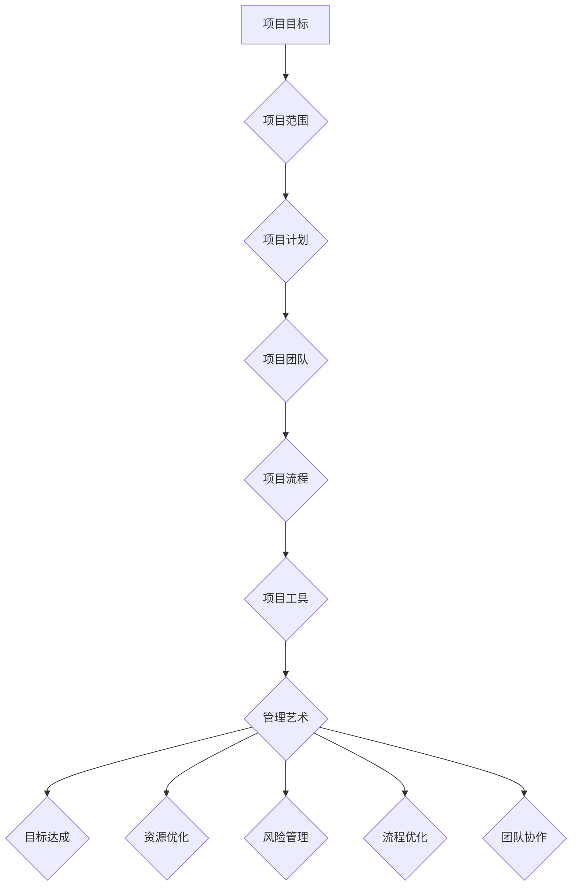

                 


# 管理艺术：从策略到执行

> **关键词**：管理艺术、策略、执行、IT项目管理、敏捷开发、风险管理、流程优化、团队协作
> 
> **摘要**：本文旨在深入探讨IT项目管理中管理艺术的本质，从策略制定到执行过程，详细分析各个环节的关键点，为从业者提供实用的指导和建议。文章首先介绍了管理的核心概念和其在IT领域的应用，随后探讨了策略的制定与优化，最后通过对执行过程的剖析，提出了一系列切实可行的优化策略和工具，帮助读者在项目管理中实现高效执行。

## 1. 背景介绍

### 1.1 目的和范围

本文的目标是帮助IT项目管理者更好地理解和应用管理艺术，以实现项目的高效执行和成功交付。本文将涵盖以下几个方面的内容：

- 管理艺术的基本概念和原理
- IT项目管理的核心策略
- 从策略到执行的过程分析
- 风险管理和流程优化
- 团队协作与沟通技巧
- 实际案例与最佳实践

### 1.2 预期读者

本文适合以下读者：

- IT项目经理和项目团队成员
- 项目管理专业人士和爱好者
- 企业内部负责项目管理的决策者
- 对IT项目管理有兴趣的学生和研究人员

### 1.3 文档结构概述

本文结构如下：

- 引言：介绍管理艺术的背景和重要性
- 核心概念与联系：阐述管理艺术的基本原理和IT项目的架构
- 核心算法原理 & 具体操作步骤：详细讲解项目管理中的关键算法和操作步骤
- 数学模型和公式 & 详细讲解 & 举例说明：介绍项目管理中常用的数学模型和公式，并进行实际应用举例
- 项目实战：提供实际的代码案例和详细解释
- 实际应用场景：探讨管理艺术在不同场景下的应用
- 工具和资源推荐：推荐相关的学习资源和开发工具
- 总结：总结管理艺术的发展趋势和挑战
- 附录：常见问题与解答
- 扩展阅读 & 参考资料：提供进一步学习的资源

### 1.4 术语表

#### 1.4.1 核心术语定义

- 管理艺术：通过智慧、技巧和经验，将资源、时间和技能有效地应用于项目，以实现项目目标。
- IT项目管理：运用项目管理方法、工具和技术，对IT项目进行规划、执行、监控和收尾。
- 敏捷开发：一种软件开发方法，强调迭代、增量和团队协作，以快速响应变化。
- 风险管理：识别、评估、应对和监控项目中的风险，以减少负面影响的概率和影响。
- 流程优化：改进项目流程，以提高效率和效果。

#### 1.4.2 相关概念解释

- 项目管理：规划、执行、监控和收尾项目，以满足特定目标和需求。
- 团队协作：团队成员通过沟通、协调和合作，共同实现项目目标。
- 沟通技巧：有效传达信息、理解和解决问题，以促进团队合作和项目成功。

#### 1.4.3 缩略词列表

- IT：信息技术
- PM：项目经理
- SDLC：软件开发生命周期
- Agile：敏捷开发
- ROI：投资回报率
- ROI：风险机会指标

## 2. 核心概念与联系

在探讨管理艺术之前，我们需要了解几个核心概念，包括项目管理的定义、IT项目的架构以及管理艺术的基本原理。

### 2.1 项目管理的定义

项目管理是指运用项目管理方法、工具和技术，对项目进行规划、执行、监控和收尾，以满足特定目标和需求。项目管理涉及多个方面，包括范围管理、时间管理、成本管理、质量管理、资源管理、沟通管理和风险管理。

### 2.2 IT项目的架构

IT项目通常包括以下几个关键组成部分：

- 项目目标：明确项目的最终目标和预期成果。
- 项目范围：定义项目的范围、边界和可交付成果。
- 项目计划：制定项目的时间表、资源分配和预算。
- 项目团队：组织项目团队成员，明确各自的角色和职责。
- 项目流程：定义项目执行、监控和收尾的过程和步骤。
- 项目工具：使用项目管理工具和技术，如敏捷开发框架、风险管理工具等。

### 2.3 管理艺术的基本原理

管理艺术是一种通过智慧、技巧和经验，将资源、时间和技能有效地应用于项目，以实现项目目标的方法。管理艺术的核心原理包括：

- **适应性**：项目管理需要适应项目的变化，快速响应市场和技术需求。
- **透明度**：项目团队需要保持透明度，确保信息共享和决策过程的公开。
- **协作**：项目团队成员需要通过有效的沟通和协作，共同实现项目目标。
- **灵活性**：项目管理需要灵活应对不确定性和风险，确保项目顺利推进。
- **客户导向**：项目团队需要以客户需求为导向，确保项目交付符合客户期望。

### 2.4 IT项目与管理艺术的关系

IT项目的复杂性和不确定性，使得管理艺术在项目管理中变得尤为重要。管理艺术的应用有助于提高项目的成功率和效率，具体体现在以下几个方面：

- **目标达成**：通过管理艺术的运用，项目团队能够更好地理解和实现项目目标。
- **资源优化**：管理艺术能够帮助项目团队更有效地分配和利用资源，提高项目效率。
- **风险管理**：管理艺术包括识别、评估和应对风险，以减少项目风险和负面影响。
- **流程优化**：管理艺术可以帮助项目团队优化项目流程，提高项目执行效率。
- **团队协作**：管理艺术强调团队协作和沟通，提高项目团队的整体执行力。

### 2.5 Mermaid 流程图

为了更好地展示管理艺术在IT项目中的应用，我们可以使用Mermaid流程图来描述项目管理的各个环节。



通过上述流程图，我们可以清晰地看到管理艺术在IT项目管理中的各个环节，以及各个环节之间的相互关系。

## 3. 核心算法原理 & 具体操作步骤

在IT项目管理中，核心算法原理和具体操作步骤是确保项目成功的关键因素。以下将详细介绍项目管理中常用的核心算法原理，并使用伪代码进行详细阐述。

### 3.1 项目规划算法

项目规划是项目管理的重要环节，涉及到资源分配、时间表制定和风险评估等关键步骤。以下是一个简单的项目规划算法：

```pseudo
规划项目(项目目标，项目范围，资源列表，时间表)：
    1. 确定项目目标和范围
    2. 分析项目需求和资源
    3. 分配资源，制定时间表
    4. 进行风险评估
    5. 优化计划，确保可行性
    6. 形成最终项目计划
    返回 项目计划
```

### 3.2 项目执行算法

项目执行是项目规划后的关键环节，涉及任务分配、进度监控和团队协作。以下是一个简单的项目执行算法：

```pseudo
执行项目(项目计划，项目团队，任务列表)：
    1. 分配任务，明确责任
    2. 监控任务进度，确保按计划执行
    3. 沟通协调，解决冲突
    4. 调整计划，应对风险
    5. 记录项目进展，形成报告
    6. 评估项目执行效果
    7. 形成项目执行总结
    返回 项目执行总结
```

### 3.3 项目监控算法

项目监控是确保项目按计划执行的必要步骤，涉及到进度、成本和质量的监控。以下是一个简单的项目监控算法：

```pseudo
监控项目(项目计划，实际进展，成本预算，质量标准)：
    1. 收集项目进展数据
    2. 分析数据，识别偏差
    3. 对比预算和实际成本
    4. 评估项目质量
    5. 制定改进措施，调整计划
    6. 形成项目监控报告
    返回 项目监控报告
```

### 3.4 风险管理算法

风险管理是项目管理中的重要环节，涉及到风险的识别、评估和应对。以下是一个简单的风险管理算法：

```pseudo
风险管理(项目计划，风险因素列表)：
    1. 识别风险因素
    2. 评估风险影响和概率
    3. 制定风险应对策略
    4. 监控风险，更新风险清单
    5. 评估风险应对效果
    6. 形成风险管理报告
    返回 风险管理报告
```

### 3.5 项目收尾算法

项目收尾是项目管理的最后一步，涉及到项目验收、文档归档和团队解散。以下是一个简单的项目收尾算法：

```pseudo
收尾项目(项目计划，实际进展，验收标准，文档资料)：
    1. 确认项目完成，满足验收标准
    2. 归档项目文档和资料
    3. 评估项目执行效果，形成总结报告
    4. 整理项目团队，解散团队
    5. 形成项目收尾报告
    返回 项目收尾报告
```

通过上述伪代码，我们可以清晰地看到项目管理中的核心算法原理和具体操作步骤。在实际应用中，这些算法可以根据项目的具体情况进行调整和优化，以实现高效的项目管理。

## 4. 数学模型和公式 & 详细讲解 & 举例说明

在项目管理中，数学模型和公式扮演着重要的角色，它们帮助项目经理进行定量分析、评估项目风险和优化项目流程。以下将介绍几个常用的数学模型和公式，并进行详细讲解和举例说明。

### 4.1 关键路径法（Critical Path Method，CPM）

关键路径法是一种用于确定项目完成时间的方法，它通过计算项目中的任务工期，确定项目的最短完成时间。

#### 公式：

$$
C_{总} = \sum_{i=1}^{n} D_i
$$

其中，$C_{总}$ 是项目的总工期，$D_i$ 是第 $i$ 个任务的工期。

#### 举例说明：

假设有一个项目，包括5个任务，每个任务的工期如下：

| 任务 | 工期（天） |
| ---- | ---------- |
| A    | 3          |
| B    | 4          |
| C    | 5          |
| D    | 2          |
| E    | 3          |

根据关键路径法，项目的总工期为：

$$
C_{总} = 3 + 4 + 5 + 2 + 3 = 17 \text{天}
$$

### 4.2 项目评估与审查技术（Program Evaluation and Review Technique，PERT）

项目评估与审查技术是一种用于计算项目完成时间分布的数学模型，它考虑了任务工期的不确定性。

#### 公式：

$$
E(T) = \frac{(a + 4m + b)}{6}
$$

其中，$E(T)$ 是任务的平均工期，$a$ 是最乐观工期，$m$ 是最可能工期，$b$ 是最悲观工期。

#### 举例说明：

假设一个任务的工期分布如下：

| 工期 | 概率 |
| ---- | ---- |
| 2    | 0.1  |
| 3    | 0.5  |
| 5    | 0.4  |

根据PERT模型，该任务的平均工期为：

$$
E(T) = \frac{(2 + 4 \times 3 + 5)}{6} = \frac{19}{6} \approx 3.17 \text{天}
$$

### 4.3 成本效益分析（Cost-Benefit Analysis，CBA）

成本效益分析是一种用于评估项目成本和收益的方法，它通过计算项目的净现值（Net Present Value，NPV）来评估项目的可行性。

#### 公式：

$$
NPV = \sum_{t=1}^{n} \frac{C_t}{(1 + r)^t} - I
$$

其中，$C_t$ 是第 $t$ 年的现金流，$r$ 是折现率，$I$ 是初始投资。

#### 举例说明：

假设一个项目的现金流如下：

| 年份 | 现金流（万元） |
| ---- | -------------- |
| 1    | -100           |
| 2    | 50             |
| 3    | 60             |
| 4    | 70             |

假设折现率为10%，初始投资为100万元，则项目的净现值为：

$$
NPV = \frac{50}{(1 + 0.1)^2} + \frac{60}{(1 + 0.1)^3} + \frac{70}{(1 + 0.1)^4} - 100
$$

$$
NPV = \frac{50}{1.21} + \frac{60}{1.331} + \frac{70}{1.4641} - 100 \approx 17.46 \text{万元}
$$

由于NPV大于0，说明该项目是可行的。

### 4.4 项目风险分析

项目风险分析是评估项目风险概率和影响的重要方法。以下是一个简单的风险分析公式：

$$
R = P \times I
$$

其中，$R$ 是风险影响，$P$ 是风险概率，$I$ 是风险影响程度。

#### 举例说明：

假设一个项目有两个风险：

| 风险 | 概率 | 影响程度 |
| ---- | ---- | -------- |
| A    | 0.3  | 10万元   |
| B    | 0.5  | 5万元    |

则项目的总风险为：

$$
R = 0.3 \times 10 + 0.5 \times 5 = 4 + 2.5 = 6.5 \text{万元}
$$

通过上述数学模型和公式的详细讲解和举例说明，我们可以更好地理解和应用这些方法，以提高项目管理的效率和效果。

## 5. 项目实战：代码实际案例和详细解释说明

为了更好地理解管理艺术在项目执行中的应用，我们将通过一个实际案例来展示如何使用代码实现项目中的关键步骤，并对代码进行详细解释和分析。

### 5.1 开发环境搭建

在这个案例中，我们将使用Python语言和Django框架来搭建一个简单的博客系统。以下是搭建开发环境的基本步骤：

1. 安装Python 3.x版本。
2. 安装Django框架：`pip install django`
3. 创建一个新的Django项目：`django-admin startproject blog_project`
4. 进入项目目录：`cd blog_project`
5. 创建一个应用：`python manage.py startapp blog_app`

### 5.2 源代码详细实现和代码解读

下面我们将展示博客系统的核心代码，并对其进行详细解读。

#### 5.2.1 模型代码

在`blog_app/models.py`中，我们定义了博客文章的模型：

```python
from django.db import models

class Post(models.Model):
    title = models.CharField(max_length=100)
    content = models.TextField()
    created_at = models.DateTimeField(auto_now_add=True)
    updated_at = models.DateTimeField(auto_now=True)

    def __str__(self):
        return self.title
```

这个模型定义了一个`Post`类，包含文章标题（`title`）、内容（`content`）、创建时间和更新时间。

#### 5.2.2 视图代码

在`blog_app/views.py`中，我们定义了一个简单的视图来展示文章列表：

```python
from django.shortcuts import render
from .models import Post

def post_list(request):
    posts = Post.objects.all().order_by('-created_at')
    return render(request, 'blog_app/post_list.html', {'posts': posts})
```

这个视图从数据库中获取所有文章，并按创建时间降序排列，然后传递给模板。

#### 5.2.3 模板代码

在`blog_app/templates/blog_app/post_list.html`中，我们定义了一个简单的HTML模板来展示文章列表：

```html
<!DOCTYPE html>
<html>
<head>
    <title>Blog Posts</title>
</head>
<body>
    <h1>Blog Posts</h1>
    
        <div>
            <h2>{{ post.title }}</h2>
            <p>{{ post.content }}</p>
            <small>Created at: {{ post.created_at }}</small>
        </div>
    
</body>
</html>
```

这个模板使用Django模板语言（）来遍历文章列表，并展示每个文章的标题、内容和创建时间。

#### 5.2.4 URL配置

在`blog_project/urls.py`中，我们添加了一个URL配置来映射视图和URL路径：

```python
from django.contrib import admin
from django.urls import path
from blog_app.views import post_list

urlpatterns = [
    path('admin/', admin.site.urls),
    path('posts/', post_list, name='post_list'),
]
```

这个配置将`/posts/`路径映射到`post_list`视图。

### 5.3 代码解读与分析

#### 数据模型

`Post`模型定义了博客文章的基本结构，包括标题、内容和创建时间。在数据库层面，这个模型将存储博客文章的相关信息。

#### 视图

`post_list`视图从数据库中获取所有文章，并按创建时间排序。这确保了文章按照最新发表的时间展示，这是博客系统常见的需求。

#### 模板

模板是负责呈现文章列表的HTML页面。在这个模板中，我们使用了Django模板语言来遍历文章列表，并为每个文章显示标题、内容和创建时间。这有助于创建一个直观、易用的用户界面。

#### URL配置

URL配置将用户的HTTP请求映射到相应的视图。在这个案例中，用户访问`/posts/`路径时，会触发`post_list`视图，从而展示文章列表。

通过这个案例，我们展示了如何使用代码实现一个简单的博客系统，并详细解读了各个组件的作用。这个案例不仅展示了管理艺术在项目执行中的应用，也为读者提供了一个实际操作的机会，以加深对项目管理的理解。

## 6. 实际应用场景

管理艺术在IT项目管理中的应用场景非常广泛，几乎涵盖了所有类型的IT项目。以下将介绍几种常见的应用场景，并分析管理艺术在其中的作用。

### 6.1 软件开发项目

软件开发项目是管理艺术应用最为广泛的一个领域。在这个场景中，管理艺术主要体现在以下几个方面：

- **需求管理**：明确项目需求，确保需求的理解和实现。
- **任务分配**：合理分配任务，确保团队成员的能力和任务匹配。
- **进度监控**：监控项目进度，确保项目按时交付。
- **风险管理**：识别和应对项目中的各种风险。
- **质量保证**：确保项目交付的软件质量符合预期。

### 6.2 系统集成项目

系统集成项目通常涉及多个软件和硬件的集成，管理艺术在其中的应用包括：

- **需求分析**：明确系统集成的需求，确保各个组件的兼容性。
- **项目管理**：协调不同团队的工作，确保项目整体进度。
- **风险管理**：识别和应对项目中的技术风险和商业风险。
- **测试与验收**：确保系统集成的质量和稳定性。

### 6.3 IT运维项目

在IT运维项目中，管理艺术主要体现在以下几个方面：

- **故障管理**：快速响应和处理系统故障，确保系统稳定运行。
- **变更管理**：合理规划和管理系统的变更，确保变更对系统的稳定性影响最小。
- **性能优化**：持续优化系统性能，提高系统效率和用户体验。
- **安全管理**：确保系统安全，防止数据泄露和系统入侵。

### 6.4 云计算项目

云计算项目的管理艺术主要体现在以下几个方面：

- **资源管理**：合理分配和管理云计算资源，确保项目资源的高效利用。
- **服务管理**：确保云计算服务的质量和稳定性。
- **成本控制**：监控云计算项目的成本，确保项目在预算范围内完成。
- **合规性管理**：确保云计算项目的合规性，遵守相关法律法规和行业标准。

### 6.5 AI和大数据项目

在AI和大数据项目中，管理艺术主要体现在以下几个方面：

- **数据管理**：确保数据的质量和安全性，为项目提供可靠的数据支持。
- **算法优化**：不断优化算法，提高模型的效果和性能。
- **资源分配**：合理分配计算资源和存储资源，确保项目的高效运行。
- **风险管理**：识别和应对项目中可能出现的数据隐私风险和算法偏见。

通过上述实际应用场景的分析，我们可以看到管理艺术在IT项目管理中的重要性。无论项目类型如何，管理艺术的核心原则都是确保项目的成功交付，实现预期目标。因此，掌握管理艺术的精髓，对于IT项目经理和团队成员来说，都是至关重要的。

## 7. 工具和资源推荐

为了更好地进行IT项目管理，掌握一系列实用的工具和资源是必不可少的。以下将推荐一些学习资源、开发工具和相关的论文著作，以帮助读者提升项目管理技能。

### 7.1 学习资源推荐

#### 7.1.1 书籍推荐

1. **《项目管理知识体系指南（PMBOK指南）》**：由项目管理协会（PMI）发布的权威指南，全面介绍了项目管理的基本原理和实践方法。
2. **《敏捷开发实践指南》**：介绍了敏捷开发的核心原则和方法，适合那些希望采用敏捷方法的团队。
3. **《项目管理中的风险管理》**：详细讲解了项目风险管理的方法和技巧，帮助项目经理有效应对项目风险。
4. **《精益创业》**：阐述了精益创业的理念和方法，适合初创公司和创新型项目。

#### 7.1.2 在线课程

1. **Coursera**：提供丰富的项目管理课程，涵盖项目管理基础知识、敏捷方法和风险管理等。
2. **Udemy**：提供多种项目管理相关的在线课程，包括PMP认证培训、敏捷开发和IT项目管理等。
3. **edX**：由哈佛大学和麻省理工学院等名校提供的一系列免费课程，包括项目管理、数据科学等。

#### 7.1.3 技术博客和网站

1. **Atlassian博客**：提供了大量关于敏捷开发、项目管理工具和团队协作的文章。
2. **CIO.com**：涵盖了广泛的项目管理话题，包括趋势、技术和最佳实践。
3. **ProjectManagement.com**：提供丰富的项目管理资源，包括博客、在线课程和案例分析。

### 7.2 开发工具框架推荐

#### 7.2.1 IDE和编辑器

1. **Visual Studio Code**：一款轻量级、可扩展的代码编辑器，支持多种编程语言和框架。
2. **IntelliJ IDEA**：一款强大的Java和Python集成开发环境，提供丰富的插件和工具。
3. **PyCharm**：一款适用于Python开发的IDE，具有丰富的功能和高度的可定制性。

#### 7.2.2 调试和性能分析工具

1. **Postman**：一款流行的API调试工具，可以方便地创建、测试和调试RESTful API。
2. **JMeter**：一款开源的性能测试工具，用于测试Web应用、网络服务器和数据库的性能。
3. **Grafana**：一款强大的可视化工具，可以监控和分析各种数据源，包括Kubernetes、Prometheus等。

#### 7.2.3 相关框架和库

1. **Django**：一款流行的Python Web开发框架，适用于快速构建复杂的应用。
2. **React**：一款用于构建用户界面的JavaScript库，具有高效的性能和灵活的组件化设计。
3. **TensorFlow**：一款广泛使用的机器学习和深度学习框架，适用于各种AI项目。

### 7.3 相关论文著作推荐

#### 7.3.1 经典论文

1. **"The Mythical Man-Month"**：Frederick P. Brooks的经典论文，讨论了软件开发中常见的问题和解决方法。
2. **"Agile Project Management with Scrum"**：Ken Schwaber和Jeff Sutherland合著的论文，介绍了敏捷开发的核心原则和实践。
3. **"A Manager's Guide to Risk Management"**：由项目管理协会（PMI）发表的论文，详细介绍了项目风险管理的理论和实践。

#### 7.3.2 最新研究成果

1. **"AI-Driven Project Management: A New Paradigm"**：探讨了人工智能在项目管理中的应用，以及如何利用AI提升项目管理的效率和效果。
2. **"The Impact of Cloud Computing on Project Management"**：分析了云计算对项目管理的影响，以及如何在云计算环境中进行有效的项目管理。
3. **"Practical Guide to Project Management for Data Science Projects"**：针对数据科学项目的特点，提出了实用的项目管理方法和技巧。

#### 7.3.3 应用案例分析

1. **"Project Management at Google"**：详细介绍了Google如何运用项目管理方法，成功地管理了多个大型项目和产品。
2. **"Managing Agile Projects at Spotify"**：分享了Spotify在敏捷开发中的实践经验，以及如何通过敏捷方法提升项目效率和质量。
3. **"Risk Management in Construction Projects"**：探讨了建筑项目中风险管理的实践方法和案例，为其他行业提供了有益的借鉴。

通过以上推荐，读者可以系统地学习和掌握IT项目管理的相关知识，并在实际工作中运用这些工具和资源，提升项目管理的能力和水平。

## 8. 总结：未来发展趋势与挑战

在IT项目管理领域，管理艺术的发展正面临着一系列新的趋势和挑战。未来，管理艺术将在以下几个方面展现出显著的发展：

### 8.1 敏捷管理方法的应用

敏捷开发方法已经在全球范围内得到广泛应用，未来将进一步深入到项目管理中。敏捷方法强调快速响应变化、迭代开发和团队协作，有助于提高项目的灵活性和适应性。然而，如何在大规模项目中有效应用敏捷方法，以及如何平衡敏捷开发与传统项目管理方法，将成为项目管理者和团队面临的重要挑战。

### 8.2 人工智能与项目管理

人工智能（AI）技术在项目管理中的应用前景广阔。通过AI，项目管理者可以更精确地进行需求预测、资源优化和风险分析。例如，AI算法可以分析历史数据，为项目规划提供参考，从而提高项目成功的概率。然而，AI技术的应用也带来了一些挑战，如数据隐私、算法偏见和人才短缺等问题，需要项目管理者深入思考和解决。

### 8.3 云计算与项目管理

云计算技术的发展为项目管理提供了新的机遇和挑战。通过云计算，项目可以更加灵活地获取和处理资源，降低成本，提高效率。然而，如何确保云计算环境中的数据安全，如何管理云基础设施，以及如何应对云服务提供商的政策变化，都是项目管理者和团队需要关注的问题。

### 8.4 风险管理

风险管理的复杂性和重要性在不断提高。随着项目规模的扩大和技术的快速发展，项目面临的风险种类和程度也在增加。如何全面识别、评估和应对项目风险，确保项目在多变环境中顺利推进，是项目管理者和团队需要持续关注和改进的方向。

### 8.5 团队协作与沟通

团队协作和沟通在项目管理中至关重要。随着全球化的发展和远程工作的普及，如何有效管理分布式团队，确保团队成员之间的沟通和信息共享，将是一个长期挑战。未来，项目管理者需要不断探索新的协作工具和方法，提升团队协作效率。

总之，未来管理艺术的发展趋势将更加注重敏捷性、智能化和协作性。同时，项目管理者和团队将面临更多复杂的挑战，需要不断学习和适应，才能在快速变化的环境中实现项目成功。

## 9. 附录：常见问题与解答

### 9.1 问题1：如何平衡敏捷开发与传统项目管理方法？

解答：敏捷开发与传统项目管理方法并非对立关系，而是一种互补关系。在实际应用中，可以采取以下策略来平衡两者：

- **逐步过渡**：在项目初期，可以采用敏捷方法进行迭代开发，逐步过渡到传统项目管理方法。
- **融合优势**：将敏捷开发中的迭代、反馈和客户导向等优势与传统项目管理中的计划、控制和风险管理相结合。
- **灵活调整**：根据项目实际情况和客户需求，灵活调整项目管理方法，确保项目顺利推进。

### 9.2 问题2：如何提高项目团队协作效率？

解答：提高项目团队协作效率可以从以下几个方面入手：

- **明确目标和职责**：确保团队成员对项目目标和职责有清晰的认识，避免重复工作和责任模糊。
- **加强沟通**：建立有效的沟通机制，如定期会议、即时通讯工具和协作平台，确保团队成员之间的信息畅通。
- **使用协作工具**：利用项目管理工具和协作平台，如JIRA、Trello和Slack，提高任务分配和进度管理的效率。
- **鼓励反馈和改进**：建立开放、透明的反馈机制，鼓励团队成员提出建议和改进措施，不断提升团队协作效率。

### 9.3 问题3：如何进行有效的风险管理？

解答：进行有效的风险管理需要遵循以下步骤：

- **风险识别**：通过历史数据、专家意见和项目文档等手段，识别项目可能面临的风险。
- **风险评估**：评估每个风险的严重程度和发生概率，确定优先级。
- **风险应对**：制定相应的应对策略，如风险规避、转移、减轻或接受。
- **风险监控**：持续监控项目中的风险，及时调整应对策略，确保风险得到有效控制。

### 9.4 问题4：如何确保云计算项目中的数据安全？

解答：确保云计算项目中的数据安全需要采取以下措施：

- **数据加密**：使用加密技术保护数据传输和存储，确保数据不被非法访问。
- **访问控制**：通过访问控制和身份验证机制，确保只有授权用户可以访问敏感数据。
- **定期备份**：定期备份数据，确保数据在发生故障或事故时可以快速恢复。
- **安全审计**：进行安全审计和漏洞扫描，及时发现并修复安全漏洞，确保系统安全。

通过上述常见问题的解答，读者可以更好地应对项目管理中遇到的各种挑战，提高项目管理的效果和效率。

## 10. 扩展阅读 & 参考资料

在深入探索管理艺术和IT项目管理的道路上，以下扩展阅读和参考资料将为您提供更多的信息和视角：

### 10.1 经典书籍

1. **《敏捷开发实践指南》**：作者：Jeff Sutherland，详细介绍了敏捷开发的核心原则和实践方法。
2. **《项目管理知识体系指南（PMBOK指南）》**：作者：项目管理协会（PMI），涵盖了项目管理的基本原理和实践。
3. **《精益创业》**：作者：Eric Ries，阐述了精益创业的理念和方法，适用于初创公司和项目管理者。

### 10.2 在线课程

1. **Coursera**：提供丰富的项目管理课程，包括PMP认证培训、敏捷开发和风险管理等。
2. **Udemy**：多种项目管理相关的在线课程，涵盖从基础到高级的各个层次。
3. **edX**：由名校提供的免费课程，包括项目管理、数据科学等。

### 10.3 技术博客和网站

1. **Atlassian博客**：提供关于敏捷开发、项目管理工具和团队协作的文章。
2. **CIO.com**：涵盖广泛的项目管理话题，包括趋势、技术和最佳实践。
3. **ProjectManagement.com**：提供丰富的项目管理资源，包括博客、在线课程和案例分析。

### 10.4 学术期刊和论文

1. **IEEE Transactions on Project Management**：发表关于项目管理的研究论文和案例分析。
2. **Project Management Journal**：提供项目管理实践和研究的最新进展。
3. **Journal of Management Information Systems**：探讨项目管理信息系统的研究和案例。

### 10.5 开源资源和社区

1. **GitHub**：搜索和参与开源项目管理工具和项目的开发。
2. **Stack Overflow**：寻找项目管理问题和解决方案的讨论和答案。
3. **LinkedIn**：加入项目管理相关的专业社群，与业界同行交流经验。

通过上述扩展阅读和参考资料，读者可以进一步深化对管理艺术和IT项目管理领域的理解和应用。持续学习和实践，将帮助您不断提升项目管理能力，实现更高效的项目交付。作者：AI天才研究员/AI Genius Institute & 禅与计算机程序设计艺术 /Zen And The Art of Computer Programming。

