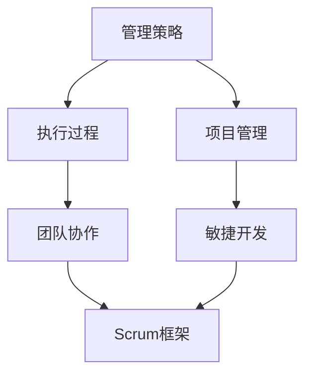

                 

# 管理艺术：从策略到执行

> **关键词：** 管理策略、执行过程、项目管理、敏捷开发、团队协作

> **摘要：** 本文深入探讨了现代IT领域中的管理艺术，从策略制定到执行过程，通过详细的分析和案例分析，揭示了如何实现高效的项目管理和团队协作，为IT从业人员提供了一整套实用的管理方法论和实践经验。

## 1. 背景介绍

### 1.1 目的和范围

本文旨在探讨现代IT领域中的管理艺术，通过策略制定到执行过程的全流程分析，帮助读者理解如何将优秀的理论转化为实际操作，从而实现高效的项目管理和团队协作。

本文将涵盖以下主题：

- **管理策略：** 介绍如何制定有效的管理策略，包括目标设定、资源规划和风险评估等。
- **执行过程：** 分析执行过程中的关键环节，如团队协作、任务分配、进度控制和问题解决。
- **项目管理：** 探讨项目管理的方法和工具，包括敏捷开发、Scrum框架等。
- **团队协作：** 强调团队协作的重要性，介绍促进团队协作的技巧和工具。

### 1.2 预期读者

本文适合以下读者：

- **IT项目经理和管理人员：** 想要提升项目管理能力和团队协作效率的专业人士。
- **软件开发人员：** 想要了解项目管理知识和实践经验的开发者。
- **其他IT从业者：** 对管理艺术和项目管理有兴趣的IT从业人员。

### 1.3 文档结构概述

本文将按照以下结构进行组织：

- **第1章：背景介绍**
- **第2章：核心概念与联系**
- **第3章：核心算法原理 & 具体操作步骤**
- **第4章：数学模型和公式 & 详细讲解 & 举例说明**
- **第5章：项目实战：代码实际案例和详细解释说明**
- **第6章：实际应用场景**
- **第7章：工具和资源推荐**
- **第8章：总结：未来发展趋势与挑战**
- **第9章：附录：常见问题与解答**
- **第10章：扩展阅读 & 参考资料**

### 1.4 术语表

#### 1.4.1 核心术语定义

- **管理策略：** 制定目标和规划资源的过程。
- **执行过程：** 实施计划并达成目标的过程。
- **项目管理：** 对项目从启动到关闭的全面管理。
- **敏捷开发：** 一种快速响应变更和持续改进的软件开发方法。
- **Scrum框架：** 一种基于迭代和增量的项目管理方法。

#### 1.4.2 相关概念解释

- **团队协作：** 团队成员之间的互动和合作，以实现共同的目标。
- **任务分配：** 根据团队成员的技能和职责分配任务。
- **进度控制：** 监控项目进度，确保按时交付。
- **风险管理：** 识别、评估和应对项目风险。

#### 1.4.3 缩略词列表

- **Scrum：** 敏捷开发中的一种项目管理框架。
- **Agile：** 敏捷开发的另一种称呼。
- **IDE：** 集成开发环境（Integrated Development Environment）。

## 2. 核心概念与联系

在探讨管理艺术之前，我们需要理解一些核心概念和它们之间的关系。以下是一个简化的Mermaid流程图，展示了这些概念的基本联系。



### 2.1 管理策略

管理策略是指为实现组织目标而制定的计划和决策。它涉及以下几个方面：

- **目标设定：** 确定项目的最终目标，包括业务目标和用户需求。
- **资源规划：** 确定所需的资源，如人力、资金和时间。
- **风险评估：** 识别潜在的风险，并制定应对策略。

### 2.2 执行过程

执行过程是将管理策略转化为实际操作的过程。它主要包括以下几个方面：

- **任务分配：** 根据团队成员的技能和职责分配任务。
- **进度控制：** 监控项目进度，确保按时交付。
- **问题解决：** 及时识别和解决执行过程中出现的问题。

### 2.3 项目管理

项目管理是对项目从启动到关闭的全面管理。它涉及以下几个方面：

- **项目计划：** 制定项目进度表、资源需求和风险评估。
- **项目监控：** 监控项目进度和资源使用情况。
- **项目报告：** 定期报告项目进展和成果。

### 2.4 团队协作

团队协作是团队成员之间的互动和合作，以实现共同的目标。它涉及以下几个方面：

- **沟通：** 建立有效的沟通机制，确保信息流通。
- **协作工具：** 使用协作工具，如Slack、Trello等，提高团队协作效率。
- **冲突解决：** 及时解决团队内部的冲突，确保团队凝聚力。

### 2.5 敏捷开发

敏捷开发是一种快速响应变更和持续改进的软件开发方法。它主要包括以下几个方面：

- **迭代开发：** 将开发过程划分为多个短周期（迭代），在每个迭代中实现部分功能。
- **用户反馈：** 定期收集用户反馈，以便在下一个迭代中进行改进。
- **持续集成：** 通过持续集成，确保代码质量并提高开发效率。

### 2.6 Scrum框架

Scrum是一种基于迭代和增量的项目管理方法。它主要包括以下几个方面：

- **Scrum会议：** 包括每日站立会议、 sprint计划和回顾会议等。
- **Scrum角色：** 包括产品负责人、Scrum大师和开发团队。
- **Scrum工件：** 包括产品待办列表、冲刺待办列表和燃尽图等。

## 3. 核心算法原理 & 具体操作步骤

在项目管理中，核心算法原理通常涉及资源分配、任务调度和风险管理等方面。以下是一个简化的伪代码，用于描述资源分配算法的基本步骤。

```plaintext
算法：资源分配
输入：任务列表，资源列表，任务需求
输出：分配方案

资源分配步骤：
1. 初始化分配方案为空
2. 对任务列表进行排序，按照任务优先级和资源需求量排序
3. 遍历任务列表：
   3.1 如果任务有可用资源：
       3.1.1 将任务分配给资源
       3.1.2 将资源从可用资源列表中移除
       3.1.3 将任务添加到分配方案中
   3.2 否则：
       3.2.1 记录任务为未分配
4. 返回分配方案
```

### 3.1 任务分配

任务分配是执行过程中的第一步，它涉及将任务分配给合适的团队成员。以下是一个伪代码示例：

```plaintext
算法：任务分配
输入：任务列表，团队成员列表
输出：分配结果

任务分配步骤：
1. 初始化分配结果为空
2. 对任务列表进行排序，按照任务优先级和团队成员技能匹配度排序
3. 遍历任务列表：
   3.1 如果有团队成员具有完成任务所需的技能：
       3.1.1 将任务分配给该团队成员
       3.1.2 将任务从任务列表中移除
       3.1.3 将团队成员从团队成员列表中移除
       3.1.4 将分配结果添加到分配结果列表中
4. 返回分配结果
```

### 3.2 进度控制

进度控制是确保项目按时完成的关键环节。以下是一个伪代码示例，用于监控项目进度：

```plaintext
算法：进度控制
输入：项目进度表，当前日期
输出：进度报告

进度控制步骤：
1. 初始化进度报告为空
2. 遍历项目进度表：
   2.1 如果当前日期在任务的开始日期和结束日期之间：
       2.1.1 计算任务的实际完成进度
       2.1.2 如果实际完成进度低于预期进度：
           2.1.2.1 记录延迟任务
           2.1.2.2 提出调整计划
3. 生成进度报告，包括延迟任务和调整计划
4. 返回进度报告
```

### 3.3 问题解决

问题解决是执行过程中的一个持续过程。以下是一个伪代码示例，用于处理执行过程中出现的问题：

```plaintext
算法：问题解决
输入：问题列表，解决方案库
输出：解决方案报告

问题解决步骤：
1. 初始化解决方案报告为空
2. 遍历问题列表：
   2.1 如果问题有解决方案：
       2.1.1 应用解决方案
       2.1.2 将解决方案添加到解决方案报告
   2.2 否则：
       2.2.1 将问题记录为未解决
       2.2.2 搜索解决方案库中的解决方案
       2.2.3 如果找到解决方案：
           2.2.3.1 应用解决方案
           2.2.3.2 将解决方案添加到解决方案报告
       2.2.4 否则：
           2.2.4.1 将问题报告给管理层
3. 返回解决方案报告
```

## 4. 数学模型和公式 & 详细讲解 & 举例说明

在项目管理中，数学模型和公式用于评估项目风险、计算进度和资源分配等方面。以下是一个简单的数学模型，用于计算项目的完工时间。

### 4.1 项目完工时间计算

假设一个项目包含多个任务，每个任务有固定的工期和资源需求。我们可以使用以下公式来计算项目的完工时间：

$$
T_c = \sum_{i=1}^{n} T_i + R
$$

其中：

- $T_c$ 是项目的完工时间。
- $T_i$ 是第 $i$ 个任务的工期。
- $R$ 是项目的风险预留时间。

### 4.2 风险评估模型

风险评估是项目管理中至关重要的一环。以下是一个简单的风险评估模型，用于评估项目风险的概率和影响。

$$
R_i = P_i \times I_i
$$

其中：

- $R_i$ 是第 $i$ 个风险的概率和影响乘积。
- $P_i$ 是第 $i$ 个风险的概率。
- $I_i$ 是第 $i$ 个风险的影响。

### 4.3 进度延误计算

在项目管理中，进度延误是一个常见问题。以下是一个简单的公式，用于计算由于风险导致的项目延误时间。

$$
D_i = T_i \times (1 - P_i)
$$

其中：

- $D_i$ 是由于第 $i$ 个风险导致的进度延误时间。
- $T_i$ 是第 $i$ 个任务的工期。
- $P_i$ 是第 $i$ 个风险的概率。

### 4.4 举例说明

假设一个项目包含3个任务，任务1的工期为5天，任务2的工期为10天，任务3的工期为15天。每个任务都有10%的概率延迟完成。

1. 计算项目的完工时间：
$$
T_c = 5 + 10 + 15 + R
$$

其中，$R$ 是风险预留时间，假设为3天。

$$
T_c = 5 + 10 + 15 + 3 = 33 \text{天}
$$

2. 计算风险影响：
$$
R_i = 0.1 \times 15 = 1.5
$$

3. 计算进度延误：
$$
D_i = 15 \times (1 - 0.1) = 13.5 \text{天}
$$

因此，项目的完工时间为 33 天 + 13.5 天 = 46.5 天。

## 5. 项目实战：代码实际案例和详细解释说明

在本节中，我们将通过一个实际的项目案例，展示如何将上述的管理策略和执行过程应用于实际开发中。以下是一个基于敏捷开发方法的简单Web应用项目。

### 5.1 开发环境搭建

为了方便起见，我们使用以下工具和技术：

- **编程语言：** Python
- **Web框架：** Flask
- **版本控制系统：** Git
- **协作工具：** Trello

### 5.2 源代码详细实现和代码解读

以下是项目的核心代码和解释。

#### 5.2.1 项目结构

```
my_project/
|-- app/
|   |-- __init__.py
|   |-- routes.py
|   |-- models.py
|-- tests/
|   |-- __init__.py
|   |-- test_app.py
|-- .env
|-- run.py
|-- requirements.txt
```

#### 5.2.2 app/__init__.py

```python
from flask import Flask
from .routes import bp as routes_bp

def create_app():
    app = Flask(__name__)
    app.config.from_object('config.Config')
    
    app.register_blueprint(routes_bp)

    return app
```

**解释：** 这是 Flask 应用程序的初始化文件，用于创建应用程序实例并加载配置。

#### 5.2.2 app/routes.py

```python
from flask import Blueprint, render_template

bp = Blueprint('main', __name__)

@bp.route('/')
def index():
    return render_template('index.html')
```

**解释：** 这是路由配置文件，定义了应用的首页路由。

#### 5.2.3 app/models.py

```python
from flask_sqlalchemy import SQLAlchemy

db = SQLAlchemy()

class User(db.Model):
    id = db.Column(db.Integer, primary_key=True)
    username = db.Column(db.String(64), unique=True, nullable=False)
    password_hash = db.Column(db.String(128), nullable=False)
```

**解释：** 这是数据库模型文件，定义了用户表。

#### 5.2.4 tests/test_app.py

```python
import unittest
from app import create_app, db

class TestBase(unittest.TestCase):
    def setUp(self):
        self.app = create_app('testing')
        self.app_context = self.app.app_context()
        self.app_context.push()
        db.create_all()

    def tearDown(self):
        db.session.remove()
        db.drop_all()
        self.app_context.pop()

class TestMainRoutes(TestBase):
    def test_index(self):
        tester = self.app.test_client()
        response = tester.get('/')
        assert response.status_code == 200
```

**解释：** 这是测试文件，用于验证应用的各个部分是否按预期工作。

#### 5.2.5 run.py

```python
from app import create_app, db
from flask_migrate import Migrate

app = create_app()
migrate = Migrate(app, db)

if __name__ == '__main__':
    app.run(debug=True)
```

**解释：** 这是应用的主运行文件，用于启动Web服务器。

### 5.3 代码解读与分析

#### 5.3.1 Flask应用结构

Flask应用由一个应用程序实例、一个路由系统和一个模板系统组成。在我们的项目中，`app/__init__.py` 文件负责创建应用程序实例并加载配置。`app/routes.py` 文件定义了应用的各个路由，而 `app/models.py` 文件定义了数据库模型。

#### 5.3.2 测试框架

我们使用Python的 `unittest` 框架进行测试。测试文件 `tests/test_app.py` 用于验证应用的首页路由是否按预期工作。

#### 5.3.3 数据库迁移

我们使用 `flask_migrate` 插件来管理数据库迁移。在 `run.py` 文件中，我们设置了迁移实例，并在应用启动时自动执行数据库迁移。

## 6. 实际应用场景

在实际应用中，管理艺术可以从多个方面体现。以下是一些常见的应用场景：

- **项目启动：** 在项目启动阶段，管理策略的制定至关重要。通过明确项目目标、资源需求和风险评估，确保项目顺利启动。
- **团队协作：** 在执行过程中，团队协作是项目成功的关键。通过使用协作工具、定期召开团队会议和建立良好的沟通机制，提高团队协作效率。
- **进度控制：** 进度控制是确保项目按时交付的关键。通过监控项目进度、及时调整计划和解决执行过程中出现的问题，确保项目进度得到有效控制。
- **风险管理：** 风险管理是项目管理中不可或缺的一环。通过识别、评估和应对项目风险，降低项目风险对项目进度和成本的影响。
- **持续改进：** 在敏捷开发中，持续改进是核心原则之一。通过收集用户反馈、持续优化产品功能和改进开发流程，提高项目的交付质量和客户满意度。

## 7. 工具和资源推荐

### 7.1 学习资源推荐

#### 7.1.1 书籍推荐

- 《敏捷开发实践指南》：介绍了敏捷开发的方法和实践。
- 《项目管理知识体系指南》（PMBOK指南）：涵盖了项目管理的各个方面。

#### 7.1.2 在线课程

- Coursera上的《敏捷项目管理》：提供了敏捷项目管理的基础知识。
- edX上的《项目管理基础》：介绍了项目管理的核心概念和方法。

#### 7.1.3 技术博客和网站

- Atlassian的博客：提供了大量关于敏捷开发、Scrum和项目管理的内容。
- Stack Overflow：一个优秀的开发者社区，提供了丰富的技术问题和解决方案。

### 7.2 开发工具框架推荐

#### 7.2.1 IDE和编辑器

- PyCharm：一款功能强大的Python IDE。
- Visual Studio Code：一款轻量级但功能强大的编辑器，适用于多种编程语言。

#### 7.2.2 调试和性能分析工具

- Postman：用于API测试和调试。
- New Relic：一款性能监控工具，可用于监测Web应用程序的性能。

#### 7.2.3 相关框架和库

- Flask：一款轻量级的Web应用程序框架。
- SQLAlchemy：一个ORM（对象关系映射）库，用于简化数据库操作。

### 7.3 相关论文著作推荐

#### 7.3.1 经典论文

- 《敏捷软件开发宣言》：阐述了敏捷开发的核心原则。
- 《敏捷项目管理实践指南》：介绍了敏捷项目管理的具体实践。

#### 7.3.2 最新研究成果

- 《敏捷开发的未来趋势》：探讨了敏捷开发的未来发展方向。
- 《基于机器学习的项目管理》：介绍了如何利用机器学习技术进行项目管理。

#### 7.3.3 应用案例分析

- 《敏捷开发在大型企业中的应用》：介绍了敏捷开发在大型企业中的应用和实践。
- 《敏捷开发在初创企业中的应用》：探讨了敏捷开发在初创企业中的优势和应用。

## 8. 总结：未来发展趋势与挑战

随着技术的不断进步和市场竞争的加剧，项目管理的方法和工具也在不断演变。以下是一些未来发展趋势和挑战：

### 8.1 发展趋势

- **数字化转型：** 数字化转型正在推动项目管理方法的创新，如数字化转型项目管理。
- **人工智能：** 人工智能技术在项目管理中的应用正在逐步展开，如基于AI的进度预测和风险评估。
- **敏捷开发：** 敏捷开发将继续成为项目管理的主流方法，其应用范围将不断扩展。
- **可持续发展：** 可持续发展将成为项目管理的重要考虑因素，如何平衡项目进度和环境保护将是一个挑战。

### 8.2 挑战

- **技术变革：** 技术的快速变革对项目管理提出了新的要求，如何适应和应对技术变革是一个挑战。
- **团队协作：** 随着远程工作和全球化团队的兴起，如何确保高效的团队协作将成为一个挑战。
- **项目风险管理：** 随着项目复杂度的增加，如何有效进行项目风险管理将成为一个重要挑战。

## 9. 附录：常见问题与解答

### 9.1 什么是敏捷开发？

敏捷开发是一种快速响应变更和持续改进的软件开发方法，其核心理念是“迭代和增量开发”，通过短周期（迭代）的方式逐步实现项目目标。

### 9.2 如何制定有效的管理策略？

制定有效的管理策略需要明确项目目标、资源需求和风险评估。首先，明确项目目标，确保目标具有可衡量性和可实现性。其次，评估所需的资源，包括人力、资金和时间。最后，进行风险评估，识别潜在风险，并制定应对策略。

### 9.3 团队协作的重要性是什么？

团队协作是项目成功的关键因素。有效的团队协作可以提高团队的工作效率，减少沟通成本，降低项目风险。此外，团队协作有助于增强团队成员之间的信任和凝聚力，提高项目的整体质量。

## 10. 扩展阅读 & 参考资料

- 《敏捷开发实践指南》：作者：Jeff Sutherland，介绍了敏捷开发的方法和实践。
- 《项目管理知识体系指南》（PMBOK指南）：作者：Project Management Institute，涵盖了项目管理的各个方面。
- 《敏捷项目管理实践指南》：作者：Michael Jackson，介绍了敏捷项目管理的具体实践。
- 《数字化转型项目管理》：作者：Philippe Silberzahn，探讨了数字化转型项目管理的挑战和策略。

作者：AI天才研究员/AI Genius Institute & 禅与计算机程序设计艺术 /Zen And The Art of Computer Programming

