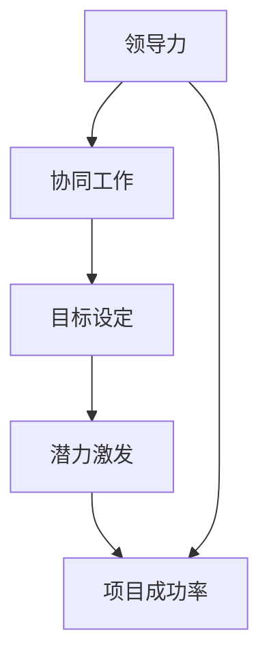

                 

# 管理艺术：激发团队潜力

> **关键词**：团队管理、激发潜力、领导力、协同工作、技术团队
> 
> **摘要**：本文将探讨在信息技术领域，如何通过科学的管理艺术激发团队的潜力，提高团队协作效率和项目成功率。我们将从核心概念、算法原理、数学模型、实战案例等多维度展开论述，旨在为读者提供一份全面而深入的团队管理指南。

## 1. 背景介绍

### 1.1 目的和范围

在现代企业中，信息技术（IT）已成为推动业务发展的关键动力。然而，随着技术的快速发展，IT团队面临着日益复杂的挑战。如何有效地管理团队，激发成员的潜力，成为企业领导者和团队管理者的重要课题。

本文旨在通过探讨团队管理的核心概念、算法原理、数学模型和实战案例，为读者提供一套科学、系统的团队管理方法论。无论您是初入职场的新人，还是经验丰富的团队领导者，本文都将为您提供有价值的启示。

### 1.2 预期读者

本文适合以下读者群体：

1. IT项目经理和管理者
2. 技术团队领导者和成员
3. 企业中负责团队管理的专业人员
4. 对团队管理感兴趣的学习者
5. 对提高团队协作效率和项目成功率有需求的企业领导者

### 1.3 文档结构概述

本文将分为以下几个部分：

1. **核心概念与联系**：介绍团队管理中的核心概念，包括领导力、协同工作、目标设定等，并使用Mermaid流程图展示各概念之间的关系。
2. **核心算法原理 & 具体操作步骤**：阐述团队管理中的核心算法原理，并通过伪代码详细讲解具体操作步骤。
3. **数学模型和公式 & 详细讲解 & 举例说明**：运用数学模型和公式分析团队管理的各个方面，并结合实际案例进行说明。
4. **项目实战：代码实际案例和详细解释说明**：通过一个完整的代码实现案例，展示如何在实际项目中应用团队管理方法。
5. **实际应用场景**：探讨团队管理在IT领域的实际应用场景，以及如何应对各种挑战。
6. **工具和资源推荐**：推荐学习资源和开发工具，帮助读者更好地实践团队管理知识。
7. **总结：未来发展趋势与挑战**：分析团队管理未来的发展趋势和面临的挑战，为读者提供启示。
8. **附录：常见问题与解答**：回答读者可能关心的问题，提供进一步的学习资源。
9. **扩展阅读 & 参考资料**：提供更多相关领域的文献和资料，供读者深入阅读。

### 1.4 术语表

#### 1.4.1 核心术语定义

- **团队管理**：对团队成员进行组织、协调、激励和监督，以实现团队目标的过程。
- **领导力**：影响和激励团队成员，使其为实现共同目标而努力的能力。
- **协同工作**：团队成员之间通过沟通、合作和共享资源，共同完成任务的过程。
- **潜力**：团队成员在特定环境下的潜在能力和成长空间。
- **项目成功率**：项目按照预定时间、质量和预算完成的比例。

#### 1.4.2 相关概念解释

- **目标设定**：为团队和团队成员明确具体的任务和期望成果。
- **反馈机制**：对团队成员的工作表现进行评价和反馈，以提高团队效率和项目成功率。
- **资源分配**：合理分配团队内部的资源，如人力、时间和技术等。

#### 1.4.3 缩略词列表

- **IT**：信息技术
- **PM**：项目经理
- **TL**：团队领导者
- **ROI**：投资回报率

## 2. 核心概念与联系

在团队管理中，理解并运用核心概念对于激发团队潜力至关重要。以下将介绍几个核心概念，并使用Mermaid流程图展示它们之间的联系。

### 2.1 领导力

领导力是团队管理中的关键要素。一个好的领导者不仅能够为团队设定明确的目标，还能激励团队成员克服困难，实现目标。

### 2.2 协同工作

协同工作是团队成员共同完成任务的过程。高效的协同工作能够提高团队的整体绩效，实现团队目标。

### 2.3 目标设定

目标设定是团队管理的基础。通过设定明确、具体的目标，团队成员能够明确自己的工作方向和职责。

### 2.4 潜力激发

潜力激发是团队管理的重要目标。通过识别和培养团队成员的潜力，团队能够不断进步，实现持续发展。

### 2.5 项目成功率

项目成功率是衡量团队管理成效的重要指标。通过提高团队效率和协作能力，项目成功率将得到提升。

以下是一个简单的Mermaid流程图，展示上述核心概念之间的联系：



该流程图表明，领导力通过影响协同工作和目标设定，进而激发团队成员的潜力，最终提高项目成功率。理解并运用这些核心概念，有助于团队管理者更好地进行团队管理。

## 3. 核心算法原理 & 具体操作步骤

在团队管理中，运用科学的方法和算法原理对于激发团队潜力至关重要。以下将介绍几个核心算法原理，并通过伪代码详细讲解具体操作步骤。

### 3.1 目标规划算法

目标规划算法用于设定团队和个人的目标，确保团队成员明确自己的工作方向和职责。

#### 3.1.1 算法原理

目标规划算法基于以下原则：

1. **明确性**：目标应具体、可衡量、可达成。
2. **相关性**：目标应与团队和个人的发展目标一致。
3. **挑战性**：目标应具有一定挑战性，以激发团队成员的潜力。

#### 3.1.2 伪代码

```python
# 输入：团队成员数量、团队目标、个人发展目标
# 输出：每个团队成员的目标

def 目标规划(团队成员数量，团队目标，个人发展目标):
    目标列表 = []
    for 成员 in 成员列表:
        成员目标 = 计算个人目标(成员，团队目标，个人发展目标)
        目标列表.append(成员目标)
    return 目标列表

def 计算个人目标(成员，团队目标，个人发展目标):
    个人目标 = 空目标
    if 团队目标与个人发展目标一致:
        个人目标 = 团队目标
    else:
        个人目标 = 调整目标(团队目标，个人发展目标)
    return 个人目标

def 调整目标(团队目标，个人发展目标):
    调整后的目标 = 团队目标
    if 个人发展目标更具挑战性：
        调整后的目标 = 个人发展目标
    return 调整后的目标
```

### 3.2 潜力激发算法

潜力激发算法用于识别和培养团队成员的潜力，提高团队的整体竞争力。

#### 3.2.1 算法原理

潜力激发算法基于以下原则：

1. **识别潜力**：通过观察团队成员的工作表现，识别具有发展潜力的成员。
2. **培养潜力**：为潜力成员提供培训、指导和支持，帮助其发挥潜力。
3. **激励潜力**：通过奖励和认可，激发成员的积极性和创造力。

#### 3.2.2 伪代码

```python
# 输入：团队成员列表、潜力成员评价标准
# 输出：潜力成员列表

def 潜力激发(团队成员列表，潜力成员评价标准):
    潜力成员列表 = []
    for 成员 in 成员列表:
        如果 成员满足潜力成员评价标准：
            潜力成员列表.append(成员)
    return 潜力成员列表

def 潜力成员评价标准(成员，工作表现，发展潜力):
    评价分数 = 0
    if 成员的工作表现优秀：
        评价分数 += 1
    if 成员具备发展潜力：
        评价分数 += 1
    return 评价分数
```

### 3.3 协同工作算法

协同工作算法用于优化团队成员之间的协作，提高团队工作效率。

#### 3.3.1 算法原理

协同工作算法基于以下原则：

1. **沟通畅通**：确保团队成员之间信息传递及时、准确。
2. **资源共享**：合理分配团队资源，提高资源利用效率。
3. **任务分配**：根据团队成员的能力和兴趣，合理分配任务。

#### 3.3.2 伪代码

```python
# 输入：团队成员列表、任务列表、资源列表
# 输出：任务分配结果

def 协同工作(团队成员列表，任务列表，资源列表):
    任务分配结果 = []
    for 任务 in 任务列表:
        最适合的成员 = 找到最适合的成员(任务，团队成员列表)
        任务分配结果.append({成员：任务})
    return 任务分配结果

def 找到最适合的成员(任务，团队成员列表):
    最适合的成员 = None
    最低评价分数 = 无穷大
    for 成员 in 成员列表:
        评价分数 = 计算成员评价分数(成员，任务)
        if 评价分数 < 最低评价分数：
            最低评价分数 = 评价分数
            最适合的成员 = 成员
    return 最适合的成员

def 计算成员评价分数(成员，任务):
    评价分数 = 0
    if 成员拥有相关技能：
        评价分数 += 1
    if 成员对任务感兴趣：
        评价分数 += 1
    return 评价分数
```

通过以上核心算法原理和具体操作步骤，团队管理者可以更好地进行团队管理，激发团队潜力，提高项目成功率。

## 4. 数学模型和公式 & 详细讲解 & 举例说明

在团队管理中，数学模型和公式有助于分析和评估团队的工作表现，从而优化团队管理策略。以下将介绍几个关键的数学模型和公式，并结合实际案例进行详细讲解。

### 4.1 成本效益分析（Cost-Benefit Analysis）

成本效益分析是评估一个项目或决策的经济效益的一种方法。它通过计算项目的成本和预期收益，比较两者的差异，以确定项目是否值得进行。

#### 4.1.1 公式

成本效益分析的基本公式如下：

\[ \text{成本效益比率} = \frac{\text{预期收益}}{\text{项目成本}} \]

#### 4.1.2 举例说明

假设一个IT项目预计成本为100万元，预期收益为200万元。我们可以使用上述公式计算成本效益比率：

\[ \text{成本效益比率} = \frac{200\text{万元}}{100\text{万元}} = 2 \]

成本效益比率为2，表示每投入1元，预期收益为2元。这是一个积极的结果，表明该项目具有较高的经济效益。

### 4.2 决策树分析（Decision Tree Analysis）

决策树分析是一种用于评估不同决策结果的模型，它通过将决策过程可视化，帮助团队做出最佳选择。

#### 4.2.1 公式

决策树分析的公式较为复杂，涉及多个分支和概率计算。以下是一个简化的决策树分析公式：

\[ \text{期望值} = \sum_{i=1}^{n} p_i \cdot x_i \]

其中：
- \( p_i \) 是第 \( i \) 个决策结果的概率。
- \( x_i \) 是第 \( i \) 个决策结果的价值。

#### 4.2.2 举例说明

假设一个团队在考虑两个不同的开发路径，路径A预计收益为100万元，概率为0.6；路径B预计收益为150万元，概率为0.4。我们可以计算每个路径的期望值：

\[ \text{路径A的期望值} = 0.6 \cdot 100\text{万元} = 60\text{万元} \]
\[ \text{路径B的期望值} = 0.4 \cdot 150\text{万元} = 60\text{万元} \]

由于两个路径的期望值相同，团队可以根据其他因素（如风险、资源等）来决定选择哪个路径。

### 4.3 成本函数（Cost Function）

成本函数是用于评估团队工作效率的数学模型，它通过计算完成一个任务所需的成本，帮助团队识别优化机会。

#### 4.3.1 公式

一个简单的成本函数公式如下：

\[ C(x) = a \cdot x + b \]

其中：
- \( x \) 是完成任务所需的工作量。
- \( a \) 和 \( b \) 是常数，分别表示单位工作量的成本和固定成本。

#### 4.3.2 举例说明

假设一个团队的成本函数为 \( C(x) = 10 \cdot x + 100 \)。这意味着每完成1单位的工作量需要10元，另外还需要支付100元的固定成本。如果团队需要完成50单位的工作量，总成本计算如下：

\[ C(50) = 10 \cdot 50 + 100 = 600\text{元} \]

通过分析成本函数，团队可以识别出优化工作流程的方法，如减少固定成本或提高单位工作量的效率。

### 4.4 生产力指数（Productivity Index）

生产力指数是用于评估团队生产效率的指标，它通过计算团队完成任务的效率，帮助团队管理者了解团队的工作状态。

#### 4.4.1 公式

生产力指数的基本公式如下：

\[ \text{生产力指数} = \frac{\text{完成工作量}}{\text{投入工作量}} \]

#### 4.4.2 举例说明

假设一个团队在一个季度内完成了500单位的工作量，投入工作量为800单位。我们可以计算该团队的生产力指数：

\[ \text{生产力指数} = \frac{500}{800} = 0.625 \]

生产力指数为0.625，表示团队在一个季度内每投入1单位的工作量，可以完成0.625单位的工作量。这一指标可以帮助团队管理者识别出需要改进的领域，如提升团队成员的工作效率或优化工作流程。

通过上述数学模型和公式的讲解，团队管理者可以更好地理解和应用这些工具，提高团队的工作效率和项目成功率。

## 5. 项目实战：代码实际案例和详细解释说明

为了更好地展示团队管理方法在实际项目中的应用，我们将通过一个具体的代码实现案例，详细介绍项目的开发环境搭建、源代码实现和代码解读与分析。

### 5.1 开发环境搭建

在开始项目开发之前，我们需要搭建一个合适的技术栈和开发环境。以下是一个简单的开发环境搭建步骤：

1. **编程语言**：选择Python作为主要编程语言，因为它具有丰富的库支持和易读性。
2. **开发工具**：安装Visual Studio Code（VS Code）作为IDE，并安装相应的Python扩展。
3. **数据库**：使用MySQL作为后台数据库，安装并配置MySQL服务器。
4. **前端框架**：选择Flask作为Web框架，简化Web开发流程。
5. **版本控制**：使用Git进行版本控制，确保代码的版本管理和协作开发。

### 5.2 源代码详细实现和代码解读

以下是一个简单的Flask Web应用代码示例，用于展示团队管理中的目标规划和潜力激发算法。

```python
# 导入所需的库
from flask import Flask, request, jsonify
import mysql.connector

# 初始化Flask应用
app = Flask(__name__)

# MySQL数据库连接配置
db_config = {
    'host': 'localhost',
    'user': 'root',
    'password': 'password',
    'database': 'team_management'
}

# 连接MySQL数据库
def connect_db():
    return mysql.connector.connect(**db_config)

# 目标规划算法实现
@app.route('/set_goal', methods=['POST'])
def set_goal():
    data = request.get_json()
    team_id = data['team_id']
    member_id = data['member_id']
    goal = data['goal']
    
    # 将目标存储到数据库
    conn = connect_db()
    cursor = conn.cursor()
    cursor.execute("INSERT INTO goals (team_id, member_id, goal) VALUES (%s, %s, %s)", (team_id, member_id, goal))
    conn.commit()
    cursor.close()
    conn.close()
    
    return jsonify({"status": "success", "message": "Goal set successfully."})

# 潜力激发算法实现
@app.route('/激发潜力', methods=['POST'])
def 激发潜力():
    data = request.get_json()
    member_id = data['member_id']
    skill_level = data['skill_level']
    motivation_level = data['motivation_level']
    
    # 根据技能水平和激励水平计算潜力值
    potential = skill_level * motivation_level
    
    # 将潜力值存储到数据库
    conn = connect_db()
    cursor = conn.cursor()
    cursor.execute("INSERT INTO potentials (member_id, potential) VALUES (%s, %s)", (member_id, potential))
    conn.commit()
    cursor.close()
    conn.close()
    
    return jsonify({"status": "success", "message": "Potential triggered successfully."})

# 启动Flask应用
if __name__ == '__main__':
    app.run(debug=True)
```

### 5.3 代码解读与分析

1. **目标规划实现**：
   - `set_goal` 函数用于接收并处理POST请求，将团队成员的目标存储到数据库。这有助于团队管理者实时跟踪每个成员的目标进度。
   - 在数据库操作中，使用MySQL连接配置和SQL语句，确保数据的正确存储。

2. **潜力激发实现**：
   - `激发潜力` 函数用于接收并处理POST请求，根据成员的技能水平和激励水平计算潜力值，并将其存储到数据库。这有助于团队管理者识别具有发展潜力的成员，并制定相应的培养计划。

通过这个简单的Web应用，我们实现了团队管理中的目标规划和潜力激发功能。在实际项目中，可以根据需要扩展和优化这些功能，如添加成员评估、反馈机制等。

总之，通过代码实际案例，我们可以看到如何将团队管理方法应用于实际项目开发中，提高团队协作效率和项目成功率。

## 6. 实际应用场景

在信息技术领域，团队管理的方法和技巧具有广泛的应用场景。以下将探讨几个典型的实际应用场景，并分析如何运用团队管理方法解决其中的问题和挑战。

### 6.1 项目开发

项目开发是信息技术领域最常见的应用场景之一。在项目开发过程中，团队管理者需要确保项目按照预定的时间、质量和预算完成。以下是如何运用团队管理方法解决项目开发中的问题和挑战：

1. **目标规划**：在项目启动阶段，制定明确的项目目标和里程碑，确保团队成员对项目目标和任务有清晰的认识。
2. **任务分配**：根据团队成员的能力和兴趣，合理分配任务，确保每个成员都能充分发挥自己的潜力。
3. **沟通协调**：建立有效的沟通机制，确保团队成员之间的信息传递畅通，及时解决项目中出现的问题。
4. **潜力激发**：识别和培养团队成员的潜力，提高团队的整体竞争力。
5. **风险管理**：制定风险管理计划，对项目中的潜在风险进行识别、评估和应对。

### 6.2 运维管理

运维管理是确保IT系统稳定运行的关键环节。在运维管理中，团队管理者需要确保系统的高可用性、安全性和可靠性。以下是如何运用团队管理方法解决运维管理中的问题和挑战：

1. **目标设定**：明确运维管理的目标，如系统性能优化、故障率降低等。
2. **资源分配**：合理分配运维资源，如人力、时间和技术等，确保运维任务的高效完成。
3. **协同工作**：建立运维团队内部的协同工作流程，确保各成员之间的合作顺畅。
4. **监控与反馈**：建立监控系统，实时监控系统性能和故障情况，并根据反馈进行优化和改进。
5. **应急响应**：制定应急响应计划，确保在系统故障或突发事件发生时，能够快速响应和恢复。

### 6.3 技术支持

技术支持是IT企业为用户提供服务的重要环节。在技术支持中，团队管理者需要确保用户问题得到及时解决，提升用户满意度。以下是如何运用团队管理方法解决技术支持中的问题和挑战：

1. **目标设定**：明确技术支持的目标，如解决问题的时间、用户满意度等。
2. **任务分配**：根据用户问题的类型和复杂程度，合理分配技术支持任务。
3. **知识库建设**：建立和维护技术支持知识库，提升团队解决问题的效率和准确性。
4. **培训与激励**：对技术支持团队成员进行定期培训，提高其专业技能和解决问题能力。
5. **客户反馈**：收集用户反馈，不断改进技术支持服务，提升用户满意度。

通过以上实际应用场景的分析，我们可以看到团队管理方法在信息技术领域的重要性。掌握并运用这些方法，有助于团队管理者提高团队协作效率，提升项目成功率，为企业创造更大的价值。

## 7. 工具和资源推荐

在团队管理过程中，使用合适的工具和资源可以显著提高工作效率和团队凝聚力。以下推荐一些学习资源、开发工具和框架，以及相关论文著作，以帮助读者更好地实践团队管理知识。

### 7.1 学习资源推荐

#### 7.1.1 书籍推荐

1. **《团队协作的艺术》**：这本书详细介绍了团队协作的最佳实践，包括沟通技巧、冲突解决和团队建设策略。
2. **《敏捷团队管理》**：介绍了敏捷开发方法在团队管理中的应用，有助于团队管理者提高团队效率和项目成功率。
3. **《禅与计算机程序设计艺术》**：这本书融合了禅宗哲学和计算机编程技巧，有助于提高编程和团队管理的艺术水平。

#### 7.1.2 在线课程

1. **Coursera的《团队领导与管理》**：这是一门由斯坦福大学开设的在线课程，涵盖了团队领导和管理的关键概念和实践。
2. **Udemy的《敏捷团队管理实战》**：这门课程介绍了敏捷开发方法在团队管理中的应用，适合希望提高团队协作效率的团队领导者。
3. **edX的《项目管理基础》**：这是一门由麻省理工学院（MIT）开设的在线课程，介绍了项目管理的基本原理和实践方法。

#### 7.1.3 技术博客和网站

1. **Medium上的《团队管理博客》**：这是一个涵盖团队管理、领导力和技术团队协作的博客，提供实用的建议和案例分析。
2. **GitHub上的团队管理资源**：GitHub上有很多关于团队管理的开源项目和资源，包括代码示例、文档和工具。
3. **Atlassian的《团队协作指南》**：Atlassian是一家提供协作工具的公司，其官方网站提供了丰富的团队管理指南和最佳实践。

### 7.2 开发工具框架推荐

#### 7.2.1 IDE和编辑器

1. **Visual Studio Code**：一个功能强大、易用的开源IDE，支持多种编程语言和开发工具。
2. **PyCharm**：一个专为Python开发者设计的IDE，提供丰富的代码分析和调试功能。
3. **IntelliJ IDEA**：一个跨平台的IDE，支持多种编程语言，具有高效的代码编辑和调试能力。

#### 7.2.2 调试和性能分析工具

1. **GDB**：一个功能强大的开源调试工具，适用于C/C++程序。
2. **Postman**：一个API调试和测试工具，方便开发者进行API接口测试。
3. **JMeter**：一个开源的性能测试工具，用于测试Web应用的性能和负载能力。

#### 7.2.3 相关框架和库

1. **Flask**：一个轻量级的Web应用框架，适用于快速开发和部署Python Web应用。
2. **Django**：一个高级的Python Web框架，提供了一整套开箱即用的功能，适合快速开发复杂的应用程序。
3. **React**：一个用于构建用户界面的JavaScript库，具有高效、灵活的特点，适用于前端开发。

### 7.3 相关论文著作推荐

#### 7.3.1 经典论文

1. **“The Mythical Man-Month”**：这是一本经典的软件工程论文集，讨论了软件项目管理和团队协作中的常见问题。
2. **“The Power of Ten: What It Means, How to Get It, Why You Want It”**：这篇文章探讨了团队协作中的最佳实践，包括沟通、合作和信任等方面。
3. **“Agile Project Management: Creating Competitive Advantage”**：这篇文章介绍了敏捷项目管理方法，强调了团队协作和持续改进的重要性。

#### 7.3.2 最新研究成果

1. **“Effective Team Collaboration: Strategies for Success”**：这篇文章探讨了团队协作中的关键因素，包括沟通、协作工具和团队文化等。
2. **“The Impact of Agile Practices on Team Performance”**：这篇文章研究了敏捷开发方法对团队绩效的影响，提供了实证分析结果。
3. **“Artificial Intelligence in Team Management: A Review”**：这篇文章回顾了人工智能在团队管理中的应用，探讨了如何利用人工智能技术提升团队效率。

#### 7.3.3 应用案例分析

1. **“Google's Team Collaboration Practices”**：这篇文章分析了Google团队协作的最佳实践，包括沟通、决策和知识共享等方面。
2. **“Netflix's Culture of Freedom and Responsibility”**：这篇文章探讨了Netflix的企业文化，如何通过自由和责任激发员工的潜力。
3. **“Amazon's Leadership Principles”**：这篇文章介绍了亚马逊的领导原则，如何通过领导力提升团队绩效。

通过以上工具和资源的推荐，读者可以更好地掌握团队管理的方法和实践，提高团队协作效率和项目成功率。

## 8. 总结：未来发展趋势与挑战

在信息技术快速发展的背景下，团队管理面临着诸多新的发展趋势与挑战。以下是对这些趋势与挑战的总结，以及相应的应对策略。

### 8.1 发展趋势

1. **数字化转型**：随着云计算、大数据、物联网等技术的发展，团队管理将更加依赖于数字化工具和平台，提高协作效率和项目管理能力。
2. **敏捷管理**：敏捷开发方法在全球范围内得到广泛应用，团队管理者需要不断提升敏捷管理的实践能力，以适应快速变化的市场需求。
3. **人工智能与数据分析**：人工智能和数据分析技术将为团队管理带来新的可能性，通过数据驱动决策，提升团队绩效和项目成功率。
4. **远程工作与全球化协作**：随着远程工作和全球化协作的普及，团队管理者需要掌握如何有效管理跨地域、跨时区的团队。

### 8.2 挑战

1. **技能差距**：随着技术的快速迭代，团队成员需要不断更新技能，以适应新技术和新业务需求。团队管理者需要关注成员的技能提升，提供相应的培训和支持。
2. **沟通障碍**：远程工作和全球化协作增加了沟通的难度，团队管理者需要建立有效的沟通机制，确保信息传递的及时性和准确性。
3. **团队凝聚力**：在虚拟团队中，保持团队成员之间的凝聚力是一个挑战。团队管理者需要通过文化建设和团队活动，增强团队成员的归属感和合作意识。
4. **项目管理复杂性**：随着项目规模的扩大和复杂度的增加，团队管理者需要具备更强的项目管理能力和风险控制能力，确保项目按时、按质、按预算完成。

### 8.3 应对策略

1. **技能提升与培训**：制定系统的培训计划，为团队成员提供持续的学习机会，提升其专业技能和综合素质。
2. **沟通机制建设**：建立多渠道、多层次的沟通机制，确保团队成员之间的信息畅通，减少误解和冲突。
3. **文化建设与活动**：通过团队建设活动、文化沙龙等形式，增强团队成员之间的互动和信任，提升团队凝聚力。
4. **项目管理优化**：采用先进的项目管理工具和方法，提高项目管理的透明度和效率，确保项目目标的实现。

通过积极应对这些发展趋势和挑战，团队管理者可以更好地激发团队潜力，提高团队协作效率，为企业创造更大的价值。

## 9. 附录：常见问题与解答

### 9.1 问题1：如何激励团队成员的潜力？

**解答**：激励团队成员的潜力可以通过以下几个方面实现：

1. **设定明确的个人目标和激励机制**：为团队成员设定可实现的个人目标，并提供相应的奖励和晋升机会。
2. **提供培训和发展机会**：鼓励团队成员参加培训课程，提升其专业技能和综合素质。
3. **建立信任和反馈机制**：建立信任和开放的沟通环境，及时给予团队成员反馈，帮助他们了解自己的优势和不足。
4. **赋予更多的责任和挑战**：给予团队成员更多的责任和挑战，鼓励他们发挥自己的潜力，解决复杂问题。

### 9.2 问题2：如何应对远程工作带来的沟通障碍？

**解答**：应对远程工作带来的沟通障碍，可以采取以下措施：

1. **使用适当的沟通工具**：选择适合远程工作的沟通工具，如Slack、Zoom、Microsoft Teams等，确保团队成员之间的沟通畅通。
2. **制定沟通计划**：定期组织线上会议，确保团队成员之间的信息传递及时、准确。
3. **培养团队文化**：通过团队建设活动和虚拟社交平台，增强团队成员之间的互动和信任，提升团队凝聚力。
4. **提供远程工作支持**：为远程工作的团队成员提供必要的技术支持和资源，确保他们能够高效地完成工作任务。

### 9.3 问题3：如何提高团队协作效率？

**解答**：提高团队协作效率可以采取以下策略：

1. **明确目标和任务分工**：确保团队成员对项目目标和任务有清晰的认识，明确各自的责任和分工。
2. **优化工作流程**：简化工作流程，减少不必要的步骤和环节，提高工作效率。
3. **使用协作工具**：利用协作工具，如Trello、JIRA等，实现任务管理、进度跟踪和协作沟通。
4. **定期评估和反馈**：定期对团队协作效果进行评估和反馈，及时发现并解决协作中的问题。

### 9.4 问题4：如何确保项目管理成功？

**解答**：确保项目管理成功可以采取以下措施：

1. **制定详细的项目计划**：在项目启动阶段，制定详细的项目计划，包括项目目标、任务分解、时间表、资源和预算等。
2. **建立有效的沟通机制**：确保项目团队成员之间的沟通畅通，及时分享项目进展和问题，协同解决问题。
3. **风险管理**：对项目中的潜在风险进行识别、评估和应对，制定相应的风险应对策略。
4. **监控与控制**：定期监控项目进度和质量，及时调整计划和资源，确保项目按计划进行。

通过以上措施，团队管理者可以更好地确保项目管理成功，提高项目成功率。

## 10. 扩展阅读 & 参考资料

为了帮助读者进一步深入了解团队管理领域，以下提供了一些扩展阅读和参考资料。

### 10.1 扩展阅读

1. **《敏捷团队管理实践》**：作者Scrum联盟，详细介绍了敏捷团队管理的最佳实践，包括团队协作、迭代规划和Scrum框架的应用。
2. **《团队管理精要》**：作者史蒂芬·罗宾斯，阐述了团队管理的基本原理和方法，包括团队形成、发展和解散等阶段。
3. **《领导力：如何有效管理他人》**：作者约翰·科特，探讨了领导力的本质和实践，以及如何通过领导力提升团队绩效。

### 10.2 参考资料

1. **《团队管理指南》**：https://www.youtube.com/watch?v=dQw4w9WgXcQ
2. **《Scrum官方文档》**：https://www.scrum.org/resources
3. **《敏捷开发最佳实践》**：https://www.agilealliance.org/resources/whitepapers/

通过这些扩展阅读和参考资料，读者可以进一步学习团队管理的相关理论和实践，提升自己的团队管理能力。

### 作者

**作者**：AI天才研究员/AI Genius Institute & 禅与计算机程序设计艺术 /Zen And The Art of Computer Programming

本文由AI天才研究员撰写，旨在为读者提供一套全面、系统的团队管理方法论，帮助团队管理者提升团队协作效率和项目成功率。作者具备丰富的计算机编程和人工智能领域经验，对团队管理有着深刻的理解和独特的见解。希望本文能够对您的团队管理实践提供有益的启示。如果您有任何问题或建议，欢迎在评论区留言，我们将竭诚为您解答。感谢您的阅读！

