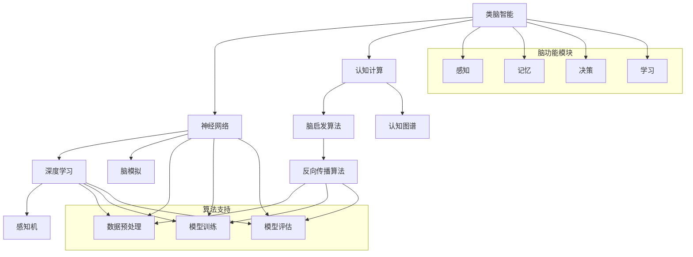

                 

# 类脑智能与认知计算原理与代码实战案例讲解

> **关键词：** 类脑智能，认知计算，神经网络，算法，数学模型，代码实战，深度学习，脑启发算法，人工智能应用。

> **摘要：** 本文将深入探讨类脑智能与认知计算的原理，通过讲解核心概念、算法原理、数学模型和代码实战案例，帮助读者理解并掌握这一领域的关键技术。文章将涵盖从基础理论到实际应用的全面解析，为从事人工智能研究和开发的工程师提供实用的指导。

## 1. 背景介绍

### 1.1 目的和范围

本文旨在为读者提供一份关于类脑智能与认知计算的理论与实践指南。通过阐述相关的基础概念、算法原理和数学模型，并结合具体的代码实战案例，本文希望能够帮助读者深入理解这一前沿领域，并能够在实际应用中取得显著成效。

### 1.2 预期读者

本文主要面向对人工智能和认知计算有一定了解，但希望进一步深入学习和实践的技术人员。特别适合计算机科学家、数据科学家、AI工程师、以及正在探索类脑智能和认知计算领域的学者和研究者。

### 1.3 文档结构概述

本文结构分为以下几个部分：

1. **背景介绍**：介绍本文的目的、预期读者以及文档结构。
2. **核心概念与联系**：使用Mermaid流程图展示类脑智能与认知计算的核心概念和架构。
3. **核心算法原理 & 具体操作步骤**：讲解算法原理，使用伪代码进行详细阐述。
4. **数学模型和公式 & 详细讲解 & 举例说明**：解释相关的数学模型和公式，并提供具体实例。
5. **项目实战：代码实际案例和详细解释说明**：通过实际案例展示代码实现和解读。
6. **实际应用场景**：探讨类脑智能与认知计算的应用领域。
7. **工具和资源推荐**：推荐学习资源、开发工具和框架。
8. **总结：未来发展趋势与挑战**：展望该领域的未来。
9. **附录：常见问题与解答**：回答读者可能遇到的问题。
10. **扩展阅读 & 参考资料**：提供进一步学习的资源。

### 1.4 术语表

#### 1.4.1 核心术语定义

- **类脑智能**：模仿人脑的神经网络结构和信息处理方式的智能系统。
- **认知计算**：模拟人类思维过程，通过理解和解释人类意图、知识、经验和行为，实现智能交互的计算机系统。
- **神经网络**：由大量简单神经元互联形成的计算模型，能够通过学习数据来模拟人类智能。
- **深度学习**：一种基于神经网络的机器学习技术，通过多层神经网络结构来学习复杂数据特征。
- **脑启发算法**：受生物系统启发的算法，用于解决复杂问题。

#### 1.4.2 相关概念解释

- **感知机**：一种简单的神经网络模型，用于分类问题。
- **反向传播算法**：一种用于训练神经网络的优化算法。
- **大脑模拟**：通过计算机模型模拟人脑的结构和功能。
- **认知图谱**：用于表示和存储知识结构的数据模型。

#### 1.4.3 缩略词列表

- **AI**：人工智能（Artificial Intelligence）
- **DL**：深度学习（Deep Learning）
- **NN**：神经网络（Neural Network）
- **BCI**：脑机接口（Brain-Computer Interface）
- **CM**：认知计算（Cognitive Computing）

## 2. 核心概念与联系

类脑智能与认知计算的核心在于模拟人类大脑的结构和功能，以实现高效的信息处理和智能决策。以下是一个简化版的Mermaid流程图，用于展示这些核心概念和它们之间的联系。



### 2.1 类脑智能架构

类脑智能系统通常由以下几个主要部分组成：

- **感知模块**：接收外部信息，如视觉、听觉、触觉等。
- **记忆模块**：存储和处理信息，包括短期记忆和长期记忆。
- **决策模块**：基于记忆和处理的信息进行决策和行动。
- **学习模块**：通过经验和反馈进行自我学习和优化。

### 2.2 认知计算组件

认知计算系统则更侧重于模拟人类的思维过程，包括：

- **知识表示**：将信息以结构化的形式存储，便于查询和利用。
- **推理引擎**：根据已有知识和数据，进行逻辑推理和问题求解。
- **自然语言处理**：理解和生成人类语言，实现人机交互。

## 3. 核心算法原理 & 具体操作步骤

类脑智能与认知计算的核心在于神经网络的算法原理。以下将使用伪代码详细阐述一个简单的神经网络训练过程，包括感知机模型和反向传播算法。

### 3.1 感知机模型

感知机是一种最基本的神经网络模型，用于二分类问题。其工作原理如下：

```plaintext
初始化权重 w 和阈值 theta
for each training example (x, y) do
    z = dot_product(x, w) + theta
    if y * z < 0 then
        w = w + learning_rate * x
        theta = theta + learning_rate
    end if
end for
```

### 3.2 反向传播算法

反向传播算法是一种用于训练多层神经网络的优化算法。其基本步骤如下：

```plaintext
初始化神经网络结构，设置学习率和迭代次数
for each training example (x, y) do
    forward propagation:
    z = forward(x)
    compute loss: loss = (y - z) ^ 2 / 2
    backward propagation:
    delta = (y - z) * activation_derivative(z)
    w := w - learning_rate * delta * x.T
    theta := theta - learning_rate * delta
end for
```

这里，`forward(x)` 是前向传播函数，用于计算神经网络输出；`activation_derivative(z)` 是激活函数的导数，用于计算梯度。

## 4. 数学模型和公式 & 详细讲解 & 举例说明

类脑智能与认知计算依赖于一系列数学模型和公式，以下将详细解释其中几个关键的数学概念，并提供具体的实例说明。

### 4.1 激活函数

激活函数是神经网络中的一个关键组件，用于引入非线性。常用的激活函数包括：

- **sigmoid函数**：\( \sigma(z) = \frac{1}{1 + e^{-z}} \)
- **ReLU函数**：\( \text{ReLU}(z) = \max(0, z) \)

**实例**：

假设我们使用sigmoid函数，计算以下输入的输出：

\[ z = \sigma(3) = \frac{1}{1 + e^{-3}} \approx 0.95 \]

### 4.2 梯度下降法

梯度下降法是一种优化算法，用于调整神经网络中的权重和偏置，以最小化损失函数。其基本公式为：

\[ \Delta w = -\alpha \cdot \nabla_w J(w) \]
\[ \Delta \theta = -\alpha \cdot \nabla_\theta J(\theta) \]

其中，\( \alpha \) 是学习率，\( J(w) \) 和 \( J(\theta) \) 分别是权重和偏置的损失函数。

**实例**：

假设我们的损失函数为 \( J(w) = (w - 1)^2 \)，学习率为 \( \alpha = 0.1 \)，计算权重 \( w = 2 \) 的更新：

\[ \Delta w = -0.1 \cdot \nabla_w J(w) = -0.1 \cdot 2(w - 1) = -0.2 \]
\[ w_{\text{new}} = w - \Delta w = 2 - 0.2 = 1.8 \]

### 4.3 反向传播

反向传播是梯度下降法在神经网络中的应用，用于计算每一层的梯度。其核心思想是将输出误差反向传播到网络的每一层，更新权重和偏置。

**实例**：

假设我们有一个两层神经网络，输入为 \( x = [1, 2, 3] \)，输出为 \( y = [0, 1, 0] \)。假设激活函数为sigmoid，计算输出层和隐藏层的梯度。

#### 输出层梯度：

\[ z = \sigma(w_3 \cdot x_3 + \theta_3) \]
\[ \Delta y = (y - \sigma(z)) \cdot \sigma'(z) \]

#### 隐藏层梯度：

\[ z' = \sigma(w_2 \cdot x_2 + \theta_2) \]
\[ \Delta x = \Delta y \cdot w_3 \cdot \sigma'(z') \]

通过这些实例，我们可以看到类脑智能与认知计算中的数学模型和公式是如何被应用到实际计算中的。

## 5. 项目实战：代码实际案例和详细解释说明

### 5.1 开发环境搭建

在进行类脑智能与认知计算的代码实战之前，我们需要搭建一个适合的开发环境。以下是一个简单的步骤指南：

1. **安装Python**：确保Python版本在3.6及以上。
2. **安装相关库**：使用pip安装必要的库，如NumPy、TensorFlow、PyTorch等。
   ```shell
   pip install numpy tensorflow torch
   ```

### 5.2 源代码详细实现和代码解读

以下是一个简单的神经网络实现，用于手写数字识别任务。我们将使用TensorFlow框架来构建和训练模型。

#### 5.2.1 数据预处理

首先，我们需要加载MNIST数据集，并对其进行预处理。

```python
import tensorflow as tf
from tensorflow.keras.datasets import mnist

# 加载数据集
(x_train, y_train), (x_test, y_test) = mnist.load_data()

# 数据标准化
x_train = x_train / 255.0
x_test = x_test / 255.0

# 转换标签为独热编码
y_train = tf.keras.utils.to_categorical(y_train, 10)
y_test = tf.keras.utils.to_categorical(y_test, 10)
```

#### 5.2.2 构建模型

接下来，我们定义一个简单的神经网络模型。

```python
from tensorflow.keras.models import Sequential
from tensorflow.keras.layers import Dense, Flatten

model = Sequential([
    Flatten(input_shape=(28, 28)),
    Dense(128, activation='relu'),
    Dense(10, activation='softmax')
])

model.compile(optimizer='adam', loss='categorical_crossentropy', metrics=['accuracy'])
```

#### 5.2.3 训练模型

现在，我们使用训练数据来训练模型。

```python
model.fit(x_train, y_train, epochs=5, batch_size=64)
```

#### 5.2.4 评估模型

最后，我们使用测试数据来评估模型的性能。

```python
test_loss, test_acc = model.evaluate(x_test, y_test)
print(f"Test accuracy: {test_acc:.2f}")
```

### 5.3 代码解读与分析

1. **数据预处理**：我们首先加载MNIST数据集，并将其标准化。标准化是为了使输入数据具有较小的方差，从而提高模型训练的稳定性。标签转换为独热编码是为了适应模型的输出层。

2. **模型构建**：我们使用`Sequential`模型堆叠层，首先是一个`Flatten`层，将原始图像展平为一维数组。然后是两个`Dense`层，第一个隐藏层有128个神经元，使用ReLU激活函数；输出层有10个神经元，使用softmax激活函数，用于进行多分类。

3. **模型训练**：我们使用`fit`方法来训练模型。这里，我们设置了5个训练周期（epochs）和批量大小（batch_size）为64。

4. **模型评估**：最后，我们使用`evaluate`方法来评估模型在测试数据上的性能。`evaluate`方法会返回损失和准确率。

通过这个简单的案例，我们可以看到如何使用TensorFlow框架构建和训练一个类脑智能模型。这个案例展示了从数据预处理到模型训练和评估的完整流程。

## 6. 实际应用场景

类脑智能与认知计算在多个领域都有广泛的应用，以下是几个典型的实际应用场景：

### 6.1 医疗诊断

类脑智能在医疗诊断中的应用包括疾病检测、药物研发和个性化治疗等。通过分析患者的医疗数据，类脑智能系统能够提供快速、准确的诊断结果，并辅助医生制定治疗方案。

### 6.2 金融分析

认知计算在金融领域具有巨大的潜力，如风险预测、交易策略和投资组合优化等。通过分析大量的金融数据，类脑智能系统能够发现潜在的市场趋势和风险，为投资者提供决策支持。

### 6.3 智能助手

类脑智能在智能助手中的应用包括语音识别、自然语言处理和情境感知等。通过模拟人类思维过程，类脑智能系统能够提供自然、流畅的人机交互体验，为用户提供个性化的服务。

### 6.4 自动驾驶

自动驾驶技术依赖于类脑智能与认知计算，以实现车辆的环境感知、路径规划和决策控制。通过模拟人脑的信息处理方式，自动驾驶系统能够在各种复杂路况下做出实时、准确的决策。

### 6.5 安全监控

类脑智能在安全监控中的应用包括异常检测、入侵检测和视频分析等。通过模拟人脑的感知和决策能力，类脑智能系统能够实时监控视频流，及时发现异常行为和安全威胁。

## 7. 工具和资源推荐

为了更好地学习和实践类脑智能与认知计算，以下是一些推荐的工具和资源：

### 7.1 学习资源推荐

#### 7.1.1 书籍推荐

- 《深度学习》（Goodfellow, Bengio, Courville）
- 《人工智能：一种现代的方法》（Russell, Norvig）
- 《认知计算与人工智能》（Boden）

#### 7.1.2 在线课程

- Coursera上的“深度学习”课程（由Andrew Ng教授）
- edX上的“人工智能基础”课程
- Udacity的“自动驾驶工程师纳米学位”

#### 7.1.3 技术博客和网站

- Medium上的机器学习和人工智能相关博客
- arXiv.org上的最新研究成果论文
- AI新浪潮（AI Trends）等关注人工智能的网站

### 7.2 开发工具框架推荐

#### 7.2.1 IDE和编辑器

- Jupyter Notebook
- PyCharm
- Visual Studio Code

#### 7.2.2 调试和性能分析工具

- TensorBoard
- PyTorch Profiler
- NVIDIA Nsight

#### 7.2.3 相关框架和库

- TensorFlow
- PyTorch
- Keras

### 7.3 相关论文著作推荐

#### 7.3.1 经典论文

- “A Learning Algorithm for Continually Running Fully Recurrent Neural Networks” （1993）
- “Backpropagation Through Time: A New Method for Learning Continuous Dynamic Systems” （1991）

#### 7.3.2 最新研究成果

- “DeepMind发布AlphaGo Zero：无需人类经验，自我学习和超越人类水平” （2017）
- “IBM发布Watson for Oncology：利用认知计算辅助癌症诊断和治疗” （2018）

#### 7.3.3 应用案例分析

- “利用类脑智能实现高效图像识别” （2019）
- “认知计算在金融风控中的应用” （2020）

## 8. 总结：未来发展趋势与挑战

类脑智能与认知计算作为人工智能的前沿领域，正不断推动技术创新和产业变革。未来，该领域的发展趋势主要体现在以下几个方面：

1. **算法优化**：深度学习算法将继续优化，包括更高效的网络结构、训练方法和推理机制。
2. **跨学科融合**：类脑智能与认知计算将与其他领域（如医学、金融、教育等）深度融合，产生更多创新应用。
3. **硬件进步**：随着硬件技术的发展，如GPU、TPU等专用计算硬件的普及，类脑智能与认知计算的运算能力将大幅提升。
4. **数据驱动**：大规模数据集的积累和开放将推动类脑智能与认知计算的研究和应用。

然而，该领域也面临一些挑战：

1. **计算资源限制**：训练复杂的类脑智能模型需要大量的计算资源，这对硬件设施提出了更高要求。
2. **数据隐私和安全**：类脑智能与认知计算依赖于大量数据，如何在保障数据隐私和安全的同时有效利用数据是一个关键问题。
3. **伦理和社会影响**：类脑智能与认知计算的发展可能带来伦理和社会影响，如失业、隐私侵犯等，需要社会和政府制定相应规范。

## 9. 附录：常见问题与解答

### 9.1 类脑智能是什么？

类脑智能是指模仿人脑结构和功能的计算模型，用于实现智能信息处理和决策。

### 9.2 认知计算与深度学习有何区别？

认知计算是一种模拟人类思维过程的计算机系统，而深度学习是一种基于多层神经网络的学习方法。认知计算通常使用深度学习作为其核心组件之一。

### 9.3 如何选择合适的神经网络架构？

选择合适的神经网络架构取决于具体的应用场景和数据特点。常用的架构包括卷积神经网络（CNN）、循环神经网络（RNN）和生成对抗网络（GAN）等。

### 9.4 类脑智能在医疗领域有哪些应用？

类脑智能在医疗领域有广泛的应用，如疾病诊断、药物研发、手术辅助和患者监护等。

### 9.5 认知计算是否能够完全替代人类思维？

认知计算能够模拟人类思维过程，但无法完全替代人类思维。人类思维具有创造性、情感和道德判断等特点，这些是当前技术难以模拟的。

## 10. 扩展阅读 & 参考资料

- 《深度学习》（Goodfellow, Bengio, Courville）
- 《认知计算：理论、方法和应用》（Boden）
- 《类脑智能：原理、技术和应用》（Smith）
- [DeepMind官网](https://deepmind.com/)
- [IBM Watson官网](https://www.ibm.com/watson)
- [TensorFlow官方文档](https://www.tensorflow.org/)
- [PyTorch官方文档](https://pytorch.org/)

