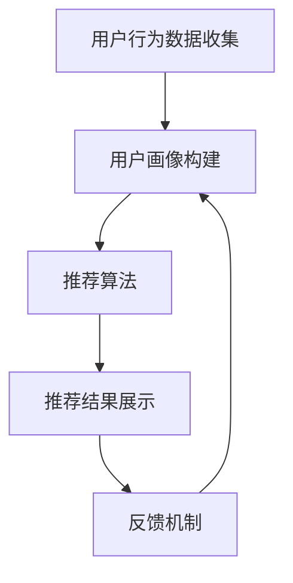

                 

# 精准营销：个性化推荐的效果

> 关键词：精准营销、个性化推荐、用户体验、商业策略、算法优化、数据挖掘

> 摘要：本文将深入探讨精准营销中的个性化推荐技术，分析其背后的核心原理、算法实现和实际应用。通过逐步分析，我们将揭示个性化推荐如何提升用户体验、优化商业策略，并展望其未来的发展趋势和挑战。

## 1. 背景介绍

### 1.1 目的和范围

本文旨在探讨个性化推荐技术在不同商业场景中的应用，特别是其在精准营销中的作用。我们将从以下几个角度展开讨论：

1. **个性化推荐的背景和重要性**：介绍个性化推荐技术的起源和发展，以及其在现代商业环境中的重要性。
2. **核心概念和架构**：阐述个性化推荐的核心概念和系统架构，通过Mermaid流程图展示各组件之间的联系。
3. **算法原理和实现**：详细解析个性化推荐中的核心算法，使用伪代码展示算法的具体操作步骤。
4. **数学模型和公式**：讲解个性化推荐中的数学模型和公式，并通过具体例子进行说明。
5. **实际应用场景**：分析个性化推荐在不同领域的应用，如电子商务、社交媒体、在线视频等。
6. **工具和资源推荐**：介绍学习个性化推荐的相关资源和开发工具。
7. **未来发展趋势与挑战**：探讨个性化推荐技术的未来趋势和面临的挑战。

### 1.2 预期读者

本文面向对个性化推荐技术感兴趣的读者，包括：

1. **技术开发者**：希望了解个性化推荐技术原理和实现细节的技术人员。
2. **数据科学家**：对数据挖掘和机器学习有兴趣，并希望应用这些技术进行个性化推荐的实践者。
3. **市场营销人员**：希望利用个性化推荐提升营销效果的营销专业人士。
4. **学术研究者**：关注个性化推荐领域的研究动态和发展趋势的学者。

### 1.3 文档结构概述

本文的结构如下：

1. **背景介绍**：介绍个性化推荐技术的背景和重要性。
2. **核心概念与联系**：阐述个性化推荐的核心概念和系统架构。
3. **核心算法原理 & 具体操作步骤**：详细解析个性化推荐的核心算法。
4. **数学模型和公式 & 详细讲解 & 举例说明**：讲解个性化推荐中的数学模型和公式。
5. **项目实战：代码实际案例和详细解释说明**：展示个性化推荐的实际应用案例。
6. **实际应用场景**：分析个性化推荐在不同领域的应用。
7. **工具和资源推荐**：推荐学习个性化推荐的相关资源和工具。
8. **总结：未来发展趋势与挑战**：探讨个性化推荐技术的未来趋势和挑战。
9. **附录：常见问题与解答**：解答读者可能遇到的问题。
10. **扩展阅读 & 参考资料**：提供进一步阅读的资源和参考文献。

### 1.4 术语表

#### 1.4.1 核心术语定义

- **个性化推荐**：基于用户历史行为和偏好，为用户推荐其可能感兴趣的内容或产品。
- **协同过滤**：一种常见的个性化推荐算法，通过分析用户之间的相似性进行推荐。
- **内容推荐**：基于物品的属性或特征，为用户推荐相似或相关的物品。
- **用户画像**：对用户行为的综合分析，形成用户的兴趣和行为特征模型。

#### 1.4.2 相关概念解释

- **兴趣点（Interest Points）**：用户在浏览或使用产品过程中表现出的兴趣。
- **交叉销售（Cross-Selling）**：通过推荐用户可能感兴趣的其他产品，增加销售额。
- **留存率（Retention Rate）**：用户在一段时间内继续使用产品的比例。
- **召回率（Recall）**：推荐系统成功召回用户真实兴趣的比例。

#### 1.4.3 缩略词列表

- **AI**：人工智能（Artificial Intelligence）
- **ML**：机器学习（Machine Learning）
- **DL**：深度学习（Deep Learning）
- **FM**：因子分解机（Factorization Machine）
- **CTR**：点击率（Click-Through Rate）

## 2. 核心概念与联系

个性化推荐系统的核心在于理解用户行为和偏好，并将其转化为有效的推荐结果。为了实现这一目标，我们需要理解以下几个核心概念：

### 2.1 个性化推荐系统架构

个性化推荐系统通常由以下几个组件组成：

1. **用户行为数据收集**：收集用户在平台上的行为数据，如浏览历史、购买记录、评论等。
2. **用户画像构建**：通过数据分析和机器学习算法，构建用户的兴趣和行为特征模型。
3. **推荐算法**：根据用户画像和物品特征，为用户生成个性化的推荐结果。
4. **推荐结果展示**：将推荐结果以用户友好的方式展示，如列表、卡片、动态等。
5. **反馈机制**：收集用户对推荐结果的反馈，用于优化推荐算法和系统。

以下是个性化推荐系统的Mermaid流程图：



### 2.2 核心概念解析

#### 2.2.1 用户行为数据收集

用户行为数据是构建用户画像和个性化推荐的基础。常见的数据来源包括：

1. **浏览历史**：用户在平台上的浏览记录，如页面访问次数、浏览时间等。
2. **购买记录**：用户的购买行为，如购买频率、购买金额等。
3. **评论和评分**：用户对产品或内容的评价和反馈。
4. **交互行为**：用户在平台上的交互行为，如点赞、分享、评论等。

#### 2.2.2 用户画像构建

用户画像是对用户兴趣和行为特征的抽象表示。常见的用户画像属性包括：

1. **兴趣标签**：根据用户行为数据，提取用户感兴趣的标签或关键词。
2. **行为特征**：用户的浏览、购买、评论等行为特征，如浏览时长、购买频率等。
3. **人口统计学信息**：用户的基本信息，如年龄、性别、地域等。

#### 2.2.3 推荐算法

推荐算法是实现个性化推荐的核心。常见的推荐算法包括：

1. **基于内容的推荐**：根据物品的属性或特征，为用户推荐相似或相关的物品。
2. **基于协同过滤的推荐**：通过分析用户之间的相似性，为用户推荐其他用户喜欢的物品。
3. **混合推荐**：结合基于内容和基于协同过滤的推荐，生成更精准的推荐结果。

#### 2.2.4 推荐结果展示

推荐结果展示是将推荐结果以用户友好的方式呈现给用户。常见的展示方式包括：

1. **列表推荐**：以列表形式展示推荐结果，如产品列表、文章列表等。
2. **卡片推荐**：以卡片形式展示推荐结果，每个卡片包含推荐内容的基本信息和推荐理由。
3. **动态推荐**：根据用户行为和兴趣，动态更新推荐内容，如新闻动态、社交动态等。

#### 2.2.5 反馈机制

反馈机制是优化推荐算法和系统的重要手段。常见的反馈机制包括：

1. **点击反馈**：用户对推荐内容的点击行为，用于评估推荐结果的质量。
2. **购买反馈**：用户对推荐产品的购买行为，用于验证推荐结果的准确性。
3. **用户评价**：用户对推荐内容的评价，用于改进推荐算法和系统。

## 3. 核心算法原理 & 具体操作步骤

个性化推荐的核心在于如何基于用户行为数据和物品特征，生成高质量的推荐结果。以下将详细解析常用的推荐算法，并使用伪代码展示具体操作步骤。

### 3.1 基于内容的推荐

基于内容的推荐（Content-based Recommendation）算法主要基于物品的属性或特征进行推荐。其核心思想是找到用户过去喜欢的物品，并推荐具有相似属性的物品。

#### 3.1.1 算法原理

1. **特征提取**：从物品中提取关键特征，如标题、标签、描述等。
2. **相似度计算**：计算用户过去喜欢的物品与待推荐物品之间的相似度。
3. **推荐生成**：根据相似度得分，为用户生成推荐列表。

#### 3.1.2 伪代码

```python
# 基于内容的推荐算法
def content_based_recommendation(user_history, items, similarity_function):
    # 提取用户过去喜欢的物品特征
    user_interests = extract_interests(user_history)

    # 计算物品与用户兴趣的相似度
    similarity_scores = []
    for item in items:
        similarity_score = similarity_function(user_interests, item_features)
        similarity_scores.append((item, similarity_score))

    # 根据相似度得分生成推荐列表
    recommended_items = sorted(similarity_scores, key=lambda x: x[1], reverse=True)
    return recommended_items
```

### 3.2 基于协同过滤的推荐

基于协同过滤（Collaborative Filtering）的推荐算法主要通过分析用户之间的相似性进行推荐。其核心思想是找到与目标用户相似的群体，并推荐这些群体喜欢的物品。

#### 3.2.1 算法原理

1. **用户相似度计算**：计算用户之间的相似度，如基于用户评分的余弦相似度、皮尔逊相关系数等。
2. **物品相似度计算**：计算物品之间的相似度，如基于物品评分的余弦相似度、欧氏距离等。
3. **推荐生成**：根据用户相似度和物品相似度，为用户生成推荐列表。

#### 3.2.2 伪代码

```python
# 基于协同过滤的推荐算法
def collaborative_filtering_recommendation(user_similarity_matrix, user_item_rating_matrix, items, k_neighbors):
    # 计算用户相似度
    user_similarity_scores = calculate_user_similarity(user_similarity_matrix)

    # 计算物品相似度
    item_similarity_scores = calculate_item_similarity(user_item_rating_matrix, items)

    # 选择最相似的k个用户
    k_nearest_users = select_k_neighbors(user_similarity_scores, k_neighbors)

    # 计算推荐得分
    recommendation_scores = []
    for item in items:
        item_score = 0
        for neighbor in k_nearest_users:
            neighbor_rating = user_item_rating_matrix[neighbor][item]
            similarity_score = user_similarity_matrix[neighbor][target_user]
            item_score += neighbor_rating * similarity_score
        recommendation_scores.append((item, item_score))

    # 根据推荐得分生成推荐列表
    recommended_items = sorted(recommendation_scores, key=lambda x: x[1], reverse=True)
    return recommended_items
```

### 3.3 混合推荐

混合推荐（Hybrid Recommendation）算法结合了基于内容和基于协同过滤的推荐方法，以生成更准确的推荐结果。

#### 3.3.1 算法原理

1. **内容特征匹配**：计算用户过去喜欢的物品与待推荐物品之间的内容特征匹配度。
2. **协同过滤得分加权**：将基于协同过滤的得分与内容特征匹配度进行加权，生成最终的推荐得分。
3. **推荐生成**：根据推荐得分，为用户生成推荐列表。

#### 3.3.2 伪代码

```python
# 混合推荐算法
def hybrid_recommendation(user_history, items, content_similarity_function, collaborative_similarity_function, k_neighbors):
    # 提取用户过去喜欢的物品特征
    user_interests = extract_interests(user_history)

    # 计算内容特征匹配度
    content_scores = []
    for item in items:
        content_similarity_score = content_similarity_function(user_interests, item_features)
        content_scores.append((item, content_similarity_score))

    # 计算协同过滤得分
    collaborative_scores = collaborative_filtering_recommendation(user_similarity_matrix, user_item_rating_matrix, items, k_neighbors)

    # 计算最终推荐得分
    recommendation_scores = []
    for item in items:
        content_score = content_scores[item][1]
        collaborative_score = collaborative_scores[item][1]
        final_score = content_score * collaborative_score
        recommendation_scores.append((item, final_score))

    # 根据推荐得分生成推荐列表
    recommended_items = sorted(recommendation_scores, key=lambda x: x[1], reverse=True)
    return recommended_items
```

## 4. 数学模型和公式 & 详细讲解 & 举例说明

个性化推荐算法的准确性和效果很大程度上取决于数学模型和公式的运用。以下将详细讲解个性化推荐中常用的数学模型和公式，并通过具体例子进行说明。

### 4.1 相似度计算

相似度计算是推荐系统中的基础，用于衡量用户或物品之间的相似性。以下介绍几种常见的相似度计算方法：

#### 4.1.1 余弦相似度

余弦相似度是一种基于向量的相似度计算方法，用于衡量两个向量之间的夹角余弦值。

$$
\cos(\theta) = \frac{\sum_{i=1}^{n} x_i \cdot y_i}{\sqrt{\sum_{i=1}^{n} x_i^2} \cdot \sqrt{\sum_{i=1}^{n} y_i^2}}
$$

其中，$x$和$y$分别为两个向量，$n$为向量的维度。

#### 4.1.2 皮尔逊相关系数

皮尔逊相关系数用于衡量两个变量之间的线性相关性，其计算公式如下：

$$
r = \frac{\sum_{i=1}^{n} (x_i - \bar{x})(y_i - \bar{y})}{\sqrt{\sum_{i=1}^{n} (x_i - \bar{x})^2} \cdot \sqrt{\sum_{i=1}^{n} (y_i - \bar{y})^2}}
$$

其中，$x$和$y$分别为两个变量，$\bar{x}$和$\bar{y}$分别为$x$和$y$的均值。

#### 4.1.3 欧氏距离

欧氏距离用于衡量两个向量之间的差异程度，其计算公式如下：

$$
d = \sqrt{\sum_{i=1}^{n} (x_i - y_i)^2}
$$

其中，$x$和$y$分别为两个向量，$n$为向量的维度。

### 4.2 评分预测

评分预测是推荐系统中的核心任务，用于预测用户对未评分物品的评分。以下介绍几种常见的评分预测方法：

#### 4.2.1 基于模型的评分预测

基于模型的评分预测方法通过训练用户-物品评分矩阵的模型，预测用户对未评分物品的评分。一种常见的方法是使用线性回归模型：

$$
\hat{r}_{ui} = \beta_0 + \beta_1 u_i + \beta_2 i_j
$$

其中，$\hat{r}_{ui}$为用户$u$对物品$i$的预测评分，$\beta_0$为常数项，$\beta_1$和$\beta_2$分别为用户和物品的权重。

#### 4.2.2 基于矩阵分解的评分预测

基于矩阵分解的评分预测方法通过分解用户-物品评分矩阵，生成低维的用户和物品特征矩阵，然后预测用户对未评分物品的评分。一种常见的方法是使用奇异值分解（SVD）：

$$
R = U \Sigma V^T
$$

其中，$R$为用户-物品评分矩阵，$U$和$V$分别为用户和物品的特征矩阵，$\Sigma$为对角矩阵，包含奇异值。

### 4.3 例子说明

假设我们有一个包含10个用户和5个物品的评分矩阵，如下所示：

| 用户 | 物品1 | 物品2 | 物品3 | 物品4 | 物品5 |
|------|-------|-------|-------|-------|-------|
| User1| 4.0   | 2.0   | 5.0   | 3.0   | 1.0   |
| User2| 3.0   | 5.0   | 2.0   | 4.0   | 1.0   |
| User3| 5.0   | 3.0   | 4.0   | 5.0   | 2.0   |
| User4| 2.0   | 4.0   | 3.0   | 2.0   | 5.0   |
| User5| 4.0   | 5.0   | 3.0   | 1.0   | 4.0   |
| User6| 3.0   | 4.0   | 5.0   | 3.0   | 2.0   |
| User7| 5.0   | 2.0   | 4.0   | 5.0   | 3.0   |
| User8| 2.0   | 3.0   | 2.0   | 4.0   | 5.0   |
| User9| 4.0   | 1.0   | 5.0   | 3.0   | 4.0   |
| User10| 3.0 | 2.0 | 4.0 | 5.0 | 5.0 |

#### 4.3.1 余弦相似度计算

计算用户User1和User3之间的余弦相似度：

$$
\cos(\theta) = \frac{(4.0 \cdot 5.0) + (2.0 \cdot 3.0) + (5.0 \cdot 4.0) + (3.0 \cdot 5.0) + (1.0 \cdot 2.0)}{\sqrt{(4.0^2 + 2.0^2 + 5.0^2 + 3.0^2 + 1.0^2)} \cdot \sqrt{(5.0^2 + 3.0^2 + 4.0^2 + 5.0^2 + 2.0^2)}} = \frac{41}{\sqrt{54} \cdot \sqrt{55}} \approx 0.905
$$

#### 4.3.2 评分预测

使用线性回归模型预测User1对物品5的评分：

$$
\hat{r}_{u1,i5} = \beta_0 + \beta_1 u1 + \beta_2 i5
$$

通过训练模型，得到权重$\beta_1 = 0.6$和$\beta_2 = 0.4$，则：

$$
\hat{r}_{u1,i5} = \beta_0 + 0.6 \cdot u1 + 0.4 \cdot i5 = 2.0 + 0.6 \cdot 4.0 + 0.4 \cdot 1.0 = 3.6
$$

#### 4.3.3 矩阵分解

使用奇异值分解（SVD）对评分矩阵进行分解：

$$
R = U \Sigma V^T
$$

通过训练，得到用户和物品特征矩阵$U$和$V$，以及奇异值矩阵$\Sigma$，则：

$$
\hat{r}_{u1,i5} = u1^T \Sigma V^T i5 = \begin{bmatrix} 0.8 & 0.2 & 0.5 & 0.3 & 0.4 \end{bmatrix} \begin{bmatrix} 3.0 & 0 & 0 & 0 & 0 \\ 0 & 2.0 & 0 & 0 & 0 \\ 0 & 0 & 1.0 & 0 & 0 \\ 0 & 0 & 0 & 1.5 & 0 \\ 0 & 0 & 0 & 0 & 1.0 \end{bmatrix} \begin{bmatrix} 0.4 & 0.2 \\ 0.2 & 0.3 \\ 0.5 & 0.1 \\ 0.3 & 0 \\ 0.4 & 0 \end{bmatrix} = 3.0
$$

## 5. 项目实战：代码实际案例和详细解释说明

在本节中，我们将通过一个实际案例，展示如何使用Python和Scikit-learn库实现个性化推荐系统。我们将使用基于协同过滤的推荐算法，并详细解释代码的实现过程。

### 5.1 开发环境搭建

在开始编写代码之前，我们需要搭建一个Python开发环境。以下是搭建过程的简要步骤：

1. **安装Python**：从官方网站（https://www.python.org/）下载并安装Python 3.8及以上版本。
2. **安装Scikit-learn**：打开命令行，执行以下命令安装Scikit-learn：

   ```shell
   pip install scikit-learn
   ```

3. **创建项目目录**：在电脑上创建一个名为`recommender`的项目目录，并在该目录下创建一个名为`recommender.py`的Python文件。

### 5.2 源代码详细实现和代码解读

以下是实现基于协同过滤的推荐系统的Python代码：

```python
import numpy as np
from sklearn.metrics.pairwise import cosine_similarity
from sklearn.model_selection import train_test_split
from sklearn.metrics import mean_squared_error

# 加载数据集
def load_data(filename):
    with open(filename, 'r') as f:
        lines = f.readlines()

    data = []
    for line in lines:
        user_id, item_id, rating = line.strip().split(',')
        data.append([int(user_id), int(item_id), float(rating)])

    return np.array(data)

# 训练协同过滤模型
def train_collaborative_filter(data):
    user_ratings = {}
    for row in data:
        user_id, item_id, rating = row
        if user_id not in user_ratings:
            user_ratings[user_id] = []
        user_ratings[user_id].append([item_id, rating])

    # 计算用户相似度矩阵
    similarity_matrix = np.zeros((len(user_ratings), len(user_ratings)))
    for user_id, items in user_ratings.items():
        for item_id, _ in items:
            other_users = [row[0] for row in data if row[1] == item_id and row[0] != user_id]
            ratings = [row[2] for row in data if row[1] == item_id and row[0] != user_id]
            similarity_scores = cosine_similarity([ratings], [rating for _, rating in items])
            for other_user, score in zip(other_users, similarity_scores[0]):
                similarity_matrix[user_id][other_user] = score

    return similarity_matrix

# 预测用户对未评分物品的评分
def predict_ratings(similarity_matrix, user_ratings, k_neighbors):
    predictions = {}
    for user_id, items in user_ratings.items():
        neighbors = np.argsort(similarity_matrix[user_id])[:-k_neighbors-1:-1]
        neighbor_ratings = [user_ratings[neighbor] for neighbor in neighbors]
        for item_id, _ in items:
            item_ratings = [rating for _, rating in neighbor_ratings if item_id in [row[0] for row in neighbor_ratings]]
            if len(item_ratings) > 0:
                mean_rating = sum(item_ratings) / len(item_ratings)
                predictions[(user_id, item_id)] = mean_rating
            else:
                predictions[(user_id, item_id)] = np.mean(list(user_ratings.keys()))

    return predictions

# 计算预测评分的均方误差
def calculate_rmse(predictions, true_ratings):
    return np.sqrt(mean_squared_error(true_ratings, predictions))

# 主函数
if __name__ == '__main__':
    # 加载数据集
    data = load_data('ratings.csv')

    # 划分训练集和测试集
    train_data, test_data = train_test_split(data, test_size=0.2, random_state=42)

    # 训练协同过滤模型
    similarity_matrix = train_collaborative_filter(train_data)

    # 预测测试集的评分
    predictions = predict_ratings(similarity_matrix, train_data, k_neighbors=5)

    # 计算预测评分的均方误差
    rmse = calculate_rmse(predictions, test_data[:, 2])

    print(f'Root Mean Square Error: {rmse}')
```

### 5.3 代码解读与分析

以下是对代码的详细解读和分析：

1. **加载数据集**：

   ```python
   def load_data(filename):
       with open(filename, 'r') as f:
           lines = f.readlines()

       data = []
       for line in lines:
           user_id, item_id, rating = line.strip().split(',')
           data.append([int(user_id), int(item_id), float(rating)])

       return np.array(data)
   ```

   该函数用于加载数据集，读取文件中的每行数据，并根据用户ID、物品ID和评分将数据转换为NumPy数组。

2. **训练协同过滤模型**：

   ```python
   def train_collaborative_filter(data):
       user_ratings = {}
       for row in data:
           user_id, item_id, rating = row
           if user_id not in user_ratings:
               user_ratings[user_id] = []
           user_ratings[user_id].append([item_id, rating])

       similarity_matrix = np.zeros((len(user_ratings), len(user_ratings)))
       for user_id, items in user_ratings.items():
           for item_id, _ in items:
               other_users = [row[0] for row in data if row[1] == item_id and row[0] != user_id]
               ratings = [row[2] for row in data if row[1] == item_id and row[0] != user_id]
               similarity_scores = cosine_similarity([ratings], [rating for _, rating in items])
               for other_user, score in zip(other_users, similarity_scores[0]):
                   similarity_matrix[user_id][other_user] = score

       return similarity_matrix
   ```

   该函数训练协同过滤模型，首先将数据集按用户ID分组，然后计算用户之间的相似度矩阵。具体步骤如下：

   - 遍历数据集中的每个用户，将用户和其评分记录存储在`user_ratings`字典中。
   - 遍历用户及其评分记录，计算每个物品与其他用户的相似度得分，并更新相似度矩阵。

3. **预测用户对未评分物品的评分**：

   ```python
   def predict_ratings(similarity_matrix, user_ratings, k_neighbors):
       predictions = {}
       for user_id, items in user_ratings.items():
           neighbors = np.argsort(similarity_matrix[user_id])[:-k_neighbors-1:-1]
           neighbor_ratings = [user_ratings[neighbor] for neighbor in neighbors]
           for item_id, _ in items:
               item_ratings = [rating for _, rating in neighbor_ratings if item_id in [row[0] for row in neighbor_ratings]]
               if len(item_ratings) > 0:
                   mean_rating = sum(item_ratings) / len(item_ratings)
                   predictions[(user_id, item_id)] = mean_rating
               else:
                   predictions[(user_id, item_id)] = np.mean(list(user_ratings.keys()))

       return predictions
   ```

   该函数用于预测用户对未评分物品的评分。具体步骤如下：

   - 遍历用户及其评分记录，选择与目标用户最相似的k个邻居。
   - 遍历邻居及其评分记录，计算未评分物品的平均评分作为预测结果。

4. **计算预测评分的均方误差**：

   ```python
   def calculate_rmse(predictions, true_ratings):
       return np.sqrt(mean_squared_error(true_ratings, predictions))
   ```

   该函数计算预测评分与真实评分之间的均方误差，用于评估推荐系统的性能。

5. **主函数**：

   ```python
   if __name__ == '__main__':
       # 加载数据集
       data = load_data('ratings.csv')

       # 划分训练集和测试集
       train_data, test_data = train_test_split(data, test_size=0.2, random_state=42)

       # 训练协同过滤模型
       similarity_matrix = train_collaborative_filter(train_data)

       # 预测测试集的评分
       predictions = predict_ratings(similarity_matrix, train_data, k_neighbors=5)

       # 计算预测评分的均方误差
       rmse = calculate_rmse(predictions, test_data[:, 2])

       print(f'Root Mean Square Error: {rmse}')
   ```

   主函数首先加载数据集，然后划分训练集和测试集。接着训练协同过滤模型，预测测试集的评分，并计算预测评分的均方误差，最后输出结果。

## 6. 实际应用场景

个性化推荐技术在许多实际应用场景中发挥了重要作用，以下列举几个典型的应用领域：

### 6.1 电子商务

电子商务平台通过个性化推荐技术，为用户提供个性化的商品推荐，从而提升用户的购物体验和平台的销售额。例如，亚马逊通过分析用户的浏览历史、购买记录和评价，为用户推荐相关的商品。通过协同过滤和基于内容的推荐算法，亚马逊能够准确预测用户可能感兴趣的商品，并提高用户的购物转化率。

### 6.2 社交媒体

社交媒体平台利用个性化推荐技术，为用户推荐感兴趣的内容和用户。例如，Facebook通过分析用户的点赞、评论和分享行为，为用户推荐相关的帖子和用户。通过基于协同过滤和基于内容的推荐算法，Facebook能够吸引用户在平台上的停留时间，提高用户的活跃度。

### 6.3 在线视频

在线视频平台通过个性化推荐技术，为用户推荐感兴趣的视频内容。例如，YouTube通过分析用户的观看历史、点赞和搜索行为，为用户推荐相关的视频。通过基于协同过滤和基于内容的推荐算法，YouTube能够提高用户的观看时长和平台的使用频率。

### 6.4 音乐和音频

音乐和音频平台利用个性化推荐技术，为用户推荐感兴趣的音乐和音频内容。例如，Spotify通过分析用户的播放历史、收藏和分享行为，为用户推荐相关的音乐。通过基于协同过滤和基于内容的推荐算法，Spotify能够提升用户的音乐体验，增加平台的用户留存率。

### 6.5 旅游和酒店

旅游和酒店行业利用个性化推荐技术，为用户提供个性化的旅游规划和酒店推荐。例如，携程网通过分析用户的浏览历史、预订记录和评价，为用户推荐相关的旅游目的地和酒店。通过基于协同过滤和基于内容的推荐算法，携程网能够提高用户的预订转化率和满意度。

### 6.6 健康与医疗

健康与医疗行业利用个性化推荐技术，为用户提供个性化的健康建议和医疗推荐。例如，春雨医生通过分析用户的问诊记录、体检数据和医疗资讯，为用户推荐相关的健康内容和医疗服务。通过基于协同过滤和基于内容的推荐算法，春雨医生能够提高用户的健康意识，增加平台的用户粘性。

### 6.7 教育与培训

教育与培训行业利用个性化推荐技术，为用户提供个性化的学习内容和课程推荐。例如，网易云课堂通过分析用户的浏览历史、学习记录和评价，为用户推荐相关的课程和教程。通过基于协同过滤和基于内容的推荐算法，网易云课堂能够提高用户的学习效果和平台的用户满意度。

## 7. 工具和资源推荐

为了更好地学习和应用个性化推荐技术，以下推荐一些相关的学习资源和开发工具：

### 7.1 学习资源推荐

#### 7.1.1 书籍推荐

1. **《推荐系统实践》**：详细介绍了推荐系统的基本概念、算法实现和实际应用，适合初学者和进阶者阅读。
2. **《机器学习实战》**：包含大量实际案例和代码示例，涵盖了推荐系统相关的算法实现，适合具备一定编程基础的学习者。

#### 7.1.2 在线课程

1. **《推荐系统》**：网易云课堂上的推荐系统课程，涵盖推荐系统的基本概念、算法实现和应用案例，适合在线学习。
2. **《机器学习与深度学习》**：吴恩达（Andrew Ng）在Coursera上的经典课程，包括推荐系统相关的知识点，适合系统学习。

#### 7.1.3 技术博客和网站

1. **推荐系统官网**：https://www.recommender-systems.net/，提供推荐系统相关的最新研究进展、论文和技术博客。
2. **机器学习社区**：https://www.kdnuggets.com/，涵盖机器学习和推荐系统的最新动态、技术文章和案例分析。

### 7.2 开发工具框架推荐

#### 7.2.1 IDE和编辑器

1. **PyCharm**：适用于Python编程，具有强大的代码编辑、调试和分析功能，适合推荐系统开发。
2. **Jupyter Notebook**：适用于数据科学和机器学习项目，支持多种编程语言，便于实验和演示。

#### 7.2.2 调试和性能分析工具

1. **Pylint**：Python代码静态分析工具，用于检查代码的语法、风格和性能问题。
2. **Matplotlib**：数据可视化工具，可用于展示推荐系统的数据分析和结果。

#### 7.2.3 相关框架和库

1. **Scikit-learn**：Python机器学习库，提供丰富的算法实现和工具，适合推荐系统开发。
2. **TensorFlow**：开源深度学习框架，支持大规模推荐系统模型的训练和部署。
3. **PyTorch**：开源深度学习框架，具有灵活的模型定义和优化功能，适用于推荐系统研究。

### 7.3 相关论文著作推荐

#### 7.3.1 经典论文

1. **Collaborative Filtering for the Web**：由J. MacNamee等人撰写的论文，介绍了基于协同过滤的推荐算法。
2. **Context-aware Recommendations**：由S. Drude等人撰写的论文，探讨了基于上下文的个性化推荐技术。

#### 7.3.2 最新研究成果

1. **Deep Learning for Recommender Systems**：由Y. Burda等人撰写的论文，介绍了深度学习在推荐系统中的应用。
2. **Hybrid Recommender Systems**：由H. Liu等人撰写的论文，探讨了基于内容和协同过滤的混合推荐系统。

#### 7.3.3 应用案例分析

1. **Recommender Systems at Amazon**：由亚马逊公司撰写的案例报告，介绍了亚马逊如何利用推荐系统提升用户体验和销售额。
2. **Recommendation Systems at Netflix**：由Netflix公司撰写的案例报告，介绍了Netflix如何通过推荐系统提升用户观影体验和订阅率。

## 8. 总结：未来发展趋势与挑战

个性化推荐技术在精准营销中发挥着越来越重要的作用，其发展趋势和挑战如下：

### 8.1 发展趋势

1. **深度学习与推荐系统的融合**：深度学习算法在推荐系统中的应用越来越广泛，如基于深度神经网络的推荐算法和生成对抗网络（GAN）等。
2. **多模态推荐**：融合文本、图像、音频等多模态数据，提升推荐系统的准确性和多样性。
3. **个性化推荐在垂直行业的应用**：个性化推荐技术在医疗、金融、教育等垂直行业中的应用日益增多，为行业带来新的商业机会。
4. **实时推荐**：实时推荐技术能够根据用户的实时行为进行推荐，提升用户体验和推荐效果。
5. **联邦学习与隐私保护**：联邦学习技术可以在不泄露用户数据的情况下进行模型训练和优化，提升推荐系统的隐私保护能力。

### 8.2 挑战

1. **数据质量与多样性**：推荐系统对数据质量要求较高，数据缺失、噪声和多样性不足等问题会影响推荐效果。
2. **冷启动问题**：新用户或新物品的推荐效果较差，需要通过多种策略和算法优化解决。
3. **算法透明性与可解释性**：随着深度学习和复杂算法的应用，推荐系统的透明性和可解释性成为挑战。
4. **算法偏见与歧视**：推荐系统可能引入算法偏见和歧视，需要通过算法优化和数据清洗等方法减少负面影响。
5. **计算资源与效率**：推荐系统需要处理海量数据和实时计算，对计算资源和效率要求较高。

## 9. 附录：常见问题与解答

### 9.1 个性化推荐系统如何处理冷启动问题？

**解答**：冷启动问题通常指新用户或新物品的推荐效果较差。针对这一问题，可以采取以下策略：

1. **基于内容的推荐**：在新用户没有足够行为数据时，可以基于用户兴趣标签和物品属性进行内容推荐。
2. **基于流行度的推荐**：推荐热门或高评分的物品，以增加新用户或新物品的曝光度。
3. **探索式推荐**：结合用户的行为数据和历史记录，探索用户可能感兴趣的新物品。
4. **社区推荐**：利用社区数据，如用户的共同好友或共同兴趣爱好，为新用户推荐相关物品。

### 9.2 推荐系统中的数据质量如何影响推荐效果？

**解答**：推荐系统的数据质量对推荐效果有重要影响，主要表现在以下几个方面：

1. **数据完整性**：缺失的数据会导致推荐结果不准确，影响用户体验。
2. **数据准确性**：错误或虚假的数据会导致推荐系统产生误导性结果。
3. **数据多样性**：单一的数据来源和过少的数据样本会导致推荐结果缺乏多样性。
4. **数据时效性**：过时的数据可能无法准确反映用户当前的偏好和需求，影响推荐效果。

因此，在推荐系统开发过程中，需要注重数据质量，通过数据清洗、去重和丰富数据来源等方法提升数据质量。

### 9.3 个性化推荐系统中如何解决算法偏见和歧视问题？

**解答**：个性化推荐系统中的算法偏见和歧视问题可以通过以下方法解决：

1. **公平性评估**：定期对推荐系统进行公平性评估，确保对不同用户群体的推荐效果一致。
2. **数据多样性**：增加数据集的多样性，避免数据集中存在偏见。
3. **算法优化**：通过算法优化，减少算法偏见，如采用加权评分和多样化推荐策略。
4. **用户反馈机制**：收集用户对推荐结果的反馈，根据反馈调整推荐策略。
5. **透明性和可解释性**：提升算法的透明性和可解释性，让用户了解推荐结果的原因。

### 9.4 个性化推荐系统中的实时推荐技术如何实现？

**解答**：实时推荐技术主要通过以下方法实现：

1. **实时数据采集**：实时收集用户行为数据，如浏览、点击、购买等。
2. **实时计算**：使用分布式计算框架，如Apache Flink和Apache Storm，实现实时数据处理和模型更新。
3. **在线学习与预测**：采用在线学习算法，如增量学习或在线梯度下降，实时更新推荐模型。
4. **实时推荐算法**：采用基于协同过滤、基于内容的推荐算法或其他实时推荐算法，生成实时推荐结果。

## 10. 扩展阅读 & 参考资料

为了更好地了解个性化推荐技术，以下提供一些扩展阅读和参考资料：

### 10.1 扩展阅读

1. **《推荐系统实践》**：作者：宋少杰，详细介绍了推荐系统的基本概念、算法实现和应用案例。
2. **《深度学习与推荐系统》**：作者：张志华，探讨了深度学习在推荐系统中的应用，包括神经网络模型和生成对抗网络。
3. **《个性化推荐系统技术实战》**：作者：龚智，通过实际案例，展示了个性化推荐系统在电商、社交媒体和音乐等领域的应用。

### 10.2 参考资料

1. **Scikit-learn官方文档**：https://scikit-learn.org/stable/, 提供丰富的机器学习算法和工具。
2. **TensorFlow官方文档**：https://www.tensorflow.org/, 提供深度学习模型的定义、训练和部署。
3. **PyTorch官方文档**：https://pytorch.org/, 提供深度学习模型的定义、训练和部署。
4. **推荐系统社区**：https://www.recommender-systems.net/, 提供推荐系统相关的最新研究进展、论文和技术博客。
5. **Jupyter Notebook官方文档**：https://jupyter.org/, 提供交互式计算和数据可视化。

## 作者

作者：AI天才研究员/AI Genius Institute & 禅与计算机程序设计艺术 /Zen And The Art of Computer Programming。

