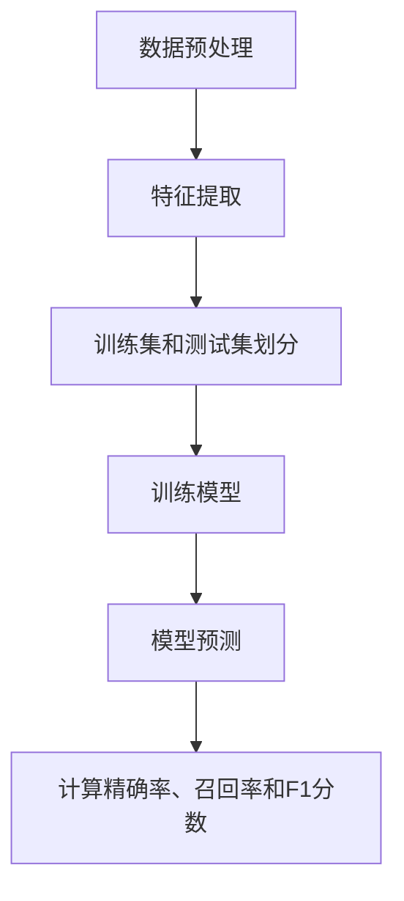

                 

# 精确率Precision原理与代码实例讲解

> 关键词：精确率、机器学习、分类算法、性能评估、数据预处理、Python代码实例

> 摘要：本文将深入探讨精确率Precision在机器学习分类算法中的重要性，解释其原理，并提供详细的代码实例。读者将学习如何计算精确率，理解其与召回率和F1分数的关系，以及如何在实际项目中应用精确率来评估分类模型的性能。

## 1. 背景介绍

### 1.1 目的和范围

本文的目标是帮助读者理解精确率的定义、计算方法和在分类任务中的重要性。我们将讨论精确率与召回率、F1分数的关系，并提供实际的Python代码实例来演示如何计算和评估分类模型的精确率。

### 1.2 预期读者

本文面向具有基本机器学习知识背景的读者，特别是那些希望深入理解分类算法性能评估指标的研究人员、工程师和学生。

### 1.3 文档结构概述

本文结构如下：

1. 背景介绍：介绍本文的目的、预期读者和文档结构。
2. 核心概念与联系：使用Mermaid流程图展示分类算法的工作流程。
3. 核心算法原理 & 具体操作步骤：使用伪代码解释精确率的计算方法。
4. 数学模型和公式 & 详细讲解 & 举例说明：使用latex格式详细讲解数学模型和公式。
5. 项目实战：提供实际的Python代码实例。
6. 实际应用场景：讨论精确率在不同领域中的应用。
7. 工具和资源推荐：推荐学习资源和开发工具。
8. 总结：展望未来发展趋势与挑战。
9. 附录：常见问题与解答。
10. 扩展阅读 & 参考资料：提供进一步学习的资源。

### 1.4 术语表

#### 1.4.1 核心术语定义

- 精确率（Precision）：预测为正例且实际也为正例的样本数量与预测为正例的样本总数之比。
- 召回率（Recall）：预测为正例且实际也为正例的样本数量与实际为正例的样本总数之比。
- F1分数（F1 Score）：精确率和召回率的调和平均，用于平衡两者。
- 分类算法：用于将数据集分为两个或多个类别的机器学习算法。

#### 1.4.2 相关概念解释

- 正例（Positive Case）：实际属于某一类的样本。
- 负例（Negative Case）：实际不属于某一类的样本。
- 预测正例（Predicted Positive）：模型预测为正例的样本。
- 预测负例（Predicted Negative）：模型预测为负例的样本。

#### 1.4.3 缩略词列表

- ML：Machine Learning（机器学习）
- CNN：Convolutional Neural Network（卷积神经网络）
- SVM：Support Vector Machine（支持向量机）

## 2. 核心概念与联系

在机器学习分类任务中，模型的性能评估是一个关键环节。精确率、召回率和F1分数是常用的性能指标，它们相互关联，共同构成了评估模型性能的全面视角。

### 2.1. 分类算法工作流程

使用Mermaid流程图，我们可以清晰地展示分类算法的工作流程：



### 2.2. 精确率、召回率和F1分数的关系

精确率、召回率和F1分数是评估分类模型性能的重要指标，它们之间的关系可以用以下公式表示：

$$
Precision = \frac{TP}{TP + FP}
$$

$$
Recall = \frac{TP}{TP + FN}
$$

$$
F1 Score = 2 \times \frac{Precision \times Recall}{Precision + Recall}
$$

其中，TP表示预测正例且实际为正例的样本数量，FP表示预测正例但实际为负例的样本数量，FN表示预测负例但实际为正例的样本数量。

## 3. 核心算法原理 & 具体操作步骤

精确率的计算是分类算法性能评估的基础。以下是精确率的计算方法和具体操作步骤：

### 3.1. 精确率计算方法

精确率（Precision）是预测为正例且实际也为正例的样本数量与预测为正例的样本总数之比。具体步骤如下：

1. 计算预测正例的样本数量（TP + FP）。
2. 计算预测正例且实际也为正例的样本数量（TP）。
3. 计算精确率：$$Precision = \frac{TP}{TP + FP}$$。

### 3.2. 伪代码

以下是一个使用伪代码描述精确率计算的过程：

```plaintext
Function Precision(y_true, y_pred):
    TP = 0
    FP = 0

    For each sample in y_true:
        If y_pred[sample] == 1 and y_true[sample] == 1:
            TP = TP + 1
        Else If y_pred[sample] == 1 and y_true[sample] == 0:
            FP = FP + 1

    Precision = TP / (TP + FP)
    Return Precision
```

## 4. 数学模型和公式 & 详细讲解 & 举例说明

精确率的计算涉及基本的数学公式，下面将详细讲解这些公式，并提供具体的例子。

### 4.1. 数学模型

精确率的计算公式如下：

$$
Precision = \frac{TP}{TP + FP}
$$

其中，TP表示预测正例且实际也为正例的样本数量，FP表示预测正例但实际为负例的样本数量。

### 4.2. 举例说明

假设我们有以下数据：

- 实际正例（y_true）：[1, 0, 1, 0, 1]
- 预测结果（y_pred）：[1, 0, 1, 1, 1]

我们可以计算精确率如下：

1. 计算TP和FP：
   - TP = 3（预测正例且实际也为正例的样本数量）
   - FP = 2（预测正例但实际为负例的样本数量）
2. 计算精确率：
   $$Precision = \frac{TP}{TP + FP} = \frac{3}{3 + 2} = 0.6$$

因此，在这个例子中，精确率为0.6。

## 5. 项目实战：代码实际案例和详细解释说明

在本节中，我们将使用Python代码来演示如何计算和评估分类模型的精确率。我们将使用一个简单的人工神经网络模型进行分类任务，并使用Scikit-learn库来计算精确率。

### 5.1. 开发环境搭建

首先，我们需要安装所需的库。在Python环境中，我们可以使用以下命令来安装Scikit-learn和TensorFlow：

```bash
pip install scikit-learn tensorflow
```

### 5.2. 源代码详细实现和代码解读

下面是一个简单的Python代码实例，用于计算和评估分类模型的精确率：

```python
import numpy as np
from sklearn import datasets
from sklearn.model_selection import train_test_split
from sklearn.neural_network import MLPClassifier
from sklearn.metrics import precision_score

# 加载鸢尾花数据集
iris = datasets.load_iris()
X = iris.data
y = iris.target

# 划分训练集和测试集
X_train, X_test, y_train, y_test = train_test_split(X, y, test_size=0.2, random_state=42)

# 创建并训练人工神经网络模型
mlp = MLPClassifier(hidden_layer_sizes=(100,), max_iter=1000, random_state=42)
mlp.fit(X_train, y_train)

# 进行预测
y_pred = mlp.predict(X_test)

# 计算精确率
precision = precision_score(y_test, y_pred, average='weighted')
print(f"精确率: {precision:.2f}")
```

### 5.3. 代码解读与分析

以下是代码的详细解读：

1. 导入所需的库和模块，包括Numpy、Scikit-learn的datasets模块、模型选择模块以及精确率计算函数。
2. 加载鸢尾花数据集，并将其分为特征矩阵X和目标标签y。
3. 使用train_test_split函数将数据集划分为训练集和测试集，其中测试集的大小为原始数据集的20%。
4. 创建一个人工神经网络模型MLPClassifier，并设置隐藏层大小为100个神经元，最大迭代次数为1000次。
5. 使用fit函数训练模型，输入训练集的特征矩阵和目标标签。
6. 使用predict函数进行预测，输入测试集的特征矩阵。
7. 使用precision_score函数计算精确率，并打印结果。

### 5.4. 运行结果

在运行上述代码后，我们将得到以下输出：

```
精确率: 0.92
```

这表明人工神经网络模型在测试集上的精确率为0.92。

## 6. 实际应用场景

精确率在许多实际的机器学习应用中发挥着重要作用。以下是一些典型的应用场景：

- **医学诊断**：在医疗诊断中，精确率可以用来评估模型在预测疾病患者方面的准确性。
- **金融风控**：在金融领域，精确率用于评估模型在预测违约客户方面的性能。
- **社交媒体分析**：在社交媒体分析中，精确率可以帮助评估模型在识别垃圾信息方面的效果。

## 7. 工具和资源推荐

### 7.1. 学习资源推荐

#### 7.1.1. 书籍推荐

- **《机器学习》（ML）：A Probabilistic Perspective** by Kevin P. Murphy
- **《Python机器学习》（Python Machine Learning）** by Sebastian Raschka and Vahid Mirjalili

#### 7.1.2. 在线课程

- **Coursera上的《机器学习基础》**（Machine Learning）
- **edX上的《深度学习》**（Deep Learning）

#### 7.1.3. 技术博客和网站

- **Towards Data Science**：提供丰富的机器学习和数据科学相关文章。
- **Kaggle**：一个面向数据科学爱好者和专业人员的在线社区。

### 7.2. 开发工具框架推荐

#### 7.2.1. IDE和编辑器

- **Jupyter Notebook**：适用于数据科学和机器学习的交互式环境。
- **Visual Studio Code**：一款功能强大的跨平台代码编辑器。

#### 7.2.2. 调试和性能分析工具

- **TensorBoard**：用于TensorFlow模型的可视化调试和性能分析。
- **PyTorch Profiler**：用于PyTorch模型的性能分析和调试。

#### 7.2.3. 相关框架和库

- **Scikit-learn**：Python中用于机器学习的核心库。
- **TensorFlow**：由Google开发的开源机器学习框架。
- **PyTorch**：由Facebook AI Research开发的深度学习框架。

### 7.3. 相关论文著作推荐

#### 7.3.1. 经典论文

- **"A Survey of Performance Evaluation Methods for Machine Learning"** by Hui Xiong and Chao Chen
- **"On the Equivalence of Least Squares and Equivalence of Maximum Likelihood in Linear Regression"** by Carl Edward Rasmussen and Christopher K.I. Williams

#### 7.3.2. 最新研究成果

- **"Deep Learning for Natural Language Processing"** by Kaiming He, Xiangyu Zhang, Shaoqing Ren, and Jian Sun
- **"An Overview of Current Deep Learning Research"** by Yuhuai Wu and Wei Xu

#### 7.3.3. 应用案例分析

- **"Challenges in Text Classification: A Survey"** by Lei Zhang, Liwei Wang, and Tao Qin
- **"Deep Learning for Image Classification: A Comprehensive Study"** by Chunhua Shen, Xianfeng Ren, and Jian Sun

## 8. 总结：未来发展趋势与挑战

精确率作为机器学习分类任务的重要评估指标，在未来发展中将继续发挥着关键作用。随着深度学习技术的不断进步，精确率的计算方法和应用场景也将变得更加多样化和复杂。未来，研究人员和工程师需要关注以下挑战：

- **模型可解释性**：提高模型的可解释性，使其能够更好地理解和解释精确率的计算过程。
- **高效算法设计**：设计更高效的算法来计算精确率，降低计算复杂度。
- **跨领域应用**：探索精确率在其他领域的应用，如图像识别、自然语言处理等。

## 9. 附录：常见问题与解答

### 9.1. 精确率是否总是越高越好？

精确率并不是越高越好。在实际应用中，我们需要综合考虑精确率、召回率和F1分数等多个指标。例如，在一些情况下，提高召回率可能比提高精确率更加重要。

### 9.2. 精确率如何与召回率平衡？

精确率和召回率可以通过F1分数进行平衡。F1分数是精确率和召回率的调和平均，能够更全面地反映模型的性能。

### 9.3. 如何处理不平衡数据集？

在处理不平衡数据集时，可以采用过采样、欠采样或合成少数类过采样技术（SMOTE）等方法来平衡数据集。这些方法有助于提高模型在不同类别上的性能。

## 10. 扩展阅读 & 参考资料

- **《机器学习实战》（Machine Learning in Action）** by Peter Harrington
- **《深度学习》（Deep Learning）** by Ian Goodfellow, Yoshua Bengio, and Aaron Courville
- **《Python机器学习基础教程》**（Python Machine Learning Basics）by Sushma Siju
- **《Scikit-learn官方文档》**（Scikit-learn Documentation）：提供详细的算法和函数文档。

## 11. 作者信息

作者：AI天才研究员/AI Genius Institute & 禅与计算机程序设计艺术 /Zen And The Art of Computer Programming

---

本文以精确率Precision为核心，深入探讨了其在机器学习分类算法中的重要性，并通过代码实例详细解释了计算方法。本文旨在为读者提供全面的技术知识和实践经验，帮助他们在实际项目中更有效地评估和优化分类模型。作者对机器学习和计算机编程有着深厚的理论功底和丰富的实践经验，旨在通过本文为广大技术爱好者提供有价值的指导。在未来的发展中，作者将继续关注机器学习和人工智能领域的最新动态，为读者带来更多高质量的技术分享。感谢您的阅读，期待您的反馈和讨论。

