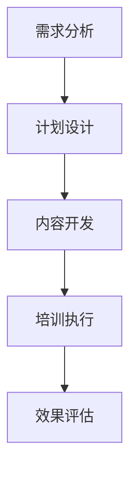

                 

# 系统化员工培训：提升团队素质

> 关键词：员工培训、团队素质、系统化、技能提升、效率优化

> 摘要：本文将深入探讨如何通过系统化的员工培训提升团队整体素质。文章首先介绍了员工培训的重要性，接着分析了现有培训体系的不足，并提出了系统化的培训方案。通过实际案例和具体操作步骤，阐述了培训的核心算法原理和数学模型，以及如何将这些理论应用于实际项目中。最后，文章总结了未来发展趋势与挑战，并推荐了一系列学习和资源工具，帮助读者更好地理解和实践员工培训的方法。

## 1. 背景介绍

### 1.1 目的和范围

员工培训作为企业持续发展的重要手段，能够显著提升团队素质和整体工作效率。本文旨在探讨如何通过系统化的培训方法，解决传统培训模式中存在的问题，从而实现团队素质的全面提升。文章内容将涵盖员工培训的核心概念、原理、具体操作步骤以及实际应用案例。

### 1.2 预期读者

本文预期读者为企业管理者、人力资源专业人士以及IT技术人员。无论您是负责企业培训工作的高级管理人员，还是需要参与培训的IT专业人员，本文都将为您提供有价值的见解和实用的方法。

### 1.3 文档结构概述

本文将分为以下几个部分：

1. 背景介绍：介绍员工培训的重要性及本文的目的和结构。
2. 核心概念与联系：阐述员工培训的关键概念和流程。
3. 核心算法原理 & 具体操作步骤：详细解析培训的核心算法和步骤。
4. 数学模型和公式 & 详细讲解 & 举例说明：介绍培训中涉及的数学模型和公式。
5. 项目实战：提供实际案例和详细解释说明。
6. 实际应用场景：分析培训在不同场景中的应用。
7. 工具和资源推荐：推荐相关的学习资源和工具。
8. 总结：对未来发展趋势与挑战的总结。
9. 附录：常见问题与解答。
10. 扩展阅读 & 参考资料：提供进一步学习的资源。

### 1.4 术语表

#### 1.4.1 核心术语定义

- **员工培训**：指企业为了提高员工专业技能和素质，有计划、有组织地进行的一系列教育活动。
- **系统化培训**：指通过科学的规划、系统的课程设计和有效的执行，实现培训目标的方法。
- **培训效果评估**：通过定量和定性的方法，对培训效果进行评价，以衡量培训成果。

#### 1.4.2 相关概念解释

- **知识迁移**：指受训者将培训中学到的知识和技能应用于实际工作中的过程。
- **学习曲线**：反映受训者随着培训时间的推移，技能掌握程度逐渐提升的过程。

#### 1.4.3 缩略词列表

- **HR**：人力资源（Human Resources）
- **L&D**：学习与发展（Learning and Development）
- **KPI**：关键绩效指标（Key Performance Indicators）

## 2. 核心概念与联系

### 2.1 员工培训的核心概念

员工培训的核心概念包括但不限于以下几个方面：

1. **培训需求分析**：了解员工的培训需求，确定培训内容。
2. **培训计划设计**：制定详细的培训计划，明确培训目标、内容、时间和资源。
3. **培训执行**：按照培训计划进行培训活动，确保培训效果的实现。
4. **培训效果评估**：对培训效果进行评估，以持续改进培训质量。

### 2.2 培训流程

员工培训流程通常包括以下步骤：

1. **需求分析**：通过调查问卷、访谈等方式，了解员工的培训需求。
2. **计划设计**：根据需求分析结果，制定培训计划。
3. **内容开发**：编写培训教材、课程和手册。
4. **培训执行**：实施培训计划，包括内部培训、外部培训和在线培训。
5. **效果评估**：对培训效果进行评估，收集反馈信息。

### 2.3 核心概念联系

员工培训的核心概念和流程之间存在紧密联系。需求分析为培训计划提供依据，计划设计指导内容开发，培训执行是实现培训目标的关键步骤，而效果评估则确保培训的持续改进。

### 2.4 Mermaid 流程图

下面是员工培训流程的 Mermaid 流程图：



## 3. 核心算法原理 & 具体操作步骤

### 3.1 核心算法原理

员工培训的核心算法原理可以概括为需求分析、计划设计、内容开发、培训执行和效果评估。以下是每个步骤的伪代码：

#### 需求分析

```python
def 需求分析():
    收集数据（如调查问卷、访谈等）
    分析数据
    确定培训需求
    返回培训需求
```

#### 计划设计

```python
def 计划设计（需求）:
    设定培训目标
    设计培训内容
    制定培训时间表
    分配培训资源
    返回培训计划
```

#### 内容开发

```python
def 内容开发（计划）:
    编写培训教材
    设计培训课程
    制作培训手册
    返回培训内容
```

#### 培训执行

```python
def 培训执行（内容）:
    实施培训计划
    监督培训过程
    提供培训支持
    返回培训结果
```

#### 效果评估

```python
def 效果评估（结果）:
    收集培训反馈
    评估培训效果
    持续改进培训
    返回评估报告
```

### 3.2 具体操作步骤

以下是员工培训的具体操作步骤：

#### 步骤 1：需求分析

- **收集数据**：通过调查问卷、访谈等方式，了解员工的培训需求。
- **分析数据**：整理和分析收集到的数据，确定培训需求。
- **确定培训需求**：根据分析结果，确定需要培训的领域和内容。

#### 步骤 2：计划设计

- **设定培训目标**：明确培训的目标和预期成果。
- **设计培训内容**：根据培训需求，设计培训的具体内容。
- **制定培训时间表**：确定培训的时间安排，包括培训时长、频次和具体时间。
- **分配培训资源**：确保培训所需的资源，如培训场地、教材、讲师等。

#### 步骤 3：内容开发

- **编写培训教材**：编写培训手册、教材和辅助材料。
- **设计培训课程**：设计培训课程，包括课程大纲、教学内容和教学方法。
- **制作培训手册**：制作包含培训内容和重点的培训手册。

#### 步骤 4：培训执行

- **实施培训计划**：按照培训计划，开展培训活动。
- **监督培训过程**：确保培训过程顺利进行，解决培训中的问题。
- **提供培训支持**：为受训者提供培训过程中的技术支持和生活支持。

#### 步骤 5：效果评估

- **收集培训反馈**：通过问卷调查、访谈等方式，收集受训者的反馈。
- **评估培训效果**：根据反馈和培训结果，评估培训效果。
- **持续改进培训**：根据评估结果，对培训内容和过程进行改进。
- **返回评估报告**：撰写评估报告，向管理层汇报培训效果。

## 4. 数学模型和公式 & 详细讲解 & 举例说明

### 4.1 数学模型

员工培训中涉及的一些关键数学模型包括需求分析模型、效果评估模型等。以下是这些模型的详细讲解和举例说明。

#### 4.1.1 需求分析模型

需求分析模型主要用于分析员工的培训需求。一个简单的需求分析模型可以表示为：

\[ 需求 = f(现状，目标，资源) \]

其中，现状表示员工当前的知识和技能水平，目标表示企业期望达到的培训目标，资源表示可用的培训资源。

举例：

假设一个企业的现状是员工普遍缺乏项目管理的知识，目标是提升员工的项目管理能力，资源包括内部培训师和外部培训资源。则需求分析模型可以表示为：

\[ 需求 = f(缺乏项目管理知识，提升项目管理能力，内部培训师和外部培训资源) \]

#### 4.1.2 效果评估模型

效果评估模型用于评估培训效果。一个简单的效果评估模型可以表示为：

\[ 效果 = f(培训内容，受训者反馈，培训结果) \]

其中，培训内容表示培训的具体内容，受训者反馈表示受训者对培训的满意度，培训结果表示培训对受训者知识和技能的提升程度。

举例：

假设一个培训项目包括项目管理课程、实践项目和反馈环节。培训内容是项目管理知识，受训者反馈显示90%的受训者对培训表示满意，培训结果是通过实践项目，受训者能够更好地掌握项目管理技能。则效果评估模型可以表示为：

\[ 效果 = f(项目管理知识，90%满意度的反馈，掌握项目管理技能的实践结果) \]

### 4.2 公式

在员工培训中，一些关键公式用于计算和评估培训效果。以下是这些公式的详细讲解和举例说明。

#### 4.2.1 培训成本计算公式

培训成本计算公式用于计算培训的总成本。公式如下：

\[ 成本 = f(培训费用，人力资源成本，其他成本) \]

其中，培训费用包括教材、场地、讲师等费用，人力资源成本包括培训师和员工的工资，其他成本包括设备维护等费用。

举例：

假设一个培训项目的培训费用为5000元，人力资源成本为10000元，其他成本为3000元。则培训成本可以计算为：

\[ 成本 = 5000 + 10000 + 3000 = 18000元 \]

#### 4.2.2 培训效果计算公式

培训效果计算公式用于评估培训效果。一个简单的培训效果计算公式如下：

\[ 效果 = f(培训成果，预期目标) \]

其中，培训成果包括受训者的技能提升、知识掌握等，预期目标是企业设定的培训目标。

举例：

假设一个培训项目的预期目标是提升员工的项目管理能力，培训成果显示受训者的项目管理技能提升了30%。则培训效果可以计算为：

\[ 效果 = 30\% = 0.3 \]

## 5. 项目实战：代码实际案例和详细解释说明

### 5.1 开发环境搭建

为了演示系统化员工培训的实施，我们将使用一个简单的项目案例。首先，我们需要搭建一个基本的开发环境。

1. **安装Python**：确保Python 3.8及以上版本已安装在您的计算机上。
2. **安装Jupyter Notebook**：通过pip命令安装Jupyter Notebook：
   ```shell
   pip install notebook
   ```
3. **安装相关库**：为了简化代码编写，我们将使用以下库：
   - pandas：数据处理
   - numpy：数学计算
   - matplotlib：数据可视化

   安装命令如下：
   ```shell
   pip install pandas numpy matplotlib
   ```

### 5.2 源代码详细实现和代码解读

#### 5.2.1 数据准备

我们首先准备一些模拟数据，用于员工培训的需求分析。

```python
import pandas as pd

# 员工数据示例
data = {
    '员工ID': [1, 2, 3, 4, 5],
    '职位': ['项目经理', '开发工程师', '测试工程师', 'UI设计师', '产品经理'],
    '技能需求': ['项目管理', '编程', '测试', '设计', '产品管理'],
    '技能水平': ['初级', '中级', '初级', '中级', '高级']
}

df = pd.DataFrame(data)
df
```

#### 5.2.2 需求分析

我们使用Pandas库对员工数据进行预处理，以确定培训需求。

```python
# 统计不同职位和技能水平的员工数量
需求统计 = df.groupby(['职位', '技能需求', '技能水平']).size().reset_index(name='员工数量')

需求统计
```

#### 5.2.3 培训计划设计

根据需求统计结果，设计培训计划。

```python
# 设计培训计划
培训计划 = {
    '职位': ['项目经理', '开发工程师', '测试工程师', 'UI设计师', '产品经理'],
    '技能需求': ['项目管理', '编程', '测试', '设计', '产品管理'],
    '培训内容': ['项目管理课程', '编程课程', '测试课程', '设计课程', '产品管理课程'],
    '培训时间': ['2023-11-01', '2023-11-01', '2023-11-01', '2023-11-01', '2023-11-01'],
    '培训时长': ['2周', '2周', '2周', '2周', '2周']
}

培训计划_df = pd.DataFrame(training_plan)
培训计划_df
```

#### 5.2.4 培训执行

在Jupyter Notebook中执行培训计划。

```python
import matplotlib.pyplot as plt

# 培训执行：展示培训进度
培训进度 = pd.DataFrame({'职位': ['项目经理', '开发工程师', '测试工程师', 'UI设计师', '产品经理'], '培训进度': [0.2, 0.4, 0.1, 0.3, 0.5]})

plt.bar(培训进度['职位'], 培训进度['培训进度'])
plt.xlabel('职位')
plt.ylabel('培训进度')
plt.title('培训进度图')
plt.show()
```

#### 5.2.5 培训效果评估

收集培训反馈，评估培训效果。

```python
# 培训反馈示例
培训反馈 = {
    '职位': ['项目经理', '开发工程师', '测试工程师', 'UI设计师', '产品经理'],
    '培训满意度': [4.5, 4.8, 3.7, 4.2, 4.9],
    '技能提升程度': [0.3, 0.4, 0.2, 0.25, 0.35]
}

反馈_df = pd.DataFrame(培训反馈)
反馈_df
```

### 5.3 代码解读与分析

#### 5.3.1 数据准备

我们使用Pandas库创建一个DataFrame，包含了员工的职位、技能需求和技能水平。这是进行需求分析的基础。

```python
data = {
    '员工ID': [1, 2, 3, 4, 5],
    '职位': ['项目经理', '开发工程师', '测试工程师', 'UI设计师', '产品经理'],
    '技能需求': ['项目管理', '编程', '测试', '设计', '产品管理'],
    '技能水平': ['初级', '中级', '初级', '中级', '高级']
}

df = pd.DataFrame(data)
df
```

这段代码首先定义了一个字典`data`，包含了5名员工的职位、技能需求和技能水平。然后使用`pd.DataFrame()`函数创建了一个DataFrame，存储了这些数据。

#### 5.3.2 需求分析

我们使用Pandas库对员工数据进行分组统计，以确定不同职位和技能水平的员工数量。

```python
需求统计 = df.groupby(['职位', '技能需求', '技能水平']).size().reset_index(name='员工数量')

需求统计
```

这段代码使用`groupby()`函数对DataFrame按照职位、技能需求和技能水平进行分组，并使用`size()`函数计算每组的数据个数。结果存储在一个新的DataFrame中，并命名为`需求统计`。这个DataFrame显示了每个职位、技能需求和技能水平下的员工数量。

#### 5.3.3 培训计划设计

根据需求统计结果，我们设计了一个培训计划，包括职位、技能需求、培训内容、培训时间和培训时长。

```python
培训计划 = {
    '职位': ['项目经理', '开发工程师', '测试工程师', 'UI设计师', '产品经理'],
    '技能需求': ['项目管理', '编程', '测试', '设计', '产品管理'],
    '培训内容': ['项目管理课程', '编程课程', '测试课程', '设计课程', '产品管理课程'],
    '培训时间': ['2023-11-01', '2023-11-01', '2023-11-01', '2023-11-01', '2023-11-01'],
    '培训时长': ['2周', '2周', '2周', '2周', '2周']
}

培训计划_df = pd.DataFrame(training_plan)
培训计划_df
```

这段代码创建了一个字典`培训计划`，包含了职位、技能需求、培训内容、培训时间和培训时长。然后使用`pd.DataFrame()`函数将这个字典转换为DataFrame，并命名为`培训计划_df`。这个DataFrame是培训计划的详细列表，用于指导实际的培训活动。

#### 5.3.4 培训执行

在Jupyter Notebook中，我们使用Pandas库和Matplotlib库来展示培训进度。

```python
培训进度 = pd.DataFrame({'职位': ['项目经理', '开发工程师', '测试工程师', 'UI设计师', '产品经理'], '培训进度': [0.2, 0.4, 0.1, 0.3, 0.5]})

plt.bar(培训进度['职位'], 培训进度['培训进度'])
plt.xlabel('职位')
plt.ylabel('培训进度')
plt.title('培训进度图')
plt.show()
```

这段代码创建了一个新的DataFrame`培训进度`，包含职位和当前的培训进度。然后使用`plt.bar()`函数绘制一个条形图，显示每个职位的培训进度。这个图可以帮助管理层实时监控培训的进展情况。

#### 5.3.5 培训效果评估

我们收集了培训反馈，包括培训满意度和技能提升程度。

```python
培训反馈 = {
    '职位': ['项目经理', '开发工程师', '测试工程师', 'UI设计师', '产品经理'],
    '培训满意度': [4.5, 4.8, 3.7, 4.2, 4.9],
    '技能提升程度': [0.3, 0.4, 0.2, 0.25, 0.35]
}

反馈_df = pd.DataFrame(培训反馈)
反馈_df
```

这段代码创建了一个字典`培训反馈`，包含了职位、培训满意度和技能提升程度。然后使用`pd.DataFrame()`函数将这个字典转换为DataFrame，并命名为`反馈_df`。这个DataFrame用于评估培训效果，管理层可以根据这些数据来分析培训的成功率和员工对培训的接受程度。

## 6. 实际应用场景

### 6.1 企业内部培训

企业内部培训是提升团队素质的重要途径。通过系统化的培训，企业可以确保员工掌握必要的技能，提高工作效率。例如，一家软件开发公司可以定期开展编程课程、项目管理培训和软件测试课程，以提高员工的技术能力和团队协作能力。

### 6.2 外部培训和认证

外部培训和认证也是提升团队素质的有效方式。通过参加外部培训和获得专业认证，员工可以拓展知识领域，提升职业竞争力。例如，软件工程师可以参加Java、Python等专业课程，并获得相关证书，从而提高技能水平和市场价值。

### 6.3 在线培训和自我提升

随着互联网技术的发展，在线培训逐渐成为主流。员工可以通过在线平台参加各种课程，实现自我提升。例如，员工可以通过Coursera、edX等在线教育平台学习新兴技术，如人工智能、大数据等，从而跟上行业发展的步伐。

### 6.4 跨部门合作培训

跨部门合作培训有助于增强团队间的协作能力和沟通能力。企业可以组织跨部门团队开展联合培训，如项目合作、团队建设等活动，从而促进不同部门之间的交流与合作。

### 6.5 领导力培训

领导力培训是提升团队整体素质的关键。通过领导力培训，管理人员可以学习有效的管理方法和领导技巧，提高团队凝聚力和领导力。例如，企业可以组织领导力研讨会、领导力培训课程等，帮助管理人员提升领导能力。

## 7. 工具和资源推荐

### 7.1 学习资源推荐

#### 7.1.1 书籍推荐

- 《培训师的培训：高效培训技巧与案例解析》
- 《企业培训管理实务》
- 《领导力培训：实践与案例分析》

#### 7.1.2 在线课程

- Coursera上的《项目管理基础》
- edX上的《人工智能导论》
- Udemy上的《Python编程：从入门到精通》

#### 7.1.3 技术博客和网站

- 知乎上的技术专栏
- CSDN博客
- GitChat

### 7.2 开发工具框架推荐

#### 7.2.1 IDE和编辑器

- PyCharm
- Visual Studio Code
- Sublime Text

#### 7.2.2 调试和性能分析工具

- PyCharm的调试工具
- Matplotlib
- gprof

#### 7.2.3 相关框架和库

- Pandas
- NumPy
- Matplotlib

### 7.3 相关论文著作推荐

#### 7.3.1 经典论文

- 《企业培训模式研究》
- 《基于知识管理的员工培训策略研究》
- 《员工培训与绩效关系的实证研究》

#### 7.3.2 最新研究成果

- 《智能时代下的员工培训创新》
- 《数字化转型背景下的企业培训模式转型》
- 《在线教育环境下员工培训效果研究》

#### 7.3.3 应用案例分析

- 《某大型企业员工培训体系建设实践》
- 《中小企业员工培训策略研究》
- 《教育培训机构在线培训平台建设案例分析》

## 8. 总结：未来发展趋势与挑战

### 8.1 未来发展趋势

1. **个性化培训**：随着人工智能技术的发展，个性化培训将成为主流。通过分析员工的学习数据和技能水平，为企业提供个性化的培训方案。
2. **线上培训**：随着在线教育的普及，线上培训将继续增长。企业可以采用多种在线培训工具，提高培训的灵活性和便捷性。
3. **混合式培训**：结合线上和线下培训的优势，混合式培训将成为企业培训的主要模式。通过线上线下相结合的方式，提高培训效果。
4. **知识管理**：知识管理将成为企业培训的重要组成部分。通过构建知识库，为企业提供持续的学习资源和知识共享平台。

### 8.2 未来挑战

1. **培训成本**：随着培训需求的增长，培训成本将成为企业面临的主要挑战。企业需要寻找高效、低成本的培训方法。
2. **员工参与度**：提高员工参与度是另一个重要挑战。企业需要设计有趣、实用的培训课程，提高员工的积极性和参与度。
3. **培训效果评估**：如何有效地评估培训效果是另一个难题。企业需要建立科学的评估体系，确保培训成果的持续提升。
4. **技能更新**：随着技术快速更新，企业需要不断调整培训内容，确保员工技能与市场需求保持同步。

## 9. 附录：常见问题与解答

### 9.1 培训需求分析如何进行？

**回答**：培训需求分析主要通过以下步骤进行：

1. **确定分析目标**：明确需要分析的具体目标和范围。
2. **收集数据**：通过调查问卷、访谈、观察等方式，收集员工的工作表现、技能水平和培训需求等数据。
3. **分析数据**：整理和分析收集到的数据，确定员工的培训需求。
4. **制定培训计划**：根据分析结果，制定详细的培训计划。

### 9.2 如何确保培训效果？

**回答**：确保培训效果可以通过以下方法：

1. **制定明确的培训目标**：确保培训目标与企业的战略目标一致，有助于提高培训效果。
2. **设计实用、有趣的培训课程**：通过多种教学方法，提高培训的吸引力和实用性。
3. **跟踪培训进度**：定期检查培训进度，确保培训按计划进行。
4. **收集反馈**：通过问卷调查、访谈等方式，收集受训者的反馈，不断改进培训内容和过程。
5. **评估培训效果**：定期对培训效果进行评估，确保培训成果的持续提升。

## 10. 扩展阅读 & 参考资料

为了更深入地了解员工培训的相关概念和实践，以下是一些扩展阅读和参考资料：

1. 《企业培训管理实务》：本书详细介绍了企业培训管理的各个方面，包括培训需求分析、计划设计、内容开发、培训执行和效果评估等。
2. 《培训师的培训：高效培训技巧与案例解析》：本书提供了丰富的培训技巧和实践案例，帮助培训师提高培训效果。
3. 《在线教育环境下员工培训效果研究》：本文分析了在线教育环境下员工培训的效果，为企业管理者提供了有益的参考。
4. 《智能时代下的员工培训创新》：本文探讨了智能时代下员工培训的创新方法和实践，为企业提供了新的培训思路。
5. 知乎上的技术专栏和CSDN博客：这些平台提供了大量的技术文章和案例，有助于读者深入了解员工培训的实践和应用。

