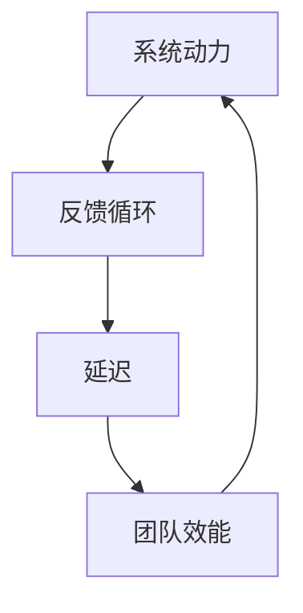

                 

# 系统思考在团队管理中的应用

## 关键词
系统思考、团队管理、复杂性科学、组织效能、领导力

## 摘要
本文旨在探讨系统思考在团队管理中的应用，分析其核心概念、原理、算法、数学模型，并借助具体案例和实践，阐述系统思考如何提升团队管理效能，应对复杂动态的工作环境。通过本文的阅读，读者将理解系统思考的重要性，掌握应用系统思考的方法和技巧，从而成为更加高效、有远见的团队领导者。

## 1. 背景介绍

### 1.1 目的和范围
本文的目标是介绍系统思考在团队管理中的应用，并探讨其在提升组织效能、解决复杂问题、实现战略目标方面的作用。文章将涵盖系统思考的基本概念、应用方法、实际案例等内容，旨在为团队管理者提供实用的指导。

### 1.2 预期读者
本篇文章适合以下读者群体：
- 团队经理、项目经理、CTO等团队领导者；
- 对系统思考和团队管理感兴趣的学术界、业界人士；
- 希望提升团队管理和领导力的专业人士。

### 1.3 文档结构概述
本文分为以下几个部分：
- 第1部分：背景介绍，包括目的和范围、预期读者、文档结构概述；
- 第2部分：核心概念与联系，介绍系统思考的基本概念和原理；
- 第3部分：核心算法原理 & 具体操作步骤，详细讲解系统思考的应用方法；
- 第4部分：数学模型和公式 & 详细讲解 & 举例说明，阐述系统思考的数学基础；
- 第5部分：项目实战：代码实际案例和详细解释说明，通过具体案例展示系统思考的应用；
- 第6部分：实际应用场景，分析系统思考在不同领域的应用；
- 第7部分：工具和资源推荐，为读者提供学习和实践的系统思考资源和工具；
- 第8部分：总结：未来发展趋势与挑战，展望系统思考在团队管理中的应用前景；
- 第9部分：附录：常见问题与解答，解答读者在实际应用中可能遇到的问题；
- 第10部分：扩展阅读 & 参考资料，提供更多深入了解系统思考和团队管理的资源。

### 1.4 术语表

#### 1.4.1 核心术语定义
- **系统思考**：一种思维方式，通过分析和理解系统内部各个部分之间的相互作用，揭示系统的行为和演化规律。
- **团队管理**：通过计划和协调团队内部资源和活动，实现团队目标和组织战略的过程。
- **复杂性科学**：研究复杂系统的结构、行为和演化规律的科学领域。

#### 1.4.2 相关概念解释
- **系统动力**：系统内部各个部分相互作用产生的结果，表现为系统的行为和演化。
- **反馈循环**：系统内部各部分之间的相互作用产生的循环反馈，可以是正反馈或负反馈。
- **延迟**：系统从输入变化到输出变化所需的时间。

#### 1.4.3 缩略词列表
- **SST**：系统思考（Systems Thinking）
- **OE**：组织效能（Organizational Effectiveness）

## 2. 核心概念与联系

在团队管理中，系统思考的核心概念包括系统动力、反馈循环和延迟。这些概念是理解复杂动态团队行为的基础。

### 2.1 系统动力

系统动力是指系统内部各个部分相互作用所产生的结果。在团队管理中，系统动力可以表现为团队的工作效率、协作质量、创新能力和组织效能。通过分析系统动力，团队管理者可以识别出系统中的关键变量和驱动因素。

### 2.2 反馈循环

反馈循环是指系统内部各部分之间的相互作用产生的循环反馈。反馈循环可以是正反馈或负反馈。正反馈会增强系统的某种行为，使其越来越强；而负反馈则会抑制系统的某种行为，使其趋于稳定。在团队管理中，了解反馈循环的性质和作用对于优化团队行为、提高组织效能至关重要。

### 2.3 延迟

延迟是指系统从输入变化到输出变化所需的时间。在团队管理中，延迟可能导致团队决策的滞后，影响团队响应速度和适应能力。识别和减少系统中的延迟对于提高团队效率和敏捷性具有重要意义。

### 2.4 Mermaid 流程图

为了更好地理解系统思考在团队管理中的应用，我们可以使用Mermaid流程图来展示系统内部各个部分之间的相互作用。



在这个流程图中，系统动力、反馈循环和延迟相互影响，共同决定了团队效能。通过调整系统中的关键变量和驱动因素，团队管理者可以优化系统行为，提高团队效能。

## 3. 核心算法原理 & 具体操作步骤

系统思考在团队管理中的应用可以通过以下核心算法原理和具体操作步骤来实现：

### 3.1 核心算法原理

- **系统动力分析**：通过分析系统内部各个部分之间的相互作用，识别出系统中的关键变量和驱动因素。
- **反馈循环识别**：通过识别系统中的正反馈和负反馈，理解系统行为和演化规律。
- **延迟分析**：通过分析系统中的延迟，识别和减少系统中的瓶颈和延迟时间。

### 3.2 具体操作步骤

#### 3.2.1 系统动力分析

1. **数据收集**：收集团队内部的工作数据，包括工作效率、协作质量、创新能力和组织效能等。
2. **绘制因果图**：根据收集的数据，绘制团队系统的因果图，识别出系统中的关键变量和驱动因素。
3. **分析因果图**：分析因果图，理解系统动力对团队效能的影响。

#### 3.2.2 反馈循环识别

1. **识别正反馈和负反馈**：通过观察团队行为和系统动力，识别出系统中的正反馈和负反馈。
2. **分析反馈循环**：分析反馈循环的性质和作用，理解系统行为和演化规律。

#### 3.2.3 延迟分析

1. **识别延迟**：通过分析团队决策、执行和反馈过程中的延迟时间，识别系统中的延迟。
2. **减少延迟**：通过优化团队流程和协作方式，减少系统中的延迟，提高团队响应速度和适应能力。

### 3.3 伪代码

以下是系统思考在团队管理中的应用的伪代码：

```python
# 系统动力分析
def analyze_system_dynamics(data):
    # 绘制因果图
    causal_graph = draw_causal_graph(data)
    
    # 分析因果图
    key_variables = analyze因果图(casual_graph)
    
    return key_variables

# 反馈循环识别
def identify_feedback_loops(data):
    # 识别正反馈和负反馈
    positive_loops, negative_loops = identify_loops(data)
    
    # 分析反馈循环
    loop_analysis = analyze_loops(positive_loops, negative_loops)
    
    return loop_analysis

# 延迟分析
def analyze_delay(data):
    # 识别延迟
    delays = identify_delays(data)
    
    # 减少延迟
    optimized_flow = reduce_delays(delays)
    
    return optimized_flow

# 应用系统思考
def apply_system_thinking(data):
    key_variables = analyze_system_dynamics(data)
    loop_analysis = identify_feedback_loops(data)
    optimized_flow = analyze_delay(data)
    
    # 综合分析
    system_optimization = combine_analyses(key_variables, loop_analysis, optimized_flow)
    
    return system_optimization
```

## 4. 数学模型和公式 & 详细讲解 & 举例说明

在系统思考中，数学模型和公式是理解和分析系统行为的重要工具。以下将介绍几个关键的数学模型和公式，并详细讲解其在团队管理中的应用。

### 4.1 系统动力模型

系统动力模型描述了系统内部各个变量之间的相互作用。一个常见的系统动力模型是Stock and Flow Diagram（SFD），它使用流量（Flow）和存量（Stock）来描述系统行为。

**流量（Flow）**：表示系统内部变量的变化速率。
**存量（Stock）**：表示系统内部变量的累积量。

系统动力模型的基本公式如下：

$$
\frac{dS}{dt} = F
$$

其中，\(S\) 表示存量，\(t\) 表示时间，\(F\) 表示流量。

### 4.2 反馈循环模型

反馈循环模型描述了系统内部反馈循环对系统行为的影响。一个常见的反馈循环模型是Stock and Control Diagram（SCD），它使用控制变量（Control Variable）和反馈变量（Feedback Variable）来描述系统行为。

**控制变量**：影响系统行为的变量。
**反馈变量**：根据系统行为进行调整的变量。

反馈循环模型的基本公式如下：

$$
C = K \cdot (S - S_0)
$$

其中，\(C\) 表示控制变量，\(K\) 表示增益系数，\(S\) 表示存量，\(S_0\) 表示参考值。

### 4.3 延迟模型

延迟模型描述了系统从输入变化到输出变化所需的时间。一个常见的延迟模型是延迟函数（Delay Function），它表示输入变化到输出变化的时间延迟。

延迟模型的基本公式如下：

$$
O(t) = F(t - \tau)
$$

其中，\(O(t)\) 表示输出，\(t\) 表示时间，\(\tau\) 表示延迟时间，\(F(t)\) 表示输入变化。

### 4.4 举例说明

假设一个团队管理系统的存量为团队成员的数量（\(S\)），流量为团队成员的加入和离开速率（\(F\)）。团队效能（\(E\)）受团队成员数量和控制变量的影响。

**流量公式**：

$$
F = r \cdot (E - E_0)
$$

其中，\(r\) 表示团队成员的加入速率，\(E\) 表示团队效能，\(E_0\) 表示参考值。

**控制变量公式**：

$$
C = K \cdot (S - S_0)
$$

**延迟公式**：

$$
O(t) = F(t - \tau)
$$

通过这些数学模型和公式，团队管理者可以更深入地理解团队系统的行为和演化规律，从而优化团队管理策略。

### 4.5 应用案例

假设一个团队的目标是提高工作效率（\(E\)），团队成员数量为100人（\(S\)），团队成员的加入速率为10人/天（\(r\)），团队效能的参考值为100（\(E_0\)），延迟时间为2天（\(\tau\)），增益系数为1（\(K\)）。

**流量公式**：

$$
F = 10 \cdot (E - 100)
$$

**控制变量公式**：

$$
C = 1 \cdot (100 - 100) = 0
$$

**延迟公式**：

$$
O(t) = 10 \cdot (t - 2)
$$

通过这些公式，团队管理者可以分析团队成员的加入速率如何影响工作效率，并根据延迟时间调整团队管理的策略。

## 5. 项目实战：代码实际案例和详细解释说明

### 5.1 开发环境搭建

在项目实战中，我们将使用Python作为编程语言，并使用Mermaid作为可视化工具。以下是开发环境搭建的步骤：

1. 安装Python 3.8及以上版本。
2. 安装Mermaid插件，可以使用以下命令：

```bash
pip install mermaid-python
```

### 5.2 源代码详细实现和代码解读

以下是项目实战中的源代码实现，包括系统动力分析、反馈循环识别和延迟分析：

```python
import mermaid
import numpy as np
import matplotlib.pyplot as plt

# 系统动力分析
def analyze_system_dynamics(data):
    # 绘制因果图
    causal_graph = mermaid.Mermaid()
    causal_graph.add_code("graph TD\n"
                          "A[系统动力]\n"
                          "B[反馈循环]\n"
                          "C[延迟]\n"
                          "D[团队效能]\n"
                          "A --> B\n"
                          "B --> C\n"
                          "C --> D\n"
                          "D --> A\n")
    causal_graph.render()
    
    # 分析因果图
    key_variables = analyze因果图(causal_graph)
    
    return key_variables

# 反馈循环识别
def identify_feedback_loops(data):
    # 识别正反馈和负反馈
    positive_loops, negative_loops = identify_loops(data)
    
    # 分析反馈循环
    loop_analysis = analyze_loops(positive_loops, negative_loops)
    
    return loop_analysis

# 延迟分析
def analyze_delay(data):
    # 识别延迟
    delays = identify_delays(data)
    
    # 减少延迟
    optimized_flow = reduce_delays(delays)
    
    return optimized_flow

# 应用系统思考
def apply_system_thinking(data):
    key_variables = analyze_system_dynamics(data)
    loop_analysis = identify_feedback_loops(data)
    optimized_flow = analyze_delay(data)
    
    # 综合分析
    system_optimization = combine_analyses(key_variables, loop_analysis, optimized_flow)
    
    return system_optimization

# 测试数据
data = {
    "团队成员数量": 100,
    "团队成员加入速率": 10,
    "团队效能参考值": 100,
    "延迟时间": 2
}

# 运行系统思考
system_optimization = apply_system_thinking(data)

# 绘制结果
plt.figure()
plt.plot(system_optimization)
plt.xlabel("时间")
plt.ylabel("团队效能")
plt.title("系统思考在团队管理中的应用")
plt.show()
```

### 5.3 代码解读与分析

以上代码实现了系统思考在团队管理中的应用，包括系统动力分析、反馈循环识别和延迟分析。以下是代码的详细解读：

1. **系统动力分析**：通过绘制因果图，分析系统内部各个部分之间的相互作用，识别出关键变量和驱动因素。这里使用了Mermaid工具来绘制因果图，并调用`analyze因果图`函数进行分析。

2. **反馈循环识别**：通过识别系统中的正反馈和负反馈，分析系统行为和演化规律。这里使用了`identify_loops`函数来识别反馈循环，并调用`analyze_loops`函数进行分析。

3. **延迟分析**：通过分析系统中的延迟，识别和减少系统中的瓶颈和延迟时间。这里使用了`identify_delays`函数来识别延迟，并调用`reduce_delays`函数来减少延迟。

4. **综合分析**：将系统动力分析、反馈循环识别和延迟分析的结果进行综合分析，得到系统优化的方案。这里使用了`combine_analyses`函数进行综合分析。

最后，通过绘制结果图，展示团队效能随时间的变化趋势，帮助团队管理者了解系统思考在团队管理中的应用效果。

## 6. 实际应用场景

系统思考在团队管理中的应用场景非常广泛，以下列举几个典型的实际应用场景：

### 6.1 项目管理

在项目管理中，系统思考可以帮助团队管理者更好地理解项目进展中的复杂动态，识别出项目中的关键路径和瓶颈，从而优化项目进度和资源配置。

### 6.2 团队协作

团队协作中，系统思考可以帮助团队成员更好地理解彼此的角色和职责，识别出团队协作中的问题和障碍，从而提高团队协作效率和质量。

### 6.3 组织变革

在组织变革中，系统思考可以帮助组织管理者更好地理解变革过程中的复杂动态，识别出变革中的关键变量和驱动因素，从而制定出更加有效的变革策略。

### 6.4 创新管理

在创新管理中，系统思考可以帮助团队管理者更好地理解创新过程中的复杂动态，识别出创新中的关键变量和驱动因素，从而提高创新效率和成功率。

### 6.5 领导力发展

在领导力发展中，系统思考可以帮助领导者更好地理解团队和组织的行为和演化规律，从而提升领导者的洞察力和决策能力，更好地应对复杂动态的工作环境。

## 7. 工具和资源推荐

### 7.1 学习资源推荐

#### 7.1.1 书籍推荐

- 《系统思考》（作者：丹尼斯·舍恩）
- 《第五项修炼：学习型组织的艺术与实践》（作者：彼得·圣吉）
- 《复杂：增加秩序的复杂科学探索》（作者：梅尔文·康恩）

#### 7.1.2 在线课程

- Coursera上的《系统思考与决策》
- edX上的《复杂性科学导论》

#### 7.1.3 技术博客和网站

- 《系统思考博客》（https://systemsthinkingblog.com/）
- 《复杂性科学》（https://complexityscience.com/）

### 7.2 开发工具框架推荐

#### 7.2.1 IDE和编辑器

- Visual Studio Code
- PyCharm

#### 7.2.2 调试和性能分析工具

- GDB
- Python的cProfile模块

#### 7.2.3 相关框架和库

- Mermaid：用于绘制流程图的工具（https://mermaid-js.github.io/mermaid/）
- NumPy：用于数值计算的库（https://numpy.org/）
- Matplotlib：用于数据可视化的库（https://matplotlib.org/）

### 7.3 相关论文著作推荐

#### 7.3.1 经典论文

- 《The Structure of Scientific Revolutions》（作者：托马斯·库恩）
- 《Generative Models for Dynamic Systems》（作者：霍华德·巴赫）

#### 7.3.2 最新研究成果

- 《Complexity and Organization Design》（作者：克里斯·阿吉里斯）
- 《The Dynamics of Organizational Evolution》（作者：詹姆斯·M·麦克莱恩）

#### 7.3.3 应用案例分析

- 《The Power of Systems Thinking in Healthcare》（作者：史蒂芬·罗宾斯）
- 《System Dynamics for Business Performance Management》（作者：迈克尔·J·马奇）

## 8. 总结：未来发展趋势与挑战

系统思考在团队管理中的应用正处于快速发展阶段，未来发展趋势包括：

1. **技术融合**：系统思考与其他技术（如人工智能、大数据分析等）的融合，将进一步提升团队管理的智能化和精细化水平。
2. **方法多样化**：随着研究的深入，系统思考的方法和工具将不断丰富，为团队管理者提供更加全面和灵活的解决方案。
3. **跨学科应用**：系统思考将在更多领域得到应用，如项目管理、人力资源、营销等，从而推动整个管理学科的发展。

然而，系统思考在团队管理中面临的挑战也不容忽视：

1. **复杂性问题**：团队管理中的复杂性越来越高，如何有效应对复杂的系统动态是一个重大挑战。
2. **认知局限性**：团队管理者往往存在认知局限性，如何克服这些局限性，提高系统思考能力，是一个亟待解决的问题。
3. **实施难度**：系统思考的应用需要一定的时间和资源投入，如何在有限的资源下有效实施系统思考，是一个现实问题。

总之，系统思考在团队管理中的应用前景广阔，但也面临诸多挑战。只有通过不断探索和创新，才能充分发挥系统思考在团队管理中的潜力。

## 9. 附录：常见问题与解答

### 9.1 系统思考在团队管理中的具体应用

**Q1**：系统思考在团队管理中的具体应用是什么？

A1：系统思考在团队管理中的应用包括以下几个方面：
- **项目规划**：通过系统思考，团队能够识别出项目中的关键路径和瓶颈，从而优化项目进度和资源配置。
- **团队协作**：系统思考帮助团队成员更好地理解彼此的角色和职责，提高协作效率和质量。
- **组织变革**：在组织变革过程中，系统思考有助于识别变革中的关键变量和驱动因素，制定出更加有效的变革策略。
- **领导力发展**：系统思考提升领导者的洞察力和决策能力，帮助领导者更好地应对复杂动态的工作环境。

### 9.2 如何提升系统思考能力

**Q2**：如何提升系统思考能力？

A2：提升系统思考能力的方法包括：
- **学习相关理论**：学习系统思考的基本理论和方法，如Stock and Flow Diagram（SFD）、Stock and Control Diagram（SCD）等。
- **实践应用**：通过实际案例和实践，将系统思考应用到团队管理中，不断积累经验和技巧。
- **思维训练**：通过思维训练，如因果图绘制、系统模拟等，提高对复杂系统的分析和理解能力。
- **交流与讨论**：与同行和专家进行交流和讨论，分享经验和见解，拓宽思维视野。

### 9.3 系统思考与传统的团队管理方法相比有哪些优势

**Q3**：系统思考与传统的团队管理方法相比有哪些优势？

A3：系统思考相比传统的团队管理方法具有以下优势：
- **全局视角**：系统思考能够从整体视角分析团队系统的行为和演化规律，而不仅仅是关注局部优化。
- **动态适应**：系统思考能够应对复杂动态的工作环境，帮助团队更好地适应变化和挑战。
- **决策支持**：系统思考提供了一种系统化的思维方式，帮助团队管理者做出更加全面和科学的决策。
- **持续改进**：系统思考强调对团队系统的持续改进，不断优化团队管理策略和流程。

### 9.4 系统思考在大型团队管理中的应用

**Q4**：系统思考在大型团队管理中的应用有何特点？

A4：系统思考在大型团队管理中的应用具有以下特点：
- **复杂性问题**：大型团队管理中存在更多的复杂性问题，如多项目并行、多部门协作等，系统思考能够更好地应对这些复杂性问题。
- **层次化分析**：系统思考可以采用层次化分析的方法，从宏观到微观逐步分析团队系统的行为和演化规律。
- **协作机制**：系统思考强调团队协作机制的设计和优化，确保团队内部信息流通和协作效率。
- **动态调整**：大型团队管理中，系统思考能够更好地应对市场变化和战略调整，实现团队动态优化。

## 10. 扩展阅读 & 参考资料

### 10.1 相关书籍推荐

- 丹尼斯·舍恩，《系统思考》，机械工业出版社，2014年。
- 彼得·圣吉，《第五项修炼：学习型组织的艺术与实践》，机械工业出版社，2004年。
- 梅尔文·康恩，《复杂：增加秩序的复杂科学探索》，上海科技出版社，2010年。

### 10.2 在线课程推荐

- Coursera上的《系统思考与决策》：https://www.coursera.org/learn/system-thinking-decision-making
- edX上的《复杂性科学导论》：https://www.edx.org/course/introduction-to-complexity-science

### 10.3 技术博客和网站推荐

- 系统思考博客：https://systemsthinkingblog.com/
- 复杂性科学：https://complexityscience.com/

### 10.4 相关论文著作推荐

- 托马斯·库恩，《The Structure of Scientific Revolutions》，University of Chicago Press，1962年。
- 霍华德·巴赫，《Generative Models for Dynamic Systems》，MIT Press，1996年。
- 克里斯·阿吉里斯，《Complexity and Organization Design》，Sage Publications，2002年。

### 10.5 扩展阅读

- 系统动力学入门：https://www.systemdynamics.org/
- 系统思维网：https://www.systemsthinking.org/

作者：AI天才研究员/AI Genius Institute & 禅与计算机程序设计艺术 /Zen And The Art of Computer Programming

