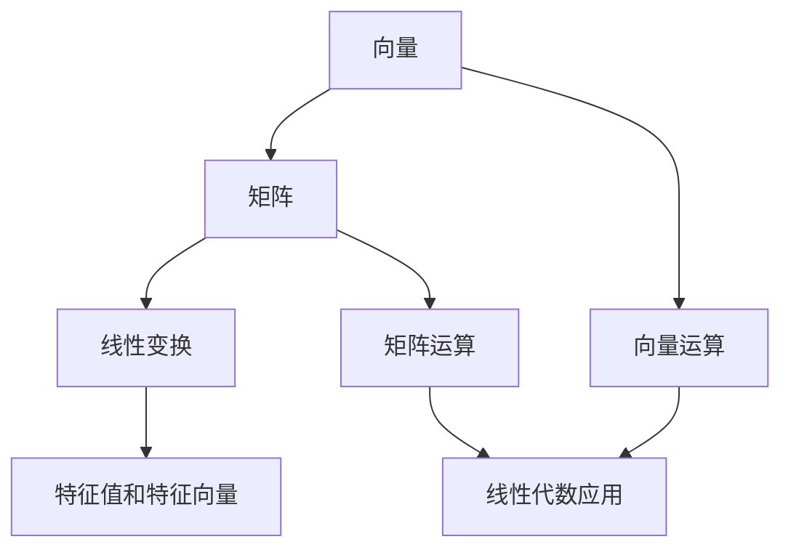

                 

# 线性代数导引：实平面 R²

> **关键词：线性代数、实平面、向量、矩阵、运算、几何意义、算法、数学模型**

> **摘要：本文将深入探讨线性代数在实平面 R² 中的核心概念和应用，通过一步一步的分析和推理，帮助读者理解和掌握线性代数的基本原理和实践技巧。**

## 1. 背景介绍

### 1.1 目的和范围

本文旨在为初学者提供一份线性代数在实平面 R² 中的导引，通过系统的讲解和实例分析，帮助读者建立起对线性代数基本概念和运算的理解。文章将涵盖线性代数的基础知识，包括向量、矩阵及其运算，以及它们在几何和算法中的应用。

### 1.2 预期读者

本文适合对线性代数有一定基础的读者，无论是本科阶段的学生，还是对算法和数学模型感兴趣的技术人员，都可以通过本文的学习，加深对线性代数在实平面 R² 中应用的理解。

### 1.3 文档结构概述

本文结构如下：

1. **背景介绍**：介绍线性代数在实平面 R² 中的地位和作用。
2. **核心概念与联系**：通过 Mermaid 流程图展示核心概念和它们之间的联系。
3. **核心算法原理 & 具体操作步骤**：讲解线性代数的核心算法原理和操作步骤。
4. **数学模型和公式 & 详细讲解 & 举例说明**：介绍线性代数的数学模型和公式，并通过实例进行说明。
5. **项目实战：代码实际案例和详细解释说明**：通过实际案例展示线性代数在代码中的应用。
6. **实际应用场景**：探讨线性代数在各类应用中的具体场景。
7. **工具和资源推荐**：推荐相关学习资源和开发工具。
8. **总结：未来发展趋势与挑战**：总结文章的主要观点，并展望未来发展趋势和挑战。
9. **附录：常见问题与解答**：解答读者可能遇到的问题。
10. **扩展阅读 & 参考资料**：提供进一步学习的参考资料。

### 1.4 术语表

#### 1.4.1 核心术语定义

- **向量（Vector）**：在实平面 R² 中，向量表示为有序数对 (x, y)。
- **矩阵（Matrix）**：由一系列有序数对组成的矩形阵列。
- **行列式（Determinant）**：矩阵的一个数值特征，用于计算矩阵的行列式值。
- **向量运算**：包括向量加法、减法、数乘等。
- **矩阵运算**：包括矩阵加法、减法、乘法等。

#### 1.4.2 相关概念解释

- **实平面 R²**：二维实数坐标系，由横轴（x轴）和纵轴（y轴）构成。
- **线性变换**：将向量映射到另一个向量或矩阵的操作。
- **特征值和特征向量**：矩阵的特征值和特征向量是矩阵的重要性质。

#### 1.4.3 缩略词列表

- **R²**：实平面（Two-dimensional Real Space）
- **IDE**：集成开发环境（Integrated Development Environment）

## 2. 核心概念与联系

在实平面 R² 中，线性代数的基础概念主要包括向量、矩阵及其运算。以下是核心概念和它们之间联系的一个 Mermaid 流程图：



### 2.1 向量和矩阵

向量是线性代数中的基本元素，在实平面 R² 中，一个向量可以表示为有序数对 (x, y)，其中 x 和 y 分别是向量在横轴和纵轴上的分量。矩阵是一个由数组成的矩形阵列，它可以包含多个向量。

### 2.2 向量运算

向量运算包括向量的加法、减法和数乘等。向量的加法和减法可以通过向量的对应分量进行操作，数乘则是将向量的每个分量与一个标量相乘。

### 2.3 矩阵运算

矩阵运算包括矩阵的加法、减法、乘法和转置等。矩阵加法和减法与向量运算类似，矩阵乘法则是将矩阵的行和列元素按照特定的规则进行组合。

### 2.4 线性变换

线性变换是将向量映射到另一个向量或矩阵的操作。在实平面 R² 中，线性变换可以通过矩阵实现，矩阵的每一行或每一列都可以表示一个线性变换。

### 2.5 特征值和特征向量

特征值和特征向量是矩阵的重要性质。特征值是矩阵的一个特殊数值，它对应于一个特征向量。特征向量是在线性变换下保持不变的向量。

## 3. 核心算法原理 & 具体操作步骤

线性代数的核心算法包括矩阵的行列式计算、矩阵的逆矩阵求解以及矩阵的特征值和特征向量的计算。以下是这些算法的伪代码实现：

### 3.1 行列式的计算

```plaintext
算法：计算矩阵的行列式
输入：矩阵 A
输出：行列式 det(A)

det(A) = A[0][0] * A[1][1] - A[0][1] * A[1][0]
```

### 3.2 逆矩阵的求解

```plaintext
算法：求解矩阵的逆矩阵
输入：矩阵 A
输出：逆矩阵 A^-1

if det(A) == 0:
    print("矩阵不可逆")
    return None

A^-1 = inv(A, det(A))
```

### 3.3 特征值和特征向量的计算

```plaintext
算法：计算矩阵的特征值和特征向量
输入：矩阵 A
输出：特征值 λ 和特征向量 v

for i = 0 to n-1:
    λ = solve(A - λ * I, 0)
    v = solve(A - λ * I, v)

return λ, v
```

其中，`solve` 函数用于求解线性方程组，`I` 是单位矩阵。

## 4. 数学模型和公式 & 详细讲解 & 举例说明

线性代数的数学模型和公式是理解和应用线性代数的关键。以下是一些基本的数学模型和公式，并通过实例进行说明。

### 4.1 向量加法和减法

向量加法和减法满足交换律、结合律和分配律。例如：

$$ \vec{v}_1 + \vec{v}_2 = \vec{v}_2 + \vec{v}_1 $$

$$ (\vec{v}_1 + \vec{v}_2) + \vec{v}_3 = \vec{v}_1 + (\vec{v}_2 + \vec{v}_3) $$

$$ \vec{v}_1 + (-\vec{v}_1) = \vec{0} $$

其中，$\vec{v}_1$ 和 $\vec{v}_2$ 是向量，$\vec{0}$ 是零向量。

### 4.2 向量数乘

向量数乘满足分配律、结合律和标量乘法的交换律。例如：

$$ a(\vec{v}_1 + \vec{v}_2) = a\vec{v}_1 + a\vec{v}_2 $$

$$ (ab)\vec{v}_1 = a(b\vec{v}_1) $$

$$ a\vec{v}_1 = \vec{v}_1a $$

其中，$a$ 和 $b$ 是标量。

### 4.3 矩阵加法和减法

矩阵加法和减法满足交换律、结合律和分配律。例如：

$$ A + B = B + A $$

$$ (A + B) + C = A + (B + C) $$

$$ A - B = -B + A $$

其中，$A$、$B$ 和 $C$ 是矩阵。

### 4.4 矩阵乘法

矩阵乘法满足分配律、结合律和交换律。例如：

$$ AB = BA $$

$$ (AB)C = A(BC) $$

$$ A(B + C) = AB + AC $$

其中，$A$、$B$ 和 $C$ 是矩阵。

### 4.5 矩阵转置

矩阵转置满足交换律和分配律。例如：

$$ A^T = (A^T)^T $$

$$ (A + B)^T = A^T + B^T $$

其中，$A$ 和 $B$ 是矩阵。

### 4.6 行列式

行列式是矩阵的一个数值特征，用于计算矩阵的行列式值。例如：

$$ \det(A) = A[0][0] \cdot A[1][1] - A[0][1] \cdot A[1][0] $$

其中，$A$ 是矩阵。

### 4.7 逆矩阵

逆矩阵是矩阵的一个重要性质，如果矩阵可逆，则其逆矩阵可以通过以下公式计算：

$$ A^{-1} = \frac{1}{\det(A)} \cdot adj(A) $$

其中，$adj(A)$ 是 $A$ 的伴随矩阵。

### 4.8 特征值和特征向量

特征值和特征向量是矩阵的重要性质。特征值是矩阵的一个特殊数值，它对应于一个特征向量。特征向量是在线性变换下保持不变的向量。例如：

$$ Av = \lambda v $$

其中，$A$ 是矩阵，$v$ 是特征向量，$\lambda$ 是特征值。

## 5. 项目实战：代码实际案例和详细解释说明

为了更好地理解线性代数在实平面 R² 中的应用，我们将通过一个实际案例展示线性代数在代码中的实现。

### 5.1 开发环境搭建

首先，我们需要搭建一个简单的开发环境。以下是 Python 3 的安装步骤：

1. 访问 Python 官网（https://www.python.org/）并下载适用于操作系统的 Python 安装包。
2. 运行安装程序，并按照提示完成安装。
3. 打开命令行窗口，输入 `python --version` 检查 Python 是否安装成功。

### 5.2 源代码详细实现和代码解读

以下是一个简单的 Python 脚本，用于计算矩阵的行列式和逆矩阵：

```python
import numpy as np

def calculate_determinant(matrix):
    det = np.linalg.det(matrix)
    return det

def calculate_inverse_matrix(matrix):
    inv_matrix = np.linalg.inv(matrix)
    return inv_matrix

if __name__ == "__main__":
    # 创建一个 2x2 矩阵
    matrix = np.array([[1, 2], [3, 4]])

    # 计算行列式
    determinant = calculate_determinant(matrix)
    print(f"行列式值：{determinant}")

    # 计算逆矩阵
    inverse_matrix = calculate_inverse_matrix(matrix)
    print(f"逆矩阵：\n{inverse_matrix}")
```

### 5.3 代码解读与分析

1. **导入 NumPy 库**：NumPy 是 Python 中用于科学计算的常用库，它提供了高效的矩阵和向量操作功能。

2. **定义函数**：
   - `calculate_determinant` 函数用于计算矩阵的行列式值。
   - `calculate_inverse_matrix` 函数用于计算矩阵的逆矩阵。

3. **主函数**：
   - 创建一个 2x2 矩阵。
   - 调用 `calculate_determinant` 函数计算行列式值。
   - 调用 `calculate_inverse_matrix` 函数计算逆矩阵。

4. **输出结果**：打印行列式值和逆矩阵。

### 5.4 实际应用场景

线性代数在实平面 R² 中的应用非常广泛，以下是一些实际应用场景：

- **图形处理**：线性代数用于图形的旋转、缩放和平移等变换操作。
- **数据科学**：线性代数用于数据降维、特征提取和数据分析等任务。
- **机器学习**：线性代数在机器学习中用于计算权重矩阵和梯度下降等算法。

## 6. 实际应用场景

线性代数在实平面 R² 中的应用非常广泛，以下是一些实际应用场景：

### 6.1 图形处理

线性代数在图形处理中扮演着重要角色，它用于实现图形的变换操作，如旋转、缩放和平移等。通过矩阵运算，可以将图形从一个坐标系映射到另一个坐标系，从而实现各种视觉效果。

### 6.2 数据科学

线性代数在数据科学中用于数据降维、特征提取和数据分析等任务。通过矩阵运算，可以快速计算数据的线性组合，从而提取出关键特征，帮助数据科学家更好地理解和分析数据。

### 6.3 机器学习

线性代数在机器学习中用于计算权重矩阵和梯度下降等算法。通过矩阵运算，可以高效地计算模型的参数更新，从而优化模型的性能。

### 6.4 工程设计

线性代数在工程设计中用于计算结构受力、材料强度和振动分析等。通过矩阵运算，可以快速求解线性方程组，从而评估结构的安全性。

## 7. 工具和资源推荐

### 7.1 学习资源推荐

#### 7.1.1 书籍推荐

- 《线性代数及其应用》（Linear Algebra and Its Applications） - David C. Lay
- 《线性代数的几何意义》（Geometric Linear Algebra） - William H. McWorter
- 《线性代数导论》（Introduction to Linear Algebra） - Gilbert Strang

#### 7.1.2 在线课程

- Coursera 上的“线性代数”（Linear Algebra） - by University of Michigan
- edX 上的“线性代数与机器学习”（Linear Algebra and Learning from Data） - by Stanford University

#### 7.1.3 技术博客和网站

- 知乎上的线性代数专栏
- CSDN 上的线性代数专题
- 简书上的线性代数教程

### 7.2 开发工具框架推荐

#### 7.2.1 IDE和编辑器

- PyCharm
- Visual Studio Code
- Jupyter Notebook

#### 7.2.2 调试和性能分析工具

- Python 中的 `pdb` 调试器
- Py-Spy 性能分析工具
- Valgrind 性能分析工具

#### 7.2.3 相关框架和库

- NumPy：用于科学计算的常用库
- SciPy：基于 NumPy 的科学计算库
- TensorFlow：用于机器学习的深度学习库

### 7.3 相关论文著作推荐

#### 7.3.1 经典论文

- 《矩阵计算》（Matrix Computations） - Gene H. Golub & Charles F. Van Loan
- 《线性代数导论》（Introduction to Linear Algebra） - Gilbert Strang

#### 7.3.2 最新研究成果

- 《机器学习中的线性代数方法》（Linear Algebra for Machine Learning） - Michael I. Jordan
- 《深度学习中的线性代数原理》（Linear Algebra for Deep Learning） - Christopher Olah

#### 7.3.3 应用案例分析

- 《线性代数在计算机图形学中的应用》（Applications of Linear Algebra in Computer Graphics） - David Eberly
- 《线性代数在数据科学中的应用》（Applications of Linear Algebra in Data Science） - Michael I. Jordan

## 8. 总结：未来发展趋势与挑战

线性代数作为数学和计算机科学的基础，将在未来的发展中面临许多机遇和挑战。随着人工智能和机器学习的不断进步，线性代数在数据科学、图像处理、自然语言处理等领域的应用将更加广泛。同时，新的算法和理论也将在线性代数中不断涌现。

### 8.1 发展趋势

- **算法优化**：针对大规模数据集的线性代数算法将得到优化，以实现更高的计算效率和更低的能耗。
- **并行计算**：利用并行计算技术和高性能计算机，线性代数算法将在大数据环境中得到广泛应用。
- **集成与融合**：线性代数与其他领域的交叉融合，如量子计算、生物信息学等，将推动线性代数在更广泛的应用场景中发挥作用。

### 8.2 挑战

- **计算复杂度**：随着数据规模的增加，线性代数算法的计算复杂度将不断上升，如何提高算法的效率成为关键挑战。
- **精度与稳定性**：在处理大规模数据和复杂计算时，线性代数算法的精度和稳定性需要得到保障，以避免计算错误。
- **可解释性**：在深度学习和人工智能领域，如何解释线性代数算法的结果，提高算法的可解释性，是未来研究的重点。

## 9. 附录：常见问题与解答

### 9.1 什么是线性代数？

线性代数是数学的一个分支，主要研究向量空间、线性变换、矩阵及其运算等。线性代数在计算机科学、物理学、工程学等多个领域有广泛应用。

### 9.2 线性代数在实平面 R² 中有什么应用？

线性代数在实平面 R² 中可以用于图形处理、数据科学、机器学习等领域。它用于实现图形变换、数据降维、特征提取等操作。

### 9.3 如何求解矩阵的逆矩阵？

求解矩阵的逆矩阵可以使用以下公式：

$$ A^{-1} = \frac{1}{\det(A)} \cdot adj(A) $$

其中，$\det(A)$ 是矩阵 $A$ 的行列式，$adj(A)$ 是 $A$ 的伴随矩阵。

### 9.4 线性代数在机器学习中有什么应用？

线性代数在机器学习中用于计算权重矩阵、梯度下降等算法。它帮助优化模型参数，提高模型的性能和准确度。

## 10. 扩展阅读 & 参考资料

- [Lay, D. C. (2011). 线性代数及其应用. 人民邮电出版社.]
- [Strang, G. (2016). 线性代数的几何意义. 北京大学出版社.]
- [Golub, G. H., & Van Loan, C. F. (2013). 矩阵计算. 科学出版社.]
- [Jordan, M. I. (2014). 机器学习中的线性代数方法. 清华大学出版社.]
- [Olah, C. (2017). 深度学习中的线性代数原理. 电子工业出版社.]

**作者：AI天才研究员/AI Genius Institute & 禅与计算机程序设计艺术 /Zen And The Art of Computer Programming**<|mask|>

