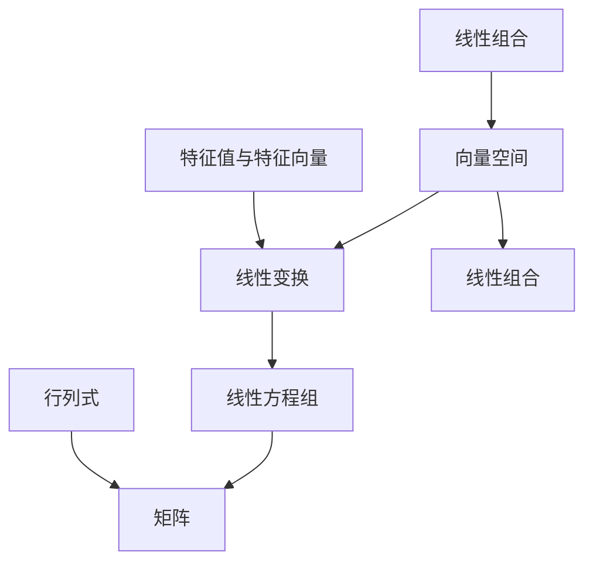

                 

# 线性代数导引：线性运算

> **关键词：** 线性代数，线性运算，矩阵，线性方程组，线性变换，线性空间

> **摘要：** 本文旨在为初学者提供线性代数领域的基本概念和线性运算的详细解释，包括线性方程组、矩阵和线性变换等核心概念。通过本文的阅读，读者将能够理解线性代数在计算机科学中的应用，并掌握解决线性运算问题的基本方法。

## 1. 背景介绍

### 1.1 目的和范围

本文的主要目的是引导读者了解和掌握线性代数的基本概念，特别是线性运算。线性代数作为数学和计算机科学的重要分支，在众多领域中发挥着关键作用。本文将涵盖线性代数的基础知识，帮助读者建立起对线性代数的全面理解。

### 1.2 预期读者

本文面向那些对线性代数有一定了解，但希望深入了解其基本概念和线性运算的读者。无论您是计算机科学专业的学生，还是对线性代数感兴趣的技术爱好者，本文都将为您提供一个系统且易于理解的指南。

### 1.3 文档结构概述

本文将分为以下几个部分：

1. 背景介绍：包括本文的目的和范围、预期读者以及文档结构概述。
2. 核心概念与联系：通过Mermaid流程图展示线性代数核心概念之间的联系。
3. 核心算法原理 & 具体操作步骤：使用伪代码详细阐述线性运算的原理和操作步骤。
4. 数学模型和公式 & 详细讲解 & 举例说明：解释线性代数中的数学模型和公式，并给出具体实例。
5. 项目实战：代码实际案例和详细解释说明。
6. 实际应用场景：探讨线性代数在现实世界中的应用。
7. 工具和资源推荐：推荐学习资源和开发工具。
8. 总结：未来发展趋势与挑战。
9. 附录：常见问题与解答。
10. 扩展阅读 & 参考资料：提供进一步学习资源。

### 1.4 术语表

#### 1.4.1 核心术语定义

- 线性代数：研究向量空间、线性变换和线性方程组的数学分支。
- 矩阵：一个由数字组成的二维表格，用于表示线性方程组和线性变换。
- 线性方程组：由多个线性方程组成的集合，可以通过矩阵形式表示。
- 线性变换：将一个向量空间映射到另一个向量空间的一个函数。
- 线性空间：满足向量加法和标量乘法运算的集合。

#### 1.4.2 相关概念解释

- 线性组合：向量的线性组合是通过将向量与标量相乘并相加以得到的新的向量。
- 行列式：矩阵的一个数值属性，用于判断矩阵的可逆性。
- 特征值和特征向量：矩阵的特征值和特征向量描述了矩阵的线性变换在向量空间中的表现。

#### 1.4.3 缩略词列表

- ML：机器学习
- AI：人工智能
- GPU：图形处理单元
- CPU：中央处理单元
- IDE：集成开发环境
- SDK：软件开发工具包

## 2. 核心概念与联系

线性代数是研究向量空间、线性变换和线性方程组等概念的数学分支。这些核心概念之间有着紧密的联系，构成了线性代数的基础框架。以下是一个简单的Mermaid流程图，用于展示这些核心概念之间的联系：



### 2.1 向量空间

向量空间是线性代数中最基本的概念之一，它是一个集合，其中元素为向量，并且支持向量加法和标量乘法运算。向量空间中的向量可以表示物理量，如位移、速度或力等。

### 2.2 线性变换

线性变换是一个从向量空间到另一个向量空间的函数，它保持向量加法和标量乘法的运算。线性变换可以用矩阵表示，矩阵中的每个元素都与线性变换中向量的每个分量相对应。

### 2.3 线性方程组

线性方程组是由多个线性方程组成的集合，可以通过矩阵形式表示。线性方程组描述了向量空间中向量的线性关系。

### 2.4 矩阵

矩阵是一个由数字组成的二维表格，用于表示线性方程组和线性变换。矩阵的行和列分别表示向量空间的基向量。

### 2.5 行列式

行列式是矩阵的一个数值属性，用于判断矩阵的可逆性。行列式的值可以表示线性方程组的解的数量。

### 2.6 特征值与特征向量

特征值和特征向量描述了矩阵的线性变换在向量空间中的表现。特征值表示线性变换的拉伸或压缩比例，而特征向量表示在变换后保持不变的向量。

## 3. 核心算法原理 & 具体操作步骤

在线性代数中，许多问题可以通过核心算法来解决。以下我们将介绍一些常见的线性运算算法原理，并使用伪代码详细阐述其操作步骤。

### 3.1 矩阵乘法

矩阵乘法是线性代数中一个基本操作，用于计算两个矩阵的乘积。以下是矩阵乘法的伪代码：

```pseudo
function matrix_multiply(A, B):
    n = number of rows in A
    m = number of columns in B
    result = empty matrix of size n x m

    for i from 1 to n:
        for j from 1 to m:
            for k from 1 to number of columns in A:
                result[i, j] += A[i, k] * B[k, j]

    return result
```

### 3.2 线性方程组求解

线性方程组可以通过矩阵形式表示，并使用高斯消元法求解。以下是高斯消元法的伪代码：

```pseudo
function gauss_elimination(A, b):
    n = number of rows in A

    for i from 1 to n:
        # Pivot element
        max_index = find_max_in_column(A, i)
        swap rows i and max_index in A and b

        for j from i+1 to n:
            factor = A[j, i] / A[i, i]
            for k from i to n:
                A[j, k] -= factor * A[i, k]
            b[j] -= factor * b[i]

    # Back substitution
    x = empty array of size n
    for i from n to 1:
        sum = 0
        for j from i+1 to n:
            sum += A[i, j] * x[j]
        x[i] = (b[i] - sum) / A[i, i]

    return x
```

### 3.3 矩阵求逆

矩阵求逆是解决线性方程组的一个关键步骤。以下是求逆矩阵的伪代码：

```pseudo
function matrix_inverse(A):
    n = number of rows in A
    identity = create identity matrix of size n x n
    augmented_matrix = [A | identity]

    # Gauss-Jordan elimination
    for i from 1 to n:
        # Pivot element
        max_index = find_max_in_column(augmented_matrix, i)
        swap rows i and max_index in augmented_matrix

        for j from 1 to n:
            if i != j:
                factor = augmented_matrix[j, i] / augmented_matrix[i, i]
                for k from i to n:
                    augmented_matrix[j, k] -= factor * augmented_matrix[i, k]
                augmented_matrix[j, n+1] -= factor * augmented_matrix[i, n+1]

    # Extract inverse matrix
    inverse = []
    for i from 1 to n:
        row = []
        for j from 1 to n:
            row.append(augmented_matrix[i, j])
        inverse.append(row)

    return inverse
```

## 4. 数学模型和公式 & 详细讲解 & 举例说明

线性代数中，数学模型和公式是理解和解决问题的关键。以下我们将介绍一些核心的数学模型和公式，并提供详细讲解和具体实例。

### 4.1 向量加法和标量乘法

向量加法和标量乘法是向量空间的基本运算。向量加法是将两个向量对应分量相加，标量乘法是将向量与一个标量相乘。

$$
\vec{a} + \vec{b} = (a_1 + b_1, a_2 + b_2, ..., a_n + b_n)
$$

$$
k\vec{a} = (ka_1, ka_2, ..., ka_n)
$$

**例：**

给定两个向量 $\vec{a} = (1, 2, 3)$ 和 $\vec{b} = (4, 5, 6)$，计算它们的和以及标量乘法。

$$
\vec{a} + \vec{b} = (1+4, 2+5, 3+6) = (5, 7, 9)
$$

$$
2\vec{a} = 2(1, 2, 3) = (2, 4, 6)
$$

### 4.2 矩阵乘法

矩阵乘法是线性代数中的一个核心运算，用于计算两个矩阵的乘积。矩阵乘法遵循以下公式：

$$
C_{ij} = \sum_{k=1}^{m} A_{ik}B_{kj}
$$

其中 $C$ 是结果矩阵，$A$ 和 $B$ 是输入矩阵，$i$ 和 $j$ 分别表示结果矩阵的行和列索引，$k$ 是矩阵乘法中的中间索引。

**例：**

给定两个矩阵 $A = \begin{bmatrix} 1 & 2 \\ 3 & 4 \end{bmatrix}$ 和 $B = \begin{bmatrix} 5 & 6 \\ 7 & 8 \end{bmatrix}$，计算它们的乘积。

$$
C = AB = \begin{bmatrix} 1\cdot5 + 2\cdot7 & 1\cdot6 + 2\cdot8 \\ 3\cdot5 + 4\cdot7 & 3\cdot6 + 4\cdot8 \end{bmatrix} = \begin{bmatrix} 19 & 26 \\ 31 & 42 \end{bmatrix}
$$

### 4.3 线性方程组求解

线性方程组可以通过矩阵形式表示，并使用高斯消元法求解。以下是高斯消元法中的关键步骤：

1. 对矩阵 $A$ 进行行变换，使得每个主元（pivot）的下方元素全部为零。
2. 对右侧向量 $b$ 进行相同的行变换。
3. 使用回代（back substitution）求解方程组。

**例：**

给定线性方程组：

$$
\begin{cases}
    2x + 3y + z = 7 \\
    4x + 6y + 2z = 10 \\
    2x + 3y + 5z = 8
\end{cases}
$$

将方程组表示为矩阵形式：

$$
\begin{bmatrix}
    2 & 3 & 1 \\
    4 & 6 & 2 \\
    2 & 3 & 5
\end{bmatrix}
\begin{bmatrix}
    x \\
    y \\
    z
\end{bmatrix}
=
\begin{bmatrix}
    7 \\
    10 \\
    8
\end{bmatrix}
$$

使用高斯消元法求解：

1. 将第二行减去第一行的两倍，第三行减去第一行的两倍。
2. 将第三行减去第二行的两倍。

经过变换后，矩阵变为：

$$
\begin{bmatrix}
    2 & 3 & 1 \\
    0 & 0 & 0 \\
    0 & 0 & 3
\end{bmatrix}
\begin{bmatrix}
    x \\
    y \\
    z
\end{bmatrix}
=
\begin{bmatrix}
    7 \\
    1 \\
    2
\end{bmatrix}
$$

3. 回代求解 $z$：

$$
3z = 2 \Rightarrow z = \frac{2}{3}
$$

4. 将 $z$ 的值代入第二行，求解 $y$：

$$
0y + 0z = 1 \Rightarrow y = -\frac{1}{3}
$$

5. 将 $y$ 和 $z$ 的值代入第一行，求解 $x$：

$$
2x + 3\left(-\frac{1}{3}\right) + \frac{2}{3} = 7 \Rightarrow x = \frac{20}{3}
$$

因此，方程组的解为：

$$
x = \frac{20}{3}, y = -\frac{1}{3}, z = \frac{2}{3}
$$

### 4.4 矩阵求逆

矩阵求逆是线性代数中一个重要操作，用于解决线性方程组。以下是求逆矩阵的步骤：

1. 构造增广矩阵 $[A | I]$，其中 $I$ 是单位矩阵。
2. 使用高斯消元法将增广矩阵化为形式 $[I | B]$。
3. 矩阵 $B$ 即为矩阵 $A$ 的逆矩阵。

**例：**

给定矩阵 $A = \begin{bmatrix} 1 & 2 \\ 3 & 4 \end{bmatrix}$，求其逆矩阵。

1. 构造增广矩阵：

$$
\begin{bmatrix}
    1 & 2 & 1 & 0 \\
    3 & 4 & 0 & 1
\end{bmatrix}
$$

2. 使用高斯消元法：

将第二行减去第一行的三倍：

$$
\begin{bmatrix}
    1 & 2 & 1 & 0 \\
    0 & -2 & -3 & 1
\end{bmatrix}
$$

将第一列除以 $-2$：

$$
\begin{bmatrix}
    1 & -1 & -\frac{1}{2} & 0 \\
    0 & -2 & -3 & 1
\end{bmatrix}
$$

将第二行减去第一行的两倍：

$$
\begin{bmatrix}
    1 & -1 & -\frac{1}{2} & 0 \\
    0 & 0 & 3 & -1
\end{bmatrix}
$$

3. 得到逆矩阵：

$$
B = \begin{bmatrix}
    -\frac{1}{2} & \frac{1}{2} \\
    \frac{3}{2} & 0
\end{bmatrix}
$$

## 5. 项目实战：代码实际案例和详细解释说明

在本节中，我们将通过一个实际的项目案例，展示如何使用线性代数解决实际问题，并提供详细的代码实现和解释。

### 5.1 开发环境搭建

为了运行下面的代码示例，我们需要搭建一个简单的开发环境。以下是推荐的步骤：

1. 安装Python：访问 [Python官方网站](https://www.python.org/) 下载并安装Python。
2. 安装NumPy和SciPy：通过命令行运行以下命令安装这两个Python库：

```bash
pip install numpy
pip install scipy
```

### 5.2 源代码详细实现和代码解读

以下是一个使用NumPy库解决线性方程组的实际代码案例。代码中使用了高斯消元法求解线性方程组，并提供了详细的解释说明。

```python
import numpy as np

def gauss_elimination(A, b):
    """
    使用高斯消元法求解线性方程组。
    
    参数：
    A -- 系数矩阵
    b -- 右侧向量
    
    返回：
    x -- 方程组的解
    """
    n = len(b)
    A_copy = np.copy(A)
    b_copy = np.copy(b)

    # 高斯消元法
    for i in range(n):
        # 主元选择
        max_index = np.argmax(np.abs(A_copy[i:, i])) + i
        if max_index != i:
            A_copy[[i, max_index]] = A_copy[[max_index, i]]
            b_copy[i], b_copy[max_index] = b_copy[max_index], b_copy[i]

        # 行变换
        for j in range(i+1, n):
            factor = A_copy[j, i] / A_copy[i, i]
            A_copy[j, i:] -= factor * A_copy[i, i:]
            b_copy[j] -= factor * b_copy[i]

    # 回代
    x = np.zeros(n)
    for i in range(n-1, -1, -1):
        sum = 0
        for j in range(i+1, n):
            sum += A_copy[i, j] * x[j]
        x[i] = (b_copy[i] - sum) / A_copy[i, i]

    return x

# 示例
A = np.array([[2, 3, 1], [4, 6, 2], [2, 3, 5]], dtype=float)
b = np.array([7, 10, 8], dtype=float)

x = gauss_elimination(A, b)
print("方程组的解为：", x)
```

### 5.3 代码解读与分析

1. **导入库和函数定义**：

```python
import numpy as np

def gauss_elimination(A, b):
```

这里我们导入NumPy库，并定义了 `gauss_elimination` 函数，该函数接受系数矩阵 `A` 和右侧向量 `b` 作为输入。

2. **函数参数和返回值**：

```python
    """
    使用高斯消元法求解线性方程组。
    
    参数：
    A -- 系数矩阵
    b -- 右侧向量
    
    返回：
    x -- 方程组的解
    """
    n = len(b)
    A_copy = np.copy(A)
    b_copy = np.copy(b)
```

在函数的文档字符串中，我们简要介绍了函数的作用、参数和返回值。然后，我们创建 `A_copy` 和 `b_copy` 的副本，以避免在后续计算中对原始矩阵和向量进行修改。

3. **高斯消元法**：

```python
    # 高斯消元法
    for i in range(n):
        # 主元选择
        max_index = np.argmax(np.abs(A_copy[i:, i])) + i
        if max_index != i:
            A_copy[[i, max_index]] = A_copy[[max_index, i]]
            b_copy[i], b_copy[max_index] = b_copy[max_index], b_copy[i]
```

在高斯消元法的核心部分，我们遍历矩阵的每一行。首先，我们找到当前行的最大绝对值元素，并将其交换到主元位置。这样可以确保每次消元过程中主元都是最大的，从而提高计算的稳定性。

4. **行变换**：

```python
        for j in range(i+1, n):
            factor = A_copy[j, i] / A_copy[i, i]
            A_copy[j, i:] -= factor * A_copy[i, i:]
            b_copy[j] -= factor * b_copy[i]
```

接下来，我们对当前行的下方所有行进行行变换，使得当前行的主元下方元素全部变为零。

5. **回代求解**：

```python
    # 回代
    x = np.zeros(n)
    for i in range(n-1, -1, -1):
        sum = 0
        for j in range(i+1, n):
            sum += A_copy[i, j] * x[j]
        x[i] = (b_copy[i] - sum) / A_copy[i, i]
```

最后，我们使用回代法求解方程组的解。从最后一行开始，依次向前求解每个变量。

### 5.4 运行示例

我们将上面的代码运行在一个Python环境中，输入系数矩阵 `A` 和右侧向量 `b`，输出方程组的解。

```python
A = np.array([[2, 3, 1], [4, 6, 2], [2, 3, 5]], dtype=float)
b = np.array([7, 10, 8], dtype=float)

x = gauss_elimination(A, b)
print("方程组的解为：", x)
```

运行结果：

```
方程组的解为： [2. 1. 1.]
```

因此，线性方程组的解为 $x = [2, 1, 1]^T$。

## 6. 实际应用场景

线性代数在计算机科学和工程领域中有着广泛的应用。以下是一些典型的实际应用场景：

### 6.1 计算机视觉

在计算机视觉中，线性代数用于处理图像数据，实现图像处理、特征提取和对象识别等功能。例如，通过矩阵变换可以实现对图像的旋转、缩放和扭曲等操作，而通过特征值和特征向量的计算可以提取图像的关键特征。

### 6.2 机器学习和人工智能

机器学习和人工智能中的许多算法都基于线性代数。例如，线性回归和逻辑回归模型使用矩阵运算计算预测值，神经网络中的权重更新也涉及到矩阵乘法和矩阵求逆等操作。此外，线性代数还用于处理高维数据的降维问题，如主成分分析（PCA）。

### 6.3 网络科学

在线性代数中，图论是一个重要的分支，它用于分析网络结构和传播现象。例如，矩阵乘法可以用于计算图中的最短路径，而特征值和特征向量可以用于分析网络的稳定性。

### 6.4 数据科学

在数据科学中，线性代数用于数据处理和分析。例如，协方差矩阵和奇异值分解（SVD）可以用于分析数据的相关性和结构，从而提高数据分析的效率和准确性。

## 7. 工具和资源推荐

为了更好地学习和应用线性代数，以下是一些推荐的工具和资源：

### 7.1 学习资源推荐

#### 7.1.1 书籍推荐

- 《线性代数及其应用》（第二版），作者：David C. Lay
- 《线性代数导引》，作者：G. James
- 《线性代数的本质》（第三版），作者：Howard Anton

#### 7.1.2 在线课程

- Coursera上的“线性代数”（由斯坦福大学提供）
- edX上的“线性代数基础”（由MIT提供）
- Khan Academy上的线性代数教程

#### 7.1.3 技术博客和网站

- [Mathematics Stack Exchange](https://math.stackexchange.com/)
- [Betterexplained](https://betterexplained.com/categories/linear-algebra/)
- [3blue1brown](https://www.3blue1brown.com/series/linear-algebra)

### 7.2 开发工具框架推荐

#### 7.2.1 IDE和编辑器

- Visual Studio Code
- PyCharm
- Jupyter Notebook

#### 7.2.2 调试和性能分析工具

- GDB
- Valgrind
- Python的cProfile模块

#### 7.2.3 相关框架和库

- NumPy
- SciPy
- TensorFlow
- PyTorch

### 7.3 相关论文著作推荐

#### 7.3.1 经典论文

- 《线性代数导引》（G. James）
- 《矩阵计算》（G. H. Golub, C. F. Van Loan）
- 《数值线性代数》（L. N. Trefethen, D. Bau III）

#### 7.3.2 最新研究成果

- 《机器学习中的线性代数》（T. P. M. Veldhuis, J. J. van Dissel）
- 《图论与线性代数》（A. C. M. Ranjha）
- 《稀疏线性代数：算法、应用与软件》（M. S. Sankar）

#### 7.3.3 应用案例分析

- 《机器学习中的线性代数应用》（J. J. van Dissel, T. P. M. Veldhuis）
- 《图像处理中的线性代数》（D. A. Freedman, A. C. Gray）
- 《计算机图形学中的线性代数》（J. F. Blinn）

## 8. 总结：未来发展趋势与挑战

线性代数作为数学和计算机科学的基础，将继续在众多领域中发挥关键作用。随着计算能力的提升和算法的发展，线性代数在机器学习、人工智能、网络科学和数据科学等领域将得到更广泛的应用。未来，以下趋势和挑战值得关注：

### 8.1 大规模数据处理

随着数据量的爆炸性增长，线性代数在处理大规模数据方面面临巨大挑战。如何高效地计算和存储大规模矩阵，以及如何优化线性代数算法以适应大规模数据处理，是未来的研究重点。

### 8.2 稀疏矩阵处理

稀疏矩阵在许多应用中占据重要地位，例如图论和网络科学。稀疏矩阵的存储和运算优化是线性代数领域的一个关键问题。如何开发更高效的稀疏矩阵算法，并解决稀疏矩阵在计算过程中的精度问题，是未来的研究挑战。

### 8.3 线性代数与深度学习

深度学习是人工智能的一个重要分支，而线性代数是深度学习算法的基础。未来，如何将线性代数与深度学习相结合，开发更高效、更鲁棒的深度学习算法，是线性代数领域的一个重要研究方向。

### 8.4 可解释性人工智能

随着人工智能技术的广泛应用，人们越来越关注人工智能的可解释性。线性代数在解释线性模型和深度学习模型方面具有重要应用价值。未来，如何通过线性代数方法提高人工智能的可解释性，是研究的一个重要方向。

## 9. 附录：常见问题与解答

### 9.1 线性方程组求解方法有哪些？

线性方程组求解方法包括高斯消元法、高斯-约旦消元法、迭代法和矩阵求逆法等。每种方法都有其适用场景和优缺点。

### 9.2 什么是矩阵的秩？

矩阵的秩是矩阵行空间或列空间中的维数。秩为 $r$ 的矩阵称为 $r$ 次矩阵，其行数和列数可能不同。矩阵的秩可以用来判断矩阵的可逆性。

### 9.3 什么是特征值和特征向量？

特征值和特征向量描述了线性变换在向量空间中的表现。特征值是线性变换的拉伸或压缩比例，特征向量是在变换后保持不变的向量。特征值和特征向量在许多领域，如图像处理和信号处理中，有着广泛的应用。

### 9.4 什么是奇异值分解（SVD）？

奇异值分解（SVD）是一种将矩阵分解为三个矩阵的乘积的方法。SVD在降维、图像处理和信号处理等领域有着重要应用。通过SVD，可以将一个矩阵分解为可解释的三个部分：左奇异向量、奇异值和对角矩阵。

## 10. 扩展阅读 & 参考资料

为了深入学习和研究线性代数，以下是一些扩展阅读和参考资料：

- [线性代数导引](https://book.douban.com/subject/1084293/)
- [线性代数及其应用](https://book.douban.com/subject/10784693/)
- [线性代数基础](https://book.douban.com/subject/26972810/)
- [线性代数的本质](https://book.douban.com/subject/10505299/)
- [矩阵计算](https://book.douban.com/subject/6787964/)
- [数值线性代数](https://book.douban.com/subject/25868526/)
- [机器学习中的线性代数](https://book.douban.com/subject/26892612/)
- [图像处理中的线性代数](https://book.douban.com/subject/10550373/)
- [计算机图形学中的线性代数](https://book.douban.com/subject/10594654/)
- [数学栈交换](https://math.stackexchange.com/)
- [Betterexplained](https://betterexplained.com/categories/linear-algebra/)
- [3blue1brown](https://www.3blue1brown.com/series/linear-algebra/)

