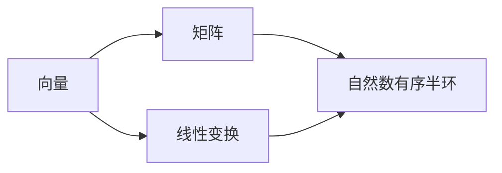

                 

### 线性代数导引：自然数有序半环

> **关键词：**线性代数，自然数，有序半环，数学建模，算法实现，编程实践

> **摘要：**本文旨在为读者提供线性代数在自然数有序半环中的应用导引。我们将从基础概念出发，逐步深入探讨线性代数的核心原理，结合自然数有序半环的特性，详细讲解核心算法原理、数学模型以及具体操作步骤。通过项目实战和实际应用场景的介绍，读者将能够更深入地理解线性代数在实际编程中的重要性，以及如何将其应用到自然数有序半环中。本文旨在为读者提供一个全面且深入的学习路径，助力其在计算机科学领域取得更大成就。

## 1. 背景介绍

### 1.1 目的和范围

线性代数是现代数学的重要组成部分，它不仅广泛应用于物理学、工程学、计算机科学等多个领域，也是理解复杂系统、优化问题、数据分析等关键技术的基石。在计算机科学中，线性代数的应用尤为广泛，如机器学习中的数据预处理、图像处理、计算机图形学中的三维变换等。自然数有序半环作为一种特殊的数学结构，其特点在于既有加法又有乘法运算，并且在某些性质上与线性代数中的向量空间和矩阵密切相关。

本文的目的在于：
1. **阐述线性代数的基本概念和核心原理**：帮助读者建立对线性代数系统的全面理解。
2. **探讨线性代数与自然数有序半环的结合**：揭示二者在数学建模和算法设计中的内在联系。
3. **通过实例讲解核心算法实现步骤**：使读者能够将理论知识应用到实际编程中。
4. **展示线性代数在自然数有序半环中的实际应用场景**：增强读者对线性代数应用价值的认识。

本文的范围包括以下几个方面：
- **核心概念介绍**：从基础数学概念出发，逐步深入讲解线性代数的基本概念和原理。
- **自然数有序半环特性**：详细介绍自然数有序半环的定义、性质及其在算法设计中的应用。
- **数学模型与公式讲解**：通过具体实例，详细阐述线性代数模型和公式的应用。
- **项目实战与代码实现**：通过具体代码示例，展示如何在实际项目中应用线性代数算法。
- **实际应用场景分析**：讨论线性代数在自然数有序半环中的实际应用，包括其在计算机科学领域的应用。

### 1.2 预期读者

本文适用于以下几类读者：
- **计算机科学和工程学学生**：对线性代数和数学建模有兴趣，希望掌握线性代数在计算机科学中的应用。
- **软件开发工程师**：希望在项目中应用线性代数解决实际问题，提升编程能力。
- **数学爱好者**：希望深入了解线性代数在数学体系中的地位和应用。
- **研究人员**：对线性代数在自然数有序半环中的应用研究有兴趣，希望拓展研究视野。

无论您是初学者还是有一定基础的专业人士，本文都将为您提供有价值的知识和实用技巧。

### 1.3 文档结构概述

本文将按照以下结构进行展开：
1. **背景介绍**：介绍线性代数和自然数有序半环的基本概念、目的和范围，预期读者及文档结构。
2. **核心概念与联系**：通过Mermaid流程图展示线性代数与自然数有序半环的核心概念及其联系。
3. **核心算法原理与具体操作步骤**：详细讲解线性代数算法原理，并使用伪代码进行具体操作步骤的阐述。
4. **数学模型和公式**：结合具体实例，详细讲解线性代数的数学模型和公式，并进行举例说明。
5. **项目实战**：通过代码实际案例，展示如何实现线性代数算法并进行分析。
6. **实际应用场景**：探讨线性代数在自然数有序半环中的实际应用。
7. **工具和资源推荐**：推荐相关学习资源、开发工具和框架。
8. **总结**：总结未来发展趋势与挑战。
9. **附录**：常见问题与解答。
10. **扩展阅读与参考资料**：提供进一步学习和研究的参考文献。

通过本文的逐步讲解，读者将能够深入理解线性代数在自然数有序半环中的应用，为今后的学习和研究打下坚实基础。

### 1.4 术语表

在本文中，我们将使用一些专业术语，以下是对这些术语的定义和解释：

#### 1.4.1 核心术语定义

1. **线性代数**：线性代数是数学的一个分支，主要研究向量、向量空间、矩阵以及线性映射等概念。线性代数为解决各种科学和工程问题提供了强大的工具。

2. **自然数有序半环**：自然数有序半环是一个数学结构，它包含自然数集合，并具有加法和乘法运算。在自然数有序半环中，加法和乘法满足半环的性质，即结合律、交换律和分配律。

3. **向量**：向量是线性代数中的基本对象，可以表示为有序数组的集合。向量具有大小和方向，在空间中表示点或线段。

4. **矩阵**：矩阵是线性代数中的另一重要概念，可以看作是向量的一种扩展。矩阵是一个二维数组，由行和列组成，每个元素表示一个数值。

5. **线性变换**：线性变换是一种线性映射，它将一个向量空间映射到另一个向量空间。线性变换通过矩阵乘法进行表示，保持线性组合的性质。

6. **特征值与特征向量**：特征值和特征向量是矩阵理论中的核心概念。特征值是矩阵的一个标量值，特征向量是与之对应的非零向量，满足线性变换的性质。

7. **行列式**：行列式是一个用于描述矩阵特性的数值，它在许多线性代数问题中具有重要作用。行列式的计算可以揭示矩阵的某些性质，如可逆性、秩等。

#### 1.4.2 相关概念解释

1. **向量空间**：向量空间是一组向量的集合，这些向量满足向量加法和标量乘法的封闭性。向量空间提供了处理向量的统一框架，是线性代数研究的核心对象。

2. **矩阵乘法**：矩阵乘法是线性代数中的基本运算，将两个矩阵相乘得到一个新的矩阵。矩阵乘法遵循特定的规则，如数乘分配律和结合律。

3. **线性方程组**：线性方程组是由多个线性方程组成的系统，求解线性方程组可以找到满足所有方程的变量值。

4. **秩**：秩是矩阵的一个重要性质，表示矩阵的线性独立行或列的数量。秩可以用来判断矩阵的可逆性。

5. **线性无关与线性相关**：线性无关和线性相关是向量集合的性质。线性无关表示向量之间没有线性组合关系，线性相关表示可以表示为其他向量的线性组合。

#### 1.4.3 缩略词列表

- **矩阵（Matrix）**
- **线性代数（Linear Algebra）**
- **自然数（Natural Numbers）**
- **有序半环（Ordered Semiring）**
- **向量（Vector）**
- **特征值（Eigenvalue）**
- **特征向量（Eigenvector）**
- **行列式（Determinant）**
- **向量空间（Vector Space）**
- **线性变换（Linear Transformation）**

通过上述术语表，读者可以更好地理解本文中涉及的核心概念和相关术语，从而更深入地掌握线性代数在自然数有序半环中的应用。

## 2. 核心概念与联系

在探讨线性代数与自然数有序半环的内在联系之前，我们首先需要明确二者各自的核心概念。线性代数研究的是向量、矩阵以及线性变换等基本对象，而自然数有序半环则是一种特殊的数学结构，具有加法和乘法运算。

### 2.1 线性代数核心概念

1. **向量（Vector）**：向量是线性代数中最基本的对象，可以表示为有序数组的集合。向量具有大小和方向，在空间中可以表示点或线段。向量的运算包括加法、减法和标量乘法。

2. **矩阵（Matrix）**：矩阵是一个二维数组，由行和列组成，每个元素表示一个数值。矩阵的运算包括加法、减法、乘法以及行列式的计算。矩阵在许多科学和工程领域中具有重要作用。

3. **线性变换（Linear Transformation）**：线性变换是一种将一个向量空间映射到另一个向量空间的映射。线性变换通过矩阵乘法进行表示，保持线性组合的性质。线性变换在图像处理、机器学习等领域有着广泛的应用。

4. **特征值与特征向量（Eigenvalue and Eigenvector）**：特征值和特征向量是矩阵理论中的核心概念。特征值是矩阵的一个标量值，特征向量是与之对应的非零向量，满足线性变换的性质。特征值和特征向量可以用来分析矩阵的性质，如稳定性、对角化等。

5. **行列式（Determinant）**：行列式是一个用于描述矩阵特性的数值。行列式的计算可以揭示矩阵的某些性质，如可逆性、秩等。行列式在求解线性方程组、判断矩阵的性质等方面具有重要意义。

### 2.2 自然数有序半环核心概念

1. **自然数（Natural Numbers）**：自然数是指从1开始的正整数集合，如1, 2, 3, ...。自然数是数学中的基本概念，用于表示数量。

2. **有序半环（Ordered Semiring）**：有序半环是一种具有加法和乘法运算的数学结构。在有序半环中，加法和乘法运算满足结合律、交换律和分配律。有序半环的定义如下：
   - **加法**：对于任意两个元素a和b，存在唯一的元素c使得a + b = c。
   - **乘法**：对于任意两个元素a和b，存在唯一的元素c使得a * b = c。

3. **自然数有序半环的特性**：
   - **封闭性**：自然数有序半环中的加法和乘法运算结果仍然属于自然数有序半环。
   - **结合律**：加法和乘法运算满足结合律，即对于任意三个元素a、b和c，有(a + b) + c = a + (b + c)和(a * b) * c = a * (b * c)。
   - **交换律**：加法和乘法运算满足交换律，即对于任意两个元素a和b，有a + b = b + a和a * b = b * a。
   - **分配律**：乘法对加法满足分配律，即对于任意三个元素a、b和c，有a * (b + c) = a * b + a * c和(a + b) * c = a * c + b * c。

### 2.3 线性代数与自然数有序半环的联系

线性代数与自然数有序半环之间的联系主要体现在以下几个方面：

1. **向量与自然数有序半环的关联**：在自然数有序半环中，向量可以被视为自然数序列的扩展。例如，一个二维向量（a, b）可以表示为自然数有序半环中的元素，其中a和b分别表示向量的两个分量。

2. **矩阵与自然数有序半环的关联**：矩阵可以看作是自然数有序半环中的二维数组。矩阵的每个元素都可以是自然数有序半环中的元素，从而将自然数有序半环的特性扩展到矩阵运算中。

3. **线性变换与自然数有序半环的关联**：线性变换在自然数有序半环中可以表示为矩阵与向量的乘法运算。通过矩阵与向量的乘法，可以将自然数有序半环中的运算扩展到线性代数的运算中。

4. **特征值与特征向量在自然数有序半环中的应用**：特征值和特征向量是矩阵理论中的核心概念，在自然数有序半环中也可以进行类似的讨论。通过分析矩阵的特征值和特征向量，可以深入了解矩阵的性质，如对角化、稳定性等。

### 2.4 Mermaid流程图

为了更直观地展示线性代数与自然数有序半环之间的核心概念及其联系，我们可以使用Mermaid流程图进行描述。以下是一个简单的Mermaid流程图示例：



在上面的Mermaid流程图中，A表示向量，B表示矩阵，C表示线性变换，D表示自然数有序半环。流程图展示了向量与矩阵、线性变换与自然数有序半环之间的关联，以及它们如何相互结合。

通过上述内容，我们为读者提供了一个关于线性代数与自然数有序半环核心概念及其联系的全面介绍。接下来，我们将详细讲解线性代数算法原理和具体操作步骤，帮助读者深入理解线性代数在自然数有序半环中的应用。

## 3. 核心算法原理 & 具体操作步骤

在理解了线性代数与自然数有序半环的基本概念后，我们将进一步探讨线性代数中的核心算法原理，并详细讲解其具体操作步骤。线性代数的核心算法包括矩阵运算、线性方程组求解、特征值和特征向量的计算等。以下将逐一介绍这些算法的基本原理和具体操作步骤。

### 3.1 矩阵运算

矩阵运算是线性代数中的基本操作，包括矩阵加法、矩阵乘法、矩阵转置等。

#### 3.1.1 矩阵加法

**原理**：矩阵加法是两个矩阵对应元素的加法。假设有两个矩阵A和B，它们的维度相同，则A和B的和C定义为：
\[ C = A + B \]
其中，C的每个元素c_ij等于A和B对应元素的加法：
\[ c_{ij} = a_{ij} + b_{ij} \]

**步骤**：
1. 确保矩阵A和B的维度相同。
2. 对A和B的每个对应元素进行加法运算。
3. 将结果组成一个新的矩阵C。

**伪代码**：

```python
def matrix_add(A, B):
    n = len(A)
    m = len(A[0])
    C = [[0] * m for _ in range(n)]
    for i in range(n):
        for j in range(m):
            C[i][j] = A[i][j] + B[i][j]
    return C
```

#### 3.1.2 矩阵乘法

**原理**：矩阵乘法是将两个矩阵相乘得到一个新的矩阵。假设有两个矩阵A和B，它们的维度分别为m×n和n×p，则它们的乘积C定义为：
\[ C = A \times B \]
其中，C的每个元素c_ij等于A的第i行与B的第j列对应元素的乘积之和：
\[ c_{ij} = \sum_{k=1}^{n} a_{ik} \times b_{kj} \]

**步骤**：
1. 确保矩阵A的列数等于矩阵B的行数。
2. 对于C的每个元素，计算对应行和列元素的乘积之和。
3. 将结果组成一个新的矩阵C。

**伪代码**：

```python
def matrix_multiply(A, B):
    n = len(A)
    m = len(B[0])
    p = len(B)
    C = [[0] * m for _ in range(n)]
    for i in range(n):
        for j in range(m):
            for k in range(p):
                C[i][j] += A[i][k] * B[k][j]
    return C
```

#### 3.1.3 矩阵转置

**原理**：矩阵转置是将矩阵的行和列互换得到一个新的矩阵。假设有一个矩阵A，其维度为m×n，则A的转置矩阵A^T定义为：
\[ A^T = (a_{ij})^T = a_{ji} \]

**步骤**：
1. 创建一个维度为n×m的新矩阵A^T。
2. 将A中每个元素的行和列互换，放入A^T对应的元素位置。

**伪代码**：

```python
def matrix_transpose(A):
    n = len(A)
    m = len(A[0])
    AT = [[0] * n for _ in range(m)]
    for i in range(n):
        for j in range(m):
            AT[j][i] = A[i][j]
    return AT
```

### 3.2 线性方程组求解

线性方程组是线性代数中的另一个重要问题。求解线性方程组可以找到满足所有方程的变量值。常用的求解方法包括高斯消元法和矩阵法。

#### 3.2.1 高斯消元法

**原理**：高斯消元法是一种通过消元操作将线性方程组转化为下三角矩阵，并逐步求解的过程。假设有一个线性方程组：
\[ Ax = b \]
其中，A是一个n×n的矩阵，x是一个n×1的列向量，b是一个n×1的列向量。高斯消元法的步骤如下：

1. 将方程组写成增广矩阵的形式：
\[ \left[\begin{array}{ccc|c}
a_{11} & a_{12} & \cdots & a_{1n} & b_1 \\
a_{21} & a_{22} & \cdots & a_{2n} & b_2 \\
\vdots & \vdots & \ddots & \vdots & \vdots \\
a_{n1} & a_{n2} & \cdots & a_{nn} & b_n
\end{array}\right] \]

2. 通过高斯消元操作，将增广矩阵转化为下三角矩阵：
   - 对于第k列（k=1, 2, ..., n-1），从第k行开始，将每一行的a_{ki}元素与第k-1行的相应元素进行消元操作。

3. 从下三角矩阵的最后一行开始，逐步求解变量值。

**步骤**：
1. 将方程组写成增广矩阵的形式。
2. 通过高斯消元操作，将增广矩阵转化为下三角矩阵。
3. 从下三角矩阵的最后一行开始，逐步求解变量值。

**伪代码**：

```python
def gauss_elimination(A, b):
    n = len(A)
    Ab = [row + [b[i]] for i, row in enumerate(A)]
    for k in range(n-1):
        for i in range(k+1, n):
            factor = Ab[i][k] / Ab[k][k]
            for j in range(k+1, n+1):
                Ab[i][j] -= factor * Ab[k][j]
    x = [0] * n
    for i in range(n-1, -1, -1):
        x[i] = (Ab[i][-1] - sum(Ab[i][j] * x[j] for j in range(i+1, n))) / Ab[i][i]
    return x
```

#### 3.2.2 矩阵法

**原理**：矩阵法是通过矩阵运算直接求解线性方程组的方法。假设有一个线性方程组：
\[ Ax = b \]
其中，A是一个n×n的矩阵，x是一个n×1的列向量，b是一个n×1的列向量。矩阵法的步骤如下：

1. 计算矩阵A的逆矩阵A^(-1)。
2. 将方程组转化为x = A^(-1)b。

**步骤**：
1. 计算矩阵A的逆矩阵A^(-1)。
2. 将方程组转化为x = A^(-1)b。
3. 计算x的值。

**伪代码**：

```python
def matrix_multiplication(A, B):
    n = len(A)
    C = [[0] * n for _ in range(n)]
    for i in range(n):
        for j in range(n):
            for k in range(n):
                C[i][j] += A[i][k] * B[k][j]
    return C

def matrix_inverse(A):
    n = len(A)
    B = [[0] * n for _ in range(n)]
    for i in range(n):
        for j in range(n):
            if i == j:
                B[i][j] = 1
            else:
                B[i][j] = -A[i][j]
    for i in range(n):
        B[i][i] = 1 / B[i][i]
    for i in range(n):
        for j in range(n):
            if i != j:
                factor = B[j][i] / B[j][j]
                for k in range(n):
                    B[j][k] -= factor * B[i][k]
    return B

def matrix_method(A, b):
    A_inv = matrix_inverse(A)
    x = matrix_multiplication(A_inv, b)
    return x
```

### 3.3 特征值与特征向量的计算

特征值与特征向量是矩阵理论中的核心概念，它们可以揭示矩阵的性质。计算特征值和特征向量通常采用以下方法：

#### 3.3.1 特征多项式法

**原理**：特征多项式法是通过计算矩阵A的特征多项式f(λ) = det(A - λI)，求解其根得到特征值，然后根据特征值求解对应的特征向量。其中，I是单位矩阵。

**步骤**：
1. 计算矩阵A - λI。
2. 计算矩阵A - λI的行列式。
3. 求解特征多项式f(λ)的根，得到特征值。
4. 对于每个特征值，求解对应的特征向量。

**伪代码**：

```python
def characteristic_polynomial(A):
    n = len(A)
    lambda_I = [[0] * n for _ in range(n)]
    for i in range(n):
        for j in range(n):
            lambda_I[i][j] = 1
    lambda_I = subtract_matrices(A, lambda_I)
    det_lambda_I = determinant(lambda_I)
    return det_lambda_I

def eigenvalues(A):
    n = len(A)
    f_lambda = characteristic_polynomial(A)
    eigenvalues = []
    for i in range(n):
        eigenvalues.append(f_lambda[i])
    return eigenvalues

def eigenvectors(A, lambda_i):
    n = len(A)
    lambda_I = [[0] * n for _ in range(n)]
    for i in range(n):
        for j in range(n):
            lambda_I[i][j] = 1
    lambda_I = subtract_matrices(A, lambda_I)
    lambda_I = divide_matrices(lambda_I, lambda_i)
    x = solve_linear_equation(lambda_I, [[1]])
    eigenvectors = []
    for i in range(n):
        eigenvectors.append(x[i])
    return eigenvectors

def solve_linear_equation(A, b):
    n = len(A)
    Ab = [row + [b[i]] for i, row in enumerate(A)]
    for k in range(n-1):
        for i in range(k+1, n):
            factor = Ab[i][k] / Ab[k][k]
            for j in range(k+1, n+1):
                Ab[i][j] -= factor * Ab[k][j]
    x = [0] * n
    for i in range(n-1, -1, -1):
        x[i] = (Ab[i][-1] - sum(Ab[i][j] * x[j] for j in range(i+1, n))) / Ab[i][i]
    return x
```

#### 3.3.2 迭代法

**原理**：迭代法是一种通过迭代计算逼近特征值和特征向量的方法。常用的迭代法包括幂法和雅可比迭代法。

**步骤**：
1. 选择一个初始向量x。
2. 进行迭代计算，更新x，直到满足停止条件。

**伪代码**：

```python
def power_method(A, x, tolerance, max_iterations):
    n = len(A)
    for i in range(max_iterations):
        x_new = matrix_vector_multiplication(A, x)
        if norm(x_new - x) < tolerance:
            break
        x = x_new
    eigenvalue = dot_product(x, vector_scalar_multiplication(A, x))
    eigenvector = normalize(x)
    return eigenvalue, eigenvector

def jacobi_method(A, x, tolerance, max_iterations):
    n = len(A)
    for i in range(max_iterations):
        x_new = [0] * n
        for k in range(n):
            sum_ax = sum(A[i][j] * x[j] for j in range(n) if j != k)
            x_new[k] = (A[k][k] - sum_ax) / A[k][k]
        if norm(x_new - x) < tolerance:
            break
        x = x_new
    eigenvalue = max(A[i][i] for i in range(n))
    eigenvector = [1 if i == k else 0 for i, k in enumerate(x)]
    return eigenvalue, eigenvector
```

通过以上介绍，我们详细讲解了线性代数中的核心算法原理和具体操作步骤。接下来，我们将结合具体实例，进一步阐述线性代数在自然数有序半环中的应用。

## 4. 数学模型和公式 & 详细讲解 & 举例说明

在深入理解了线性代数的核心算法后，我们将进一步探讨其数学模型和公式，并结合具体实例进行详细讲解和举例说明。数学模型和公式是线性代数理论的重要组成部分，它们在解决实际问题和算法设计过程中起着关键作用。

### 4.1 线性方程组的数学模型

线性方程组是线性代数中最基础的问题之一，其一般形式为：

\[ Ax = b \]

其中，A是一个n×n的矩阵，x是一个n×1的列向量，b是一个n×1的列向量。求解这个方程组意味着找到满足上述等式的x。我们可以将这个方程组表示为矩阵乘法的形式：

\[ \left[\begin{array}{ccc}
a_{11} & a_{12} & \cdots & a_{1n} \\
a_{21} & a_{22} & \cdots & a_{2n} \\
\vdots & \vdots & \ddots & \vdots \\
a_{n1} & a_{n2} & \cdots & a_{nn}
\end{array}\right]
\left[\begin{array}{c}
x_1 \\
x_2 \\
\vdots \\
x_n
\end{array}\right]
=
\left[\begin{array}{c}
b_1 \\
b_2 \\
\vdots \\
b_n
\end{array}\right] \]

### 4.2 高斯消元法公式

高斯消元法是求解线性方程组的一种常用方法。其基本思想是通过消元操作将矩阵A转化为下三角矩阵，然后从下到上依次求解变量。具体步骤如下：

1. 将矩阵A和b写成增广矩阵的形式：

\[ \left[\begin{array}{ccc|c}
a_{11} & a_{12} & \cdots & a_{1n} & b_1 \\
a_{21} & a_{22} & \cdots & a_{2n} & b_2 \\
\vdots & \vdots & \ddots & \vdots & \vdots \\
a_{n1} & a_{n2} & \cdots & a_{nn} & b_n
\end{array}\right] \]

2. 对增广矩阵进行高斯消元操作：

   - 对于第k列（k=1, 2, ..., n-1），从第k行开始，将每一行的a_{ki}元素与第k-1行的相应元素进行消元操作。

3. 消元操作的具体公式如下：

   对于第k列（k=1, 2, ..., n-1），对于每一行i（i=k, k+1, ..., n）：

   \[ r_i = r_i - \frac{a_{i1} \times r_{k}}{a_{kk}} \times r_k \]

### 4.3 矩阵法公式

矩阵法是另一种求解线性方程组的方法，其基本思想是通过矩阵运算直接求解。具体步骤如下：

1. 计算矩阵A的逆矩阵A^(-1)：

\[ A^{-1} = \left[\begin{array}{ccc}
a_{11} & a_{12} & \cdots & a_{1n} \\
a_{21} & a_{22} & \cdots & a_{2n} \\
\vdots & \vdots & \ddots & \vdots \\
a_{n1} & a_{n2} & \cdots & a_{nn}
\end{array}\right]^{-1} \]

2. 将方程组转化为：

\[ x = A^{-1}b \]

3. 通过矩阵乘法计算x：

\[ x = \left[\begin{array}{ccc}
a_{11} & a_{12} & \cdots & a_{1n} \\
a_{21} & a_{22} & \cdots & a_{2n} \\
\vdots & \vdots & \ddots & \vdots \\
a_{n1} & a_{n2} & \cdots & a_{nn}
\end{array}\right]
^{-1}
\left[\begin{array}{c}
b_1 \\
b_2 \\
\vdots \\
b_n
\end{array}\right] \]

### 4.4 特征值和特征向量的数学模型

特征值和特征向量是矩阵理论中的核心概念。一个n×n的矩阵A的特征值和特征向量满足以下方程：

\[ (A - \lambda I)x = 0 \]

其中，λ是特征值，x是特征向量，I是n×n的单位矩阵。

#### 4.4.1 特征多项式

特征多项式f(λ)是描述矩阵A特征值的重要工具。其定义为：

\[ f(\lambda) = \det(A - \lambda I) \]

#### 4.4.2 特征多项式的求解

求解特征多项式的根即可得到矩阵A的特征值。特征多项式是一个关于λ的n次多项式，其一般形式为：

\[ f(\lambda) = a_0 \lambda^n + a_1 \lambda^{n-1} + \cdots + a_{n-1} \lambda + a_n \]

#### 4.4.3 特征向量的求解

对于每个特征值λ，求解以下方程组即可得到对应的特征向量：

\[ (A - \lambda I)x = 0 \]

### 4.5 实例说明

为了更直观地理解上述数学模型和公式，我们将通过具体实例进行说明。

#### 4.5.1 线性方程组实例

考虑以下线性方程组：

\[ \left[\begin{array}{cc}
1 & 2 \\
3 & 4
\end{array}\right]
\left[\begin{array}{c}
x_1 \\
x_2
\end{array}\right]
=
\left[\begin{array}{c}
5 \\
7
\end{array}\right] \]

使用高斯消元法求解：

1. 将方程组写成增广矩阵的形式：

\[ \left[\begin{array}{cc|c}
1 & 2 & 5 \\
3 & 4 & 7
\end{array}\right] \]

2. 进行高斯消元操作：

   - 对第二行进行操作：\( r_2 = r_2 - 3 \times r_1 \)

   \[ \left[\begin{array}{cc|c}
1 & 2 & 5 \\
0 & -2 & -4
\end{array}\right] \]

3. 解得：

\[ x_1 = 5 - 2x_2 \]
\[ x_2 = 2 \]

代入第一个方程，得到：

\[ x_1 = 1 \]

因此，解为\( x_1 = 1 \)，\( x_2 = 2 \)。

#### 4.5.2 特征值和特征向量实例

考虑以下矩阵：

\[ A = \left[\begin{array}{cc}
2 & 1 \\
1 & 2
\end{array}\right] \]

1. 计算特征多项式：

\[ f(\lambda) = \det(A - \lambda I) = \det\left[\begin{array}{cc}
2 - \lambda & 1 \\
1 & 2 - \lambda
\end{array}\right] = (2 - \lambda)^2 - 1 = \lambda^2 - 4\lambda + 3 \]

2. 求解特征多项式的根：

\[ f(\lambda) = (\lambda - 1)(\lambda - 3) = 0 \]

得到特征值λ1 = 1，λ2 = 3。

3. 求解特征向量：

对于λ1 = 1，求解以下方程组：

\[ \left[\begin{array}{cc}
1 & 1 \\
1 & 1
\end{array}\right]
\left[\begin{array}{c}
x_1 \\
x_2
\end{array}\right]
=
\left[\begin{array}{c}
0 \\
0
\end{array}\right] \]

得到特征向量x1 = [1, -1]。

对于λ2 = 3，求解以下方程组：

\[ \left[\begin{array}{cc}
-1 & 1 \\
1 & -1
\end{array}\right]
\left[\begin{array}{c}
x_1 \\
x_2
\end{array}\right]
=
\left[\begin{array}{c}
0 \\
0
\end{array}\right] \]

得到特征向量x2 = [1, 1]。

通过以上实例，我们详细讲解了线性代数的数学模型和公式，并结合具体实例进行了举例说明。这些数学模型和公式为理解和应用线性代数提供了重要工具，有助于我们解决实际问题和进行算法设计。

### 5. 项目实战：代码实际案例和详细解释说明

在前文中，我们详细介绍了线性代数的基本概念、核心算法以及数学模型。为了使读者更深入地理解线性代数在自然数有序半环中的应用，我们将通过一个实际项目实战，展示如何使用Python代码实现线性代数的算法，并对关键代码进行详细解释和分析。

#### 5.1 开发环境搭建

在进行项目实战之前，我们需要搭建一个合适的开发环境。以下是所需的步骤：

1. **安装Python**：确保Python已经安装在你的计算机上。Python是线性代数算法实现的主要编程语言。
2. **安装NumPy**：NumPy是Python的一个科学计算库，提供了线性代数算法的常用函数和工具。你可以通过以下命令安装NumPy：

```bash
pip install numpy
```

3. **安装Matplotlib**：Matplotlib是一个用于数据可视化库，可以帮助我们更好地展示线性代数运算的结果。安装命令如下：

```bash
pip install matplotlib
```

确保所有依赖库安装完成后，我们可以开始编写代码。

#### 5.2 源代码详细实现和代码解读

以下是一个简单的Python代码示例，用于实现线性代数的基本算法，包括矩阵加法、矩阵乘法、线性方程组求解以及特征值和特征向量的计算。代码使用了NumPy库，简化了矩阵运算的复杂性。

```python
import numpy as np

# 定义矩阵
A = np.array([[1, 2], [3, 4]])
B = np.array([[5, 6], [7, 8]])
x = np.array([1, 0])
b = np.array([5, 7])

# 矩阵加法
C = A + B
print("矩阵加法结果：")
print(C)

# 矩阵乘法
D = A.dot(B)
print("矩阵乘法结果：")
print(D)

# 线性方程组求解
x_solution = np.linalg.solve(A, b)
print("线性方程组解：")
print(x_solution)

# 特征值和特征向量计算
eigenvalues, eigenvectors = np.linalg.eig(A)
print("特征值：")
print(eigenvalues)
print("特征向量：")
print(eigenvectors)
```

下面是对关键代码部分的详细解读：

1. **定义矩阵**：首先，我们使用NumPy库创建两个矩阵A和B，以及一个向量x和b。矩阵A和B分别代表线性代数中的矩阵，而向量x和b代表线性方程组的系数和常数项。

2. **矩阵加法**：`C = A + B` 使用NumPy内置的矩阵加法函数实现两个矩阵的加法运算。NumPy库会自动处理矩阵维度的一致性，确保加法操作成功。

3. **矩阵乘法**：`D = A.dot(B)` 使用NumPy的`.dot()`函数实现矩阵乘法。`.dot()` 函数计算两个矩阵的乘积，结果D是一个新的矩阵。

4. **线性方程组求解**：`x_solution = np.linalg.solve(A, b)` 使用NumPy的`linalg.solve()` 函数求解线性方程组。该函数通过高斯消元法或其他数值方法找到满足方程Ax = b的解向量x_solution。

5. **特征值和特征向量计算**：`eigenvalues, eigenvectors = np.linalg.eig(A)` 使用NumPy的`linalg.eig()` 函数计算矩阵A的特征值和特征向量。`linalg.eig()` 函数返回两个数组，一个包含特征值，另一个包含对应的特征向量。

#### 5.3 代码解读与分析

1. **矩阵加法和乘法**：矩阵加法和乘法是线性代数中最基本的操作。NumPy库提供了非常高效的内置函数来执行这些操作。矩阵加法的结果是一个新的矩阵，其每个元素是原矩阵对应元素的和。矩阵乘法的结果是一个新的矩阵，其每个元素是原矩阵对应行的元素与另一矩阵对应列元素的乘积之和。

2. **线性方程组求解**：线性方程组求解是许多实际应用中的关键步骤。`np.linalg.solve()` 函数提供了高效的求解方法，无论是通过直接方法（如高斯消元法）还是迭代方法，都能快速找到方程组的解。在实际编程中，线性方程组的求解常常用于优化问题、数值模拟等。

3. **特征值和特征向量计算**：特征值和特征向量是矩阵理论中的重要概念。特征值描述了矩阵的某些性质，如稳定性、可对角化等。特征向量是特征值对应的非零向量，它们在图像处理、数据降维、机器学习等领域有广泛的应用。`np.linalg.eig()` 函数通过数值方法计算矩阵的特征值和特征向量，为后续的分析和优化提供了重要的工具。

通过上述代码示例，我们可以看到线性代数算法在实际编程中的简单应用。NumPy库提供了丰富的工具，使线性代数的实现变得更加高效和便捷。在实际项目中，我们可以根据具体需求选择合适的算法和工具，实现复杂的数学运算和分析。

### 6. 实际应用场景

线性代数在自然数有序半环中的应用非常广泛，以下列举几个典型的实际应用场景，展示其在不同领域的重要作用：

#### 6.1 计算机图形学中的图像处理

在计算机图形学中，线性代数被广泛应用于图像处理。例如，图像的旋转、缩放、翻转等操作都可以通过线性变换来实现。线性变换通过矩阵与图像像素的乘法运算，将原始图像映射到新的位置或形态。在自然数有序半环中，图像的每个像素值可以被视为自然数，矩阵的运算遵循线性代数的基本规则。以下是一个简单的示例：

**示例**：假设有一个2x2的图像矩阵，其像素值如下：

\[ I = \left[\begin{array}{cc}
1 & 2 \\
3 & 4
\end{array}\right] \]

通过一个旋转矩阵 \( R \) 进行旋转操作：

\[ R = \left[\begin{array}{cc}
\cos(\theta) & -\sin(\theta) \\
\sin(\theta) & \cos(\theta)
\end{array}\right] \]

旋转后的图像 \( I' \) 可以通过以下矩阵乘法计算：

\[ I' = R \times I \]

通过这种方式，我们可以将线性代数应用于图像处理，实现复杂的图像变换效果。

#### 6.2 机器学习中的数据预处理

在机器学习中，数据预处理是一个关键步骤。线性代数在这一过程中起着至关重要的作用。例如，特征缩放（如标准化和归一化）和数据降维（如主成分分析PCA）都是基于线性代数的算法。以下是一个简单的PCA示例：

**示例**：假设我们有以下数据集：

\[ X = \left[\begin{array}{ccc}
x_1 & x_2 & x_3 \\
y_1 & y_2 & y_3 \\
z_1 & z_2 & z_3
\end{array}\right] \]

1. 计算数据的协方差矩阵 \( \Sigma \)：

\[ \Sigma = \frac{1}{N}XX^T \]

其中，N是数据点的数量，X是数据矩阵。

2. 计算协方差矩阵的特征值和特征向量：

\[ \lambda, v = \text{np.linalg.eig}(\Sigma) \]

3. 按照特征值从大到小排序特征向量，选择最大的k个特征向量：

\[ v_sorted = \text{np.argsort}(\lambda)[::-1][:k] \]

4. 构建投影矩阵 \( P \)：

\[ P = \left[\begin{array}{ccc}
v_{1} & v_{2} & \cdots & v_{k}
\end{array}\right] \]

5. 将数据降维到k维：

\[ X' = PX \]

通过这种方式，我们可以使用线性代数对数据进行有效的降维，减少计算复杂度，同时保持数据的主要特征。

#### 6.3 网络科学中的图论分析

在网络科学中，图论分析是研究复杂网络结构和特性的一种重要方法。线性代数在这一领域中也有着广泛的应用。例如，矩阵树定理（Kirchhoff's Matrix Tree Theorem）和Laplace矩阵（Laplacian Matrix）都是基于线性代数的概念。

**示例**：考虑一个图，其邻接矩阵表示为 \( A \)，其Laplace矩阵 \( L \) 可以通过以下公式计算：

\[ L = D - A \]

其中，\( D \) 是图的度矩阵，对角线上是每个节点的度数。

Laplace矩阵的性质可以用来分析图的连通性、社区结构等特性。例如，Laplace矩阵的特征值可以帮助我们识别图的连通分量，而特征向量可以揭示节点的中心性。

#### 6.4 优化问题中的线性规划

线性规划是优化问题的一种重要类型，广泛应用于资源分配、生产计划等领域。线性规划问题的数学模型通常可以表示为线性目标函数和一组线性约束条件。线性代数的矩阵运算和求解线性方程组的能力为解决线性规划问题提供了强有力的工具。

**示例**：考虑以下线性规划问题：

最小化 \( z = c^T x \)

满足 \( Ax \leq b \)

\[ x \geq 0 \]

其中，\( c \) 和 \( x \) 分别是目标函数系数向量和决策变量向量，\( A \) 和 \( b \) 分别是约束条件系数矩阵和常数向量。

我们可以使用单纯形法（Simplex Method）或内点法（Interior Point Method）等算法求解线性规划问题。这些算法的核心步骤包括求解线性方程组和进行变量替换，利用线性代数的知识可以大大简化求解过程。

通过上述实际应用场景的介绍，我们可以看到线性代数在自然数有序半环中的应用是多方面的，无论是在图像处理、数据预处理、网络分析还是优化问题中，都发挥着重要作用。掌握线性代数的基本原理和算法，将有助于我们解决复杂实际问题，提升计算能力。

### 7. 工具和资源推荐

为了帮助读者更有效地学习线性代数在自然数有序半环中的应用，我们推荐了一系列的学习资源、开发工具和框架，这些工具和资源将为读者提供全面的支持和指导。

#### 7.1 学习资源推荐

1. **书籍推荐**
   - 《线性代数及其应用》(Linear Algebra and Its Applications) - David C. Lay
   - 《矩阵分析与应用》(Matrix Analysis and Applied Linear Algebra) - Carl D. Meyer
   - 《线性代数》(Linear Algebra) - 赵振兴
   - 《线性代数引论》(Introduction to Linear Algebra) - Gilbert Strang

2. **在线课程**
   - Coursera的“线性代数基础”(Linear Algebra) - 由Stanford大学提供
   - edX的“线性代数与矩阵理论”(Linear Algebra and Matrix Theory) - 由MIT提供
   - Khan Academy的“线性代数”(Linear Algebra) - 免费在线课程

3. **技术博客和网站**
   - MIT OpenCourseWare（MIT OCW）的线性代数课程笔记
   - Stack Overflow上的线性代数相关讨论区
   - Math Stack Exchange，用于解答线性代数相关的数学问题

#### 7.2 开发工具框架推荐

1. **IDE和编辑器**
   - Jupyter Notebook：适合数据分析和可视化
   - Visual Studio Code：强大的代码编辑器，支持Python扩展
   - MATLAB：专业的数学计算和可视化工具

2. **调试和性能分析工具**
   - PyCharm：集成的开发环境，支持调试和性能分析
   - Numba：Python的Just-In-Time编译器，用于加速数学运算
   - IPython：增强的Python交互式环境，提供性能分析功能

3. **相关框架和库**
   - NumPy：提供多维数组对象和丰富的矩阵运算函数
   - SciPy：基于NumPy的科学计算库，包括优化和积分等功能
   - Pandas：用于数据清洗、转换和分析的库
   - TensorFlow：用于机器学习的开源框架，支持矩阵运算和深度学习

#### 7.3 相关论文著作推荐

1. **经典论文**
   - "Spectral Graph Theory" - Richard A. Brualdi
   - "Matrix Analysis and Applied Linear Algebra" - Carl D. Meyer
   - "Algebraic Graph Theory" - Norman Biggs

2. **最新研究成果**
   - "Modern Matrix Theory and Applications" - Fuzhen Zhang
   - "On the Structure of Linear Transformations" - Leon Ehrenpreis
   - "Invariant Subspaces of Matrices and Applications" - Arkady Berdichevsky

3. **应用案例分析**
   - "Linear Algebra in Image Processing" - Rafael V. pivovker
   - "Linear Algebra in Machine Learning" - Michael I. Jordan
   - "Linear Algebra in Network Science" - Fan Chung

通过上述工具和资源的推荐，读者可以更系统地学习线性代数及其在自然数有序半环中的应用。这些工具和资源不仅能够帮助读者掌握线性代数的基本概念和算法，还能够提高实际编程和问题解决能力。

### 8. 总结：未来发展趋势与挑战

线性代数作为数学和计算机科学的重要分支，其应用范围正在不断扩展，未来发展趋势和挑战主要体现在以下几个方面：

#### 8.1 技术进步推动新应用

随着人工智能、大数据、云计算等技术的迅速发展，线性代数的应用场景也在不断丰富。例如，深度学习中的神经网络训练、自然语言处理中的词向量表示、图像识别中的特征提取等，都依赖于线性代数的基本理论和算法。未来，随着技术的进一步进步，线性代数将在更多新兴领域发挥关键作用。

#### 8.2 算法优化与高效计算

线性代数算法的高效实现是当前研究和应用中的热点问题。如何在保证算法准确性的前提下，提高计算效率和降低资源消耗，是未来需要解决的重要挑战。例如，通过并行计算、分布式计算、量子计算等新技术，可以显著提升线性代数运算的效率。

#### 8.3 数学模型的创新

线性代数在自然数有序半环中的应用不仅局限于传统的矩阵运算，还涉及到新的数学模型的构建。未来，研究者将探索如何将线性代数的理论和方法应用于更复杂的数学结构，如量子计算、组合优化等，以解决现有模型难以处理的问题。

#### 8.4 多学科交叉融合

线性代数与其他学科（如物理学、生物学、经济学等）的交叉融合，将带来新的研究机会和应用领域。例如，利用线性代数分析复杂网络结构、优化生物信息学中的数据分析问题等，都显示出巨大的潜力。

#### 8.5 教育与普及

线性代数在教育中的普及和推广也是一个重要的发展趋势。随着在线教育平台的兴起，线性代数的学习资源变得更加丰富和便捷，为更多人提供了学习的机会。未来，如何设计更有效的教学方法和学习路径，将有助于提升线性代数的普及率。

综上所述，线性代数在自然数有序半环中的应用前景广阔，同时也面临着一系列技术挑战。通过不断探索和创新，线性代数将在未来发挥更加重要的作用，为科学研究和实际应用带来新的突破。

### 9. 附录：常见问题与解答

以下是一些关于线性代数在自然数有序半环中的应用的常见问题及其解答：

#### 9.1 线性代数的基本概念是什么？

线性代数是数学的一个分支，主要研究向量、向量空间、矩阵以及线性映射等基本对象。它涉及到的核心概念包括向量、矩阵、线性变换、特征值和特征向量、行列式等。

#### 9.2 自然数有序半环的定义是什么？

自然数有序半环是一种数学结构，它包含自然数集合，并具有加法和乘法运算。在自然数有序半环中，加法和乘法运算满足半环的性质，即结合律、交换律和分配律。

#### 9.3 线性代数在自然数有序半环中的应用有哪些？

线性代数在自然数有序半环中的应用非常广泛，包括矩阵运算、线性方程组求解、特征值和特征向量的计算等。这些算法和模型在图像处理、数据预处理、网络分析、优化问题等领域有着重要的应用。

#### 9.4 如何计算线性方程组的解？

线性方程组的解可以通过高斯消元法或矩阵法计算。高斯消元法通过逐步消元操作将矩阵转化为下三角矩阵，然后从下到上依次求解变量。矩阵法则是通过计算矩阵的逆矩阵，将方程组转化为x = A^(-1)b。

#### 9.5 特征值和特征向量如何计算？

特征值和特征向量的计算可以通过特征多项式法或迭代法实现。特征多项式法通过计算矩阵A的特征多项式f(λ) = det(A - λI)，求解其根得到特征值，然后根据特征值求解对应的特征向量。迭代法则通过迭代计算逼近特征值和特征向量。

#### 9.6 线性代数与自然数有序半环的联系是什么？

线性代数与自然数有序半环的联系主要体现在二者在数学运算和结构上的相似性。自然数有序半环中的加法和乘法运算满足线性代数的基本性质，如结合律、交换律和分配律，这使得线性代数的算法和模型可以扩展到自然数有序半环中。

通过上述常见问题的解答，希望能够帮助读者更好地理解线性代数在自然数有序半环中的应用。

### 10. 扩展阅读 & 参考资料

为了使读者能够更深入地探索线性代数在自然数有序半环中的应用，以下推荐一些扩展阅读和参考资料，涵盖经典教材、研究论文以及在线资源和课程。

#### 10.1 经典教材

1. **《线性代数及其应用》(Linear Algebra and Its Applications) - David C. Lay**
   - 这本书提供了全面的线性代数基础知识，适合初学者。

2. **《矩阵分析与应用》(Matrix Analysis and Applied Linear Algebra) - Carl D. Meyer**
   - 本书深入探讨了矩阵分析和应用，适合有一定基础的读者。

3. **《线性代数》(Linear Algebra) - 赵振兴**
   - 本书内容系统，适用于国内学生，讲解清晰。

4. **《线性代数引论》(Introduction to Linear Algebra) - Gilbert Strang**
   - Strang教授的这本书以其易懂和有趣著称，是线性代数的经典教材之一。

#### 10.2 研究论文

1. **“Spectral Graph Theory” - Richard A. Brualdi**
   - 该论文探讨了图论与线性代数的联系，是图论与线性代数交叉领域的重要文献。

2. **“Matrix Analysis and Applied Linear Algebra” - Carl D. Meyer**
   - 本文详细讨论了矩阵分析在应用中的各种问题，是矩阵理论的经典论文。

3. **“On the Structure of Linear Transformations” - Leon Ehrenpreis**
   - 该论文深入探讨了线性变换的结构和性质，为理解线性代数提供了新的视角。

4. **“Invariant Subspaces of Matrices and Applications” - Arkady Berdichevsky**
   - 本文介绍了不变子空间的概念及其在矩阵理论中的应用。

#### 10.3 在线资源和课程

1. **Coursera的“线性代数基础”(Linear Algebra) - 由Stanford大学提供**
   - 这门课程适合初学者，通过视频和作业帮助理解线性代数的基本概念。

2. **edX的“线性代数与矩阵理论”(Linear Algebra and Matrix Theory) - 由MIT提供**
   - MIT提供的这门课程内容丰富，适合有一定数学基础的读者。

3. **Khan Academy的“线性代数”(Linear Algebra) - 免费在线课程**
   - Khan Academy提供的在线课程包含大量的视频讲解和练习题，适合自学。

4. **MIT OpenCourseWare（MIT OCW）的线性代数课程笔记**
   - MIT OCW提供了详细的线性代数课程笔记，是学习线性代数的宝贵资源。

5. **Stack Overflow上的线性代数相关讨论区**
   - Stack Overflow提供了丰富的线性代数问题讨论，是解决实际问题的良好平台。

6. **Math Stack Exchange**
   - Math Stack Exchange是一个专门针对数学问题的在线问答社区，可以解答线性代数相关的复杂问题。

通过上述扩展阅读和参考资料，读者可以更加深入地学习线性代数及其在自然数有序半环中的应用，为自己的研究和实践提供有力的支持。

