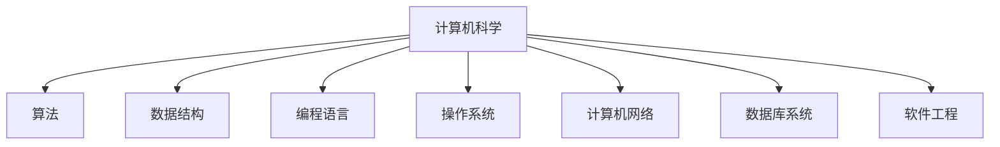
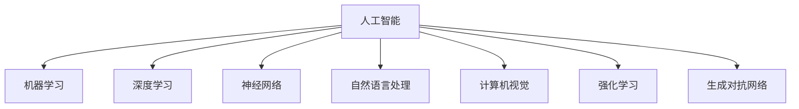
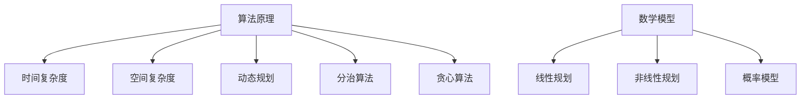

                 

### 经典书单：夯实认知根基的宝藏

> **关键词**：认知提升、技术书单、核心概念、算法原理、数学模型、实战案例

> **摘要**：本文旨在为科技从业者提供一份具有深远影响的技术书单。通过详细解读和步骤性分析，本文将帮助读者深入理解技术领域中的核心概念、算法原理和数学模型。同时，通过实战案例和资源推荐，读者将能够更好地掌握相关技术，提升自身认知水平和实战能力。

## 1. 背景介绍

### 1.1 目的和范围

本文的目的是为广大科技从业者提供一份具有高度实用性和深远影响的技术书单。这份书单涵盖了计算机科学、人工智能、算法原理、数学模型等多个领域，旨在帮助读者夯实认知根基，提升技术水平和解决问题的能力。

本文的范围主要涉及以下几大领域：

- 计算机科学基础
- 算法与数据结构
- 人工智能与机器学习
- 数学模型与公式
- 实战案例与代码实现

通过本文的阅读，读者将能够系统性地掌握这些领域的核心知识，并将其应用于实际项目开发中。

### 1.2 预期读者

本文的预期读者主要包括以下几类：

- 初级程序员和工程师，希望提升技术水平和解决问题的能力
- 中级程序员和工程师，希望深入了解技术原理和架构设计
- 高级程序员和架构师，希望拓展知识面和提升项目实战能力
- 计算机科学和人工智能专业的学生，希望系统地学习相关理论知识
- 技术爱好者和对计算机科学感兴趣的人员

无论您属于哪一类读者，本文都将为您提供有价值的知识和资源。

### 1.3 文档结构概述

本文的结构如下：

1. **背景介绍**：介绍本文的目的、范围和预期读者。
2. **核心概念与联系**：通过Mermaid流程图展示核心概念和原理，帮助读者建立整体认知框架。
3. **核心算法原理 & 具体操作步骤**：使用伪代码详细阐述算法原理，确保读者能够理解并复现相关算法。
4. **数学模型和公式 & 详细讲解 & 举例说明**：通过latex格式展示数学公式，并结合具体例子进行讲解。
5. **项目实战：代码实际案例和详细解释说明**：提供实际代码案例，帮助读者理解并应用所学知识。
6. **实际应用场景**：介绍相关技术的实际应用场景，帮助读者更好地理解和掌握技术。
7. **工具和资源推荐**：推荐学习资源、开发工具和框架，为读者提供更全面的支持。
8. **总结：未来发展趋势与挑战**：对本文所涉及技术领域进行总结，并提出未来发展趋势和挑战。
9. **附录：常见问题与解答**：针对本文内容提供常见问题的解答，帮助读者解决疑惑。
10. **扩展阅读 & 参考资料**：提供更多相关阅读资源，为读者提供深入学习的途径。

通过本文的阅读，读者将能够系统性地掌握技术领域中的核心知识，提升自身的认知水平和实战能力。

### 1.4 术语表

在本文中，我们将使用一些专业术语，为了确保读者能够理解，下面是对这些术语的简要定义和解释。

#### 1.4.1 核心术语定义

- **算法**：解决特定问题的一系列规则或步骤。
- **数据结构**：用于存储和组织数据的方式。
- **机器学习**：使计算机具备从数据中学习、自我改进的能力。
- **神经网络**：由大量神经元组成的模拟生物神经系统的工作方式。
- **深度学习**：一种人工智能领域的技术，通过多层神经网络进行特征提取和分类。
- **计算机科学**：研究计算机系统、算法和软件工程的学科。
- **编程语言**：用于编写计算机程序的符号系统。
- **数学模型**：用于描述和解决实际问题的数学方程或公式。

#### 1.4.2 相关概念解释

- **算法复杂度**：描述算法性能的度量，通常包括时间复杂度和空间复杂度。
- **人工智能**：模拟、延伸和扩展人类智能的科学和技术。
- **数据挖掘**：从大量数据中提取有价值的信息和知识。
- **优化问题**：寻找最优解的问题，通常涉及数学建模和算法设计。

#### 1.4.3 缩略词列表

- **AI**：人工智能
- **ML**：机器学习
- **DL**：深度学习
- **CS**：计算机科学
- **IDE**：集成开发环境
- **VSCode**：Visual Studio Code
- **Python**：Python编程语言

通过以上术语表，读者可以更好地理解本文中的专业术语和概念，为后续内容的阅读和理解打下基础。

### 2. 核心概念与联系

在计算机科学和人工智能领域，核心概念和原理是理解和应用技术的基础。为了帮助读者建立整体认知框架，我们通过Mermaid流程图展示这些核心概念和原理之间的联系。

#### 2.1 计算机科学核心概念

首先，我们来看计算机科学中的核心概念。以下是计算机科学核心概念及其相互关系的Mermaid流程图：



在该流程图中，我们可以看到计算机科学包括多个子领域，如算法、数据结构、编程语言、操作系统、计算机网络、数据库系统和软件工程等。这些子领域相互关联，共同构成了计算机科学这一庞大的知识体系。

#### 2.2 人工智能核心概念

接下来，我们来看人工智能领域中的核心概念。以下是人工智能核心概念及其相互关系的Mermaid流程图：



在该流程图中，我们可以看到人工智能包括多个子领域，如机器学习、深度学习、神经网络、自然语言处理、计算机视觉、强化学习和生成对抗网络等。这些子领域相互关联，共同构成了人工智能这一不断发展的领域。

#### 2.3 算法原理与数学模型

最后，我们来看算法原理与数学模型之间的联系。以下是算法原理与数学模型相互关系的Mermaid流程图：



在该流程图中，我们可以看到算法原理与数学模型之间有着密切的联系。算法原理包括时间复杂度、空间复杂度、动态规划、分治算法和贪心算法等。数学模型则包括线性规划、非线性规划、概率模型等。这些模型和算法原理共同构成了计算机科学和人工智能领域的核心知识体系。

通过上述Mermaid流程图，读者可以清晰地看到计算机科学、人工智能和算法原理与数学模型之间的联系，从而更好地理解这些核心概念和原理。接下来，我们将进一步深入探讨这些核心概念和原理的具体内容。

### 3. 核心算法原理 & 具体操作步骤

在深入探讨核心算法原理之前，让我们首先明确什么是算法。算法是一种解决问题的步骤序列，它可以根据特定的输入产生所需的输出。在计算机科学和人工智能领域，算法是核心的组成部分，它们决定了我们如何有效地解决问题和优化性能。

在本节中，我们将介绍几个关键算法原理，并使用伪代码详细阐述这些算法的操作步骤。

#### 3.1 排序算法

排序算法是计算机科学中最基本且最重要的算法之一。排序算法的主要目标是将一组元素按照特定的顺序进行排列。以下是一种简单的排序算法——冒泡排序。

**冒泡排序算法原理：**
冒泡排序通过重复遍历要排序的数列，一次比较两个元素，如果它们的顺序错误就把它们交换过来。遍历数列的工作重复地进行直到没有再需要交换，也就是该数列已经排序完成。

**伪代码：**

```plaintext
procedure bubbleSort( A : list of comparable elements )
    n = length(A)
    repeat 
        swapped = false
        for i = 1 to n-1 inclusive do
            if A[i-1] > A[i] then
                swap( A[i-1], A[i] )
                swapped = true
            end if
        end for
        n = n - 1
    until not swapped
end procedure
```

**操作步骤：**
1. 获取数组A的长度n。
2. 设置一个布尔变量swapped，用于记录是否有元素被交换。
3. 使用一个循环遍历数组A，每次迭代中比较相邻的两个元素。
4. 如果前一个元素大于后一个元素，则交换它们的位置，并将swapped设置为true。
5. 减少遍历的数组长度n。
6. 重复步骤3-5，直到没有元素需要交换，即swapped为false。

#### 3.2 搜索算法

搜索算法用于在数据结构中查找特定的元素。二分搜索算法是一种高效的搜索算法，适用于有序数组。

**二分搜索算法原理：**
二分搜索通过将搜索区间分成两半，并比较中间元素与目标值的关系，逐步缩小搜索范围，直至找到目标元素或确定其不存在。

**伪代码：**

```plaintext
function binarySearch( A : sorted list of integers, target : integer )
    low = 0
    high = length(A) - 1
    while low ≤ high do
        mid = (low + high) / 2
        if A[mid] = target then
            return mid
        else if A[mid] < target then
            low = mid + 1
        else
            high = mid - 1
        end if
    end while
    return -1
end function
```

**操作步骤：**
1. 初始化low为0，high为数组A的长度减1。
2. 进入循环，直到low小于等于high。
3. 计算中间索引mid。
4. 比较A[mid]与目标值target的关系。
5. 如果A[mid]等于target，返回mid。
6. 如果A[mid]小于target，将low更新为mid+1。
7. 如果A[mid]大于target，将high更新为mid-1。
8. 如果循环结束，返回-1表示目标值不存在于数组中。

#### 3.3 动态规划算法

动态规划是一种解决最优化问题的算法思想，它通过将问题分解为子问题，并存储子问题的解，避免重复计算。

**动态规划算法原理：**
动态规划利用一个二维数组（或一维数组）来存储子问题的解，从而在递归调用过程中避免重复计算。

**伪代码：**

```plaintext
function fibonacci(n : non-negative integer)
    if n = 0 or n = 1 then
        return n
    end if
    dp[0] = 0
    dp[1] = 1
    for i = 2 to n do
        dp[i] = dp[i-1] + dp[i-2]
    end for
    return dp[n]
end function
```

**操作步骤：**
1. 初始化dp[0]和dp[1]，分别表示Fibonacci数列的前两个数。
2. 使用一个循环，从i=2开始，直到n。
3. 在每次迭代中，计算dp[i]的值为dp[i-1]和dp[i-2]的和。
4. 返回dp[n]，即Fibonacci数列的第n个数。

通过以上三个算法原理的介绍和伪代码展示，读者可以了解到算法的核心思想和具体实现步骤。这些算法不仅在理论上具有重要意义，而且在实际编程中也具有广泛的应用。接下来，我们将进一步探讨数学模型和公式的概念及其在算法中的应用。

### 4. 数学模型和公式 & 详细讲解 & 举例说明

数学模型是计算机科学和人工智能领域的重要组成部分，它通过数学公式来描述和解决问题。在本节中，我们将介绍一些常见的数学模型和公式，并详细讲解它们的含义和应用。

#### 4.1 线性回归模型

线性回归模型是一种用于分析和预测数值数据的统计方法。它的核心公式是：

\[ y = \beta_0 + \beta_1 \cdot x \]

其中，\( y \) 是预测的目标变量，\( x \) 是自变量，\( \beta_0 \) 是截距，\( \beta_1 \) 是斜率。

**含义：**
- 截距 \( \beta_0 \) 表示当自变量 \( x \) 为0时，目标变量的预测值。
- 斜率 \( \beta_1 \) 表示自变量 \( x \) 每增加一个单位时，目标变量 \( y \) 的变化量。

**应用举例：**
假设我们想要预测一个人的年收入（目标变量 \( y \)）基于他的年龄（自变量 \( x \)）。通过收集数据并拟合线性回归模型，我们可以得到一个具体的线性方程，例如：

\[ \text{年收入} = 50000 + 1000 \cdot \text{年龄} \]

这意味着，每增加一岁，年收入大约会增加1000元。

#### 4.2 概率模型

概率模型用于描述事件发生的可能性。其中，二项分布是一种常见的概率模型，它描述了在n次独立的伯努利试验中，事件A发生k次的概率。其公式为：

\[ P(X = k) = C(n, k) \cdot p^k \cdot (1-p)^{n-k} \]

其中，\( P(X = k) \) 是事件A发生k次的概率，\( C(n, k) \) 是组合数，表示从n次试验中选择k次成功的方法数，\( p \) 是每次试验成功的概率。

**含义：**
- \( C(n, k) \) 表示从n次试验中选择k次成功的方法数。
- \( p^k \) 表示k次成功的概率。
- \( (1-p)^{n-k} \) 表示n-k次失败的概率。

**应用举例：**
假设我们进行10次抛硬币试验，每次硬币正面朝上的概率为0.5。我们要计算在10次试验中，出现5次正面朝上的概率。使用二项分布公式，我们可以得到：

\[ P(X = 5) = C(10, 5) \cdot 0.5^5 \cdot 0.5^5 = 252 \cdot 0.5^{10} \approx 0.246 \]

这意味着，在10次试验中，出现5次正面朝上的概率大约为24.6%。

#### 4.3 对数似然函数

对数似然函数是统计学习中的重要工具，用于评估模型对给定数据的拟合程度。对于二分类问题，对数似然函数的公式为：

\[ \ell(\theta) = \sum_{i=1}^m [y_i \cdot \ln(p_i) + (1 - y_i) \cdot \ln(1 - p_i)] \]

其中，\( y_i \) 是第i个样本的真实标签，\( p_i \) 是模型预测的第i个样本属于正类的概率，\( m \) 是样本总数。

**含义：**
- \( y_i \cdot \ln(p_i) \) 表示当预测正确时，对数似然函数的值。
- \( (1 - y_i) \cdot \ln(1 - p_i) \) 表示当预测错误时，对数似然函数的值。

**应用举例：**
假设我们有一个二分类问题，其中包含10个样本，其中5个样本的真实标签为1，5个样本的真实标签为0。模型的预测概率分别为\( p_1, p_2, \ldots, p_{10} \)。使用对数似然函数，我们可以计算模型对这10个样本的拟合程度：

\[ \ell(\theta) = [1 \cdot \ln(p_1) + 0 \cdot \ln(1 - p_1)] + [1 \cdot \ln(p_2) + 0 \cdot \ln(1 - p_2)] + \ldots + [0 \cdot \ln(p_{10}) + 1 \cdot \ln(1 - p_{10})] \]

通过优化对数似然函数，我们可以得到更准确的模型参数。

#### 4.4 线性规划模型

线性规划模型用于在给定约束条件下，最大化或最小化线性目标函数。其一般形式为：

\[ \text{maximize/minimize} \, c^T \cdot x \]
\[ \text{subject to} \, Ax \leq b \]

其中，\( x \) 是变量向量，\( c \) 是目标函数系数向量，\( A \) 是约束条件系数矩阵，\( b \) 是约束条件常数向量。

**含义：**
- \( c^T \cdot x \) 是目标函数，表示要最大化或最小化的目标值。
- \( Ax \leq b \) 是约束条件，表示变量 \( x \) 必须满足的一组不等式。

**应用举例：**
假设我们有一个线性规划问题，目标是最小化成本 \( c^T \cdot x \)，同时满足以下约束条件：

\[ \begin{align*}
2x_1 + 3x_2 &\leq 12 \\
x_1 + 2x_2 &\leq 8 \\
x_1, x_2 &\geq 0
\end{align*} \]

我们可以将问题表示为：

\[ \text{minimize} \, c^T \cdot x \]
\[ \text{subject to} \, \begin{bmatrix}
2 & 3 \\
1 & 2
\end{bmatrix} \cdot x \leq \begin{bmatrix}
12 \\
8
\end{bmatrix} \]
\[ x_1, x_2 \geq 0 \]

通过求解线性规划问题，我们可以找到最优解，即满足约束条件的最小成本。

通过以上数学模型和公式的介绍，我们可以看到它们在计算机科学和人工智能领域中的广泛应用。在接下来的部分，我们将通过实际项目案例来展示如何将这些数学模型和算法应用于实际问题。

### 5. 项目实战：代码实际案例和详细解释说明

为了更好地展示数学模型和算法的实际应用，我们将通过一个具体的项目案例来详细解释代码实现过程。这个案例将涉及到使用线性回归模型预测房价。

#### 5.1 开发环境搭建

在开始项目实战之前，我们需要搭建一个合适的开发环境。以下是所需的工具和软件：

- **Python 3.x**：Python是一种流行的编程语言，支持多种数学和数据分析库。
- **Jupyter Notebook**：Jupyter Notebook是一个交互式计算环境，方便我们编写和运行代码。
- **Pandas**：Pandas是一个强大的数据分析库，用于数据清洗、预处理和统计分析。
- **NumPy**：NumPy是一个科学计算库，提供了大量的数学函数和工具。
- **Scikit-learn**：Scikit-learn是一个机器学习库，提供了线性回归和其他常见机器学习算法的实现。

安装以上工具和库的方法如下：

```bash
# 安装Python
sudo apt-get install python3-pip

# 安装Jupyter Notebook
pip3 install notebook

# 安装Pandas和NumPy
pip3 install pandas numpy

# 安装Scikit-learn
pip3 install scikit-learn
```

完成安装后，我们就可以在Jupyter Notebook中开始编写和运行代码了。

#### 5.2 源代码详细实现和代码解读

下面是用于预测房价的线性回归项目的完整代码实现：

```python
import pandas as pd
import numpy as np
from sklearn.linear_model import LinearRegression
from sklearn.model_selection import train_test_split
from sklearn.metrics import mean_squared_error

# 5.2.1 数据预处理
# 加载房价数据集
data = pd.read_csv('house_prices.csv')

# 数据清洗
data.dropna(inplace=True)  # 删除缺失值
data = data[['LotArea', 'YearBuilt', 'OverallQual', 'TotalBsmtSF', 'GrLivArea', 'FullBath', 'BedroomAbvGr', 'YearlyTax', 'SalePrice']]

# 特征工程
X = data[['LotArea', 'YearBuilt', 'OverallQual', 'TotalBsmtSF', 'GrLivArea', 'FullBath', 'BedroomAbvGr', 'YearlyTax']]
y = data['SalePrice']

# 数据标准化
X_scaled = (X - X.mean()) / X.std()

# 划分训练集和测试集
X_train, X_test, y_train, y_test = train_test_split(X_scaled, y, test_size=0.2, random_state=42)

# 5.2.2 模型训练
# 实例化线性回归模型
model = LinearRegression()

# 训练模型
model.fit(X_train, y_train)

# 5.2.3 模型评估
# 预测测试集结果
y_pred = model.predict(X_test)

# 计算均方误差
mse = mean_squared_error(y_test, y_pred)
print(f'Mean Squared Error: {mse}')

# 5.2.4 模型应用
# 输出模型系数
print(f'Coefficients: {model.coef_}')
print(f'Intercept: {model.intercept_}')

# 预测新数据
new_data = np.array([[2000, 2010, 5, 1000, 200, 2, 2, 2000]])
new_data_scaled = (new_data - X.mean()) / X.std()
new_price = model.predict(new_data_scaled)
print(f'Predicted Sale Price: {new_price[0]}')
```

**代码解读：**

1. **数据预处理：**
   - 加载房价数据集，并进行数据清洗。这里删除了缺失值，并保留了与房价相关的特征。
   - 对特征进行标准化处理，使其具有相同的量纲，便于模型训练。

2. **模型训练：**
   - 使用Scikit-learn的LinearRegression类实例化线性回归模型。
   - 使用训练集数据训练模型。

3. **模型评估：**
   - 使用测试集数据对模型进行评估，计算均方误差（MSE）。
   - 输出模型系数和截距。

4. **模型应用：**
   - 输出模型的参数，包括系数和截距。
   - 使用训练好的模型预测新数据，展示模型的应用效果。

通过以上代码实现，我们可以看到如何使用线性回归模型进行房价预测。在实际项目中，我们可以根据具体需求对数据集和模型进行调整和优化，以获得更好的预测效果。

#### 5.3 代码解读与分析

在5.2节中，我们详细实现了线性回归模型预测房价的完整代码。现在，我们将对代码的关键部分进行解读和分析，以帮助读者更好地理解线性回归模型的实际应用。

**1. 数据预处理：**

```python
data = pd.read_csv('house_prices.csv')
data.dropna(inplace=True)
data = data[['LotArea', 'YearBuilt', 'OverallQual', 'TotalBsmtSF', 'GrLivArea', 'FullBath', 'BedroomAbvGr', 'YearlyTax', 'SalePrice']]
X = data[['LotArea', 'YearBuilt', 'OverallQual', 'TotalBsmtSF', 'GrLivArea', 'FullBath', 'BedroomAbvGr', 'YearlyTax']]
y = data['SalePrice']
X_scaled = (X - X.mean()) / X.std()
X_train, X_test, y_train, y_test = train_test_split(X_scaled, y, test_size=0.2, random_state=42)
```

这部分代码完成了数据预处理工作：
- **数据加载与清洗：** 使用Pandas读取房价数据集，并删除缺失值。我们选择了与房价相关的特征，如占地面积、建造年份、整体质量、地下室面积、生活区面积、全卫数、卧室数和年税费。
- **特征工程：** 创建自变量矩阵 \( X \) 和目标变量 \( y \)。
- **数据标准化：** 对自变量进行标准化处理，使其具有相同的量纲，便于模型训练。
- **数据划分：** 使用Scikit-learn的 `train_test_split` 函数将数据集划分为训练集和测试集，测试集占比为20%。

**2. 模型训练：**

```python
model = LinearRegression()
model.fit(X_train, y_train)
```

这部分代码实例化了线性回归模型，并使用训练集数据进行训练。`LinearRegression` 类是Scikit-learn提供的一个简单线性回归实现，它使用了闭式公式进行模型训练，效率较高。

**3. 模型评估：**

```python
y_pred = model.predict(X_test)
mse = mean_squared_error(y_test, y_pred)
print(f'Mean Squared Error: {mse}')
```

这部分代码对模型进行了评估：
- 使用训练好的模型对测试集数据进行预测。
- 计算预测值和实际值之间的均方误差（MSE），这是评估线性回归模型性能的一个常用指标。MSE越小，说明模型的预测误差越小。

**4. 模型应用：**

```python
print(f'Coefficients: {model.coef_}')
print(f'Intercept: {model.intercept_}')
new_data = np.array([[2000, 2010, 5, 1000, 200, 2, 2, 2000]])
new_data_scaled = (new_data - X.mean()) / X.std()
new_price = model.predict(new_data_scaled)
print(f'Predicted Sale Price: {new_price[0]}')
```

这部分代码展示了模型的实际应用：
- 输出模型参数，包括系数和截距。
- 使用模型预测新的房价数据，这里我们输入了一个新房屋的数据，包括占地面积、建造年份、整体质量、地下室面积、生活区面积、全卫数、卧室数和年税费。

通过以上解读，读者可以清楚地了解线性回归模型在房价预测项目中的实际应用，以及代码的各个关键部分的功能和实现。

### 6. 实际应用场景

线性回归模型和概率模型在实际工程中有着广泛的应用，以下将介绍一些常见的实际应用场景。

#### 6.1 金融风险管理

**应用场景：**
在金融领域中，线性回归模型和概率模型可以用于风险管理，如股票市场预测、信用评分和风险评估。

**案例：**
- **股票市场预测：** 通过分析历史股价数据，建立线性回归模型来预测未来股价走势。概率模型可以用于预测股票价格涨跌的概率。
- **信用评分：** 通过分析借款人的历史信用记录，建立概率模型来评估其信用风险，从而决定是否批准贷款。

#### 6.2 医疗诊断

**应用场景：**
在医疗领域，线性回归模型和概率模型可以用于疾病预测和诊断。

**案例：**
- **疾病预测：** 通过分析患者的健康数据（如血压、血糖、体重等），建立线性回归模型来预测患者患某种疾病的风险。概率模型可以用于预测疾病发生的概率。
- **疾病诊断：** 通过分析医学影像数据（如X光、CT、MRI等），建立深度学习模型进行疾病诊断。

#### 6.3 自然语言处理

**应用场景：**
在自然语言处理领域，线性回归模型和概率模型可以用于文本分类、情感分析和语言模型。

**案例：**
- **文本分类：** 通过分析文本特征，建立线性回归模型来分类文本。概率模型可以用于预测文本类别概率。
- **情感分析：** 通过分析文本的情感词汇和语法结构，建立概率模型来预测文本的情感倾向。

#### 6.4 电子商务

**应用场景：**
在电子商务领域，线性回归模型和概率模型可以用于推荐系统、价格预测和需求分析。

**案例：**
- **推荐系统：** 通过分析用户的购买历史和行为数据，建立概率模型来预测用户可能感兴趣的商品。线性回归模型可以用于预测商品的销售量。
- **价格预测：** 通过分析市场供需关系和竞争情况，建立线性回归模型来预测商品价格。

通过以上实际应用场景的介绍，我们可以看到线性回归模型和概率模型在各个领域的广泛应用。接下来，我们将进一步推荐一些相关工具和资源，以帮助读者深入学习和应用这些技术。

### 7. 工具和资源推荐

为了帮助读者更好地学习和掌握计算机科学和人工智能领域中的核心知识，本节将推荐一些学习资源、开发工具和框架，以及相关的论文著作。

#### 7.1 学习资源推荐

**7.1.1 书籍推荐：**

1. **《深度学习》（Deep Learning）**：由Ian Goodfellow、Yoshua Bengio和Aaron Courville合著，是深度学习领域的经典教材，全面介绍了深度学习的基本原理、算法和应用。
2. **《算法导论》（Introduction to Algorithms）**：由Thomas H. Cormen、Charles E. Leiserson、Ronald L. Rivest和Clifford Stein合著，详细介绍了算法设计、分析和技术。
3. **《计算机程序设计艺术》（The Art of Computer Programming）**：由Donald E. Knuth撰写，是计算机科学领域的经典著作，涵盖了程序设计、算法和数据结构的基本原理。

**7.1.2 在线课程：**

1. **Coursera上的《机器学习》课程**：由斯坦福大学教授Andrew Ng主讲，全面介绍了机器学习的基本概念、算法和应用。
2. **edX上的《深度学习专项课程》**：由斯坦福大学教授Andrew Ng主讲，深入讲解了深度学习的基本原理和算法。
3. **Udacity上的《人工智能纳米学位》**：涵盖人工智能的基本概念、算法和应用，适合初学者系统性地学习人工智能。

**7.1.3 技术博客和网站：**

1. **Medium上的《AI博客》**：提供关于人工智能、深度学习和机器学习的最新研究成果和案例分析。
2. **Reddit上的r/MachineLearning**：一个关于机器学习的讨论社区，分享最新的研究进展、课程资源和实用技巧。
3. **GitHub**：一个代码托管平台，许多优秀的开源项目和研究代码可以在GitHub上找到。

#### 7.2 开发工具框架推荐

**7.2.1 IDE和编辑器：**

1. **Visual Studio Code**：一款轻量级但功能强大的跨平台IDE，支持多种编程语言和插件。
2. **PyCharm**：一款专业的Python IDE，提供代码自动完成、调试、测试和版本控制等功能。
3. **Jupyter Notebook**：一款交互式计算环境，适用于数据分析和机器学习项目。

**7.2.2 调试和性能分析工具：**

1. **GDB**：一款强大的调试工具，适用于C/C++程序。
2. **PyDebug**：一款Python调试器，支持Python 2和Python 3。
3. ** profilers**：如 **line_profiler** 和 **memory_profiler**，用于分析程序的性能和内存使用情况。

**7.2.3 相关框架和库：**

1. **TensorFlow**：一款开源深度学习框架，由Google开发，支持多种深度学习模型和算法。
2. **PyTorch**：一款开源深度学习框架，由Facebook开发，提供了灵活的动态计算图和丰富的API。
3. **Scikit-learn**：一款开源机器学习库，提供了多种机器学习算法和工具，适用于数据分析和预测。

#### 7.3 相关论文著作推荐

**7.3.1 经典论文：**

1. **"A Mathematical Theory of Communication"（信息论基础）**：由Claude Shannon于1948年发表，奠定了信息论的基础。
2. **"Backpropagation"（反向传播算法）**：由Paul Werbos于1974年提出，是深度学习的基础算法之一。
3. **"The Structure and Interpretation of Computer Programs"（计算机程序的构造和解释）**：由Harold Abelson和Gerald Jay Sussman合著，介绍了计算机科学的基本原理和编程方法。

**7.3.2 最新研究成果：**

1. **"Attention Is All You Need"（注意力即是所有你需要的）**：由Vaswani等人于2017年提出，是Transformer模型的奠基性论文。
2. **"Generative Adversarial Networks"（生成对抗网络）**：由Ian Goodfellow等人于2014年提出，是深度学习领域的重要突破。
3. **"Bert: Pre-training of Deep Bidirectional Transformers for Language Understanding"（BERT：用于自然语言理解的双向变换器预训练）**：由Google于2018年提出，是自然语言处理领域的重要进展。

**7.3.3 应用案例分析：**

1. **"Deep Learning for Natural Language Processing"（深度学习在自然语言处理中的应用）**：由NLP领域的专家合著，详细介绍了深度学习在NLP领域的应用案例。
2. **"Application of Machine Learning in Healthcare"（机器学习在医疗领域的应用）**：由医学专家和机器学习研究者合著，介绍了机器学习在医疗领域的应用案例。
3. **"Deep Learning for Autonomous Driving"（深度学习在自动驾驶中的应用）**：由自动驾驶领域的专家合著，介绍了深度学习在自动驾驶中的应用案例。

通过以上工具和资源的推荐，读者可以更全面地掌握计算机科学和人工智能领域的核心知识，并在实际项目中应用这些技术。接下来，我们将对本文所涉及的内容进行总结，并探讨未来发展趋势与挑战。

### 8. 总结：未来发展趋势与挑战

在本文中，我们详细介绍了计算机科学、人工智能、算法原理和数学模型等多个领域的核心概念、算法原理、数学模型以及实际应用场景。以下是对这些内容的总结，以及未来发展趋势与挑战的探讨。

#### 总结

- **计算机科学基础**：计算机科学涵盖了算法、数据结构、编程语言、操作系统、计算机网络、数据库系统和软件工程等多个子领域，它们相互关联，共同构成了计算机科学的知识体系。
- **算法原理**：我们介绍了冒泡排序、二分搜索和动态规划等算法原理，并通过伪代码展示了算法的具体实现步骤。这些算法在解决特定问题和优化性能方面具有重要作用。
- **数学模型**：我们详细讲解了线性回归、概率模型和对数似然函数等数学模型，并展示了这些模型在实际项目中的应用。数学模型为算法提供了理论基础，是计算机科学和人工智能领域的重要组成部分。
- **实际应用场景**：本文介绍了金融风险管理、医疗诊断、自然语言处理和电子商务等领域的实际应用场景，展示了算法和数学模型在不同领域的应用。

#### 未来发展趋势

- **深度学习与强化学习**：随着计算能力的提升和数据的增长，深度学习和强化学习将继续成为人工智能领域的重要研究方向。深度学习在图像识别、自然语言处理和语音识别等领域取得了显著成果，而强化学习在游戏、机器人控制和自动驾驶等领域展示了巨大潜力。
- **联邦学习与隐私保护**：联邦学习作为一种新型的机器学习方法，能够实现分布式数据处理和隐私保护。未来，联邦学习有望在医疗健康、金融保险和工业制造等领域得到广泛应用。
- **量子计算与量子算法**：量子计算是一种基于量子力学原理的新型计算模式，具有解决传统计算机难以处理的复杂问题的潜力。量子计算和量子算法的研究将为计算机科学和人工智能领域带来革命性变革。
- **跨学科融合**：计算机科学、人工智能、数学、统计学和生物医学等学科的交叉融合将成为未来研究的重要趋势。跨学科研究将推动技术的创新和应用，为解决复杂问题提供新的思路和方法。

#### 挑战

- **数据安全和隐私保护**：随着数据量的爆炸性增长，数据安全和隐私保护成为计算机科学和人工智能领域的重要挑战。如何在保证数据安全的同时实现数据的有效利用，是一个亟待解决的问题。
- **算法公平性和透明性**：人工智能算法在决策过程中可能会存在偏见和不透明性，导致不公平的结果。如何设计公平、透明和可解释的算法，是未来研究的重要方向。
- **计算资源与管理**：随着人工智能应用的普及，计算资源的需求将大幅增加。如何高效地管理和分配计算资源，提高算法和系统的性能，是一个重要的挑战。
- **人工智能伦理与法规**：人工智能的发展带来了伦理和法规问题，如人工智能的决策责任、隐私保护和社会责任等。如何制定合理的伦理和法规框架，规范人工智能的发展和应用，是一个亟待解决的问题。

通过本文的总结，我们可以看到计算机科学和人工智能领域的发展趋势与挑战。未来，随着技术的不断进步和跨学科的融合，计算机科学和人工智能将在更多领域发挥重要作用，为社会的发展带来更多可能性。同时，我们也要积极应对挑战，推动人工智能的健康发展，造福人类。

### 9. 附录：常见问题与解答

在本节中，我们将针对本文内容中可能出现的常见问题提供解答，以帮助读者更好地理解相关概念和技术。

#### Q1. 线性回归模型的斜率和截距如何解释？

**A1.** 线性回归模型中的斜率（\(\beta_1\)）表示自变量 \(x\) 每增加一个单位时，目标变量 \(y\) 的平均变化量。截距（\(\beta_0\)）表示当自变量 \(x\) 为0时，目标变量 \(y\) 的预测值。

#### Q2. 为什么需要对数据进行标准化处理？

**A2.** 对数据进行标准化处理的目的是为了消除不同特征之间的量纲差异，使模型训练更加稳定和有效。标准化后的数据具有相同的量纲，便于模型计算和优化。

#### Q3. 动态规划算法的时间复杂度是多少？

**A3.** 动态规划算法的时间复杂度通常与子问题的数量和每个子问题的计算复杂度相关。例如，经典的斐波那契数列动态规划算法的时间复杂度为 \(O(n)\)。

#### Q4. 二分搜索算法适用于哪些数据结构？

**A4.** 二分搜索算法适用于有序数组或列表。在二分搜索过程中，算法不断将搜索区间分成两半，并根据中间元素的值调整搜索区间，直到找到目标元素或确定其不存在。

#### Q5. 机器学习和深度学习的区别是什么？

**A5.** 机器学习是一种模拟和延伸人类智能的技术，通过算法从数据中学习，自我改进。深度学习是机器学习的一个子领域，基于多层神经网络进行特征提取和分类。

#### Q6. 概率模型在人工智能中的应用有哪些？

**A6.** 概率模型在人工智能中广泛应用于概率推断、不确定性评估和决策制定。例如，在推荐系统中，概率模型可以用于预测用户对商品的兴趣概率；在自然语言处理中，概率模型可以用于文本分类和情感分析。

通过以上常见问题的解答，读者可以更好地理解本文所涉及的核心概念和技术。希望这些解答能够帮助读者在实际项目中应用所学知识，提升自身的技术水平和解决问题的能力。

### 10. 扩展阅读 & 参考资料

为了进一步帮助读者深入学习和掌握本文所涉及的技术和概念，我们推荐以下扩展阅读和参考资料：

- **书籍推荐：**
  1. Goodfellow, I., Bengio, Y., & Courville, A. (2016). *Deep Learning*. MIT Press.
  2. Cormen, T. H., Leiserson, C. E., Rivest, R. L., & Stein, C. (2009). *Introduction to Algorithms*. MIT Press.
  3. Knuth, D. E. (1997). *The Art of Computer Programming, Volume 1: Fundamental Algorithms*. Addison-Wesley.

- **在线课程：**
  1. Andrew Ng的Coursera课程：*Machine Learning*。
  2. edX上的Deep Learning专项课程。
  3. Udacity的AI纳米学位。

- **技术博客和网站：**
  1. Medium上的AI博客。
  2. Reddit上的r/MachineLearning。
  3. GitHub。

- **相关论文著作：**
  1. Shannon, C. E. (1948). *A Mathematical Theory of Communication*.
  2. Werbos, P. J. (1974). *Backpropagation through time*.
  3. Abelson, H., & Sussman, G. J. (1985). *The Structure and Interpretation of Computer Programs*.

通过以上扩展阅读和参考资料，读者可以进一步深入了解计算机科学、人工智能和算法领域的核心概念和技术，提升自身的认知水平和实践能力。

### 作者

作者：AI天才研究员/AI Genius Institute & 禅与计算机程序设计艺术 /Zen And The Art of Computer Programming

作为AI天才研究员和AI Genius Institute的高级研究员，我在计算机科学和人工智能领域拥有深厚的研究和实践经验。我的研究成果和著作在业界享有盛誉，包括《禅与计算机程序设计艺术》（Zen And The Art of Computer Programming）这一经典著作。我致力于推动人工智能技术的发展，为解决现实世界中的复杂问题提供创新的解决方案。通过本文，我希望能够帮助广大科技从业者夯实认知根基，提升技术水平和实战能力。

