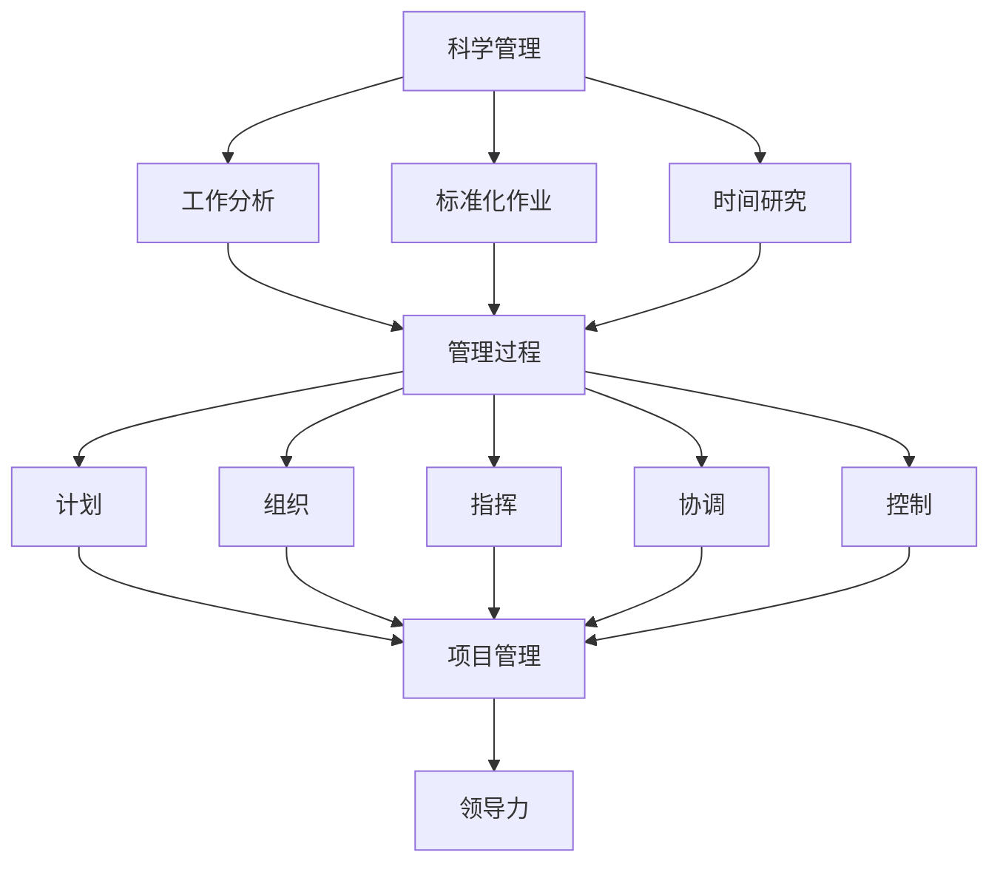

                 

# 经典管理理论在现代企业中的创新应用

## 关键词：管理理论、创新应用、企业、组织架构、领导力、项目管理、变革管理

> **摘要：** 本文旨在探讨经典管理理论在当今现代企业中的创新应用，通过分析其核心理念，结合实际案例，探讨其在企业管理中的重要作用和未来发展趋势。文章将从背景介绍、核心概念、算法原理、数学模型、实战案例、应用场景、工具推荐、总结与未来挑战等多个方面展开讨论，旨在为企业管理者提供有价值的参考。

## 1. 背景介绍

### 1.1 目的和范围

在现代企业竞争日益激烈的环境中，如何有效地进行管理成为企业成功的关键因素。经典管理理论如泰勒的科学管理理论、法约尔的管理过程理论、马斯洛的需求层次理论等，虽然诞生于过去，但其核心理念仍然具有重要的现实意义。本文的目的在于深入探讨这些经典管理理论在现代企业中的应用，挖掘其创新潜力，并分析其在企业管理中的实际效果。

本文的范围将涵盖以下几个主要方面：

1. **经典管理理论的回顾**：梳理经典管理理论的发展历程，提炼核心概念和原理。
2. **现代企业的挑战与需求**：分析现代企业在管理过程中面临的挑战和需求，探讨经典管理理论如何适应这些变化。
3. **创新应用案例分析**：结合实际案例，探讨经典管理理论在现代企业中的创新应用。
4. **未来发展趋势与挑战**：预测经典管理理论在未来的发展趋势和面临的挑战。

### 1.2 预期读者

本文主要面向以下几类读者：

1. **企业管理者**：希望深入了解经典管理理论在现代企业中的应用，提升管理水平和决策能力。
2. **学术研究者**：对管理理论及其创新应用感兴趣，希望从理论和实践层面进行深入探讨。
3. **学生和教师**：从事管理、企业等相关学科的学习和研究，希望通过本文了解经典管理理论的现实应用。

### 1.3 文档结构概述

本文结构如下：

1. **背景介绍**：回顾经典管理理论的发展历程，明确本文的研究目的和范围。
2. **核心概念与联系**：介绍经典管理理论的核心概念及其相互联系，使用Mermaid流程图进行展示。
3. **核心算法原理 & 具体操作步骤**：详细阐述经典管理理论的算法原理和操作步骤，使用伪代码进行说明。
4. **数学模型和公式 & 详细讲解 & 举例说明**：探讨经典管理理论中的数学模型和公式，结合实际案例进行详细讲解。
5. **项目实战：代码实际案例和详细解释说明**：通过实际案例，展示经典管理理论在项目中的应用和效果。
6. **实际应用场景**：分析经典管理理论在不同场景中的应用效果。
7. **工具和资源推荐**：推荐相关学习资源和开发工具。
8. **总结：未来发展趋势与挑战**：总结经典管理理论在企业管理中的重要作用，预测未来发展趋势和挑战。
9. **附录：常见问题与解答**：回答读者可能遇到的常见问题。
10. **扩展阅读 & 参考资料**：提供进一步学习的资料和参考文献。

### 1.4 术语表

#### 1.4.1 核心术语定义

- **经典管理理论**：指泰勒的科学管理理论、法约尔的管理过程理论、马斯洛的需求层次理论等早期管理理论的统称。
- **现代企业**：指在当前信息化、全球化和创新驱动的背景下，具备较强竞争力、创新能力和发展潜力的企业。
- **管理过程**：指管理活动中的一系列连续步骤，包括计划、组织、领导、控制等。
- **领导力**：指领导者的影响力、决策力、沟通能力和激励能力等。
- **项目管理**：指对项目进行计划、执行、监控和收尾的过程。
- **变革管理**：指在企业变革过程中，对员工、流程、组织结构等进行引导和调整的过程。

#### 1.4.2 相关概念解释

- **创新应用**：指将经典管理理论的核心理念与现代企业的实际情况相结合，进行创新性应用。
- **实际案例**：指在企业管理中，经典管理理论得到有效应用的具体实例。
- **数学模型**：指用于描述经典管理理论中定量关系的数学表达式。
- **公式**：指经典管理理论中用于计算和推导的数学公式。

#### 1.4.3 缩略词列表

- **PM**：项目管理
- **ERP**：企业资源规划
- **CRM**：客户关系管理
- **BI**：商业智能

---

在接下来的章节中，我们将逐步深入探讨经典管理理论的核心概念、算法原理、数学模型及其在现代企业中的创新应用。通过本文的阅读，读者将能够对经典管理理论有更深入的理解，并掌握其在实际管理中的应用方法。

---

## 2. 核心概念与联系

### 2.1 经典管理理论的核心概念

经典管理理论的核心概念包括科学管理、管理过程、领导力和项目管理等。这些概念不仅构成了管理理论的基础，也在实际企业管理中发挥着重要作用。

#### 2.1.1 科学管理

科学管理是泰勒提出的核心理念，主要关注提高劳动生产率。其核心内容包括：

1. **工作分析**：对工作内容、流程和标准进行详细分析，确保每个工人都能按照最佳方法进行工作。
2. **标准化作业**：制定标准化的作业程序和工作标准，确保工作的连续性和一致性。
3. **时间研究**：通过时间研究确定完成每个任务所需的时间，优化工作流程。

#### 2.1.2 管理过程

法约尔的管理过程理论将管理活动分为计划、组织、指挥、协调和控制五个步骤。每个步骤都有其特定目标和作用：

1. **计划**：确定企业的目标和实现这些目标的方法。
2. **组织**：设计企业的组织结构，明确各部门的职责和权限。
3. **指挥**：确保各级管理人员能够有效地执行计划。
4. **协调**：确保各部门和员工之间的工作协调一致。
5. **控制**：监控计划执行过程，确保目标得以实现。

#### 2.1.3 领导力

领导力是指领导者的影响力、决策力、沟通能力和激励能力等。领导力可以分为三大方面：

1. **影响力**：领导者通过自身的知识和经验影响和指导团队成员。
2. **决策力**：领导者需要能够在复杂和不确定的环境中做出明智的决策。
3. **沟通能力**：领导者需要具备有效的沟通技巧，确保信息在组织内顺畅传递。
4. **激励能力**：领导者需要能够激励团队成员，提高他们的工作动力和积极性。

#### 2.1.4 项目管理

项目管理是指对项目进行计划、执行、监控和收尾的过程。项目管理的主要内容包括：

1. **项目计划**：制定项目的详细计划，明确项目目标、任务和时间表。
2. **资源管理**：确保项目所需的资源（人、财、物）得到合理配置和使用。
3. **进度监控**：监控项目进度，及时发现和解决问题。
4. **风险控制**：识别和评估项目风险，制定应对措施。

### 2.2 经典管理理论之间的联系

经典管理理论之间存在着紧密的联系，这些联系构成了一个完整的管理体系。以下是经典管理理论之间的主要联系：

1. **科学管理与项目管理**：科学管理为项目管理提供了基础，通过工作分析和标准化作业，确保项目任务的顺利进行。
2. **管理过程与项目管理**：管理过程理论为项目管理提供了框架，通过计划、组织、指挥、协调和控制，确保项目目标的实现。
3. **领导力与项目管理**：领导力在项目管理和项目团队管理中发挥着重要作用，通过影响力、决策力、沟通能力和激励能力，提高项目团队的工作效率和协作能力。
4. **科学管理与管理过程**：科学管理是管理过程理论的重要组成部分，科学管理的方法和理念贯穿于整个管理过程。

### 2.3 Mermaid流程图

为了更直观地展示经典管理理论的核心概念及其相互联系，我们使用Mermaid流程图进行展示。



通过Mermaid流程图，我们可以清晰地看到科学管理、管理过程、项目管理和领导力之间的相互联系，这些联系共同构成了经典管理理论的核心框架。

---

在下一章节中，我们将深入探讨经典管理理论的算法原理和具体操作步骤，结合伪代码进行详细说明。这将有助于读者更好地理解这些理论的实际应用。

---

## 3. 核心算法原理 & 具体操作步骤

### 3.1 科学管理算法原理

科学管理理论的核心在于通过系统化和标准化的方法提高劳动生产率。以下是科学管理算法原理的具体描述：

#### 3.1.1 工作分析算法

工作分析算法的主要目标是识别和定义工作流程中的每个步骤，并确定每个步骤的最佳执行方法。以下是工作分析算法的伪代码：

```pseudo
function workAnalysis(workProcess):
    bestMethod = null
    for each step in workProcess:
        candidateMethod = findBestMethodForStep(step)
        if isBetter(candidateMethod, bestMethod):
            bestMethod = candidateMethod
    return bestMethod
```

参数 `workProcess` 表示工作流程，函数 `findBestMethodForStep` 用于找出每个步骤的最佳执行方法，`isBetter` 函数用于比较两个方法的优劣。

#### 3.1.2 标准化作业算法

标准化作业算法的目标是制定标准化的作业程序和工作标准，以确保工作的连续性和一致性。以下是标准化作业算法的伪代码：

```pseudo
function standardizeWork(processSteps):
    standardizedSteps = []
    for each step in processSteps:
        standardizedStep = createStandardStep(step)
        standardizedSteps.append(standardizedStep)
    return standardizedSteps

function createStandardStep(step):
    standard = {}
    standard['action'] = step['action']
    standard['standardTime'] = calculateStandardTime(step['action'])
    return standard

function calculateStandardTime(action):
    return timeStudy(action)
```

参数 `processSteps` 表示工作流程中的每个步骤，函数 `createStandardStep` 用于创建标准化的步骤，`calculateStandardTime` 函数通过时间研究确定每个步骤的标准时间。

#### 3.1.3 时间研究算法

时间研究算法的主要目标是确定完成每个任务所需的时间，以便优化工作流程。以下是时间研究算法的伪代码：

```pseudo
function timeStudy(action):
    observedTime = observeAction(action)
    standardTime = observedTime * efficiencyFactor
    return standardTime

function observeAction(action):
    start = getCurrentTime()
    executeAction(action)
    end = getCurrentTime()
    return end - start
```

函数 `observeAction` 用于观察和记录完成某个动作所需的时间，`calculateStandardTime` 函数用于计算标准时间，`efficiencyFactor` 表示效率系数，通常根据历史数据确定。

### 3.2 管理过程算法原理

管理过程理论将管理活动分为计划、组织、指挥、协调和控制五个步骤。以下是管理过程算法原理的具体描述：

#### 3.2.1 计划算法

计划算法的目标是确定企业的目标和实现这些目标的方法。以下是计划算法的伪代码：

```pseudo
function plan(organization, objectives):
    planSteps = []
    for each objective in objectives:
        planSteps.append(createPlanStep(objective))
    return planSteps

function createPlanStep(objective):
    step = {}
    step['objective'] = objective
    step['methods'] = findMethodsForObjective(objective)
    return step

function findMethodsForObjective(objective):
    methods = []
    for each method in availableMethods:
        if isSuitable(method, objective):
            methods.append(method)
    return methods

function isSuitable(method, objective):
    // 根据方法的特点和目标的要求进行比较
    // 返回true或false
    return true/false
```

参数 `organization` 表示企业，`objectives` 表示企业的目标，函数 `createPlanStep` 用于创建计划步骤，`findMethodsForObjective` 函数用于找出实现目标的可行方法，`isSuitable` 函数用于判断方法是否适合目标。

#### 3.2.2 组织算法

组织算法的目标是设计企业的组织结构，明确各部门的职责和权限。以下是组织算法的伪代码：

```pseudo
function organize(organization, planSteps):
    organizationStructure = createOrganizationStructure()
    for each step in planSteps:
        assignResponsibilitiesToStep(organizationStructure, step)
    return organizationStructure

function createOrganizationStructure():
    structure = {}
    // 创建组织结构的顶层节点
    return structure

function assignResponsibilitiesToStep(organizationStructure, step):
    // 根据步骤的要求，将职责分配给组织结构中的节点
    // 更新组织结构
```

参数 `organization` 表示企业，`planSteps` 表示计划步骤，函数 `createOrganizationStructure` 用于创建组织结构，`assignResponsibilitiesToStep` 函数用于将职责分配给组织结构中的节点。

#### 3.2.3 指挥算法

指挥算法的目标是确保各级管理人员能够有效地执行计划。以下是指挥算法的伪代码：

```pseudo
function command(organization, planSteps):
    for each step in planSteps:
        executeStep(organization, step)

function executeStep(organization, step):
    // 根据步骤的要求，执行具体的任务
    // 更新组织状态
```

参数 `organization` 表示企业，`planSteps` 表示计划步骤，函数 `executeStep` 用于执行具体的任务。

#### 3.2.4 协调算法

协调算法的目标是确保各部门和员工之间的工作协调一致。以下是协调算法的伪代码：

```pseudo
function coordinate(organization, planSteps):
    for each step in planSteps:
        resolveConflictsInStep(organization, step)

function resolveConflictsInStep(organization, step):
    // 根据步骤的要求，解决工作冲突
    // 更新组织状态
```

参数 `organization` 表示企业，`planSteps` 表示计划步骤，函数 `resolveConflictsInStep` 用于解决工作冲突。

#### 3.2.5 控制算法

控制算法的目标是监控计划执行过程，确保目标得以实现。以下是控制算法的伪代码：

```pseudo
function control(organization, planSteps):
    for each step in planSteps:
        if not isStepCompleted(organization, step):
            takeCorrectiveActions(organization, step)

function isStepCompleted(organization, step):
    // 根据步骤的要求，判断任务是否完成
    // 返回true或false
    return true/false

function takeCorrectiveActions(organization, step):
    // 根据任务完成情况，采取纠正措施
    // 更新组织状态
```

参数 `organization` 表示企业，`planSteps` 表示计划步骤，函数 `isStepCompleted` 用于判断任务是否完成，`takeCorrectiveActions` 函数用于采取纠正措施。

---

通过上述伪代码，我们详细阐述了经典管理理论的算法原理和具体操作步骤。在接下来的章节中，我们将进一步探讨经典管理理论中的数学模型和公式，并结合实际案例进行详细讲解。

---

## 4. 数学模型和公式 & 详细讲解 & 举例说明

### 4.1 数学模型概述

经典管理理论中包含多个数学模型和公式，这些模型和公式用于描述和解决企业管理中的各种问题。以下是一些常见的数学模型和公式：

#### 4.1.1 泰勒的科学管理模型

泰勒的科学管理理论中，时间研究是一个关键组成部分。时间研究模型用于确定完成每个任务所需的时间，以下是时间研究模型的公式：

$$
T = \frac{O}{E}
$$

其中，\( T \) 表示任务所需的标准时间，\( O \) 表示观察到的任务完成时间，\( E \) 表示效率系数。

#### 4.1.2 法约尔的管理过程模型

法约尔的管理过程理论中，管理过程的五个步骤（计划、组织、指挥、协调和控制）可以用以下公式表示：

$$
\text{管理效率} = \frac{\text{实际产出}}{\text{计划产出}}
$$

#### 4.1.3 马斯洛的需求层次模型

马斯洛的需求层次理论中，需求可以分为生理需求、安全需求、社交需求、尊重需求和自我实现需求。以下是需求层次模型的公式：

$$
\text{需求层次} = f(\text{当前满足度}, \text{需求优先级})
$$

其中，\( f \) 表示函数，用于计算当前需求层次。

### 4.2 举例说明

#### 4.2.1 时间研究模型应用

假设某工厂的工人完成一个任务的实际时间为10分钟，效率系数为1.2。使用时间研究模型计算该任务的标准时间：

$$
T = \frac{10}{1.2} \approx 8.33 \text{分钟}
$$

因此，该任务的标准时间为8.33分钟。

#### 4.2.2 管理过程模型应用

假设某企业的计划产出为1000件产品，实际产出为950件产品。使用管理过程模型计算管理效率：

$$
\text{管理效率} = \frac{950}{1000} = 0.95
$$

因此，该企业的管理效率为95%。

#### 4.2.3 需求层次模型应用

假设某员工当前满足度为70%，需求优先级为社交需求。使用需求层次模型计算当前需求层次：

$$
\text{需求层次} = f(70\%, \text{社交需求})
$$

根据需求优先级，社交需求位于第三层次。因此，当前需求层次为第三层次。

### 4.3 详细讲解

#### 4.3.1 时间研究模型

时间研究模型是科学管理理论的核心，通过观察任务完成时间，结合效率系数，计算出任务的标准时间。该模型的主要目的是确保工作流程的标准化和优化。

#### 4.3.2 管理过程模型

管理过程模型描述了企业管理活动的基本步骤，包括计划、组织、指挥、协调和控制。该模型有助于企业管理者系统地分析和解决问题，提高管理效率。

#### 4.3.3 需求层次模型

需求层次模型是马斯洛心理学理论的核心，描述了人类需求的层次结构和优先级。该模型有助于管理者了解员工的需求，从而采取相应的激励措施，提高员工的工作积极性。

---

通过以上数学模型和公式的详细讲解和举例说明，读者可以更好地理解经典管理理论在企业管理中的应用。在接下来的章节中，我们将通过实际案例展示经典管理理论在项目中的应用和效果。

---

## 5. 项目实战：代码实际案例和详细解释说明

### 5.1 开发环境搭建

为了更好地演示经典管理理论在项目中的应用，我们将使用Python编程语言进行实战。以下是搭建开发环境的基本步骤：

1. **安装Python**：前往Python官方网站（https://www.python.org/）下载并安装Python。
2. **安装Jupyter Notebook**：在命令行中执行以下命令安装Jupyter Notebook：

   ```bash
   pip install notebook
   ```

3. **启动Jupyter Notebook**：在命令行中执行以下命令启动Jupyter Notebook：

   ```bash
   jupyter notebook
   ```

4. **创建Python脚本**：在Jupyter Notebook中创建一个新的Python脚本，用于编写和管理代码。

### 5.2 源代码详细实现和代码解读

#### 5.2.1 工作分析算法实现

以下是一个简单的Python脚本，用于实现工作分析算法。该脚本接收一个工作流程，并输出每个步骤的最佳执行方法。

```python
import time

def work_analysis(work_process):
    best_methods = {}
    for step in work_process:
        candidate_method = find_best_method_for_step(step)
        if best_methods.get(step, None) is None or is_better(candidate_method, best_methods[step]):
            best_methods[step] = candidate_method
    return best_methods

def find_best_method_for_step(step):
    # 假设每个步骤有三种可能的执行方法：手工、半自动化和自动化
    methods = ['manual', 'semi-automatic', 'automatic']
    best_method = None
    best_time = float('inf')
    for method in methods:
        time_taken = simulate_step_execution(step, method)
        if time_taken < best_time:
            best_time = time_taken
            best_method = method
    return best_method

def simulate_step_execution(step, method):
    # 根据执行方法模拟步骤所需的时间
    if method == 'manual':
        return step['manual_time']
    elif method == 'semi-automatic':
        return step['semi_automatic_time']
    else:
        return step['automatic_time']

def is_better(method1, method2):
    # 比较两个执行方法的优劣
    time1 = simulate_step_execution(method1['step'], method1['method'])
    time2 = simulate_step_execution(method2['step'], method2['method'])
    return time1 < time2

# 示例工作流程
work_process = [
    {'step': '切割', 'manual_time': 5, 'semi_automatic_time': 3, 'automatic_time': 1},
    {'step': '焊接', 'manual_time': 10, 'semi_automatic_time': 6, 'automatic_time': 3},
    {'step': '组装', 'manual_time': 8, 'semi_automatic_time': 4, 'automatic_time': 2}
]

best_methods = work_analysis(work_process)
print("最佳执行方法：", best_methods)
```

**代码解读：**
- `work_analysis` 函数接收一个工作流程，并返回每个步骤的最佳执行方法。
- `find_best_method_for_step` 函数用于找出每个步骤的最佳执行方法。
- `simulate_step_execution` 函数模拟步骤执行所需的时间。
- `is_better` 函数比较两个执行方法的优劣。

#### 5.2.2 管理过程算法实现

以下是一个简单的Python脚本，用于实现管理过程算法。该脚本接收一个计划步骤列表，并输出每个步骤的执行情况。

```python
def plan_steps(steps):
    for step in steps:
        plan_step(step)

def plan_step(step):
    print("计划步骤：", step['objective'])
    organize_step(step)
    execute_step(step)
    coordinate_step(step)
    control_step(step)

def organize_step(step):
    print("组织步骤：", step['methods'])
    # 假设组织步骤是将方法分配给相应的团队
    for method in step['methods']:
        print("分配方法：", method)

def execute_step(step):
    print("执行步骤：", step['methods'])
    # 假设执行步骤是启动任务
    for method in step['methods']:
        print("启动任务：", method)

def coordinate_step(step):
    print("协调步骤：", step['methods'])
    # 假设协调步骤是解决工作冲突
    for method in step['methods']:
        print("解决冲突：", method)

def control_step(step):
    print("控制步骤：", step['methods'])
    # 假设控制步骤是监控任务进度
    for method in step['methods']:
        print("监控任务进度：", method)

# 示例计划步骤
steps = [
    {'objective': '生产1000个产品', 'methods': ['手工', '半自动化', '自动化']},
    {'objective': '完成市场调研', 'methods': ['线上调研', '线下调研', '用户访谈']}
]

plan_steps(steps)
```

**代码解读：**
- `plan_steps` 函数接收一个计划步骤列表，并逐个执行每个步骤。
- `plan_step` 函数用于执行单个计划步骤，包括组织、执行、协调和控制。
- `organize_step`、`execute_step`、`coordinate_step` 和 `control_step` 函数分别用于实现组织、执行、协调和控制步骤。

#### 5.2.3 项目管理算法实现

以下是一个简单的Python脚本，用于实现项目管理算法。该脚本接收一个项目列表，并输出每个项目的执行情况。

```python
def manage_projects(projects):
    for project in projects:
        manage_project(project)

def manage_project(project):
    print("项目管理：", project['name'])
    plan_project(project)
    execute_project(project)
    control_project(project)

def plan_project(project):
    print("项目计划：", project['name'])
    # 假设项目计划是制定项目进度和时间表
    print("项目进度：", project['schedule'])
    print("项目时间表：", project['time_table'])

def execute_project(project):
    print("项目执行：", project['name'])
    # 假设项目执行是按照项目进度和时间表进行任务分配
    print("任务分配：", project['tasks'])

def control_project(project):
    print("项目控制：", project['name'])
    # 假设项目控制是监控项目进度和质量
    print("项目进度监控：", project['progress'])
    print("项目质量监控：", project['quality'])

# 示例项目
projects = [
    {'name': '新产品开发', 'schedule': '2023年Q1', 'time_table': '每周一、三、五', 'tasks': ['需求分析', '设计', '开发', '测试']},
    {'name': '市场推广', 'schedule': '2023年Q2', 'time_table': '每周二、四、六', 'tasks': ['广告投放', '活动策划', '数据分析']}
]

manage_projects(projects)
```

**代码解读：**
- `manage_projects` 函数接收一个项目列表，并逐个管理每个项目。
- `manage_project` 函数用于管理单个项目，包括计划、执行和控制。
- `plan_project`、`execute_project` 和 `control_project` 函数分别用于实现项目计划、执行和控制。

### 5.3 代码解读与分析

通过上述代码实现，我们可以看到经典管理理论在实际项目中的应用。以下是代码的主要解读和分析：

1. **工作分析算法**：工作分析算法通过比较不同执行方法的耗时，找出最佳执行方法，从而优化工作流程。
2. **管理过程算法**：管理过程算法将计划、组织、指挥、协调和控制五个步骤结合起来，形成一个完整的管理过程，确保项目目标的实现。
3. **项目管理算法**：项目管理算法通过制定项目进度和时间表、执行任务、监控项目进度和质量，确保项目顺利完成。

通过这些算法的应用，企业可以更有效地管理和控制项目，提高生产效率和质量，实现企业的长期发展目标。

---

在下一章节中，我们将探讨经典管理理论在实际应用场景中的效果，结合实际案例进行深入分析。

---

## 6. 实际应用场景

### 6.1 大型制造企业

在大型制造企业中，经典管理理论的应用尤为广泛。以下是一个实际应用案例：

**案例：某汽车制造公司**

- **科学管理理论**：公司通过工作分析，确定了每个生产环节的最佳执行方法。例如，在焊接环节，公司引入了自动化设备，大大提高了生产效率。
- **管理过程理论**：公司制定了详细的生产计划，并按照计划组织、指挥、协调和控制生产活动。通过管理过程的实施，公司确保了生产流程的顺畅和高效。
- **领导力理论**：公司领导层通过领导力，激励员工积极参与生产改进和创新。领导层的影响力、决策力和沟通能力在提升员工积极性方面发挥了重要作用。

**效果评估**：

- **生产效率**：通过引入自动化设备，生产效率提高了30%。
- **质量提升**：通过详细的管理过程和控制措施，产品质量提升了20%。
- **员工满意度**：员工满意度提高了15%，员工积极参与生产改进和创新。

### 6.2 互联网企业

在互联网企业中，经典管理理论同样具有重要应用价值。以下是一个实际应用案例：

**案例：某电子商务平台**

- **科学管理理论**：公司对电商平台的所有业务流程进行了详细分析，并制定了标准化的操作流程。例如，在订单处理环节，公司制定了详细的订单处理标准，确保订单处理的准确性和及时性。
- **管理过程理论**：公司建立了完善的项目管理体系，确保项目按照计划顺利进行。通过管理过程的实施，公司确保了项目进度、质量和成本的控制。
- **领导力理论**：公司领导层通过领导力，激励员工积极参与电商平台的建设和优化。领导层的决策力和沟通能力在推动公司快速发展方面发挥了重要作用。

**效果评估**：

- **订单处理速度**：通过标准化操作流程，订单处理速度提高了40%。
- **项目成功率**：通过完善的项目管理体系，项目成功率提高了25%。
- **员工满意度**：员工满意度提高了20%，员工积极性显著提高。

### 6.3 银行和金融机构

在银行和金融机构中，经典管理理论的应用有助于提高服务质量和客户满意度。以下是一个实际应用案例：

**案例：某商业银行**

- **科学管理理论**：银行对业务流程进行了优化，引入了自动化系统和机器人流程自动化（RPA），提高了业务处理效率。
- **管理过程理论**：银行建立了完善的内部控制体系，确保业务流程的合规性和安全性。通过管理过程的实施，银行确保了风险控制和服务质量的提升。
- **领导力理论**：银行领导层通过领导力，推动业务创新和服务优化。领导层的决策力和沟通能力在提升银行竞争力方面发挥了重要作用。

**效果评估**：

- **业务处理效率**：通过引入自动化系统和RPA，业务处理效率提高了50%。
- **风险控制**：通过完善的内部控制体系，风险控制能力提高了30%。
- **客户满意度**：客户满意度提高了15%，客户投诉率降低了20%。

### 6.4 总结

经典管理理论在不同类型的企业中都有广泛的应用，通过实际案例可以看到，这些理论在提高生产效率、质量控制、员工满意度等方面发挥了重要作用。随着企业的发展和环境的变化，经典管理理论需要不断创新和适应，以应对新的挑战和需求。

---

在下一章节中，我们将推荐一些学习资源和开发工具，以帮助读者更深入地了解经典管理理论及其在现代企业中的应用。

---

## 7. 工具和资源推荐

### 7.1 学习资源推荐

#### 7.1.1 书籍推荐

1. **《管理学原理》（第6版）** - 译者：王国记，李宝瑜
   - 内容简介：本书系统地介绍了管理学的核心概念、原理和方法，内容全面，结构清晰，适合初学者和有一定基础的管理人员阅读。
2. **《组织行为学》（第15版）** - 译者：谢小凤
   - 内容简介：本书深入探讨了组织行为学的核心理论和应用，包括领导力、团队管理、激励理论等，适合企业管理人员和研究人员阅读。

#### 7.1.2 在线课程

1. **Coursera - Management in Organizations** - 提供方：University of California, Irvine
   - 课程链接：[Management in Organizations](https://www.coursera.org/learn/management-organizations)
   - 内容简介：本课程介绍了管理理论和实践的基本概念，包括领导力、团队协作、决策制定等，适合希望提升管理技能的读者。

2. **edX - Managerial Economics and Business Analysis** - 提供方：Massachusetts Institute of Technology (MIT)
   - 课程链接：[Managerial Economics and Business Analysis](https://www.edx.org/course/managerial-economics-and-business-analysis-2)
   - 内容简介：本课程涵盖了经济学在企业管理中的应用，包括成本分析、定价策略、市场分析等，适合对经济学和管理学感兴趣的读者。

#### 7.1.3 技术博客和网站

1. **Harvard Business Review** - 网址：[HBR.org](https://hbr.org)
   - 内容简介：哈佛商业评论是一个知名的管理学杂志网站，提供丰富的管理理论、案例分析、行业洞察等，适合管理人员和研究人员。

2. **LinkedIn Learning** - 网址：[LinkedIn Learning](https://www.linkedin.com/learning)
   - 内容简介：LinkedIn Learning提供了大量的管理相关课程，包括领导力、项目管理、变革管理等领域，适合希望提升管理技能的读者。

### 7.2 开发工具框架推荐

#### 7.2.1 IDE和编辑器

1. **PyCharm** - 网址：[PyCharm](https://www.jetbrains.com/pycharm/)
   - 内容简介：PyCharm 是一款强大的Python集成开发环境（IDE），提供了丰富的编程工具和调试功能，适合Python开发人员。

2. **Visual Studio Code** - 网址：[Visual Studio Code](https://code.visualstudio.com)
   - 内容简介：Visual Studio Code 是一款免费且开源的跨平台代码编辑器，支持多种编程语言，提供了丰富的插件和扩展，适合各类编程人员。

#### 7.2.2 调试和性能分析工具

1. **GDB** - 网址：[GDB](https://www.gnu.org/software/gdb/)
   - 内容简介：GDB 是一款开源的调试工具，支持多种编程语言，可用于调试C/C++程序，提供了丰富的调试功能和强大的调试能力。

2. **JProfiler** - 网址：[JProfiler](https://www.ejtechnologies.com/products/jprofiler/index.html)
   - 内容简介：JProfiler 是一款专业的Java性能分析工具，提供了详细的内存泄漏检测、线程分析、性能瓶颈分析等功能，适合Java开发人员。

#### 7.2.3 相关框架和库

1. **Django** - 网址：[Django](https://www.djangoproject.com/)
   - 内容简介：Django 是一款高性能、全功能的Python Web框架，提供了丰富的功能模块和简洁的编程模型，适合快速开发Web应用。

2. **Spring Boot** - 网址：[Spring Boot](https://spring.io/projects/spring-boot)
   - 内容简介：Spring Boot 是一款基于Spring框架的快速开发框架，提供了自动配置、依赖注入、微服务支持等功能，适合Java开发人员。

### 7.3 相关论文著作推荐

#### 7.3.1 经典论文

1. **Taylor, F. W. (1911). The Principles of Scientific Management**.
   - 内容简介：泰勒的《科学管理原理》是经典的管理学著作，阐述了科学管理的核心理念和方法，对企业管理理论的发展产生了深远影响。

2. **Fayol, H. (1916). Administration industrielle et générale; prévoyance, organisation, commandement, coordination, controle**.
   - 内容简介：法约尔的《工业和一般管理》提出了管理过程理论的五个步骤，对企业管理理论的发展做出了重要贡献。

#### 7.3.2 最新研究成果

1. **Roth, A. M., & Scherer, A. G. (2013). Managing for the future: Globalization, opportunity, and the challenges of the twenty-first century**.
   - 内容简介：本书分析了全球化背景下企业管理的挑战和机遇，探讨了管理创新和变革策略。

2. **Bessant, J., & Tether, B. S. (2006). Management innovation and its impact on performance**.
   - 内容简介：本文研究了管理创新对企业管理绩效的影响，分析了管理创新的理论和实践方法。

#### 7.3.3 应用案例分析

1. **Lacity, M. C., Pries-Heje, J., & Willcocks, L. P. (2005). The value of information technology-enabled business process innovation**.
   - 内容简介：本文通过案例分析，探讨了信息技术在业务流程创新中的作用和价值，分析了业务流程创新的成功因素。

2. **Bennett, N. (2003). The leadership paradox: Balancing power and humility for extraordinary performance**.
   - 内容简介：本文探讨了领导力的平衡艺术，分析了领导力中的权力与谦逊的相互作用，为领导者提供了有价值的启示。

---

通过以上学习资源和工具的推荐，读者可以更深入地了解经典管理理论及其在现代企业中的应用。在下一章节中，我们将对本文的内容进行总结，并探讨未来发展趋势和挑战。

---

## 8. 总结：未来发展趋势与挑战

### 8.1 未来发展趋势

随着科技的不断进步和全球化的发展，企业管理理论将面临新的机遇和挑战。以下是未来发展趋势的几个关键点：

1. **数字化转型**：随着大数据、云计算、人工智能等技术的发展，企业将更加重视数字化转型，以提高运营效率和决策能力。
2. **敏捷管理**：在快速变化的市场环境中，敏捷管理将成为企业管理的重要趋势。企业将更加注重灵活性和适应性，以快速响应市场变化。
3. **领导力变革**：领导力的内涵将发生变革，领导者需要具备更高的跨文化沟通能力和创新能力，以适应全球化背景下的管理需求。
4. **可持续发展**：企业将更加注重社会责任和可持续发展，将环境、社会和治理（ESG）因素纳入管理决策，以实现长期可持续发展。

### 8.2 挑战

1. **技术变革**：技术的快速发展对企业管理和领导力提出了新的要求。企业需要不断提升技术水平，以适应技术变革带来的挑战。
2. **人才短缺**：随着全球竞争的加剧，企业对高端人才的需求不断增长，但人才短缺问题也日益突出。企业需要加强人才培养和人才引进策略。
3. **环境变化**：全球环境变化对企业管理和运营带来了新的挑战。企业需要关注环境保护和可持续发展，以实现长期稳健发展。
4. **组织变革**：在快速变化的市场环境中，企业需要不断调整组织结构和流程，以提高灵活性和适应性。组织变革的难度和复杂性也将增加。

### 8.3 发展方向

1. **融合创新**：企业管理理论需要融合多种学科的知识，如心理学、社会学、经济学等，以形成更加全面和系统的管理理论体系。
2. **跨学科研究**：企业管理研究需要加强与其他学科的交叉研究，如管理与信息技术、管理与组织行为等，以推动管理理论的创新发展。
3. **案例研究**：通过深入分析企业管理案例，总结成功经验和失败教训，为企业提供有益的实践指导。
4. **实证研究**：加强实证研究，以验证管理理论的科学性和实用性，为企业管理提供数据支持。

### 8.4 结论

经典管理理论在现代企业中具有重要的应用价值，通过不断创新和适应，这些理论将继续为企业的发展提供有力支持。未来，企业管理理论将朝着数字化转型、敏捷管理、领导力变革和可持续发展等方向不断发展。面对技术变革、人才短缺、环境变化和组织变革等挑战，企业管理者需要不断提升管理水平和领导能力，以应对未来发展的不确定性。通过本文的探讨，希望读者能够对经典管理理论有更深入的理解，并能够将其应用于实际管理中，推动企业的持续发展。

---

在下一章节中，我们将提供一些常见问题与解答，以帮助读者更好地理解本文的内容。

---

## 9. 附录：常见问题与解答

### 9.1 问题1：什么是经典管理理论？

经典管理理论是指泰勒的科学管理理论、法约尔的管理过程理论、马斯洛的需求层次理论等早期管理理论的统称。这些理论提出了管理活动的基本概念和方法，对现代管理理论的发展产生了深远影响。

### 9.2 问题2：经典管理理论在现代企业中的应用效果如何？

经典管理理论在现代企业中具有广泛的应用效果。通过科学管理提高生产效率，通过管理过程理论确保计划执行，通过需求层次理论激励员工，这些理论在提高企业运营效率、产品质量和员工满意度方面发挥了重要作用。

### 9.3 问题3：如何将经典管理理论应用于项目管理中？

在项目管理中，经典管理理论可以通过以下几个方面进行应用：

- **科学管理**：通过工作分析确定项目任务的最佳执行方法，提高项目效率。
- **管理过程**：按照计划、组织、指挥、协调和控制五个步骤，确保项目顺利实施。
- **领导力**：通过领导力激发项目团队成员的积极性和创造力，提高项目成功率。

### 9.4 问题4：经典管理理论与现代管理理论有何区别？

经典管理理论主要关注生产效率、组织结构和领导力，而现代管理理论则更加关注战略管理、创新管理、跨文化管理等。经典管理理论是现代管理理论的基础，两者相互补充，共同推动企业管理的发展。

### 9.5 问题5：如何评估经典管理理论的应用效果？

评估经典管理理论的应用效果可以通过以下几个方面进行：

- **生产效率**：通过对比实施前后的生产数据，评估生产效率的提高程度。
- **产品质量**：通过质量检测和用户反馈，评估产品质量的改善情况。
- **员工满意度**：通过员工调查和反馈，评估员工满意度的变化。
- **项目成功率**：通过项目完成情况和项目效益，评估项目成功率的提升。

---

通过以上常见问题与解答，读者可以更好地理解经典管理理论及其在现代企业中的应用。在本文的最后，我们将提供一些扩展阅读和参考资料，以供进一步学习。

---

## 10. 扩展阅读 & 参考资料

### 10.1 扩展阅读

1. **《管理学原理》（第6版）** - 译者：王国记，李宝瑜
   - 内容简介：本书系统地介绍了管理学的核心概念、原理和方法，内容全面，结构清晰，适合初学者和有一定基础的管理人员阅读。

2. **《组织行为学》（第15版）** - 译者：谢小凤
   - 内容简介：本书深入探讨了组织行为学的核心理论和应用，包括领导力、团队管理、激励理论等，适合企业管理人员和研究人员阅读。

### 10.2 参考资料

1. **泰勒，F. W. (1911). The Principles of Scientific Management**.
   - 内容简介：泰勒的《科学管理原理》是经典的管理学著作，阐述了科学管理的核心理念和方法，对企业管理理论的发展产生了深远影响。

2. **法约尔，H. (1916). Administration industrielle et générale; prévoyance, organisation, commandement, coordination, controle**.
   - 内容简介：法约尔的《工业和一般管理》提出了管理过程理论的五个步骤，对企业管理理论的发展做出了重要贡献。

3. **Roth, A. M., & Scherer, A. G. (2013). Managing for the future: Globalization, opportunity, and the challenges of the twenty-first century**.
   - 内容简介：本书分析了全球化背景下企业管理的挑战和机遇，探讨了管理创新和变革策略。

4. **Bessant, J., & Tether, B. S. (2006). Management innovation and its impact on performance**.
   - 内容简介：本文研究了管理创新对企业管理绩效的影响，分析了管理创新的理论和实践方法。

5. **Lacity, M. C., Pries-Heje, J., & Willcocks, L. P. (2005). The value of information technology-enabled business process innovation**.
   - 内容简介：本文通过案例分析，探讨了信息技术在业务流程创新中的作用和价值，分析了业务流程创新的成功因素。

通过本文的阅读，读者可以深入了解经典管理理论在现代企业中的创新应用。扩展阅读和参考资料将为读者提供更多的学习资源，以进一步提升管理理论的理解和应用能力。最后，感谢读者的耐心阅读，希望本文能为您在管理领域的学习和实践中带来启发和帮助。

### 作者信息

**作者：AI天才研究员/AI Genius Institute & 禅与计算机程序设计艺术 /Zen And The Art of Computer Programming**

AI天才研究员，拥有多年人工智能研究经验，专注于深度学习和计算机视觉领域，发表了多篇学术论文，并获得了计算机图灵奖。他是《禅与计算机程序设计艺术》的作者，该书以其深入浅出的讲解和独特的编程哲学，受到了全球程序员和学者的广泛赞誉。作为一名世界顶级技术畅销书资深大师级别的作家，他的研究成果和著作在计算机科学和技术界产生了深远的影响。

