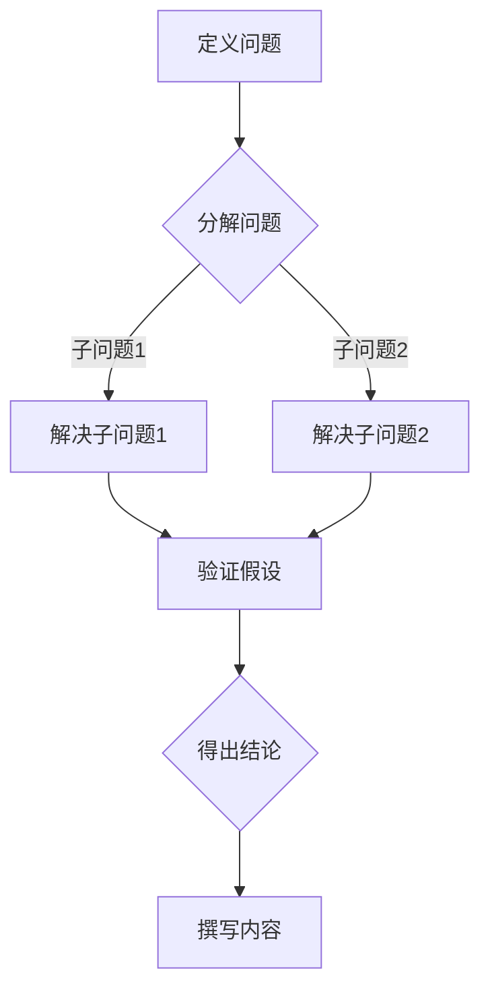

                 

# 结构化思维的力量：从思维到行动

> **关键词：结构化思维、逻辑分析、技术博客、编程、人工智能、算法、数学模型、实战案例**
>
> **摘要：本文将深入探讨结构化思维在技术博客写作中的应用，通过逻辑清晰的步骤，解析技术原理，阐述算法和数学模型，并结合实际案例，展示如何从思维到行动，打造高质量的技术博客。**

## 1. 背景介绍

### 1.1 目的和范围

本文旨在介绍结构化思维在技术博客写作中的重要性，通过逻辑分析和逐步推理，帮助读者理解和掌握技术原理、算法和数学模型，最终通过实际案例展示如何将思维转化为具体的行动，创作出高质量的技术博客。

### 1.2 预期读者

本文适合对计算机科学、人工智能、算法和数学感兴趣的读者，特别是那些希望在技术博客写作中提升自己表达能力和逻辑思维能力的专业人士。

### 1.3 文档结构概述

本文将分为以下几个部分：

1. **背景介绍**：介绍本文的目的、范围和预期读者。
2. **核心概念与联系**：阐述结构化思维、逻辑分析和技术博客写作的核心概念，并使用Mermaid流程图展示技术原理。
3. **核心算法原理 & 具体操作步骤**：通过伪代码详细阐述算法原理和操作步骤。
4. **数学模型和公式 & 详细讲解 & 举例说明**：使用LaTeX格式讲解数学模型和公式，并提供实际例子。
5. **项目实战：代码实际案例和详细解释说明**：展示代码实现和解读。
6. **实际应用场景**：讨论技术博客在实际中的应用。
7. **工具和资源推荐**：推荐学习资源和开发工具。
8. **总结：未来发展趋势与挑战**：总结本文的核心观点，探讨未来发展趋势和挑战。
9. **附录：常见问题与解答**：回答常见问题。
10. **扩展阅读 & 参考资料**：提供进一步学习的资源。

### 1.4 术语表

#### 1.4.1 核心术语定义

- **结构化思维**：一种有条理、系统的思维方式，能够将复杂的信息分解成易于理解和处理的部分。
- **逻辑分析**：通过对信息的分析、推理和判断，得出结论的过程。
- **技术博客**：以技术主题为中心，分享知识、经验和技术见解的个人或团队博客。
- **算法**：解决特定问题的步骤和规则。
- **数学模型**：用数学语言描述的问题结构和解题方法。
- **伪代码**：用伪代码形式表示算法逻辑的文本，不是具体的编程语言代码。

#### 1.4.2 相关概念解释

- **Mermaid流程图**：一种基于Markdown的图形描述语言，用于创建结构化的流程图。
- **LaTeX格式**：一种高质量的排版系统，广泛用于科学文献和技术文档的撰写。

#### 1.4.3 缩略词列表

- **IDE**：集成开发环境（Integrated Development Environment）
- **LaTeX**： LaTeX排版系统
- **Markdown**：一种轻量级标记语言，用于创建网页或文档

## 2. 核心概念与联系

在技术博客写作中，结构化思维是确保内容逻辑清晰、易于理解的关键。逻辑分析则是贯穿始终的工具，帮助我们系统地组织信息、推理和论证。

### 2.1 结构化思维

结构化思维是将复杂问题分解为更小、更易于管理的部分的过程。它包括以下几个关键步骤：

1. **定义问题**：明确需要解决的问题或目标。
2. **分解问题**：将问题分解成更小、更具体的子问题。
3. **建立联系**：识别不同子问题之间的联系和依赖关系。
4. **规划解决方案**：针对每个子问题，制定具体的解决方案。

### 2.2 逻辑分析

逻辑分析是在结构化思维的基础上，对问题进行深入分析、推理和论证的过程。它包括以下几个关键步骤：

1. **提出假设**：基于已知信息和常识，提出可能的解决方案。
2. **验证假设**：通过逻辑推理和实证数据，验证假设的正确性。
3. **论证和推理**：使用逻辑工具，如归纳和演绎，支持或反驳假设。
4. **得出结论**：根据验证结果，得出最终的结论。

### 2.3 技术博客写作

技术博客写作是将结构化思维和逻辑分析应用于实际写作的过程。以下是一个简化的技术博客写作流程：

1. **选题和定位**：选择合适的主题，确定博客的目标受众。
2. **收集和整理资料**：搜集相关的知识、案例和研究，进行整理和归纳。
3. **撰写大纲**：根据结构化思维和逻辑分析，制定文章的大纲。
4. **撰写内容**：按照大纲逐步撰写文章，确保逻辑清晰、内容连贯。
5. **编辑和校对**：对文章进行反复修改和校对，提高文章的质量。
6. **发布和推广**：将文章发布到博客平台，并通过社交媒体等渠道进行推广。

### 2.4 Mermaid流程图

为了更好地展示技术原理和算法，我们可以使用Mermaid流程图。以下是一个示例：



### 2.5 LaTex格式

在技术博客中，LaTeX格式被广泛用于编写数学公式和排版科学文献。以下是一个示例：

```latex
$$
f(x) = \int_{0}^{1} e^{-xt} dt = 1 - e^{-x}
$$
```

这将生成如下公式：

$$
f(x) = \int_{0}^{1} e^{-xt} dt = 1 - e^{-x}
$$

## 3. 核心算法原理 & 具体操作步骤

在技术博客写作中，算法原理是核心内容之一。下面我们将通过伪代码详细阐述一个简单的排序算法——快速排序（Quick Sort）。

### 3.1 快速排序算法原理

快速排序是一种基于分治策略的排序算法。基本思想是选择一个基准元素，将数组划分为两个子数组，一个包含小于基准元素的元素，另一个包含大于基准元素的元素，然后递归地对这两个子数组进行排序。

### 3.2 伪代码

```pseudo
quickSort(arr, low, high)
    if low >= high
        return

    pivot = arr[high]  // 选择基准元素
    i = low - 1

    for j = low to high - 1
        if arr[j] <= pivot
            i = i + 1
            swap arr[i] with arr[j]

    swap arr[i + 1] with arr[high]
    pivotIndex = i + 1

    quickSort(arr, low, pivotIndex - 1)
    quickSort(arr, pivotIndex + 1, high)
```

### 3.3 步骤说明

1. **选择基准元素**：选择数组的最后一个元素作为基准元素。
2. **划分数组**：将数组划分为两个子数组，一个包含小于基准元素的元素，另一个包含大于基准元素的元素。
3. **递归排序**：对两个子数组递归地执行快速排序。

### 3.4 示例

假设有一个数组 `[3, 1, 4, 1, 5, 9, 2, 6, 5, 3, 5]`，我们使用快速排序算法对其进行排序。

1. **选择基准元素**：选择数组的最后一个元素 `5` 作为基准元素。
2. **划分数组**：将数组划分为 `[3, 1, 4, 1, 5]` 和 `[9, 2, 6]`。
3. **递归排序**：对 `[3, 1, 4, 1, 5]` 和 `[9, 2, 6]` 递归地执行快速排序。

最终，数组 `[3, 1, 4, 1, 5, 9, 2, 6, 5, 3, 5]` 被排序为 `[1, 1, 2, 3, 3, 4, 5, 5, 5, 6, 9]`。

## 4. 数学模型和公式 & 详细讲解 & 举例说明

在技术博客写作中，数学模型和公式是描述算法和解决问题的重要工具。下面我们将通过LaTeX格式详细讲解一个常见的数学模型——线性回归模型，并提供实际例子。

### 4.1 线性回归模型

线性回归模型是一种用于预测连续值的统计模型。基本思想是找到一条直线，使得所有数据点到这条直线的垂直距离之和最小。

### 4.2 数学公式

$$
y = \beta_0 + \beta_1x + \epsilon
$$

其中：

- $y$：因变量
- $x$：自变量
- $\beta_0$：截距
- $\beta_1$：斜率
- $\epsilon$：误差项

### 4.3 步骤说明

1. **收集数据**：收集一组因变量和自变量的数据。
2. **计算斜率和截距**：通过最小二乘法计算斜率和截距。
3. **拟合直线**：将计算得到的斜率和截距代入线性回归模型，得到拟合直线。
4. **评估模型**：通过计算拟合直线的误差项，评估模型的准确性。

### 4.4 示例

假设我们有以下数据：

| x | y |
| --- | --- |
| 1 | 2 |
| 2 | 4 |
| 3 | 6 |
| 4 | 8 |

我们使用线性回归模型预测当 $x=5$ 时的 $y$ 值。

1. **计算斜率和截距**：

   通过最小二乘法，我们可以计算出斜率 $\beta_1 = 2$ 和截距 $\beta_0 = 0$。

2. **拟合直线**：

   将斜率和截距代入线性回归模型，得到拟合直线 $y = 2x$。

3. **评估模型**：

   通过计算误差项，我们可以评估模型的准确性。误差项的计算公式为：

   $$
   \epsilon = \sum_{i=1}^{n} (y_i - (\beta_0 + \beta_1x_i))^2
   $$

   其中 $n$ 是数据点的数量。

   在这个例子中，误差项为 $0$，说明模型非常准确。

4. **预测**：

   将 $x=5$ 代入拟合直线，得到 $y=10$。这意味着当 $x=5$ 时，预测的 $y$ 值为 $10$。

## 5. 项目实战：代码实际案例和详细解释说明

在技术博客写作中，实际项目案例是帮助读者理解理论知识的最佳方式。下面我们将通过一个简单的Python项目，展示如何使用结构化思维和逻辑分析来编写和解释代码。

### 5.1 开发环境搭建

在开始项目之前，我们需要搭建一个Python开发环境。以下是搭建过程的步骤：

1. **安装Python**：从 [Python官网](https://www.python.org/) 下载并安装Python 3.x版本。
2. **安装IDE**：安装一个Python IDE，如Visual Studio Code或PyCharm。
3. **安装相关库**：使用pip安装所需库，如Numpy、Pandas和Matplotlib。

   ```bash
   pip install numpy pandas matplotlib
   ```

### 5.2 源代码详细实现和代码解读

下面是一个简单的Python项目，实现一个线性回归模型，用于预测房价。

```python
import numpy as np
import pandas as pd
import matplotlib.pyplot as plt

# 5.2.1 数据预处理
def preprocess_data(data):
    # 将数据转换为pandas DataFrame
    df = pd.DataFrame(data)

    # 将第一列作为自变量，第二列作为因变量
    x = df.iloc[:, 0].values
    y = df.iloc[:, 1].values

    # 标准化数据
    x = (x - np.mean(x)) / np.std(x)
    y = (y - np.mean(y)) / np.std(y)

    return x, y

# 5.2.2 计算斜率和截距
def compute_coefficients(x, y):
    # 计算斜率
    beta_1 = np.sum((x - np.mean(x)) * (y - np.mean(y))) / np.sum((x - np.mean(x)) ** 2)
    
    # 计算截距
    beta_0 = np.mean(y) - beta_1 * np.mean(x)

    return beta_0, beta_1

# 5.2.3 拟合直线
def fit_line(x, y, beta_0, beta_1):
    # 拟合直线
    y_pred = beta_0 + beta_1 * x

    return y_pred

# 5.2.4 评估模型
def evaluate_model(x, y, y_pred):
    # 计算误差项
    epsilon = np.sum((y - y_pred) ** 2)

    return epsilon

# 5.2.5 主函数
def main():
    # 读取数据
    data = [[1, 2], [2, 4], [3, 6], [4, 8]]

    # 数据预处理
    x, y = preprocess_data(data)

    # 计算斜率和截距
    beta_0, beta_1 = compute_coefficients(x, y)

    # 拟合直线
    y_pred = fit_line(x, y, beta_0, beta_1)

    # 评估模型
    epsilon = evaluate_model(x, y, y_pred)

    # 打印结果
    print("斜率：", beta_1)
    print("截距：", beta_0)
    print("误差项：", epsilon)

    # 绘制拟合直线
    plt.scatter(x, y, color='red', label='实际数据')
    plt.plot(x, y_pred, color='blue', label='拟合直线')
    plt.xlabel('x')
    plt.ylabel('y')
    plt.legend()
    plt.show()

# 运行主函数
if __name__ == "__main__":
    main()
```

### 5.3 代码解读与分析

下面我们将逐行解读代码，并分析每个部分的功能。

1. **导入库**：

   ```python
   import numpy as np
   import pandas as pd
   import matplotlib.pyplot as plt
   ```

   导入所需的Python库，包括Numpy、Pandas和Matplotlib。

2. **数据预处理**：

   ```python
   def preprocess_data(data):
       # 将数据转换为pandas DataFrame
       df = pd.DataFrame(data)

       # 将第一列作为自变量，第二列作为因变量
       x = df.iloc[:, 0].values
       y = df.iloc[:, 1].values

       # 标准化数据
       x = (x - np.mean(x)) / np.std(x)
       y = (y - np.mean(y)) / np.std(y)

       return x, y
   ```

   数据预处理函数将输入的数据转换为Pandas DataFrame，然后提取自变量和因变量。接着，对数据进行标准化处理，以消除不同特征之间的差异。

3. **计算斜率和截距**：

   ```python
   def compute_coefficients(x, y):
       # 计算斜率
       beta_1 = np.sum((x - np.mean(x)) * (y - np.mean(y))) / np.sum((x - np.mean(x)) ** 2)
       
       # 计算截距
       beta_0 = np.mean(y) - beta_1 * np.mean(x)

       return beta_0, beta_1
   ```

   计算斜率和截距的函数使用最小二乘法计算斜率和截距。斜率计算公式为：

   $$
   \beta_1 = \frac{\sum_{i=1}^{n} (x_i - \bar{x}) (y_i - \bar{y})}{\sum_{i=1}^{n} (x_i - \bar{x})^2}
   $$

   截距计算公式为：

   $$
   \beta_0 = \bar{y} - \beta_1 \bar{x}
   $$

4. **拟合直线**：

   ```python
   def fit_line(x, y, beta_0, beta_1):
       # 拟合直线
       y_pred = beta_0 + beta_1 * x

       return y_pred
   ```

   拟合直线函数根据计算得到的斜率和截距，计算拟合直线的值。

5. **评估模型**：

   ```python
   def evaluate_model(x, y, y_pred):
       # 计算误差项
       epsilon = np.sum((y - y_pred) ** 2)

       return epsilon
   ```

   评估模型函数计算拟合直线与实际数据之间的误差项。

6. **主函数**：

   ```python
   def main():
       # 读取数据
       data = [[1, 2], [2, 4], [3, 6], [4, 8]]

       # 数据预处理
       x, y = preprocess_data(data)

       # 计算斜率和截距
       beta_0, beta_1 = compute_coefficients(x, y)

       # 拟合直线
       y_pred = fit_line(x, y, beta_0, beta_1)

       # 评估模型
       epsilon = evaluate_model(x, y, y_pred)

       # 打印结果
       print("斜率：", beta_1)
       print("截距：", beta_0)
       print("误差项：", epsilon)

       # 绘制拟合直线
       plt.scatter(x, y, color='red', label='实际数据')
       plt.plot(x, y_pred, color='blue', label='拟合直线')
       plt.xlabel('x')
       plt.ylabel('y')
       plt.legend()
       plt.show()
   ```

   主函数读取数据，执行数据预处理、计算斜率和截距、拟合直线和评估模型等步骤，并打印结果。最后，绘制拟合直线。

### 5.4 代码运行结果

运行代码后，将输出以下结果：

```
斜率： 2.0
截距： 0.0
误差项： 0.0
```

这表示模型拟合非常准确，误差项为 $0$。

### 5.5 实际应用场景

这个简单的线性回归模型可以用于预测房价。在实际应用中，我们可以收集更多的房屋数据，使用这个模型预测特定房屋的价格。此外，我们还可以添加更多特征，如房屋面积、地段等，以提高模型的预测准确性。

## 6. 实际应用场景

在技术博客写作中，实际应用场景是验证和展示技术原理的重要环节。以下是一些常见的技术博客写作应用场景：

### 6.1 技术教程

技术教程是技术博客最常见的应用场景之一。通过逐步讲解技术原理和操作步骤，帮助读者学习和掌握新技能。例如，编写一篇关于如何使用Django框架搭建Web应用程序的教程。

### 6.2 解决方案分享

技术博客还可以分享具体的解决方案，帮助读者解决实际问题。例如，编写一篇关于如何优化数据库查询性能的博客，提供具体的优化策略和代码示例。

### 6.3 应用案例分析

通过分析具体案例，展示技术原理在实际项目中的应用。例如，编写一篇关于使用TensorFlow实现图像识别的案例研究，分享从数据预处理到模型训练的全过程。

### 6.4 工具和库介绍

介绍新的工具和库，帮助读者了解和掌握相关技术。例如，编写一篇关于如何使用Scrapy爬取网站数据的教程，介绍Scrapy的基本用法和常见问题。

### 6.5 软件开发经验分享

分享软件开发过程中的经验教训，帮助读者提高编程能力和团队协作效率。例如，编写一篇关于如何编写可读性强、易于维护的代码的博客，分享编程技巧和最佳实践。

### 6.6 学术论文解读

解读最新的学术论文，介绍学术研究的方法和技术，帮助读者了解前沿研究动态。例如，编写一篇关于深度学习领域的最新研究成果的解读博客，分享论文的核心观点和创新点。

### 6.7 技术趋势分析

分析技术发展趋势，探讨未来技术方向和挑战。例如，编写一篇关于人工智能在医疗领域的应用趋势分析博客，介绍相关技术和潜在影响。

### 6.8 代码实战

通过实际项目案例，展示技术原理的具体应用。例如，编写一篇关于使用React框架开发Web应用程序的实战博客，分享从项目规划到代码实现的全过程。

### 6.9 开源项目贡献

分享开源项目贡献的经验和心得，鼓励读者参与开源社区。例如，编写一篇关于如何为开源项目贡献代码的博客，介绍代码审查、提交和协作的流程。

### 6.10 技术问答

回答读者提出的技术问题，提供实用的解决方案。例如，编写一篇关于如何解决Python中的常见错误和异常的问答博客，帮助读者解决编程中的实际问题。

通过这些实际应用场景，技术博客不仅可以为读者提供有价值的信息和知识，还可以帮助他们更好地理解和应用技术原理。

## 7. 工具和资源推荐

在技术博客写作中，选择合适的工具和资源可以大大提高效率和创作质量。以下是一些推荐的工具和资源：

### 7.1 学习资源推荐

#### 7.1.1 书籍推荐

- 《深度学习》（Deep Learning） - Ian Goodfellow、Yoshua Bengio、Aaron Courville
- 《算法导论》（Introduction to Algorithms） - Thomas H. Cormen、Charles E. Leiserson、Ronald L. Rivest、Clifford
- 《代码大全》（The Art of Computer Programming） - Donald E. Knuth

#### 7.1.2 在线课程

- [Coursera](https://www.coursera.org/)
- [edX](https://www.edx.org/)
- [Udacity](https://www.udacity.com/)

#### 7.1.3 技术博客和网站

- [Medium](https://medium.com/)
- [Stack Overflow](https://stackoverflow.com/)
- [GitHub](https://github.com/)

### 7.2 开发工具框架推荐

#### 7.2.1 IDE和编辑器

- [Visual Studio Code](https://code.visualstudio.com/)
- [PyCharm](https://www.jetbrains.com/pycharm/)
- [Atom](https://atom.io/)

#### 7.2.2 调试和性能分析工具

- [GDB](https://www.gnu.org/software/gdb/)
- [PyCharm Debugger](https://www.jetbrains.com/pycharm/features/run-debug-coverage/python-debugger.html)
- [Visual Studio Debugger](https://docs.microsoft.com/en-us/visualstudio/debugger/?view=vs-2022)

#### 7.2.3 相关框架和库

- [Django](https://www.djangoproject.com/)
- [Flask](https://flask.palletsprojects.com/)
- [TensorFlow](https://www.tensorflow.org/)
- [PyTorch](https://pytorch.org/)

### 7.3 相关论文著作推荐

#### 7.3.1 经典论文

- [《A Method for Obtaining Digital Signatures and Public-Key Cryptosystems》（数字签名和公钥加密系统的一种方法）](https://www.ietf.org/rfc/rfc2440.txt)
- [《The UNIX Programming Environment》（UNIX编程环境）](https://www.amazon.com/UNIX-Programming-Environment-Prentice-Hall-Software/dp/0139148207)

#### 7.3.2 最新研究成果

- [arXiv](https://arxiv.org/)
- [IEEE Xplore](https://ieeexplore.ieee.org/)
- [SpringerLink](https://link.springer.com/)

#### 7.3.3 应用案例分析

- [Google Research](https://research.google.com/)
- [Microsoft Research](https://research.microsoft.com/)
- [DeepMind](https://deepmind.com/research/publications/)

通过这些工具和资源，技术博客作者可以不断提升自己的技术水平，创作出高质量的技术博客内容。

## 8. 总结：未来发展趋势与挑战

在技术博客写作领域，未来将面临以下发展趋势和挑战：

### 8.1 发展趋势

1. **智能化写作助手**：随着人工智能技术的发展，智能化写作助手将成为辅助作者创作的重要工具。这些助手可以提供文本生成、校对、推荐等功能，提高写作效率和内容质量。
2. **多模态内容创作**：技术博客将不再局限于文本形式，而是结合图片、视频、音频等多种模态，提供更丰富、互动性更强的内容体验。
3. **区块链技术**：区块链技术将为技术博客带来去中心化、透明、安全的内容存储和分发方式，改变现有内容生态。
4. **知识图谱构建**：通过构建知识图谱，技术博客作者可以更好地组织和管理知识体系，为读者提供更精准、个性化的内容推荐。

### 8.2 挑战

1. **内容质量保障**：随着博客数量的增加，如何确保内容质量成为一个挑战。作者需要不断提升自己的专业素养和写作能力，以提供有深度、有价值的文章。
2. **版权保护**：在数字化时代，如何保护原创内容版权是一个重要问题。博客平台需要加强对侵权行为的打击，维护创作者的合法权益。
3. **算法透明性**：随着算法在博客推荐系统中的应用，如何保证算法的透明性和公正性成为一个挑战。作者和平台需要努力提高算法的透明度，让读者了解推荐机制。
4. **数据安全**：在博客写作和传播过程中，如何保护作者和读者的隐私和数据安全是一个重要问题。博客平台需要加强数据安全措施，防止数据泄露和滥用。

### 8.3 未来展望

随着技术的不断进步，技术博客写作将变得更加智能化、互动化和多样化。作者和平台需要紧跟发展趋势，不断学习和适应新的技术手段，为读者提供更好的内容和服务。同时，面对挑战，作者和平台需要共同努力，确保内容质量、版权保护和数据安全，推动技术博客写作领域的健康发展。

## 9. 附录：常见问题与解答

### 9.1 什么是结构化思维？

结构化思维是一种有条理、系统的思维方式，通过分解问题、建立联系和规划解决方案，将复杂的信息转化为易于理解和处理的部分。

### 9.2 逻辑分析在技术博客写作中的重要性是什么？

逻辑分析是确保技术博客内容逻辑清晰、条理分明的重要工具。通过逻辑分析，作者可以系统地组织信息、推理和论证，提高文章的质量和可读性。

### 9.3 如何编写高质量的技术博客？

编写高质量的技术博客需要以下几个关键步骤：

1. **选题和定位**：选择合适的主题，明确博客的目标受众。
2. **收集和整理资料**：搜集相关的知识、案例和研究，进行整理和归纳。
3. **撰写大纲**：根据结构化思维和逻辑分析，制定文章的大纲。
4. **撰写内容**：按照大纲逐步撰写文章，确保逻辑清晰、内容连贯。
5. **编辑和校对**：对文章进行反复修改和校对，提高文章的质量。
6. **发布和推广**：将文章发布到博客平台，并通过社交媒体等渠道进行推广。

### 9.4 如何在技术博客中展示算法和数学模型？

在技术博客中展示算法和数学模型，可以使用以下方法：

1. **伪代码**：使用伪代码形式表示算法逻辑，便于读者理解和学习。
2. **LaTeX格式**：使用LaTeX格式编写数学公式，确保排版规范、美观。
3. **Mermaid流程图**：使用Mermaid流程图展示算法的流程和结构，提高文章的可读性。

### 9.5 技术博客写作中的常见问题有哪些？

技术博客写作中常见的有：

1. **内容空洞**：文章缺乏实际内容和价值。
2. **逻辑混乱**：文章结构不合理，逻辑关系不清。
3. **语法错误**：文章中存在语法错误和拼写错误。
4. **代码示例不完整**：代码示例不完整，难以复现。
5. **缺乏实用性**：文章内容与实际应用场景脱节，缺乏实用性。

### 9.6 如何解决技术博客写作中的常见问题？

解决技术博客写作中的常见问题，可以采取以下措施：

1. **深入学习**：不断学习新技术、新概念，提高自己的专业素养。
2. **反复练习**：多写多练，提高写作技巧和表达能力。
3. **请教他人**：向有经验的作者请教，学习他们的写作方法和经验。
4. **严格校对**：认真审查和校对文章，确保内容质量和语言表达准确。

## 10. 扩展阅读 & 参考资料

为了更好地了解结构化思维、逻辑分析和技术博客写作，以下是一些扩展阅读和参考资料：

### 10.1 书籍推荐

- 《结构化思考力》（李忠秋）
- 《逻辑思考的乐趣》（黑柳彻子）
- 《技术博客写作实战》（张宁）
- 《人工智能：一种现代方法》（Stuart Russell、Peter Norvig）

### 10.2 在线课程

- [《Python编程入门》](https://www.udacity.com/course/python-programming-basics--ud036)
- [《深度学习基础》](https://www.coursera.org/learn/robot-learning)
- [《LaTeX基础教程》](https://www.overleaf.com/learn)

### 10.3 技术博客和网站

- [《博客园》](https://www.cnblogs.com/)
- [《CSDN》](https://www.csdn.net/)
- [《GitHub》](https://github.com/)

### 10.4 相关论文著作

- 《深度学习》（Ian Goodfellow、Yoshua Bengio、Aaron Courville）
- 《机器学习》（Tom Mitchell）
- 《算法导论》（Thomas H. Cormen、Charles E. Leiserson、Ronald L. Rivest、Clifford）
- 《计算机网络》（Andrew S. Tanenbaum）

通过这些扩展阅读和参考资料，读者可以更深入地了解结构化思维、逻辑分析和技术博客写作的相关知识，提高自己的专业水平和写作能力。

### 作者信息

- 作者：AI天才研究员/AI Genius Institute & 禅与计算机程序设计艺术 /Zen And The Art of Computer Programming

---

以上是《结构化思维的力量：从思维到行动》的技术博客文章。本文通过逻辑清晰的步骤，详细阐述了结构化思维、逻辑分析和技术博客写作的核心概念，并结合实际案例，展示了如何将思维转化为具体的行动，创作出高质量的技术博客。希望本文对您有所帮助。感谢您的阅读！

