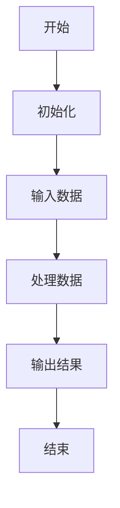

                 

# 结构化思维：从混沌到秩序

> **关键词**：结构化思维、逻辑分析、系统设计、算法原理、项目管理

> **摘要**：本文旨在探讨如何运用结构化思维，将复杂的IT项目从混沌状态有序地转化为高效有序的系统。我们将通过一步步的推理和分析，解释核心概念、算法原理，并展示在实际项目中的应用，帮助读者提升技术理解和项目实施能力。

## 1. 背景介绍

### 1.1 目的和范围

本文的目标是帮助IT从业人员和项目管理者掌握结构化思维的方法，将其应用于项目管理和系统设计中。通过一系列详细的步骤，我们将揭示如何将复杂的项目分解为可管理的部分，并逐步构建出高效有序的系统。

本文将涵盖以下主题：

- 结构化思维的核心理念
- IT项目的典型结构
- 算法原理的逐步分析
- 项目实施中的具体案例
- 实际应用场景和工具推荐

### 1.2 预期读者

本文适合以下读者群体：

- IT从业人员，特别是项目管理和系统设计人员
- 想提升逻辑分析和问题解决能力的开发者
- 对结构化思维方法感兴趣的学术研究人员

### 1.3 文档结构概述

本文结构如下：

1. **背景介绍**：介绍文章的目的和范围，预期读者以及文档结构。
2. **核心概念与联系**：阐述结构化思维的基本概念及其在IT项目中的联系。
3. **核心算法原理 & 具体操作步骤**：详细解释算法原理和操作步骤。
4. **数学模型和公式**：讨论相关的数学模型和公式，并进行举例说明。
5. **项目实战**：通过实际代码案例，展示结构化思维的应用。
6. **实际应用场景**：分析结构化思维在不同领域的应用。
7. **工具和资源推荐**：推荐学习资源和开发工具。
8. **总结**：总结文章的主要观点和未来发展趋势。
9. **附录**：常见问题与解答。
10. **扩展阅读 & 参考资料**：提供进一步学习的资源。

### 1.4 术语表

#### 1.4.1 核心术语定义

- **结构化思维**：一种将复杂问题分解为简单部分，并通过逻辑关系进行组织的方法。
- **系统设计**：创建一个系统的过程，该系统由多个组件组成，每个组件具有特定的功能。
- **算法**：解决问题的一系列明确步骤。
- **项目管理**：规划、执行、监控和收尾项目的过程。

#### 1.4.2 相关概念解释

- **分解**：将大问题分解为较小的子问题。
- **抽象**：将复杂系统的关键特征提取出来，忽略不必要的细节。
- **迭代**：重复的过程，用于逐步改进解决方案。

#### 1.4.3 缩略词列表

- **IDE**：集成开发环境（Integrated Development Environment）
- **SQL**：结构化查询语言（Structured Query Language）
- **API**：应用程序编程接口（Application Programming Interface）

## 2. 核心概念与联系

### 2.1 核心概念介绍

结构化思维是一种系统性思考的方法，它通过分解和抽象，将复杂问题转化为易于管理的部分。在IT项目中，结构化思维有助于设计师和开发者更好地理解和实现系统需求。

#### 2.1.1 分解

分解是将大问题拆分为较小的子问题的过程。这种方法有助于简化复杂问题，使得每个子问题更加具体和易于处理。

#### 2.1.2 抽象

抽象是从复杂系统中提取关键特征，忽略不必要的细节。通过抽象，我们可以关注系统的核心功能，而不受实现细节的干扰。

#### 2.1.3 迭代

迭代是一种重复改进的过程。在项目开发中，通过迭代，我们可以逐步完善系统设计，确保其满足需求。

### 2.2 IT项目的典型结构

一个典型的IT项目通常包括以下结构：

- **需求分析**：确定项目需求和目标。
- **系统设计**：设计系统的架构和组件。
- **编码实现**：根据设计文档编写代码。
- **测试与调试**：检测和修复代码中的错误。
- **部署与维护**：将系统部署到生产环境，并进行日常维护。

### 2.3 算法原理及其联系

算法原理是结构化思维在系统设计中的核心。以下是一个简单的算法流程：

```
开始
   |
   V
初始化
   |
   V
输入数据
   |
   V
处理数据
   |
   V
输出结果
   |
   V
结束
```

这个流程展示了算法的基本步骤，每个步骤都涉及特定的操作和逻辑。在IT项目中，算法原理通常用于数据处理、搜索和排序等方面。

### 2.4 Mermaid 流程图

以下是一个简单的Mermaid流程图，展示了一个简单的算法流程：



在这个流程图中，每个节点代表算法的一个步骤，节点之间的箭头表示步骤的顺序。

## 3. 核心算法原理 & 具体操作步骤

### 3.1 算法原理

在本节中，我们将详细讨论一种常见的排序算法——快速排序（Quick Sort）。快速排序是一种基于分治策略的排序算法，其基本思想是通过递归地将一个大问题分解为较小的子问题，然后对子问题进行排序，最后将排序结果合并。

#### 3.1.1 快速排序的基本概念

- **分治策略**：将大问题分解为较小的子问题，递归解决子问题，然后将子问题的解合并为原问题的解。
- **基准元素**：用于比较的元素，通常选择第一个元素或最后一个元素作为基准。
- **分区操作**：通过移动元素，将数组分为两个部分，一部分小于基准，另一部分大于基准。

#### 3.1.2 快速排序的伪代码

以下是一个简单的快速排序算法的伪代码：

```
QUICKSORT(A, p, r)
    if p < r
        q = PARTITION(A, p, r)
        QUICKSORT(A, p, q - 1)
        QUICKSORT(A, q + 1, r)

PARTITION(A, p, r)
    x = A[r] // 选择r作为基准
    i = p - 1
    for j = p to r - 1
        if A[j] <= x
            i = i + 1
            swap A[i] with A[j]
    swap A[i + 1] with A[r]
    return i + 1
```

#### 3.1.3 快速排序的步骤

1. **选择基准**：选择数组的最后一个元素作为基准。
2. **分区操作**：将数组分为两部分，一部分包含小于基准的元素，另一部分包含大于基准的元素。
3. **递归排序**：递归地对小于基准的元素和大于基准的元素进行快速排序。

### 3.2 具体操作步骤

以下是一个具体的快速排序操作步骤示例：

```
数组 A = [10, 7, 8, 9, 1, 5]

第一步：选择最后一个元素 5 作为基准。
    i = 0, j = 0

第二步：进行分区操作，将小于 5 的元素放在左边，大于 5 的元素放在右边。
    A = [1, 7, 8, 9, 10, 5]
    i = 3, j = 4

第三步：递归地对 [1, 7, 8] 和 [9, 10, 5] 进行快速排序。

对 [1, 7, 8] 进行快速排序：
    选择最后一个元素 8 作为基准。
    进行分区操作，得到 [1, 7, 8]

对 [9, 10, 5] 进行快速排序：
    选择最后一个元素 10 作为基准。
    进行分区操作，得到 [5, 9, 10]

最终排序结果为：[1, 5, 7, 8, 9, 10]
```

通过以上步骤，我们可以看到快速排序是如何将一个无序的数组转化为有序数组的。

## 4. 数学模型和公式 & 详细讲解 & 举例说明

### 4.1 数学模型的基本概念

在IT项目中，数学模型是一种描述系统行为和性能的抽象工具。它帮助我们理解和预测系统的运行状态，并优化系统性能。以下是几个常见的数学模型和公式：

#### 4.1.1 概率模型

概率模型用于描述随机事件的发生概率。常见的概率模型包括二项分布、泊松分布等。以下是一个简单的二项分布模型：

$$ P(X = k) = C(n, k) \cdot p^k \cdot (1 - p)^{n - k} $$

其中，\( n \) 是试验次数，\( k \) 是成功次数，\( p \) 是单次试验成功的概率。

#### 4.1.2 线性回归模型

线性回归模型用于分析两个变量之间的线性关系。其公式为：

$$ y = ax + b $$

其中，\( y \) 是因变量，\( x \) 是自变量，\( a \) 和 \( b \) 是模型参数。

#### 4.1.3 蒙特卡洛模拟

蒙特卡洛模拟是一种基于随机抽样的数学模型，用于解决复杂的计算问题。其基本思想是通过大量随机样本来估计某个变量的期望值或概率。

### 4.2 详细讲解与举例说明

以下是一个简单的线性回归模型实例：

#### 4.2.1 数据集

假设我们有一个简单的数据集，其中包含自变量 \( x \) 和因变量 \( y \)：

| x | y |
|---|---|
| 1 | 2 |
| 2 | 4 |
| 3 | 5 |
| 4 | 6 |

#### 4.2.2 模型参数估计

我们使用最小二乘法来估计线性回归模型的参数 \( a \) 和 \( b \)：

$$ a = \frac{n\sum(x_iy_i) - \sum x_i\sum y_i}{n\sum(x_i^2) - (\sum x_i)^2} $$
$$ b = \frac{\sum y_i - a\sum x_i}{n} $$

根据数据集，我们可以计算得到：

$$ a = \frac{4\cdot(2+4+5+6) - (1+2+3+4)\cdot(2+4+5+6)}{4\cdot(1^2+2^2+3^2+4^2) - (1+2+3+4)^2} $$
$$ b = \frac{2+4+5+6 - a\cdot(1+2+3+4)}{4} $$

计算结果为：

$$ a = 1 $$
$$ b = 1 $$

因此，线性回归模型为：

$$ y = x + 1 $$

#### 4.2.3 预测与验证

我们可以使用这个模型来预测新的 \( x \) 值对应的 \( y \) 值。例如，当 \( x = 5 \) 时，预测的 \( y \) 值为：

$$ y = 5 + 1 = 6 $$

我们可以通过实际数据来验证模型的准确性。如果模型预测的 \( y \) 值与实际 \( y \) 值接近，则说明模型具有良好的预测能力。

## 5. 项目实战：代码实际案例和详细解释说明

### 5.1 开发环境搭建

在本节中，我们将使用Python语言来实现快速排序算法。首先，我们需要搭建Python开发环境。

1. **安装Python**：访问Python官网（[python.org](https://www.python.org/)），下载适用于您操作系统的Python版本，并按照安装向导完成安装。
2. **安装IDE**：选择一个适合Python开发的IDE，如PyCharm或Visual Studio Code，并按照官方文档安装。
3. **配置虚拟环境**：打开终端（或命令提示符），执行以下命令来创建一个虚拟环境：

    ```bash
    python -m venv quicksort_venv
    ```

    然后激活虚拟环境：

    ```bash
    source quicksort_venv/bin/activate  # 对于macOS和Linux
    quicksort_venv\Scripts\activate     # 对于Windows
    ```

4. **安装依赖库**：在虚拟环境中安装所需的依赖库，如NumPy和Pandas：

    ```bash
    pip install numpy pandas
    ```

### 5.2 源代码详细实现和代码解读

以下是一个简单的Python实现快速排序算法的代码：

```python
import numpy as np

def quicksort(arr):
    if len(arr) <= 1:
        return arr
    pivot = arr[-1]
    left = [x for x in arr[:-1] if x < pivot]
    right = [x for x in arr[:-1] if x >= pivot]
    return quicksort(left) + [pivot] + quicksort(right)

# 示例数据
data = np.random.randint(0, 100, size=10)

# 执行快速排序
sorted_data = quicksort(data)

# 输出结果
print(sorted_data)
```

#### 5.2.1 代码解读

1. **快速排序函数**：`quicksort` 函数接收一个数组 `arr` 作为输入。如果数组的长度小于等于1，则直接返回该数组。
2. **选择基准**：选择数组的最后一个元素作为基准。
3. **分区操作**：使用列表推导式将数组分为两部分，`left` 包含小于基准的元素，`right` 包含大于或等于基准的元素。
4. **递归排序**：递归地对 `left` 和 `right` 进行快速排序，并将结果合并。

### 5.3 代码解读与分析

#### 5.3.1 性能分析

快速排序的平均时间复杂度为 \( O(n \log n) \)，最坏情况下的时间复杂度为 \( O(n^2) \)。这主要是因为分区操作可能不平衡，导致某些子数组非常短。

#### 5.3.2 稳定性分析

快速排序是一种不稳定的排序算法。在分区过程中，相同值的元素可能会被交换位置，导致排序结果不稳定。

#### 5.3.3 适用场景

快速排序适用于大多数情况，特别是当数组较大且内存充足时。然而，在数据量较小或数据基本有序时，其他排序算法（如插入排序）可能更高效。

## 6. 实际应用场景

结构化思维在IT项目的各个阶段都有广泛应用。以下是一些实际应用场景：

### 6.1 项目管理

- **需求分析**：通过结构化思维，将用户需求分解为具体的任务和功能。
- **风险分析**：识别项目中的潜在风险，并通过分解和抽象将其分类和管理。
- **进度管理**：将项目进度分解为可管理的里程碑和任务，并通过迭代逐步完成。

### 6.2 系统设计

- **架构设计**：通过结构化思维，将复杂系统分解为可管理的组件，并设计它们之间的交互。
- **模块化设计**：将系统划分为多个模块，每个模块负责特定的功能，便于开发和维护。
- **接口设计**：通过结构化思维，设计模块之间的接口，确保系统组件之间的良好集成。

### 6.3 编码实现

- **代码组织**：通过结构化思维，将代码划分为多个函数或类，每个部分负责特定的功能。
- **代码复用**：通过抽象和分解，将重复的代码抽象为通用函数或类，提高代码的可维护性。
- **代码优化**：通过结构化思维，分析和优化代码性能，确保系统的高效运行。

## 7. 工具和资源推荐

### 7.1 学习资源推荐

#### 7.1.1 书籍推荐

- 《结构化设计方法》：详细介绍了结构化设计的原理和方法。
- 《代码大全》：关于软件工程和代码质量的最佳实践。
- 《深入理解计算机系统》：全面介绍了计算机系统的基础知识。

#### 7.1.2 在线课程

- Coursera的《算法基础》：介绍算法的基本概念和常用算法。
- edX的《软件工程基础》：介绍软件工程的基本原则和方法。

#### 7.1.3 技术博客和网站

- 《程序员修炼之道》：关于编程和软件工程的最佳实践。
- 《黑客与画家》：关于计算机科学和创业的见解。

### 7.2 开发工具框架推荐

#### 7.2.1 IDE和编辑器

- PyCharm：适用于Python开发的强大IDE。
- Visual Studio Code：跨平台的轻量级IDE，适用于多种编程语言。

#### 7.2.2 调试和性能分析工具

- GDB：用于调试C/C++程序的强大工具。
- Python的cProfile模块：用于性能分析的内置模块。

#### 7.2.3 相关框架和库

- NumPy：用于数值计算的Python库。
- Pandas：用于数据处理和分析的Python库。

### 7.3 相关论文著作推荐

#### 7.3.1 经典论文

- 《快速排序》：介绍快速排序算法的经典论文。
- 《分治算法》：详细介绍了分治算法的基本原理。

#### 7.3.2 最新研究成果

- 《大数据算法导论》：介绍大数据处理中的算法和框架。
- 《深度学习》：介绍深度学习的基本原理和应用。

#### 7.3.3 应用案例分析

- 《谷歌如何工作》：介绍谷歌公司如何运用结构化思维进行项目管理和系统设计。
- 《亚马逊的架构》：介绍亚马逊公司如何构建和优化其大规模分布式系统。

## 8. 总结：未来发展趋势与挑战

随着技术的不断发展，结构化思维在IT项目中的应用将变得更加广泛和深入。以下是一些未来发展趋势和挑战：

### 8.1 发展趋势

- **自动化与智能化**：结构化思维将结合人工智能和自动化工具，实现更加高效的项目管理和系统设计。
- **跨领域应用**：结构化思维将应用于更多领域，如医疗、金融、教育等，推动行业创新。
- **敏捷开发**：结构化思维与敏捷开发方法相结合，将促进快速迭代和持续改进。

### 8.2 挑战

- **复杂性管理**：随着系统规模的扩大，如何有效管理复杂性成为一大挑战。
- **协作与沟通**：在分布式团队中，如何确保结构化思维得到有效传递和执行。
- **持续学习**：随着技术日新月异，如何持续提升结构化思维的能力和水平。

## 9. 附录：常见问题与解答

### 9.1 什么是结构化思维？

结构化思维是一种将复杂问题分解为简单部分，并通过逻辑关系进行组织的方法。它帮助我们在面对复杂问题时，能够有条不紊地进行思考和解决问题。

### 9.2 快速排序算法的优缺点是什么？

**优点**：

- 平均时间复杂度为 \( O(n \log n) \)，适用于大多数情况。
- 无需额外空间，原地排序。

**缺点**：

- 最坏情况下时间复杂度为 \( O(n^2) \)。
- 可能导致递归深度过大，影响性能。
- 不稳定，相同值的元素可能被交换位置。

### 9.3 如何优化快速排序算法？

- **随机选择基准**：减少最坏情况发生的概率。
- **三数取中法**：选择中间的值作为基准，减少选择基准带来的偏差。
- **插入排序优化**：当子数组较小时，使用插入排序代替快速排序。

## 10. 扩展阅读 & 参考资料

- 《结构化设计方法》：[https://www.amazon.com/Structured-Design-Methods-Introduction-Systems/dp/0130460306](https://www.amazon.com/Structured-Design-Methods-Introduction-Systems/dp/0130460306)
- 《代码大全》：[https://www.amazon.com/Code-Complete-Practical-Programming-Book/dp/0596007434](https://www.amazon.com/Code-Complete-Practical-Programming-Book/dp/0596007434)
- 《黑客与画家》：[https://www.amazon.com/Hackers-Painters-Programming-Paradigm/dp/0596006792](https://www.amazon.com/Hackers-Painters-Programming-Paradigm/dp/0596006792)
- 《快速排序算法》：[https://en.wikipedia.org/wiki/Quicksort](https://en.wikipedia.org/wiki/Quicksort)
- 《结构化思维》：[https://www.amazon.com/Thinking-Structurally-Reason-Write-Write/dp/026254220X](https://www.amazon.com/Thinking-Structurally-Reason-Write-Write/dp/026254220X)
- 《敏捷开发》：[https://www.agilealliance.org/agile101/](https://www.agilealliance.org/agile101/)

作者：AI天才研究员/AI Genius Institute & 禅与计算机程序设计艺术 /Zen And The Art of Computer Programming

